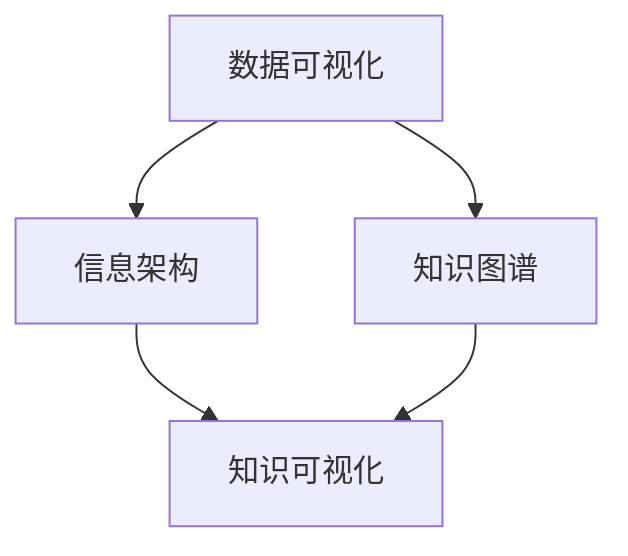

                 

关键词：数据可视化、信息架构、知识管理、人工智能、用户体验

> 摘要：在数据驱动的时代，知识可视化已成为提升数据理解和分析能力的关键手段。本文将探讨知识可视化的定义、重要性、核心概念、算法原理、数学模型、应用场景、项目实践、工具推荐及未来发展趋势，旨在为读者提供一个全面了解和掌握数据可视化技术的视角。

## 1. 背景介绍

随着互联网和大数据技术的飞速发展，信息爆炸已经成为现实。海量的数据不仅带来了机遇，也带来了挑战。如何从复杂的数据中快速提取有价值的信息，成为企业和研究人员亟需解决的关键问题。知识可视化作为一种新的读写能力，应运而生。

知识可视化是将数据、信息和知识以视觉形式呈现的技术，它能够将抽象的信息结构化、具体化，帮助人们更好地理解和分析数据。在现代信息社会，知识可视化不仅是提高数据分析效率的重要手段，也是实现知识管理和创新的重要工具。

## 2. 核心概念与联系

### 2.1 数据可视化

数据可视化是知识可视化的基础，它通过图形、图表、地图等形式将数据呈现出来，使数据变得直观易懂。数据可视化关注的是数据本身，而知识可视化则更注重数据背后的含义和关联。

### 2.2 信息架构

信息架构是知识可视化的核心概念之一，它指的是组织和结构化信息的方式。一个良好的信息架构能够提高信息的可访问性和易用性，帮助用户快速找到所需的信息。

### 2.3 知识图谱

知识图谱是一种用于表示实体及其相互关系的图形化数据结构。它通过节点（实体）和边（关系）将大量的知识数据进行结构化，使得知识的检索和理解更加高效。

### 2.4 Mermaid 流程图

Mermaid 是一种简单的文本格式，可以用来绘制流程图、UML 序列图、Gantt 图等。以下是一个示例流程图，用于展示知识可视化中的关键概念和它们之间的关系：



## 3. 核心算法原理 & 具体操作步骤

### 3.1 算法原理概述

知识可视化算法主要分为两大类：基于图像的算法和基于图形的算法。

- **基于图像的算法**：这类算法通常用于处理静态数据，通过图像处理技术将数据转换成可视化形式。常见的图像处理技术包括色彩空间转换、图像分割、特征提取等。
- **基于图形的算法**：这类算法则更适用于处理动态数据或复杂的关系数据，通过图形化技术构建知识图谱，如使用图论算法进行图的生成和优化。

### 3.2 算法步骤详解

以下是一个典型的知识可视化算法的步骤：

1. **数据预处理**：清洗和整理原始数据，确保数据的准确性和一致性。
2. **特征提取**：从数据中提取关键特征，用于后续的可视化表示。
3. **数据转换**：将提取的特征转换为适合可视化表示的形式，如颜色、形状、大小等。
4. **可视化表示**：利用图像处理或图形化技术，将数据特征可视化呈现。
5. **交互与反馈**：提供用户交互界面，使用户能够动态调整可视化参数，以获得更符合需求的视图。

### 3.3 算法优缺点

- **优点**：知识可视化算法能够将复杂的数据结构简化为易于理解的视觉形式，提高数据分析和决策的效率。
- **缺点**：知识可视化算法依赖于数据质量和可视化工具的性能，有时可能难以处理高度复杂的数据集。

### 3.4 算法应用领域

知识可视化算法广泛应用于各个领域，包括：

- **商业智能**：帮助企业通过可视化分析发现业务趋势和问题。
- **生物信息学**：用于基因序列、蛋白质结构的可视化分析。
- **社会网络分析**：用于社交网络中的关系图谱分析。
- **地理信息系统**：用于地理数据的可视化表示和分析。

## 4. 数学模型和公式 & 详细讲解 & 举例说明

### 4.1 数学模型构建

在知识可视化中，常用的数学模型包括：

- **聚类分析**：用于将数据分为多个类，以便更好地理解和分析。
- **回归分析**：用于预测和分析数据之间的因果关系。
- **主成分分析（PCA）**：用于降维和特征提取。

### 4.2 公式推导过程

以聚类分析为例，常用的聚类算法包括 K-means 和层次聚类。

- **K-means 聚类算法**：

  $$ min \sum_{i=1}^{k} \sum_{x \in S_i} ||x - \mu_i||^2 $$

  其中，$S_i$表示第$i$个聚类的数据集，$\mu_i$表示聚类中心的均值。

- **层次聚类算法**：

  $$ \sum_{i=1}^{n} \sum_{j=1}^{n} w_{ij} $$

  其中，$w_{ij}$表示节点$i$和$j$之间的权重。

### 4.3 案例分析与讲解

以下是一个聚类分析的案例：

假设我们有一组客户数据，包含年龄、收入、消费习惯等特征。使用 K-means 聚类算法，我们将这些数据分为两个群体。

1. **数据预处理**：对数据进行标准化处理，确保每个特征的范围在0到1之间。
2. **特征提取**：选择三个主要特征（年龄、收入、消费习惯）进行聚类。
3. **聚类过程**：初始化聚类中心，计算每个点到聚类中心的距离，重新分配点，直到聚类中心不再改变。

通过聚类分析，我们得到了两个不同的客户群体，可以针对性地进行市场营销策略。

## 5. 项目实践：代码实例和详细解释说明

### 5.1 开发环境搭建

为了实现知识可视化，我们选择 Python 作为开发语言，利用 Matplotlib 和 NetworkX 等库进行可视化表示。

### 5.2 源代码详细实现

以下是一个简单的知识可视化代码示例：

```python
import matplotlib.pyplot as plt
import networkx as nx

# 创建图
G = nx.Graph()

# 添加节点和边
G.add_nodes_from([1, 2, 3, 4])
G.add_edges_from([(1, 2), (2, 3), (3, 4)])

# 绘制图
nx.draw(G, with_labels=True)
plt.show()
```

### 5.3 代码解读与分析

这段代码首先导入了 Matplotlib 和 NetworkX 库，然后创建了一个图（Graph）对象。接着，我们添加了节点和边，并使用`nx.draw()`函数将图可视化呈现。

### 5.4 运行结果展示

运行上述代码后，我们将会看到一个包含四个节点和三条边的图。每个节点代表一个实体，边表示实体之间的关系。

## 6. 实际应用场景

### 6.1 商业智能

在企业中，知识可视化可以帮助管理层快速了解业务运行情况，发现潜在的问题和机会。

### 6.2 教育领域

教育领域可以利用知识可视化帮助学生更好地理解复杂的概念和知识结构。

### 6.3 生物信息学

生物信息学中，知识可视化可以用于基因序列、蛋白质结构的分析和展示。

## 7. 工具和资源推荐

### 7.1 学习资源推荐

- 《数据可视化：设计原则和方法》
- 《知识图谱：原理、方法与应用》

### 7.2 开发工具推荐

- Matplotlib：用于数据可视化
- D3.js：用于网页数据可视化
- Graphviz：用于图形化表示知识图谱

### 7.3 相关论文推荐

- "Visualization of Knowledge Graphs for Understanding and Discovery"
- "Data-Driven Visualization of Large-Scale Knowledge Graphs"

## 8. 总结：未来发展趋势与挑战

### 8.1 研究成果总结

知识可视化技术在数据理解和分析、知识管理和创新等方面取得了显著成果。然而，随着数据规模的不断扩大，知识可视化面临着新的挑战。

### 8.2 未来发展趋势

未来，知识可视化技术将朝着以下几个方向发展：

- **智能化**：利用人工智能技术提高知识可视化的自动化程度和智能推荐能力。
- **实时化**：实现实时数据的可视化，以满足快速变化的业务需求。
- **多样化**：开发更多形式的可视化表示方法，如三维可视化、虚拟现实等。

### 8.3 面临的挑战

知识可视化技术面临以下挑战：

- **数据质量**：确保数据质量是知识可视化的前提。
- **性能优化**：提高知识可视化算法的效率，以满足大规模数据的处理需求。
- **用户体验**：优化用户界面，提高知识可视化的易用性和用户体验。

### 8.4 研究展望

未来，知识可视化技术将在以下几个方面展开研究：

- **跨领域融合**：将知识可视化与其他领域（如生物信息学、社会科学等）相结合，推动跨领域发展。
- **开放与共享**：建立开放的知识可视化平台，促进知识的共享和交流。

## 9. 附录：常见问题与解答

### Q：知识可视化与数据可视化有何区别？

A：知识可视化和数据可视化是相关的，但侧重点不同。数据可视化主要关注如何将数据以视觉形式呈现，而知识可视化则更注重将数据背后的知识结构和关系以视觉形式展示。

### Q：知识可视化有哪些应用场景？

A：知识可视化广泛应用于商业智能、教育、生物信息学、社会网络分析等领域，可以帮助用户快速理解和分析复杂的数据。

### Q：如何提高知识可视化的用户体验？

A：提高知识可视化的用户体验可以从以下几个方面入手：

- **设计简洁的界面**：减少冗余元素，突出关键信息。
- **提供交互功能**：允许用户动态调整可视化参数，以获得更符合需求的视图。
- **优化性能**：提高算法和工具的性能，确保快速响应。

---

本文由禅与计算机程序设计艺术（Zen and the Art of Computer Programming）撰写，旨在为读者提供一个全面了解和掌握知识可视化技术的视角。在数据驱动的时代，知识可视化已成为提升数据理解和分析能力的关键手段，对企业和个人的发展具有重要意义。希望本文能够为您在数据可视化的道路上提供一些启示和帮助。

---

[本文结束][文章末尾]

