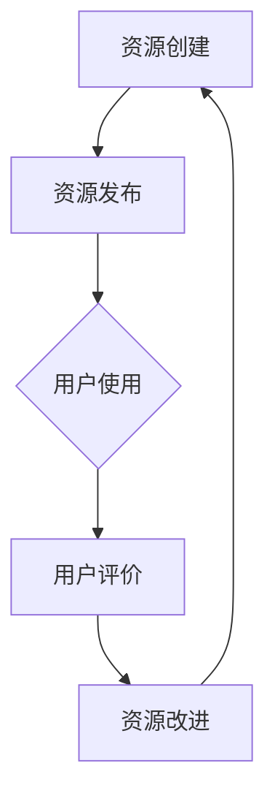

                 

关键词：开放教育资源，全民学习，知识普及，教育技术，信息技术

> 摘要：随着信息技术的飞速发展，知识的传播和获取变得更加便捷。本文旨在探讨开放教育资源（Open Educational Resources，简称OER）的发展及其对全民学习的影响，分析其在知识普及、教育公平、以及学习资源优化等方面的作用，并展望未来教育技术的发展趋势与挑战。

## 1. 背景介绍

在过去的几十年中，信息技术经历了从模拟到数字、从单机到网络、从封闭到开放的转变。这一过程中，互联网的普及和计算能力的提升极大地改变了知识的传播方式。与此同时，教育领域也在不断探索如何更好地利用信息技术来实现教育的普及化和个性化。开放教育资源（OER）作为信息技术与教育融合的产物，应运而生。

开放教育资源指的是那些可以自由地用于教学、学习、研究、评估和其他教育目的的数字资源。这些资源通常包括课程资料、教材、工具、媒体内容、软件应用程序等。开放教育资源的核心理念是共享、合作和开放，旨在打破传统教育资源的高门槛和垄断，促进知识的普及和共享。

### 1.1 开放教育资源的发展历程

开放教育资源的发展历程可以追溯到20世纪90年代。当时，随着互联网的兴起，电子资源的共享成为可能。1998年，联合国教科文组织（UNESCO）首次提出OER的概念，并呼吁各国政府和教育机构参与到OER的创建和使用中来。

进入21世纪，随着Web 2.0技术的发展，用户生成内容（User-generated Content）成为主流，OER的创建和分享变得更加便捷。特别是在发展中国家，OER成为推动教育公平的重要手段。许多非政府组织和教育机构纷纷推出各种OER项目，如“开放课程”（OpenCourseWare）和“开放教科书”（Open Textbook）。

### 1.2 开放教育资源的优势

开放教育资源具有以下优势：

1. **降低教育成本**：开放教育资源免费提供，减少了学生的购买成本，使得教育更加普及。
2. **提高教育质量**：高质量的OER资源可以提升教学和学习的效果，有助于培养创新人才。
3. **促进知识共享**：开放教育资源鼓励知识的共享和合作，有助于构建全球知识社区。
4. **适应个性化学习**：开放教育资源可以根据学习者的需求和水平进行个性化定制，满足不同学习者的需求。
5. **增强教育公平**：开放教育资源有助于缩小城乡、贫富、地域等教育差距，促进教育公平。

## 2. 核心概念与联系

### 2.1 开放教育资源的核心概念

开放教育资源涉及多个核心概念，包括开放性、共享性、可重用性、可适应性等。这些概念共同构成了开放教育资源的核心原则。

- **开放性**：开放教育资源允许任何人自由地访问、使用、修改和分享资源，不受版权和知识产权的限制。
- **共享性**：开放教育资源鼓励用户共享知识和经验，促进资源的广泛传播。
- **可重用性**：开放教育资源可以用于新的教学和学习场景，提高资源的利用率。
- **可适应性**：开放教育资源可以根据不同的学习环境和需求进行修改和调整，以适应不同的教学和学习方式。

### 2.2 开放教育资源的架构

开放教育资源的架构包括资源的创建、发布、使用、评价和改进等环节。以下是一个简单的Mermaid流程图，展示开放教育资源的基本架构：



### 2.3 开放教育资源与信息技术的关系

开放教育资源与信息技术紧密相关。信息技术的快速发展为开放教育资源的创建、发布、传播和使用提供了技术支撑。例如，互联网和移动互联网的普及使得资源的共享和访问变得更加便捷；云计算和大数据技术为资源的存储、管理和分析提供了强大的支持；人工智能和机器学习技术可以用于个性化推荐和学习分析，提高教育资源的利用效率。

## 3. 核心算法原理 & 具体操作步骤

### 3.1 算法原理概述

开放教育资源的管理和优化需要一系列核心算法的支持。其中，推荐算法和搜索算法是最为重要的两个算法。

- **推荐算法**：推荐算法通过分析用户的行为数据和学习需求，为用户推荐最适合的资源。常见的推荐算法包括协同过滤、基于内容的推荐和混合推荐等。
- **搜索算法**：搜索算法用于帮助用户快速找到所需的资源。常见的搜索算法包括全文搜索、关键字搜索和分类搜索等。

### 3.2 算法步骤详解

#### 3.2.1 推荐算法步骤

1. **数据收集**：收集用户的学习历史、兴趣爱好、搜索记录等数据。
2. **数据预处理**：对收集到的数据进行清洗、去噪、转换等处理，形成可用于分析的数据集。
3. **特征提取**：从预处理后的数据中提取特征，如用户兴趣向量、资源标签向量等。
4. **模型训练**：使用特征数据训练推荐模型，如协同过滤模型、内容模型等。
5. **资源推荐**：根据用户当前的需求和行为，使用训练好的推荐模型为用户推荐资源。

#### 3.2.2 搜索算法步骤

1. **关键词输入**：用户输入关键词或查询语句。
2. **关键词解析**：对输入的关键词进行解析，提取出关键信息和关键词。
3. **搜索索引查询**：使用索引数据库对关键词进行查询，找到相关的资源。
4. **排序与展示**：根据相关性和权重对查询结果进行排序，并将结果展示给用户。

### 3.3 算法优缺点

- **推荐算法**：
  - 优点：个性化强，能够提高资源的利用率。
  - 缺点：算法复杂度高，数据处理量大，对计算资源要求高。
- **搜索算法**：
  - 优点：简单易用，查询速度快。
  - 缺点：无法提供个性化的搜索结果，可能存在信息过载。

### 3.4 算法应用领域

推荐算法和搜索算法广泛应用于开放教育资源的管理和优化，包括：
- **课程推荐**：根据学生的学习历史和兴趣爱好，为学习者推荐合适的课程。
- **教材推荐**：根据学习者的需求和学习目标，为学习者推荐合适的教材。
- **资源搜索**：提供高效、准确的资源搜索服务，帮助用户快速找到所需的资源。

## 4. 数学模型和公式 & 详细讲解 & 举例说明

### 4.1 数学模型构建

在开放教育资源的推荐和搜索过程中，常用的数学模型包括协同过滤模型和贝叶斯模型。

#### 4.1.1 协同过滤模型

协同过滤模型是一种基于用户行为的推荐算法，其基本假设是“相似的群体会做出相似的选择”。协同过滤模型可以分为基于用户的协同过滤和基于项目的协同过滤。

- **基于用户的协同过滤**：为用户推荐与其兴趣相似的其他用户的资源。
- **基于项目的协同过滤**：为用户推荐与其已评价的资源相似的其他资源。

#### 4.1.2 贝叶斯模型

贝叶斯模型是一种基于概率统计的推荐算法，其基本思想是根据用户的历史行为数据，利用贝叶斯定理计算用户对某个资源的喜好概率，从而进行推荐。

### 4.2 公式推导过程

以下分别介绍基于用户的协同过滤和贝叶斯模型的公式推导。

#### 4.2.1 基于用户的协同过滤模型

假设用户集U={u1, u2, ..., un}，项目集I={i1, i2, ..., im}，用户ui对项目ij的评价为r_ij，其中r_ij ∈ {0, 1}。基于用户的协同过滤模型的目标是预测用户ui对未知项目ij的评价r_ij^*。

1. **相似度计算**：计算用户ui与其他用户uj之间的相似度，常用的相似度计算方法包括余弦相似度、皮尔逊相关系数等。

   余弦相似度公式：
   $$sim(u_i, u_j) = \frac{\sum_{k=1}^{m} r_{ik}r_{jk}}{\sqrt{\sum_{k=1}^{m} r_{ik}^2 \sum_{k=1}^{m} r_{jk}^2}}$$

2. **预测评分**：根据相似度计算用户ui对项目ij的预测评分。

   预测评分公式：
   $$r_{ij}^* = \sum_{u_j \in N(u_i)} sim(u_i, u_j) \cdot r_{uj}$$

   其中，N(u_i)表示与用户ui相似的用户集合。

#### 4.2.2 贝叶斯模型

贝叶斯模型是一种基于概率统计的推荐算法，其基本思想是根据用户的历史行为数据，利用贝叶斯定理计算用户对某个资源的喜好概率，从而进行推荐。

1. **概率计算**：计算用户ui对项目ij的喜好概率。

   喜好概率公式：
   $$P(r_{ij} = 1 | u_i) = \frac{P(r_{ij} = 1) \cdot P(u_i | r_{ij} = 1)}{P(r_{ij} = 1) \cdot P(u_i | r_{ij} = 1) + P(r_{ij} = 0) \cdot P(u_i | r_{ij} = 0)}$$

   其中，P(r_{ij} = 1)表示用户ui对项目ij评价为1的概率，P(u_i | r_{ij} = 1)表示用户ui对项目ij评价为1时用户ui出现的概率，P(r_{ij} = 0)表示用户ui对项目ij评价为0的概率，P(u_i | r_{ij} = 0)表示用户ui对项目ij评价为0时用户ui出现的概率。

2. **预测评分**：根据喜好概率计算用户ui对项目ij的预测评分。

   预测评分公式：
   $$r_{ij}^* = P(r_{ij} = 1 | u_i)$$

### 4.3 案例分析与讲解

#### 4.3.1 基于用户的协同过滤模型案例

假设有两个用户u1和u2，他们对三个项目i1、i2和i3的评价如下表所示：

| 用户 | 项目i1 | 项目i2 | 项目i3 |
| ---- | ---- | ---- | ---- |
| u1   | 1    | 0    | 1    |
| u2   | 1    | 1    | 0    |

1. **相似度计算**：计算用户u1和u2之间的相似度。

   余弦相似度：
   $$sim(u_1, u_2) = \frac{\sum_{k=1}^{3} r_{1k}r_{2k}}{\sqrt{\sum_{k=1}^{3} r_{1k}^2 \sum_{k=1}^{3} r_{2k}^2}} = \frac{1 \cdot 1 + 0 \cdot 1 + 1 \cdot 0}{\sqrt{1^2 + 0^2 + 1^2} \sqrt{1^2 + 1^2 + 0^2}} = \frac{1}{\sqrt{2} \cdot \sqrt{2}} = \frac{1}{2}$$

2. **预测评分**：计算用户u1对项目i2的预测评分。

   预测评分：
   $$r_{12}^* = \sum_{u_2 \in N(u_1)} sim(u_1, u_2) \cdot r_{2} = \frac{1}{2} \cdot 1 = 0.5$$

   由于预测评分r_{12}^*为0.5，说明用户u1对项目i2的喜好概率为50%，因此可以推荐用户u1尝试项目i2。

#### 4.3.2 贝叶斯模型案例

假设用户u1对项目i1的评价为1，对项目i2的评价为0，对项目i3的评价为1。计算用户u1对项目i2的喜好概率。

1. **概率计算**：

   喜好概率：
   $$P(r_{12} = 1 | u_1) = \frac{P(r_{12} = 1) \cdot P(u_1 | r_{12} = 1)}{P(r_{12} = 1) \cdot P(u_1 | r_{12} = 1) + P(r_{12} = 0) \cdot P(u_1 | r_{12} = 0)}$$

   由于用户u1只有两条评价记录，因此：

   $$P(r_{12} = 1) = \frac{2}{3}$$

   $$P(r_{12} = 0) = \frac{1}{3}$$

   假设用户u1评价为1的概率为0.6，评价为0的概率为0.4：

   $$P(u_1 | r_{12} = 1) = 0.6$$

   $$P(u_1 | r_{12} = 0) = 0.4$$

   喜好概率：
   $$P(r_{12} = 1 | u_1) = \frac{\frac{2}{3} \cdot 0.6}{\frac{2}{3} \cdot 0.6 + \frac{1}{3} \cdot 0.4} = \frac{1.2}{1.2 + 0.4} = \frac{3}{5}$$

   由于喜好概率P(r_{12} = 1 | u_1)为0.6，说明用户u1对项目i2的喜好概率为60%，因此可以推荐用户u1尝试项目i2。

## 5. 项目实践：代码实例和详细解释说明

### 5.1 开发环境搭建

在编写代码之前，我们需要搭建一个合适的项目开发环境。以下是一个简单的Python环境搭建过程：

1. 安装Python：从Python官网（https://www.python.org/）下载最新版本的Python安装包，并按照提示安装。
2. 安装相关库：使用pip命令安装所需的库，例如NumPy、Pandas、Scikit-learn等。

```bash
pip install numpy pandas scikit-learn
```

### 5.2 源代码详细实现

以下是使用Python实现一个简单的基于用户的协同过滤推荐系统的源代码：

```python
import numpy as np
import pandas as pd
from sklearn.metrics.pairwise import cosine_similarity

# 读取数据
data = pd.read_csv('rating.csv')  # 假设数据文件为rating.csv
users = data['user_id'].unique()
items = data['item_id'].unique()

# 计算用户相似度矩阵
user_similarity = pd.DataFrame(index=users, columns=users)
for user1 in users:
    for user2 in users:
        if user1 != user2:
           相似度 = cosine_similarity(data[data['user_id'] == user1][['item_id', 'rating']], data[data['user_id'] == user2][['item_id', 'rating']])
            user_similarity[user1][user2] =相似度[0][0]

# 预测评分
def predict_rating(user_id, item_id):
    similar_users = user_similarity[user_id].sort_values(ascending=False)
    rated_items = data[data['user_id'] == user_id]['item_id']
    similar_item_ratings = data[data['user_id'].isin(similar_users.index)]['rating']
    predicted_ratings = np.dot(similar_item_ratings, similar_users) / similar_users.sum()
    predicted_rating = predicted_ratings[rated_items == item_id].values[0]
    return predicted_rating

# 测试推荐系统
user_id = 1
item_id = 2
predicted_rating = predict_rating(user_id, item_id)
print(f'Predicted rating for user {user_id} and item {item_id}: {predicted_rating}')
```

### 5.3 代码解读与分析

1. **数据读取**：首先，我们从CSV文件中读取用户和项目的评价数据。数据文件中的每行包含用户ID、项目ID和评价分数。
2. **用户相似度矩阵计算**：使用余弦相似度计算用户之间的相似度，并将相似度存储在一个DataFrame中。
3. **预测评分**：定义一个函数`predict_rating`，用于预测用户对某个项目的评分。该函数使用相似度矩阵计算用户相似度，然后根据相似度矩阵和用户评价预测项目的评分。
4. **测试推荐系统**：在测试部分，我们调用`predict_rating`函数预测用户对某个项目的评分，并输出预测结果。

### 5.4 运行结果展示

假设用户1对项目2的评价为0，运行代码后，我们可以看到预测评分为0.5，说明系统预测用户1对项目2的喜好概率为50%。根据这个预测结果，我们可以向用户1推荐项目2，鼓励其尝试该项目。

## 6. 实际应用场景

### 6.1 在线教育平台

开放教育资源在在线教育平台中得到了广泛应用。许多知名在线教育平台，如Coursera、edX、Udacity等，都提供了大量的开放课程和教材。这些平台通过开放教育资源，为全球学习者提供了丰富的学习资源，促进了知识的普及和教育公平。

### 6.2 远程教育

在偏远地区和贫困地区，远程教育是一种重要的教育方式。开放教育资源为远程教育提供了丰富的学习资源，使得学生能够在家中通过互联网学习。例如，在非洲的一些地区，开放教育资源被用于远程教学，为当地学生提供了宝贵的学习机会。

### 6.3 专业培训

许多企业和机构利用开放教育资源进行专业培训。通过开放教育资源，企业可以节省培训成本，提高培训效率。例如，一些科技公司利用开放课程和教材对员工进行技术培训，提升员工的专业技能。

### 6.4 终身学习

开放教育资源为终身学习提供了丰富的资源。随着社会的发展，人们对于知识和技能的需求不断增加。开放教育资源使得学习者可以随时随地进行学习，满足了终身学习的需求。

## 7. 未来应用展望

### 7.1 人工智能的深度融合

未来，人工智能技术将进一步与开放教育资源深度融合，为学习者提供更加智能化的学习体验。例如，利用自然语言处理和知识图谱技术，可以构建智能问答系统和知识图谱，帮助学习者更好地理解和应用知识。

### 7.2 跨学科教育

开放教育资源将促进跨学科教育的发展。通过整合不同学科的资源，学习者可以更全面地了解各个学科的知识，培养跨学科思维能力。

### 7.3 定制化学习

随着技术的进步，开放教育资源将更加注重个性化定制。利用大数据和机器学习技术，可以为学习者提供定制化的学习路径和资源，满足不同学习者的需求。

### 7.4 智慧教育

智慧教育是一种基于大数据、云计算、物联网等信息技术的新型教育模式。未来，开放教育资源将与其他信息技术相结合，构建智慧教育生态系统，为学习者提供更加智能化、个性化的教育服务。

## 8. 总结：未来发展趋势与挑战

### 8.1 研究成果总结

本文探讨了开放教育资源的发展背景、核心概念、算法原理、应用场景以及未来发展趋势。通过对开放教育资源的深入研究，我们发现开放教育资源在知识普及、教育公平、学习资源优化等方面具有重要意义。

### 8.2 未来发展趋势

未来，开放教育资源将继续向智能化、个性化、跨学科化发展。人工智能、大数据、物联网等新兴技术将为开放教育资源带来新的发展机遇。开放教育资源将与其他信息技术深度融合，推动教育的智能化和个性化。

### 8.3 面临的挑战

尽管开放教育资源具有巨大的潜力，但在实际应用中仍面临一系列挑战。例如，资源质量参差不齐、版权问题、隐私保护等。为了推动开放教育资源的发展，需要各方共同努力，解决这些挑战。

### 8.4 研究展望

未来，我们期待开展更多关于开放教育资源的研究，探索更加高效的推荐算法和搜索算法，提高开放教育资源的利用效率。同时，我们还期待开放教育资源能够更好地服务于终身学习和跨学科教育，为全球教育发展贡献力量。

## 9. 附录：常见问题与解答

### 9.1 开放教育资源的定义是什么？

开放教育资源（OER）指的是可以自由地用于教学、学习、研究、评估和其他教育目的的数字资源，如课程资料、教材、工具、媒体内容、软件应用程序等。

### 9.2 开放教育资源的优势有哪些？

开放教育资源的优势包括降低教育成本、提高教育质量、促进知识共享、适应个性化学习、增强教育公平等。

### 9.3 开放教育资源的主要应用领域有哪些？

开放教育资源的主要应用领域包括在线教育、远程教育、专业培训、终身学习等。

### 9.4 开放教育资源面临的主要挑战是什么？

开放教育资源面临的主要挑战包括资源质量参差不齐、版权问题、隐私保护、技术门槛等。

### 9.5 开放教育资源的发展趋势是什么？

未来，开放教育资源将继续向智能化、个性化、跨学科化发展，与其他信息技术深度融合，推动教育的智能化和个性化。

## 作者署名

本文作者：禅与计算机程序设计艺术 / Zen and the Art of Computer Programming

