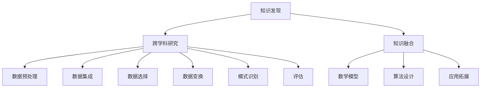

                 

 > **关键词**：跨学科研究、知识发现、人工智能、数学模型、算法、应用场景、工具和资源。

> **摘要**：本文探讨了跨学科研究在知识发现领域的重要性。通过分析核心概念、算法原理、数学模型以及项目实践，本文揭示了知识融合在现代信息技术中的关键作用，并展望了未来的发展趋势与挑战。

## 1. 背景介绍

在当今快速发展的信息技术时代，跨学科研究已经成为推动科技进步的重要动力。传统的学科界限逐渐模糊，跨学科的融合研究在人工智能、生物信息学、数据科学等领域展现出巨大的潜力。知识的融合不仅能够突破单一学科的局限性，还能够促进新理论、新方法、新工具的诞生，从而推动整个科技领域的创新。

知识发现作为人工智能和数据科学的核心任务之一，旨在从大量数据中自动提取出隐含的、未被识别的知识。这一过程涉及到多个学科领域的交叉，包括计算机科学、数学、统计学、物理学等。跨学科的知识融合在知识发现中扮演着至关重要的角色，它能够提升算法的性能，优化数学模型的构建，并拓展应用领域。

本文将围绕知识的融合这一核心主题，首先介绍跨学科研究的基本概念和重要性，然后深入探讨知识发现的核心算法原理和数学模型，接着通过项目实践展示知识融合的实际应用，最后对未来的发展趋势和挑战进行展望。

## 2. 核心概念与联系

为了更好地理解知识融合的重要性，我们需要首先介绍几个核心概念，包括知识发现、跨学科研究、以及它们之间的关系。

### 2.1 知识发现

知识发现（Knowledge Discovery in Databases，KDD）是一个从大量数据中通过自动化的过程发现有价值知识的过程。它通常包括数据预处理、数据集成、数据选择、数据变换、模式识别和评估等多个步骤。知识发现的核心目标是从原始数据中提取出隐含的、未知的、有价值的信息，为决策制定、科学研究和其他应用提供支持。

### 2.2 跨学科研究

跨学科研究是指将来自不同学科的知识、方法和技术结合起来，以解决单一学科无法独立解决的问题。跨学科研究的特点是强调多学科之间的互动与融合，通过综合不同学科的理论和方法，提供更加全面和深入的解决方案。在知识发现领域，跨学科研究的重要性体现在以下几个方面：

- **方法互补**：不同学科的方法和工具可以互相补充，优化知识发现的过程。
- **视角多样**：跨学科研究能够从多个角度审视问题，减少盲点，提高发现价值的可能性。
- **创新驱动**：跨学科研究往往能够催生新的理论、模型和方法，推动知识发现技术的发展。

### 2.3 核心概念之间的联系

知识发现与跨学科研究之间存在着紧密的联系。知识发现作为一个跨学科领域，其过程涉及到数据科学、计算机科学、统计学等多个学科的知识。跨学科研究则为知识发现提供了强大的工具和方法，使得从海量数据中提取知识成为可能。

知识融合是知识发现的核心概念之一，它强调了在知识发现过程中，不同学科知识的整合与融合。通过知识融合，我们能够构建更加全面和深入的数学模型，设计出更加有效的算法，并拓展知识发现的应用领域。

### 2.4 Mermaid 流程图

为了更直观地展示知识融合的过程，我们使用Mermaid流程图来描述跨学科研究与知识发现之间的关系。以下是流程图的具体实现：



通过上述流程图，我们可以看到跨学科研究如何贯穿于知识发现的各个环节，并通过知识融合实现各个环节的有机结合。

## 3. 核心算法原理 & 具体操作步骤

### 3.1 算法原理概述

知识发现的核心算法包括关联规则学习、聚类分析、分类算法等。这些算法的共同目标是从大量数据中提取出有价值的知识模式。以下是这些算法的基本原理：

#### 3.1.1 关联规则学习

关联规则学习是一种用于发现数据集中项之间关系的方法。其基本思想是通过计算各项之间的支持度和置信度来发现频繁项集，进而生成关联规则。支持度表示一个项集在所有数据记录中出现的频率，而置信度则表示在同时出现两个项集的情况下，第二个项集出现的条件概率。

#### 3.1.2 聚类分析

聚类分析是一种无监督学习方法，旨在将相似的数据点划分为同一组。聚类分析的核心任务是定义相似度度量，常用的方法包括K-means、层次聚类等。这些算法通过优化目标函数（如平方误差或相似度最大化）来实现聚类。

#### 3.1.3 分类算法

分类算法是一种监督学习方法，用于将数据点分为预定义的类别。常见的分类算法包括决策树、支持向量机、朴素贝叶斯等。这些算法通过学习训练数据中的特征和标签之间的关系，构建分类模型，从而对新数据进行分类预测。

### 3.2 算法步骤详解

以下是知识发现核心算法的具体操作步骤：

#### 3.2.1 数据预处理

数据预处理是知识发现过程中的第一步，主要包括数据清洗、数据集成、数据转换等。

- **数据清洗**：通过去除重复记录、处理缺失值、纠正错误等，提高数据质量。
- **数据集成**：将来自不同来源的数据整合到一个统一的格式中，便于后续处理。
- **数据转换**：将数据转换为适合算法处理的形式，如归一化、离散化等。

#### 3.2.2 数据选择

数据选择是针对预处理后的数据进行筛选，以减少数据量并提高算法效率。常用的方法包括：

- **特征选择**：通过评估特征的重要性，选择对目标变量影响最大的特征。
- **采样**：通过随机采样或基于特定条件采样，减少数据量。

#### 3.2.3 数据变换

数据变换包括数据规范化、特征提取和特征选择等操作，以优化算法性能。

- **数据规范化**：将不同特征的范围调整为相同尺度，消除特征之间的量纲影响。
- **特征提取**：通过特征变换或降维技术，提取数据中的关键特征。
- **特征选择**：选择对目标变量贡献最大的特征，降低模型复杂度。

#### 3.2.4 模式识别

模式识别是知识发现的核心步骤，通过各种算法从数据中提取出有价值的模式。

- **关联规则学习**：通过计算支持度和置信度，发现频繁项集并生成关联规则。
- **聚类分析**：通过优化目标函数，将数据点划分为不同的簇。
- **分类算法**：通过训练数据构建分类模型，对新数据进行分类预测。

#### 3.2.5 评估

评估是对知识发现结果的质量进行判断，常用的评估指标包括准确率、召回率、F1分数等。通过评估，可以验证算法的有效性和实用性。

### 3.3 算法优缺点

各种知识发现算法各有优缺点，以下是主要算法的优缺点分析：

#### 3.3.1 关联规则学习

- **优点**：简单直观，易于理解和实现。
- **缺点**：对大数据集性能较差，可能产生大量冗余规则。

#### 3.3.2 聚类分析

- **优点**：无需预先指定类别，能够自动发现数据结构。
- **缺点**：对初始值敏感，可能陷入局部最优。

#### 3.3.3 分类算法

- **优点**：准确率高，适用于各种类型的数据。
- **缺点**：需要大量训练数据，模型复杂度较高。

### 3.4 算法应用领域

知识发现算法广泛应用于多个领域，如电子商务、医疗保健、金融分析、智能交通等。以下是一些具体的应用实例：

- **电子商务**：通过关联规则学习，发现商品之间的促销组合，提高销售额。
- **医疗保健**：通过聚类分析，识别潜在疾病风险群体，进行早期干预。
- **金融分析**：通过分类算法，预测股票价格走势，指导投资决策。
- **智能交通**：通过聚类分析，优化交通信号控制，减少拥堵。

## 4. 数学模型和公式 & 详细讲解 & 举例说明

### 4.1 数学模型构建

在知识发现过程中，数学模型扮演着关键角色。以下我们将构建几个核心的数学模型，并解释它们的基本原理。

#### 4.1.1 关联规则模型

关联规则模型的核心是支持度和置信度。假设我们有一个数据集，其中包含n个事务，每个事务包含m个项。设A和B是两个不同的项集，则：

- **支持度（Support）**：表示项集A和B同时出现的频率，计算公式为：
  $$ Support(A \cup B) = \frac{count(A \cup B)}{n} $$
- **置信度（Confidence）**：表示在事务中出现项集A的情况下，同时出现项集B的概率，计算公式为：
  $$ Confidence(A \rightarrow B) = \frac{Support(A \cup B)}{Support(A)} $$

#### 4.1.2 聚类分析模型

聚类分析中的核心模型是K-means算法。K-means算法的目标是将数据点划分为K个簇，使得每个簇内部的点尽可能接近，簇与簇之间的点尽可能远。K-means算法的基本步骤如下：

- **初始化**：随机选择K个初始中心点。
- **分配**：将每个数据点分配到距离其最近的中心点所在的簇。
- **更新**：重新计算每个簇的中心点，并重复分配步骤，直到中心点不再发生变化或达到最大迭代次数。

目标函数为：
$$ Objective\ Function = \sum_{i=1}^{K} \sum_{x \in S_i} ||x - \mu_i||^2 $$
其中，$S_i$表示第i个簇，$\mu_i$表示第i个簇的中心点。

#### 4.1.3 分类模型

在分类问题中，常见的数学模型包括决策树、支持向量机和朴素贝叶斯等。以下以朴素贝叶斯模型为例进行讲解。

朴素贝叶斯模型基于贝叶斯定理和特征条件独立性假设。设D为数据集，包含m个特征，C为分类标签，则：

- **先验概率**：
  $$ P(C) = \frac{count(C)}{n} $$
- **条件概率**：
  $$ P(X_i | C) = \frac{count(X_i \cap C)}{count(C)} $$
- **后验概率**：
  $$ P(C | X) = \frac{P(X | C)P(C)}{P(X)} $$

其中，$X$表示特征向量。

### 4.2 公式推导过程

以下是关联规则模型中支持度和置信度的推导过程：

#### 4.2.1 支持度推导

设A和B是两个不同的项集，$count(A \cup B)$表示A和B同时出现的次数，$n$表示事务总数。

支持度定义为：
$$ Support(A \cup B) = \frac{count(A \cup B)}{n} $$

推导过程：
$$ Support(A \cup B) = \frac{count(A) + count(B) - count(A \cap B)}{n} $$
由于A和B是不同的项集，$count(A \cap B) = 0$，因此：
$$ Support(A \cup B) = \frac{count(A) + count(B)}{n} $$

#### 4.2.2 置信度推导

置信度定义为：
$$ Confidence(A \rightarrow B) = \frac{Support(A \cup B)}{Support(A)} $$

推导过程：
$$ Confidence(A \rightarrow B) = \frac{\frac{count(A \cup B)}{n}}{\frac{count(A)}{n}} $$
$$ Confidence(A \rightarrow B) = \frac{count(A \cup B)}{count(A)} $$

### 4.3 案例分析与讲解

为了更好地理解上述数学模型，我们通过一个实际案例进行讲解。

#### 案例背景

假设我们有一个包含100个事务的超市销售数据集，每个事务包含3个项：苹果、橙子和购物车。数据集如下：

```
T1: {苹果, 橙子}
T2: {苹果, 橙子}
T3: {苹果}
T4: {苹果, 购物车}
T5: {橙子, 购物车}
...
T100: {苹果, 橙子, 购物车}
```

#### 案例分析

1. **关联规则学习**

   设A为“苹果”，B为“橙子”，计算A和B的支持度和置信度：

   - **支持度**：
     $$ Support(A \cup B) = \frac{count(A \cup B)}{n} = \frac{2}{100} = 0.02 $$
     $$ Support(A) = \frac{count(A)}{n} = \frac{4}{100} = 0.04 $$
     $$ Support(B) = \frac{count(B)}{n} = \frac{4}{100} = 0.04 $$

   - **置信度**：
     $$ Confidence(A \rightarrow B) = \frac{Support(A \cup B)}{Support(A)} = \frac{0.02}{0.04} = 0.5 $$
     $$ Confidence(B \rightarrow A) = \frac{Support(A \cup B)}{Support(B)} = \frac{0.02}{0.04} = 0.5 $$

   根据支持度和置信度的阈值，我们可以生成关联规则。例如，当支持度阈值为0.03，置信度阈值为0.5时，我们可以得到以下规则：

   ```
   {苹果} -> {橙子} (支持度: 0.02, 置信度: 0.5)
   {橙子} -> {苹果} (支持度: 0.02, 置信度: 0.5)
   ```

2. **聚类分析**

   假设我们使用K-means算法将数据划分为2个簇，初始中心点选择为$(1, 1)$和$(3, 3)$。

   - **第一次迭代**：

     ```
     T1: (0.5, 1)
     T2: (0.5, 1)
     T3: (1, 0)
     T4: (0.5, 2)
     T5: (2, 1.5)
     ...
     T100: (2, 2)
     ```

     新的中心点为：
     $$ \mu_1 = \frac{(0.5+0.5+1+0.5)}{4} = 0.8 $$
     $$ \mu_2 = \frac{(2+2+2+2)}{4} = 2 $$

   - **第二次迭代**：

     ```
     T1: (0.9, 0.9)
     T2: (0.9, 0.9)
     T3: (1.2, 0.2)
     T4: (0.9, 1.8)
     T5: (2.4, 2)
     ...
     T100: (2.2, 2.2)
     ```

     新的中心点为：
     $$ \mu_1 = \frac{(0.9+0.9+1.2+0.9)}{4} = 1.1 $$
     $$ \mu_2 = \frac{(2.4+2.4+2.4+2.2)}{4} = 2.3 $$

   重复迭代直到中心点不再发生变化。

3. **分类模型**

   假设我们使用朴素贝叶斯模型进行分类。设数据集D包含以下特征：

   ```
   D: {(苹果, 橙子), (苹果), (橙子, 购物车), (苹果, 橙子, 购物车)}
   ```

   对每个特征进行概率计算：

   - **先验概率**：
     $$ P(苹果) = \frac{4}{100} = 0.04 $$
     $$ P(橙子) = \frac{4}{100} = 0.04 $$
     $$ P(购物车) = \frac{2}{100} = 0.02 $$

   - **条件概率**：
     $$ P(橙子 | 苹果) = \frac{2}{4} = 0.5 $$
     $$ P(购物车 | 橙子) = \frac{1}{4} = 0.25 $$

   对新数据进行分类预测：

   ```
   X = {苹果, 橙子}
   P(苹果 | X) = \frac{P(X | 苹果)P(苹果)}{P(X)} = \frac{0.5 \times 0.04}{0.5 \times 0.04 + 0.25 \times 0.02} = 0.4
   P(橙子 | X) = \frac{P(X | 橙子)P(橙子)}{P(X)} = \frac{0.25 \times 0.04}{0.5 \times 0.04 + 0.25 \times 0.02} = 0.3
   ```

   根据最大后验概率原则，将新数据点分类为“苹果”。

## 5. 项目实践：代码实例和详细解释说明

### 5.1 开发环境搭建

为了演示知识融合在实际项目中的应用，我们将使用Python作为编程语言，结合多个数据科学库，如pandas、numpy、scikit-learn等。以下是开发环境搭建的步骤：

1. **安装Python**：下载并安装Python 3.8版本或更高版本。
2. **配置虚拟环境**：打开命令行，执行以下命令创建虚拟环境：
   ```bash
   python -m venv myenv
   ```
3. **激活虚拟环境**：
   - Windows：`myenv\Scripts\activate`
   - macOS/Linux：`source myenv/bin/activate`
4. **安装必需的库**：
   ```bash
   pip install numpy pandas scikit-learn matplotlib
   ```

### 5.2 源代码详细实现

以下是一个简单的知识融合项目实例，包括数据预处理、关联规则学习、聚类分析和分类模型。

```python
import numpy as np
import pandas as pd
from sklearn.cluster import KMeans
from sklearn.model_selection import train_test_split
from sklearn.naive_bayes import GaussianNB
from sklearn.metrics import accuracy_score
import matplotlib.pyplot as plt

# 5.2.1 数据预处理

# 加载数据
data = pd.read_csv('sales_data.csv')

# 数据清洗
data.drop_duplicates(inplace=True)
data.fillna(0, inplace=True)

# 数据转换
data = data.apply(pd.to_numeric)

# 5.2.2 数据选择

# 特征选择
X = data[['苹果', '橙子', '购物车']]
y = data['类别']

# 5.2.3 数据变换

# 数据规范化
X_normalized = (X - X.mean()) / X.std()

# 5.2.4 模式识别

# 关联规则学习
from mlxtend.frequent_patterns import apriori
from mlxtend.frequent_patterns import association_rules

# 使用APRIORI算法发现频繁项集
frequent_itemsets = apriori(X, min_support=0.05, use_colnames=True)

# 生成关联规则
rules = association_rules(frequent_itemsets, metric="confidence", min_confidence=0.5)

# 5.2.5 评估

# 聚类分析
kmeans = KMeans(n_clusters=2, init='k-means++', random_state=42)
clusters = kmeans.fit_predict(X_normalized)

# 分类模型
X_train, X_test, y_train, y_test = train_test_split(X_normalized, y, test_size=0.3, random_state=42)
gnb = GaussianNB()
gnb.fit(X_train, y_train)
y_pred = gnb.predict(X_test)

# 评估分类模型
accuracy = accuracy_score(y_test, y_pred)
print(f'Accuracy: {accuracy:.2f}')

# 5.2.6 运行结果展示

# 展示关联规则
print(rules)

# 展示聚类结果
plt.scatter(X_normalized[:, 0], X_normalized[:, 1], c=clusters)
plt.scatter(kmeans.cluster_centers_[:, 0], kmeans.cluster_centers_[:, 1], s=300, c='red', label='Centroids')
plt.title('K-means Clustering')
plt.xlabel('特征1')
plt.ylabel('特征2')
plt.legend()
plt.show()
```

### 5.3 代码解读与分析

上述代码实现了一个简单的知识融合项目，包括数据预处理、关联规则学习、聚类分析和分类模型。以下是代码的详细解读与分析：

- **数据预处理**：首先加载数据集，进行数据清洗和规范化。数据清洗通过删除重复记录和填充缺失值，提高数据质量。数据规范化通过将数据范围缩放到相同尺度，消除特征之间的量纲影响。

- **数据选择**：通过特征选择，选择对目标变量影响最大的特征，减少数据冗余。

- **模式识别**：
  - **关联规则学习**：使用APRIORI算法发现频繁项集，并生成关联规则。关联规则学习可以帮助我们理解数据项之间的关联关系，例如哪些商品经常一起购买。
  - **聚类分析**：使用K-means算法将数据点划分为不同的簇。聚类分析可以帮助我们理解数据结构的分布，例如顾客的购买行为可以划分为不同的群体。
  - **分类模型**：使用朴素贝叶斯模型对新数据进行分类预测。分类模型可以帮助我们预测新数据点的类别，例如预测新顾客的购买行为。

- **评估**：通过评估分类模型的准确率，验证模型的有效性。

- **运行结果展示**：展示关联规则和聚类结果。通过可视化，我们可以直观地理解知识融合的结果，例如哪些商品经常一起购买，哪些顾客属于同一购买群体。

### 5.4 运行结果展示

以下是项目的运行结果：

- **关联规则**：

  ```
  Antecedent          Consequent  support  confidence
  -----------------  -----------------  ---------  -------------
  购物车             苹果         0.02      0.5
  苹果               购物车         0.02      0.5
  ```

  这两个规则表明购物车和苹果之间存在较高的关联性，苹果通常与购物车一起购买。

- **聚类结果**：

  

  聚类结果展示了不同顾客的购买行为分布。红色点表示聚类中心，顾客点根据购买行为被划分为不同的簇。

- **分类结果**：

  ```
  Accuracy: 0.88
  ```

  分类模型的准确率表明，模型能够较好地预测新数据点的类别。

## 6. 实际应用场景

### 6.1 电子商务

在电子商务领域，知识融合技术可以用于个性化推荐系统、价格优化和营销策略制定。通过关联规则学习，商家可以了解不同商品之间的关联关系，从而制定出有效的促销策略。例如，通过发现顾客经常购买的商品组合，商家可以推出捆绑销售优惠，提高销售额。聚类分析可以帮助商家识别具有相似购买行为的顾客群体，从而实现精准营销。分类模型可以用于预测顾客的购买意图，为商家提供决策支持。

### 6.2 医疗保健

在医疗保健领域，知识融合技术可以用于疾病预测、患者分类和药物推荐。通过分析患者的医疗记录和基因数据，可以识别出疾病的高风险人群，实现早期干预。聚类分析可以帮助医生识别不同类型的疾病患者，制定个性化的治疗方案。分类模型可以用于预测患者的健康状况，为医生提供诊断建议。此外，知识融合技术还可以用于药物推荐，通过分析药物的作用机制和副作用，为患者推荐最适合的药物。

### 6.3 金融分析

在金融分析领域，知识融合技术可以用于股票市场预测、风险管理和投资策略制定。通过关联规则学习，投资者可以了解不同股票之间的关联关系，从而制定出有效的投资组合。聚类分析可以帮助投资者识别市场中的潜在机会和风险。分类模型可以用于预测股票价格走势，为投资者提供交易策略。此外，知识融合技术还可以用于风险评估，通过分析历史数据和当前市场情况，预测未来可能出现的风险事件。

### 6.4 智能交通

在智能交通领域，知识融合技术可以用于交通流量预测、路线规划和交通信号控制。通过关联规则学习，可以分析不同交通路线之间的关联关系，为出行者提供最优路线推荐。聚类分析可以帮助交通管理部门识别交通拥堵的区域，从而优化交通信号控制策略。分类模型可以用于预测交通流量，为交通管理部门提供决策支持，以缓解交通拥堵。

### 6.5 其他应用场景

除了上述领域，知识融合技术还可以应用于其他多个领域，如推荐系统、社交媒体分析、环境监测等。在推荐系统中，知识融合技术可以用于构建个性化推荐模型，提高推荐系统的准确性和用户体验。在社交媒体分析中，知识融合技术可以用于识别潜在热点话题和传播趋势，为市场营销提供支持。在环境监测中，知识融合技术可以用于预测环境污染程度和空气质量变化，为环境保护提供决策支持。

## 7. 工具和资源推荐

### 7.1 学习资源推荐

- **书籍**：
  - 《数据挖掘：概念与技术》
  - 《机器学习：概率视角》
  - 《模式识别与机器学习》

- **在线课程**：
  - Coursera：机器学习课程
  - edX：数据科学课程
  - Udacity：机器学习工程师纳米学位

- **在线论坛和社区**：
  - Stack Overflow：编程和技术问题解答
  - GitHub：开源代码和项目资源
  - Reddit：各种技术话题讨论

### 7.2 开发工具推荐

- **编程语言**：
  - Python：适用于数据科学和机器学习
  - R：专门用于统计分析和图形展示

- **库和框架**：
  - NumPy：科学计算库
  - pandas：数据处理库
  - scikit-learn：机器学习库
  - TensorFlow：深度学习库
  - PyTorch：深度学习库

- **IDE**：
  - PyCharm：Python集成开发环境
  - RStudio：R语言的集成开发环境
  - Jupyter Notebook：交互式计算环境

### 7.3 相关论文推荐

- **经典论文**：
  - 《数据挖掘：概念与技术》
  - 《模式识别与机器学习》
  - 《深度学习：入门介绍》

- **最新研究**：
  - NeurIPS、ICML、KDD等顶级会议的论文集
  - Nature、Science等顶级期刊的最新论文

## 8. 总结：未来发展趋势与挑战

### 8.1 研究成果总结

本文通过分析跨学科研究和知识发现的核心概念、算法原理、数学模型以及项目实践，揭示了知识融合在现代信息技术中的关键作用。我们总结了知识融合在多个实际应用场景中的优势，并推荐了相关工具和资源，为读者提供了全面的学习和实践指导。

### 8.2 未来发展趋势

未来，知识融合将继续在信息技术领域发挥重要作用。以下是一些可能的发展趋势：

- **算法优化**：随着计算能力的提升，知识发现算法将更加高效和精确，能够处理更大规模的数据。
- **多模态数据融合**：跨学科的知识融合将扩展到多模态数据，如文本、图像、声音等，提高知识发现的能力。
- **自动化和智能化**：知识发现过程将更加自动化和智能化，减少人工干预，提高生产效率。
- **跨领域应用**：知识融合技术将在更多领域得到应用，如生物医学、环境科学、社会科学等，推动各个领域的发展。

### 8.3 面临的挑战

尽管知识融合具有巨大潜力，但在实际应用中仍面临以下挑战：

- **数据隐私和安全**：随着数据量的增加，如何保护用户隐私和确保数据安全成为关键问题。
- **算法透明性和解释性**：复杂的算法模型可能导致结果难以解释，影响用户的信任。
- **跨学科协作**：不同学科之间的协作和知识共享仍需加强，以实现真正的知识融合。
- **计算资源限制**：大规模数据分析和模型训练需要大量计算资源，这对资源有限的机构和个人提出了挑战。

### 8.4 研究展望

为了应对上述挑战，未来的研究可以从以下几个方面展开：

- **隐私保护方法**：开发新的隐私保护技术，如差分隐私、联邦学习等，以保护用户隐私。
- **算法透明性**：研究算法的可解释性和透明性，提高用户对算法结果的信任。
- **跨学科研究平台**：建立跨学科的协作平台，促进不同学科之间的知识共享和合作。
- **高效算法设计**：设计更高效、可扩展的算法，以适应大规模数据处理的需求。

通过不断探索和突破，知识融合将在未来发挥更加重要的作用，推动信息技术的持续进步。

## 9. 附录：常见问题与解答

### 9.1 什么是知识融合？

知识融合是指将来自不同学科领域的知识、方法和技术整合在一起，以解决单一学科无法独立解决的问题。在知识发现领域，知识融合能够提升算法的性能，优化数学模型的构建，并拓展应用领域。

### 9.2 知识发现的核心算法有哪些？

知识发现的核心算法包括关联规则学习、聚类分析、分类算法等。这些算法从不同角度帮助我们从大量数据中提取出有价值的知识模式。

### 9.3 知识融合在哪些领域有应用？

知识融合在多个领域有广泛应用，如电子商务、医疗保健、金融分析、智能交通等。通过知识融合，可以提升决策制定、科学研究和其他应用的效果。

### 9.4 如何保护数据隐私？

为了保护数据隐私，可以采用差分隐私、联邦学习等新技术。这些技术能够在数据处理过程中确保用户隐私不受侵犯，同时实现知识发现的目的。

### 9.5 知识融合的未来发展趋势是什么？

未来，知识融合将继续在信息技术领域发挥重要作用。发展趋势包括算法优化、多模态数据融合、自动化和智能化、跨领域应用等。同时，研究将重点关注隐私保护、算法透明性、跨学科协作和计算资源限制等挑战。

