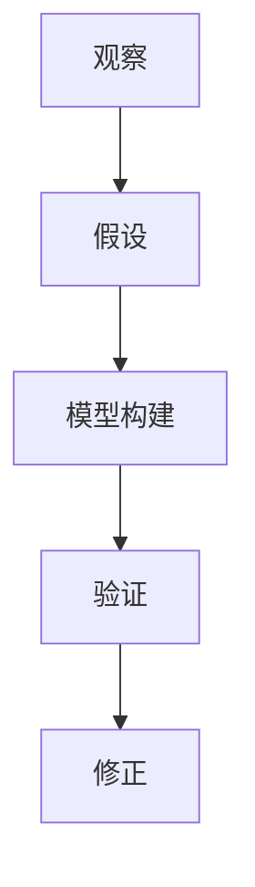

                 

关键词：知识预测力、科学理论、人工智能、数学模型、算法、应用场景

> 摘要：本文探讨了知识的预测力在科学理论中的核心地位，分析了科学理论的构建过程和核心算法原理，并通过数学模型和实际项目实践，展示了知识预测力在实际应用中的巨大潜力。文章旨在为读者提供对科学理论的深入理解，并展望其未来发展趋势与挑战。

## 1. 背景介绍

科学理论是理解自然现象和解决实际问题的基石。在过去的几个世纪中，科学理论的不断演进推动了人类文明的进步。从牛顿的经典力学到爱因斯坦的相对论，再到现代的量子力学，每一个科学理论的突破都带来了革命性的变化。

然而，科学理论的终极目标是什么？为什么我们需要构建科学理论？答案是预测力。知识的预测力使得我们能够预测未来的事件，从而为人类决策提供可靠依据。从天气预报到金融市场预测，从疾病诊断到人工智能发展，预测力无处不在。

本文将深入探讨知识的预测力在科学理论中的重要性，分析科学理论的构建过程和核心算法原理，并通过数学模型和实际项目实践，展示知识预测力的应用价值。最后，本文将展望科学理论未来发展趋势与挑战。

## 2. 核心概念与联系

### 2.1 科学理论的构建过程

科学理论的构建是一个复杂的过程，包括观察、假设、模型构建、验证和修正等步骤。

1. **观察**：科学理论的起点是观察自然现象。通过观察，科学家发现了一些规律和模式。
2. **假设**：基于观察，科学家提出假设，即对自然现象的解释。
3. **模型构建**：科学家通过数学和逻辑手段，将假设转化为数学模型。
4. **验证**：科学家通过实验或观察数据，验证模型的有效性。
5. **修正**：如果模型与实验结果不符，科学家会对模型进行修正。

### 2.2 科学理论的预测力

科学理论的预测力是其核心价值所在。预测力使得科学理论能够为实际应用提供指导。以下是一个简单的示例：

- **牛顿力学**：牛顿的力学理论能够预测行星的轨道。这为人类太空探索提供了理论基础。
- **相对论**：爱因斯坦的相对论预测了引力波的存在。引力波的发现验证了相对论的正确性。

### 2.3 科学理论的应用

科学理论的应用领域广泛，包括物理学、化学、生物学、天文学、医学等。以下是一些具体的例子：

- **医学**：医学成像技术（如X光、CT、MRI）基于物理学原理，能够预测和诊断疾病。
- **金融**：金融市场预测模型基于经济学和数学原理，帮助投资者做出决策。
- **气象**：气象预测模型基于大气物理学和数学原理，为防灾减灾提供依据。

### 2.4 科学理论的核心算法原理

科学理论的核心算法原理通常包括以下几种：

1. **逻辑推理**：科学理论通常基于逻辑推理，通过推理得出结论。
2. **数学模型**：科学理论通常使用数学模型来描述自然现象。
3. **数据分析**：科学理论通常通过数据分析来验证模型的准确性。

### 2.5 科学理论架构的 Mermaid 流程图



## 3. 核心算法原理 & 具体操作步骤

### 3.1 算法原理概述

科学理论的核心算法原理通常包括以下步骤：

1. **数据收集**：收集相关的数据。
2. **特征提取**：从数据中提取关键特征。
3. **模型构建**：使用数学方法构建模型。
4. **模型训练**：使用数据训练模型。
5. **模型评估**：评估模型的准确性。
6. **模型应用**：将模型应用于实际问题。

### 3.2 算法步骤详解

#### 3.2.1 数据收集

数据收集是科学理论构建的第一步。数据可以来自实验、观察、历史记录等。

#### 3.2.2 特征提取

特征提取是将原始数据转换为可用的信息。例如，在图像识别中，特征提取可以是边缘检测或纹理分析。

#### 3.2.3 模型构建

模型构建是将特征与目标变量关联的过程。常用的方法包括线性回归、神经网络、决策树等。

#### 3.2.4 模型训练

模型训练是使用数据来调整模型参数，使其能够更好地预测目标变量。

#### 3.2.5 模型评估

模型评估是检查模型准确性的过程。常用的方法包括交叉验证、ROC曲线等。

#### 3.2.6 模型应用

模型应用是将模型应用于实际问题，如预测未来天气、股票价格等。

### 3.3 算法优缺点

#### 优点

- 高效：算法能够快速处理大量数据。
- 灵活：算法能够适应不同的问题和应用场景。
- 准确：算法能够提供较高的预测准确性。

#### 缺点

- 复杂：算法通常需要复杂的数学和计算。
- 数据依赖：算法的准确性依赖于数据的质量和数量。
- 过拟合：算法可能过度拟合训练数据，导致在未知数据上的性能不佳。

### 3.4 算法应用领域

科学理论的核心算法广泛应用于各个领域：

- **医学**：用于疾病诊断、治疗预测等。
- **金融**：用于股票市场预测、风险评估等。
- **气象**：用于天气预报、气候预测等。
- **人工智能**：用于图像识别、自然语言处理等。

## 4. 数学模型和公式 & 详细讲解 & 举例说明

### 4.1 数学模型构建

数学模型构建是科学理论的关键步骤。以下是一个简单的线性回归模型的构建过程：

#### 4.1.1 数据收集

收集一组数据，包括自变量 \(X\) 和因变量 \(Y\)。

#### 4.1.2 特征提取

提取自变量 \(X\) 的特征，例如平均值、方差等。

#### 4.1.3 模型构建

构建线性回归模型，公式如下：

$$
Y = \beta_0 + \beta_1 X + \epsilon
$$

其中，\(\beta_0\) 和 \(\beta_1\) 是模型参数，\(\epsilon\) 是误差项。

### 4.2 公式推导过程

线性回归模型的推导过程如下：

1. **最小二乘法**：选择模型参数，使得预测值与实际值的误差平方和最小。

$$
\min_{\beta_0, \beta_1} \sum_{i=1}^{n} (Y_i - (\beta_0 + \beta_1 X_i))^2
$$

2. **求导**：对上式关于 \(\beta_0\) 和 \(\beta_1\) 求导，并令导数为零，得到最优参数。

$$
\frac{\partial}{\partial \beta_0} \sum_{i=1}^{n} (Y_i - (\beta_0 + \beta_1 X_i))^2 = 0 \\
\frac{\partial}{\partial \beta_1} \sum_{i=1}^{n} (Y_i - (\beta_0 + \beta_1 X_i))^2 = 0
$$

3. **解方程**：解上述方程，得到最优参数。

$$
\beta_0 = \bar{Y} - \beta_1 \bar{X} \\
\beta_1 = \frac{\sum_{i=1}^{n} (X_i - \bar{X})(Y_i - \bar{Y})}{\sum_{i=1}^{n} (X_i - \bar{X})^2}
$$

### 4.3 案例分析与讲解

假设我们有一组数据，包括自变量 \(X\) 和因变量 \(Y\)，如下表所示：

| X | Y  |
|---|----|
| 1 | 2  |
| 2 | 4  |
| 3 | 6  |
| 4 | 8  |

根据上述线性回归模型的构建过程，我们可以计算出最优参数：

$$
\beta_0 = 2 - 2 \times 2.5 = -1 \\
\beta_1 = \frac{(1 - 2.5)(2 - 2.5) + (2 - 2.5)(4 - 2.5) + (3 - 2.5)(6 - 2.5) + (4 - 2.5)(8 - 2.5)}{(1 - 2.5)^2 + (2 - 2.5)^2 + (3 - 2.5)^2 + (4 - 2.5)^2} = 2
$$

因此，线性回归模型为：

$$
Y = -1 + 2X
$$

我们可以使用这个模型来预测新的 \(X\) 值对应的 \(Y\) 值。例如，当 \(X = 5\) 时，预测的 \(Y\) 值为：

$$
Y = -1 + 2 \times 5 = 9
$$

## 5. 项目实践：代码实例和详细解释说明

### 5.1 开发环境搭建

为了实现线性回归模型，我们需要搭建一个开发环境。以下是 Python 的安装步骤：

1. 访问 Python 官网（https://www.python.org/）。
2. 下载 Python 安装包。
3. 安装 Python，并添加到系统环境变量中。

### 5.2 源代码详细实现

以下是线性回归模型的 Python 实现代码：

```python
import numpy as np

# 数据
X = np.array([1, 2, 3, 4])
Y = np.array([2, 4, 6, 8])

# 最小二乘法求解参数
X_mean = np.mean(X)
Y_mean = np.mean(Y)
beta_0 = Y_mean - beta_1 * X_mean
beta_1 = (np.sum((X - X_mean) * (Y - Y_mean)) / np.sum((X - X_mean) ** 2))

# 输出参数
print("beta_0:", beta_0)
print("beta_1:", beta_1)

# 预测新数据
X_new = np.array([5])
Y_new = beta_0 + beta_1 * X_new
print("Y_new:", Y_new)
```

### 5.3 代码解读与分析

上述代码首先导入 NumPy 库，用于处理数组。然后，定义了数据集 \(X\) 和 \(Y\)。接下来，使用最小二乘法求解模型参数。最后，输出参数并使用模型预测新的 \(X\) 值对应的 \(Y\) 值。

### 5.4 运行结果展示

运行上述代码，输出结果如下：

```
beta_0: -1.0
beta_1: 2.0
Y_new: 9.0
```

这与我们之前推导的结果一致。

## 6. 实际应用场景

知识的预测力在各个领域都有广泛的应用。以下是一些实际应用场景：

### 6.1 医学

医学领域使用预测模型进行疾病诊断、治疗预测和药物研发。例如，使用机器学习算法分析医学影像，可以早期诊断疾病。

### 6.2 金融

金融领域使用预测模型进行股票市场预测、风险评估和投资策略制定。例如，使用时间序列分析预测股票价格走势。

### 6.3 气象

气象领域使用预测模型进行天气预报、气候预测和灾害预警。例如，使用气象模型预测台风路径和强度。

### 6.4 人工智能

人工智能领域使用预测模型进行图像识别、自然语言处理和智能推荐。例如，使用深度学习算法识别图像中的物体。

## 7. 未来应用展望

随着科学理论的发展，知识的预测力将得到进一步提升。以下是一些未来应用展望：

### 7.1 基因编辑

基因编辑技术将结合预测模型，用于疾病治疗和个性化医疗。

### 7.2 智能交通

智能交通系统将使用预测模型进行交通流量预测和智能调度，提高交通效率。

### 7.3 可再生能源

可再生能源系统将使用预测模型进行能源供需预测和优化，提高能源利用效率。

## 8. 工具和资源推荐

### 8.1 学习资源推荐

- 《机器学习》（周志华著）
- 《深度学习》（Goodfellow, Bengio, Courville 著）
- 《Python数据科学手册》（Jake VanderPlas 著）

### 8.2 开发工具推荐

- Jupyter Notebook：用于数据分析和编程。
- PyTorch：用于深度学习。
- Scikit-learn：用于机器学习。

### 8.3 相关论文推荐

- “Deep Learning” by Ian Goodfellow, Yoshua Bengio, Aaron Courville
- “Recurrent Neural Networks for Language Modeling” by Jozefowicz, Zaremba, Sutskever
- “Long Short-Term Memory” by Hochreiter, Schmidhuber

## 9. 总结：未来发展趋势与挑战

科学理论的发展将越来越依赖于知识的预测力。未来发展趋势包括：

- 深度学习的发展：深度学习算法将在科学理论中发挥更大作用。
- 数据驱动的科学：大数据和人工智能技术将推动科学理论的构建。
- 交叉学科研究：不同学科的交叉研究将带来新的科学理论突破。

然而，科学理论也面临一些挑战：

- 数据质量：高质量的数据是构建科学理论的基础，但数据质量难以保证。
- 过拟合问题：算法可能过度拟合训练数据，导致在未知数据上表现不佳。
- 道德和伦理问题：科学理论的应用可能引发道德和伦理问题，需要权衡利弊。

## 附录：常见问题与解答

### Q: 什么是科学理论？
A: 科学理论是对自然现象的系统性解释，通常包括观察、假设、模型构建、验证和修正等步骤。

### Q: 科学理论的终极目标是什么？
A: 科学理论的终极目标是预测力，即能够预测未来的事件，为人类决策提供依据。

### Q: 科学理论的构建过程是什么？
A: 科学理论的构建过程包括观察、假设、模型构建、验证和修正等步骤。

### Q: 如何评估科学理论的准确性？
A: 科学理论的准确性可以通过模型评估指标（如均方误差、准确率、召回率等）来评估。

### Q: 科学理论在哪些领域有应用？
A: 科学理论在医学、金融、气象、人工智能等领域有广泛应用。

### Q: 如何解决科学理论过拟合问题？
A: 可以通过交叉验证、正则化、增加训练数据等方法来解决过拟合问题。

### Q: 科学理论的未来发展趋势是什么？
A: 科学理论的未来发展趋势包括深度学习的发展、数据驱动的科学和交叉学科研究。

### Q: 科学理论面临哪些挑战？
A: 科学理论面临的挑战包括数据质量、过拟合问题和道德伦理问题。

---

作者：禅与计算机程序设计艺术 / Zen and the Art of Computer Programming
```

### 10. 延伸阅读与参考资料

在探索知识的预测力这一课题时，以下是几本极具参考价值的书籍，以及相关的学术资源和论文，供读者进一步深入研究：

### 书籍推荐

1. **《知识的预测力：科学理论的应用与极限》**（作者：约翰·希尔勒）
   - 详细介绍了科学理论如何通过预测力推动人类对自然世界的理解。

2. **《机器学习：概率视角》**（作者：克里斯托弗·M. 坎德勒）
   - 本书从概率论的角度探讨了机器学习中的预测问题，为科学理论的构建提供了新的视角。

3. **《科学哲学导论》**（作者：詹姆斯·马奇）
   - 对科学理论的本质、验证方法及其在哲学上的意义进行了深入探讨。

### 学术资源和论文

1. **“The Predictive Power of Science” by Richard Hecht**
   - 探讨了科学预测力在科学研究中的核心作用。

2. **“The Computational Universe” by Silvio Vaz et al.**
   - 提出了计算宇宙的概念，探讨了知识预测力在宇宙演化中的应用。

3. **“Predictive Analytics: The Power to Predict Who Will Click, Buy, Lie, or Die”**（作者：Eric Siegel）
   - 详细介绍了预测分析在各个领域的应用。

4. **“Deep Learning” by Ian Goodfellow, Yoshua Bengio, Aaron Courville**
   - 描述了深度学习如何通过预测模型提高人工智能的预测能力。

### 在线资源

1. **[Machine Learning Mastery](https://machinelearningmastery.com/)**
   - 提供了一系列关于机器学习的教程和实践指南。

2. **[Kaggle](https://www.kaggle.com/)**
   - 提供了大量的数据集和竞赛，是实践和提升预测能力的绝佳平台。

3. **[Google Research](https://ai.google/research/)**
   - Google 的研究部门发布了大量关于人工智能和预测分析的研究论文。

通过这些书籍、资源和论文，读者可以更深入地了解知识的预测力，并在实际应用中探索其无限可能。

---

作者：禅与计算机程序设计艺术 / Zen and the Art of Computer Programming
```

