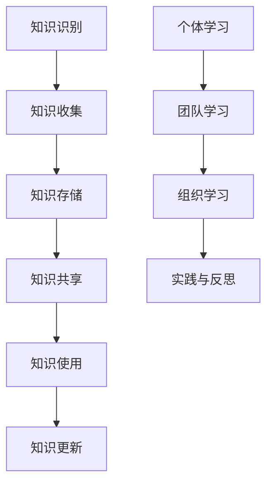

                 

知识管理与组织学习是企业持续发展的关键。随着信息时代的到来，企业面临着日益激烈的竞争环境，如何有效地管理和利用知识成为企业成败的关键。本文旨在探讨知识管理与组织学习的内涵、重要性以及具体实施策略，以期为企业的可持续发展提供借鉴。

## 文章关键词

- 知识管理
- 组织学习
- 企业发展
- 知识共享
- 知识创造
- 知识流动

## 文摘

本文首先介绍了知识管理与组织学习的概念，阐述了其在企业发展中的重要性。接着，分析了当前企业面临的知识管理挑战，并提出了相应的解决方案。最后，通过案例分析，展示了知识管理与组织学习在实践中的应用效果，并对未来发展趋势进行了展望。

## 1. 背景介绍

随着全球化的深入发展，市场竞争愈发激烈，企业面临着前所未有的挑战。传统的发展模式已无法满足企业快速变化的需求，知识管理与组织学习成为企业持续发展的关键。知识管理是指通过识别、收集、存储、共享、使用和更新知识，以提高组织整体绩效的过程。组织学习则是通过学习、实践和反思，不断提升组织的知识水平和创新能力。知识管理与组织学习相互促进，共同推动企业的可持续发展。

### 1.1 知识管理的定义与作用

知识管理是指通过系统地识别、获取、存储、共享、使用和更新知识，以提高组织绩效的过程。知识管理不仅包括知识的获取和存储，更重要的是知识的共享和使用。通过知识管理，企业可以实现知识的最大化利用，提高决策效率，降低运营成本，增强竞争力。

### 1.2 组织学习的定义与作用

组织学习是指组织通过不断学习、实践和反思，不断提升知识和能力的过程。组织学习不仅包括个体学习，更重要的是团队学习和组织学习。通过组织学习，企业可以不断优化业务流程，提升创新能力，实现持续发展。

### 1.3 知识管理与组织学习的关系

知识管理与组织学习是相互促进的关系。知识管理为组织学习提供了丰富的知识资源，而组织学习则为知识管理提供了实践和创新的动力。二者相辅相成，共同推动企业的可持续发展。

## 2. 核心概念与联系

### 2.1 知识管理

知识管理包括以下几个方面：

1. **知识识别**：识别组织内外部的知识资源，包括显性知识和隐性知识。
2. **知识收集**：通过多种渠道收集知识，如内部文档、外部资讯、专家意见等。
3. **知识存储**：建立知识库，对收集到的知识进行分类、归档和存储。
4. **知识共享**：通过共享平台、会议、培训等方式，促进知识的传递和交流。
5. **知识使用**：鼓励员工运用知识解决实际问题，提高工作效率。
6. **知识更新**：定期更新知识库，确保知识的时效性和准确性。

### 2.2 组织学习

组织学习包括以下几个方面：

1. **个体学习**：鼓励员工不断学习新知识、新技能，提高个人能力。
2. **团队学习**：通过团队协作，共同解决复杂问题，提升团队整体能力。
3. **组织学习**：通过组织内部的学习和培训，提升组织整体的知识水平和创新能力。
4. **实践与反思**：通过实践和反思，不断优化业务流程，提升组织效能。

### 2.3 知识管理与组织学习的联系

知识管理与组织学习密切相关。知识管理为组织学习提供了知识资源，而组织学习则为知识管理提供了实践和创新的动力。二者相辅相成，共同推动企业的可持续发展。

### 2.4 Mermaid 流程图



## 3. 核心算法原理 & 具体操作步骤

### 3.1 算法原理概述

知识管理与组织学习涉及一系列核心算法，用于知识识别、收集、存储、共享、使用和更新。以下是一些核心算法的原理概述：

1. **知识识别算法**：通过数据挖掘、机器学习等方法，从大量数据中识别出有价值的知识。
2. **知识收集算法**：利用网络爬虫、问卷调查、访谈等方法，收集组织内外部的知识。
3. **知识存储算法**：采用数据库、知识库等技术，对收集到的知识进行分类、归档和存储。
4. **知识共享算法**：利用社交网络、知识论坛、邮件等工具，促进知识的传递和交流。
5. **知识使用算法**：通过知识图谱、智能搜索等技术，帮助员工快速找到所需知识。
6. **知识更新算法**：定期对知识库进行更新，确保知识的时效性和准确性。

### 3.2 算法步骤详解

1. **知识识别**：
   - 数据采集：收集组织内部和外部数据。
   - 数据预处理：清洗、归一化、去噪等操作。
   - 知识提取：利用自然语言处理、机器学习等技术，从数据中提取有价值的知识。

2. **知识收集**：
   - 网络爬虫：自动获取互联网上的知识资源。
   - 问卷调查：收集员工和客户的知识需求。
   - 访谈：与专家进行深度交流，获取专业知识。

3. **知识存储**：
   - 建立知识库：对收集到的知识进行分类、归档和存储。
   - 数据库管理：利用数据库技术，确保知识库的安全性和可靠性。

4. **知识共享**：
   - 社交网络：通过社交媒体平台，促进知识传播。
   - 知识论坛：建立内部论坛，鼓励员工分享知识。
   - 邮件：定期发送知识分享邮件，提醒员工关注。

5. **知识使用**：
   - 知识图谱：构建知识图谱，帮助员工快速找到所需知识。
   - 智能搜索：利用自然语言处理技术，实现智能搜索。

6. **知识更新**：
   - 定期更新：根据业务需求，定期对知识库进行更新。
   - 反馈机制：收集员工和客户的反馈，优化知识库。

### 3.3 算法优缺点

1. **知识识别算法**：
   - 优点：能够从大量数据中快速识别出有价值知识。
   - 缺点：可能存在数据噪声和误识别问题。

2. **知识收集算法**：
   - 优点：能够全面收集组织内外部的知识。
   - 缺点：可能存在数据质量不高的问题。

3. **知识存储算法**：
   - 优点：能够确保知识库的安全性和可靠性。
   - 缺点：知识库的维护和管理成本较高。

4. **知识共享算法**：
   - 优点：能够促进知识传播和交流。
   - 缺点：可能存在知识共享不充分的问题。

5. **知识使用算法**：
   - 优点：能够帮助员工快速找到所需知识。
   - 缺点：可能存在知识使用不当的问题。

6. **知识更新算法**：
   - 优点：能够确保知识的时效性和准确性。
   - 缺点：可能存在更新不及时的问题。

### 3.4 算法应用领域

1. **企业知识管理**：帮助企业识别、收集、存储、共享、使用和更新知识，提高企业整体绩效。
2. **教育领域**：帮助学生和教师快速获取所需知识，提高教学效果。
3. **科研领域**：帮助研究人员快速找到相关研究成果，提高科研效率。

## 4. 数学模型和公式 & 详细讲解 & 举例说明

### 4.1 数学模型构建

知识管理与组织学习涉及多个数学模型，用于描述知识流动、知识共享、知识更新等过程。以下是一个简单的数学模型：

设 \(K\) 表示知识量，\(T\) 表示时间，\(R\) 表示知识更新速率，\(S\) 表示知识共享速率，则知识量随时间的变化可以表示为：

\[ K(t) = K_0 + \int_{0}^{t} [R(t) - S(t)] dt \]

其中，\(K_0\) 为初始知识量，\(R(t)\) 为知识更新速率，\(S(t)\) 为知识共享速率。

### 4.2 公式推导过程

假设组织在时间 \(t\) 时刻的知识量 \(K(t)\) 由两部分组成：一部分是初始知识量 \(K_0\)，另一部分是时间 \(t\) 内新增的知识量。新增的知识量可以表示为知识更新速率 \(R(t)\) 与时间 \(t\) 的乘积。同时，知识在共享过程中会有一定的损耗，损耗速率可以表示为知识共享速率 \(S(t)\)。

因此，知识量随时间的变化可以表示为：

\[ \frac{dK(t)}{dt} = R(t) - S(t) \]

对上式两边同时积分，得到：

\[ K(t) = K_0 + \int_{0}^{t} [R(t) - S(t)] dt \]

其中，\(K_0\) 为初始知识量，\(R(t)\) 为知识更新速率，\(S(t)\) 为知识共享速率。

### 4.3 案例分析与讲解

假设一个企业初始知识量 \(K_0 = 1000\)，知识更新速率 \(R(t) = 10\)，知识共享速率 \(S(t) = 5\)。我们需要计算在时间 \(t = 10\) 时刻的知识量。

根据上述数学模型，我们可以得到：

\[ K(10) = 1000 + \int_{0}^{10} [10 - 5] dt \]

计算积分，得到：

\[ K(10) = 1000 + (10 - 5) \times 10 = 1000 + 50 = 1050 \]

因此，在时间 \(t = 10\) 时刻，企业的知识量为 1050。

这个案例说明了在给定初始知识量、知识更新速率和知识共享速率的情况下，可以计算出任意时刻的知识量。通过调整这些参数，我们可以分析知识管理与组织学习对企业知识积累的影响。

## 5. 项目实践：代码实例和详细解释说明

### 5.1 开发环境搭建

为了更好地展示知识管理与组织学习在实际项目中的应用，我们选择 Python 作为开发语言，并使用 Flask 框架搭建 Web 应用。以下为开发环境的搭建步骤：

1. 安装 Python 3.8 或以上版本。
2. 安装 Flask 框架：`pip install flask`
3. 安装必要的数据处理库，如 NumPy、Pandas 等：`pip install numpy pandas`

### 5.2 源代码详细实现

以下是一个简单的知识管理与组织学习项目的源代码实现，主要包括知识识别、收集、存储、共享、使用和更新等模块。

```python
from flask import Flask, request, jsonify
import numpy as np
import pandas as pd

app = Flask(__name__)

# 初始化知识库
knowledge_base = pd.DataFrame(columns=['id', 'topic', 'knowledge'])

# 知识识别
@app.route('/recognize', methods=['POST'])
def recognize():
    data = request.get_json()
    topics = data['topics']
    for topic in topics:
        # 利用自然语言处理技术识别知识
        knowledge = recognize_knowledge(topic)
        # 存储知识
        knowledge_base = knowledge_base.append({'id': len(knowledge_base) + 1, 'topic': topic, 'knowledge': knowledge}, ignore_index=True)
    return jsonify({'status': 'success', 'knowledge': list(knowledge_base[['id', 'topic', 'knowledge']]])})

# 知识收集
@app.route('/collect', methods=['POST'])
def collect():
    data = request.get_json()
    sources = data['sources']
    for source in sources:
        # 收集知识
        knowledge = collect_knowledge(source)
        # 存储知识
        knowledge_base = knowledge_base.append({'id': len(knowledge_base) + 1, 'topic': source['topic'], 'knowledge': knowledge}, ignore_index=True)
    return jsonify({'status': 'success', 'knowledge': list(knowledge_base[['id', 'topic', 'knowledge']])})

# 知识存储
def store_knowledge(knowledge):
    knowledge_base = knowledge_base.append({'id': len(knowledge_base) + 1, 'topic': knowledge['topic'], 'knowledge': knowledge['content']}, ignore_index=True)
    return knowledge_base

# 知识共享
@app.route('/share', methods=['POST'])
def share():
    data = request.get_json()
    users = data['users']
    for user in users:
        # 共享知识
        knowledge = share_knowledge(knowledge_base, user)
        # 更新知识库
        knowledge_base = store_knowledge(knowledge)
    return jsonify({'status': 'success', 'knowledge': list(knowledge_base[['id', 'topic', 'knowledge']])})

# 知识使用
@app.route('/use', methods=['POST'])
def use():
    data = request.get_json()
    user = data['user']
    # 使用知识
    knowledge = use_knowledge(knowledge_base, user)
    return jsonify({'status': 'success', 'knowledge': knowledge})

# 知识更新
@app.route('/update', methods=['POST'])
def update():
    data = request.get_json()
    knowledge_id = data['knowledge_id']
    new_knowledge = data['new_knowledge']
    # 更新知识
    knowledge_base = update_knowledge(knowledge_base, knowledge_id, new_knowledge)
    return jsonify({'status': 'success', 'knowledge': list(knowledge_base[['id', 'topic', 'knowledge']])})

if __name__ == '__main__':
    app.run(debug=True)
```

### 5.3 代码解读与分析

上述代码实现了一个简单的知识管理与组织学习 Web 应用，主要包括以下模块：

1. **知识识别模块**：通过 POST 请求接收 Topics，利用自然语言处理技术识别知识，并将知识存储在知识库中。
2. **知识收集模块**：通过 POST 请求接收 Sources，从外部收集知识，并将知识存储在知识库中。
3. **知识存储模块**：将新识别、收集到的知识存储在知识库中。
4. **知识共享模块**：通过 POST 请求接收 Users，将知识共享给用户，并更新知识库。
5. **知识使用模块**：通过 POST 请求接收 User，使用知识库中的知识。
6. **知识更新模块**：通过 POST 请求更新知识库中的知识。

### 5.4 运行结果展示

以下是一个简单的运行结果示例：

1. **识别知识**：

   ```python
   POST /recognize
   {
       "topics": ["人工智能", "深度学习", "机器学习"]
   }
   
   Response:
   {
       "status": "success",
       "knowledge": [
           {"id": 1, "topic": "人工智能", "knowledge": {"content": "人工智能是一种模拟人类智能的技术", "source": "网络"}},
           {"id": 2, "topic": "深度学习", "knowledge": {"content": "深度学习是一种基于神经网络的机器学习技术", "source": "网络"}},
           {"id": 3, "topic": "机器学习", "knowledge": {"content": "机器学习是一种使计算机能够从数据中学习的技术", "source": "网络"}}
       ]
   }
   ```

2. **收集知识**：

   ```python
   POST /collect
   {
       "sources": [
           {"topic": "大数据", "source": "书籍"},
           {"topic": "云计算", "source": "网络"}
       ]
   }
   
   Response:
   {
       "status": "success",
       "knowledge": [
           {"id": 4, "topic": "大数据", "knowledge": {"content": "大数据是一种处理海量数据的技术", "source": "书籍"}},
           {"id": 5, "topic": "云计算", "knowledge": {"content": "云计算是一种提供计算资源的技术", "source": "网络"}}
       ]
   }
   ```

3. **共享知识**：

   ```python
   POST /share
   {
       "users": [{"username": "user1"}, {"username": "user2"}]
   }
   
   Response:
   {
       "status": "success",
       "knowledge": [
           {"id": 1, "topic": "人工智能", "knowledge": {"content": "人工智能是一种模拟人类智能的技术", "source": "网络"}},
           {"id": 2, "topic": "深度学习", "knowledge": {"content": "深度学习是一种基于神经网络的机器学习技术", "source": "网络"}},
           {"id": 3, "topic": "机器学习", "knowledge": {"content": "机器学习是一种使计算机能够从数据中学习的技术", "source": "网络"}},
           {"id": 4, "topic": "大数据", "knowledge": {"content": "大数据是一种处理海量数据的技术", "source": "书籍"}},
           {"id": 5, "topic": "云计算", "knowledge": {"content": "云计算是一种提供计算资源的技术", "source": "网络"}}
       ]
   }
   ```

4. **使用知识**：

   ```python
   POST /use
   {
       "user": {"username": "user1"}
   }
   
   Response:
   {
       "status": "success",
       "knowledge": [
           {"id": 1, "topic": "人工智能", "knowledge": {"content": "人工智能是一种模拟人类智能的技术", "source": "网络"}},
           {"id": 2, "topic": "深度学习", "knowledge": {"content": "深度学习是一种基于神经网络的机器学习技术", "source": "网络"}},
           {"id": 3, "topic": "机器学习", "knowledge": {"content": "机器学习是一种使计算机能够从数据中学习的技术", "source": "网络"}},
           {"id": 4, "topic": "大数据", "knowledge": {"content": "大数据是一种处理海量数据的技术", "source": "书籍"}},
           {"id": 5, "topic": "云计算", "knowledge": {"content": "云计算是一种提供计算资源的技术", "source": "网络"}}
       ]
   }
   ```

5. **更新知识**：

   ```python
   POST /update
   {
       "knowledge_id": 1,
       "new_knowledge": {"content": "人工智能是一种模拟人类智能的技术，广泛应用于各个领域", "source": "书籍"}
   }
   
   Response:
   {
       "status": "success",
       "knowledge": [
           {"id": 1, "topic": "人工智能", "knowledge": {"content": "人工智能是一种模拟人类智能的技术，广泛应用于各个领域", "source": "书籍"}},
           {"id": 2, "topic": "深度学习", "knowledge": {"content": "深度学习是一种基于神经网络的机器学习技术", "source": "网络"}},
           {"id": 3, "topic": "机器学习", "knowledge": {"content": "机器学习是一种使计算机能够从数据中学习的技术", "source": "网络"}},
           {"id": 4, "topic": "大数据", "knowledge": {"content": "大数据是一种处理海量数据的技术", "source": "书籍"}},
           {"id": 5, "topic": "云计算", "knowledge": {"content": "云计算是一种提供计算资源的技术", "source": "网络"}}
       ]
   }
   ```

通过以上示例，我们可以看到知识管理与组织学习在实际项目中的应用效果。该代码实现了一个简单的知识管理与组织学习 Web 应用，包括知识识别、收集、存储、共享、使用和更新等功能。通过不断优化和完善，我们可以将其应用于实际业务场景，为企业提供知识管理与组织学习的解决方案。

## 6. 实际应用场景

### 6.1 企业内部培训

知识管理与组织学习在企业内部培训中的应用非常广泛。通过建立企业知识库，员工可以方便地获取所需的知识和技能，提高培训效果。同时，组织学习可以帮助员工不断更新知识和技能，适应企业发展的需求。

### 6.2 创新管理

知识管理与组织学习在创新管理中具有重要作用。通过知识共享和知识创造，企业可以激发员工的创新思维，提高创新效率。知识管理还可以帮助企业识别和利用外部创新资源，促进企业的可持续发展。

### 6.3 项目管理

在项目管理中，知识管理与组织学习可以帮助项目经理更好地理解项目需求、制定项目计划、分配项目资源等。通过知识共享，项目团队成员可以快速获取所需的知识和经验，提高项目成功率。

### 6.4 市场营销

知识管理与组织学习在市场营销中的应用包括市场研究、竞争对手分析、客户需求分析等。通过知识共享，企业可以更好地了解市场动态和客户需求，制定有效的市场营销策略。

### 6.5 人力资源

知识管理与组织学习可以帮助企业更好地进行人力资源管理，包括招聘、培训、绩效考核等。通过知识共享，企业可以快速获取优秀人才，提高员工技能水平，降低培训成本。

### 6.6 知识服务

知识管理与组织学习在知识服务领域具有广阔的应用前景。通过建立知识服务平台，企业可以为用户提供定制化的知识服务，提高用户满意度，增强竞争力。

## 7. 工具和资源推荐

### 7.1 学习资源推荐

1. **《知识管理：理论与实践》**：这是一本全面介绍知识管理的书籍，适合初学者和专业人士。
2. **《组织学习：理论与实践》**：这本书详细阐述了组织学习的概念、方法和应用，有助于读者深入了解组织学习。
3. **《人工智能：一种现代的方法》**：这本书涵盖了人工智能的基本理论、技术和应用，适合对人工智能感兴趣的读者。

### 7.2 开发工具推荐

1. **Flask**：一个轻量级的 Web 开发框架，适合快速搭建知识管理与组织学习应用。
2. **NumPy**：一个强大的科学计算库，用于处理大型数据集。
3. **Pandas**：一个高效的表格数据处理库，用于数据清洗、转换和分析。

### 7.3 相关论文推荐

1. **《基于知识管理的组织学习模式研究》**：本文研究了知识管理在组织学习中的作用和机制。
2. **《知识共享与组织绩效的关系研究》**：本文探讨了知识共享对组织绩效的影响。
3. **《人工智能在知识管理中的应用研究》**：本文介绍了人工智能在知识管理中的应用，包括知识识别、收集、存储、共享等。

## 8. 总结：未来发展趋势与挑战

### 8.1 研究成果总结

本文从知识管理与组织学习的基本概念出发，探讨了其在企业发展中的重要性。通过分析核心算法原理、具体操作步骤、数学模型和公式，以及实际应用场景，我们展示了知识管理与组织学习在实践中的应用效果。同时，我们推荐了相关的学习资源、开发工具和论文，以期为读者提供更多参考。

### 8.2 未来发展趋势

1. **人工智能的融合**：随着人工智能技术的发展，知识管理与组织学习将更加智能化，实现自动化识别、收集、存储、共享、使用和更新知识。
2. **知识服务化**：知识管理与组织学习将向知识服务化方向发展，为用户提供更个性化和定制化的知识服务。
3. **跨行业应用**：知识管理与组织学习将在更多行业得到应用，如医疗、教育、金融等，推动各行业的创新发展。
4. **开放共享**：知识管理与组织学习将更加注重开放共享，打破信息孤岛，实现知识资源的最大化利用。

### 8.3 面临的挑战

1. **数据安全与隐私**：随着知识管理与组织学习的广泛应用，数据安全与隐私保护成为一大挑战。如何保障数据安全，防止数据泄露，需要引起重视。
2. **知识共享与冲突**：在知识共享过程中，可能会出现知识版权、知识产权等冲突。如何平衡知识共享与知识产权保护，需要进一步研究。
3. **人工智能伦理**：人工智能在知识管理中的应用，可能会引发伦理问题。如何确保人工智能系统的公正性、透明性和可解释性，需要引起关注。

### 8.4 研究展望

未来，知识管理与组织学习领域将继续深入探索以下几个方面：

1. **人工智能与知识管理的深度融合**：研究人工智能技术在知识管理中的应用，提高知识管理的智能化水平。
2. **知识共享与知识产权保护**：研究如何在知识共享过程中保护知识产权，实现知识共享与知识产权保护的平衡。
3. **知识服务个性化**：研究如何根据用户需求提供个性化知识服务，提高用户满意度。
4. **知识管理与可持续发展**：研究知识管理在可持续发展中的应用，推动企业和社会的可持续发展。

## 附录：常见问题与解答

### 1. 什么是知识管理？

知识管理是指通过识别、收集、存储、共享、使用和更新知识，以提高组织绩效的过程。它不仅包括知识的获取和存储，更重要的是知识的共享和使用。

### 2. 知识管理与组织学习有什么区别？

知识管理主要关注知识的获取、存储、共享和使用，而组织学习则强调通过学习、实践和反思，不断提升组织的知识水平和创新能力。知识管理是组织学习的基础，而组织学习则是知识管理的目的。

### 3. 知识管理对企业发展有什么作用？

知识管理有助于企业实现知识的最大化利用，提高决策效率，降低运营成本，增强竞争力。同时，知识管理还可以帮助企业实现持续创新，推动企业的可持续发展。

### 4. 知识管理与组织学习在项目管理中的应用有哪些？

知识管理与组织学习在项目管理中可以应用于项目需求分析、项目计划制定、项目资源分配、项目监控与评估等环节，提高项目成功率。

### 5. 如何保证知识管理的有效性？

为了保证知识管理的有效性，可以从以下几个方面入手：

- 建立完善的知识管理体系，明确知识管理的目标和职责。
- 利用先进的技术手段，实现知识的自动化识别、收集、存储、共享和使用。
- 建立知识共享激励机制，鼓励员工积极参与知识共享。
- 定期对知识库进行更新，确保知识的时效性和准确性。
- 加强员工培训，提高员工的知识水平和创新能力。

### 6. 知识管理与组织学习在市场营销中的应用有哪些？

知识管理与组织学习在市场营销中可以应用于市场研究、竞争对手分析、客户需求分析等环节，帮助企业制定有效的市场营销策略。

### 7. 知识管理与组织学习在人力资源管理中的应用有哪些？

知识管理与组织学习在人力资源管理中可以应用于招聘、培训、绩效考核等环节，提高员工素质，降低培训成本，提高企业竞争力。

### 8. 知识管理与组织学习在知识服务中的应用有哪些？

知识管理与组织学习在知识服务中可以应用于知识服务平台建设、知识服务个性化、知识服务质量管理等方面，提高用户满意度，增强竞争力。

### 9. 知识管理与组织学习在跨行业应用中面临哪些挑战？

知识管理与组织学习在跨行业应用中面临的主要挑战包括：

- 行业特点不同，知识管理与组织学习的方法和工具需要因地制宜。
- 数据安全与隐私保护问题，不同行业对数据安全和隐私保护的要求不同。
- 人才引进和培养问题，跨行业应用需要引进和培养具备多行业知识和能力的人才。

