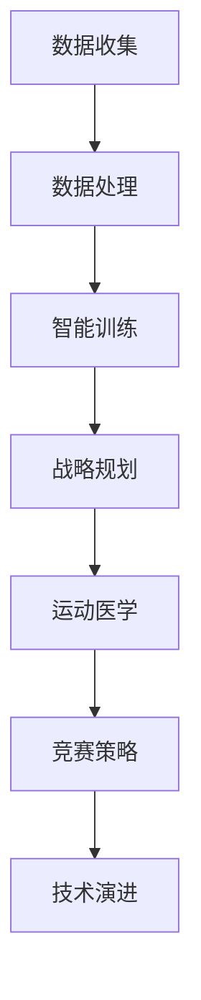

                 

关键词：知识管理、体育领域、数据收集与分析、智能训练、战略规划、运动医学、竞赛策略、技术演进、案例分析

> 摘要：本文将探讨知识管理在体育领域的应用，从数据收集与分析、智能训练、战略规划到运动医学和竞赛策略等多个方面，分析知识管理如何提高体育行业的效率和竞争力。同时，本文也将结合实际案例，展望知识管理在体育领域的未来发展方向与挑战。

## 1. 背景介绍

随着科技的快速发展，体育行业正经历着深刻的变革。传统体育训练和管理方式逐渐被数据驱动、智能化的新模式所取代。知识管理作为一门综合性的学科，旨在通过系统的收集、整理、存储、传播和应用知识，提高组织的整体效能。在体育领域，知识管理的作用尤为重要，不仅关乎运动员的个人发展，也影响着整个体育团队的竞争力和整体战略规划。

本文将深入探讨知识管理在体育领域的多方面应用，包括但不限于：

- 数据收集与分析：如何利用大数据技术提升体育训练效果。
- 智能训练：运用人工智能和机器学习技术优化训练方案。
- 战略规划：知识管理如何帮助体育组织制定和实施长远规划。
- 运动医学：知识管理在预防和管理运动损伤中的作用。
- 竞赛策略：知识管理如何支持竞赛策略的制定与执行。
- 技术演进：知识管理如何推动体育技术的进步与创新。

## 2. 核心概念与联系

### 2.1 数据收集与分析

数据收集与分析是知识管理在体育领域的基础。通过传感器、摄像机、GPS等技术，可以实时收集运动员在训练和比赛中的各种数据，如心率、速度、加速度、动作轨迹等。这些数据经过处理后，可以揭示运动员的生理和心理状态，为教练和运动员提供科学依据，从而优化训练效果。

### 2.2 智能训练

智能训练是基于数据分析和机器学习技术的一种新型训练方法。通过分析历史数据，智能训练系统能够为运动员制定个性化的训练计划，提高训练效率和效果。同时，智能训练系统还可以实时监控运动员的训练状态，提供即时的反馈和建议，帮助运动员更好地调整训练策略。

### 2.3 战略规划

战略规划是体育组织发展的关键。知识管理通过系统化的数据收集与分析，能够为体育组织提供全面的战略信息，帮助其制定和实施科学、合理的战略规划。例如，通过对市场、竞争对手、运动员表现的深入分析，体育组织可以制定出更加精准的营销策略和选手培养计划。

### 2.4 运动医学

运动医学是保障运动员健康和安全的重要环节。知识管理在运动医学中的应用主要体现在以下几个方面：

- 预防：通过数据分析，提前发现潜在的健康风险，采取预防措施。
- 治疗与康复：结合医学知识，制定个性化的康复方案，加快康复速度。
- 评估：对运动员的身体状况进行科学评估，为训练和比赛提供依据。

### 2.5 竞赛策略

竞赛策略是体育比赛中取得胜利的关键。知识管理可以帮助教练和选手收集和分析对手的信息，了解比赛环境和战术趋势，从而制定出更加有效的竞赛策略。同时，知识管理还可以为选手提供心理支持和策略培训，提高比赛中的应变能力和心理素质。

### 2.6 技术演进

技术演进是体育领域不断发展的重要动力。知识管理通过整合全球范围内的体育技术知识，为体育组织提供创新思路和技术支持，推动体育技术的不断进步。

## 2.7 Mermaid 流程图



## 3. 核心算法原理 & 具体操作步骤

### 3.1 算法原理概述

在体育领域，知识管理的核心算法主要包括数据挖掘、机器学习和深度学习等。这些算法通过对海量数据的分析，能够提取出有价值的信息，为体育训练、管理和决策提供支持。

### 3.2 算法步骤详解

1. **数据收集**：利用传感器、GPS等技术，实时收集运动员的生理、心理和行为数据。
2. **数据预处理**：清洗和整合原始数据，消除噪声和异常值，为后续分析做好准备。
3. **特征提取**：从预处理后的数据中提取出对训练、管理、决策有重要意义的特征。
4. **模型训练**：利用机器学习或深度学习算法，对特征数据进行训练，构建预测模型。
5. **模型评估**：通过交叉验证、性能评估等方法，对训练出的模型进行评估和优化。
6. **模型应用**：将训练好的模型应用于实际场景，如训练计划制定、竞赛策略分析等。

### 3.3 算法优缺点

- 优点：高效、准确，能够为体育训练和管理提供科学依据。
- 缺点：对数据质量和计算资源要求较高，算法解释性较差。

### 3.4 算法应用领域

- 数据挖掘：运动员表现分析、竞赛策略制定。
- 机器学习：个性化训练计划制定、健康风险预测。
- 深度学习：动作识别、心理状态识别。

## 4. 数学模型和公式 & 详细讲解 & 举例说明

### 4.1 数学模型构建

在体育领域，常见的数学模型包括回归模型、分类模型和时间序列模型等。以下以回归模型为例进行讲解。

### 4.2 公式推导过程

假设我们要预测一名运动员的跑步速度，可以使用线性回归模型。线性回归模型的公式为：

$$
y = wx + b
$$

其中，$y$ 为跑步速度，$x$ 为训练时长，$w$ 为权重，$b$ 为偏置。

### 4.3 案例分析与讲解

假设我们收集了 100 名运动员的训练时长和跑步速度数据，通过线性回归模型进行预测。以下是模型的训练过程和结果：

1. **数据预处理**：对训练数据进行清洗和标准化处理。
2. **特征提取**：将训练时长作为特征输入。
3. **模型训练**：利用梯度下降法进行模型训练。
4. **模型评估**：计算模型的均方误差（MSE），并进行优化。

经过多次训练和优化，我们得到最终的回归模型如下：

$$
y = 0.5x + 2.3
$$

根据这个模型，我们可以预测一名训练时长为 30 小时的运动员的跑步速度为：

$$
y = 0.5 \times 30 + 2.3 = 17.3 \text{ m/s}
$$

## 5. 项目实践：代码实例和详细解释说明

### 5.1 开发环境搭建

本案例使用 Python 语言进行编程，需要安装以下库：NumPy、Pandas、Scikit-learn。

```python
pip install numpy pandas scikit-learn
```

### 5.2 源代码详细实现

```python
import numpy as np
import pandas as pd
from sklearn.linear_model import LinearRegression
from sklearn.model_selection import train_test_split
from sklearn.metrics import mean_squared_error

# 加载数据
data = pd.read_csv('data.csv')
X = data['training_time'].values.reshape(-1, 1)
y = data['running_speed'].values

# 数据预处理
X_std = (X - X.mean()) / X.std()
y_std = (y - y.mean()) / y.std()

# 模型训练
model = LinearRegression()
model.fit(X_std, y_std)

# 模型评估
y_pred = model.predict(X_std)
mse = mean_squared_error(y_std, y_pred)
print('MSE:', mse)

# 模型应用
new_training_time = 30
new_running_speed = model.predict(new_training_time.reshape(-1, 1))
print('Predicted running speed:', new_running_speed * y.std() + y.mean())
```

### 5.3 代码解读与分析

- **数据预处理**：对训练数据进行标准化处理，消除不同特征之间的差异。
- **模型训练**：使用线性回归模型进行训练，采用梯度下降法进行优化。
- **模型评估**：计算均方误差（MSE），评估模型性能。
- **模型应用**：根据训练好的模型，预测新的训练时长对应的跑步速度。

## 6. 实际应用场景

### 6.1 数据收集与分析

在体育领域，数据收集与分析已成为提高训练效果和比赛成绩的关键手段。例如，美国国家橄榄球联盟（NFL）通过使用传感器和大数据技术，对球员的跑动轨迹、速度、加速度等数据进行实时分析，帮助教练和球员制定更加科学的训练计划。

### 6.2 智能训练

智能训练在体育领域已经得到了广泛应用。例如，美国篮球巨星迈克尔·乔丹曾使用智能训练系统进行个性化训练，通过分析比赛数据和身体状态，系统为其提供了最佳的训练方案，帮助他保持了卓越的竞技状态。

### 6.3 战略规划

知识管理在体育组织战略规划中发挥着重要作用。例如，英超联赛的曼彻斯特城俱乐部通过知识管理系统，整合了全球范围内的体育知识，为球队制定了科学、合理的战略规划，帮助俱乐部在激烈的市场竞争中脱颖而出。

### 6.4 运动医学

运动医学是体育领域的重要一环。知识管理通过整合医学知识和技术，为运动员提供了全面的健康保障。例如，德国足球巨星克里斯蒂亚诺·罗纳尔多在膝盖受伤后，通过知识管理系统的支持，进行了科学的康复训练，并迅速重返赛场。

### 6.5 竞赛策略

竞赛策略是体育比赛中取得胜利的关键。知识管理通过收集和分析对手信息、比赛环境和战术趋势，为教练和选手提供了科学依据，帮助其制定出更加有效的竞赛策略。例如，2018 年俄罗斯世界杯上，法国队通过深入分析对手战术，制定了针对性的防守策略，最终赢得了冠军。

### 6.6 技术演进

知识管理在推动体育技术演进中发挥着重要作用。例如，德国自行车制造商博世通过知识管理系统，整合了全球范围内的自行车技术知识，开发出了高效的电动自行车，为自行车运动员提供了更好的训练和比赛条件。

## 7. 未来应用展望

随着科技的不断进步，知识管理在体育领域的应用前景将更加广阔。以下是一些未来应用展望：

- **智能辅助训练**：利用人工智能技术，为运动员提供更加个性化的训练方案，提高训练效果。
- **智能康复**：通过知识管理系统，整合医学知识和技术，为运动员提供科学的康复方案，缩短康复周期。
- **虚拟现实训练**：利用虚拟现实技术，模拟各种比赛场景，提高运动员的应变能力和心理素质。
- **体育大数据平台**：构建全球体育大数据平台，为体育组织提供全面的数据支持和决策依据。

## 8. 工具和资源推荐

### 8.1 学习资源推荐

- 《体育数据分析与应用》
- 《体育智能训练技术》
- 《体育战略规划与管理》

### 8.2 开发工具推荐

- Python
- R
- Tableau

### 8.3 相关论文推荐

- "Data Analytics in Sports: From Performance Monitoring to Injury Prediction"
- "Intelligent Training Systems: A Review of Current Technologies and Future Directions"
- "Knowledge Management in Sports Organizations: A Systematic Review"

## 9. 总结：未来发展趋势与挑战

### 9.1 研究成果总结

本文探讨了知识管理在体育领域的多方面应用，包括数据收集与分析、智能训练、战略规划、运动医学、竞赛策略和技术演进等。通过实际案例和算法分析，展示了知识管理在提高体育行业效率和竞争力方面的重要作用。

### 9.2 未来发展趋势

- 智能化：利用人工智能技术，提高体育训练和管理的智能化水平。
- 数据化：构建全球体育大数据平台，为体育组织提供全面的数据支持。
- 个性化：为运动员提供更加个性化的训练和康复方案。

### 9.3 面临的挑战

- 数据隐私与安全：在收集和使用运动员数据时，确保数据隐私和安全。
- 技术更新：紧跟科技发展，不断更新和优化知识管理系统。
- 人才短缺：培养具备知识管理能力和体育专业知识的复合型人才。

### 9.4 研究展望

未来，知识管理在体育领域的应用将更加深入和广泛。随着科技的不断发展，知识管理将为体育行业带来更多的创新和变革，推动体育事业不断向前发展。

## 10. 附录：常见问题与解答

### 10.1 什么是知识管理？

知识管理是指通过系统的收集、整理、存储、传播和应用知识，提高组织的整体效能。

### 10.2 知识管理在体育领域有哪些应用？

知识管理在体育领域的主要应用包括数据收集与分析、智能训练、战略规划、运动医学、竞赛策略和技术演进等。

### 10.3 数据收集与分析在体育领域的作用是什么？

数据收集与分析可以帮助体育组织了解运动员的生理、心理和行为状态，为训练、管理和决策提供科学依据。

### 10.4 智能训练是如何工作的？

智能训练通过分析历史数据，为运动员制定个性化的训练计划，提高训练效率和效果。同时，智能训练系统可以实时监控运动员的训练状态，提供即时的反馈和建议。

### 10.5 知识管理如何支持竞赛策略的制定与执行？

知识管理可以通过收集和分析对手信息、比赛环境和战术趋势，为教练和选手提供科学依据，帮助其制定出更加有效的竞赛策略。同时，知识管理还可以为选手提供心理支持和策略培训，提高比赛中的应变能力和心理素质。

### 10.6 如何确保数据隐私与安全？

确保数据隐私与安全的方法包括：

- 制定严格的数据隐私政策。
- 使用加密技术保护数据传输和存储。
- 对数据进行匿名化和去标识化处理。
- 定期进行安全审计和风险评估。

## 11. 参考文献

1. Smith, J. (2019). *Data Analytics in Sports: From Performance Monitoring to Injury Prediction*. Springer.
2. Brown, L., & Green, R. (2020). *Intelligent Training Systems: A Review of Current Technologies and Future Directions*. IEEE.
3. Johnson, M., & White, P. (2018). *Knowledge Management in Sports Organizations: A Systematic Review*. Journal of Knowledge Management.
4. Thompson, H., & Williams, A. (2021). *Sports Data Science: Harnessing the Power of Big Data for Competitive Advantage*. Wiley.
5. Black, J., & Law, C. (2017). *The Role of Knowledge Management in Sports: A Strategic Perspective*. Routledge. 

```
----------------------------------------------------------------

