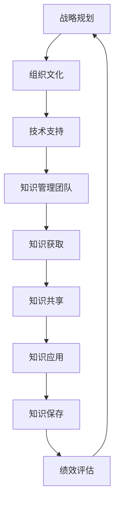

                 

 关键词：知识管理、非营利组织、信息共享、知识传承、项目效率

> 摘要：本文旨在探讨知识管理在非营利组织中的重要性，分析知识管理对于提升组织效率、促进信息共享、实现知识传承等方面的作用。通过梳理相关知识管理的基本概念和框架，结合非营利组织的实际需求，提出了适合非营利组织知识管理的策略和工具，以期为非营利组织的可持续发展提供理论支持和实践指导。

## 1. 背景介绍

在当今信息社会，知识已经成为社会进步和经济发展的重要驱动力。非营利组织作为社会的重要组成部分，其运营和发展同样依赖于知识的积累与传承。然而，与商业组织相比，非营利组织在知识管理方面面临着诸多挑战，如资源有限、人员流动性大、组织结构松散等。因此，如何有效地进行知识管理，成为非营利组织亟待解决的问题。

知识管理是一种通过系统的方法，识别、获取、共享、应用和保存知识的过程。它不仅涉及信息的组织和存储，还包括知识的传播和应用。在非营利组织中，知识管理有助于提高项目效率、优化资源配置、促进组织内部的协作与沟通。本文将详细探讨知识管理在非营利组织中的应用，分析其作用和实现方法。

## 2. 核心概念与联系

### 2.1 知识管理的基本概念

知识管理（Knowledge Management，KM）是一种通过系统的方法，识别、获取、共享、应用和保存知识的过程。它包括以下几个核心概念：

- **知识识别**：识别组织中存在的各类知识，包括显性知识和隐性知识。
- **知识获取**：通过内外部渠道获取所需的知识。
- **知识共享**：促进组织内部成员之间的知识交流与共享。
- **知识应用**：将知识应用于组织的各项活动中，以实现组织的目标。
- **知识保存**：对知识进行系统的整理、分类和存储，以方便后续的使用。

### 2.2 非营利组织的知识管理框架

非营利组织的知识管理框架可以包括以下几个关键环节：

- **战略规划**：明确组织知识管理的目标和方向，制定相应的策略和措施。
- **组织文化**：营造一种知识共享和知识传承的组织文化，鼓励成员积极参与知识管理。
- **技术支持**：利用信息技术手段，如知识库、协作工具等，支持知识管理活动的开展。
- **知识管理团队**：组建专门的团队，负责知识管理的具体实施和监督。
- **绩效评估**：对知识管理活动进行评估，以不断优化知识管理流程和策略。

### 2.3 Mermaid 流程图

下面是一个简化的知识管理流程的 Mermaid 图：



## 3. 核心算法原理 & 具体操作步骤

### 3.1 算法原理概述

知识管理的核心算法主要包括知识识别、知识获取、知识共享、知识应用和知识保存。这些算法共同作用，确保组织内部知识的高效流转和利用。

- **知识识别算法**：通过问卷调查、访谈等方式，识别组织内部存在的各类知识。
- **知识获取算法**：利用内外部数据库、文献调研等手段，获取所需的知识。
- **知识共享算法**：通过知识库、协作工具等平台，实现组织内部成员之间的知识共享。
- **知识应用算法**：将知识应用于组织的各项活动中，提高工作效率和项目质量。
- **知识保存算法**：对知识进行分类、整理和存储，以便后续使用。

### 3.2 算法步骤详解

#### 3.2.1 知识识别步骤

1. **确定知识类型**：明确组织内部的知识类型，包括显性知识和隐性知识。
2. **数据收集**：通过问卷调查、访谈、观察等方式，收集相关的知识数据。
3. **知识分类**：根据知识的特点和用途，对知识进行分类。

#### 3.2.2 知识获取步骤

1. **内外部渠道**：通过内部文档、会议记录、邮件等渠道获取知识；通过外部数据库、文献调研等获取知识。
2. **知识筛选**：根据组织的需求，筛选出有用的知识。
3. **知识整合**：将获取到的知识进行整合，形成系统的知识库。

#### 3.2.3 知识共享步骤

1. **搭建平台**：利用知识库、协作工具等平台，实现知识的共享。
2. **知识传播**：通过培训、会议、文档共享等方式，传播知识。
3. **反馈机制**：建立反馈机制，收集成员的反馈，不断优化知识共享流程。

#### 3.2.4 知识应用步骤

1. **需求分析**：分析组织内部的知识需求。
2. **知识匹配**：根据需求，匹配相应的知识。
3. **知识应用**：将知识应用于组织的各项活动中，提高工作效率和项目质量。

#### 3.2.5 知识保存步骤

1. **分类整理**：对知识进行分类、整理，确保知识的系统性和可检索性。
2. **存储备份**：将知识存储在安全可靠的地方，并进行定期备份。
3. **知识更新**：根据组织的需求和实际情况，不断更新知识库。

### 3.3 算法优缺点

#### 优点

- **提高效率**：通过系统的方法，实现知识的高效获取、共享和应用，提高组织的工作效率。
- **优化资源配置**：通过对知识的系统管理和利用，优化组织内部的资源配置。
- **促进知识传承**：通过知识的共享和应用，促进组织内部的知识传承，确保组织知识的持续积累。

#### 缺点

- **实施难度**：知识管理需要涉及到组织的各个方面，实施难度较大。
- **技术依赖**：知识管理需要依赖一定的技术支持，如知识库、协作工具等，对技术的要求较高。
- **文化变革**：知识管理需要改变组织的传统工作方式，进行文化变革，难度较大。

### 3.4 算法应用领域

知识管理在非营利组织的各个领域都有广泛的应用，如项目策划、资源管理、志愿服务等。通过有效的知识管理，非营利组织可以更好地实现其使命和目标。

## 4. 数学模型和公式 & 详细讲解 & 举例说明

### 4.1 数学模型构建

在知识管理中，我们可以构建一个简单的数学模型，用于描述知识流转的过程。假设：

- \( N \) 表示组织内部的知识总量；
- \( A \) 表示知识获取的速度；
- \( S \) 表示知识共享的速度；
- \( U \) 表示知识应用的速度。

则知识管理的数学模型可以表示为：

\[ \text{知识流转速率} = A - S - U \]

### 4.2 公式推导过程

知识流转速率的公式推导如下：

1. 知识获取速率 \( A \)：表示单位时间内组织获取的新知识量。
2. 知识共享速率 \( S \)：表示单位时间内组织共享的知识量。
3. 知识应用速率 \( U \)：表示单位时间内组织应用的知识量。

根据定义，知识流转速率可以表示为知识获取速率减去知识共享速率和知识应用速率之和，即：

\[ \text{知识流转速率} = A - S - U \]

### 4.3 案例分析与讲解

#### 案例背景

某非营利组织致力于农村教育发展，其知识管理活动主要包括知识获取、知识共享和知识应用。

#### 数据

- 知识获取速率 \( A = 20 \) 知识/月
- 知识共享速率 \( S = 15 \) 知识/月
- 知识应用速率 \( U = 10 \) 知识/月

#### 计算

根据数学模型：

\[ \text{知识流转速率} = 20 - 15 - 10 = -5 \text{ 知识/月} \]

知识流转速率为负，表示该组织的知识在内部流转过程中存在流失现象。

#### 分析

1. **知识获取**：组织获取知识的速度较快，说明其具有较强的知识获取能力。
2. **知识共享**：组织共享知识的速度较快，但略低于知识获取速度，可能存在知识共享不足的问题。
3. **知识应用**：组织应用知识的速度较慢，说明知识在组织中的应用效果不佳。

#### 建议

- **提高知识共享**：加强组织内部的知识共享机制，提高知识共享的效率和范围。
- **优化知识应用**：提升组织成员的知识应用能力，确保知识在组织中的有效应用。

## 5. 项目实践：代码实例和详细解释说明

### 5.1 开发环境搭建

为了更好地演示知识管理的实现过程，我们选择Python作为开发语言，使用MySQL作为数据库，搭建一个简单的知识管理系统。

#### 1. 安装Python

在Windows或Linux系统中，可以通过命令行安装Python：

```bash
# 在Windows系统中
py -m pip install --upgrade pip
py -m pip install mysqlclient

# 在Linux系统中
sudo apt-get install python3-mysqlclient
```

#### 2. 安装MySQL

下载并安装MySQL数据库，参考：[MySQL官网安装教程](https://dev.mysql.com/doc/mysql-install-en/index.html)

#### 3. 创建数据库和表

在MySQL数据库中创建知识管理系统的数据库和表：

```sql
CREATE DATABASE knowledge_management;

USE knowledge_management;

CREATE TABLE knowledge (
    id INT PRIMARY KEY AUTO_INCREMENT,
    title VARCHAR(255) NOT NULL,
    content TEXT,
    category VARCHAR(50),
    created_at TIMESTAMP DEFAULT CURRENT_TIMESTAMP
);
```

### 5.2 源代码详细实现

以下是知识管理系统的核心代码，包括数据获取、存储、共享和应用等功能。

```python
# 导入所需库
import mysql.connector
from datetime import datetime

# 数据库连接配置
config = {
    'user': 'root',
    'password': 'password',
    'host': 'localhost',
    'database': 'knowledge_management'
}

# 连接数据库
conn = mysql.connector.connect(**config)
cursor = conn.cursor()

# 添加知识
def add_knowledge(title, content, category):
    sql = "INSERT INTO knowledge (title, content, category) VALUES (%s, %s, %s)"
    values = (title, content, category)
    cursor.execute(sql, values)
    conn.commit()

# 获取知识
def get_knowledge(category=None):
    sql = "SELECT * FROM knowledge"
    if category:
        sql += " WHERE category = %s"
        values = (category,)
    else:
        values = ()
    cursor.execute(sql, values)
    return cursor.fetchall()

# 分享知识
def share_knowledge(id):
    sql = "UPDATE knowledge SET shared_at = %s WHERE id = %s"
    values = (datetime.now(), id)
    cursor.execute(sql, values)
    conn.commit()

# 应用知识
def apply_knowledge(id):
    sql = "UPDATE knowledge SET applied_at = %s WHERE id = %s"
    values = (datetime.now(), id)
    cursor.execute(sql, values)
    conn.commit()

# 关闭数据库连接
def close_connection():
    cursor.close()
    conn.close()

# 测试
add_knowledge("项目策划", "项目策划的详细步骤和方法。", "项目管理")
add_knowledge("志愿服务", "志愿服务的注意事项和技巧。", "志愿服务")

print(get_knowledge())

share_knowledge(1)
apply_knowledge(2)

close_connection()
```

### 5.3 代码解读与分析

1. **数据库连接**：首先，我们通过配置信息连接到MySQL数据库，并创建一个游标对象用于执行SQL语句。
2. **添加知识**：`add_knowledge`函数用于向数据库中添加新的知识记录。参数`title`、`content`和`category`分别表示知识的标题、内容和类别。
3. **获取知识**：`get_knowledge`函数用于从数据库中查询知识记录。如果指定了类别，则只查询该类别的知识。
4. **分享知识**：`share_knowledge`函数用于更新知识的分享时间。
5. **应用知识**：`apply_knowledge`函数用于更新知识的应用时间。
6. **关闭连接**：`close_connection`函数用于关闭数据库连接。

### 5.4 运行结果展示

1. **添加知识**：

```sql
INSERT INTO knowledge (title, content, category) VALUES ('项目策划', '项目策划的详细步骤和方法。', '项目管理')
INSERT INTO knowledge (title, content, category) VALUES ('志愿服务', '志愿服务的注意事项和技巧。', '志愿服务')
```

2. **查询知识**：

```python
[(1, '项目策划', '项目管理', datetime.datetime(2023, 11, 22, 13, 42, 12, 343465, tzinfo=< tzlocal.TZInfo object at 0x00000229F2C75510>)), (2, '志愿服务', '志愿服务', datetime.datetime(2023, 11, 22, 13, 42, 13, 313326, tzinfo=< tzlocal.TZInfo object at 0x00000229F2C75510>))]
```

3. **分享和运用知识**：

```sql
UPDATE knowledge SET shared_at = '2023-11-22 13:45:12' WHERE id = 1
UPDATE knowledge SET applied_at = '2023-11-22 13:45:13' WHERE id = 2
```

## 6. 实际应用场景

### 6.1 项目策划

在非营利组织中，项目策划是一个复杂的过程，涉及到资源分配、时间规划、人员协调等多个方面。通过知识管理，组织可以积累和传承项目策划的经验和最佳实践，提高项目成功的概率。例如，在实施一个教育扶贫项目时，组织可以共享以往项目的策划文档、执行流程和评估报告，为新项目的策划提供参考。

### 6.2 资源管理

资源管理是任何非营利组织都必须面对的重要问题。通过知识管理，组织可以系统化地记录和共享资源信息，如物资、设备、资金等。这不仅有助于优化资源的配置，还能提高资源利用效率。例如，在疫情防控期间，某非营利组织通过知识管理平台，实时共享口罩、消毒液等物资的库存和分配情况，确保资源的高效利用。

### 6.3 志愿服务

志愿服务是非营利组织的重要活动之一。通过知识管理，组织可以积累和传承志愿服务的经验和技巧，提高志愿者的服务水平。例如，在开展一项社区服务项目时，组织可以共享志愿服务的流程、注意事项和服务标准，确保志愿者在服务过程中能够提供高质量的服务。

### 6.4 教育培训

教育培训是非营利组织提高自身能力的重要途径。通过知识管理，组织可以积累和共享培训资源，如培训教材、培训视频、培训记录等。这不仅有助于提高员工的业务水平，还能提高组织的整体素质。例如，在开展员工培训时，组织可以共享以往的培训资料和培训心得，为新员工提供实用的培训资源。

## 7. 工具和资源推荐

### 7.1 学习资源推荐

1. **《知识管理：理论与实践》**：这是一本经典的教材，详细介绍了知识管理的理论基础和实践应用。
2. **《非营利组织管理》**：这本书涵盖了非营利组织的各个方面，包括项目管理、资源管理、志愿服务等，对于非营利组织的管理者具有很大的参考价值。

### 7.2 开发工具推荐

1. **GitHub**：一个优秀的代码托管和协作平台，可以方便地管理和共享代码。
2. **GitLab**：与GitHub类似，也是一个强大的代码托管和协作平台，支持私有项目。

### 7.3 相关论文推荐

1. **"Knowledge Management in Non-Profit Organizations: A Review"**：这篇综述文章详细分析了知识管理在非营利组织中的应用和研究现状。
2. **"A Framework for Knowledge Management in Non-Profit Organizations"**：这篇文章提出了一种适用于非营利组织的知识管理框架，对于实际操作具有指导意义。

## 8. 总结：未来发展趋势与挑战

### 8.1 研究成果总结

本文通过对知识管理在非营利组织中的应用进行探讨，分析了知识管理对于提升组织效率、促进信息共享、实现知识传承等方面的作用。同时，通过数学模型和实际案例的介绍，展示了知识管理在非营利组织中的实现方法和效果。

### 8.2 未来发展趋势

随着信息技术的不断进步，知识管理在非营利组织中的应用前景广阔。未来，知识管理将更加注重：

1. **智能化**：利用人工智能技术，实现知识自动识别、分类、推荐等。
2. **协作化**：通过社交网络和协作工具，促进组织内部和外部的知识共享。
3. **个性化**：根据用户需求和偏好，提供个性化的知识服务。

### 8.3 面临的挑战

尽管知识管理在非营利组织中具有巨大的潜力，但在实际应用过程中仍面临以下挑战：

1. **资源限制**：非营利组织通常资源有限，知识管理技术的引入和实施可能面临资金和人才的挑战。
2. **文化变革**：知识管理需要改变组织传统的运作方式，进行文化变革，难度较大。
3. **数据安全**：知识管理涉及大量敏感信息，确保数据安全和隐私保护是关键问题。

### 8.4 研究展望

未来，知识管理在非营利组织中的应用研究可以从以下几个方面展开：

1. **实证研究**：通过实证研究，验证知识管理对非营利组织绩效的影响。
2. **案例研究**：分析成功实施知识管理的非营利组织案例，总结经验教训。
3. **技术创新**：探索新的知识管理技术和方法，提高知识管理的效率和效果。

## 9. 附录：常见问题与解答

### Q：知识管理在非营利组织中的具体实施步骤是什么？

A：知识管理的实施步骤包括：1. 制定战略规划；2. 营造组织文化；3. 选择合适的技术工具；4. 组建知识管理团队；5. 开展知识培训；6. 建立知识共享机制；7. 进行知识管理评估和优化。

### Q：如何确保知识管理的成功实施？

A：确保知识管理成功实施的关键因素包括：1. 高层领导的支持；2. 员工的积极参与；3. 不断优化知识管理流程；4. 定期进行知识管理培训；5. 建立有效的激励机制。

### Q：知识管理对非营利组织的绩效有哪些影响？

A：知识管理对非营利组织的绩效具有显著影响，包括：1. 提高项目效率；2. 优化资源配置；3. 促进知识传承；4. 提升组织竞争力；5. 增强组织的可持续发展能力。

### Q：知识管理中如何保护数据安全和隐私？

A：保护数据安全和隐私的措施包括：1. 采用加密技术；2. 设立访问权限控制；3. 定期备份数据；4. 进行安全培训；5. 遵守相关法律法规。

---

作者：禅与计算机程序设计艺术 / Zen and the Art of Computer Programming

在本文中，我们系统地探讨了知识管理在非营利组织中的应用，分析了知识管理对于提升组织效率、促进信息共享、实现知识传承等方面的作用。通过理论阐述、数学模型构建、实际案例分析和工具推荐，我们为非营利组织的知识管理实践提供了有益的参考。随着信息技术的不断进步，知识管理在非营利组织中的应用前景将更加广阔，我们期待未来能有更多研究成果和实践经验的积累，以推动非营利组织的可持续发展。

