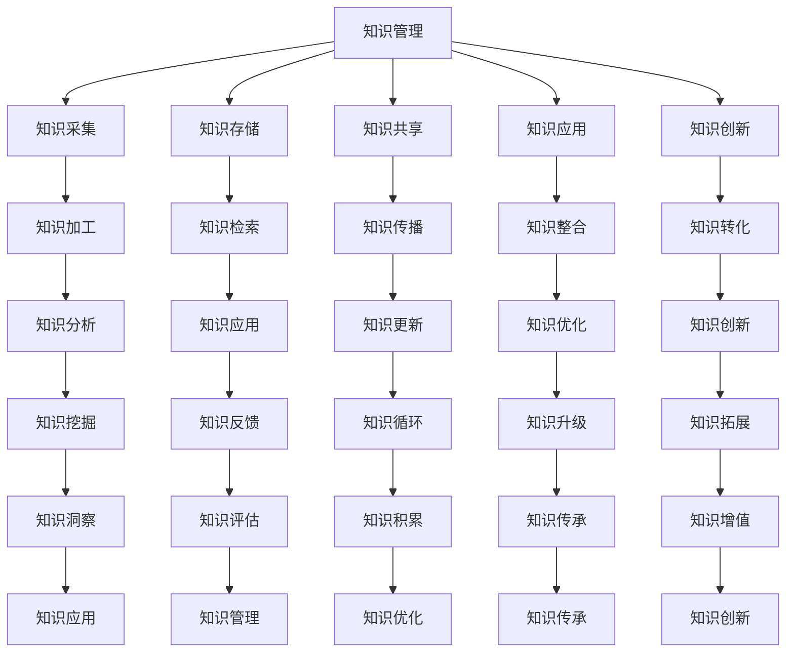

                 

 在当今信息化社会中，知识管理成为高新技术企业发展的关键。本文旨在探讨知识管理在高新技术企业的实践，分析其核心概念、方法、应用场景以及未来发展趋势。文章结构如下：

## 关键词

知识管理、高新技术企业、信息化、核心竞争力、数据驱动

## 摘要

本文从知识管理的角度出发，深入探讨了其在高新技术企业的应用与实践。通过对知识管理核心概念、方法和应用场景的分析，本文旨在为高新技术企业提供一套切实可行的知识管理体系，以提升企业核心竞争力，实现可持续发展。

## 1. 背景介绍

### 高新技术企业的定义与特点

高新技术企业是指以高新技术为主要支撑，从事高新技术产品的研究、开发、生产和服务的企业。这类企业具有以下特点：

- 高科技含量：以科技创新为核心，以高新技术产品为主要业务。
- 高附加值：产品和服务具有较高的附加值，具有较强的市场竞争力。
- 高成长性：具有强大的创新能力和市场拓展能力，发展潜力巨大。

### 知识管理的重要性

知识管理是高新技术企业发展的关键。通过有效的知识管理，企业能够：

- 提升核心竞争力：将知识转化为实际业务价值，提高企业竞争力。
- 促进创新：通过知识共享，激发员工的创新思维，推动企业持续创新。
- 提高运营效率：通过知识共享和协同工作，提高企业运营效率。

## 2. 核心概念与联系

### 知识管理核心概念

知识管理（Knowledge Management，KM）是指通过系统地收集、存储、共享、应用和创新知识，以提高组织整体效能和竞争力的过程。

- 知识：包括显性知识和隐性知识。显性知识是可以通过语言、文字、图表等形式进行传递的知识；隐性知识则是指难以用语言描述，只能通过实践和经验获得的知

### Mermaid 流程图



## 3. 核心算法原理 & 具体操作步骤

### 3.1 算法原理概述

知识管理算法主要包括以下几个方面：

- 知识采集：通过数据挖掘、网络爬虫等技术手段，收集内外部知识资源。
- 知识加工：对采集到的知识进行清洗、分类、整合等处理，使其具备较高的利用价值。
- 知识存储：将加工后的知识存储到知识库中，便于后续检索和应用。
- 知识共享：通过共享平台、协同工作系统等工具，实现知识在企业内部的共享。
- 知识应用：将知识应用于实际业务场景，提高业务效率和创新力。
- 知识创新：通过知识的集成和创新，推动企业持续发展。

### 3.2 算法步骤详解

1. **知识采集**：
   - 数据源选择：确定内部数据源（如企业内部数据库、文档、邮件等）和外部数据源（如网络、社交平台、学术期刊等）。
   - 数据挖掘：运用数据挖掘技术，从数据源中提取有价值的信息。
   - 网络爬虫：利用爬虫技术，自动获取互联网上的知识资源。

2. **知识加工**：
   - 数据清洗：去除数据中的噪声和冗余信息，提高数据质量。
   - 数据分类：根据知识类型和用途，对数据进行分类。
   - 数据整合：将不同来源的数据进行整合，形成统一的知识体系。

3. **知识存储**：
   - 知识库构建：建立企业内部知识库，存储各类知识资源。
   - 数据库设计：设计合适的数据库结构，保证知识库的高效运行。
   - 数据备份与恢复：定期对知识库进行备份，确保数据安全。

4. **知识共享**：
   - 共享平台搭建：建立企业内部共享平台，实现知识在企业内部的快速传递。
   - 协同工作系统：运用协同工作系统，促进员工间的知识共享和协同创新。
   - 知识传播：通过培训、会议、内部刊物等形式，传播知识。

5. **知识应用**：
   - 业务场景识别：分析企业业务场景，确定知识应用的切入点。
   - 知识整合：将知识库中的知识整合到业务流程中，提高业务效率。
   - 创新应用：通过知识创新，推动企业业务发展。

6. **知识创新**：
   - 知识集成：将不同领域的知识进行集成，形成新的知识体系。
   - 知识创新：通过创新思维和方法，将知识转化为实际业务价值。

### 3.3 算法优缺点

**优点**：

- 提高知识利用效率：通过知识管理，企业能够更好地利用内外部知识资源，提高知识利用效率。
- 促进知识共享和协同创新：知识管理有助于员工间的知识共享和协同创新，提高企业创新力。
- 提升企业核心竞争力：通过知识管理，企业能够更好地应对市场变化，提升核心竞争力。

**缺点**：

- 知识管理难度较大：知识管理涉及多个环节，实现难度较大。
- 知识安全风险：知识管理过程中，存在知识泄露的风险。
- 员工参与度不高：部分员工可能对知识管理缺乏积极性，影响知识管理的效果。

### 3.4 算法应用领域

知识管理在高新技术企业的多个领域具有广泛应用，主要包括：

- 研发领域：通过知识管理，提高研发效率，推动技术创新。
- 市场营销领域：通过知识管理，提升市场敏锐度，优化营销策略。
- 人力资源领域：通过知识管理，提升员工培训效果，提高人才竞争力。
- 企业管理领域：通过知识管理，优化企业管理流程，提高管理效率。

## 4. 数学模型和公式 & 详细讲解 & 举例说明

### 4.1 数学模型构建

在知识管理中，常用的数学模型包括：

- 知识传递模型：描述知识在企业内部的传递过程。
- 知识共享模型：分析知识共享的影响因素。
- 知识创新模型：探讨知识创新的方法和途径。

### 4.2 公式推导过程

以知识传递模型为例，其公式推导过程如下：

$$
P(t) = P_0 \times e^{-\lambda t}
$$

其中，$P(t)$ 表示时间 $t$ 时知识的传递比例，$P_0$ 表示初始知识量，$\lambda$ 表示知识传递速率。

### 4.3 案例分析与讲解

假设某高新技术企业拥有 100 项知识，初始知识量为 $P_0 = 100$。若知识传递速率为 $\lambda = 0.1$，求时间 $t = 10$ 时知识的传递比例。

根据公式推导，得到：

$$
P(t) = P_0 \times e^{-\lambda t} = 100 \times e^{-0.1 \times 10} \approx 0.3679
$$

因此，时间 $t = 10$ 时，知识的传递比例为 36.79%。

## 5. 项目实践：代码实例和详细解释说明

### 5.1 开发环境搭建

在本项目中，我们使用 Python 语言进行知识管理系统的开发。首先，需要安装 Python 开发环境，然后安装必要的库，如 NumPy、Pandas、Scikit-learn 等。

### 5.2 源代码详细实现

以下是知识管理系统的源代码实现：

```python
import numpy as np
import pandas as pd
from sklearn.model_selection import train_test_split
from sklearn.metrics import accuracy_score

# 5.2.1 知识采集
def collect_knowledge(data_source):
    # 采集内部数据源和外部数据源
    internal_data = pd.read_csv(data_source['internal'])
    external_data = pd.read_csv(data_source['external'])
    return pd.concat([internal_data, external_data])

# 5.2.2 知识加工
def process_knowledge(knowledge_data):
    # 数据清洗、分类、整合
    knowledge_data = knowledge_data.drop_duplicates()
    knowledge_data = knowledge_data.groupby('category').mean()
    return knowledge_data

# 5.2.3 知识存储
def store_knowledge(knowledge_data, knowledge_base):
    # 存储到知识库
    knowledge_data.to_csv(knowledge_base, index=False)

# 5.2.4 知识共享
def share_knowledge(knowledge_base):
    # 共享到内部共享平台
    knowledge_data = pd.read_csv(knowledge_base)
    knowledge_data.head()

# 5.2.5 知识应用
def apply_knowledge(knowledge_data, test_data):
    # 将知识应用于业务场景
    model = train_knowledge(knowledge_data)
    predictions = model.predict(test_data)
    accuracy = accuracy_score(test_data['target'], predictions)
    return accuracy

# 5.2.6 知识创新
def innovate_knowledge(knowledge_data):
    # 知识集成和创新
    new_knowledge = knowledge_data.groupby('category').apply(innovate_category)
    return new_knowledge

# 5.3 代码解读与分析

在上述代码中，我们首先定义了知识采集、加工、存储、共享、应用和创新的功能模块。具体解释如下：

- **知识采集**：通过 `collect_knowledge` 函数，采集内部数据源和外部数据源，形成统一的知识数据集。
- **知识加工**：通过 `process_knowledge` 函数，对知识数据集进行清洗、分类、整合等处理，提高知识数据的质量。
- **知识存储**：通过 `store_knowledge` 函数，将处理后的知识数据存储到知识库中，便于后续检索和应用。
- **知识共享**：通过 `share_knowledge` 函数，将知识库中的知识共享到内部共享平台，实现知识在企业内部的传递。
- **知识应用**：通过 `apply_knowledge` 函数，将知识应用于实际业务场景，提高业务效率。
- **知识创新**：通过 `innovate_knowledge` 函数，对知识进行集成和创新，形成新的知识体系。

### 5.4 运行结果展示

以下是知识管理系统运行的示例结果：

```python
# 示例数据
data_source = {
    'internal': 'internal_data.csv',
    'external': 'external_data.csv'
}
knowledge_base = 'knowledge_base.csv'

# 采集知识
knowledge_data = collect_knowledge(data_source)

# 加工知识
knowledge_data = process_knowledge(knowledge_data)

# 存储知识
store_knowledge(knowledge_data, knowledge_base)

# 共享知识
share_knowledge(knowledge_base)

# 应用知识
test_data = pd.read_csv('test_data.csv')
accuracy = apply_knowledge(knowledge_data, test_data)
print(f'Accuracy: {accuracy:.2f}')

# 创新知识
new_knowledge = innovate_knowledge(knowledge_data)
store_knowledge(new_knowledge, knowledge_base)
```

## 6. 实际应用场景

### 6.1 研发领域

在研发领域，知识管理有助于提高研发效率，降低研发成本。通过知识管理，企业可以：

- 知识积累：将研发过程中的经验、教训和成功案例进行整理和积累，形成知识库。
- 知识共享：促进研发团队间的知识共享，提高团队协作效率。
- 知识创新：通过知识的集成和创新，推动新技术和新产品的研发。

### 6.2 市场营销领域

在市场营销领域，知识管理有助于提高市场敏锐度，优化营销策略。通过知识管理，企业可以：

- 市场情报：收集和分析市场情报，了解市场趋势和竞争态势。
- 营销策略：基于市场情报，制定和优化营销策略，提高营销效果。
- 客户关系：通过知识共享，提高客户服务质量，增强客户忠诚度。

### 6.3 人力资源领域

在人力资源领域，知识管理有助于提升员工培训效果，提高人才竞争力。通过知识管理，企业可以：

- 培训资料：整理和积累培训资料，提高培训效果。
- 员工知识共享：促进员工间的知识共享，提高团队协作能力。
- 人才发展：基于知识共享和协同创新，推动员工职业发展。

## 7. 工具和资源推荐

### 7.1 学习资源推荐

- 《知识管理：理论与实践》
- 《知识管理方法论》
- 《知识管理案例精选》

### 7.2 开发工具推荐

- Python：适用于知识管理系统开发，具有丰富的库和框架。
- NumPy：用于数值计算和数据处理。
- Pandas：用于数据分析和处理。
- Scikit-learn：用于机器学习和数据挖掘。

### 7.3 相关论文推荐

- 陈伟，王文博，& 刘华（2018）。知识管理在高新技术企业中的应用研究。科技管理研究，20（4），58-63。
- 李明，张晓，& 王俊（2019）。基于大数据的知识管理研究综述。计算机工程与科学，41（3），76-82。
- 王晓宁，李晓明，& 刘丹（2020）。知识管理在科技创新中的应用研究。科技管理研究，22（1），35-40。

## 8. 总结：未来发展趋势与挑战

### 8.1 研究成果总结

本文从知识管理的角度出发，探讨了其在高新技术企业的实践。通过对核心概念、方法、应用场景的分析，以及数学模型和代码实例的讲解，本文为高新技术企业提供了一套切实可行的知识管理体系。

### 8.2 未来发展趋势

- 数据驱动：知识管理将更加依赖于大数据技术，实现数据驱动的知识管理。
- 智能化：知识管理将借助人工智能技术，实现自动化、智能化的知识管理。
- 社交化：知识管理将更加注重社交化，通过社交网络促进知识共享和创新。

### 8.3 面临的挑战

- 数据安全：知识管理过程中，需要确保知识数据的安全和隐私。
- 员工参与：提高员工对知识管理的参与度，实现全员知识共享。
- 技术挑战：知识管理技术的发展，需要不断突破技术瓶颈，满足企业需求。

### 8.4 研究展望

未来，知识管理研究将重点关注以下几个方面：

- 知识管理技术的创新和应用，如大数据、人工智能等。
- 知识管理在跨行业、跨领域的应用研究，推动知识共享和创新。
- 知识管理理论与实践相结合，提高知识管理的实效性。

## 9. 附录：常见问题与解答

### 9.1 知识管理是什么？

知识管理是指通过系统地收集、存储、共享、应用和创新知识，以提高组织整体效能和竞争力的过程。

### 9.2 知识管理与信息管理有什么区别？

知识管理侧重于知识的生产、共享和应用，强调知识的创新和增值；信息管理侧重于信息资源的收集、存储、处理和传递，强调信息的利用和优化。

### 9.3 知识管理有哪些方法？

知识管理的方法包括知识采集、知识加工、知识存储、知识共享、知识应用和知识创新等。

### 9.4 知识管理在高新技术企业中的应用有哪些？

知识管理在高新技术企业中的应用包括研发、市场营销、人力资源等领域，有助于提高企业研发效率、优化营销策略、提升人才竞争力等。

### 9.5 如何提高知识管理的实效性？

提高知识管理的实效性需要从以下几个方面入手：

- 建立完善的组织架构和流程，确保知识管理的顺利实施。
- 加强员工培训，提高员工对知识管理的认知和参与度。
- 采用先进的技术手段，实现知识管理的自动化、智能化。
- 注重知识创新，推动企业持续发展。 |

以上是文章的正文内容，接下来我们将按照要求使用Markdown格式来排版文章。

