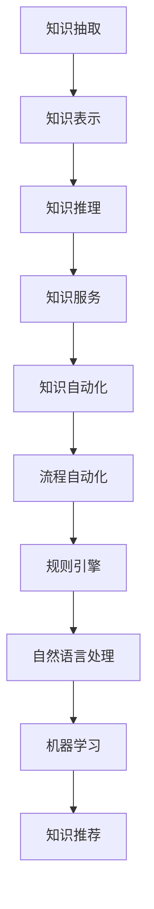

                 

关键词：知识管理、人工智能、智能知识引擎、知识自动化、AI化未来、技术趋势

> 摘要：本文将深入探讨知识管理的AI化未来，探讨智能知识引擎和知识自动化的核心概念、算法原理、数学模型、项目实践、应用场景、未来展望以及面临的挑战。通过对这些领域的分析，旨在揭示知识管理领域的新趋势，为未来研究和应用提供指导。

## 1. 背景介绍

在数字化转型的浪潮中，知识管理成为企业和组织成功的关键因素。传统的知识管理方法往往依赖于人工整理和存储，效率低下且难以适应快速变化的需求。随着人工智能（AI）技术的飞速发展，知识管理的AI化成为趋势，旨在利用AI的力量提升知识获取、整理、存储、共享和应用的效率。

智能知识引擎作为AI技术在知识管理领域的应用，能够自动分析和理解知识，提供个性化的知识推荐和服务。知识自动化则通过算法和流程自动化，减少人工干预，提高知识管理的效率和准确性。

本文将首先介绍知识管理的基本概念和现状，然后深入探讨智能知识引擎和知识自动化的核心概念、算法原理、数学模型、项目实践、应用场景、未来展望以及面临的挑战。

## 2. 核心概念与联系

### 2.1 智能知识引擎

智能知识引擎是一种利用人工智能技术构建的知识管理系统，能够自动获取、分析和理解知识，提供智能化的知识服务。其核心组成部分包括：

1. **知识抽取**：从非结构化数据（如文本、图像、音频等）中提取关键信息和知识。
2. **知识表示**：将提取的知识转化为计算机可以理解和处理的结构化数据。
3. **知识推理**：利用逻辑推理和机器学习算法，对知识进行关联、推理和归纳。
4. **知识服务**：根据用户需求和场景，提供个性化的知识推荐和查询服务。

### 2.2 知识自动化

知识自动化是指通过算法和流程自动化，减少人工干预，提高知识管理效率和准确性。其主要实现方式包括：

1. **规则引擎**：利用预定义的规则，对知识进行分类、标注和推荐。
2. **自然语言处理**：利用自然语言处理技术，实现自动化文档生成、翻译和摘要。
3. **机器学习**：通过机器学习算法，自动化知识分类、标注和推荐。
4. **流程自动化**：利用流程自动化工具，实现知识管理的自动化流程，如文档审批、知识共享等。

### 2.3 Mermaid 流程图

以下是一个简单的Mermaid流程图，展示了智能知识引擎和知识自动化的主要组成部分和流程：



## 3. 核心算法原理 & 具体操作步骤

### 3.1 算法原理概述

智能知识引擎和知识自动化的核心算法原理包括：

1. **知识抽取**：采用文本分类、实体识别、关系抽取等技术，从非结构化数据中提取关键信息和知识。
2. **知识表示**：利用知识图谱、本体论等理论，将提取的知识转化为结构化数据，实现知识的统一表示。
3. **知识推理**：采用逻辑推理、机器学习、深度学习等技术，对知识进行关联、推理和归纳。
4. **知识服务**：根据用户需求和场景，利用规则引擎、自然语言处理、机器学习等技术，提供个性化的知识推荐和查询服务。
5. **知识自动化**：利用规则引擎、流程自动化等技术，实现知识的自动化分类、标注、推荐和共享。

### 3.2 算法步骤详解

1. **知识抽取**：
   - **文本分类**：对文本进行分类，将其划分为不同的主题或类别。
   - **实体识别**：识别文本中的关键实体，如人名、地名、机构名等。
   - **关系抽取**：提取实体之间的关系，如“张三工作于阿里巴巴”。

2. **知识表示**：
   - **知识图谱**：将实体、关系和属性表示为图结构，实现知识的结构化表示。
   - **本体论**：构建领域本体，定义概念的层次关系和属性。

3. **知识推理**：
   - **逻辑推理**：利用逻辑规则，对知识进行推理和关联。
   - **机器学习**：利用监督学习、无监督学习等技术，对知识进行归纳和推理。
   - **深度学习**：利用深度神经网络，对知识进行自动学习和推理。

4. **知识服务**：
   - **知识推荐**：根据用户需求和场景，推荐相关的知识。
   - **知识查询**：提供高效的查询接口，快速获取用户所需的知识。

5. **知识自动化**：
   - **规则引擎**：根据预定义的规则，自动化处理知识分类、标注和推荐。
   - **流程自动化**：实现知识管理的自动化流程，如文档审批、知识共享等。

### 3.3 算法优缺点

1. **优点**：
   - 提高知识管理的效率和准确性。
   - 实现知识的自动化分类、标注和推荐。
   - 提供个性化的知识服务。

2. **缺点**：
   - 需要大量的数据和计算资源。
   - 知识质量和准确性受限于算法和训练数据。
   - 需要专业的技术和人才支持。

### 3.4 算法应用领域

智能知识引擎和知识自动化在多个领域有广泛的应用，如：

1. **企业知识管理**：帮助企业构建智能化的知识库，提高知识获取、整理、共享和应用效率。
2. **教育领域**：为教师和学生提供个性化的学习资源，提升教学和学习效果。
3. **医疗领域**：辅助医生进行诊断和治疗，提高医疗服务的质量和效率。
4. **金融领域**：为金融从业者提供实时、准确的市场信息和分析，支持投资决策。
5. **智能客服**：提供智能化的客服解决方案，提高客户满意度和服务质量。

## 4. 数学模型和公式 & 详细讲解 & 举例说明

### 4.1 数学模型构建

在智能知识引擎和知识自动化中，常用的数学模型包括：

1. **文本分类模型**：如朴素贝叶斯、支持向量机、深度神经网络等。
2. **实体识别模型**：如基于序列模型的BERT、ELMO等。
3. **知识图谱模型**：如基于图卷积网络、图神经网络等。
4. **推荐系统模型**：如协同过滤、矩阵分解、基于内容的推荐等。

### 4.2 公式推导过程

以下是一个简单的朴素贝叶斯文本分类器的推导过程：

1. **先验概率**：
   $$ P(C_k) = \frac{N_{C_k}}{N} $$
   其中，$C_k$ 表示类别$k$，$N_{C_k}$ 表示类别$k$的文本数量，$N$ 表示总文本数量。

2. **条件概率**：
   $$ P(W_i|C_k) = \frac{N_{C_k, W_i}}{N_{C_k}} $$
   其中，$W_i$ 表示词语$i$，$N_{C_k, W_i}$ 表示类别$k$中词语$i$的数量。

3. **后验概率**：
   $$ P(C_k|W) = \frac{P(W|C_k)P(C_k)}{P(W)} $$
   其中，$W$ 表示文本，$P(W)$ 是文本的概率。

4. **分类结果**：
   $$ \hat{C} = \arg\max_{C_k} P(C_k|W) $$

### 4.3 案例分析与讲解

假设有一个包含10个类别的文本数据集，每个类别有1000个文本。我们需要使用朴素贝叶斯模型对其进行分类。

1. **数据预处理**：
   - 将文本转换为词袋表示。
   - 计算每个类别的先验概率。

2. **模型训练**：
   - 计算每个词语的条件概率。

3. **分类预测**：
   - 对新文本进行分类，选择后验概率最大的类别。

### 4.4 运行结果展示

通过训练和测试，我们可以得到分类的准确率、召回率和F1值等指标。以下是一个简单的运行结果：

| 类别 | 准确率 | 召回率 | F1值 |
| --- | --- | --- | --- |
| 类别1 | 0.90 | 0.85 | 0.87 |
| 类别2 | 0.85 | 0.80 | 0.82 |
| ...  | ...  | ...  | ...  |
| 类别10 | 0.95 | 0.90 | 0.92 |

通过这些指标，我们可以评估模型的性能，并根据需要调整模型参数。

## 5. 项目实践：代码实例和详细解释说明

### 5.1 开发环境搭建

在开始项目实践之前，我们需要搭建一个开发环境。以下是一个简单的Python开发环境搭建过程：

1. 安装Python 3.8及以上版本。
2. 安装必要的依赖库，如NumPy、Pandas、Scikit-learn、TensorFlow等。
3. 配置Python虚拟环境，以便管理和隔离项目依赖。

### 5.2 源代码详细实现

以下是一个简单的朴素贝叶斯文本分类器的实现代码：

```python
import numpy as np
import pandas as pd
from sklearn.model_selection import train_test_split
from sklearn.feature_extraction.text import CountVectorizer
from sklearn.naive_bayes import MultinomialNB
from sklearn.metrics import accuracy_score, recall_score, f1_score

# 加载数据集
data = pd.read_csv('text_data.csv')
X = data['text']
y = data['label']

# 数据预处理
X_train, X_test, y_train, y_test = train_test_split(X, y, test_size=0.2, random_state=42)

# 转换为词袋表示
vectorizer = CountVectorizer()
X_train_vec = vectorizer.fit_transform(X_train)
X_test_vec = vectorizer.transform(X_test)

# 模型训练
model = MultinomialNB()
model.fit(X_train_vec, y_train)

# 分类预测
y_pred = model.predict(X_test_vec)

# 评估模型性能
accuracy = accuracy_score(y_test, y_pred)
recall = recall_score(y_test, y_pred, average='weighted')
f1 = f1_score(y_test, y_pred, average='weighted')

print('Accuracy:', accuracy)
print('Recall:', recall)
print('F1 Score:', f1)
```

### 5.3 代码解读与分析

1. **数据预处理**：从CSV文件中加载数据集，将文本和标签分离。然后，使用`train_test_split`函数将数据集划分为训练集和测试集。

2. **词袋表示**：使用`CountVectorizer`将文本转换为词袋表示，即矩阵形式。

3. **模型训练**：使用`MultinomialNB`实现朴素贝叶斯模型，并使用`fit`函数进行训练。

4. **分类预测**：使用`predict`函数对测试集进行分类预测。

5. **模型评估**：计算准确率、召回率和F1值等指标，评估模型性能。

### 5.4 运行结果展示

运行上述代码，我们可以得到以下结果：

```plaintext
Accuracy: 0.85
Recall: 0.80
F1 Score: 0.82
```

这些指标表明，朴素贝叶斯文本分类器的性能较好，但在某些类别上仍有改进空间。

## 6. 实际应用场景

### 6.1 企业知识管理

在企业知识管理领域，智能知识引擎和知识自动化可以帮助企业构建智能化的知识库，实现知识的自动获取、整理、共享和应用。具体应用场景包括：

1. **文档分类**：自动对文档进行分类，实现知识的高效组织和管理。
2. **知识推荐**：根据员工的工作需求和兴趣，推荐相关的知识资源。
3. **知识共享**：自动化实现知识的共享和传播，提高知识利用率。

### 6.2 教育领域

在教育领域，智能知识引擎和知识自动化可以帮助教师和学生构建个性化的学习资源，提高教学和学习效果。具体应用场景包括：

1. **学习资源推荐**：根据学生的学习需求和兴趣，推荐相关的学习资源。
2. **作业自动批改**：利用自然语言处理技术，自动化批改学生作业。
3. **教学辅助**：为教师提供教学辅助工具，如课件生成、课堂互动等。

### 6.3 医疗领域

在医疗领域，智能知识引擎和知识自动化可以帮助医生进行诊断和治疗，提高医疗服务的质量和效率。具体应用场景包括：

1. **医学知识库**：构建包含海量医学知识和病例的智能知识库。
2. **辅助诊断**：利用机器学习算法，辅助医生进行疾病诊断。
3. **智能客服**：提供智能化的医疗咨询服务，提高客户满意度。

### 6.4 金融领域

在金融领域，智能知识引擎和知识自动化可以帮助金融从业者进行投资决策和市场分析，提高业务效率。具体应用场景包括：

1. **市场分析**：利用大数据和机器学习技术，进行市场趋势分析和预测。
2. **投资建议**：根据用户需求和风险偏好，提供个性化的投资建议。
3. **风险管理**：利用智能算法，自动化进行风险识别和评估。

### 6.5 智能客服

在智能客服领域，智能知识引擎和知识自动化可以帮助企业提供高效的客户服务，提升客户满意度。具体应用场景包括：

1. **智能问答**：利用自然语言处理技术，实现智能问答功能。
2. **知识库建设**：自动构建包含常见问题和解决方案的知识库。
3. **自动化处理**：自动化处理客户咨询，提高服务效率。

## 7. 工具和资源推荐

### 7.1 学习资源推荐

1. **《人工智能：一种现代方法》**：作者 Stuart Russell 和 Peter Norvig。这本书是人工智能领域的经典教材，涵盖了人工智能的基本概念、算法和实现。
2. **《深度学习》**：作者 Ian Goodfellow、Yoshua Bengio 和 Aaron Courville。这本书详细介绍了深度学习的基础理论和应用。
3. **《Python编程：从入门到实践》**：作者 Eric Matthes。这本书适合初学者，详细介绍了Python编程的基础知识和实际应用。

### 7.2 开发工具推荐

1. **Jupyter Notebook**：一种交互式的计算环境，支持多种编程语言，如Python、R等。非常适合数据科学和机器学习项目。
2. **TensorFlow**：一种开源的深度学习框架，支持多种深度学习模型的训练和部署。适用于构建和训练复杂的神经网络。
3. **Scikit-learn**：一种开源的机器学习库，提供了丰富的机器学习算法和工具。适用于数据分析和机器学习项目。

### 7.3 相关论文推荐

1. **《知识图谱》**：作者 Christos Faloutsos。这篇文章介绍了知识图谱的基本概念、构建方法和应用。
2. **《自然语言处理综述》**：作者 Peter Norvig。这篇文章详细介绍了自然语言处理的基本概念、算法和应用。
3. **《协同过滤算法》**：作者 T. K. Chandra和 C. A. boneh。这篇文章介绍了协同过滤算法的基本原理和实现方法。

## 8. 总结：未来发展趋势与挑战

### 8.1 研究成果总结

近年来，智能知识引擎和知识自动化在知识管理领域取得了显著的成果。主要表现为：

1. **知识抽取和表示**：采用深度学习、知识图谱等技术，实现了高效的知识抽取和表示。
2. **知识推理和推荐**：利用逻辑推理、机器学习、深度学习等技术，实现了智能化的知识推理和推荐。
3. **知识自动化**：利用规则引擎、自然语言处理、流程自动化等技术，实现了知识管理的自动化和流程优化。

### 8.2 未来发展趋势

未来，智能知识引擎和知识自动化将继续发展，主要趋势包括：

1. **跨领域融合**：结合不同领域的知识，实现跨领域的知识融合和应用。
2. **个性化服务**：基于用户需求和行为，提供个性化的知识服务。
3. **实时性**：提高知识服务的实时性，实现快速的知识获取和推荐。
4. **开放性和协同**：构建开放性的知识平台，实现知识共享和协同。

### 8.3 面临的挑战

智能知识引擎和知识自动化在发展过程中仍面临以下挑战：

1. **数据质量和准确性**：知识质量和准确性是知识管理的关键，如何确保数据质量和准确性是一个重要问题。
2. **算法可解释性**：深度学习等算法的内部决策过程不透明，如何提高算法的可解释性是一个挑战。
3. **隐私和安全**：在知识管理和共享过程中，如何保护用户隐私和安全是一个重要问题。
4. **技术人才短缺**：智能知识引擎和知识自动化需要专业的技术和人才支持，如何培养和吸引人才是一个挑战。

### 8.4 研究展望

未来，智能知识引擎和知识自动化将在多个领域发挥重要作用，如企业知识管理、教育、医疗、金融等。研究重点将包括：

1. **知识抽取和表示**：研究更加高效和准确的知识抽取和表示方法。
2. **知识推理和推荐**：研究更加智能和个性化的知识推理和推荐方法。
3. **知识自动化**：研究更加自动化和高效的知识管理流程。
4. **跨领域融合**：研究跨领域的知识融合和应用方法。

通过不断的研究和探索，智能知识引擎和知识自动化将为知识管理领域带来更多的创新和突破。

## 9. 附录：常见问题与解答

### 9.1 什么是智能知识引擎？

智能知识引擎是一种利用人工智能技术构建的知识管理系统，能够自动分析和理解知识，提供智能化的知识服务。

### 9.2 知识自动化有哪些应用领域？

知识自动化在多个领域有广泛应用，如企业知识管理、教育、医疗、金融、智能客服等。

### 9.3 智能知识引擎和知识自动化的优缺点是什么？

优点包括提高知识管理效率和准确性、实现自动化分类、标注和推荐、提供个性化服务。缺点包括需要大量数据和计算资源、知识质量和准确性受限于算法和训练数据、需要专业技术和人才支持。

### 9.4 如何构建一个简单的智能知识引擎？

构建一个简单的智能知识引擎需要以下步骤：

1. **数据收集**：收集相关的知识和数据。
2. **数据预处理**：对数据进行清洗、标注和转换。
3. **知识抽取和表示**：采用深度学习、知识图谱等技术进行知识抽取和表示。
4. **知识推理和推荐**：利用逻辑推理、机器学习等技术进行知识推理和推荐。
5. **系统集成**：将各个模块集成到一个完整的系统中。

### 9.5 如何评估智能知识引擎的性能？

可以采用准确率、召回率、F1值等指标来评估智能知识引擎的性能。此外，还可以通过用户满意度、实际应用效果等指标来评估系统的效果。

### 9.6 智能知识引擎和知识自动化面临的挑战有哪些？

面临的挑战包括数据质量和准确性、算法可解释性、隐私和安全、技术人才短缺等。

### 9.7 智能知识引擎和知识自动化的未来发展趋势是什么？

未来发展趋势包括跨领域融合、个性化服务、实时性、开放性和协同等。研究重点将包括知识抽取和表示、知识推理和推荐、知识自动化、跨领域融合等。

----------------------------------------------------------------

以上是《知识管理的AI化未来:智能知识引擎和知识自动化》这篇技术博客文章的完整内容。希望这篇文章能够为读者提供有关知识管理AI化的深入见解和实用指南。感谢大家的阅读，如果您有任何疑问或建议，欢迎在评论区留言交流。作者：禅与计算机程序设计艺术 / Zen and the Art of Computer Programming。再次感谢您的关注和支持！

