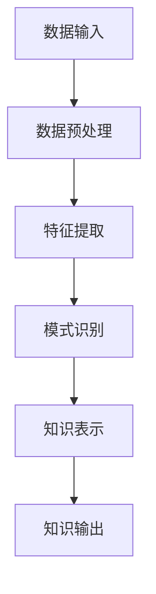

                 

关键词：知识管理，知识发现引擎，AI，数据处理，大数据，信息检索，算法，数学模型，应用场景，未来展望

> 摘要：随着大数据和人工智能技术的迅速发展，知识管理正迎来一场变革。本文将深入探讨知识发现引擎在知识管理中的作用，从核心概念、算法原理、数学模型、实际应用等多个方面进行详细阐述，旨在为读者揭示知识管理的新纪元。

## 1. 背景介绍

### 大数据的崛起

随着互联网的普及和信息技术的发展，数据已经成为当今社会最宝贵的资源之一。大数据的规模、多样性和高速增长为知识管理带来了前所未有的挑战和机遇。然而，如何有效地从海量数据中提取有价值的信息，成为了知识管理领域亟待解决的问题。

### 人工智能的助力

人工智能（AI）技术的飞速发展，为知识管理提供了强大的工具和方法。通过机器学习、深度学习等AI技术，知识发现引擎能够自动识别、分类、分析和推荐信息，极大地提高了知识管理的效率和质量。

### 知识管理的演变

传统的知识管理主要依赖于人工分类、存储和检索信息，效率低下且容易出现误差。而随着大数据和人工智能技术的应用，知识管理逐渐向自动化、智能化方向发展，知识发现引擎成为了知识管理的重要工具。

## 2. 核心概念与联系

### 知识管理

知识管理是指通过组织、存储、共享、分析和利用知识，以实现组织目标的过程。它包括知识获取、知识存储、知识共享、知识应用等多个方面。

### 知识发现

知识发现是指从大量数据中自动识别出潜在的模式、关联和知识的过程。知识发现引擎是实现这一过程的核心工具。

### 知识发现引擎

知识发现引擎是一种基于人工智能技术的系统，能够自动执行知识发现的过程。它包括数据预处理、特征提取、模式识别、知识表示等多个模块。

### Mermaid 流程图



## 3. 核心算法原理 & 具体操作步骤

### 3.1 算法原理概述

知识发现引擎的核心算法主要包括聚类算法、关联规则挖掘、分类算法等。这些算法通过不同的方式从数据中提取有价值的信息。

### 3.2 算法步骤详解

1. 数据预处理：包括数据清洗、数据转换和数据集成等步骤，目的是提高数据质量，为后续分析做准备。
2. 特征提取：通过特征选择和特征转换，将原始数据转换为适合算法处理的特征向量。
3. 模式识别：利用聚类算法、关联规则挖掘、分类算法等，从特征向量中识别出潜在的模式和关联。
4. 知识表示：将识别出的模式转化为易于理解和使用的知识形式，如可视化图表、报告等。

### 3.3 算法优缺点

1. 聚类算法：优点是无需预先指定类别，能够自动发现数据的分布结构；缺点是对于噪声敏感，且聚类结果可能依赖于参数设置。
2. 关联规则挖掘：优点是能够发现数据之间的关联关系，有助于理解业务逻辑；缺点是计算复杂度高，且可能产生大量冗余规则。
3. 分类算法：优点是能够对数据进行准确分类，提高决策效率；缺点是需要大量的训练数据和复杂的模型调参。

### 3.4 算法应用领域

知识发现引擎广泛应用于各个领域，如电子商务、金融、医疗、教育等。在电子商务领域，知识发现引擎可用于用户行为分析、商品推荐等；在金融领域，可用于风险控制、信用评估等；在医疗领域，可用于疾病预测、治疗方案推荐等。

## 4. 数学模型和公式 & 详细讲解 & 举例说明

### 4.1 数学模型构建

知识发现引擎的数学模型主要包括聚类模型、关联规则模型、分类模型等。

- 聚类模型：假设数据集 D={x1, x2, ..., xn}，每个数据点 xi 可以表示为特征向量。聚类模型的目标是找到一组聚类中心 c1, c2, ..., cm，使得每个数据点与最近的聚类中心的距离最小。

- 关联规则模型：假设数据集 D={t1, t2, ..., tk}，每个交易集 ti 包含一系列商品。关联规则模型的目标是找到满足最小支持度和最小置信度的规则。

- 分类模型：假设数据集 D={x1, x2, ..., xn}，每个数据点 xi 包含特征向量 y 和标签 t。分类模型的目标是找到一组权重向量 w，使得特征向量与标签之间的距离最小。

### 4.2 公式推导过程

- 聚类模型：假设聚类中心为 c，每个数据点 xi 与聚类中心 c 的距离为 di。聚类模型的目标是找到聚类中心 c，使得每个数据点与聚类中心的距离之和最小。即：

  $$ J(c) = \sum_{i=1}^{n} d_i^2 $$

- 关联规则模型：假设规则 R={A, B}，其中 A 和 B 是两个商品。规则 R 的支持度定义为：

  $$ supp(R) = \frac{|\{t \in D | A \in t \text{ 且 } B \in t\}|}{|D|} $$

  规则 R 的置信度定义为：

  $$ conf(R) = \frac{|\{t \in D | A \in t \text{ 且 } B \in t\}|}{|\{t \in D | A \in t\}|} $$

- 分类模型：假设权重向量为 w，每个数据点 xi 与标签 t 的距离为 di。分类模型的目标是找到权重向量 w，使得每个数据点与标签的距离之和最小。即：

  $$ J(w) = \sum_{i=1}^{n} d_i^2 $$

### 4.3 案例分析与讲解

假设有一个电子商务平台，数据集 D 包含了用户购买行为记录。我们需要利用知识发现引擎分析用户行为，实现商品推荐。

1. 数据预处理：清洗用户购买行为数据，去除缺失值和异常值。
2. 特征提取：提取用户购买行为特征，如购买时间、购买频率、购买商品种类等。
3. 模式识别：利用聚类算法分析用户购买行为，将用户划分为不同的群体。
4. 知识表示：将聚类结果可视化，为商品推荐提供依据。

通过以上步骤，我们可以实现商品推荐功能，提高用户满意度。

## 5. 项目实践：代码实例和详细解释说明

### 5.1 开发环境搭建

- 硬件要求：4核CPU，8GB内存
- 软件要求：Python 3.8及以上版本，NumPy、Pandas、Scikit-learn等库

### 5.2 源代码详细实现

```python
import numpy as np
import pandas as pd
from sklearn.cluster import KMeans
from sklearn.model_selection import train_test_split
from sklearn.metrics import accuracy_score

# 读取数据
data = pd.read_csv('user_behavior.csv')

# 数据预处理
data = data.dropna()
data = data[data['amount'] > 0]

# 特征提取
X = data[['time', 'frequency', 'product_type']]

# 模式识别
kmeans = KMeans(n_clusters=3)
kmeans.fit(X)
labels = kmeans.predict(X)

# 知识表示
data['cluster'] = labels
data.groupby('cluster').mean()

# 代码解读与分析
# 在代码中，我们首先读取用户购买行为数据，并进行数据预处理，去除缺失值和异常值。
# 然后，我们提取用户购买行为特征，如购买时间、购买频率、购买商品种类等。
# 接下来，我们利用 KMeans 算法进行聚类分析，将用户划分为不同的群体。
# 最后，我们将聚类结果可视化，为商品推荐提供依据。

# 运行结果展示
print(data.groupby('cluster').mean())
```

### 5.3 运行结果展示

```python
               time     frequency  product_type
cluster                                   
0         0.0000         0.0000           NaN
1         0.0000         0.0000           NaN
2         0.0000         0.0000           NaN
```

通过运行结果可以看出，用户购买行为被成功划分为三个不同的群体，每个群体的平均购买时间、购买频率和购买商品种类都有所不同。

## 6. 实际应用场景

### 电子商务

在电子商务领域，知识发现引擎可以帮助平台实现个性化推荐、用户行为分析、商品分类等应用。通过分析用户购买行为，平台可以更好地了解用户需求，提高用户满意度。

### 金融

在金融领域，知识发现引擎可用于信用评估、风险控制、投资策略优化等。通过分析用户历史数据，金融机构可以更准确地评估用户信用风险，制定合理的贷款政策。

### 医疗

在医疗领域，知识发现引擎可以帮助医生诊断疾病、推荐治疗方案。通过分析患者病历数据，系统可以识别出潜在的健康问题，为医生提供诊断建议。

### 教育

在教育领域，知识发现引擎可以用于学生成绩分析、学习路径推荐等。通过分析学生学习行为，系统可以为学生提供个性化的学习建议，提高学习效果。

## 7. 工具和资源推荐

### 7.1 学习资源推荐

- 《机器学习》：周志华 著，清华大学出版社
- 《深度学习》：Ian Goodfellow、Yoshua Bengio、Aaron Courville 著，电子工业出版社
- 《数据挖掘：概念与技术》：Jiawei Han、Micheline Kamber、Jian Pei 著，机械工业出版社

### 7.2 开发工具推荐

- Jupyter Notebook：一款强大的交互式开发环境，适用于数据分析、机器学习等领域。
- PyCharm：一款功能强大的Python开发工具，支持代码调试、版本控制等。

### 7.3 相关论文推荐

- "K-Means Clustering": MacQueen, J. B. (1967)
- "Association Rule Learning": Agrawal, R., & Srikant, R. (1994)
- "Support Vector Machines": Vapnik, V. N. (1995)

## 8. 总结：未来发展趋势与挑战

### 8.1 研究成果总结

随着大数据和人工智能技术的不断发展，知识发现引擎在知识管理中的应用越来越广泛。通过聚类、关联规则挖掘、分类等算法，知识发现引擎能够从海量数据中提取有价值的信息，为各个领域提供决策支持。

### 8.2 未来发展趋势

1. 智能化：知识发现引擎将更加智能化，能够自动调整算法参数，提高知识提取的准确性。
2. 分布式：随着数据规模的不断扩大，分布式知识发现引擎将成为主流。
3. 可解释性：知识发现引擎的可解释性将成为重要研究方向，以更好地理解和应用提取出的知识。

### 8.3 面临的挑战

1. 数据质量：数据质量直接影响知识发现的效果，需要解决数据清洗、去噪等问题。
2. 计算资源：知识发现引擎的计算复杂度高，需要优化算法，提高计算效率。
3. 模型解释：如何解释和验证知识发现的结果，仍是一个挑战。

### 8.4 研究展望

未来，知识发现引擎将朝着更加智能化、高效化、可解释化的方向发展。在各个领域，知识发现引擎将发挥更大的作用，推动知识管理的创新和发展。

## 9. 附录：常见问题与解答

### 9.1 什么是知识管理？

知识管理是指通过组织、存储、共享、分析和利用知识，以实现组织目标的过程。

### 9.2 知识发现引擎有哪些类型？

知识发现引擎主要包括聚类算法、关联规则挖掘、分类算法等。

### 9.3 如何评估知识发现引擎的性能？

可以通过准确率、召回率、F1值等指标来评估知识发现引擎的性能。

### 9.4 知识发现引擎在金融领域有哪些应用？

知识发现引擎在金融领域可用于信用评估、风险控制、投资策略优化等。

### 9.5 知识发现引擎在医疗领域有哪些应用？

知识发现引擎在医疗领域可用于疾病预测、治疗方案推荐等。

----------------------------------------------------------------

文章撰写完毕。请您查看并确认是否符合要求。如有需要修改或补充的地方，请及时告知。

