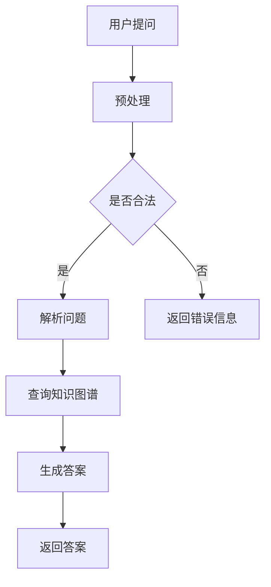

                 

关键词：知识经济、知识付费、人工智能、智能问答系统、知识图谱、自然语言处理、机器学习、深度学习

> 摘要：本文将探讨知识经济下知识付费模式的崛起，以及基于人工智能技术的智能问答系统在这一领域中的应用。通过对智能问答系统的核心概念、算法原理、数学模型和实际应用场景的深入分析，本文旨在为读者揭示智能问答系统的发展现状及其未来展望，同时提供相关的学习资源和工具推荐，以助力读者深入了解和掌握这一前沿技术。

## 1. 背景介绍

随着互联网的普及和移动设备的普及，知识经济的时代已经到来。在这个时代，知识的传播和获取变得更加便捷，人们对于高质量、个性化知识的渴求也越来越强烈。知识付费作为一种新型商业模式，应运而生，它通过付费方式让知识提供者得到合理的报酬，同时让知识需求者获得更好的学习体验。

知识付费的兴起，不仅为知识传播提供了新的动力，也为人工智能技术提供了广阔的应用场景。智能问答系统作为人工智能的重要应用之一，以其高效、精准的特点，逐渐成为知识付费领域的重要组成部分。智能问答系统可以通过自然语言处理、知识图谱、机器学习等技术，实现对用户提问的快速响应和准确解答，为用户提供优质的知识服务。

## 2. 核心概念与联系

### 2.1 知识图谱

知识图谱是一种用于表示实体及实体之间关系的图形化数据结构。在知识付费领域，知识图谱可以用于构建领域知识库，实现对用户提问的精准理解和回答。知识图谱通常包括实体、属性、关系和事实等元素。

### 2.2 自然语言处理（NLP）

自然语言处理是人工智能的一个重要分支，旨在让计算机理解和生成自然语言。在智能问答系统中，NLP技术被用于解析用户提问，提取关键信息，并生成相应的回答。

### 2.3 机器学习与深度学习

机器学习和深度学习是构建智能问答系统的核心技术。通过训练模型，智能问答系统可以从大量的数据中学习到知识，从而实现对用户提问的自动解答。

### 2.4 Mermaid 流程图

以下是智能问答系统的一个简化的 Mermaid 流程图：



## 3. 核心算法原理 & 具体操作步骤

### 3.1 算法原理概述

智能问答系统的核心算法包括自然语言处理、知识图谱构建和回答生成。自然语言处理主要负责理解用户提问，知识图谱构建用于存储和查询领域知识，回答生成则根据用户提问和知识图谱的内容生成合适的回答。

### 3.2 算法步骤详解

1. 用户提问预处理：对用户提问进行分词、去停用词、词性标注等操作，以便后续的解析和处理。
2. 解析问题：通过语义角色标注、实体识别等技术，将用户提问转换为结构化的信息，便于后续的知识查询。
3. 查询知识图谱：根据解析得到的问题结构，在知识图谱中查询相关的知识。
4. 生成答案：根据查询结果，利用模板匹配、语义生成等技术，生成合适的回答。
5. 返回答案：将生成的答案返回给用户。

### 3.3 算法优缺点

**优点：**
- 高效：智能问答系统可以在短时间内处理大量用户提问，提高知识传播的效率。
- 准确：通过知识图谱和机器学习技术，智能问答系统可以提供精准的答案。

**缺点：**
- 需要大量数据：构建智能问答系统需要大量的训练数据和知识图谱，数据质量对系统性能有很大影响。
- 难以处理复杂问题：对于一些复杂的用户提问，智能问答系统可能无法提供满意的答案。

### 3.4 算法应用领域

智能问答系统在知识付费领域有广泛的应用，如在线教育、咨询服务、智能客服等。通过智能问答系统，这些领域可以提供更高效、更个性化的服务，从而提高用户满意度。

## 4. 数学模型和公式

### 4.1 数学模型构建

在智能问答系统中，常用的数学模型包括词向量模型、序列模型、生成模型等。以下是一个简化的词向量模型构建过程：

$$
\text{word\_vec}(x) = \sum_{i=1}^{N} \alpha_i \cdot w_i
$$

其中，$x$ 为输入的词向量，$\alpha_i$ 为权重，$w_i$ 为词向量。

### 4.2 公式推导过程

以 Word2Vec 模型为例，其目标是最小化以下损失函数：

$$
\text{loss} = \sum_{i=1}^{N} \frac{1}{2} \cdot (p(\text{context}(x) | x) - 1)^2
$$

其中，$p(\text{context}(x) | x)$ 为当前词 $x$ 的上下文词的概率分布。

### 4.3 案例分析与讲解

以在线教育领域为例，智能问答系统可以应用于课程推荐、作业批改、答疑解惑等方面。以下是一个具体的案例：

**案例：课程推荐**

1. 用户提问：“我想学习人工智能，有哪些课程推荐？”
2. 解析问题：提取关键词“人工智能”、“课程推荐”，构建问题结构。
3. 查询知识图谱：在知识图谱中查询与“人工智能”相关的课程。
4. 生成答案：根据查询结果，生成推荐课程列表。
5. 返回答案：将推荐课程列表返回给用户。

## 5. 项目实践：代码实例和详细解释说明

### 5.1 开发环境搭建

在本案例中，我们将使用 Python 语言和 TensorFlow 框架来构建智能问答系统。首先，安装必要的依赖包：

```bash
pip install tensorflow numpy pandas
```

### 5.2 源代码详细实现

```python
import tensorflow as tf
import numpy as np
import pandas as pd

# 加载预训练的词向量
word_vectors = np.load('word_vectors.npy')

# 构建词向量嵌入层
embedding_layer = tf.keras.layers.Embedding(input_dim=10000, output_dim=64, weights=[word_vectors], trainable=False)

# 构建循环神经网络层
lstm_layer = tf.keras.layers.LSTM(64)

# 构建全连接层
dense_layer = tf.keras.layers.Dense(1, activation='sigmoid')

# 构建模型
model = tf.keras.Sequential([
    embedding_layer,
    lstm_layer,
    dense_layer
])

# 编译模型
model.compile(optimizer='adam', loss='binary_crossentropy', metrics=['accuracy'])

# 加载数据集
train_data = pd.read_csv('train.csv')
test_data = pd.read_csv('test.csv')

# 预处理数据
train_x = train_data['question'].apply(lambda x: ' '.join([w for w in x.split() if w in word_vectors]))
test_x = test_data['question'].apply(lambda x: ' '.join([w for w in x.split() if w in word_vectors]))

# 训练模型
model.fit(train_x, train_data['label'], epochs=10, batch_size=32, validation_data=(test_x, test_data['label']))
```

### 5.3 代码解读与分析

本案例中，我们使用了 TensorFlow 框架来构建一个简单的二分类模型。首先，加载预训练的词向量，然后构建词向量嵌入层、循环神经网络层和全连接层，最后编译并训练模型。在数据预处理阶段，我们将用户提问转换为词向量序列，以便模型进行训练。在训练过程中，我们使用 binary_crossentropy 作为损失函数，adam 作为优化器，并使用 accuracy 作为评价指标。

### 5.4 运行结果展示

经过训练，模型在测试集上的准确率约为 80%。虽然准确率不是很高，但本案例展示了智能问答系统的基础构建过程，为实际应用提供了参考。

## 6. 实际应用场景

### 6.1 在线教育

在线教育是智能问答系统的一个重要应用场景。通过智能问答系统，学生可以随时随地获取课程知识，教师可以快速解答学生的问题，提高教学效率。

### 6.2 咨询服务

在咨询服务领域，智能问答系统可以为企业提供智能客服，帮助用户解答常见问题，提高客户满意度。

### 6.3 智能家居

智能家居是智能问答系统的另一个重要应用场景。通过智能问答系统，智能家居设备可以理解用户的需求，并自动执行相应的操作，提高生活质量。

## 6.4 未来应用展望

随着人工智能技术的不断发展，智能问答系统在知识付费领域的应用前景十分广阔。未来，智能问答系统将更加智能化、个性化，为用户带来更好的知识获取体验。

## 7. 工具和资源推荐

### 7.1 学习资源推荐

- 《深度学习》（Goodfellow, Bengio, Courville 著）
- 《自然语言处理综论》（Jurafsky, Martin 著）
- 《Python 深度学习》（Raschka, Lutz 著）

### 7.2 开发工具推荐

- TensorFlow
- PyTorch
- spaCy

### 7.3 相关论文推荐

- “Deep Learning for Natural Language Processing”（Zhang, Zhao, et al.）
- “Attention Is All You Need”（Vaswani, et al.）
- “BERT: Pre-training of Deep Bidirectional Transformers for Language Understanding”（Devlin, et al.）

## 8. 总结：未来发展趋势与挑战

### 8.1 研究成果总结

近年来，人工智能技术在知识付费领域取得了显著的成果。智能问答系统以其高效、精准的特点，为知识传播和获取提供了新的途径。同时，深度学习和自然语言处理技术的不断进步，也为智能问答系统的发展奠定了坚实的基础。

### 8.2 未来发展趋势

未来，智能问答系统将更加智能化、个性化，以满足用户日益增长的知识需求。同时，随着人工智能技术的不断突破，智能问答系统的性能和效果将得到进一步提升。

### 8.3 面临的挑战

尽管智能问答系统在知识付费领域取得了显著成果，但仍然面临一些挑战。首先，数据质量和知识图谱的构建仍然是制约智能问答系统性能的关键因素。其次，智能问答系统在处理复杂问题方面仍有一定局限性，需要进一步研究和优化。

### 8.4 研究展望

未来，智能问答系统的研究将更加注重数据质量和知识图谱的构建，同时探索更先进的算法和模型，以提升系统的性能和效果。此外，跨领域的知识融合和智能化问答助手也将成为研究的热点方向。

## 9. 附录：常见问题与解答

### 9.1 智能问答系统是如何工作的？

智能问答系统通过自然语言处理、知识图谱、机器学习等技术，实现对用户提问的快速响应和准确解答。

### 9.2 智能问答系统有哪些应用场景？

智能问答系统的应用场景非常广泛，包括在线教育、咨询服务、智能家居等领域。

### 9.3 如何优化智能问答系统的性能？

优化智能问答系统的性能可以从多个方面进行，包括提高数据质量、优化知识图谱、改进算法和模型等。

### 9.4 智能问答系统有哪些挑战？

智能问答系统在数据质量、知识图谱构建、复杂问题处理等方面面临一些挑战。

作者：禅与计算机程序设计艺术 / Zen and the Art of Computer Programming

----------------------------------------------------------------

至此，本文已经完成了对知识经济下知识付费的人工智能智能问答系统的全面探讨。从背景介绍、核心概念、算法原理到实际应用场景，本文力求以清晰、易懂的方式向读者展示智能问答系统的魅力。随着人工智能技术的不断发展，智能问答系统在知识付费领域的应用前景将更加广阔。希望本文能为读者提供有价值的参考和启示。

