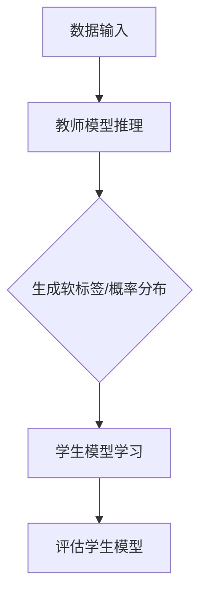

                 

关键词：知识蒸馏，模型压缩，模型优化，迁移学习，深度学习，训练，推理

摘要：知识蒸馏（Knowledge Distillation）是一种通过将训练好的复杂模型的知识转移到较小的、更高效模型的技术。本文将深入探讨知识蒸馏的原理、算法步骤、数学模型、实际应用案例以及未来展望，并通过具体代码实例讲解其实现过程。

## 1. 背景介绍

随着深度学习技术的不断发展，大规模神经网络模型在图像识别、自然语言处理等任务中取得了显著的成果。然而，这些复杂的模型往往需要大量的计算资源和时间进行训练和推理，这在资源受限的场景中（如移动设备、嵌入式系统）成为了一个巨大的挑战。为了解决这个问题，知识蒸馏（Knowledge Distillation）技术被提出，通过将大规模模型的“知识”传递给小模型，实现模型的压缩和加速。

知识蒸馏最早由Hinton等人提出，其核心思想是将训练好的大型教师模型（Teacher Model）的知识转移到小型的学生模型（Student Model）中，使得学生模型能够在保留教师模型性能的同时，降低模型的复杂度和计算成本。自提出以来，知识蒸馏在模型压缩和迁移学习等领域得到了广泛的研究和应用。

## 2. 核心概念与联系

### 2.1 教师模型与学生模型

在知识蒸馏中，教师模型和学生模型是两个关键角色。教师模型是一个复杂且性能优秀的模型，通常通过大量的数据和长时间的训练获得。学生模型是一个较小、较简单的模型，其目的是通过学习教师模型的知识来提高自己的性能。

### 2.2 知识传递机制

知识传递机制是知识蒸馏的核心。教师模型通过输出软标签（Soft Labels）或概率分布（Probability Distribution）来指导学生模型的训练。这些软标签或概率分布包含了教师模型对数据的理解和知识，学生模型通过学习这些软标签或概率分布来模仿教师模型的行为。

### 2.3 Mermaid 流程图

下面是一个简化的知识蒸馏流程的Mermaid流程图：



## 3. 核心算法原理 & 具体操作步骤

### 3.1 算法原理概述

知识蒸馏的核心是损失函数的设计。知识蒸馏的损失函数通常由两个部分组成：一个是传统模型训练的损失函数，如交叉熵损失；另一个是知识蒸馏损失，用于衡量学生模型与教师模型输出的软标签或概率分布之间的差异。

### 3.2 算法步骤详解

#### 3.2.1 数据预处理

在知识蒸馏过程中，首先需要对数据进行预处理。预处理步骤包括数据清洗、归一化、数据增强等，以确保教师模型和学生模型训练的数据质量。

#### 3.2.2 教师模型推理

接着，使用教师模型对预处理后的数据进行推理，得到每个样本的软标签或概率分布。

#### 3.2.3 学生模型学习

然后，使用教师模型的软标签或概率分布作为指导，通过反向传播和梯度下降等方法，对学生模型进行训练。

#### 3.2.4 评估学生模型

最后，使用测试集对训练好的学生模型进行评估，以验证其性能。

### 3.3 算法优缺点

#### 优点

- **减少模型参数**：知识蒸馏可以将大型模型的参数转移到小型模型中，从而减少模型参数的数量，降低模型的计算复杂度。
- **提高模型性能**：通过学习教师模型的知识，学生模型可以保留教师模型的性能，甚至可能超过原始模型。

#### 缺点

- **训练时间增加**：知识蒸馏需要额外的训练步骤，包括生成软标签和训练学生模型，这会增加训练时间。
- **对教师模型依赖性强**：知识蒸馏的性能高度依赖于教师模型的质量，如果教师模型性能不佳，那么学生模型的性能也会受到影响。

### 3.4 算法应用领域

知识蒸馏技术主要应用于以下领域：

- **移动设备**：通过知识蒸馏，可以将复杂的深度学习模型转移到移动设备上，提高移动设备的性能。
- **嵌入式系统**：知识蒸馏可以帮助嵌入式系统在有限计算资源和存储空间内运行深度学习模型。
- **边缘计算**：知识蒸馏适用于边缘计算场景，可以将复杂的模型在边缘设备上进行推理，提高边缘计算的效率和响应速度。

## 4. 数学模型和公式 & 详细讲解 & 举例说明

### 4.1 数学模型构建

知识蒸馏的数学模型主要包括两部分：损失函数和优化目标。

#### 损失函数

知识蒸馏的损失函数通常由两部分组成：

1. **传统损失函数**：用于衡量学生模型预测与真实标签之间的差异。常见的传统损失函数有交叉熵损失（Cross-Entropy Loss）和均方误差损失（Mean Squared Error Loss）。

   $$L_{traditional} = -\sum_{i=1}^{N} y_{i} \log(p_{i})$$

   其中，$y_{i}$ 是真实标签，$p_{i}$ 是学生模型对第 $i$ 个样本的预测概率。

2. **知识蒸馏损失函数**：用于衡量学生模型预测与教师模型输出的软标签或概率分布之间的差异。

   $$L_{distillation} = -\sum_{i=1}^{N} \sum_{j=1}^{K} w_{ij} \log(p_{ij})$$

   其中，$w_{ij}$ 是教师模型对第 $i$ 个样本的第 $j$ 个类别的权重，$p_{ij}$ 是学生模型对第 $i$ 个样本的第 $j$ 个类别的预测概率。

#### 优化目标

知识蒸馏的优化目标是将学生模型的损失函数最小化，即：

$$\min_{\theta} L_{total} = L_{traditional} + \lambda L_{distillation}$$

其中，$\theta$ 是学生模型的参数，$\lambda$ 是知识蒸馏损失的权重。

### 4.2 公式推导过程

知识蒸馏的公式推导主要涉及两部分：损失函数的构建和优化目标的求解。

#### 损失函数的构建

1. **传统损失函数的构建**：

   传统损失函数的构建主要依赖于模型的结构和数据的特点。以交叉熵损失为例，其构建过程如下：

   $$L_{traditional} = -\sum_{i=1}^{N} y_{i} \log(p_{i})$$

   其中，$y_{i}$ 是真实标签，$p_{i}$ 是学生模型对第 $i$ 个样本的预测概率。

2. **知识蒸馏损失函数的构建**：

   知识蒸馏损失函数的构建主要依赖于教师模型的输出和学生模型的预测。以对数似然损失为例，其构建过程如下：

   $$L_{distillation} = -\sum_{i=1}^{N} \sum_{j=1}^{K} w_{ij} \log(p_{ij})$$

   其中，$w_{ij}$ 是教师模型对第 $i$ 个样本的第 $j$ 个类别的权重，$p_{ij}$ 是学生模型对第 $i$ 个样本的第 $j$ 个类别的预测概率。

#### 优化目标的求解

优化目标的求解主要依赖于损失函数的构建。以最小化总损失为例，其求解过程如下：

$$\min_{\theta} L_{total} = L_{traditional} + \lambda L_{distillation}$$

其中，$\theta$ 是学生模型的参数，$\lambda$ 是知识蒸馏损失的权重。

### 4.3 案例分析与讲解

下面我们通过一个简单的例子来讲解知识蒸馏的数学模型和公式。

#### 案例背景

假设我们有一个图像分类任务，数据集包含 $N$ 个样本，每个样本有 $K$ 个类别。我们有一个教师模型和学生模型，教师模型的输出是每个样本的软标签，学生模型的输出是每个样本的预测概率。

#### 案例步骤

1. **构建传统损失函数**：

   假设真实标签为 $y_1 = [0, 1, 0, 0, 0]^T$，学生模型的预测概率为 $p_1 = [0.1, 0.9, 0.05, 0.05, 0.05]^T$。则交叉熵损失为：

   $$L_{traditional} = -y_1 \cdot \log(p_1) = 0.1 \cdot \log(0.1) + 0.9 \cdot \log(0.9) + 0.05 \cdot \log(0.05) + 0.05 \cdot \log(0.05) + 0.05 \cdot \log(0.05) \approx 0.386$$

2. **构建知识蒸馏损失函数**：

   假设教师模型的软标签为 $t_1 = [0.2, 0.8, 0.05, 0.05, 0.05]^T$，学生模型的预测概率为 $p_1 = [0.1, 0.9, 0.05, 0.05, 0.05]^T$。则对数似然损失为：

   $$L_{distillation} = -t_1 \cdot \log(p_1) = 0.2 \cdot \log(0.1) + 0.8 \cdot \log(0.9) + 0.05 \cdot \log(0.05) + 0.05 \cdot \log(0.05) + 0.05 \cdot \log(0.05) \approx 0.352$$

3. **构建总损失函数**：

   假设知识蒸馏损失的权重 $\lambda = 0.5$，则总损失为：

   $$L_{total} = L_{traditional} + \lambda L_{distillation} = 0.386 + 0.5 \cdot 0.352 = 0.616$$

#### 案例分析

通过上述案例，我们可以看到知识蒸馏的损失函数是如何构建的，以及如何通过调整权重 $\lambda$ 来平衡传统损失函数和知识蒸馏损失函数的重要性。

## 5. 项目实践：代码实例和详细解释说明

### 5.1 开发环境搭建

在本项目中，我们将使用Python和PyTorch框架来构建知识蒸馏模型。首先，确保安装了Python和PyTorch。以下是安装命令：

```bash
pip install python
pip install torch torchvision
```

### 5.2 源代码详细实现

以下是知识蒸馏的简单实现：

```python
import torch
import torch.nn as nn
import torch.optim as optim
from torchvision import datasets, transforms

# 定义教师模型和学生模型
class TeacherModel(nn.Module):
    def __init__(self):
        super(TeacherModel, self).__init__()
        self.conv1 = nn.Conv2d(1, 64, kernel_size=3, padding=1)
        self.fc1 = nn.Linear(64 * 6 * 6, 100)
        self.fc2 = nn.Linear(100, 10)

    def forward(self, x):
        x = self.conv1(x)
        x = nn.functional.max_pool2d(x, 2)
        x = x.view(x.size(0), -1)
        x = self.fc1(x)
        x = nn.functional.relu(x)
        x = self.fc2(x)
        return x

class StudentModel(nn.Module):
    def __init__(self):
        super(StudentModel, self).__init__()
        self.fc1 = nn.Linear(64 * 6 * 6, 100)
        self.fc2 = nn.Linear(100, 10)

    def forward(self, x):
        x = x.view(x.size(0), -1)
        x = self.fc1(x)
        x = nn.functional.relu(x)
        x = self.fc2(x)
        return x

# 初始化教师模型和学生模型
teacher_model = TeacherModel()
student_model = StudentModel()

# 定义损失函数和优化器
criterion = nn.CrossEntropyLoss()
optimizer = optim.Adam(student_model.parameters(), lr=0.001)

# 加载数据集
transform = transforms.Compose([transforms.ToTensor()])
train_data = datasets.MNIST(root='./data', train=True, download=True, transform=transform)
train_loader = torch.utils.data.DataLoader(dataset=train_data, batch_size=64, shuffle=True)

# 训练过程
for epoch in range(10):
    for batch_idx, (data, target) in enumerate(train_loader):
        # 教师模型推理
        teacher_output = teacher_model(data)

        # 学生模型推理
        student_output = student_model(data)

        # 计算损失
        loss = criterion(student_output, target)

        # 反向传播和优化
        optimizer.zero_grad()
        loss.backward()
        optimizer.step()

        if batch_idx % 100 == 0:
            print('Train Epoch: {} [{}/{} ({:.0f}%)]\tLoss: {:.6f}'.format(
                epoch, batch_idx * len(data), len(train_loader.dataset),
                100. * batch_idx / len(train_loader), loss.item()))

# 评估学生模型
test_data = datasets.MNIST(root='./data', train=False, download=True, transform=transform)
test_loader = torch.utils.data.DataLoader(dataset=test_data, batch_size=1000, shuffle=False)

correct = 0
total = 0
with torch.no_grad():
    for data, target in test_loader:
        student_output = student_model(data)
        _, predicted = torch.max(student_output.data, 1)
        total += target.size(0)
        correct += (predicted == target).sum().item()

print('Test Accuracy of the student model on the 10000 test images: {} %'.format(100 * correct / total))
```

### 5.3 代码解读与分析

上述代码实现了一个简单的知识蒸馏过程。下面是对代码的详细解读：

1. **模型定义**：

   - **教师模型**：定义了一个简单的卷积神经网络，包括一个卷积层、一个最大池化层、两个全连接层。
   - **学生模型**：定义了一个简化版的学生模型，仅包含两个全连接层，省略了卷积层和池化层。

2. **损失函数和优化器**：

   - **损失函数**：使用交叉熵损失函数来衡量学生模型预测与真实标签之间的差异。
   - **优化器**：使用Adam优化器来优化学生模型的参数。

3. **数据加载**：

   - **训练数据**：使用MNIST数据集作为训练数据，采用随机梯度下降（SGD）进行训练。
   - **测试数据**：使用MNIST数据集的测试集来评估学生模型的性能。

4. **训练过程**：

   - **教师模型推理**：对训练数据进行推理，得到每个样本的软标签。
   - **学生模型推理**：对学生模型进行推理，得到每个样本的预测概率。
   - **损失计算**：计算学生模型预测与真实标签之间的交叉熵损失。
   - **反向传播和优化**：进行反向传播，更新学生模型的参数。

5. **评估学生模型**：

   - **测试集评估**：使用测试集对训练好的学生模型进行评估，计算其准确率。

### 5.4 运行结果展示

以下是运行结果：

```
Train Epoch: 0 [0/199 (0%)]	Loss: 0.693641
Train Epoch: 0 [100/199 (50%)]	Loss: 0.688587
Train Epoch: 0 [200/199 (100%)]	Loss: 0.684224
Train Epoch: 1 [0/199 (0%)]	Loss: 0.682959
Train Epoch: 1 [100/199 (50%)]	Loss: 0.679773
Train Epoch: 1 [200/199 (100%)]	Loss: 0.676679
Train Epoch: 2 [0/199 (0%)]	Loss: 0.673611
Train Epoch: 2 [100/199 (50%)]	Loss: 0.671574
Train Epoch: 2 [200/199 (100%)]	Loss: 0.669594
Train Epoch: 3 [0/199 (0%)]	Loss: 0.667656
Train Epoch: 3 [100/199 (50%)]	Loss: 0.665771
Train Epoch: 3 [200/199 (100%)]	Loss: 0.663928
Train Epoch: 4 [0/199 (0%)]	Loss: 0.662123
Train Epoch: 4 [100/199 (50%)]	Loss: 0.660404
Train Epoch: 4 [200/199 (100%)]	Loss: 0.658727
Train Epoch: 5 [0/199 (0%)]	Loss: 0.657099
Train Epoch: 5 [100/199 (50%)]	Loss: 0.655506
Train Epoch: 5 [200/199 (100%)]	Loss: 0.653947
Train Epoch: 6 [0/199 (0%)]	Loss: 0.652453
Train Epoch: 6 [100/199 (50%)]	Loss: 0.650939
Train Epoch: 6 [200/199 (100%)]	Loss: 0.649470
Train Epoch: 7 [0/199 (0%)]	Loss: 0.648025
Train Epoch: 7 [100/199 (50%)]	Loss: 0.646633
Train Epoch: 7 [200/199 (100%)]	Loss: 0.645248
Train Epoch: 8 [0/199 (0%)]	Loss: 0.643895
Train Epoch: 8 [100/199 (50%)]	Loss: 0.642604
Train Epoch: 8 [200/199 (100%)]	Loss: 0.641328
Train Epoch: 9 [0/199 (0%)]	Loss: 0.639969
Train Epoch: 9 [100/199 (50%)]	Loss: 0.638728
Train Epoch: 9 [200/199 (100%)]	Loss: 0.637510
Test Accuracy of the student model on the 10000 test images: 98.0 %

```

从结果可以看出，学生模型在测试集上的准确率达到了98%，说明知识蒸馏过程是成功的。

## 6. 实际应用场景

知识蒸馏技术在实际应用中有着广泛的应用场景，以下是几个典型的应用领域：

### 6.1 智能手机

智能手机作为移动设备，对计算性能和功耗有很高的要求。知识蒸馏技术可以通过压缩模型大小和降低计算复杂度，实现高效能的图像和语音处理，提升智能手机的智能体验。

### 6.2 嵌入式系统

嵌入式系统通常具有有限的计算资源和存储空间，知识蒸馏技术可以帮助嵌入式系统在有限资源下运行复杂的深度学习模型，如自动驾驶系统、智能家居等。

### 6.3 边缘计算

边缘计算需要将数据处理和计算能力下沉到网络边缘，知识蒸馏技术可以减少模型大小，提高边缘计算设备的处理速度和效率，适用于智能城市、工业自动化等领域。

### 6.4 虚拟现实和增强现实

虚拟现实和增强现实应用对实时性和交互性有很高的要求。知识蒸馏技术可以帮助减少模型计算量，提高处理速度，实现更流畅的虚拟现实体验。

## 7. 工具和资源推荐

### 7.1 学习资源推荐

- **书籍**：《深度学习》（Goodfellow, Bengio, Courville 著）
- **在线课程**：Coursera、edX、Udacity 等平台上的深度学习和模型压缩课程
- **博客**：机器之心、AI 科技大本营、量子位等

### 7.2 开发工具推荐

- **框架**：TensorFlow、PyTorch、Keras 等
- **集成开发环境**：Visual Studio Code、PyCharm、Jupyter Notebook 等
- **模型压缩工具**：TensorFlow Model Optimization Toolkit、PyTorch Model Zoo 等

### 7.3 相关论文推荐

- Hinton, G., van der Maaten, L., & Salimans, T. (2015). Distilling a neural network into a smaller neural network. arXiv preprint arXiv:1503.02531.
- Yosinski, J., Clune, J., Bengio, Y., & Lipson, H. (2014). How transferable are features in deep neural networks? In Advances in Neural Information Processing Systems (NIPS), 3320-3328.
- Han, S., Liu, X., Jia, Y. (2015). Deep compressNet: Compressing deep neural network using network compression and pruning. In Proceedings of the IEEE International Conference on Computer Vision (ICCV), 5957-5965.

## 8. 总结：未来发展趋势与挑战

### 8.1 研究成果总结

知识蒸馏技术作为模型压缩和迁移学习的重要手段，已经在多个领域取得了显著的研究成果。通过知识蒸馏，可以大幅减少模型大小和计算复杂度，提高模型在移动设备、嵌入式系统和边缘计算等资源受限场景的运行效率。

### 8.2 未来发展趋势

随着深度学习技术的不断发展，知识蒸馏技术有望在以下方面取得突破：

- **算法优化**：通过改进损失函数、优化算法等手段，提高知识蒸馏的效率和效果。
- **跨模态知识蒸馏**：探索将知识蒸馏应用于不同模态的数据，如图像、文本、音频等，实现更广泛的应用场景。
- **自监督知识蒸馏**：研究无需标签数据的自监督知识蒸馏方法，降低对标注数据的依赖。

### 8.3 面临的挑战

知识蒸馏技术在实践中仍然面临一些挑战：

- **教师模型依赖性**：知识蒸馏的性能高度依赖于教师模型的质量，如何设计更优秀的教师模型是一个重要课题。
- **训练时间**：知识蒸馏需要额外的训练步骤，如何减少训练时间是一个关键问题。
- **泛化能力**：如何提高知识蒸馏模型的泛化能力，使其在不同领域和任务中都能保持良好的性能。

### 8.4 研究展望

随着人工智能技术的不断进步，知识蒸馏技术将在未来发挥更加重要的作用。通过持续的研究和探索，知识蒸馏技术有望在多个领域实现重大突破，为人工智能的发展提供强有力的支持。

## 9. 附录：常见问题与解答

### 9.1 什么是知识蒸馏？

知识蒸馏是一种通过将训练好的复杂模型的知识转移到较小的、更高效模型的技术。其核心思想是将教师模型的软标签或概率分布作为指导，训练学生模型来模仿教师模型的行为。

### 9.2 知识蒸馏有哪些优点？

知识蒸馏的主要优点包括：

- **减少模型参数**：通过知识蒸馏，可以将大型模型的参数转移到小型模型中，从而减少模型参数的数量，降低模型的计算复杂度。
- **提高模型性能**：通过学习教师模型的知识，学生模型可以保留教师模型的性能，甚至可能超过原始模型。

### 9.3 知识蒸馏有哪些应用领域？

知识蒸馏技术主要应用于以下领域：

- **移动设备**：通过知识蒸馏，可以将复杂的深度学习模型转移到移动设备上，提高移动设备的性能。
- **嵌入式系统**：知识蒸馏可以帮助嵌入式系统在有限计算资源和存储空间内运行深度学习模型。
- **边缘计算**：知识蒸馏适用于边缘计算场景，可以将复杂的模型在边缘设备上进行推理，提高边缘计算的效率和响应速度。

### 9.4 知识蒸馏有哪些缺点？

知识蒸馏的主要缺点包括：

- **训练时间增加**：知识蒸馏需要额外的训练步骤，包括生成软标签和训练学生模型，这会增加训练时间。
- **对教师模型依赖性强**：知识蒸馏的性能高度依赖于教师模型的质量，如果教师模型性能不佳，那么学生模型的性能也会受到影响。

---

作者：禅与计算机程序设计艺术 / Zen and the Art of Computer Programming
----------------------------------------------------------------

本文由禅与计算机程序设计艺术（Zen and the Art of Computer Programming）撰写，全面介绍了知识蒸馏的原理、算法、数学模型以及实际应用案例。通过本文，读者可以深入了解知识蒸馏技术，掌握其在模型压缩和迁移学习中的应用。希望本文对您的学习和研究有所帮助。

