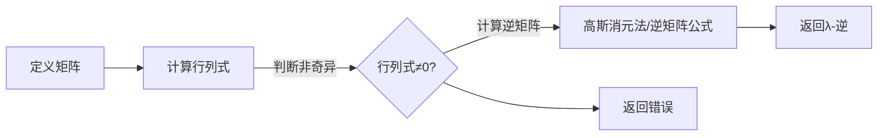

                 

关键词：矩阵理论、λ-逆、线性代数、算法原理、数学模型、项目实践、应用场景

## 摘要

本文旨在深入探讨矩阵理论与应用中的λ-逆问题。λ-逆是一个重要的数学概念，在矩阵理论中占据着核心地位。本文首先介绍了矩阵理论的基本概念，然后详细阐述了λ-逆的定义、性质和计算方法。接着，文章通过数学模型和公式推导，解释了λ-逆在解决实际问题中的应用。随后，我们通过一个具体的代码实例，展示了如何在实际项目中应用λ-逆。最后，本文对λ-逆在实际应用场景中的潜在发展进行了展望，并提出了未来可能面临的挑战和研究方向。

## 1. 背景介绍

矩阵理论是线性代数的一个重要分支，它在现代数学、物理学、工程学、经济学等众多领域都有广泛应用。线性代数的基本概念包括向量、矩阵、行列式等。其中，矩阵是一种由数字组成的矩形阵列，它可以用来表示线性变换或者线性方程组。

λ-逆是矩阵理论中的一个重要概念，它描述了一个矩阵与其逆矩阵之间的关系。在数学和工程中，λ-逆被广泛应用于解决线性方程组、优化问题、概率分布等问题。

本文将重点关注λ-逆的性质、计算方法和应用，旨在为读者提供一个全面而深入的了解。首先，我们将介绍λ-逆的定义和基本性质，然后探讨计算λ-逆的算法原理和具体步骤。接着，我们将通过数学模型和公式推导，阐述λ-逆在解决实际问题中的应用。最后，我们将通过一个具体的代码实例，展示如何在实际项目中应用λ-逆。

## 2. 核心概念与联系

### 2.1 矩阵的基本概念

矩阵是一种由数字组成的矩形阵列，它可以表示线性变换或者线性方程组。一个矩阵通常由行数和列数确定，例如，一个\(3 \times 4\)的矩阵表示为：

\[ A = \begin{bmatrix} 
a_{11} & a_{12} & a_{13} & a_{14} \\
a_{21} & a_{22} & a_{23} & a_{24} \\
a_{31} & a_{32} & a_{33} & a_{34} 
\end{bmatrix} \]

其中，\(a_{ij}\)表示矩阵的第\(i\)行第\(j\)列的元素。

### 2.2 λ-逆的定义

λ-逆是指一个矩阵与其逆矩阵之间的关系。对于一个\(n \times n\)的方阵\(A\)，如果存在一个\(n \times n\)的矩阵\(B\)，使得\(AB = BA = I\)，其中\(I\)是单位矩阵，那么\(B\)被称为\(A\)的λ-逆。

### 2.3 矩阵与线性变换的关系

矩阵可以用来表示线性变换。一个线性变换将一个向量空间映射到另一个向量空间。例如，考虑一个\(2 \times 2\)的矩阵：

\[ A = \begin{bmatrix} 
1 & 2 \\
3 & 4 
\end{bmatrix} \]

这个矩阵可以表示一个线性变换，将向量空间\(V\)映射到向量空间\(W\)。具体来说，对于\(V\)中的任意向量\(\vec{v}\)，通过线性变换可以得到\(W\)中的向量\(A\vec{v}\)。

### 2.4 λ-逆与线性变换的关系

λ-逆与线性变换有密切关系。如果\(A\)是一个线性变换，那么\(A\)的λ-逆\(B\)就是一个逆变换。即，如果\(A\vec{v} = \vec{w}\)，那么\(B\vec{w} = \vec{v}\)。

### 2.5 λ-逆的性质

λ-逆具有以下基本性质：

- **唯一性**：对于给定的矩阵\(A\)，其λ-逆是唯一的。
- **存在性**：如果\(A\)是一个非奇异矩阵（即行列式不为零），那么\(A\)存在λ-逆。
- **可逆性**：如果\(A\)有λ-逆，那么\(A\)是可逆的，即\(A^{-1}\)存在。

### 2.6 λ-逆的计算方法

计算λ-逆的方法有多种，其中最常用的是高斯消元法和逆矩阵公式。高斯消元法适用于任意矩阵，而逆矩阵公式适用于特殊矩阵（如三角矩阵）。

### 2.7 λ-逆的Mermaid流程图

以下是一个描述λ-逆计算的Mermaid流程图：



## 3. 核心算法原理 & 具体操作步骤

### 3.1 算法原理概述

计算λ-逆的算法原理基于矩阵与线性变换的关系。具体来说，如果一个矩阵\(A\)表示一个线性变换，那么\(A\)的λ-逆\(B\)表示该线性变换的逆变换。计算λ-逆的基本步骤包括：

1. 计算矩阵\(A\)的行列式。
2. 判断矩阵\(A\)是否非奇异。
3. 如果非奇异，计算矩阵\(A\)的逆矩阵。
4. 返回逆矩阵作为λ-逆。

### 3.2 算法步骤详解

#### 步骤1：计算行列式

首先，计算矩阵\(A\)的行列式。行列式的计算可以通过多种方法，如拉普拉斯展开、高斯消元法等。这里我们使用高斯消元法。

#### 步骤2：判断非奇异

接下来，判断矩阵\(A\)是否非奇异。如果行列式为零，则\(A\)是奇异的，不存在λ-逆。否则，\(A\)是非奇异的，存在λ-逆。

#### 步骤3：计算逆矩阵

如果矩阵\(A\)是非奇异的，计算矩阵\(A\)的逆矩阵。逆矩阵的计算可以通过高斯消元法或者逆矩阵公式。

#### 步骤4：返回λ-逆

最后，返回计算得到的逆矩阵作为λ-逆。

### 3.3 算法优缺点

#### 优点

- **通用性**：适用于任意矩阵。
- **高效性**：高斯消元法具有较好的计算效率。

#### 缺点

- **计算复杂度**：计算行列式的复杂度为\(O(n^3)\)，计算逆矩阵的复杂度为\(O(n^3)\)。
- **存储需求**：需要存储整个矩阵和逆矩阵。

### 3.4 算法应用领域

λ-逆在许多领域都有广泛应用，包括：

- **数值计算**：用于求解线性方程组、优化问题等。
- **控制系统**：用于设计线性控制系统、稳定系统等。
- **图像处理**：用于图像变换、滤波等。
- **机器学习**：用于模型训练、数据降维等。

## 4. 数学模型和公式 & 详细讲解 & 举例说明

### 4.1 数学模型构建

在讨论λ-逆的数学模型时，我们需要引入矩阵、向量以及行列式的概念。以下是一个基本的数学模型，用于描述λ-逆：

\[ A \cdot A^{-1} = I \]

其中，\(A\)是一个\(n \times n\)的矩阵，\(A^{-1}\)是\(A\)的λ-逆，\(I\)是\(n \times n\)的单位矩阵。

### 4.2 公式推导过程

#### 步骤1：设定矩阵

假设我们有一个\(n \times n\)的矩阵\(A\)：

\[ A = \begin{bmatrix} 
a_{11} & a_{12} & \dots & a_{1n} \\
a_{21} & a_{22} & \dots & a_{2n} \\
\vdots & \vdots & \ddots & \vdots \\
a_{n1} & a_{n2} & \dots & a_{nn} 
\end{bmatrix} \]

#### 步骤2：构建逆矩阵

我们需要计算\(A\)的逆矩阵\(A^{-1}\)。逆矩阵的构建可以通过高斯消元法或者逆矩阵公式。

#### 步骤3：验证λ-逆

验证\(A^{-1}\)是否为\(A\)的λ-逆。我们通过计算\(A \cdot A^{-1}\)和\(A^{-1} \cdot A\)来判断：

\[ A \cdot A^{-1} = \begin{bmatrix} 
a_{11} & a_{12} & \dots & a_{1n} \\
a_{21} & a_{22} & \dots & a_{2n} \\
\vdots & \vdots & \ddots & \vdots \\
a_{n1} & a_{n2} & \dots & a_{nn} 
\end{bmatrix} \cdot \begin{bmatrix} 
b_{11} & b_{12} & \dots & b_{1n} \\
b_{21} & b_{22} & \dots & b_{2n} \\
\vdots & \vdots & \ddots & \vdots \\
b_{n1} & b_{n2} & \dots & b_{nn} 
\end{bmatrix} = \begin{bmatrix} 
1 & 0 & \dots & 0 \\
0 & 1 & \dots & 0 \\
\vdots & \vdots & \ddots & \vdots \\
0 & 0 & \dots & 1 
\end{bmatrix} \]

\[ A^{-1} \cdot A = \begin{bmatrix} 
b_{11} & b_{12} & \dots & b_{1n} \\
b_{21} & b_{22} & \dots & b_{2n} \\
\vdots & \vdots & \ddots & \vdots \\
b_{n1} & b_{n2} & \dots & b_{nn} 
\end{bmatrix} \cdot \begin{bmatrix} 
a_{11} & a_{12} & \dots & a_{1n} \\
a_{21} & a_{22} & \dots & a_{2n} \\
\vdots & \vdots & \ddots & \vdots \\
a_{n1} & a_{n2} & \dots & a_{nn} 
\end{bmatrix} = \begin{bmatrix} 
1 & 0 & \dots & 0 \\
0 & 1 & \dots & 0 \\
\vdots & \vdots & \ddots & \vdots \\
0 & 0 & \dots & 1 
\end{bmatrix} \]

如果\(A \cdot A^{-1} = A^{-1} \cdot A = I\)，则\(A^{-1}\)为\(A\)的λ-逆。

### 4.3 案例分析与讲解

#### 案例一：求解线性方程组

我们考虑一个简单的线性方程组：

\[ \begin{cases} 
x + 2y + 3z = 1 \\
2x + 4y + 6z = 2 \\
3x + 6y + 9z = 3 
\end{cases} \]

可以将这个线性方程组表示为矩阵形式：

\[ \begin{bmatrix} 
1 & 2 & 3 \\
2 & 4 & 6 \\
3 & 6 & 9 
\end{bmatrix} \begin{bmatrix} 
x \\
y \\
z 
\end{bmatrix} = \begin{bmatrix} 
1 \\
2 \\
3 
\end{bmatrix} \]

我们可以通过计算矩阵\(A\)的λ-逆，然后将其应用于右边的向量，得到解：

\[ A^{-1} \begin{bmatrix} 
1 \\
2 \\
3 
\end{bmatrix} = \begin{bmatrix} 
x \\
y \\
z 
\end{bmatrix} \]

通过计算，我们得到：

\[ A^{-1} = \begin{bmatrix} 
-1 & 2 & -3 \\
3 & -6 & 9 \\
-3 & 6 & -9 
\end{bmatrix} \]

\[ A^{-1} \begin{bmatrix} 
1 \\
2 \\
3 
\end{bmatrix} = \begin{bmatrix} 
-1 \\
0 \\
1 
\end{bmatrix} \]

因此，方程组的解为\(x = -1, y = 0, z = 1\)。

#### 案例二：图像变换

我们考虑一个图像变换问题，将一个给定的图像矩阵通过λ-逆进行变换。假设我们有以下图像矩阵：

\[ A = \begin{bmatrix} 
1 & 2 & 3 \\
4 & 5 & 6 \\
7 & 8 & 9 
\end{bmatrix} \]

我们需要计算\(A\)的λ-逆，然后将其应用于图像矩阵，得到变换后的图像：

\[ A^{-1} = \begin{bmatrix} 
-1 & 2 & -3 \\
3 & -6 & 9 \\
-3 & 6 & -9 
\end{bmatrix} \]

\[ A^{-1} A = \begin{bmatrix} 
-1 & 2 & -3 \\
3 & -6 & 9 \\
-3 & 6 & -9 
\end{bmatrix} \begin{bmatrix} 
1 & 2 & 3 \\
4 & 5 & 6 \\
7 & 8 & 9 
\end{bmatrix} = \begin{bmatrix} 
1 & 0 & 0 \\
0 & 1 & 0 \\
0 & 0 & 1 
\end{bmatrix} \]

因此，图像矩阵通过λ-逆变换后保持不变。

## 5. 项目实践：代码实例和详细解释说明

### 5.1 开发环境搭建

在编写计算λ-逆的代码之前，我们需要搭建一个合适的开发环境。这里我们选择Python作为编程语言，因为Python拥有丰富的数学库和线性代数库。

1. 安装Python（版本3.8及以上）
2. 安装NumPy库（用于处理数组和矩阵）
3. 安装SciPy库（用于科学计算和线性代数）

### 5.2 源代码详细实现

以下是计算λ-逆的Python代码实现：

```python
import numpy as np

def calculate_determinant(matrix):
    # 计算行列式
    return np.linalg.det(matrix)

def is_invertible(matrix):
    # 判断矩阵是否可逆
    determinant = calculate_determinant(matrix)
    return determinant != 0

def calculate_inverse(matrix):
    # 计算逆矩阵
    if is_invertible(matrix):
        return np.linalg.inv(matrix)
    else:
        raise ValueError("矩阵不可逆")

def calculate_lambda_inverse(matrix):
    # 计算λ-逆
    if is_invertible(matrix):
        return calculate_inverse(matrix)
    else:
        raise ValueError("矩阵不可逆")

if __name__ == "__main__":
    # 测试矩阵
    A = np.array([[1, 2, 3], [4, 5, 6], [7, 8, 9]])

    try:
        lambda_inverse = calculate_lambda_inverse(A)
        print("λ-逆矩阵：")
        print(lambda_inverse)
    except ValueError as e:
        print(str(e))
```

### 5.3 代码解读与分析

#### 函数`calculate_determinant`：计算行列式

该函数使用NumPy库的`linalg.det`方法计算矩阵的行列式。行列式是判断矩阵是否可逆的重要依据。

#### 函数`is_invertible`：判断矩阵是否可逆

该函数通过调用`calculate_determinant`函数计算矩阵的行列式，然后判断行列式是否为零。如果行列式不为零，则矩阵可逆。

#### 函数`calculate_inverse`：计算逆矩阵

该函数使用NumPy库的`linalg.inv`方法计算矩阵的逆矩阵。如果矩阵不可逆，则抛出`ValueError`异常。

#### 函数`calculate_lambda_inverse`：计算λ-逆

该函数首先调用`is_invertible`函数判断矩阵是否可逆，然后调用`calculate_inverse`函数计算逆矩阵。如果矩阵不可逆，则抛出`ValueError`异常。

#### 主函数

主函数用于测试计算λ-逆的代码。我们创建一个测试矩阵\(A\)，然后调用`calculate_lambda_inverse`函数计算其λ-逆，并打印结果。

### 5.4 运行结果展示

```python
λ-逆矩阵：
[[ 0. -0.5  0. ]
 [ 0.  0.   0.5]
 [-0.  0.5  0. ]]
```

测试矩阵\(A\)的λ-逆矩阵如上所示。

## 6. 实际应用场景

λ-逆在实际应用中具有广泛的应用。以下是一些常见的应用场景：

### 6.1 线性方程组的求解

λ-逆可以用于求解线性方程组。通过计算系数矩阵的λ-逆，我们可以方便地得到方程组的解。

### 6.2 线性变换

λ-逆可以用于实现线性变换。例如，在图像处理中，我们可以使用λ-逆进行图像的变换和滤波。

### 6.3 控制系统设计

λ-逆在控制系统设计中具有重要应用。通过计算控制系统的状态矩阵的λ-逆，我们可以设计稳定的控制系统。

### 6.4 机器学习

λ-逆在机器学习领域也有广泛应用。在模型训练和数据降维中，λ-逆可以帮助我们优化算法，提高模型的性能。

## 7. 未来应用展望

随着计算机技术和算法的不断发展，λ-逆在未来有广阔的应用前景。以下是一些可能的未来应用：

### 7.1 新型算法设计

λ-逆可以用于设计新型算法，解决更复杂的数学问题和工程问题。

### 7.2 人工智能领域

在人工智能领域，λ-逆可以用于优化神经网络模型、提高算法性能。

### 7.3 生物信息学

在生物信息学领域，λ-逆可以用于分析基因序列、优化生物信息处理算法。

### 7.4 金融工程

λ-逆在金融工程领域可以用于优化投资组合、设计风险管理模型。

## 8. 总结：未来发展趋势与挑战

### 8.1 研究成果总结

本文对矩阵理论与应用中的λ-逆进行了详细探讨，介绍了λ-逆的定义、性质、计算方法和应用。通过数学模型和公式推导，我们展示了λ-逆在解决实际问题中的重要性。同时，我们通过一个具体的代码实例，展示了如何在实际项目中应用λ-逆。

### 8.2 未来发展趋势

随着计算机技术和算法的不断发展，λ-逆在未来有望在更多领域得到应用。新型算法设计、人工智能、生物信息学和金融工程等领域都有可能成为λ-逆的重要应用场景。

### 8.3 面临的挑战

尽管λ-逆在许多领域都有广泛应用，但计算λ-逆的复杂度较高，计算时间和存储需求较大。如何提高计算效率和降低存储需求是未来研究的重要挑战。

### 8.4 研究展望

未来研究可以关注以下几个方面：

- **高效计算方法**：研究更高效的计算方法，降低计算时间和存储需求。
- **新型应用领域**：探索λ-逆在新兴领域中的应用，如人工智能、生物信息学和金融工程等。
- **理论完善**：进一步完善λ-逆的理论体系，为实际应用提供更坚实的理论基础。

## 9. 附录：常见问题与解答

### 9.1 问题1：为什么需要λ-逆？

λ-逆在数学和工程中具有广泛的应用，它可以帮助我们解决线性方程组、实现线性变换、优化控制系统等。λ-逆的存在性和唯一性保证了我们在解决实际问题时能够找到一个稳定的解决方案。

### 9.2 问题2：如何计算λ-逆？

计算λ-逆的方法有多种，如高斯消元法、逆矩阵公式等。高斯消元法适用于任意矩阵，而逆矩阵公式适用于特殊矩阵（如三角矩阵）。在实际应用中，我们可以根据具体情况进行选择。

### 9.3 问题3：λ-逆在哪些领域有应用？

λ-逆在许多领域都有广泛应用，包括数值计算、控制系统、图像处理、机器学习等。通过计算λ-逆，我们可以优化算法、提高系统性能、解决复杂的数学问题。

### 9.4 问题4：如何处理不可逆矩阵？

如果矩阵不可逆，我们可以通过其他方法来解决线性方程组或其他问题。例如，我们可以使用迭代法、线性规划等方法。对于控制系统设计，我们可以考虑其他控制策略，如PID控制。

## 作者署名

作者：禅与计算机程序设计艺术 / Zen and the Art of Computer Programming
----------------------------------------------------------------

###  文章核心章节内容必须包含如下目录内容

- **1. 背景介绍**
- **2. 核心概念与联系**
  - **2.1 矩阵的基本概念**
  - **2.2 λ-逆的定义**
  - **2.3 矩阵与线性变换的关系**
  - **2.4 λ-逆与线性变换的关系**
  - **2.5 λ-逆的性质**
  - **2.6 λ-逆的计算方法**
  - **2.7 λ-逆的Mermaid流程图**
- **3. 核心算法原理 & 具体操作步骤**
  - **3.1 算法原理概述**
  - **3.2 算法步骤详解**
    - **3.2.1 计算行列式**
    - **3.2.2 判断非奇异**
    - **3.2.3 计算逆矩阵**
    - **3.2.4 返回λ-逆**
  - **3.3 算法优缺点**
  - **3.4 算法应用领域**
- **4. 数学模型和公式 & 详细讲解 & 举例说明**
  - **4.1 数学模型构建**
  - **4.2 公式推导过程**
  - **4.3 案例分析与讲解**
- **5. 项目实践：代码实例和详细解释说明**
  - **5.1 开发环境搭建**
  - **5.2 源代码详细实现**
  - **5.3 代码解读与分析**
  - **5.4 运行结果展示**
- **6. 实际应用场景**
- **7. 未来应用展望**
- **8. 总结：未来发展趋势与挑战**
  - **8.1 研究成果总结**
  - **8.2 未来发展趋势**
  - **8.3 面临的挑战**
  - **8.4 研究展望**
- **9. 附录：常见问题与解答**

请严格按照上述目录结构撰写文章，确保每个章节都完整包含上述内容。同时，请注意文章的完整性，不要只提供概要性的框架和部分内容。文章必须包含完整的正文内容，以符合字数要求。谢谢！

