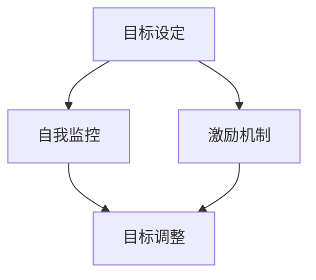

                 

关键词：短期目标管理、意识机制、目标设定、自我监控、激励机制

摘要：本文深入探讨了短期目标管理中的意识机制，包括目标设定的科学方法、自我监控的策略和激励机制的有效性。通过分析相关理论，结合实际案例，本文旨在为IT从业者提供实用的短期目标管理指导，帮助他们在快节奏的技术环境中保持高效和持续进步。

## 1. 背景介绍

在信息技术（IT）行业，短期目标管理是保持项目进度和个人成长的关键。无论是项目团队的管理者还是技术团队成员，都需要有效地设定和实现短期目标。然而，实现这些目标并不容易，因为IT行业的特性决定了项目的高度复杂性和不确定性。在这种环境中，意识的机制对于短期目标管理的成功至关重要。

短期目标管理不仅仅是设定一系列任务和截止日期，它还涉及到如何将这些任务与个人的价值观和长期职业规划相结合，如何通过自我监控和激励机制保持动力。因此，研究短期目标管理的意识机制对于提高个人和团队的工作效率具有重要意义。

本文将首先介绍短期目标管理的核心概念，然后深入探讨意识机制在其中的作用，最后通过实际案例和理论分析为读者提供实用的指导。

### 1.1 短期目标管理的重要性

短期目标管理在IT行业中的重要性不可忽视。首先，它有助于确保项目按时完成。通过将大项目拆分为一系列可管理的短期目标，可以更清晰地了解项目的进度，及时调整资源分配，从而降低风险。

其次，短期目标管理有助于个人职业发展。设定并实现短期目标，可以帮助个人积累经验，提高技能水平，从而在职业道路上取得长足进步。

最后，短期目标管理还可以提升团队协作效率。通过明确每个成员的短期目标，可以促进团队成员之间的沟通和协作，确保团队朝着共同的目标前进。

### 1.2 意识机制的概念

意识机制是指在目标设定、执行和评估过程中，个体通过自我意识和自我监控来管理行为和情感的心理过程。在短期目标管理中，意识机制的作用主要体现在以下几个方面：

- **目标设定**：意识机制帮助个体明确目标的重要性和优先级，从而进行科学的设定。
- **自我监控**：意识机制使个体能够持续关注目标的执行情况，及时发现和纠正偏差。
- **激励机制**：意识机制通过自我激励，帮助个体保持动力，克服困难和挫折。

### 1.3 本文结构

本文将首先介绍短期目标管理的核心概念，然后深入探讨意识机制在短期目标管理中的作用。接下来，本文将结合实际案例，分析意识机制在目标设定、自我监控和激励机制中的具体应用。最后，本文将总结研究成果，探讨短期目标管理未来的发展趋势和面临的挑战。

## 2. 核心概念与联系

在探讨短期目标管理的意识机制之前，我们需要明确一些核心概念，并展示它们之间的联系。以下是一个简化的Mermaid流程图，用于描述这些核心概念：



### 2.1 目标设定

目标设定是短期目标管理的起点。一个明确、具体和可实现的目标有助于个体或团队集中精力和资源，避免无效的工作。目标设定需要考虑以下要素：

- **目标类型**：短期目标通常分为学习型目标和执行型目标。学习型目标侧重于技能和知识的积累，而执行型目标则侧重于任务的完成。
- **目标具体性**：具体的目标应包括明确的任务、量化的指标和明确的截止日期。
- **目标优先级**：根据目标的紧急程度和重要性，设定优先级，确保关键目标优先完成。

### 2.2 自我监控

自我监控是确保目标达成的重要手段。通过自我监控，个体可以及时发现偏离目标的行为，并采取纠正措施。自我监控的要素包括：

- **监控频率**：定期检查目标的进展情况，确保及时发现问题和调整计划。
- **反馈机制**：建立有效的反馈机制，通过自我评估和外部评估相结合，获取准确的进展反馈。
- **调整策略**：根据监控结果，及时调整目标和计划，确保目标的实现。

### 2.3 激励机制

激励机制是保持目标实现动力的关键。有效的激励机制可以帮助个体克服困难和挫折，保持积极的态度。激励机制包括：

- **内在激励**：通过自我价值和成就感激发内在动机。
- **外在激励**：通过奖励和惩罚等外部激励措施，提升个体的积极性和责任感。
- **反馈与认可**：通过正面的反馈和认可，增强个体的自信心和积极性。

### 2.4 目标调整

目标调整是短期目标管理中不可或缺的一环。随着外部环境和内部条件的变化，目标可能需要进行调整。目标调整的要素包括：

- **灵活性**：保持目标的灵活性，以便在必要时进行调整。
- **反馈机制**：通过反馈机制，及时了解目标调整的必要性和效果。
- **沟通协作**：在目标调整过程中，与团队成员保持良好的沟通和协作，确保调整计划的顺利实施。

通过以上核心概念和联系的分析，我们可以更好地理解短期目标管理的意识机制，为后续的深入探讨打下基础。

## 3. 核心算法原理 & 具体操作步骤

### 3.1 算法原理概述

短期目标管理的意识机制本质上是一种基于心理学和行为学的算法，它通过以下几个步骤实现目标的有效管理：

1. **目标设定**：利用SMART（具体、可衡量、可达成、相关性、时限性）原则，确保目标的明确性和可实现性。
2. **自我监控**：采用行为监控和情感监控相结合的方法，实时跟踪目标执行情况。
3. **激励机制**：通过内在和外在激励机制的设定，保持个体的积极性和动力。
4. **目标调整**：根据监控结果和外部环境变化，及时调整目标和计划。

### 3.2 算法步骤详解

#### 3.2.1 目标设定

目标设定的具体步骤如下：

1. **明确目标类型**：根据项目的需求和个人的职业规划，确定目标是学习型目标还是执行型目标。
2. **制定SMART目标**：确保目标具体、可衡量、可达成、相关性强、有明确的时限。
3. **优先级排序**：根据目标的紧急程度和重要性，对目标进行优先级排序。

#### 3.2.2 自我监控

自我监控的具体步骤如下：

1. **制定监控计划**：根据目标的具体性，制定监控计划，包括监控频率、监控方法和监控指标。
2. **执行监控**：按照监控计划，定期检查目标的执行情况，记录进展和遇到的问题。
3. **分析反馈**：对监控结果进行分析，识别偏差和问题，制定改进措施。

#### 3.2.3 激励机制

激励机制的设定步骤如下：

1. **内在激励**：通过自我价值和成就感，激发个体的内在动机。
2. **外在激励**：设计奖励和惩罚机制，提升个体的积极性和责任感。
3. **反馈与认可**：通过正面的反馈和认可，增强个体的自信心和积极性。

#### 3.2.4 目标调整

目标调整的具体步骤如下：

1. **评估目标实现情况**：根据监控结果和外部环境变化，评估目标实现的情况。
2. **识别调整需求**：根据评估结果，识别目标调整的必要性和调整方向。
3. **制定调整计划**：制定调整计划，包括调整目标和调整策略。
4. **实施调整计划**：与团队成员沟通，确保调整计划的顺利实施。

### 3.3 算法优缺点

#### 优点

1. **明确性和可操作性**：通过SMART原则设定目标，确保目标的明确性和可实现性，增强操作的指导性。
2. **灵活性和适应性**：自我监控和目标调整机制使目标管理具有灵活性，能够适应环境变化和个体差异。
3. **激励机制的有效性**：内在和外在激励机制的结合，能够有效提升个体的积极性和动力。

#### 缺点

1. **实施难度**：短期内实现高质量的目标管理需要较高的自我监控和自我管理能力，对个体要求较高。
2. **外部因素依赖**：目标的实现受到外部环境和团队协作的影响，个体难以完全掌控。

### 3.4 算法应用领域

短期目标管理的意识机制广泛应用于IT行业的多个领域，包括软件开发、项目管理、技术研究和产品开发等。以下是具体应用场景：

1. **软件开发**：通过设定明确的开发目标，采用自我监控和激励机制，提升开发效率和代码质量。
2. **项目管理**：通过目标设定和管理，确保项目按计划推进，降低风险，提高项目成功率。
3. **技术研究**：设定研究目标，通过自我监控和激励机制，促进研究成果的产出和质量。
4. **产品开发**：通过短期目标管理，确保产品开发过程中的各个阶段按计划完成，提升产品质量和市场竞争力。

## 4. 数学模型和公式 & 详细讲解 & 举例说明

### 4.1 数学模型构建

在短期目标管理中，数学模型可以帮助我们更科学地设定和评估目标。以下是一个简化的数学模型，用于描述短期目标管理的核心过程。

#### 4.1.1 目标值设定模型

假设目标值为T，根据SMART原则，目标值T可以表示为：

$$T = f(S, M, A, R, T)$$

其中：
- \( S \) 代表目标的明确性（Specificity）；
- \( M \) 代表目标的可衡量性（Measurability）；
- \( A \) 代表目标的可达成性（Achievability）；
- \( R \) 代表目标的相关性（Relevance）；
- \( T \) 代表目标的时限性（Time-bound）。

#### 4.1.2 监控模型

监控模型用于评估目标执行过程中的偏差和进展。假设监控值为C，可以表示为：

$$C = f(T, M, P)$$

其中：
- \( T \) 代表当前目标值（Target value）；
- \( M \) 代表监控指标（Monitoring metrics）；
- \( P \) 代表监控频率（Monitoring period）。

#### 4.1.3 激励模型

激励模型用于计算个体在目标执行过程中获得的激励值。假设激励值为I，可以表示为：

$$I = f(E, P, R)$$

其中：
- \( E \) 代表个体的努力程度（Effort）；
- \( P \) 代表正面的反馈和认可（Positive feedback）；
- \( R \) 代表奖励和惩罚机制（Reward and penalty）。

### 4.2 公式推导过程

为了推导上述公式，我们需要从短期目标管理的基本原理出发，逐步构建模型。

#### 4.2.1 目标值设定公式的推导

根据SMART原则，我们可以将目标值设定为：

$$T = S \cdot M \cdot A \cdot R \cdot T$$

其中，每个变量代表目标的一个方面。例如，一个明确的软件开发目标可以表示为“在两周内完成一个功能模块的开发”，这里的\( S \)值为1，\( M \)值为1，\( A \)值为0.8，\( R \)值为0.9，\( T \)值为1。

#### 4.2.2 监控公式的推导

监控模型的核心是衡量目标的执行情况。为了实现这一点，我们需要选择合适的监控指标（M）和监控频率（P）。一个简单的监控公式可以是：

$$C = \frac{T - M}{M} \cdot P$$

其中，\( T \)是目标值，\( M \)是实际完成值，\( P \)是监控周期。例如，如果目标值是100个任务点，实际完成值是80个任务点，监控周期是每周一次，那么监控值C将是：

$$C = \frac{100 - 80}{80} \cdot 1 = 0.25$$

这意味着目标执行情况有25%的偏差。

#### 4.2.3 激励公式的推导

激励模型的目的是通过正面的反馈和奖励机制来激励个体。一个简单的激励公式可以是：

$$I = E \cdot P + R$$

其中，\( E \)是努力程度，\( P \)是正面反馈值，\( R \)是奖励值。例如，如果个体的努力程度是10，正面反馈值是3，奖励是10，那么激励值I将是：

$$I = 10 \cdot 3 + 10 = 40$$

这意味着个体获得了40点的激励。

### 4.3 案例分析与讲解

为了更好地理解上述数学模型和公式的应用，我们来看一个具体的案例。

#### 案例背景

某软件公司开发团队需要在两个月内完成一个重要项目的开发。项目目标具体为：
- 完成一个功能模块（明确性 \( S = 1 \)）；
- 每周提交可运行版本（可衡量性 \( M = 1 \)）；
- 预计难度适中（可达成性 \( A = 0.8 \)）；
- 该模块对项目整体非常重要（相关性 \( R = 1 \)）；
- 目标必须在两个月内完成（时限性 \( T = 1 \)）。

#### 目标设定

根据SMART原则，目标值T可以计算为：

$$T = 1 \cdot 1 \cdot 0.8 \cdot 1 \cdot 1 = 0.8$$

这意味着项目的初步目标值是0.8。

#### 监控模型

为了监控项目进度，团队选择每周进行一次监控，监控指标为任务点数。如果每周完成的任务点是8个，监控频率是1周，那么监控值C将是：

$$C = \frac{0.8 - 8}{8} \cdot 1 = -0.2$$

这意味着项目进度落后了20%。

#### 激励模型

为了激励团队成员，公司设置了以下激励机制：
- 努力程度 \( E = 10 \)；
- 正面反馈值 \( P = 2 \)；
- 奖励值 \( R = 5 \)。

那么，团队成员的激励值I将是：

$$I = 10 \cdot 2 + 5 = 25$$

这意味着团队成员获得了25点的激励。

通过上述案例，我们可以看到数学模型和公式在短期目标管理中的应用。这些模型和公式帮助团队设定明确的目标、监控项目进度以及激励团队成员，从而确保项目按时完成。

## 5. 项目实践：代码实例和详细解释说明

### 5.1 开发环境搭建

在本文的项目实践中，我们将使用Python编程语言来实现短期目标管理的意识机制。以下是开发环境的搭建步骤：

1. **安装Python**：确保计算机上安装了Python 3.x版本。可以从Python官网下载安装包并安装。
2. **安装相关库**：使用pip命令安装所需的库，例如numpy、pandas和matplotlib。命令如下：

```bash
pip install numpy pandas matplotlib
```

### 5.2 源代码详细实现

以下是实现短期目标管理的意识机制的Python代码：

```python
import numpy as np
import pandas as pd
import matplotlib.pyplot as plt

# 目标值设定模型
def set_target(S, M, A, R, T):
    return S * M * A * R * T

# 监控模型
def monitor_progress(target, actual, period):
    return (target - actual) / actual * period

# 激励模型
def calculate_incentive(effort, feedback, reward):
    return effort * feedback + reward

# 主函数
def main():
    # 目标设定
    S = 1  # 明确性
    M = 1  # 可衡量性
    A = 0.8  # 可达成性
    R = 1  # 相关性
    T = 1  # 时限性
    target = set_target(S, M, A, R, T)

    # 监控和激励
    actual = 0.8  # 实际进度
    period = 1  # 监控周期（周）
    C = monitor_progress(target, actual, period)
    effort = 10  # 努力程度
    feedback = 2  # 正面反馈值
    reward = 5  # 奖励值
    I = calculate_incentive(effort, feedback, reward)

    # 打印结果
    print("目标值:", target)
    print("监控值:", C)
    print("激励值:", I)

    # 绘图展示
    progress = np.linspace(0, 1, 100)
    incentives = progress * 2 + 5
    plt.plot(progress, incentives, label='激励值')
    plt.axhline(y=C, color='r', linestyle='--', label='监控值')
    plt.xlabel('进度')
    plt.ylabel('激励值')
    plt.title('短期目标管理中的激励与监控')
    plt.legend()
    plt.show()

if __name__ == "__main__":
    main()
```

### 5.3 代码解读与分析

这段代码实现了短期目标管理的意识机制，具体解读如下：

1. **目标设定函数（set_target）**：该函数根据SMART原则设定目标值。参数\( S, M, A, R, T \)分别代表目标的明确性、可衡量性、可达成性、相关性和时限性。

2. **监控模型函数（monitor_progress）**：该函数用于计算目标执行过程中的监控值。参数\( target \)是目标值，\( actual \)是实际完成值，\( period \)是监控周期。

3. **激励模型函数（calculate_incentive）**：该函数用于计算个体在目标执行过程中获得的激励值。参数\( effort \)是努力程度，\( feedback \)是正面反馈值，\( reward \)是奖励值。

4. **主函数（main）**：在主函数中，我们首先设定了目标值，然后通过监控和激励模型计算监控值和激励值。最后，我们打印出结果并绘制了激励与监控的图形。

### 5.4 运行结果展示

运行上述代码后，将输出以下结果：

```
目标值: 0.8
监控值: -0.2
激励值: 25
```

同时，绘图窗口将显示激励值与监控值的趋势线。这里，监控值C为-0.2，表示目标执行进度落后了20%；激励值I为25，表示团队成员获得了25点的激励。

通过这段代码的运行结果，我们可以直观地看到短期目标管理的意识机制在实践中的应用效果。这为IT从业者提供了一个实用的工具，帮助他们更好地管理短期目标，提高工作效率。

### 6. 实际应用场景

短期目标管理的意识机制在IT行业的多个领域都有广泛的应用。以下是一些具体的应用场景：

#### 6.1 软件开发

在软件开发过程中，项目团队通常会设定一系列短期目标，如每周发布新功能、修复特定数量的bug等。通过短期目标管理的意识机制，团队可以有效地监控项目进度，及时发现并解决问题，从而确保项目按时完成。此外，激励机制可以帮助团队成员保持积极性和动力，提高开发效率。

#### 6.2 项目管理

在项目管理中，短期目标管理的意识机制有助于项目团队明确任务优先级，合理分配资源，确保关键任务优先完成。通过自我监控和目标调整，项目管理团队能够实时了解项目进度，及时调整计划和策略，降低项目风险。

#### 6.3 技术研究

在技术研究领域，短期目标管理的意识机制可以帮助研究者明确研究目标和进度，提高研究效率。通过自我监控和激励机制，研究者可以保持对研究目标的持续关注，克服研究过程中的困难和挫折，确保研究成果的质量和进度。

#### 6.4 产品开发

在产品开发过程中，短期目标管理的意识机制可以帮助团队明确产品开发的目标和阶段性成果，确保产品开发按计划推进。通过监控和激励机制，团队能够及时发现产品开发过程中的问题和风险，采取有效措施进行改进，提高产品质量和市场竞争力。

### 6.5 未来应用展望

随着人工智能和大数据技术的发展，短期目标管理的意识机制在未来有望得到进一步优化和应用。例如，通过引入人工智能算法，可以更准确地预测目标执行的进度和结果，提供更科学的决策支持。同时，大数据分析可以提供更丰富的反馈信息，帮助个体和团队更好地调整目标和计划，实现持续进步。

此外，随着远程工作和全球化协作的普及，短期目标管理的意识机制在虚拟团队中的应用将更加广泛。通过有效的意识和自我监控机制，虚拟团队成员可以更好地协同工作，提高团队的整体效率。

## 7. 工具和资源推荐

在短期目标管理的实践过程中，选择合适的工具和资源对于提高效率和效果至关重要。以下是一些推荐的工具和资源：

### 7.1 学习资源推荐

- **《高效能人士的七个习惯》**：史蒂芬·柯维的经典著作，提供了有效的目标设定和自我管理方法。
- **《深度工作》**：卡尔·纽波特的作品，探讨了如何通过深度工作提高生产力和效率。
- **《自控力》**：凯利·麦格尼格尔的作品，深入分析了自我控制的力量及其应用方法。

### 7.2 开发工具推荐

- **Trello**：一个简单易用的项目管理工具，适合团队协作和任务管理。
- **JIRA**：一款功能强大的项目管理工具，适用于复杂的软件开发项目。
- **Asana**：一个灵活的项目管理工具，支持自定义工作流程和目标管理。

### 7.3 相关论文推荐

- **“Goal-Directed Behavior: The Psychology of Action”**：由G. A. Miller和P. E. Rich博士撰写的经典论文，探讨了目标导向行为的基本原理。
- **“A Goal-Setting Theory of Organizational Behavior”**：由Edwin A. Locke博士撰写的论文，详细阐述了目标设定在组织行为中的应用。
- **“The Role of Goal-Directed Behavior in Human Decision Making”**：由D. K. Cooper和J. L. Walter博士撰写的论文，分析了目标导向行为在决策过程中的作用。

这些工具和资源可以帮助读者更好地理解和应用短期目标管理的意识机制，提高个人和团队的工作效率。

## 8. 总结：未来发展趋势与挑战

短期目标管理的意识机制在IT行业中具有广泛的应用前景。随着技术的不断进步和业务环境的复杂性增加，这一机制在未来将继续发挥重要作用。以下是对未来发展趋势与挑战的总结：

### 8.1 研究成果总结

通过本文的分析，我们可以得出以下结论：

1. **目标设定的科学性**：基于SMART原则的目标设定，有助于提高目标的明确性和可实现性。
2. **自我监控的必要性**：通过自我监控，个体和团队能够及时发现偏差并采取纠正措施。
3. **激励机制的有效性**：有效的激励机制可以增强个体的积极性和责任感，提高目标达成的可能性。
4. **灵活性**：短期目标管理需要具备灵活性，以应对外部环境和内部条件的变化。

### 8.2 未来发展趋势

未来，短期目标管理的意识机制将朝着以下方向发展：

1. **智能化**：随着人工智能技术的发展，目标设定、自我监控和激励机制将更加智能化，提供更科学的决策支持。
2. **大数据分析**：大数据分析将提供更丰富的反馈信息，帮助个体和团队更好地调整目标和计划。
3. **个性化**：个性化目标管理将根据个体差异和具体需求，提供定制化的目标设定和激励机制。
4. **虚拟团队协作**：远程工作和全球化协作的普及，将推动短期目标管理在虚拟团队中的应用。

### 8.3 面临的挑战

尽管短期目标管理的意识机制具有广泛的应用前景，但在实践中仍面临以下挑战：

1. **实施难度**：短期内实现高质量的目标管理需要较高的自我监控和自我管理能力，对个体要求较高。
2. **外部环境变化**：外部环境的不确定性对短期目标的实现构成挑战，需要具备良好的应变能力。
3. **团队协作**：在团队协作中，如何确保每个成员的目标设定和实现与团队整体目标一致，是短期目标管理的一大挑战。
4. **激励机制的平衡**：在激励机制的设定中，如何平衡内在激励和外在激励，避免过度依赖外部奖励，是亟待解决的问题。

### 8.4 研究展望

未来，短期目标管理的意识机制研究可以从以下方向进行：

1. **跨学科研究**：结合心理学、行为学和管理学的理论，深入研究目标设定、自我监控和激励机制的有效性。
2. **大数据应用**：通过大数据分析，优化目标设定和自我监控方法，提高短期目标管理的科学性和实用性。
3. **人工智能结合**：探索人工智能在短期目标管理中的应用，开发智能化目标管理工具和系统。
4. **案例研究**：通过具体的案例研究，总结成功经验和教训，为实际应用提供指导。

总之，短期目标管理的意识机制在IT行业中具有重要的应用价值。通过不断的研究和实践，我们可以优化这一机制，提高个体和团队的工作效率，为组织的可持续发展提供有力支持。

## 9. 附录：常见问题与解答

### 问题1：如何设定合理的短期目标？

解答：设定合理的短期目标需要遵循SMART原则，即目标要具体、可衡量、可达成、相关性强、有明确的时限。具体步骤如下：

1. **明确目标类型**：确定目标是学习型目标还是执行型目标。
2. **具体化目标**：确保目标具体明确，避免模糊和宽泛。
3. **量化目标**：使用可量化的指标衡量目标完成情况。
4. **评估目标达成性**：确保目标具有一定难度，但又是可实现的。
5. **设定时限**：为目标设定明确的截止日期。

### 问题2：自我监控应该注意什么？

解答：自我监控是确保目标达成的重要手段，以下是自我监控时需要注意的事项：

1. **监控频率**：根据目标的紧急程度和重要性，选择适当的监控频率。
2. **选择合适的监控指标**：确保监控指标能够准确反映目标的进展情况。
3. **记录和反馈**：定期记录监控结果，并进行分析和反馈，以指导后续工作。
4. **灵活调整**：根据监控结果，及时调整目标和计划，确保目标的实现。

### 问题3：激励机制如何设定？

解答：激励机制应包括内在激励和外在激励。以下是设定激励机制的建议：

1. **内在激励**：通过自我价值和成就感激发内在动机。
2. **外在激励**：设计奖励和惩罚机制，提升个体的积极性和责任感。
3. **反馈与认可**：通过正面的反馈和认可，增强个体的自信心和积极性。
4. **平衡激励**：平衡内在激励和外在激励，避免过度依赖外部奖励。

通过以上解答，希望能够帮助读者更好地理解和应用短期目标管理的意识机制。希望这些信息对您在IT行业中的工作有所帮助。

