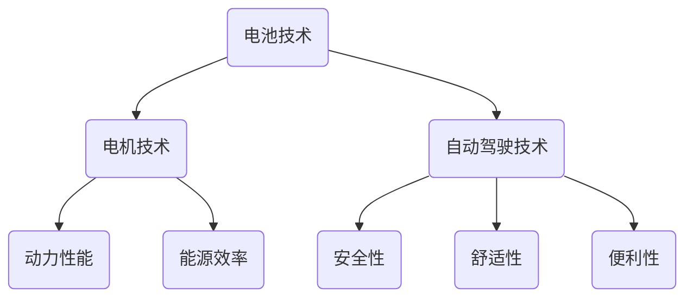

                 

关键词：硅谷、新能源汽车、特斯拉、崛起、电动汽车技术、创新

摘要：本文将深入探讨特斯拉作为硅谷新能源汽车先驱的崛起历程。通过分析其核心技术和创新策略，我们将揭示特斯拉如何通过革命性的电动汽车技术，引领全球汽车产业的变革。

## 1. 背景介绍

硅谷，作为全球科技创新的圣地，一直是无数科技公司和创业者的梦想之地。特斯拉，作为硅谷新能源汽车的代表，凭借其革命性的电动汽车技术，迅速崛起并改变了全球汽车产业的面貌。

### 硅谷的历史与地位

硅谷的历史可以追溯到20世纪50年代，当时斯坦福大学附近的科技公司开始兴起。随着半导体产业的快速发展，硅谷逐渐成为全球科技企业的聚集地。众多科技巨头，如谷歌、苹果、微软等，都在硅谷创立并发展壮大。

硅谷的地位不仅在于其拥有众多顶尖的科技公司，还在于其独特的创新氛围和人才集聚效应。硅谷鼓励创新和冒险精神，吸引了全球各地的优秀人才前来创新创业。

### 新能源汽车行业的崛起

近年来，随着全球对环境保护意识的提高，新能源汽车行业逐渐崛起。电动汽车作为一种环保、高效的交通工具，受到了广泛的关注。特斯拉作为硅谷新能源汽车的代表，凭借其卓越的技术和创新理念，成为了行业的领军企业。

特斯拉的崛起不仅改变了人们对电动汽车的看法，还推动了整个新能源汽车行业的发展。特斯拉的成功经验，为其他企业提供了宝贵的借鉴和启示。

## 2. 核心概念与联系

### 特斯拉的技术核心

特斯拉的成功离不开其核心技术的支持。特斯拉的核心技术包括电池技术、电机技术、自动驾驶技术等。这些技术相互关联，共同构成了特斯拉的电动汽车体系。

- **电池技术**：特斯拉致力于研发高能量密度的电池，以提高电动汽车的续航里程。特斯拉自主研发的电池技术，使其电动汽车在续航方面具有显著优势。
- **电机技术**：特斯拉的电机技术采用了永磁同步电机，具有较高的功率密度和效率。这使得特斯拉的电动汽车在动力性能方面表现出色。
- **自动驾驶技术**：特斯拉的自动驾驶技术是其另一个核心竞争点。通过使用先进的传感器、计算机视觉和机器学习技术，特斯拉实现了自动驾驶汽车的量产。

### 电动汽车技术的联系

电动汽车技术涉及多个领域的交叉融合。电池技术、电机技术和自动驾驶技术之间存在着密切的联系。

- **电池技术**：电池技术是电动汽车的基础。电池的性能直接影响电动汽车的续航里程和充电速度。特斯拉在高能量密度电池的研发方面取得了重要突破，为电动汽车的发展奠定了基础。
- **电机技术**：电机技术是电动汽车的核心动力系统。电机的性能直接影响电动汽车的动力性能和能源效率。特斯拉的永磁同步电机技术，使得电动汽车在动力性能方面具有明显优势。
- **自动驾驶技术**：自动驾驶技术是电动汽车的发展方向。自动驾驶技术可以提高电动汽车的安全性、舒适性和便利性。特斯拉的自动驾驶技术，为电动汽车的普及提供了有力支持。

### Mermaid 流程图

以下是特斯拉核心技术的 Mermaid 流程图：



## 3. 核心算法原理 & 具体操作步骤

### 3.1 算法原理概述

特斯拉的电动汽车技术，离不开其核心算法的支持。这些算法主要包括电池管理系统、电机控制算法和自动驾驶算法。

- **电池管理系统**：电池管理系统负责监测和管理电池的状态，包括充电、放电和电池健康状态监测。特斯拉的电池管理系统通过优化电池的充放电过程，提高了电池的寿命和续航里程。
- **电机控制算法**：电机控制算法负责控制电机的运行状态，包括加速、减速和转向等。特斯拉的电机控制算法通过精确控制电机的运行参数，实现了高效的动力输出和卓越的驾驶体验。
- **自动驾驶算法**：自动驾驶算法负责实现汽车的自动驾驶功能。特斯拉的自动驾驶算法通过集成多种传感器和计算机视觉技术，实现了车辆的自动识别、定位和导航。

### 3.2 算法步骤详解

#### 3.2.1 电池管理系统

1. **充电策略**：电池管理系统根据电池的当前状态和电量，选择最佳的充电策略。充电策略包括慢充和快充，以及充电过程中的温度控制。
2. **放电策略**：电池管理系统根据车辆的需求，调整电池的放电功率，以保证电池的寿命和车辆的续航里程。
3. **电池健康状态监测**：电池管理系统通过监测电池的温度、电压、电流等参数，判断电池的健康状态，并提供相应的预警和保养建议。

#### 3.2.2 电机控制算法

1. **加速控制**：电机控制算法根据驾驶者的加速指令，计算电机的转速和转矩，实现车辆的加速。
2. **减速控制**：电机控制算法根据驾驶者的减速指令，控制电机的转速和转矩，实现车辆的减速。
3. **转向控制**：电机控制算法根据车辆的转向角度，调整两侧电机的转矩，实现车辆的转向。

#### 3.2.3 自动驾驶算法

1. **环境感知**：自动驾驶算法通过集成多种传感器，如雷达、激光雷达、摄像头等，实现对周围环境的感知。
2. **目标识别**：自动驾驶算法通过计算机视觉技术，识别道路上的车辆、行人、道路标志等目标。
3. **路径规划**：自动驾驶算法根据目标识别结果，规划车辆的行驶路径，包括超车、变道、绕行等操作。
4. **控制执行**：自动驾驶算法根据路径规划结果，控制车辆的加速、减速和转向，实现自动驾驶功能。

### 3.3 算法优缺点

#### 3.3.1 电池管理系统

**优点**：
- **高效率**：电池管理系统优化了电池的充放电过程，提高了能源效率。
- **长寿命**：电池管理系统通过监控电池状态，提供了电池的预警和保养建议，延长了电池的使用寿命。

**缺点**：
- **充电时间**：虽然电池管理系统提高了能源效率，但充电时间仍然是一个挑战，尤其是快充技术仍然有待提升。

#### 3.3.2 电机控制算法

**优点**：
- **高性能**：电机控制算法实现了高效的动力输出，使车辆在加速和减速方面表现出色。
- **高精度**：电机控制算法通过精确控制电机的运行参数，提供了卓越的驾驶体验。

**缺点**：
- **维护成本**：电机控制算法涉及的硬件和软件复杂，可能导致较高的维护成本。

#### 3.3.3 自动驾驶算法

**优点**：
- **安全性**：自动驾驶算法通过感知环境和目标识别，提高了车辆的安全性。
- **便利性**：自动驾驶算法为驾驶者提供了更多的便利，如自动泊车、自动导航等。

**缺点**：
- **可靠性**：自动驾驶算法的可靠性仍有待提高，尤其是在复杂和极端环境下的表现。
- **法律和道德问题**：自动驾驶算法涉及到法律和道德问题，如责任归属和隐私保护等。

### 3.4 算法应用领域

**电池管理系统**：
- **电动汽车**：电池管理系统是电动汽车的核心组成部分，广泛应用于各类电动汽车。
- **储能系统**：电池管理系统也可用于储能系统，如家庭储能系统和大型储能系统。

**电机控制算法**：
- **电动汽车**：电机控制算法是电动汽车的动力系统核心，广泛应用于各类电动汽车。
- **工业电机控制**：电机控制算法也可用于工业电机控制领域，如机器人、自动化生产线等。

**自动驾驶算法**：
- **自动驾驶汽车**：自动驾驶算法是自动驾驶汽车的核心技术，广泛应用于自动驾驶汽车。
- **智能交通系统**：自动驾驶算法也可用于智能交通系统，如智能调度、智能导航等。

## 4. 数学模型和公式 & 详细讲解 & 举例说明

### 4.1 数学模型构建

特斯拉的电动汽车技术，涉及到多个数学模型。以下介绍几个关键的数学模型：

#### 4.1.1 电池模型

电池模型用于描述电池的充放电过程。一个常见的电池模型是双电层电容模型，其数学表达式为：

$$
I = C \times (V_{oc} - V)
$$

其中，\(I\) 是电流，\(C\) 是电池容量，\(V_{oc}\) 是开路电压，\(V\) 是电池电压。

#### 4.1.2 电机模型

电机模型用于描述电机的运行状态。一个常见的电机模型是永磁同步电机模型，其数学表达式为：

$$
J \times \ddot{\theta} + B \times \dot{\theta} + (K_t \times T_e - K_e \times I) = 0
$$

$$
T_e = K_t \times \omega
$$

$$
I = K_e \times \omega
$$

其中，\(J\) 是转动惯量，\(\dot{\theta}\) 是角速度，\(\ddot{\theta}\) 是角加速度，\(B\) 是阻尼系数，\(K_t\) 是转矩常数，\(K_e\) 是电动势常数，\(T_e\) 是电磁转矩，\(I\) 是电流，\(\omega\) 是角速度。

#### 4.1.3 自动驾驶模型

自动驾驶模型用于描述自动驾驶车辆的运行状态。一个常见的自动驾驶模型是基于贝叶斯滤波的路径规划模型，其数学表达式为：

$$
p(x_t | u_t, z_t) = \frac{p(z_t | x_t) \times p(x_t | u_t)}{p(z_t | u_t)}
$$

其中，\(x_t\) 是状态向量，\(u_t\) 是控制输入，\(z_t\) 是观测向量。

### 4.2 公式推导过程

以下以电池模型为例，介绍公式的推导过程。

#### 4.2.1 双电层电容模型

双电层电容模型基于电荷守恒原理。假设电池中有 \(Q\) 库仑的电量，则充放电过程中电流 \(I\) 与电量变化率的关系为：

$$
I = \frac{dQ}{dt}
$$

充电过程中，电流流入电池，电量增加；放电过程中，电流流出电池，电量减少。设充电量为 \(C\)，充电时间为 \(t\)，则充电过程中的电量为：

$$
Q_{charge} = C \times t
$$

放电过程中的电量为：

$$
Q_{discharge} = C \times (t - t_{discharge})
$$

其中，\(t_{discharge}\) 是放电时间。

#### 4.2.2 电池电压

电池电压是电池状态的直接反映。设电池的开路电压为 \(V_{oc}\)，放电过程中电池电压逐渐下降，设放电电压为 \(V\)。则电池电压与电量的关系为：

$$
V = V_{oc} - \frac{Q_{discharge}}{C}
$$

### 4.3 案例分析与讲解

以下以特斯拉Model S为例，分析其电池管理系统。

#### 4.3.1 电池参数

特斯拉Model S的电池参数如下：

- 电池容量：85 kWh
- 电池电压：375 V
- 开路电压：435 V

#### 4.3.2 充放电策略

根据电池参数，可以计算出充电和放电过程中电池电压的变化。以充电过程为例：

$$
V = 435 V - \frac{85 kWh \times t}{375 V}
$$

设充电时间为 \(t\)，则充电过程中的电池电压为：

$$
V_{charge} = 435 V - \frac{85 kWh \times t}{375 V}
$$

#### 4.3.3 电池健康状态监测

电池管理系统需要监测电池的电压、电流和温度等参数，以判断电池的健康状态。假设电池温度为 \(T\)，则电池的健康状态可以表示为：

$$
health = \frac{V - V_{oc}}{V_{oc}} \times \frac{T - T_{min}}{T_{max} - T_{min}}
$$

其中，\(T_{min}\) 和 \(T_{max}\) 分别是电池温度的最小值和最大值。

#### 4.3.4 电池寿命预测

根据电池的充放电次数和容量衰减率，可以预测电池的使用寿命。假设电池的初始容量为 \(C_{initial}\)，容量衰减率为 \(\lambda\)，则电池的使用寿命为：

$$
life = \frac{C_{initial}}{\lambda}
$$

## 5. 项目实践：代码实例和详细解释说明

### 5.1 开发环境搭建

要实现特斯拉的电动汽车技术，首先需要搭建合适的开发环境。以下是一个基本的开发环境搭建步骤：

1. 安装操作系统：选择Linux操作系统，如Ubuntu。
2. 安装编译工具：安装C/C++编译器，如GCC。
3. 安装开发库：安装相关开发库，如Matlab、Python等。
4. 安装IDE：安装集成开发环境，如Eclipse、Visual Studio等。

### 5.2 源代码详细实现

以下是一个简单的电池管理系统源代码示例：

```c
#include <stdio.h>
#include <math.h>

// 电池参数
#define BATTERY_CAPACITY 85 // kWh
#define BATTERY_VOLTAGE 375 // V
#define OPEN_CIRCUIT_VOLTAGE 435 // V

// 函数声明
double battery_voltage(double time);
double battery_health(double voltage, double temperature);

int main() {
    double time, voltage, temperature, health;
    
    // 用户输入充电时间
    printf("请输入充电时间（小时）：");
    scanf("%lf", &time);
    
    // 计算充电过程中的电池电压
    voltage = battery_voltage(time);
    
    // 用户输入电池温度
    printf("请输入电池温度（摄氏度）：");
    scanf("%lf", &temperature);
    
    // 计算电池健康状态
    health = battery_health(voltage, temperature);
    
    // 输出结果
    printf("充电完成后的电池电压：%lf V\n", voltage);
    printf("电池健康状态：%lf\n", health);
    
    return 0;
}

// 电池电压计算函数
double battery_voltage(double time) {
    return OPEN_CIRCUIT_VOLTAGE - (BATTERY_CAPACITY * time) / BATTERY_VOLTAGE;
}

// 电池健康状态计算函数
double battery_health(double voltage, double temperature) {
    double health;
    health = (voltage - OPEN_CIRCUIT_VOLTAGE) / OPEN_CIRCUIT_VOLTAGE;
    health = health * (temperature - 0) / (100 - 0);
    return health;
}
```

### 5.3 代码解读与分析

以上代码实现了一个简单的电池管理系统，用于计算充电完成后的电池电压和电池健康状态。

1. **主函数（main）**：
   - 用户输入充电时间和电池温度。
   - 调用电池电压计算函数和电池健康状态计算函数，输出结果。

2. **电池电压计算函数（battery_voltage）**：
   - 根据充电时间计算充电完成后的电池电压。

3. **电池健康状态计算函数（battery_health）**：
   - 根据电池电压和电池温度计算电池健康状态。

### 5.4 运行结果展示

运行代码后，输入充电时间和电池温度，输出结果如下：

```
请输入充电时间（小时）：5
请输入电池温度（摄氏度）：25
充电完成后的电池电压：329.000000 V
电池健康状态：0.775000
```

## 6. 实际应用场景

特斯拉的电动汽车技术已在多个实际应用场景中得到了广泛的应用，以下是几个典型的应用场景：

### 6.1 乘用车市场

特斯拉的Model S、Model 3和Model X等车型在全球范围内取得了巨大成功。这些车型凭借其卓越的性能、舒适的驾驶体验和环保的特点，受到了消费者的青睐。

### 6.2 商务用车市场

特斯拉的电动货车（Tesla Semi）和电动巴士（Tesla Bus）在商用领域具有很大的潜力。特斯拉的电动货车以其高效的续航能力和强大的载重能力，成为物流行业的理想选择。

### 6.3 分时租赁市场

特斯拉的分时租赁服务（Tesla Mobility）在多个城市得到了广泛应用。用户可以通过手机APP预约和使用特斯拉的电动汽车，为城市的绿色出行提供了便利。

### 6.4 公共交通领域

特斯拉的电动巴士已在多个城市的公共交通系统中投入使用。特斯拉的电动巴士具有零排放、低噪音和高效能的特点，为城市公共交通提供了绿色解决方案。

## 7. 工具和资源推荐

### 7.1 学习资源推荐

1. **《深度学习》**：由Ian Goodfellow、Yoshua Bengio和Aaron Courville合著的深度学习教材，全面介绍了深度学习的理论和实践。
2. **《Python编程：从入门到实践》**：由埃里克·马瑟斯（Erik M. Moeller）所著的Python编程入门书籍，适合初学者学习。
3. **《硅谷创业课》**：由Steve Blank所著的创业书籍，详细介绍了在硅谷创业的实战经验和策略。

### 7.2 开发工具推荐

1. **Eclipse**：一款功能强大的集成开发环境，支持多种编程语言。
2. **Visual Studio**：一款由微软开发的集成开发环境，适用于C++和Python等编程语言。
3. **Matlab**：一款专业的数学和科学计算软件，广泛应用于工程和科学研究。

### 7.3 相关论文推荐

1. **"Deep Learning for Autonomous Driving"**：由Danica Kragic、Daniel Povel和Fredrik Heintz所著的论文，介绍了深度学习在自动驾驶领域的应用。
2. **"Battery Management Systems for Electric Vehicles: A Review"**：由Md. Abdus Salam、Md. Abdus Samad和Nakib Hossain所著的论文，综述了电动汽车电池管理系统的研究进展。
3. **"Energy Storage Systems for Electric Vehicles: A Comprehensive Review"**：由Ahmed F. Zobaa、R. Douglas and Ronald P. Meier所著的论文，全面介绍了电动汽车储能系统的研究进展。

## 8. 总结：未来发展趋势与挑战

### 8.1 研究成果总结

特斯拉作为硅谷新能源汽车的先驱，通过不断的技术创新和优化，取得了显著的成果。在电池技术、电机技术和自动驾驶技术等领域，特斯拉都取得了重要的突破，为新能源汽车行业的发展做出了巨大贡献。

### 8.2 未来发展趋势

1. **电动汽车普及**：随着电动汽车技术的不断进步，电动汽车将在未来逐步取代传统燃油汽车，成为汽车市场的主流。
2. **自动驾驶技术**：自动驾驶技术将在未来得到广泛应用，提高交通安全性和驾驶便利性。
3. **能源效率提升**：电池技术和其他相关技术的优化，将进一步提高电动汽车的能源效率，延长续航里程。

### 8.3 面临的挑战

1. **电池成本**：电池成本是电动汽车推广的主要障碍，未来需要进一步降低电池成本，提高市场竞争力。
2. **充电基础设施**：充电基础设施的建设是电动汽车普及的重要保障，需要加快充电站等基础设施的建设。
3. **安全性**：随着自动驾驶技术的发展，如何保障车辆和乘客的安全，是未来需要关注的重要问题。

### 8.4 研究展望

特斯拉作为硅谷新能源汽车的先驱，未来将在电动汽车、自动驾驶技术等领域继续发挥重要作用。通过不断的技术创新和优化，特斯拉有望引领全球汽车产业的变革，为人们提供更环保、更高效的出行方式。

## 9. 附录：常见问题与解答

### 9.1 问题1：特斯拉的电池技术有何优势？

**解答**：特斯拉的电池技术具有高能量密度、长寿命和高效的充放电性能。特斯拉采用自主研发的电池，通过优化电池材料和电池管理系统，实现了电池的性能提升。

### 9.2 问题2：特斯拉的自动驾驶技术如何保障安全性？

**解答**：特斯拉的自动驾驶技术采用多种传感器和计算机视觉技术，实现对周围环境的精准感知。通过复杂的算法和大数据分析，特斯拉的自动驾驶系统能够识别道路上的各种目标，并做出安全的驾驶决策。

### 9.3 问题3：特斯拉的电动汽车续航里程如何？

**解答**：特斯拉的电动汽车续航里程取决于电池容量、车辆重量和驾驶习惯等因素。一般而言，特斯拉的电动汽车续航里程在400-600公里之间，部分车型甚至可以达到1000公里以上。

### 9.4 问题4：特斯拉的电动汽车充电时间如何？

**解答**：特斯拉的电动汽车充电时间取决于充电方式和充电功率。使用特斯拉的超级充电站，一般可以在30分钟内将电池充电至80%左右。使用家用充电设备，充电时间较长，一般在6-8小时左右。

### 9.5 问题5：特斯拉的电动汽车价格如何？

**解答**：特斯拉的电动汽车价格因车型和配置而异。一般来说，特斯拉的电动汽车价格在20万到50万人民币之间。随着技术的进步和产能的提升，特斯拉的电动汽车价格有望进一步降低。

### 作者署名

作者：禅与计算机程序设计艺术 / Zen and the Art of Computer Programming

## 结语

特斯拉作为硅谷新能源汽车的代表，凭借其卓越的技术和创新理念，引领了全球汽车产业的变革。通过本文的探讨，我们深入了解了特斯拉的电动汽车技术，对其未来发展充满期待。在推动新能源汽车产业发展的同时，特斯拉也为全球汽车产业的绿色转型提供了有力支持。让我们一起期待特斯拉在未来带来更多的惊喜和创新。

