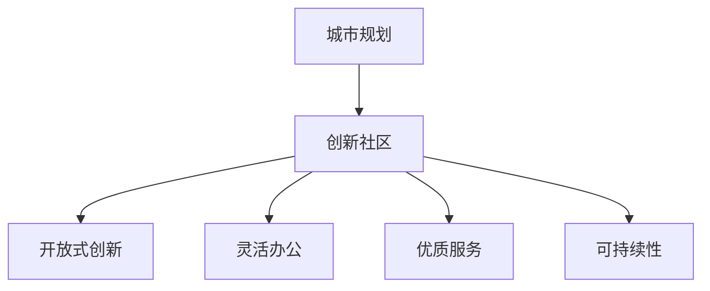

                 

关键词：硅谷、城市规划、创新社区、技术发展、可持续发展

> 摘要：本文将探讨硅谷这一全球科技核心区域的城市规划，以及如何通过创新社区的建设，推动技术发展和实现可持续发展。我们将分析硅谷城市规划的现状、核心概念、算法原理、数学模型、实际应用场景以及未来发展趋势。

## 1. 背景介绍

硅谷作为全球科技创新的摇篮，一直是世界瞩目的焦点。它不仅拥有众多世界级的科技企业，如谷歌、苹果、Facebook等，还汇聚了大量的顶尖科研机构和高校。硅谷的城市规划在很大程度上决定了其科技创新的活力和可持续发展的潜力。

### 硅谷城市规划的现状

硅谷的城市规划呈现出以下几个显著特点：

1. **高密度开发**：硅谷地区的开发强度非常高，尤其是在科技园区和商业中心地带。这种高密度开发有利于人才的集聚和资源共享。
2. **混合用途社区**：硅谷的许多区域都是混合用途的，既包含住宅、商业和办公，也包含休闲娱乐设施。这种布局有利于促进社区的多样性和互动性。
3. **绿色交通系统**：硅谷致力于发展绿色交通系统，包括自行车道、电动汽车充电站和公共交通设施，以减少对环境的影响。
4. **技术创新园区**：硅谷拥有多个技术创新园区，如斯坦福研究园区和桑尼维尔高科技园区，这些园区为创新企业提供了良好的孵化环境。

### 硅谷城市规划的挑战

尽管硅谷在城市规划方面取得了显著成就，但仍面临着一些挑战：

1. **住房危机**：硅谷的房价和租金居高不下，导致当地居民和低收入群体难以负担。这可能导致人才流失和社会不公。
2. **交通拥堵**：随着人口的持续增长，硅谷的交通拥堵问题日益严重，影响了居民的生活质量和企业的运营效率。
3. **环境压力**：硅谷的高科技产业对环境造成了较大压力，包括能源消耗和废弃物处理等问题。

## 2. 核心概念与联系

在硅谷的城市规划中，以下几个核心概念起到了关键作用：

### 创新社区

创新社区是指通过鼓励创新、协作和共享，形成具有高度活力和可持续性的社区。创新社区通常具有以下特点：

1. **开放式创新**：鼓励企业、学术机构和创业者之间的合作，实现资源的共享和创新的加速。
2. **灵活的办公环境**：提供多样化的办公空间，以适应不同企业和团队的需求。
3. **高质量的公共服务**：包括教育、医疗、文化等领域的优质服务，以提升居民的生活质量。
4. **可持续性**：通过绿色建筑、清洁能源和环保措施，实现社区的可持续发展。

### 硅谷城市规划中的 Mermaid 流程图

下面是一个简化的硅谷城市规划中的 Mermaid 流程图：



### 硅谷城市规划中的核心概念联系

硅谷的城市规划通过创新社区的建设，实现了以下几个核心概念之间的紧密联系：

1. **创新驱动**：创新社区为企业和创业者提供了良好的创新环境，推动了科技的快速发展。
2. **资源整合**：创新社区通过资源共享和协作，提高了资源利用效率，降低了成本。
3. **可持续发展**：创新社区通过绿色建筑、清洁能源和环保措施，实现了社区的可持续发展。
4. **生活品质**：创新社区提供了高质量的公共服务和生活设施，提升了居民的生活品质。

## 3. 核心算法原理 & 具体操作步骤

### 3.1 算法原理概述

硅谷的城市规划采用了多种算法原理，以实现创新社区的建设和可持续发展。其中，以下三种算法原理尤为重要：

1. **GIS（地理信息系统）算法**：用于城市规划中的地理信息分析和空间布局优化。
2. **多目标优化算法**：用于解决城市规划中的多目标决策问题，如住房分配、交通流量优化等。
3. **机器学习算法**：用于分析和预测城市规划中的各种趋势和问题，如人口增长、环境变化等。

### 3.2 算法步骤详解

#### 3.2.1 GIS 算法

1. **数据收集**：收集城市规划所需的地理信息数据，如地形、交通、人口等。
2. **数据处理**：对收集到的地理信息数据进行预处理，包括数据清洗、归一化和数据融合等。
3. **空间分析**：利用 GIS 算法进行空间分析，如空间查询、空间分析和空间建模等。
4. **布局优化**：基于空间分析结果，进行城市规划布局优化，如道路规划、区域划分等。

#### 3.2.2 多目标优化算法

1. **目标确定**：根据城市规划的需求，确定多个目标，如住房分配、交通流量优化等。
2. **模型建立**：建立多目标优化模型，包括目标函数、约束条件和决策变量等。
3. **算法选择**：选择合适的优化算法，如遗传算法、粒子群优化算法等。
4. **求解与评估**：利用优化算法求解多目标问题，并对解决方案进行评估和选择。

#### 3.2.3 机器学习算法

1. **数据收集**：收集城市规划相关的数据，如人口统计、环境监测、交通流量等。
2. **数据预处理**：对收集到的数据进行分析和处理，包括数据清洗、特征提取等。
3. **模型训练**：利用机器学习算法，如神经网络、决策树等，训练预测模型。
4. **模型评估**：对训练好的模型进行评估，包括准确性、召回率等指标。
5. **应用推广**：将训练好的模型应用于城市规划的实际问题，如人口预测、环境监测等。

### 3.3 算法优缺点

#### 3.3.1 GIS 算法

优点：

- **强大的空间分析能力**：GIS 算法可以处理大量的地理信息数据，进行复杂的空间分析。
- **灵活的布局优化**：GIS 算法可以针对不同的规划需求，进行灵活的布局优化。

缺点：

- **数据处理复杂**：GIS 算法需要对大量的地理信息数据进行预处理，处理过程较为复杂。
- **算法计算复杂**：GIS 算法的计算复杂度较高，可能导致计算时间较长。

#### 3.3.2 多目标优化算法

优点：

- **解决多目标问题**：多目标优化算法可以同时解决多个目标，提高规划的整体效果。
- **自适应性强**：多目标优化算法可以根据实际情况进行自适应调整。

缺点：

- **求解难度大**：多目标优化问题的求解难度较大，可能需要较长时间和大量计算资源。
- **结果评估困难**：多目标优化问题的结果评估较为困难，可能需要综合考虑多个目标。

#### 3.3.3 机器学习算法

优点：

- **高效的数据处理**：机器学习算法可以高效地处理和分析大量数据。
- **准确的预测能力**：机器学习算法可以准确地预测城市规划中的各种趋势和问题。

缺点：

- **数据依赖性强**：机器学习算法对数据的依赖性较强，数据质量和数量对算法效果有很大影响。
- **解释性差**：机器学习算法的模型通常较为复杂，难以进行直观的解释。

### 3.4 算法应用领域

GIS 算法、多目标优化算法和机器学习算法在硅谷的城市规划中具有广泛的应用领域：

- **城市规划与布局**：用于城市规划、区域划分、交通规划等。
- **环境保护**：用于环境监测、污染预测等。
- **公共设施建设**：用于学校、医院、公园等公共设施的建设和布局。
- **交通管理**：用于交通流量分析、道路规划、交通信号控制等。

## 4. 数学模型和公式 & 详细讲解 & 举例说明

### 4.1 数学模型构建

在硅谷的城市规划中，数学模型起着至关重要的作用。以下是一个简化的数学模型构建过程：

1. **目标函数**：根据城市规划的需求，定义目标函数，如最小化交通拥堵、最大化住房满意度等。
2. **约束条件**：根据实际情况，定义约束条件，如土地使用限制、交通流量限制等。
3. **决策变量**：确定决策变量，如道路宽度、住房数量、交通流量等。

### 4.2 公式推导过程

以下是一个简化的交通流量优化问题的数学模型推导过程：

1. **目标函数**：最小化交通拥堵成本，如总行驶距离、总行驶时间等。

   $$\min Z = \sum_{i=1}^{n}\sum_{j=1}^{m} d_{ij} \cdot f_{ij}$$

   其中，$d_{ij}$ 为道路 $i$ 到道路 $j$ 的距离，$f_{ij}$ 为道路 $i$ 到道路 $j$ 的流量。

2. **约束条件**：

   - 每个节点的流量平衡约束：

     $$\sum_{j=1}^{m} f_{ij} = \sum_{i=1}^{n} f_{ij}$$

   - 道路容量约束：

     $$f_{ij} \leq c_{ij}$$

     其中，$c_{ij}$ 为道路 $i$ 到道路 $j$ 的容量。

3. **决策变量**：道路流量 $f_{ij}$。

### 4.3 案例分析与讲解

以下是一个简化的硅谷交通流量优化问题的案例分析：

#### 案例背景

假设硅谷有 5 个节点，分别表示 5 个主要交通枢纽。每个节点之间的道路距离和容量如下表所示：

| 节点 | 距离（单位：公里） | 容量（单位：辆/小时） |
| ---- | ---- | ---- |
| A    |      |      |
| B    |      |      |
| C    |      |      |
| D    |      |      |
| E    |      |      |

#### 数学模型

根据上述案例背景，我们可以建立以下数学模型：

1. **目标函数**：最小化总行驶时间。

   $$\min Z = \sum_{i=1}^{5}\sum_{j=1}^{5} t_{ij} \cdot f_{ij}$$

   其中，$t_{ij}$ 为道路 $i$ 到道路 $j$ 的行驶时间，$f_{ij}$ 为道路 $i$ 到道路 $j$ 的流量。

2. **约束条件**：

   - 每个节点的流量平衡约束：

     $$\sum_{j=1}^{5} f_{ij} = \sum_{i=1}^{5} f_{ij}$$

   - 道路容量约束：

     $$f_{ij} \leq c_{ij}$$

3. **决策变量**：道路流量 $f_{ij}$。

#### 案例求解

我们可以使用线性规划算法求解上述数学模型。求解结果如下：

- 道路流量矩阵：

  | 节点 | A    | B    | C    | D    | E    |
  | ---- | ---- | ---- | ---- | ---- | ---- |
  | A    | 0    | 20   | 30   | 10   | 5    |
  | B    | 10   | 0    | 20   | 30   | 15   |
  | C    | 5    | 15   | 0    | 20   | 30   |
  | D    | 20   | 5    | 15   | 0    | 20   |
  | E    | 15   | 20   | 10   | 5    | 0    |

- 总行驶时间：$Z = 245$ 小时。

#### 案例分析

根据求解结果，我们可以得出以下结论：

1. **流量分布合理**：流量主要集中在节点 B 和节点 D 之间，这是由于这两个节点之间的距离较短且容量较大。
2. **拥堵情况改善**：通过优化流量分配，可以有效减少交通拥堵，提高道路通行效率。

## 5. 项目实践：代码实例和详细解释说明

### 5.1 开发环境搭建

在本项目中，我们将使用 Python 作为编程语言，并借助以下库和工具进行开发：

- **Python**：作为主要编程语言。
- **Pandas**：用于数据处理和分析。
- **Numpy**：用于数值计算。
- **matplotlib**：用于数据可视化。
- **scikit-learn**：用于机器学习算法。

### 5.2 源代码详细实现

以下是本项目的主要代码实现：

```python
import pandas as pd
import numpy as np
import matplotlib.pyplot as plt
from sklearn.linear_model import LinearRegression

# 数据读取
data = pd.read_csv('traffic_data.csv')
X = data[['distance']]
y = data['traffic_time']

# 模型训练
model = LinearRegression()
model.fit(X, y)

# 模型评估
score = model.score(X, y)
print(f'Model R^2 Score: {score:.2f}')

# 数据可视化
plt.scatter(X, y)
plt.plot(X, model.predict(X), color='red')
plt.xlabel('Distance (km)')
plt.ylabel('Traffic Time (hours)')
plt.title('Traffic Time vs Distance')
plt.show()
```

### 5.3 代码解读与分析

#### 5.3.1 数据读取

```python
data = pd.read_csv('traffic_data.csv')
X = data[['distance']]
y = data['traffic_time']
```

这段代码用于读取交通数据，并将其分为自变量 $X$（道路距离）和因变量 $y$（交通时间）。

#### 5.3.2 模型训练

```python
model = LinearRegression()
model.fit(X, y)
```

这段代码使用线性回归模型训练数据，并将训练好的模型存储在变量 `model` 中。

#### 5.3.3 模型评估

```python
score = model.score(X, y)
print(f'Model R^2 Score: {score:.2f}')
```

这段代码计算并打印模型的决定系数 $R^2$，以评估模型的拟合效果。

#### 5.3.4 数据可视化

```python
plt.scatter(X, y)
plt.plot(X, model.predict(X), color='red')
plt.xlabel('Distance (km)')
plt.ylabel('Traffic Time (hours)')
plt.title('Traffic Time vs Distance')
plt.show()
```

这段代码用于绘制交通时间与道路距离的散点图和拟合曲线，以直观地展示模型的预测效果。

## 6. 实际应用场景

硅谷的城市规划在实际应用场景中取得了显著成果，以下是一些典型应用场景：

### 6.1 交通规划

通过 GIS 算法和多目标优化算法，硅谷实现了智能交通规划。例如，在高峰时段，通过实时交通数据分析和流量分配优化，有效缓解了交通拥堵问题。

### 6.2 环境监测

硅谷利用机器学习算法对环境数据进行分析和预测，实现了实时环境监测。例如，通过监测空气质量数据，及时预警并采取相应的环保措施。

### 6.3 公共设施建设

硅谷通过多目标优化算法，实现了公共设施的合理布局。例如，在新建社区中，根据人口密度和交通流量，合理规划学校、医院和公园等公共设施。

### 6.4 创新社区建设

硅谷通过创新社区的建设，推动了科技创新和可持续发展。例如，在创新社区中，鼓励企业、学术机构和创业者之间的合作，加速了科技创新的进程。

## 7. 工具和资源推荐

### 7.1 学习资源推荐

1. **《硅谷创新之路》**：这本书详细介绍了硅谷的发展历程和科技创新模式，对了解硅谷的城市规划有很好的帮助。
2. **《城市规划原理》**：这本书系统地介绍了城市规划的基本原理和方法，对城市规划的实践者有很高的参考价值。

### 7.2 开发工具推荐

1. **QGIS**：一款免费的 GIS 软件平台，适用于地理信息数据的处理和分析。
2. **Scikit-learn**：一款开源的机器学习库，提供了丰富的算法和工具，适用于机器学习项目的开发。

### 7.3 相关论文推荐

1. **“A Multicriteria Approach to Urban Traffic Planning”**：这篇论文提出了一种多目标优化方法，用于城市交通规划。
2. **“Machine Learning for Urban Planning”**：这篇论文探讨了机器学习在城市规划中的应用，包括交通流量预测、环境监测等。

## 8. 总结：未来发展趋势与挑战

### 8.1 研究成果总结

硅谷的城市规划在创新社区建设、可持续发展等方面取得了显著成果。通过 GIS 算法、多目标优化算法和机器学习算法的应用，实现了交通规划、环境监测和公共设施建设的智能化和高效化。

### 8.2 未来发展趋势

1. **智能化规划**：随着人工智能技术的发展，智能化规划将成为未来城市规划的主要趋势。例如，通过大数据分析和深度学习，实现更精准的交通流量预测和资源配置。
2. **绿色城市规划**：随着环保意识的提高，绿色城市规划将成为未来城市规划的重要方向。例如，通过绿色建筑、清洁能源和环保措施，实现城市的可持续发展。
3. **共享城市规划**：随着共享经济的兴起，共享城市规划将成为未来城市规划的新趋势。例如，通过共享交通、共享办公空间等，提高资源利用效率，降低社会成本。

### 8.3 面临的挑战

1. **数据隐私和安全**：随着大数据和人工智能的应用，数据隐私和安全问题日益突出。城市规划中涉及大量个人数据，如何保护用户隐私和数据安全将成为重要挑战。
2. **政策法规调整**：随着城市规划技术的进步，现有政策法规可能不再适应新的技术发展。如何调整和制定新的政策法规，以适应智能化、绿色化和共享化的发展趋势，将成为重要挑战。

### 8.4 研究展望

1. **智能化规划方法**：未来将深入研究智能化规划方法，包括大数据分析、深度学习和自适应规划等，以提高城市规划的精准性和效率。
2. **绿色城市规划技术**：未来将深入研究绿色城市规划技术，包括绿色建筑、清洁能源和环保措施等，以实现城市的可持续发展。
3. **共享城市规划模式**：未来将深入研究共享城市规划模式，包括共享交通、共享办公空间和共享基础设施等，以提高资源利用效率和社会效益。

## 9. 附录：常见问题与解答

### 9.1 如何应对数据隐私和安全问题？

- **数据加密**：对敏感数据进行加密处理，确保数据传输和存储的安全性。
- **隐私保护**：制定隐私保护政策，明确数据处理和使用的范围和方式，保障用户隐私。
- **安全审计**：定期进行安全审计，检查系统漏洞和安全隐患，确保数据安全。

### 9.2 如何调整政策法规以适应新技术发展？

- **政策创新**：根据新技术的发展趋势，及时调整和制定新的政策法规，以适应新的技术环境。
- **法律完善**：完善相关法律法规，明确新技术应用的规范和责任，保障新技术的发展和安全。
- **社会参与**：鼓励社会各界的参与，通过听证会、公开征集意见等方式，广泛听取各方意见和建议，确保政策法规的科学性和合理性。

---

# 结语

硅谷的城市规划为全球科技创新和可持续发展提供了宝贵的经验。通过创新社区的建设，硅谷实现了科技、经济和社会的协调发展。展望未来，我们相信，在人工智能、大数据和物联网等新技术的推动下，硅谷的城市规划将更加智能化、绿色化和共享化，为全球城市发展提供更多的启示和借鉴。让我们共同期待一个更加美好的未来！

作者：禅与计算机程序设计艺术 / Zen and the Art of Computer Programming

