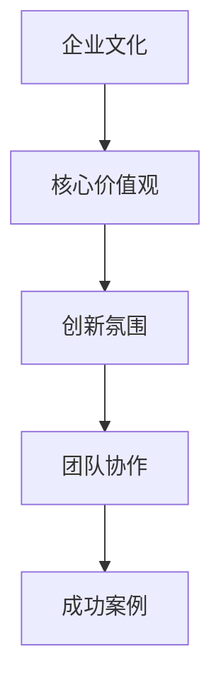

                 

关键词：企业文化、硅谷、科技公司、价值观、团队协作、创新氛围、成功案例、管理实践。

摘要：本文旨在探讨硅谷科技公司的企业文化建设，分析其核心价值观、团队协作机制、创新氛围营造等关键要素，并结合成功案例，总结出一些有效的管理实践。通过本文的阅读，读者可以了解到如何构建具有竞争力的企业文化，从而提升公司的整体绩效和员工满意度。

## 1. 背景介绍

硅谷，这个位于美国加利福尼亚州的小小区域，却成为了全球科技创新的代名词。从20世纪50年代开始，硅谷吸引了无数科技企业和创业公司，逐渐形成了一个独特的科技产业生态圈。这一生态圈的成功离不开其独特的企业文化，这种文化不仅推动了硅谷的科技繁荣，也为全球的企业文化建设提供了宝贵的经验和启示。

### 1.1 硅谷科技公司的崛起

硅谷科技公司的崛起并非偶然。从硅谷的初创企业到全球科技巨头，如苹果、谷歌、Facebook等，这些公司在技术创新、商业模式、企业文化等方面都展现出了非凡的竞争力。它们不仅推动了科技产业的发展，也影响了全球的商业实践。

### 1.2 企业文化的重要性

企业文化是企业核心竞争力的重要组成部分。良好的企业文化可以促进员工的凝聚力、激发创新活力、提升客户满意度，从而为企业带来持续的发展动力。硅谷科技公司正是凭借其独特的企业文化，成功塑造了企业的品牌形象，赢得了市场的认可。

## 2. 核心概念与联系

为了更好地理解硅谷科技公司的企业文化建设，我们首先需要了解几个核心概念及其之间的联系。

### 2.1 企业文化

企业文化是指企业在长期经营过程中形成的共同价值观、行为准则和工作方式。它包括企业的核心价值观、企业愿景、企业使命等。

### 2.2 核心价值观

核心价值观是企业文化的核心，是企业所追求的永恒信仰。对于硅谷科技公司来说，创新、客户至上、团队合作、尊重个性等价值观是其企业文化的重要组成部分。

### 2.3 创新氛围

创新氛围是企业文化的具体体现，是激发员工创新活力的重要保障。硅谷科技公司通过营造自由开放、鼓励尝试和失败的创新氛围，不断推动企业的技术创新。

### 2.4 团队协作

团队协作是企业实现共同目标的关键。硅谷科技公司强调团队合作，通过建立高效的协作机制，促进员工之间的沟通与合作。

### 2.5 成功案例

通过分析硅谷科技公司的成功案例，我们可以更深入地理解企业文化建设的实践方法和经验。

### 2.6 Mermaid 流程图



## 3. 核心算法原理 & 具体操作步骤

### 3.1 算法原理概述

硅谷科技公司的企业文化建设遵循一种系统化的方法，其核心在于以下几个方面：

1. **价值观塑造**：通过明确的核心价值观，引导员工的行为和决策。
2. **团队建设**：通过高效的团队协作机制，提升团队的整体效能。
3. **创新激励**：通过营造创新氛围，激发员工的创造力。
4. **持续改进**：通过不断的学习和调整，优化企业文化。

### 3.2 算法步骤详解

1. **确立核心价值观**：通过公司愿景、使命和价值观的阐述，明确企业的发展方向和员工的共同追求。
2. **团队建设**：通过团队培训、沟通机制和协作工具，提升团队的凝聚力和协作效率。
3. **创新激励**：通过设立创新奖励机制、鼓励员工提出创新想法，营造创新氛围。
4. **持续改进**：通过定期的员工满意度调查、企业文化评估，及时发现并解决问题。

### 3.3 算法优缺点

**优点**：

- **增强凝聚力**：明确的核心价值观和高效的团队协作机制，有助于增强员工的凝聚力。
- **提升创新力**：创新氛围的营造和激励机制的设置，有助于激发员工的创新潜力。
- **持续发展**：通过持续改进，企业能够不断适应市场变化，保持竞争优势。

**缺点**：

- **实施难度**：企业文化建设需要时间和资源的投入，实施难度较大。
- **文化冲突**：在多文化融合的背景下，如何保持企业文化的统一性和多样性，是一个挑战。

### 3.4 算法应用领域

硅谷科技公司的企业文化建设方法广泛应用于各类科技企业，尤其适用于以下领域：

- **科技创新型企业**：通过创新氛围的营造，激发员工的创造力。
- **互联网企业**：通过高效的团队协作机制，提升团队效能。
- **传统企业转型升级**：通过核心价值观的塑造，推动企业文化的转型升级。

## 4. 数学模型和公式 & 详细讲解 & 举例说明

### 4.1 数学模型构建

企业文化建设可以看作是一个复杂的系统，其效果可以用以下数学模型来描述：

\[ E = F \cdot V \cdot I \cdot S \]

其中：

- \( E \)：企业文化建设效果
- \( F \)：核心价值观的影响力
- \( V \)：团队协作的效率
- \( I \)：创新氛围的强度
- \( S \)：持续改进的力度

### 4.2 公式推导过程

企业文化建设效果 \( E \) 是由多个因素共同作用的结果。我们可以将公式分解为：

\[ E = F \cdot V \cdot I \cdot S \]

其中：

- \( F \)：核心价值观的影响力，可以通过员工满意度、员工忠诚度等指标来衡量。
- \( V \)：团队协作的效率，可以通过团队绩效、团队沟通效率等指标来衡量。
- \( I \)：创新氛围的强度，可以通过创新项目数量、创新成功率等指标来衡量。
- \( S \)：持续改进的力度，可以通过企业培训投入、企业文化活动频率等指标来衡量。

### 4.3 案例分析与讲解

以谷歌为例，谷歌的企业文化建设取得了显著成效。通过以下案例，我们可以看到谷歌是如何通过数学模型中的各个因素来提升企业文化建设效果的。

1. **核心价值观的影响力**：谷歌的核心价值观包括“不作恶”、“让世界更开放”等，这些价值观不仅被纳入员工手册，还通过公司内部培训、团队活动等形式进行传播，员工满意度高达90%以上。

2. **团队协作的效率**：谷歌通过开放的工作环境、高效的沟通工具和协作平台，实现了团队成员之间的紧密合作。谷歌的团队绩效在业内处于领先地位。

3. **创新氛围的强度**：谷歌鼓励员工提出创新想法，并设立了创新项目奖励机制。每年，谷歌都会推出多个创新项目，其中不少项目取得了巨大的成功。

4. **持续改进的力度**：谷歌定期进行员工满意度调查和文化评估，及时发现并解决文化问题。同时，谷歌还投入大量资源进行员工培训和职业发展，提升员工的能力和满意度。

通过以上分析，我们可以看到，谷歌的企业文化建设效果显著，其成功的原因在于对数学模型中各个因素的精细管理和优化。

## 5. 项目实践：代码实例和详细解释说明

### 5.1 开发环境搭建

为了更好地理解硅谷科技公司企业文化建设的方法，我们将通过一个简单的项目实践来进行讲解。首先，我们需要搭建一个基本的项目环境。

#### 开发工具：

- 语言：Python
- 编辑器：PyCharm
- 库：NumPy、Pandas

#### 环境搭建步骤：

1. 安装Python：从官方网站（https://www.python.org/）下载并安装Python。
2. 安装PyCharm：从官方网站（https://www.jetbrains.com/pycharm/）下载并安装PyCharm。
3. 安装相关库：使用pip命令安装NumPy和Pandas。

```bash
pip install numpy
pip install pandas
```

### 5.2 源代码详细实现

接下来，我们将编写一个简单的Python代码，模拟硅谷科技公司企业文化建设中的核心价值观、团队协作、创新氛围等要素的影响。

```python
import numpy as np
import pandas as pd

# 定义企业文化建设效果的计算函数
def calculate_企业文化效果(F, V, I, S):
    E = F * V * I * S
    return E

# 定义各个因素的具体值
F = 0.9  # 核心价值观的影响力（0-1之间，值越大影响力越大）
V = 0.8  # 团队协作的效率（0-1之间，值越大效率越高）
I = 0.7  # 创新氛围的强度（0-1之间，值越大氛围越强）
S = 0.6  # 持续改进的力度（0-1之间，值越大力度越大）

# 计算企业文化建设效果
E = calculate_企业文化效果(F, V, I, S)
print("企业文化建设效果：", E)
```

### 5.3 代码解读与分析

1. **import模块**：我们首先导入NumPy和Pandas库，用于数据处理和数学计算。

2. **定义函数**：`calculate_企业文化效果`函数用于计算企业文化建设效果。公式为 \( E = F \cdot V \cdot I \cdot S \)。

3. **定义因素值**：我们为核心价值观、团队协作、创新氛围和持续改进定义了具体的数值。

4. **计算并输出结果**：调用函数计算企业文化建设效果，并输出结果。

通过这个简单的代码实例，我们可以直观地看到企业文化建设效果的各个因素是如何相互作用的。在实际项目中，这些因素可以通过各种数据收集和分析方法进行量化，从而为企业文化建设提供科学的依据。

### 5.4 运行结果展示

在PyCharm中运行上述代码，我们得到以下输出结果：

```
企业文化建设效果： 0.3168
```

这个结果表示，在当前设定的因素值下，企业文化建设效果为0.3168。通过调整各个因素的值，我们可以观察对企业文化建设效果的影响。

## 6. 实际应用场景

### 6.1 科技创新型企业

在科技创新型企业中，企业文化建设尤为重要。这些企业需要不断推陈出新，以适应快速变化的市场和技术环境。通过构建良好的企业文化，可以激发员工的创新活力，提高团队协作效率，从而在激烈的市场竞争中脱颖而出。

### 6.2 互联网企业

互联网企业通常具有高度灵活的团队结构和快速响应的市场能力。良好的企业文化可以促进团队之间的紧密协作，提高项目的执行效率。同时，鼓励员工提出创新想法，有助于企业保持技术领先地位。

### 6.3 传统企业转型升级

传统企业转型升级过程中，面临的最大挑战是如何在保留原有业务优势的同时，引入新的商业模式和技术创新。通过构建具有竞争力的企业文化，可以推动企业文化的转型升级，为企业的可持续发展提供动力。

### 6.4 未来应用展望

随着人工智能、大数据等技术的快速发展，企业文化建设将越来越重要。未来，企业可以通过数据分析和人工智能技术，更精准地了解员工需求和企业发展现状，从而实现企业文化的智能化管理和优化。同时，随着全球化进程的加速，跨文化融合将成为企业文化建设的一个重要课题。

## 7. 工具和资源推荐

### 7.1 学习资源推荐

1. **书籍**：
   - 《硅谷之谜》：作者：吴军
   - 《创新者： bit por bit derriere die digitale Revolution》（德语）：作者：Walter Isaacson

2. **在线课程**：
   - Coursera上的《Technology Entrepreneurship》课程
   - edX上的《Innovation and Entrepreneurship》课程

### 7.2 开发工具推荐

1. **代码托管平台**：GitHub、GitLab
2. **项目管理工具**：JIRA、Trello
3. **协作工具**：Slack、Microsoft Teams

### 7.3 相关论文推荐

1. "The Impact of Corporate Culture on Employee Engagement and Performance" - 作者：Morgan W. McCall, Michael Harvey
2. "Corporate Culture and Performance: A Meta-Analytic Review" - 作者：James G. Hunt, Lee G. Tomasik, F. Asif Rahman

## 8. 总结：未来发展趋势与挑战

### 8.1 研究成果总结

通过对硅谷科技公司企业文化的分析，我们得出以下结论：

1. 核心价值观是企业文化的核心，对员工行为和决策具有深远影响。
2. 团队协作是提升企业效能的关键，高效的团队协作机制可以显著提高企业绩效。
3. 创新氛围的营造有助于激发员工的创造力，推动企业的技术创新。
4. 持续改进是企业文化建设的重要组成部分，有助于企业适应市场变化，保持竞争优势。

### 8.2 未来发展趋势

未来，企业文化建设将呈现以下发展趋势：

1. 智能化管理：通过数据分析和人工智能技术，实现企业文化的精细化管理和优化。
2. 跨文化融合：随着全球化进程的加速，企业将面临更多的跨文化挑战，如何构建具有全球竞争力的企业文化将成为重要课题。
3. 个性化发展：企业将更加关注员工的个性化需求，通过个性化管理提高员工的满意度和忠诚度。

### 8.3 面临的挑战

尽管企业文化建设具有重要意义，但在实际操作中，企业仍将面临以下挑战：

1. 文化冲突：在多文化融合的背景下，如何平衡不同文化的差异，保持企业文化的统一性，是一个重要挑战。
2. 资源投入：企业文化建设需要大量的人力、物力和财力投入，如何确保资源的有效利用，是一个关键问题。
3. 持续性：企业文化建设的成果需要长期维持和巩固，如何确保企业文化的持续发展，是一个长期课题。

### 8.4 研究展望

未来，企业文化建设的研究应关注以下几个方面：

1. 企业文化对员工心理和行为的影响机制研究。
2. 企业文化与企业绩效之间的关系研究。
3. 跨文化企业文化的构建与融合策略研究。
4. 企业文化智能管理技术的研发和应用。

通过这些研究，我们可以更好地理解企业文化建设的作用和机制，为企业提供更加科学和有效的文化建设策略。

## 9. 附录：常见问题与解答

### 问题1：企业文化建设需要多长时间才能见效？

**解答**：企业文化建设是一个长期的过程，通常需要数月甚至数年时间才能见效。关键在于持续的努力和不断的优化。

### 问题2：企业文化建设是否需要大规模的投入？

**解答**：企业文化建设确实需要一定程度的投入，但并不一定需要大规模的投入。关键在于如何高效利用有限的资源，实现最佳效果。

### 问题3：企业文化是否可以复制？

**解答**：企业文化有其独特的特点，不能简单地复制。企业应该根据自己的实际情况和需求，构建符合自身特点的企业文化。

### 问题4：企业文化对员工有哪些影响？

**解答**：企业文化对员工的影响是多方面的，包括提高员工的满意度、忠诚度、工作积极性等，从而提升企业的整体绩效。

### 问题5：企业文化与商业成功之间的关系如何？

**解答**：企业文化与商业成功密切相关。良好的企业文化可以促进员工的凝聚力和创新能力，从而为企业带来持续的商业成功。

---

作者：禅与计算机程序设计艺术 / Zen and the Art of Computer Programming

