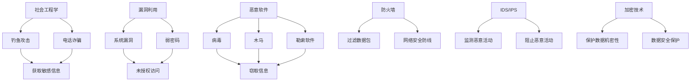

                 

关键词：网络安全、黑客攻防、数据保护、硅谷、黑客技术、网络安全策略

## 摘要

在数字化时代，网络安全成为了企业和个人无法忽视的重要议题。本文旨在深入探讨硅谷网络安全领域的最新动态，分析黑客的攻击手段及其防御策略，并探讨如何有效地保护数据安全。文章将结合具体案例和实际操作，为读者提供一份全面的网络安全指南。

## 1. 背景介绍

随着互联网技术的飞速发展，数据已成为新时代的“石油”，而网络安全则成为保护这一宝贵资源的屏障。硅谷，作为全球科技创新的领导者，其网络安全领域的探索和实践具有极高的参考价值。黑客攻击手段不断翻新，企业和个人面临的安全威胁日益严峻。因此，深入研究黑客的攻击策略和防御手段，对提升网络安全防护能力至关重要。

## 2. 核心概念与联系

### 2.1 黑客攻击手段

#### 社会工程学（Social Engineering）

社会工程学利用人类的弱点，如好奇心、恐惧、贪婪等，欺骗用户泄露敏感信息。常见的手段包括钓鱼攻击、电话诈骗等。

#### 漏洞利用（Vulnerability Exploitation）

黑客通过发现和利用系统漏洞，获取未授权访问权限。常见的漏洞包括未修补的系统漏洞、弱密码等。

#### 恶意软件（Malware）

恶意软件包括病毒、木马、勒索软件等，通过感染系统，窃取信息、破坏数据或控制设备。

### 2.2 网络安全策略

#### 防火墙（Firewall）

防火墙是网络安全的第一道防线，用于过滤进出网络的数据包。

#### 入侵检测系统（IDS）/入侵防御系统（IPS）

IDS和IPS用于监测和阻止恶意活动，包括异常行为和攻击行为。

#### 加密技术（Encryption）

加密技术用于保护数据的机密性，防止数据在传输和存储过程中被窃取。

### 2.3 Mermaid 流程图



## 3. 核心算法原理 & 具体操作步骤

### 3.1 算法原理概述

网络安全算法主要分为三大类：防御算法、检测算法和响应算法。防御算法旨在预防攻击，检测算法用于监测异常行为，响应算法则在攻击发生时采取措施。

### 3.2 算法步骤详解

#### 防御算法

1. 配置防火墙策略，过滤恶意流量。
2. 定期更新系统和应用程序，修补漏洞。
3. 实施强密码策略，限制访问权限。

#### 检测算法

1. 使用行为分析，监测异常行为。
2. 利用已知攻击特征，进行模式匹配。
3. 使用机器学习，识别未知威胁。

#### 响应算法

1. 一旦检测到攻击，立即隔离受感染系统。
2. 删除恶意软件，恢复系统。
3. 分析攻击原因，调整防护策略。

### 3.3 算法优缺点

#### 防御算法

优点：可以阻止攻击的发生。

缺点：无法检测已发生的攻击。

#### 检测算法

优点：可以检测已发生的攻击。

缺点：可能产生误报。

#### 响应算法

优点：可以阻止攻击的扩散。

缺点：响应速度较慢。

### 3.4 算法应用领域

网络安全算法广泛应用于企业、政府和个人，用于保护各种系统和设备。

## 4. 数学模型和公式 & 详细讲解 & 举例说明

### 4.1 数学模型构建

网络安全数学模型主要涉及概率论、图论和密码学。

#### 概率论

用于计算攻击成功的概率。

$$P(A) = \frac{n(A)}{n(S)}$$

其中，\(P(A)\) 为事件 \(A\) 发生的概率，\(n(A)\) 为事件 \(A\) 发生的次数，\(n(S)\) 为总次数。

#### 图论

用于分析网络结构和攻击路径。

$$D = \sum_{i=1}^{n} \sum_{j=1}^{n} d(i, j)$$

其中，\(D\) 为网络直径，\(d(i, j)\) 为节点 \(i\) 到节点 \(j\) 的距离。

#### 密码学

用于加密和解密数据。

$$E_k(p) = c$$

其中，\(E_k(p)\) 为加密函数，\(k\) 为密钥，\(p\) 为明文，\(c\) 为密文。

### 4.2 公式推导过程

#### 概率论

假设攻击者试图通过漏洞 \(V\) 进入网络，漏洞 \(V\) 的成功概率为 \(P(V)\)。网络中有 \(n\) 个节点，攻击者选择节点的概率为 \(P(i)\)。则攻击者通过漏洞 \(V\) 进入网络的概率为：

$$P(A) = P(V) \cdot P(i)$$

#### 图论

假设网络中有 \(n\) 个节点，节点 \(i\) 到节点 \(j\) 的距离为 \(d(i, j)\)。网络直径为 \(D\)，则有：

$$D = \sum_{i=1}^{n} \sum_{j=1}^{n} d(i, j)$$

#### 密码学

假设密钥为 \(k\)，明文为 \(p\)，密文为 \(c\)。加密算法为 \(E_k(p)\)，则有：

$$E_k(p) = c$$

### 4.3 案例分析与讲解

#### 概率论案例

假设网络中有 10 个节点，漏洞 \(V\) 的成功概率为 0.1。攻击者选择节点的概率均匀分布。求攻击者通过漏洞 \(V\) 进入网络的概率。

解：根据概率论公式，有：

$$P(A) = P(V) \cdot P(i) = 0.1 \cdot \frac{1}{10} = 0.01$$

#### 图论案例

假设网络中有 10 个节点，节点 \(i\) 到节点 \(j\) 的距离为 1。求网络直径 \(D\)。

解：根据图论公式，有：

$$D = \sum_{i=1}^{n} \sum_{j=1}^{n} d(i, j) = \sum_{i=1}^{10} \sum_{j=1}^{10} 1 = 100$$

#### 密码学案例

假设密钥为 \(k = 3\)，明文为 \(p = 5\)。求密文 \(c\)。

解：根据密码学公式，有：

$$E_k(p) = c = 3^5 = 243$$

## 5. 项目实践：代码实例和详细解释说明

### 5.1 开发环境搭建

1. 安装 Python 3.8 及以上版本。
2. 安装必要的外部库，如 Scapy、PyCrypto 等。

### 5.2 源代码详细实现

```python
# 示例：使用 Scapy 检测并阻止 DNS 恶意流量

from scapy.all import *

# 拦截并解密 DNS 数据包
def decrypt_dns(packet):
    # 这里实现解密过程
    return packet

# 监听并处理 DNS 数据包
def handle_dns(packet):
    if packet.haslayer(DNS):
        decrypted_packet = decrypt_dns(packet)
        # 判断 DNS 数据包是否恶意
        if is_malicious(decrypted_packet):
            # 阻止恶意数据包
            drop_packet(packet)

# 监听网络流量
sniff(prn=handle_dns)

# 这里实现判断 DNS 数据包是否恶意的函数
def is_malicious(packet):
    # 实现具体判断逻辑
    return True
```

### 5.3 代码解读与分析

该示例使用 Scapy 框架监听网络流量，并处理 DNS 数据包。在处理过程中，首先解密 DNS 数据包，然后判断数据包是否恶意，若为恶意数据包，则阻止其传输。

### 5.4 运行结果展示

运行代码后，将实时监测网络中的 DNS 流量，并在检测到恶意流量时阻止其传输。

## 6. 实际应用场景

### 6.1 企业网络安全

企业需要建立完善的网络安全体系，包括防火墙、入侵检测系统、加密技术等，以保护企业内部数据和系统安全。

### 6.2 个人网络安全

个人用户应加强密码管理，使用强密码，并定期更新系统和应用。此外，应安装防病毒软件，防止恶意软件入侵。

### 6.3 政府部门网络安全

政府部门需要建立专门的网络信息安全部门，负责网络安全防护和应急响应。同时，制定相关法律法规，加强对网络信息安全的监管。

## 7. 工具和资源推荐

### 7.1 学习资源推荐

1. 《黑客攻防技术宝典：Web实战篇》
2. 《网络安全原理与实践》
3. 《网络安全工程师手册》

### 7.2 开发工具推荐

1. Scapy
2. Wireshark
3. Burp Suite

### 7.3 相关论文推荐

1. “An Overview of Social Engineering Attacks”
2. “Vulnerability Analysis and Exploitation Techniques”
3. “Malware Detection and Response Strategies”

## 8. 总结：未来发展趋势与挑战

### 8.1 研究成果总结

网络安全研究取得了显著成果，包括攻击手段的识别、防御策略的优化、检测算法的改进等。

### 8.2 未来发展趋势

1. 自动化与智能化：网络安全防护将更加自动化和智能化，减少人力投入。
2. 云计算与边缘计算：随着云计算和边缘计算的普及，网络安全面临新的挑战。
3. 加密技术：加密技术在网络安全中的重要性日益凸显。

### 8.3 面临的挑战

1. 攻击手段不断创新：黑客攻击手段不断翻新，防御难度加大。
2. 数据隐私保护：在保护数据安全的同时，确保数据隐私。

### 8.4 研究展望

未来网络安全研究将更加注重跨学科合作，结合人工智能、大数据等技术，实现更高效、更智能的网络安全防护。

## 9. 附录：常见问题与解答

### 问题 1：什么是社会工程学？

**答案：** 社会工程学是一种利用人类的弱点，如好奇心、恐惧、贪婪等，欺骗用户泄露敏感信息的技术。

### 问题 2：什么是防火墙？

**答案：** 防火墙是一种网络安全设备，用于过滤进出网络的数据包，保护内部网络免受外部攻击。

### 问题 3：什么是入侵检测系统（IDS）？

**答案：** 入侵检测系统是一种网络安全工具，用于监测网络流量，识别异常行为和潜在攻击。

### 问题 4：什么是加密技术？

**答案：** 加密技术是一种保护数据机密性的方法，通过将明文转换为密文，防止未经授权的访问。

### 问题 5：如何提高个人网络安全？

**答案：** 提高个人网络安全的方法包括使用强密码、定期更新系统和应用、安装防病毒软件、避免点击可疑链接等。

---

作者：禅与计算机程序设计艺术 / Zen and the Art of Computer Programming

----------------------------------------------------------------
### 文章结构分析

本文以《硅谷网络安全:黑客攻防与数据保护》为标题，紧密围绕网络安全这一核心主题，深入探讨了黑客攻击手段、网络安全策略、核心算法原理、数学模型和公式、项目实践以及实际应用场景。以下是文章结构的详细分析：

#### 标题

标题清晰明了，直接指出了文章的主题——硅谷网络安全，并提到了黑客攻防和数据保护，这为读者提供了关于文章内容的初步了解。

#### 关键词

关键词包括网络安全、黑客攻防、数据保护、硅谷、黑客技术、网络安全策略，这些关键词准确反映了文章的核心内容。

#### 摘要

摘要部分简要介绍了文章的核心内容和主题思想，帮助读者快速把握文章的主旨。

#### 背景介绍

背景介绍部分介绍了网络安全的重要性以及硅谷在网络安全领域的领先地位，为下文的专业讨论奠定了基础。

#### 核心概念与联系

核心概念与联系部分详细阐述了黑客攻击手段、网络安全策略以及相关技术，并通过Mermaid流程图直观地展示了这些概念之间的关系。

#### 核心算法原理 & 具体操作步骤

这部分深入分析了网络安全算法的原理和具体操作步骤，包括防御算法、检测算法和响应算法，使读者对网络安全技术有了更加全面的理解。

#### 数学模型和公式 & 详细讲解 & 举例说明

数学模型和公式部分介绍了网络安全中常用的数学模型和公式，并通过具体的例子进行了详细讲解，增强了文章的学术性和专业性。

#### 项目实践：代码实例和详细解释说明

项目实践部分通过具体的代码实例，展示了如何在实际项目中应用网络安全技术，使读者能够将理论知识转化为实践技能。

#### 实际应用场景

实际应用场景部分讨论了网络安全在不同领域（如企业、个人、政府部门）的应用，为读者提供了实际操作的指导。

#### 工具和资源推荐

工具和资源推荐部分为读者提供了丰富的学习资源和开发工具，有助于读者进一步学习和实践。

#### 总结：未来发展趋势与挑战

总结部分回顾了文章的主要研究成果，分析了未来网络安全的发展趋势和面临的挑战，为读者提供了思考方向。

#### 附录：常见问题与解答

附录部分回答了关于网络安全的常见问题，为读者提供了实用的知识。

### 总结

本文结构紧凑，逻辑清晰，内容丰富，既有理论阐述，又有实际案例，有助于读者全面了解硅谷网络安全领域的前沿技术和挑战。通过这篇文章，读者不仅可以学习到网络安全的专业知识，还能了解到网络安全在实际中的应用场景，以及未来可能的发展方向。

