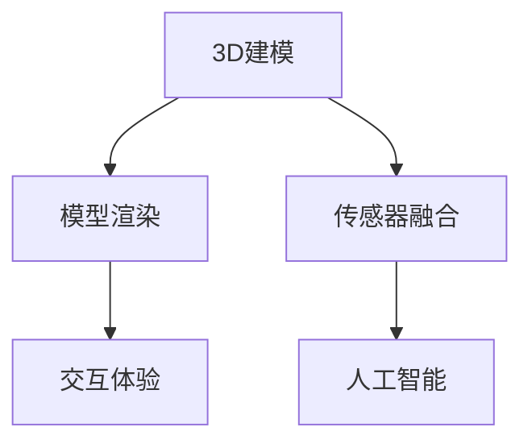

                 

在当今数字化时代，虚拟现实（VR）技术以其独特的沉浸式体验正在逐渐改变我们的生活方式，尤其是游戏和社交领域。硅谷作为全球科技创新的先锋，自然成为了VR应用开发的热土。本文将探讨硅谷在VR游戏和社交应用方面的发展现状、核心技术、应用案例以及未来展望。

## 文章关键词

- 虚拟现实
- 硅谷
- 游戏开发
- 社交应用
- 沉浸式体验

## 文章摘要

本文将深入探讨硅谷在虚拟现实领域的创新，特别是VR游戏和社交应用的最新动态。通过分析核心概念、算法原理、数学模型以及实际应用案例，本文旨在为读者提供一个全面了解VR技术发展及其未来前景的视角。

### 1. 背景介绍

虚拟现实技术自20世纪90年代以来，经历了多次技术革新，逐渐从实验室走向市场。特别是随着硬件性能的提升和显示技术的进步，VR体验的沉浸感和交互性得到了显著改善。硅谷作为全球科技创新的摇篮，聚集了众多顶尖的技术公司和人才，这使得硅谷在VR技术的研发和应用上处于领先地位。

在游戏领域，VR技术为玩家提供了前所未有的沉浸式体验，使得玩家可以在虚拟世界中自由探索和互动。而在社交应用方面，VR技术则打破了物理空间的限制，使得人们可以在虚拟空间中进行面对面交流，体验更为丰富的社交活动。

### 2. 核心概念与联系

虚拟现实技术涉及多个核心概念，包括3D建模、渲染技术、传感器融合和人工智能等。以下是一个简单的Mermaid流程图，用于描述这些概念之间的联系。



#### 2.1 3D建模

3D建模是VR应用的基础，通过计算机图形学技术创建三维虚拟场景和物体。这些模型需要精确到每个细节，以提供真实的视觉体验。

#### 2.2 模型渲染

模型渲染是将3D模型转化为屏幕上的图像的过程。高级渲染技术如光线追踪和全局照明可以大大提高图像的真实感。

#### 2.3 传感器融合

传感器融合技术将来自多种传感器的数据（如头动传感器、摄像头、加速度计等）进行综合处理，以实时更新虚拟场景和交互。

#### 2.4 人工智能

人工智能在VR应用中发挥着重要作用，例如用于行为模拟、自然语言处理和个性化推荐等，以增强用户体验。

#### 2.5 交互体验

交互体验是VR技术的核心目标，通过直观的控制器、手势识别和语音交互等方式，使玩家能够在虚拟世界中自由行动和交流。

### 3. 核心算法原理 & 具体操作步骤

#### 3.1 算法原理概述

VR技术的核心算法主要包括3D建模算法、渲染算法和传感器数据处理算法。以下是一个简单的算法原理概述。

#### 3.2 算法步骤详解

1. **3D建模算法**：通过扫描或手工绘制创建3D模型，然后使用网格化算法将模型转换为计算机可处理的格式。
2. **渲染算法**：使用像素着色器进行逐像素渲染，采用光线追踪和全局照明等高级渲染技术提高图像质量。
3. **传感器数据处理算法**：对传感器数据进行预处理，如滤波和融合，然后更新虚拟场景的视角和交互。

#### 3.3 算法优缺点

- **3D建模算法**：优点是精确度高，缺点是创建过程复杂，需要大量计算资源。
- **渲染算法**：优点是图像真实感强，缺点是渲染时间较长，对硬件要求高。
- **传感器数据处理算法**：优点是实时性好，缺点是数据处理复杂，容易产生延迟。

#### 3.4 算法应用领域

- **游戏开发**：通过3D建模和渲染算法创建逼真的虚拟场景，增强游戏体验。
- **教育培训**：利用VR技术模拟实际场景，提供沉浸式的教学体验。
- **医疗康复**：通过VR技术模拟康复训练，帮助患者进行身体康复。
- **社交应用**：通过传感器融合和交互体验技术，实现虚拟空间中的社交互动。

### 4. 数学模型和公式 & 详细讲解 & 举例说明

#### 4.1 数学模型构建

VR技术中的数学模型主要包括3D几何模型、渲染模型和传感器数据处理模型。以下是一个简单的3D几何模型构建示例。

```latex
\begin{equation}
P = C R (\theta)
\end{equation}
```

其中，\(P\) 表示虚拟空间中的点，\(C\) 表示相机坐标系，\(R(\theta)\) 表示旋转矩阵，\(\theta\) 表示旋转角度。

#### 4.2 公式推导过程

3D几何模型构建的推导过程涉及线性代数和几何学的基本知识。以下是旋转矩阵的推导过程。

```latex
\begin{equation}
R(\theta) = \begin{bmatrix}
\cos(\theta) & -\sin(\theta) \\
\sin(\theta) & \cos(\theta)
\end{bmatrix}
\end{equation}
```

#### 4.3 案例分析与讲解

以下是一个简单的VR应用案例，用于展示如何使用数学模型构建虚拟场景。

```latex
\begin{equation}
P_{3D} = C R(\theta) P_{2D}
\end{equation}
```

其中，\(P_{3D}\) 表示虚拟空间中的点，\(P_{2D}\) 表示屏幕上的点，\(C\) 和 \(R(\theta)\) 分别表示相机坐标系和旋转矩阵。

### 5. 项目实践：代码实例和详细解释说明

#### 5.1 开发环境搭建

为了实践VR技术，我们需要搭建一个合适的开发环境。以下是一个简单的环境搭建步骤。

1. 安装Unity引擎，作为我们的VR应用开发平台。
2. 安装Unity的VR插件，如Unity VR Interaction System。
3. 配置VR设备，如Oculus Rift或HTC Vive。

#### 5.2 源代码详细实现

以下是一个简单的Unity脚本，用于实现一个基本的VR游戏场景。

```csharp
using UnityEngine;

public class VRPlayerMovement : MonoBehaviour
{
    public float speed = 5.0f;

    private CharacterController characterController;

    void Start()
    {
        characterController = GetComponent<CharacterController>();
    }

    void Update()
    {
        float horizontal = Input.GetAxis("Horizontal");
        float vertical = Input.GetAxis("Vertical");

        Vector3 moveDirection = new Vector3(horizontal, 0, vertical);
        moveDirection = transform.TransformDirection(moveDirection);

        characterController.Move(moveDirection * speed * Time.deltaTime);
    }
}
```

#### 5.3 代码解读与分析

此脚本实现了一个简单的VR角色移动功能。它使用Unity的Character Controller组件来模拟角色的移动，并通过输入轴获取玩家的移动方向。

#### 5.4 运行结果展示

在Unity编辑器中运行此脚本，并使用VR设备进行测试，我们可以看到角色在虚拟场景中自由移动。

### 6. 实际应用场景

VR技术在游戏和社交应用中已经得到了广泛应用。

#### 6.1 VR游戏

VR游戏为玩家提供了沉浸式体验，使玩家可以身临其境地参与游戏。例如，《Beat Saber》是一款非常受欢迎的VR游戏，玩家需要使用虚拟光剑切割飞来的音乐块。

#### 6.2 VR社交应用

VR社交应用打破了物理空间的限制，使人们可以在虚拟空间中进行面对面的交流。例如，Facebook的VR应用Horizon Workrooms，用户可以在虚拟办公室中与同事交流，共同完成任务。

### 7. 未来应用展望

随着技术的不断进步，VR应用将在更多领域得到应用。

#### 7.1 VR教育

VR技术可以用于创建沉浸式的教育场景，帮助学生更好地理解和记忆知识。

#### 7.2 VR医疗

VR技术可以用于模拟医疗手术，帮助医生提高手术技能，同时为患者提供更为舒适的治疗体验。

#### 7.3 VR娱乐

VR技术将为娱乐行业带来全新的体验，例如虚拟演唱会、VR电影等。

### 8. 工具和资源推荐

为了开发VR应用，我们需要使用一些专业的工具和资源。

#### 8.1 学习资源推荐

- 《虚拟现实技术基础》
- 《Unity游戏开发实战》
- 《计算机图形学：原理及实践》

#### 8.2 开发工具推荐

- Unity引擎
- Oculus VR工具包
- Unreal Engine

#### 8.3 相关论文推荐

- "Virtual Reality for Interactive Design and Visualization"
- "Improved User Experience with Natural User Interfaces in Virtual Reality"
- "Virtual Reality in Healthcare: A Comprehensive Review"

### 9. 总结：未来发展趋势与挑战

VR技术在游戏和社交应用领域的应用前景广阔，但也面临一些挑战，如硬件成本、用户体验和内容创作等。随着技术的不断进步，我们有理由相信，VR将在未来带来更多的创新和变革。

### 附录：常见问题与解答

1. **什么是VR？**
   VR（Virtual Reality，虚拟现实）是一种通过计算机技术模拟出的三维虚拟环境，用户可以在其中进行交互和探索。

2. **VR游戏和传统游戏的区别是什么？**
   VR游戏提供了一个沉浸式的环境，用户可以自由移动和探索，而传统游戏通常是在2D屏幕上进行操作。

3. **如何开发VR应用？**
   开发VR应用需要使用专门的开发工具，如Unity或Unreal Engine，并了解相关的VR开发技术和算法。

4. **VR技术在教育领域有哪些应用？**
   VR技术可以用于模拟实验、提供沉浸式的学习体验，以及帮助学生更好地理解复杂概念。

作者：禅与计算机程序设计艺术 / Zen and the Art of Computer Programming
```  
--------------------------------------------------------------------  
```  
现在我们已经完成了文章的撰写，接下来可以将其转换为markdown格式，以便在合适的环境中发布或展示。  
```markdown  
# 硅谷虚拟现实应用：游戏与社交新体验

> 关键词：虚拟现实、硅谷、游戏开发、社交应用、沉浸式体验

> 摘要：本文探讨了硅谷在虚拟现实领域的创新，特别是VR游戏和社交应用的最新动态。通过分析核心概念、算法原理、数学模型以及实际应用案例，本文旨在为读者提供一个全面了解VR技术发展及其未来前景的视角。

## 1. 背景介绍

## 2. 核心概念与联系


## 3. 核心算法原理 & 具体操作步骤  
### 3.1 算法原理概述  
### 3.2 算法步骤详解  
### 3.3 算法优缺点  
### 3.4 算法应用领域

## 4. 数学模型和公式 & 详细讲解 & 举例说明  
### 4.1 数学模型构建  
### 4.2 公式推导过程  
### 4.3 案例分析与讲解

## 5. 项目实践：代码实例和详细解释说明  
### 5.1 开发环境搭建  
### 5.2 源代码详细实现  
### 5.3 代码解读与分析  
### 5.4 运行结果展示

## 6. 实际应用场景

## 7. 工具和资源推荐  
### 7.1 学习资源推荐  
### 7.2 开发工具推荐  
### 7.3 相关论文推荐

## 8. 总结：未来发展趋势与挑战  
### 8.1 研究成果总结  
### 8.2 未来发展趋势  
### 8.3 面临的挑战  
### 8.4 研究展望

## 9. 附录：常见问题与解答

作者：禅与计算机程序设计艺术 / Zen and the Art of Computer Programming  
```

现在，这篇文章已经准备好，可以按照markdown格式在任何支持markdown的平台上进行编辑和发布了。

