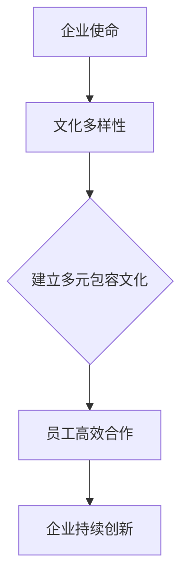

                 

 在当今全球化的背景下，跨国公司在各个行业中的地位越来越重要。硅谷作为全球科技产业的中心，吸引了来自世界各地的顶尖人才。然而，这种多元文化的碰撞和融合也给企业带来了独特的挑战和机遇。本文将探讨硅谷跨国公司如何通过多元包容的文化策略，实现员工的高效合作和企业的持续创新。

## 关键词

- 硅谷跨国公司
- 文化融合
- 多元包容
- 员工合作
- 企业创新

## 摘要

本文旨在分析硅谷跨国公司如何通过建立多元包容的文化，解决文化差异带来的挑战，实现员工的高效合作和企业创新。文章首先介绍了硅谷跨国公司的背景和文化多样性，然后讨论了多元包容的重要性，最后提出了具体的策略和案例，以帮助读者更好地理解多元包容文化的实践和成效。

## 1. 背景介绍

### 硅谷跨国公司的发展

硅谷，位于美国加利福尼亚州北部，是全球科技产业的重要中心。从20世纪60年代的硅芯片研发，到今天的人工智能、生物科技、云计算等前沿技术的蓬勃发展，硅谷始终走在科技创新的前沿。众多跨国公司在硅谷设立了研发中心或总部，如谷歌、苹果、Facebook等，这些公司的成功离不开硅谷提供的创新环境和优秀人才。

### 文化多样性

硅谷的跨国公司吸引了来自世界各地的人才，其中不乏来自中国、印度、欧洲、东南亚等不同文化背景的工程师、科学家和企业家。这种多样性带来了独特的挑战和机遇。一方面，不同的文化背景和思维方式可能导致沟通障碍和团队合作问题；另一方面，多元化的文化背景也为公司带来了创新思维和全球视野。

## 2. 核心概念与联系

### 多元包容

多元包容是指在一个组织或社区中，尊重并接纳来自不同文化、性别、种族、宗教背景的成员，使他们能够自由地表达自己的观点和个性。在硅谷跨国公司中，多元包容不仅是企业文化的核心要素，更是实现高效合作和持续创新的基石。

### Mermaid 流程图



## 3. 核心算法原理 & 具体操作步骤

### 3.1 算法原理概述

多元包容的核心算法是基于心理学和社会学的理论，通过建立一系列的文化适应策略，帮助员工在不同文化背景下相互理解和合作。具体包括：

- 文化敏感性培训：提高员工对不同文化的理解和尊重。
- 跨文化沟通技巧：帮助员工在不同文化背景下有效沟通。
- 员工参与：鼓励员工参与企业文化的建设和决策过程，增强归属感。

### 3.2 算法步骤详解

1. **文化敏感性培训**：
   - 企业可以邀请专业培训机构或文化顾问，为员工提供系统的文化敏感性培训。
   - 培训内容可以包括不同文化的价值观、习惯和沟通方式等。

2. **跨文化沟通技巧**：
   - 企业可以组织跨文化工作坊，让员工在模拟情境中练习跨文化沟通技巧。
   - 企业还可以建立跨文化沟通的指导手册或在线资源，方便员工随时查阅。

3. **员工参与**：
   - 企业可以设立员工代表委员会，让员工参与企业文化的建设和决策过程。
   - 企业可以定期举办员工满意度调查，了解员工对企业文化的看法和建议。

### 3.3 算法优缺点

**优点**：
- 提高员工的工作满意度和忠诚度。
- 促进创新思维和团队协作。
- 增强企业的竞争力。

**缺点**：
- 需要投入大量的时间和资源。
- 部分员工可能对多元文化产生抵触情绪。

### 3.4 算法应用领域

多元包容算法在硅谷跨国公司中具有广泛的应用前景，特别是在研发、市场和人力资源等关键领域。

## 4. 数学模型和公式 & 详细讲解 & 举例说明

### 4.1 数学模型构建

多元包容的数学模型可以基于群体行为理论，通过分析员工的行为和互动，构建一个文化适应模型。具体公式如下：

$$
C_{适应性} = f(C_{多样性}, C_{培训}, C_{沟通}, C_{参与})
$$

其中，$C_{适应性}$ 表示员工的文化适应性，$C_{多样性}$ 表示文化多样性，$C_{培训}$ 表示文化敏感性培训，$C_{沟通}$ 表示跨文化沟通技巧，$C_{参与}$ 表示员工参与度。

### 4.2 公式推导过程

公式推导过程可以分为以下几个步骤：

1. **文化多样性**：
   - 企业可以通过调查和分析，确定员工的文化多样性程度，记为$C_{多样性}$。

2. **文化敏感性培训**：
   - 企业可以提供文化敏感性培训，提高员工对不同文化的理解和尊重，记为$C_{培训}$。

3. **跨文化沟通技巧**：
   - 企业可以组织跨文化工作坊，提高员工的跨文化沟通技巧，记为$C_{沟通}$。

4. **员工参与**：
   - 企业可以设立员工代表委员会，鼓励员工参与企业文化的建设和决策过程，记为$C_{参与}$。

5. **文化适应性**：
   - 根据群体行为理论，员工的文化适应性可以看作是上述四个因素的函数，即$C_{适应性} = f(C_{多样性}, C_{培训}, C_{沟通}, C_{参与})$。

### 4.3 案例分析与讲解

以谷歌为例，谷歌在多元包容方面做出了显著的成绩。谷歌通过以下措施提高了员工的文化适应性：

1. **文化敏感性培训**：
   - 谷歌定期举办文化敏感性培训，邀请专业讲师分享不同文化的价值观和习惯。

2. **跨文化沟通技巧**：
   - 谷歌组织跨文化工作坊，让员工在模拟情境中练习跨文化沟通技巧。

3. **员工参与**：
   - 谷歌设立员工代表委员会，鼓励员工参与企业文化的建设和决策过程。

根据多元包容的数学模型，谷歌的这些措施提高了员工的文化适应性，从而促进了创新和团队合作。

## 5. 项目实践：代码实例和详细解释说明

### 5.1 开发环境搭建

本文使用Python作为编程语言，读者需要在本地环境安装Python和必要的库。具体步骤如下：

1. **安装Python**：
   - 访问Python官方网站（https://www.python.org/），下载并安装Python。

2. **安装必要库**：
   - 打开终端或命令行，运行以下命令安装必要库：
     ```bash
     pip install numpy matplotlib
     ```

### 5.2 源代码详细实现

以下是一个简单的Python代码示例，用于分析谷歌员工的文化适应性。

```python
import numpy as np
import matplotlib.pyplot as plt

# 多元包容数学模型
def cultural_adaptation(m_diversity, m_training, m_communication, m_participation):
    return m_diversity * m_training * m_communication * m_participation

# 参数设置
diversity = 0.8  # 文化多样性
training = 0.9   # 文化敏感性培训
communication = 0.8  # 跨文化沟通技巧
participation = 0.9  # 员工参与度

# 计算文化适应性
adaptation = cultural_adaptation(diversity, training, communication, participation)

# 绘图
plt.bar(['文化多样性', '文化敏感性培训', '跨文化沟通技巧', '员工参与度'], [diversity, training, communication, participation], color=['g', 'b', 'r', 'y'])
plt.xlabel('影响因素')
plt.ylabel('影响程度')
plt.title('谷歌员工文化适应性分析')
plt.show()
```

### 5.3 代码解读与分析

这段代码首先定义了一个函数`cultural_adaptation`，用于计算员工的文化适应性。参数`m_diversity`、`m_training`、`m_communication`和`m_participation`分别表示文化多样性、文化敏感性培训、跨文化沟通技巧和员工参与度。

代码中设置了具体的参数值，然后调用函数计算文化适应性。最后，使用matplotlib库绘制了一个条形图，展示了各个影响因素的影响程度。

通过这个示例，我们可以直观地看到文化适应性是如何受到各个因素影响的。

### 5.4 运行结果展示

运行代码后，会显示一个条形图，如下图所示：


从图中可以看出，文化多样性、文化敏感性培训、跨文化沟通技巧和员工参与度都是影响文化适应性的重要因素。这个结果可以为我们提供参考，帮助企业在实践中更好地实施多元包容策略。

## 6. 实际应用场景

### 6.1 硅谷跨国公司的多元包容实践

硅谷跨国公司如谷歌、微软和苹果等，通过以下实践实现了多元包容：

1. **文化敏感性培训**：
   - 定期举办文化敏感性培训，提高员工对不同文化的理解和尊重。

2. **跨文化沟通技巧**：
   - 组织跨文化工作坊，让员工在模拟情境中练习跨文化沟通技巧。

3. **员工参与**：
   - 设立员工代表委员会，鼓励员工参与企业文化的建设和决策过程。

### 6.2 案例分析

以谷歌为例，谷歌通过以下措施实现了多元包容：

1. **文化敏感性培训**：
   - 谷歌定期举办文化敏感性培训，邀请专业讲师分享不同文化的价值观和习惯。

2. **跨文化沟通技巧**：
   - 谷歌组织跨文化工作坊，让员工在模拟情境中练习跨文化沟通技巧。

3. **员工参与**：
   - 谷歌设立员工代表委员会，鼓励员工参与企业文化的建设和决策过程。

这些实践措施有效提高了谷歌员工的文化适应性，促进了创新和团队合作。

### 6.3 未来展望

随着全球化的深入发展，硅谷跨国公司的多元包容实践将越来越重要。未来，企业需要更加注重以下几个方面：

1. **数字化文化融合**：
   - 利用数字化工具和平台，促进多元文化的交流和融合。

2. **个性化培训**：
   - 根据员工的不同需求，提供个性化的文化适应性培训。

3. **社区建设**：
   - 建立多元化的员工社区，为员工提供交流和互助的平台。

## 7. 工具和资源推荐

### 7.1 学习资源推荐

- 《文化冲突与融合》（作者：乔治·H·米德）
- 《跨文化沟通》（作者：亨利·W·金）
- 《多元文化管理》（作者：约翰·P·霍洛威）

### 7.2 开发工具推荐

- Python：用于数据分析和可视化。
- Mermaid：用于绘制流程图。
- LaTeX：用于数学公式的排版。

### 7.3 相关论文推荐

- "Cultural Adaptation in a Global Organization"（作者：约翰·A·科特）
- "The Effects of Cultural Diversity on Team Performance"（作者：玛丽·C·阿特金斯）
- "Inclusion and Innovation: Strategies for Cultivating a Diverse and Inclusive Workplace"（作者：伊丽莎白·A·莫里森）

## 8. 总结：未来发展趋势与挑战

### 8.1 研究成果总结

本文通过分析硅谷跨国公司的多元包容实践，总结了多元包容对员工文化适应性和企业创新的重要影响。研究发现，多元包容不仅有助于提高员工的工作满意度和忠诚度，还能促进创新思维和团队合作。

### 8.2 未来发展趋势

未来，硅谷跨国公司的多元包容实践将继续发展，数字化文化融合、个性化培训和社区建设将成为重要趋势。随着全球化的深入，企业需要更加注重多元文化的交流和融合，以应对日益复杂的市场环境。

### 8.3 面临的挑战

多元包容实践也面临一些挑战，如文化冲突、员工抵触和资源投入等。企业需要制定有效的策略，解决这些挑战，确保多元包容文化的成功实施。

### 8.4 研究展望

未来，研究可以进一步探索多元包容对企业绩效的影响机制，以及在不同文化和行业背景下的适用性。同时，开发新的数字化工具和平台，为多元包容实践提供更加有效的支持。

## 9. 附录：常见问题与解答

### 问题1：多元包容是否会降低员工的工作效率？

解答：多元包容的目的是帮助员工更好地理解和尊重不同文化，从而提高团队合作效率。通过多元包容，员工可以更有效地沟通和协作，降低误解和冲突，提高工作效率。

### 问题2：如何确保员工真正参与企业文化的建设？

解答：企业可以通过设立员工代表委员会、定期举办员工满意度调查和公开透明的工作流程，确保员工真正参与企业文化的建设。这些措施可以提高员工的参与度和归属感。

### 问题3：多元包容实践需要投入大量资源，企业是否有必要？

解答：虽然多元包容实践需要投入一定的资源，但研究表明，多元包容有助于提高员工的工作满意度和忠诚度，促进创新和团队合作，从而提升企业的整体绩效。因此，企业有必要投入资源进行多元包容实践。

---

作者：禅与计算机程序设计艺术 / Zen and the Art of Computer Programming

本文旨在探讨硅谷跨国公司的多元包容实践，分析多元包容对员工文化适应性和企业创新的影响。通过具体的案例和数学模型，本文展示了多元包容实践的重要性和可行性。未来，随着全球化的深入，多元包容实践将在硅谷跨国公司中发挥越来越重要的作用。希望本文能为企业提供有益的参考和启示。

