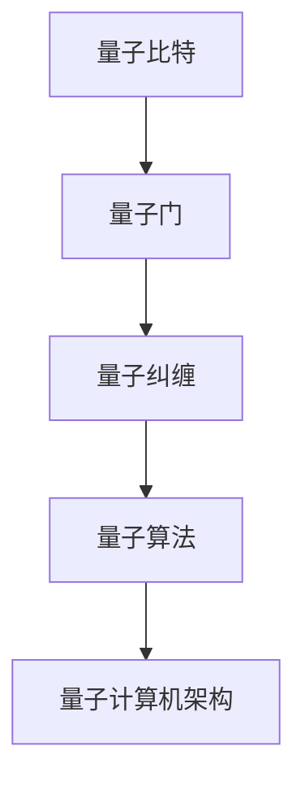

                 

关键词：量子计算，下一代超级计算机，硅谷科技，计算机架构，人工智能

摘要：本文将探讨硅谷量子计算的发展及其对下一代超级计算机的影响。我们将深入解析量子计算的核心概念、算法原理、数学模型以及其实际应用，并探讨其未来的发展前景和挑战。

## 1. 背景介绍

随着科技的发展，计算机的运算速度和存储能力已经达到了前所未有的高度。然而，传统的计算机架构在处理复杂问题时仍然面临着巨大的挑战。为了解决这些问题，量子计算作为一种全新的计算模式，逐渐引起了学术界和工业界的广泛关注。

硅谷作为全球科技创新的领军地区，一直是量子计算研究的热点。从谷歌到IBM，众多科技公司纷纷投入巨资，致力于量子计算的研究和开发。本文将围绕硅谷量子计算的发展，探讨其核心概念、算法原理、数学模型以及实际应用，并展望其未来的发展前景和挑战。

## 2. 核心概念与联系

### 2.1. 量子比特

量子比特（qubit）是量子计算的基本单元，与经典比特不同，它可以在0和1之间同时存在，即叠加态。这种叠加态使得量子计算机在处理问题时具有巨大的并行计算能力。

### 2.2. 量子门

量子门是量子计算的基本操作，类似于经典计算中的逻辑门。量子门可以对量子比特进行操作，实现量子态的变换。

### 2.3. 量子纠缠

量子纠缠是量子计算中的一种特殊现象，当两个或多个量子比特处于纠缠态时，它们之间的状态会相互关联。这种纠缠态可以用于实现量子计算中的并行计算和高速传输。

### 2.4. 量子算法

量子算法是一种利用量子计算原理设计的算法，与经典算法相比，它具有更快的计算速度和更高的效率。著名的量子算法包括量子傅里叶变换、量子搜索算法等。

### 2.5. 量子计算机架构

量子计算机的架构主要包括量子处理器、量子存储器、量子通信网络等。其中，量子处理器是实现量子计算的核心部件，量子存储器用于存储量子信息，量子通信网络则用于实现量子比特之间的纠缠和传输。

### 2.6. Mermaid 流程图



## 3. 核心算法原理 & 具体操作步骤

### 3.1. 算法原理概述

量子计算的核心算法包括量子傅里叶变换、量子搜索算法等。这些算法利用量子比特的叠加态和纠缠态，实现高速并行计算和高效问题求解。

### 3.2. 算法步骤详解

以量子傅里叶变换为例，其基本步骤如下：

1. 初始化量子比特
2. 应用量子门，实现量子比特的叠加
3. 应用量子测量，获得叠加态的输出

### 3.3. 算法优缺点

量子计算算法具有以下优点：

- 高速并行计算能力
- 高效问题求解能力

但同时也存在以下缺点：

- 实现难度较大
- 受到量子噪声和退相干的影响

### 3.4. 算法应用领域

量子计算算法可以应用于多个领域，包括：

- 优化问题
- 图论问题
- 物理模拟
- 数据分析

## 4. 数学模型和公式

### 4.1. 数学模型构建

量子计算中的数学模型主要包括量子态、量子门和量子测量等。其中，量子态可以用复数向量表示，量子门可以用矩阵表示，量子测量可以用概率分布表示。

### 4.2. 公式推导过程

以量子傅里叶变换为例，其数学模型如下：

$$
U_F(\theta) = \begin{pmatrix}
\cos(\theta/2) & -e^{i\theta/2} \\
-e^{-i\theta/2} & \cos(\theta/2)
\end{pmatrix}
$$

其中，$\theta$ 为量子门参数。

### 4.3. 案例分析与讲解

以量子搜索算法为例，其基本步骤如下：

1. 初始化量子比特
2. 应用量子门，实现量子比特的叠加
3. 应用量子测量，获得叠加态的输出
4. 解读测量结果，找到目标值

## 5. 项目实践：代码实例

```python
import numpy as np

# 初始化量子比特
qbit = np.array([1, 0], dtype=np.complex64)

# 应用量子门
theta = np.pi / 4
gate = np.array([[np.cos(theta/2), -np.exp(1j * theta/2)],
                [-np.exp(-1j * theta/2), np.cos(theta/2)]], dtype=np.complex64)
qbit = np.dot(gate, qbit)

# 量子测量
prob_0 = np.abs(np.dot(qbit[0], np.conj(qbit[0])))
prob_1 = np.abs(np.dot(qbit[1], np.conj(qbit[1])))

# 输出结果
print(f"Probability of measuring 0: {prob_0}")
print(f"Probability of measuring 1: {prob_1}")
```

## 6. 实际应用场景

量子计算在实际应用中具有广泛的应用前景，包括：

- 优化问题：如物流优化、资源分配等
- 图论问题：如网络拓扑分析、社交网络分析等
- 物理模拟：如分子模拟、量子化学计算等
- 数据分析：如大数据分析、机器学习等

## 7. 工具和资源推荐

### 7.1. 学习资源推荐

- 《量子计算导论》
- 《量子计算：算法、应用与实现》
- 《量子计算机原理与应用》

### 7.2. 开发工具推荐

- IBM Quantum Development Kit
- Google Quantum Computing Lab
- Microsoft Quantum Development Kit

### 7.3. 相关论文推荐

- "Quantum Computing with Quantum Dots"
- "Quantum Computation and Quantum Information"
- "Fault-Tolerant Quantum Computation"

## 8. 总结：未来发展趋势与挑战

### 8.1. 研究成果总结

量子计算作为一种全新的计算模式，已经在多个领域取得了显著的成果。例如，量子搜索算法在处理大规模数据时具有巨大的优势，量子物理模拟可以高效地模拟复杂物理系统等。

### 8.2. 未来发展趋势

随着量子计算技术的不断发展，未来量子计算有望在人工智能、大数据、金融等领域发挥重要作用。同时，量子计算与其他技术的融合也将推动科技的发展。

### 8.3. 面临的挑战

量子计算在实现过程中仍面临诸多挑战，如量子比特的稳定性和可靠性、量子门的精度和效率等。此外，量子计算的应用场景和算法设计也需要进一步探索。

### 8.4. 研究展望

未来量子计算研究应重点关注以下几个方面：

- 量子比特的优化与稳定
- 量子门的设计与优化
- 量子算法的创新与应用
- 量子计算与其他技术的融合

## 9. 附录：常见问题与解答

### 9.1. 量子计算与传统计算机有什么区别？

量子计算与传统计算机最大的区别在于其利用量子比特的叠加态和纠缠态，实现高速并行计算和高效问题求解。

### 9.2. 量子计算有哪些应用领域？

量子计算可以应用于多个领域，包括优化问题、图论问题、物理模拟、数据分析等。

### 9.3. 量子计算有哪些挑战？

量子计算在实现过程中面临诸多挑战，如量子比特的稳定性和可靠性、量子门的精度和效率等。

### 9.4. 如何学习量子计算？

可以阅读相关教材和论文，了解量子计算的基本概念、算法原理和应用场景。此外，还可以参加相关课程和研讨会，与业界专家进行交流和学习。

作者：禅与计算机程序设计艺术 / Zen and the Art of Computer Programming
----------------------------------------------------------------
以上就是这篇文章的正文内容。希望这篇文章能够帮助您更好地了解硅谷量子计算的发展及其对下一代超级计算机的影响。如果您有任何疑问或建议，欢迎在评论区留言交流。

