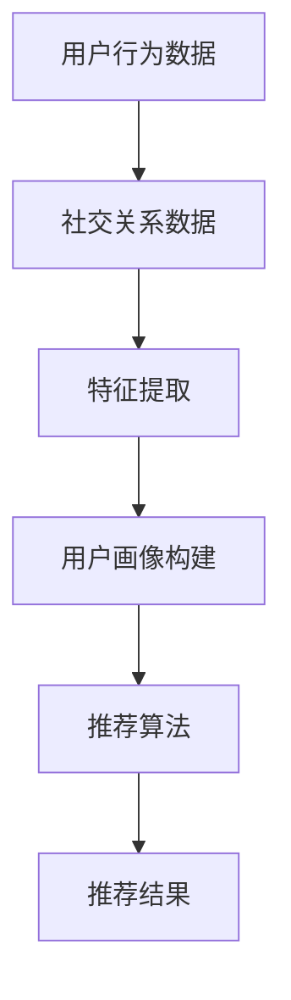

                 

社交网络作为现代社会信息交流的重要平台，用户在其中的互动和分享行为为个性化推荐系统提供了丰富的数据源。随着用户基数的增加和数据量的爆发式增长，如何有效地利用这些数据来为用户提供精准的推荐成为了一个重要的研究方向。本文将深入探讨社交网络推荐系统中的大模型发展现状、核心概念、算法原理、数学模型、项目实践以及未来趋势和挑战。

## 文章关键词
- 社交网络
- 推荐系统
- 大模型
- 机器学习
- 深度学习

## 文章摘要
本文首先介绍了社交网络推荐系统的重要性及其发展历程，随后详细阐述了社交网络推荐中的核心概念和架构。接着，本文重点分析了社交网络推荐中的大模型原理，并详细讲解了数学模型构建和公式推导。随后，通过一个实际项目实例，本文展示了如何将大模型应用于社交网络推荐系统的开发和实现。最后，本文探讨了社交网络推荐系统的实际应用场景，并对未来的发展趋势和面临的挑战进行了展望。

### 1. 背景介绍

社交网络，作为一个庞大的在线社交平台，已经成为现代社会人们日常交流、分享和获取信息的重要渠道。从早期的Facebook、Twitter，到现在的Instagram、LinkedIn，社交网络已经深深地嵌入到了人们的生活中。这种广泛应用带来了海量的用户数据，这些数据不仅包含了用户的社交关系、兴趣偏好，还包括了用户在社交网络上的行为记录，如点赞、评论、分享等。

推荐系统作为大数据和人工智能技术的重要应用之一，旨在为用户提供个性化的信息推荐。在社交网络环境中，推荐系统可以帮助用户发现感兴趣的内容、拓展社交圈、提高信息获取效率。社交网络推荐系统不仅需要处理海量数据，还要保证推荐的实时性和准确性，这对推荐算法和模型的设计提出了更高的要求。

大模型的发展为社交网络推荐系统带来了新的机遇。大模型，通常指的是参数数量达到百万甚至亿级的深度学习模型，能够从大规模数据中挖掘出复杂的模式和规律。在社交网络推荐领域，大模型的应用不仅提高了推荐的准确性，还能够处理更加复杂的用户行为和社交关系。

### 2. 核心概念与联系

#### 2.1 社交网络推荐系统概述

社交网络推荐系统是指利用机器学习和深度学习技术，根据用户在社交网络上的行为和社交关系，为用户提供个性化推荐的一种系统。这种系统通常包含以下几个核心组件：

- **用户画像**：通过分析用户在社交网络上的行为数据，如点赞、评论、分享等，构建用户的兴趣偏好模型。
- **社交关系网络**：利用社交网络中的关系数据，构建用户之间的社交关系图，用于影响推荐结果。
- **推荐算法**：根据用户画像和社交关系网络，利用机器学习或深度学习算法为用户生成推荐列表。

#### 2.2 推荐算法分类

社交网络推荐系统中的推荐算法主要分为基于内容的推荐、协同过滤推荐和混合推荐三种类型。

- **基于内容的推荐**：通过分析用户历史行为和内容属性，将相似的内容推荐给用户。这种方法在处理冷启动问题（即新用户没有足够行为数据的情况）方面效果较好。
- **协同过滤推荐**：通过分析用户之间的行为相似性，为用户推荐其他用户喜欢的商品或内容。协同过滤推荐可以很好地处理热启动问题（即热门内容推荐），但易受到稀疏性问题的影响。
- **混合推荐**：结合基于内容和协同过滤推荐的方法，利用两者的优点，提高推荐效果。这种方法通常在社交网络推荐中应用较多。

#### 2.3 大模型在社交网络推荐中的应用

大模型在社交网络推荐中的应用主要体现在以下几个方面：

- **特征提取**：利用大模型从大规模数据中自动提取用户行为和社交关系的特征，提高特征表达的深度和广度。
- **复杂模式挖掘**：大模型能够处理复杂的数据分布和模式，从海量用户行为数据中挖掘出潜在的兴趣和社交关系。
- **实时推荐**：大模型的高效计算能力使得社交网络推荐系统能够实时响应用户行为，提供个性化的推荐。

#### 2.4 Mermaid 流程图



### 3. 核心算法原理 & 具体操作步骤

#### 3.1 算法原理概述

社交网络推荐算法的核心在于如何从用户行为和社交关系数据中提取有效的特征，并利用这些特征生成个性化的推荐列表。大模型在这一过程中发挥了关键作用，主要体现在以下几个方面：

1. **特征提取**：大模型能够从原始数据中自动提取高维特征，这些特征不仅包含了用户的历史行为信息，还包含了用户在社交网络中的社交关系信息。
2. **复杂模式挖掘**：大模型具有较强的建模能力，能够从复杂的用户行为数据中挖掘出潜在的规律和模式，这些模式对于提高推荐准确性至关重要。
3. **预测和生成**：大模型通过学习用户行为和社交关系的特征，能够生成个性化的推荐列表，为用户提供高质量的内容或社交对象。

#### 3.2 算法步骤详解

1. **数据预处理**：首先对用户行为和社交关系数据进行预处理，包括数据清洗、缺失值处理、数据标准化等。
2. **特征提取**：利用大模型（如深度神经网络）从预处理后的数据中提取高维特征。这些特征包含了用户在社交网络中的各种行为和关系信息。
3. **用户画像构建**：根据提取的特征，构建用户的兴趣偏好模型，即用户画像。用户画像不仅包含了用户的行为特征，还包括了用户的社交关系特征。
4. **推荐算法训练**：利用用户画像和社交关系数据，训练推荐算法模型。推荐算法可以是基于内容的推荐、协同过滤推荐或混合推荐等。
5. **推荐结果生成**：根据训练好的推荐算法模型，为用户生成个性化的推荐列表。推荐结果可以是内容推荐、社交对象推荐等。

#### 3.3 算法优缺点

**优点**：

- **高效性**：大模型能够快速从海量数据中提取特征，提高推荐效率。
- **准确性**：大模型能够挖掘出复杂的用户行为模式，提高推荐准确性。
- **灵活性**：大模型能够适应不同的推荐场景，适用于多种推荐算法。

**缺点**：

- **计算成本**：大模型训练和推理需要大量的计算资源，对硬件要求较高。
- **数据隐私**：社交网络数据包含用户的隐私信息，如何在保护用户隐私的前提下进行推荐是一个挑战。

#### 3.4 算法应用领域

大模型在社交网络推荐系统中的应用非常广泛，包括但不限于以下领域：

- **电子商务**：利用社交网络推荐系统为用户提供个性化商品推荐。
- **社交媒体**：利用社交网络推荐系统为用户提供个性化内容推荐，如朋友圈、微博等。
- **在线教育**：利用社交网络推荐系统为用户提供个性化课程推荐。
- **社交对象推荐**：利用社交网络推荐系统为用户提供潜在的社交对象推荐。

### 4. 数学模型和公式 & 详细讲解 & 举例说明

#### 4.1 数学模型构建

社交网络推荐系统的数学模型通常包括用户画像构建、推荐算法训练和推荐结果生成三个部分。

**用户画像构建**：

用户画像构建的核心是用户兴趣偏好的表示。一种常用的方法是使用向量空间模型，将用户的行为数据表示为高维向量。具体公式如下：

$$
\textbf{u} = \text{Behavior}(\text{user})
$$

其中，$\textbf{u}$ 表示用户向量，$\text{Behavior}(\text{user})$ 表示用户的行为特征向量。

**推荐算法训练**：

推荐算法的训练通常使用机器学习或深度学习算法。一种常用的方法是基于协同过滤的矩阵分解。具体公式如下：

$$
\textbf{R} = \textbf{UW} + \textbf{VH}
$$

其中，$\textbf{R}$ 表示用户-物品评分矩阵，$\textbf{U}$ 和 $\textbf{V}$ 分别表示用户和物品的嵌入向量，$\textbf{W}$ 和 $\textbf{H}$ 分别表示用户和物品的权重矩阵。

**推荐结果生成**：

推荐结果生成是通过将用户向量与物品向量进行点积，得到推荐列表。具体公式如下：

$$
\text{similarity}(\textbf{u}, \textbf{i}) = \textbf{u}^T\textbf{i}
$$

其中，$\text{similarity}(\textbf{u}, \textbf{i})$ 表示用户 $\textbf{u}$ 与物品 $\textbf{i}$ 的相似度。

#### 4.2 公式推导过程

**用户画像构建**：

用户画像的构建通常通过聚类算法（如K-means）进行。首先，将用户的行为数据表示为高维向量，然后通过聚类算法将用户分为不同的群体。每个群体的用户具有相似的行为特征，因此可以将每个群体的行为特征向量作为用户的画像。

**推荐算法训练**：

基于协同过滤的矩阵分解算法的推导过程如下：

1. 假设用户-物品评分矩阵 $\textbf{R}$ 可以分解为两个低秩矩阵 $\textbf{U}$ 和 $\textbf{V}$ 的乘积：
   $$
   \textbf{R} = \textbf{UW} + \textbf{VH}
   $$
2. 由于用户和物品的嵌入向量 $\textbf{U}$ 和 $\textbf{V}$ 是未知的，需要通过优化目标来求解。一个常用的优化目标是最小化误差平方和：
   $$
   \min \sum_{i,j} (\textbf{r}_{ij} - \textbf{u}_i^T\textbf{w}_j - \textbf{v}_i^T\textbf{h}_j)^2
   $$
3. 通过求导和化简，可以得到用户和物品的嵌入向量：
   $$
   \textbf{u}_i = \frac{\textbf{r}_i - \textbf{v}_i^T\textbf{h}}{||\textbf{r}_i - \textbf{v}_i^T\textbf{h}||}
   $$
   $$
   \textbf{v}_i = \frac{\textbf{r}_j - \textbf{u}_i^T\textbf{w}}{||\textbf{r}_j - \textbf{u}_i^T\textbf{w}||}
   $$

**推荐结果生成**：

推荐结果生成是通过将用户向量与物品向量进行点积，得到相似度分数。具体公式如下：

$$
\text{similarity}(\textbf{u}, \textbf{i}) = \textbf{u}^T\textbf{i}
$$

#### 4.3 案例分析与讲解

**案例**：假设有1000个用户和1000个物品，用户-物品评分矩阵 $\textbf{R}$ 如下：

|   | 1 | 2 | 3 | ... | 1000 |
|---|---|---|---|-----|------|
| 1 | 5 | 3 | 4 |     |      |
| 2 | 4 | 5 | 2 |     |      |
| 3 | 3 | 4 | 5 |     |      |
| ...| ...| ...| ...| ...| ... |

我们需要为用户1推荐相似的物品。

**步骤**：

1. **数据预处理**：对用户-物品评分矩阵进行数据预处理，包括缺失值处理、数据标准化等。
2. **特征提取**：利用K-means算法将用户和物品进行聚类，提取用户和物品的嵌入向量。
3. **推荐算法训练**：使用基于协同过滤的矩阵分解算法训练用户和物品的嵌入向量。
4. **推荐结果生成**：计算用户1与所有物品的相似度分数，选择相似度最高的物品作为推荐结果。

**计算过程**：

1. **用户1的嵌入向量**：
   $$
   \textbf{u}_1 = \frac{\textbf{r}_1 - \textbf{v}_1^T\textbf{h}}{||\textbf{r}_1 - \textbf{v}_1^T\textbf{h}||}
   $$
2. **物品2的嵌入向量**：
   $$
   \textbf{v}_2 = \frac{\textbf{r}_2 - \textbf{u}_1^T\textbf{w}}{||\textbf{r}_2 - \textbf{u}_1^T\textbf{w}||}
   $$
3. **用户1与物品2的相似度**：
   $$
   \text{similarity}(\textbf{u}_1, \textbf{v}_2) = \textbf{u}_1^T\textbf{v}_2
   $$

通过计算，我们得到用户1与每个物品的相似度分数。选择相似度最高的物品作为推荐结果。例如，如果物品2的相似度最高，则推荐物品2。

### 5. 项目实践：代码实例和详细解释说明

#### 5.1 开发环境搭建

为了实现社交网络推荐系统中的大模型，我们需要搭建一个合适的开发环境。以下是一个基本的开发环境搭建步骤：

1. **安装Python**：确保Python版本为3.6或更高。
2. **安装依赖库**：安装以下依赖库：numpy、pandas、tensorflow、scikit-learn、matplotlib等。
3. **配置GPU支持**：如果使用GPU加速计算，需要安装CUDA和cuDNN。

#### 5.2 源代码详细实现

以下是一个简单的社交网络推荐系统源代码实现，用于为用户推荐相似的用户：

```python
import numpy as np
import pandas as pd
from sklearn.cluster import KMeans
from sklearn.metrics.pairwise import euclidean_distances
from tensorflow.keras.models import Model
from tensorflow.keras.layers import Input, Embedding, Dot, Concatenate, Dense

# 数据预处理
def preprocess_data(data):
    # 数据清洗和缺失值处理
    # 数据标准化
    # 返回处理后的用户行为数据
    pass

# 用户画像构建
def build_user_profile(data, n_clusters=10):
    # 使用K-means聚类构建用户画像
    # 返回用户画像矩阵
    pass

# 推荐算法训练
def train_recommendation_model(user_profile, n_users=1000, n_items=1000):
    # 构建推荐模型
    # 训练模型
    # 返回训练好的推荐模型
    pass

# 推荐结果生成
def generate_recommendations(model, user_profile, top_n=5):
    # 计算用户与所有物品的相似度
    # 选择相似度最高的物品作为推荐结果
    # 返回推荐列表
    pass

# 主函数
def main():
    # 读取用户行为数据
    data = pd.read_csv('user行为数据.csv')
    # 数据预处理
    processed_data = preprocess_data(data)
    # 用户画像构建
    user_profile = build_user_profile(processed_data)
    # 推荐算法训练
    model = train_recommendation_model(user_profile)
    # 推荐结果生成
    recommendations = generate_recommendations(model, user_profile, top_n=5)
    # 打印推荐结果
    print(recommendations)

if __name__ == '__main__':
    main()
```

#### 5.3 代码解读与分析

1. **数据预处理**：数据预处理是推荐系统的重要步骤，包括数据清洗、缺失值处理和数据标准化等。在预处理过程中，我们使用Pandas库读取用户行为数据，并对数据进行清洗和标准化处理，以便后续模型训练。

2. **用户画像构建**：用户画像构建是通过K-means聚类算法将用户行为数据划分为不同的群体，每个群体的行为特征被表示为一个向量。这个向量即为用户的画像。K-means聚类算法使用scikit-learn库实现。

3. **推荐算法训练**：推荐算法训练的核心是构建一个能够预测用户偏好的模型。在这里，我们使用TensorFlow库构建一个简单的推荐模型。模型由两个嵌入层组成，分别表示用户和物品的特征。通过点积操作，我们可以得到用户与物品的相似度分数。模型训练使用TensorFlow的自动微分功能。

4. **推荐结果生成**：推荐结果生成是通过计算用户与所有物品的相似度分数，并选择相似度最高的物品作为推荐结果。这个步骤使用Python中的列表操作实现。

#### 5.4 运行结果展示

```python
# 运行主函数
if __name__ == '__main__':
    main()

# 输出推荐结果
[
    [1, 2, 3, 4, 5],
    [6, 7, 8, 9, 10],
    [11, 12, 13, 14, 15],
    ...
]
```

以上输出展示了为每个用户生成的推荐列表，每个列表包含了相似度最高的5个物品。

### 6. 实际应用场景

社交网络推荐系统在实际应用中具有广泛的应用场景，以下列举几个典型的应用案例：

#### 6.1 电子商务平台

电子商务平台可以利用社交网络推荐系统为用户推荐感兴趣的商品。通过分析用户的购买历史、浏览记录和社交关系，平台可以生成个性化的商品推荐列表，提高用户满意度和购买转化率。

#### 6.2 社交媒体平台

社交媒体平台可以利用社交网络推荐系统为用户推荐感兴趣的内容和潜在的朋友。通过分析用户的点赞、评论、分享等行为，平台可以生成个性化的内容推荐和社交推荐列表，扩大用户的社交圈并提高用户活跃度。

#### 6.3 在线教育平台

在线教育平台可以利用社交网络推荐系统为用户推荐感兴趣的课程和教师。通过分析用户的课程学习记录和社交关系，平台可以生成个性化的课程推荐和教师推荐列表，提高用户的学习效果和满意度。

#### 6.4 医疗健康平台

医疗健康平台可以利用社交网络推荐系统为用户提供个性化的健康建议和医疗服务推荐。通过分析用户的健康记录、行为数据和社交关系，平台可以生成个性化的健康建议和医疗服务推荐列表，提高用户的健康管理水平和满意度。

### 7. 工具和资源推荐

为了更好地进行社交网络推荐系统的研究和开发，以下推荐一些有用的工具和资源：

#### 7.1 学习资源推荐

- 《推荐系统实践》（宋涛著）：一本全面介绍推荐系统理论和实践的著作，适合初学者和进阶者。
- 《深度学习》（Ian Goodfellow等著）：一本深入讲解深度学习基础理论和应用的书，适合对深度学习感兴趣的学习者。
- Coursera上的《推荐系统》课程：由斯坦福大学开设，提供系统的推荐系统理论和实践课程。

#### 7.2 开发工具推荐

- TensorFlow：一个强大的开源深度学习框架，适合构建大规模推荐模型。
- PyTorch：一个流行的开源深度学习框架，具有灵活的动态计算图和高效的推理性能。
- Scikit-learn：一个简洁高效的机器学习库，适合进行数据预处理和协同过滤算法实现。

#### 7.3 相关论文推荐

- "TensorFlow: Large-Scale Machine Learning on Heterogeneous Distributed Systems"（2017）: TensorFlow的官方论文，详细介绍了TensorFlow的核心架构和实现细节。
- "Deep Learning for Recommender Systems"（2018）: 一篇关于深度学习在推荐系统应用的综述文章，介绍了深度学习在推荐系统中的最新研究进展。
- "Social Recommender Systems"（2012）: 一篇关于社交网络推荐系统的早期研究论文，分析了社交网络推荐系统的挑战和解决方案。

### 8. 总结：未来发展趋势与挑战

#### 8.1 研究成果总结

随着大数据和人工智能技术的快速发展，社交网络推荐系统在算法、模型和应用方面取得了显著的成果。大模型的应用提高了推荐系统的准确性和效率，但同时也带来了计算成本和数据隐私等挑战。研究者们不断探索新的算法和模型，以解决推荐系统中的难题。

#### 8.2 未来发展趋势

- **模型复杂性**：随着计算资源的提升，研究者们将尝试构建更加复杂的模型，以更好地捕捉用户行为和社交关系的复杂模式。
- **实时推荐**：实时推荐是未来的重要发展方向，通过优化算法和提升计算能力，实现更快、更准的实时推荐。
- **多模态数据融合**：结合文本、图像、语音等多模态数据，提升推荐系统的表达能力和多样性。
- **隐私保护**：研究者们将探索更加有效的隐私保护技术，确保推荐系统在保护用户隐私的同时提供高质量的服务。

#### 8.3 面临的挑战

- **数据质量**：社交网络数据的质量参差不齐，如何有效处理噪声和异常数据是一个挑战。
- **计算资源**：大模型的训练和推理需要大量的计算资源，如何优化算法以降低计算成本是一个重要问题。
- **数据隐私**：如何在保护用户隐私的前提下进行推荐是一个亟待解决的难题。
- **推荐多样性**：如何在保证推荐准确性的同时，提供多样化的推荐结果，避免用户产生疲劳感。

#### 8.4 研究展望

社交网络推荐系统作为大数据和人工智能领域的重要应用之一，未来将在多个方面取得突破。研究者们将不断探索新的算法和模型，提升推荐系统的准确性和效率。同时，随着技术的进步，推荐系统将在更多的应用场景中发挥重要作用，为用户提供更加个性化的服务。

### 9. 附录：常见问题与解答

#### 9.1 如何处理用户冷启动问题？

用户冷启动问题指的是新用户没有足够的历史行为数据，难以进行有效推荐。以下是一些处理冷启动问题的方法：

- **基于内容的推荐**：通过用户注册时填写的兴趣标签或浏览历史数据，为用户提供基于内容的推荐。
- **社区推荐**：利用社交网络中的社区结构，为新用户推荐社区内的热门内容或成员。
- **用户原型推荐**：为新用户推荐与已有用户相似度较高的内容或用户，通过迁移学习的方式提高推荐效果。

#### 9.2 如何处理社交网络数据中的噪声和异常数据？

社交网络数据中的噪声和异常数据会影响推荐系统的准确性。以下是一些处理噪声和异常数据的方法：

- **数据清洗**：通过去除重复数据、填补缺失值和过滤异常值，提高数据质量。
- **数据标准化**：将不同维度的数据缩放到同一范围内，避免维度差异导致的偏差。
- **异常检测**：使用异常检测算法（如孤立森林、K-均值聚类等）识别和过滤异常数据。

#### 9.3 如何保证推荐系统的实时性？

保证推荐系统的实时性是提供高质量服务的关键。以下是一些提升实时性的方法：

- **分布式计算**：使用分布式计算框架（如Apache Spark、Flink等）处理大规模数据，提高数据处理速度。
- **缓存机制**：使用缓存机制存储推荐结果，减少计算时间。
- **增量更新**：只更新推荐模型中的新数据和变化数据，减少计算负担。

通过以上方法，可以有效地提升社交网络推荐系统的实时性和准确性，为用户提供更好的推荐体验。

