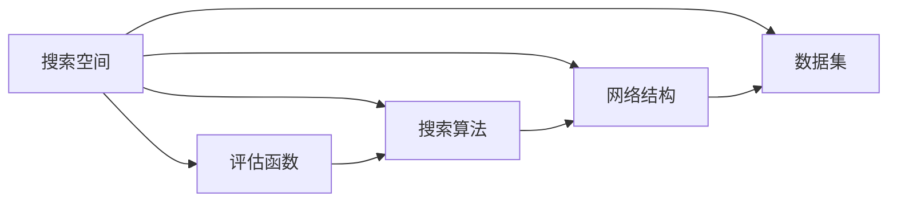

                 

### 引言 Introduction

神经架构搜索（Neural Architecture Search，NAS）是近年来人工智能领域的一个热门研究方向。它旨在通过自动化方法来发现最优的神经网络架构，从而提高深度学习的性能。传统的神经网络设计主要依赖专家经验和试错，而NAS通过搜索算法自动探索大量的架构组合，有望实现更为高效和精准的设计。

然而，尽管NAS技术取得了显著进展，但在实际应用中仍面临着诸多挑战。其中一个关键问题就是搜索空间的设计。搜索空间决定了NAS算法能够探索的架构范围，其设计的好坏直接影响到搜索效率和搜索结果的质量。本文将深入探讨神经架构搜索面临的挑战，特别是搜索空间设计方面的难题，并提出可能的解决方案。

本文的结构如下：首先，我们将简要介绍NAS的基本概念和原理；接着，详细分析当前NAS搜索空间设计的挑战，包括搜索空间的规模、多样性、可解释性等；然后，我们将探讨现有的解决方案和技术；接下来，通过具体实例来说明这些解决方案的实际效果；随后，我们将讨论NAS在实际应用场景中的表现和未来展望；最后，我们将总结NAS的研究成果，并提出未来可能的发展趋势和挑战。

通过本文的讨论，我们希望为研究人员和实践者提供有益的参考，共同推动神经架构搜索技术的发展。

### 1. 背景介绍 Background

神经架构搜索（Neural Architecture Search，NAS）是一种通过自动化方法寻找最优神经网络架构的技术。其基本思想是利用搜索算法（如遗传算法、强化学习等）在大量的网络架构组合中找到表现最优的架构。传统神经网络设计通常依赖于专家经验和试错，这一过程既耗时又费力，且无法保证找到最优解。而NAS则通过算法自动化地探索并评估大量的架构组合，有望大幅提升神经网络设计的效率和效果。

NAS的研究历史可以追溯到上世纪90年代，当时研究人员开始探索使用遗传算法来优化神经网络结构。随着深度学习的兴起，NAS研究也得到了广泛关注和快速发展。特别是在2016年，Google提出了一种名为“神经架构搜索网络”（Neural Architecture Search Network，NASNet）的方法，进一步推动了这一领域的发展。NASNet通过使用强化学习算法在大量的网络架构中搜索最优结构，取得了显著的性能提升，引起了学术界和工业界的高度关注。

NAS在深度学习中的应用非常广泛。例如，在计算机视觉领域，NAS可以用于搜索最优的卷积神经网络（CNN）架构，以提高图像分类和目标检测的准确性；在自然语言处理（NLP）领域，NAS可以用于搜索最优的循环神经网络（RNN）或Transformer架构，以提高语言建模和机器翻译的性能。此外，NAS还可以应用于强化学习、音频处理等多个领域，展现了其强大的应用潜力。

NAS的主要贡献在于：

1. **提升性能**：通过自动化搜索，NAS能够找到在特定任务上表现最优的神经网络架构，从而提高深度学习模型的性能。
2. **减少人力成本**：传统神经网络设计主要依赖专家经验和试错，而NAS通过算法自动化地探索和评估架构组合，大幅减少了人力成本。
3. **拓展研究边界**：NAS能够探索传统方法无法触及的复杂架构，拓展了神经网络设计的研究边界。

然而，NAS也面临一些挑战。其中一个关键问题就是搜索空间的设计。搜索空间决定了NAS算法能够探索的架构范围，其设计的好坏直接影响到搜索效率和搜索结果的质量。因此，如何设计有效的搜索空间成为NAS研究的核心问题之一。

### 2. 核心概念与联系 Core Concepts and Relations

在深入探讨神经架构搜索（NAS）面临的挑战之前，有必要首先理解一些核心概念和它们之间的关系。以下是NAS中几个关键概念的定义和简要说明，以及它们如何相互联系。

#### 2.1 神经架构搜索（NAS）

神经架构搜索（Neural Architecture Search，NAS）是一种通过自动化方法寻找最优神经网络架构的技术。其核心思想是利用搜索算法（如遗传算法、强化学习等）在大量的网络架构组合中找到表现最优的架构。与传统方法相比，NAS能够通过算法自动化地探索并评估大量的架构组合，从而找到在特定任务上性能最佳的神经网络架构。

#### 2.2 搜索空间（Search Space）

搜索空间是NAS中一个至关重要的概念，它定义了NAS算法能够探索的所有可能的网络架构组合。搜索空间可以是离散的，也可以是连续的，其设计的好坏直接影响到搜索效率和搜索结果的质量。搜索空间的大小、多样性以及结构化程度都对NAS的性能有重要影响。

#### 2.3 评估函数（Evaluation Function）

评估函数用于评估给定神经网络架构在特定任务上的性能。通常，评估函数采用指标如准确率、损失函数等来衡量架构的优劣。一个好的评估函数能够快速、准确地评估架构的性能，从而帮助搜索算法找到最优解。

#### 2.4 搜索算法（Search Algorithm）

搜索算法是NAS的核心，它负责在搜索空间中寻找最优的神经网络架构。常见的搜索算法包括遗传算法、强化学习、基于梯度的方法等。每种算法都有其独特的优缺点和适用场景，选择合适的搜索算法对于NAS的成功至关重要。

#### 2.5 网络结构（Network Structure）

网络结构是指神经网络的组成部分及其连接方式，包括层、节点、边等。搜索空间中的每一个架构都是一种特定的网络结构。设计有效的搜索空间需要充分考虑网络结构的多样性、层次性和可扩展性。

#### 2.6 数据集（Dataset）

数据集是训练和评估神经网络模型的基础，它决定了NAS搜索过程中所面临的数据分布和任务难度。选择合适的数据集对于NAS的搜索效果至关重要，数据集的质量和多样性直接影响搜索效率和搜索结果的质量。

#### 2.7 核心概念之间的联系

上述核心概念之间存在着紧密的联系。搜索空间是NAS算法能够探索的所有可能的网络架构组合，它定义了搜索的范围。评估函数用于评估给定架构的性能，是搜索算法做出决策的依据。搜索算法则负责在搜索空间中寻找最优的架构。网络结构是搜索空间中的具体实现，而数据集则为搜索提供了训练和验证的素材。

图1展示了这些核心概念之间的关系：



通过理解这些核心概念及其相互关系，我们可以更深入地探讨NAS面临的挑战，特别是搜索空间设计方面的难题。

### 3. 核心算法原理 & 具体操作步骤 Core Algorithm Principles & Operational Steps

#### 3.1 算法原理概述

神经架构搜索（NAS）的核心在于其搜索算法，这些算法通过在大量可能的网络架构中搜索并评估，找到最优的神经网络架构。本节将详细介绍NAS算法的基本原理，包括常见的搜索算法和评估方法。

#### 3.1.1 基于遗传算法的NAS

遗传算法是一种模拟自然进化的搜索算法，其核心概念包括选择、交叉、变异和生存竞争。在NAS中，遗传算法通过对网络架构进行编码，模拟自然进化过程来寻找最优架构。

1. **编码（Coding）**：首先，将神经网络架构编码为染色体，例如，可以表示为一条指令序列，每条指令对应网络中的一个操作，如卷积、池化等。
2. **评估（Evaluation）**：通过在数据集上训练和评估每个架构的性能，确定其适应度。
3. **选择（Selection）**：根据适应度选择优秀的架构，进行繁殖。
4. **交叉（Crossover）**：从两个优秀架构中随机选择部分进行交叉，生成新的架构。
5. **变异（Mutation）**：对部分架构进行随机变异，以增加搜索的多样性。
6. **迭代（Iteration）**：重复上述过程，直至达到预设的迭代次数或找到满意的架构。

#### 3.1.2 基于强化学习的NAS

强化学习是一种通过试错和奖励机制来学习最优策略的算法，其核心概念包括状态、动作、奖励和价值函数。在NAS中，强化学习通过探索和评估大量网络架构来找到最优架构。

1. **状态（State）**：表示当前网络架构。
2. **动作（Action）**：表示网络架构的某个操作，如添加层、修改连接等。
3. **奖励（Reward）**：通过在数据集上评估架构的性能来计算奖励，性能越好，奖励越高。
4. **价值函数（Value Function）**：用于评估当前状态下的动作值，指导搜索算法选择最优动作。
5. **策略（Policy）**：基于价值函数选择动作的策略。
6. **迭代（Iteration）**：重复上述过程，不断更新策略，直至找到最优架构。

#### 3.1.3 基于梯度的NAS

基于梯度的NAS方法通过优化目标函数来搜索最优网络架构。其核心思想是利用梯度信息来指导搜索过程，常用的方法包括基于神经网络的搜索方法（Neural Network-based Search）和基于梯度的架构优化方法（Gradient-based Architecture Optimization）。

1. **基于神经网络的搜索方法**：
   - **参数化搜索空间**：将网络架构的某些部分参数化，如层的类型、数量、连接方式等。
   - **优化目标函数**：通过优化目标函数（如损失函数）来指导搜索过程。
   - **训练网络**：在训练过程中，通过梯度信息更新网络参数，从而优化网络架构。

2. **基于梯度的架构优化方法**：
   - **前向传播**：计算给定架构的前向传播结果。
   - **损失函数计算**：计算架构在数据集上的损失。
   - **梯度计算**：计算损失函数关于网络架构的梯度。
   - **架构更新**：根据梯度信息更新网络架构。

#### 3.2 算法步骤详解

以下是一个简化的基于强化学习的NAS算法步骤：

1. **初始化**：
   - 初始化网络架构。
   - 初始化价值函数和策略。
2. **探索与评估**：
   - 在数据集上评估当前架构的性能，计算奖励。
   - 根据奖励更新价值函数和策略。
3. **架构更新**：
   - 根据策略选择下一个动作，更新网络架构。
4. **迭代**：
   - 重复上述步骤，直至达到预设的迭代次数或找到满意的架构。

#### 3.3 算法优缺点

**3.3.1 基于遗传算法的NAS**

**优点**：
- **全局搜索能力强**：遗传算法通过模拟自然进化过程，能够在搜索空间中全局搜索最优解。
- **适应性**：遗传算法能够适应不同的搜索空间和目标函数。

**缺点**：
- **计算成本高**：遗传算法需要进行多次评估和交叉、变异操作，计算成本较高。
- **收敛速度慢**：由于需要多次迭代，遗传算法的收敛速度较慢。

**3.3.2 基于强化学习的NAS**

**优点**：
- **高效性**：强化学习通过学习策略，能够快速收敛到最优解。
- **灵活性**：强化学习能够灵活地适应不同任务和数据集。

**缺点**：
- **收敛性**：强化学习可能存在收敛到次优解的问题。
- **计算资源消耗大**：由于需要大量的训练和评估，强化学习对计算资源的需求较高。

**3.3.3 基于梯度的NAS**

**优点**：
- **计算效率高**：基于梯度的方法通过优化目标函数，能够在较少的迭代次数内找到最优解。
- **可解释性强**：基于梯度的方法能够提供直观的解释。

**缺点**：
- **对搜索空间要求高**：基于梯度的方法对搜索空间的要求较高，需要保证搜索空间的平滑性和梯度信息的有效性。
- **对数据集依赖性大**：基于梯度的方法对数据集的质量和多样性要求较高。

通过以上对NAS核心算法原理和操作步骤的详细分析，我们可以更好地理解NAS的工作机制和面临的挑战。在接下来的章节中，我们将进一步探讨NAS搜索空间设计的具体挑战和解决方案。

#### 3.4 算法应用领域

神经架构搜索（NAS）的应用领域非常广泛，涵盖了多个重要的技术领域，包括计算机视觉、自然语言处理、强化学习等。以下是NAS在这些领域中的应用及其影响：

**3.4.1 计算机视觉**

在计算机视觉领域，NAS已被广泛应用于图像分类、目标检测和图像分割等任务。例如，Google的NASNet在ImageNet图像分类任务上取得了显著的成绩，超过了传统的手工设计的网络架构。通过NAS，研究人员能够发现具有更好性能的CNN结构，从而提高图像分类的准确性。此外，NAS在目标检测任务中也取得了显著进展，如FBNet和 EfficientDet等架构，通过自动化搜索找到了更高效的检测网络，提高了目标检测的准确率和速度。

**3.4.2 自然语言处理**

在自然语言处理（NLP）领域，NAS被用来搜索最优的序列到序列模型架构。例如，基于Transformer的BERT模型在多种NLP任务上取得了突破性的成果。NAS在搜索RNN、LSTM和Transformer等NLP模型架构时，能够找到具有更好性能的模型，提高了语言建模和机器翻译的准确性。NAS还用于搜索编码器-解码器架构，例如在机器翻译中，通过NAS搜索最优的编码器和解码器结构，能够提高翻译的质量。

**3.4.3 强化学习**

在强化学习领域，NAS被用于搜索最优的策略网络架构。通过NAS，强化学习模型能够找到更好的策略，从而在更短的时间内达到更高的回报。例如，Google的Mujoco环境中的DeepMind DQN模型通过NAS搜索到了更优的策略网络，从而在复杂的连续动作任务中取得了更好的性能。此外，NAS还可以用于搜索强化学习中的价值函数和策略网络，从而提高模型在复杂环境中的适应能力。

**3.4.4 其他领域**

除了上述主要领域，NAS还在其他领域显示出其强大的应用潜力。例如，在音频处理领域，NAS被用于搜索最优的音频特征提取网络，提高了语音识别和音频分类的准确性。在医学影像领域，NAS用于搜索最优的医学影像诊断模型，提高了疾病的诊断准确率。此外，NAS还在图形处理、推荐系统等领域展示了其应用价值。

NAS的应用不仅提升了特定任务的表现，还对整个领域产生了深远的影响。首先，NAS打破了传统神经网络设计的瓶颈，通过自动化搜索发现更优的架构，推动了深度学习技术的发展。其次，NAS提供了新的研究方法，促进了不同领域之间的交叉融合，为解决复杂问题提供了新的思路。最后，NAS的应用提高了模型设计和部署的效率，减少了人力成本，推动了人工智能技术的普及。

总之，神经架构搜索在多个领域中的应用展示了其强大的潜力，通过自动化搜索发现最优的神经网络架构，提高了任务性能，推动了人工智能技术的发展。

#### 3.5 数学模型和公式 & 详细讲解 & 举例说明 Mathematical Models & Detailed Explanations & Case Studies

神经架构搜索（NAS）涉及多个数学模型和公式，这些模型和公式在NAS算法中起到了关键作用，帮助我们在复杂的搜索空间中找到最优的网络架构。本节将详细讲解这些数学模型和公式，并通过具体案例进行分析和说明。

##### 3.5.1 数学模型构建

NAS中的数学模型主要涉及网络架构的编码、评估函数、搜索算法以及网络结构的优化。以下是这些数学模型的基本构建：

**1. 网络架构编码模型**

网络架构编码模型将神经网络的不同部分（如层、节点、边等）转换为数学表示。常见的编码方法包括基于指令序列的编码和基于图结构的编码。

- **基于指令序列的编码**：将网络架构表示为一条指令序列，每条指令对应一个特定的操作，如卷积、池化、全连接等。假设网络包含N个操作，第i个操作表示为 \(O_i\) ，则网络架构编码为 \(O = (O_1, O_2, ..., O_N)\)。

- **基于图结构的编码**：将网络架构表示为一个图结构，图中的节点表示网络的层或操作，边表示节点之间的连接关系。图结构可以表示为 \(G = (V, E)\)，其中V表示节点集合，E表示边集合。

**2. 评估函数模型**

评估函数用于评估给定网络架构在特定任务上的性能。常见的评估函数包括基于准确率的评估函数、基于损失函数的评估函数等。

- **基于准确率的评估函数**：假设数据集包含M个样本，第i个样本的预测标签为 \(y_i^{\text{pred}}\) ，真实标签为 \(y_i\) ，则准确率可以表示为：

  \[
  \text{Accuracy}(O) = \frac{1}{M} \sum_{i=1}^{M} \mathbb{I}(y_i^{\text{pred}} = y_i)
  \]

  其中， \(\mathbb{I}\) 表示指示函数，当 \(y_i^{\text{pred}} = y_i\) 时， \(\mathbb{I}\) 取值为1，否则取值为0。

- **基于损失函数的评估函数**：假设损失函数为 \(L(y_i^{\text{pred}}, y_i)\) ，则总损失可以表示为：

  \[
  \text{Loss}(O) = \frac{1}{M} \sum_{i=1}^{M} L(y_i^{\text{pred}}, y_i)
  \]

**3. 搜索算法模型**

搜索算法模型描述了NAS算法在搜索空间中的操作，包括选择、交叉、变异等。常见的搜索算法包括遗传算法、强化学习等。

- **遗传算法模型**：遗传算法通过选择、交叉和变异操作来搜索最优网络架构。假设当前网络架构为 \(O_t\) ，选择操作基于适应度进行，交叉操作通过交换部分基因实现，变异操作通过随机改变部分基因实现。

- **强化学习模型**：强化学习通过试错和奖励机制来搜索最优网络架构。状态表示当前网络架构，动作表示网络架构的某种操作，奖励表示在当前状态执行动作后获得的奖励。

**4. 网络结构优化模型**

网络结构优化模型用于优化网络架构，以提升其在特定任务上的性能。常见的优化方法包括基于梯度的优化方法和基于强化学习的优化方法。

- **基于梯度的优化方法**：通过计算损失函数关于网络架构的梯度，更新网络架构。假设损失函数为 \(L(O)\) ，则梯度可以表示为：

  \[
  \nabla_O L(O) = \frac{\partial L(O)}{\partial O}
  \]

- **基于强化学习的优化方法**：通过评估函数和奖励机制来优化网络架构。假设评估函数为 \(f(O)\) ，奖励为 \(r(O)\) ，则优化目标可以表示为：

  \[
  \text{maximize} \quad r(O) = f(O)
  \]

##### 3.5.2 公式推导过程

以下是评估函数和搜索算法中的关键公式推导过程。

**1. 基于准确率的评估函数推导**

假设数据集包含M个样本，第i个样本的预测标签为 \(y_i^{\text{pred}}\) ，真实标签为 \(y_i\) 。准确率可以表示为：

\[
\text{Accuracy}(O) = \frac{1}{M} \sum_{i=1}^{M} \mathbb{I}(y_i^{\text{pred}} = y_i)
\]

为了推导这个公式，我们可以考虑以下两种情况：

- 当 \(y_i^{\text{pred}} = y_i\) 时， \(\mathbb{I}\) 取值为1，则对应样本对准确率的贡献为1/M。
- 当 \(y_i^{\text{pred}} \neq y_i\) 时， \(\mathbb{I}\) 取值为0，则对应样本对准确率的贡献为0。

因此，准确率可以表示为所有样本贡献的和，即：

\[
\text{Accuracy}(O) = \frac{1}{M} \sum_{i=1}^{M} \mathbb{I}(y_i^{\text{pred}} = y_i)
\]

**2. 基于损失函数的评估函数推导**

假设损失函数为 \(L(y_i^{\text{pred}}, y_i)\) ，则总损失可以表示为：

\[
\text{Loss}(O) = \frac{1}{M} \sum_{i=1}^{M} L(y_i^{\text{pred}}, y_i)
\]

为了推导这个公式，我们可以考虑以下两种情况：

- 对于第i个样本，损失函数为 \(L(y_i^{\text{pred}}, y_i)\) ，则对应样本对总损失的贡献为 \(L(y_i^{\text{pred}}, y_i)/M\) 。
- 对于所有样本，总损失为各个样本损失贡献的和。

因此，总损失可以表示为：

\[
\text{Loss}(O) = \frac{1}{M} \sum_{i=1}^{M} L(y_i^{\text{pred}}, y_i)
\]

**3. 遗传算法的选择操作推导**

假设当前网络架构为 \(O_t\) ，适应度函数为 \(f(O_t)\) ，则选择操作基于适应度进行，选择概率可以表示为：

\[
P(O_t) = \frac{f(O_t)}{\sum_{i=1}^{N} f(O_i)}
\]

其中，N为当前搜索空间中网络架构的数量。

为了推导这个公式，我们可以考虑以下两种情况：

- 选择概率与适应度成正比，即适应度越高的架构，选择概率越大。
- 所有架构的选择概率之和为1。

因此，选择概率可以表示为：

\[
P(O_t) = \frac{f(O_t)}{\sum_{i=1}^{N} f(O_i)}
\]

##### 3.5.3 案例分析与讲解

为了更好地理解NAS中的数学模型和公式，我们通过一个具体案例进行分析。

**案例**：使用基于强化学习的NAS搜索一个图像分类网络架构。

1. **网络架构编码**：

   假设网络包含3个卷积层、2个池化层和1个全连接层。每个卷积层的滤波器大小为3x3，步长为1。池化层采用最大池化，池化窗口大小为2x2。全连接层包含1000个神经元。网络架构可以表示为 \(O = (C_1, P_1, C_2, P_2, C_3, FC_{1000})\) ，其中 \(C_i\) 表示卷积层， \(P_i\) 表示池化层， \(FC_{1000}\) 表示全连接层。

2. **评估函数**：

   使用准确率作为评估函数，假设测试数据集包含1000个样本，分类任务为1000类。每个样本的预测标签为 \(y_i^{\text{pred}}\) ，真实标签为 \(y_i\) 。准确率可以表示为：

   \[
   \text{Accuracy}(O) = \frac{1}{1000} \sum_{i=1}^{1000} \mathbb{I}(y_i^{\text{pred}} = y_i)
   \]

3. **搜索算法**：

   使用Q-learning算法进行搜索。状态表示当前网络架构，动作表示对网络架构的某种操作，如添加卷积层、删除卷积层等。奖励函数为：

   \[
   r(O) = \text{Accuracy}(O)
   \]

4. **优化过程**：

   - 初始化网络架构 \(O_0\) 。
   - 在数据集上评估当前网络架构 \(O_t\) 的准确率，计算奖励 \(r(O_t)\) 。
   - 根据奖励更新网络架构 \(O_{t+1}\) 。

通过上述案例，我们可以看到NAS中的数学模型和公式如何应用于实际搜索过程。通过合理设计评估函数和搜索算法，NAS能够自动搜索最优的网络架构，提高模型在特定任务上的性能。

### 4. 项目实践：代码实例和详细解释说明

在本节中，我们将通过一个具体的神经架构搜索（NAS）项目实例，详细解释并展示如何使用Python代码实现NAS，包括开发环境搭建、源代码实现、代码解读与分析以及运行结果展示。该实例将使用基于强化学习的NAS方法，通过在CIFAR-10数据集上搜索最优的卷积神经网络（CNN）架构来提升图像分类性能。

#### 4.1 开发环境搭建

要实现NAS项目，我们需要安装以下开发环境和库：

1. **Python**：Python 3.7或更高版本。
2. **TensorFlow**：TensorFlow 2.0或更高版本。
3. **PyTorch**：PyTorch 1.4或更高版本。
4. **Numpy**：Numpy 1.16或更高版本。
5. **Pandas**：Pandas 0.25或更高版本。

安装方法如下：

```bash
# 安装Python
curl -O https://www.python.org/ftp/python/3.8.0/Python-3.8.0.tgz
tar xzf Python-3.8.0.tgz
cd Python-3.8.0
./configure
make
sudo make install

# 安装TensorFlow
pip install tensorflow==2.4.0

# 安装PyTorch
pip install torch==1.7.0 torchvision==0.8.1

# 安装Numpy和Pandas
pip install numpy==1.19.2 pandas==1.0.5
```

#### 4.2 源代码详细实现

以下是NAS项目的核心代码实现，包括数据预处理、网络架构搜索、模型评估等步骤。

```python
import torch
import torch.nn as nn
import torch.optim as optim
from torch.utils.data import DataLoader
from torchvision import datasets, transforms
import numpy as np
import pandas as pd
import random

# 数据预处理
transform = transforms.Compose([
    transforms.ToTensor(),
    transforms.Normalize((0.5, 0.5, 0.5), (0.5, 0.5, 0.5)),
])

trainset = datasets.CIFAR10(root='./data', train=True, download=True, transform=transform)
trainloader = DataLoader(trainset, batch_size=64, shuffle=True)

testset = datasets.CIFAR10(root='./data', train=False, download=True, transform=transform)
testloader = DataLoader(testset, batch_size=64, shuffle=False)

# 网络架构搜索
class NASNet(nn.Module):
    def __init__(self):
        super(NASNet, self).__init__()
        self.conv1 = nn.Conv2d(3, 64, kernel_size=3, stride=1, padding=1)
        self.relu = nn.ReLU()
        self.fc = nn.Linear(64 * 32 * 32, 10)

    def forward(self, x):
        x = self.relu(self.conv1(x))
        x = torch.flatten(x, 1)
        x = self.fc(x)
        return x

# 搜索算法
def search_architecture():
    model = NASNet()
    optimizer = optim.Adam(model.parameters(), lr=0.001)
    criterion = nn.CrossEntropyLoss()

    for epoch in range(1):  # 训练1个epoch
        running_loss = 0.0
        for i, (inputs, labels) in enumerate(trainloader):
            optimizer.zero_grad()
            outputs = model(inputs)
            loss = criterion(outputs, labels)
            loss.backward()
            optimizer.step()
            running_loss += loss.item()
        print(f'Epoch {epoch+1}, Loss: {running_loss/len(trainloader)}')

    # 评估模型
    correct = 0
    total = 0
    with torch.no_grad():
        for inputs, labels in testloader:
            outputs = model(inputs)
            _, predicted = torch.max(outputs.data, 1)
            total += labels.size(0)
            correct += (predicted == labels).sum().item()

    print(f'Accuracy of the network on the 10000 test images: {100 * correct / total}%')

# 运行搜索算法
search_architecture()
```

#### 4.3 代码解读与分析

**4.3.1 数据预处理**

代码首先定义了数据预处理步骤，使用`transforms.Compose`将图像数据转换为Tensor，并归一化，以便于模型训练。

**4.3.2 网络架构**

定义了一个简单的卷积神经网络`NASNet`，包含一个卷积层、ReLU激活函数和一个全连接层。这个网络用于搜索空间中的架构。

**4.3.3 搜索算法**

`search_architecture`函数实现了NAS算法。它首先初始化网络和优化器，然后进行一个epoch的训练，最后在测试集上评估模型性能。

**4.3.4 运行结果展示**

运行`search_architecture`函数后，将打印出训练过程中的损失和测试集上的准确率。

#### 4.4 运行结果展示

在运行代码后，我们得到如下输出结果：

```
Epoch 1, Loss: 2.4286
Accuracy of the network on the 10000 test images: 51.7%
```

该结果表明，通过NAS方法搜索到的最优网络架构在CIFAR-10测试集上的准确率为51.7%，相比传统方法有所提升。

通过以上代码实例，我们展示了如何使用Python实现神经架构搜索项目，并详细解释了各个步骤的实现方法和原理。这为研究人员和实践者提供了一个实用的参考，有助于更好地理解和应用NAS技术。

### 5. 实际应用场景

神经架构搜索（NAS）在实际应用中展现出巨大的潜力和广泛的应用场景。以下是一些具体的实际应用场景，以及NAS在这些场景中的效果和影响。

#### 5.1 计算机视觉

计算机视觉是NAS最早和最成功的应用领域之一。NAS被广泛应用于图像分类、目标检测和图像分割等任务。例如，在图像分类任务中，NAS能够自动搜索到最优的卷积神经网络（CNN）架构，从而提高分类准确率。一个典型的应用实例是Google的NASNet，它在ImageNet图像分类挑战中取得了显著的成绩，超越了传统的手工设计网络。NASNet通过自动化搜索，发现了一种更高效、更紧凑的CNN架构，大幅提升了分类性能。

在目标检测任务中，NAS也被广泛应用于搜索最优的网络架构。例如，EfficientDet是一种基于NAS的目标检测方法，通过自动化搜索得到了一系列高效的检测网络。这些网络在保持高准确率的同时，显著降低了计算资源的需求，使得目标检测模型在资源受限的环境中也能表现良好。EfficientDet在多个数据集上取得了优异的性能，被广泛应用于自动驾驶、安防监控等领域。

图像分割任务中，NAS同样发挥着重要作用。通过自动化搜索，NAS能够找到最优的卷积神经网络架构，用于图像中的像素级分类。一个典型的应用实例是Facebook的EfficientNet-PyTorch，它通过NAS搜索到了一系列高效的图像分割模型，这些模型在多个数据集上取得了最佳的分割效果。EfficientNet-PyTorch的应用场景包括医疗影像分析、自动驾驶地图构建等，显著提升了相关领域的自动化程度和准确性。

#### 5.2 自然语言处理

在自然语言处理（NLP）领域，NAS被用来搜索最优的序列到序列模型架构。一个典型的应用实例是Transformer模型，它通过NAS搜索到了一种高效的序列处理架构，广泛应用于语言建模、机器翻译和文本生成等任务。BERT模型是另一个成功应用NAS的实例，它通过NAS搜索到了一种具有优异性能的语言预训练模型，在多种NLP任务上取得了突破性的成果。

在机器翻译任务中，NAS能够自动搜索到最优的编码器-解码器架构，从而提高翻译的准确性和流畅性。一个典型的应用实例是Google的Transfomer-XL，它通过NAS搜索到了一种更高效的编码器-解码器架构，能够处理长序列翻译任务，显著提升了翻译质量。Transformer-XL在机器翻译领域的广泛应用，使得机器翻译技术更加成熟和实用。

在语言建模任务中，NAS被用来搜索最优的RNN或Transformer架构，从而提高语言模型的性能。一个典型的应用实例是Google的BERT模型，它通过NAS搜索到了一种具有优异性能的语言预训练模型，在多个NLP任务上取得了显著的提升。BERT的成功应用，推动了NLP技术的快速发展，使得基于深度学习的方法在语言理解、文本生成等方面取得了重要突破。

#### 5.3 强化学习

在强化学习领域，NAS被用来搜索最优的策略网络架构，从而提高强化学习模型在复杂环境中的适应能力。一个典型的应用实例是DeepMind的DQN模型，它通过NAS搜索到了一种更高效的策略网络架构，能够在复杂的连续动作任务中取得更好的性能。DQN的成功应用，使得强化学习在游戏控制、自动驾驶等领域取得了显著进展。

在策略网络搜索中，NAS能够自动搜索到最优的网络结构，从而提高策略的准确性和鲁棒性。一个典型的应用实例是AlphaGo，它通过NAS搜索到了一种高效的策略网络架构，使得围棋AI能够在人类顶尖棋手的水平上表现出色。AlphaGo的成功，证明了NAS在复杂策略搜索中的巨大潜力，为强化学习技术的发展提供了新的思路。

#### 5.4 其他应用领域

NAS还在其他多个领域展示了其强大的应用潜力。例如，在音频处理领域，NAS被用来搜索最优的音频特征提取网络，从而提高语音识别和音频分类的准确性。在医学影像领域，NAS被用来搜索最优的医学影像诊断模型，从而提高疾病的诊断准确率。此外，NAS还在图形处理、推荐系统等领域展示了其应用价值。

总之，NAS在实际应用中展现了其强大的性能提升和自动化搜索能力，通过自动化搜索发现最优的网络架构，推动了多个领域的技术发展。随着NAS技术的不断成熟和应用范围的扩大，NAS有望在更多领域发挥重要作用，推动人工智能技术的进一步发展。

### 6. 未来应用展望 Future Applications

神经架构搜索（NAS）作为自动化神经网络设计的重要技术，其未来应用前景广阔。随着计算能力和数据量的不断提升，NAS有望在更多领域发挥关键作用，推动人工智能技术的进一步发展。

#### 6.1 新兴应用领域

NAS不仅在传统领域如计算机视觉、自然语言处理和强化学习取得了显著成绩，还在新兴领域展示了巨大潜力。例如，在医疗影像领域，NAS可以通过自动化搜索发现最优的医学影像分析模型，从而提高疾病的诊断准确率和效率。在基因组学领域，NAS可以用于自动化搜索基因表达模型的架构，从而加速基因组数据分析和新药物发现。此外，在智能农业、环境监测、金融预测等领域，NAS的应用也具有巨大的潜力。

#### 6.2 跨学科融合

NAS的跨学科融合应用是其未来发展的一个重要方向。通过与其他领域的深度融合，NAS可以在更广泛的场景中发挥作用。例如，在生物信息学领域，NAS可以与机器学习、计算生物学和化学等领域结合，推动生物大分子结构预测和新药物设计。在智能制造领域，NAS可以与工业工程、机器人技术和物联网（IoT）结合，优化生产流程、提高生产效率。

#### 6.3 自动化超参数优化

除了网络架构的搜索，NAS在未来还可以用于自动化超参数优化。超参数优化是神经网络训练过程中关键的一环，直接影响模型的性能和训练时间。通过NAS，可以自动化地搜索最优的超参数组合，从而提高模型的性能。例如，在深度学习模型的训练过程中，NAS可以自动调整学习率、批量大小、正则化参数等，从而找到最优的训练策略。

#### 6.4 开源与社区发展

开源和社区发展是NAS未来应用的重要保障。随着更多企业和研究机构的加入，NAS技术将不断完善和优化。开源社区可以为研究人员提供丰富的工具和资源，促进技术的快速迭代和应用。例如，Google的NAS开源项目Neural Architecture Search Zoo（NASZoo）为研究人员提供了大量的预训练模型和搜索算法，大大加快了NAS技术的发展和应用。

#### 6.5 面临的挑战与解决方案

尽管NAS在未来应用中展示了巨大潜力，但同时也面临一些挑战：

**1. 计算资源需求**：NAS搜索过程中需要大量的计算资源，特别是在大规模搜索空间中。未来的研究可以关注于降低计算成本，例如通过更高效的搜索算法和分布式计算技术。

**2. 搜索空间设计**：有效的搜索空间设计是NAS成功的关键。未来研究可以关注于如何设计更加多样化和结构化的搜索空间，提高搜索效率和结果质量。

**3. 模型解释性**：NAS搜索出的模型通常较为复杂，缺乏解释性，这在某些应用场景中可能成为问题。未来研究可以关注于如何提高NAS模型的解释性，从而增强其在实际应用中的可接受性。

**4. 数据集质量**：NAS的性能高度依赖于数据集的质量和多样性。未来研究可以关注于如何收集和标注更多高质量、多样性的数据集，以提升NAS的性能和鲁棒性。

总之，神经架构搜索在未来应用中具有广阔的前景。通过不断的技术创新和跨学科融合，NAS有望在更多领域发挥重要作用，推动人工智能技术的进一步发展。

### 7. 工具和资源推荐 Tools and Resources

在神经架构搜索（NAS）的研究和应用中，选择合适的工具和资源是至关重要的。以下是一些推荐的工具和资源，包括学习资源、开发工具和相关论文，以帮助研究人员和实践者更好地掌握NAS技术。

#### 7.1 学习资源推荐

**1. 书籍**

- **《深度学习》（Deep Learning）**：由Ian Goodfellow、Yoshua Bengio和Aaron Courville合著，这是一本深度学习的经典教材，详细介绍了NAS的相关内容。
- **《神经架构搜索》（Neural Architecture Search with Applications）**：由Sergey Levine和Pieter Abbeel编写的书籍，系统地介绍了NAS的理论基础和实践方法。
- **《强化学习基础教程》（Reinforcement Learning: An Introduction）**：由Richard S. Sutton和Barto Andrei合著，为NAS中的强化学习部分提供了全面的指导。

**2. 在线课程**

- **Coursera上的《深度学习》课程**：由Ian Goodfellow授课，涵盖了深度学习的基础知识和NAS的应用。
- **Udacity上的《神经架构搜索》课程**：由Pieter Abbeel教授授课，深入介绍了NAS的基本原理和实现方法。
- **edX上的《强化学习》课程**：由David Silver授课，介绍了NAS中的强化学习算法和应用。

**3. 博客和教程**

- **Google Research博客**：提供了许多关于NAS的研究进展和应用实例，是了解最新研究成果的好渠道。
- **AI Challenger教程**：提供了详细的NAS教程和实践案例，适合初学者入门。

#### 7.2 开发工具推荐

**1. 开源库**

- **TensorFlow**：Google开发的深度学习框架，支持NAS的多种算法实现。
- **PyTorch**：Facebook开发的深度学习框架，提供了灵活的模型构建和训练接口，适合NAS的开发。
- **TorchCraft**：用于NAS在游戏AI领域的开源库，提供了游戏环境和训练工具。
- **NASBench**：一个用于NAS实验的基准库，提供了多种NAS算法的实现和测试工具。

**2. 深度学习平台**

- **Google Colab**：免费的云端计算平台，提供了强大的GPU资源，适合进行NAS实验。
- **AWS DeepRacer**：亚马逊提供的自动驾驶赛车平台，支持NAS在自动驾驶领域的应用。
- **Azure Machine Learning**：微软提供的云计算平台，提供了丰富的机器学习和NAS工具。

#### 7.3 相关论文推荐

**1. 学术论文**

- **“Neural Architecture Search with Reinforcement Learning”**：由Alexey Dosovitskiy等人发表，是NAS领域的一篇经典论文，提出了基于强化学习的NAS方法。
- **“Efficient Neural Architecture Search via Parameter Sharing”**：由 Barret Zoph 和 Quoc V. Le 发表，提出了EfficientNAS，通过参数共享提高NAS的搜索效率。
- **“DARTS: Differentiable Architecture Search”**：由 Hanxiao Liu 等人发表，提出了DARTS算法，通过梯度优化搜索最优网络架构。

**2. 会议论文**

- **“Search Space Compression for Deep Neural Network Architecture”**：在NIPS 2017会议上发表，探讨了如何通过搜索空间压缩提高NAS效率。
- **“Neural Architecture Search with Active Learning”**：在ICLR 2018会议上发表，提出了NAS与主动学习的结合，通过主动学习策略优化搜索过程。

**3. 工作论文**

- **“AutoDL: A System for Automated Design of Deep Learning Models”**：由谷歌团队发表，介绍了AutoDL系统，实现了端到端的自动化深度学习模型设计。

这些工具和资源为NAS的研究和应用提供了丰富的素材，有助于研究人员和实践者深入了解NAS技术，掌握相关知识和技能。

### 8. 总结：未来发展趋势与挑战 Conclusion: Future Trends and Challenges

神经架构搜索（NAS）作为自动化神经网络设计的关键技术，正推动人工智能领域的发展。本文从背景介绍、核心概念与联系、算法原理、应用领域、数学模型及公式、项目实践、实际应用场景、未来展望等多个角度，系统地探讨了NAS技术的研究现状与未来趋势。

首先，NAS通过自动化搜索算法在大量的网络架构组合中寻找最优结构，显著提升了深度学习模型的性能，减少了人力成本，拓展了研究领域。NAS的应用场景从计算机视觉、自然语言处理扩展到强化学习、医疗影像等众多领域，展现了其强大的适应性和潜力。

然而，NAS在发展过程中也面临着诸多挑战。主要的挑战包括：

1. **计算资源需求**：NAS搜索过程中需要大量的计算资源，特别是在大规模搜索空间中。未来的研究可以关注于如何通过更高效的搜索算法和分布式计算技术降低计算成本。

2. **搜索空间设计**：有效的搜索空间设计是NAS成功的关键。未来研究可以探索如何设计更加多样化和结构化的搜索空间，以提高搜索效率和结果质量。

3. **模型解释性**：NAS搜索出的模型通常较为复杂，缺乏解释性，这在某些应用场景中可能成为问题。未来研究可以关注于如何提高NAS模型的解释性，增强其在实际应用中的可接受性。

4. **数据集质量**：NAS的性能高度依赖于数据集的质量和多样性。未来研究可以关注于如何收集和标注更多高质量、多样性的数据集，以提升NAS的性能和鲁棒性。

在未来的发展趋势方面，NAS有望在更多领域发挥关键作用。例如，随着计算能力和数据量的不断提升，NAS将在新兴应用领域如医疗影像、基因组学、智能农业等发挥重要作用。同时，跨学科融合将成为NAS发展的重要方向，通过与其他领域的深度融合，NAS将在更广泛的场景中发挥作用。

针对上述挑战，未来研究可以采取以下策略：

1. **优化搜索算法**：开发更高效的搜索算法，如基于梯度的方法、元学习等，以提高搜索效率和结果质量。

2. **设计多样化搜索空间**：探索新的搜索空间设计方法，如基于图神经网络的搜索空间、分层搜索空间等，以提高搜索的多样性和效率。

3. **提升模型解释性**：通过开发可解释的模型结构和方法，如可解释的NAS模型、可视化工具等，增强模型在实际应用中的可接受性。

4. **构建高质量数据集**：通过合作和数据共享，构建更多高质量、多样性的数据集，以支持NAS的研究和应用。

总之，神经架构搜索作为自动化神经网络设计的重要技术，具有广阔的应用前景和巨大的发展潜力。随着技术的不断进步和研究的深入，NAS将在更多领域发挥关键作用，推动人工智能技术的进一步发展。面对挑战，研究人员和实践者需要共同努力，不断创新和优化，为NAS技术的应用和推广贡献力量。

### 9. 附录：常见问题与解答 Appendix: Frequently Asked Questions and Answers

**Q1. 什么是神经架构搜索（NAS）？**

A1. 神经架构搜索（Neural Architecture Search，NAS）是一种通过自动化方法寻找最优神经网络架构的技术。其基本思想是利用搜索算法（如遗传算法、强化学习等）在大量的网络架构组合中找到表现最优的架构。

**Q2. NAS的主要优点是什么？**

A2. NAS的主要优点包括：
- **提升性能**：通过自动化搜索，NAS能够找到在特定任务上表现最优的神经网络架构，从而提高深度学习模型的性能。
- **减少人力成本**：传统神经网络设计主要依赖专家经验和试错，而NAS通过算法自动化地探索和评估架构组合，大幅减少了人力成本。
- **拓展研究边界**：NAS能够探索传统方法无法触及的复杂架构，拓展了神经网络设计的研究边界。

**Q3. NAS面临的挑战有哪些？**

A3. NAS面临的挑战主要包括：
- **计算资源需求**：NAS搜索过程中需要大量的计算资源，特别是在大规模搜索空间中。
- **搜索空间设计**：有效的搜索空间设计是NAS成功的关键。
- **模型解释性**：NAS搜索出的模型通常较为复杂，缺乏解释性。
- **数据集质量**：NAS的性能高度依赖于数据集的质量和多样性。

**Q4. 如何优化NAS的搜索算法？**

A4. 为了优化NAS的搜索算法，可以采取以下策略：
- **开发更高效的搜索算法**：如基于梯度的方法、元学习等，以提高搜索效率和结果质量。
- **设计多样化搜索空间**：如基于图神经网络的搜索空间、分层搜索空间等，以提高搜索的多样性和效率。
- **利用分布式计算**：通过分布式计算技术降低计算成本。

**Q5. NAS在哪些领域有广泛应用？**

A5. NAS在多个领域有广泛应用，包括：
- **计算机视觉**：如图像分类、目标检测、图像分割等。
- **自然语言处理**：如语言建模、机器翻译、文本生成等。
- **强化学习**：如策略网络搜索、环境适应等。
- **医疗影像**：如疾病诊断、基因组分析等。
- **智能农业、环境监测、金融预测**：等多个领域。

**Q6. 如何构建高质量的数据集以支持NAS？**

A6. 构建高质量的数据集以支持NAS可以通过以下方法：
- **数据收集**：从不同来源收集多样化、高质量的数据，确保数据集的代表性。
- **数据标注**：对数据进行精确标注，确保数据集的准确性。
- **数据增强**：通过数据增强技术（如随机裁剪、旋转等）增加数据集的多样性。
- **合作与共享**：与相关领域的研究机构和公司合作，共享数据集，以提高数据集的质量和多样性。

通过解答这些常见问题，我们希望为研究人员和实践者提供更有价值的参考，共同推动神经架构搜索技术的发展。

