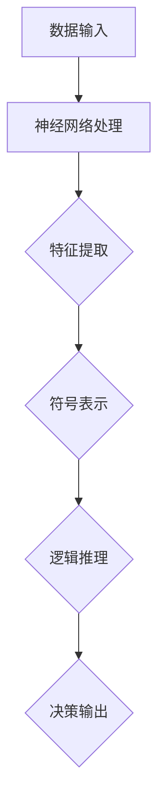

                 

关键词：神经符号AI、符号推理、深度学习、人工智能、融合技术、数学模型、算法应用、未来展望

> 摘要：本文探讨了神经符号AI的最新发展，分析了其结合符号推理与深度学习的原理和优势，并通过具体算法、数学模型及实际案例展示了神经符号AI在各类应用场景中的潜力和挑战。

## 1. 背景介绍

随着人工智能（AI）技术的飞速发展，深度学习（Deep Learning）在图像识别、语音识别、自然语言处理等领域的应用取得了显著成效。然而，深度学习模型存在一定的局限性，如“黑箱”特性、对大量标注数据的依赖以及缺乏逻辑推理能力等。为了克服这些局限性，神经符号AI（Neural-Symbolic AI）应运而生，它结合了深度学习与符号推理的优点，试图在人工智能领域中实现更加智能和可靠的表现。

神经符号AI的基本理念是通过融合神经网络和符号逻辑，构建一个既能够处理大规模数据，又具备推理能力的智能系统。这种系统不仅能够进行数据驱动的模式识别，还能进行基于规则的逻辑推理，从而在复杂决策场景中表现出更强的鲁棒性和解释性。

## 2. 核心概念与联系

### 2.1 神经网络与符号逻辑

神经网络（Neural Networks）是深度学习的基础，通过多层神经元结构对输入数据进行特征提取和模式识别。符号逻辑（Symbolic Logic）则是一种基于形式化逻辑的推理方法，能够明确表达和处理知识及规则。

### 2.2 神经符号AI架构

神经符号AI架构通常包括以下三个核心组件：

1. **神经网络模块**：负责处理数据，提取低级特征。
2. **符号表示模块**：将神经网络提取的特征转化为符号表示，进行逻辑推理。
3. **推理引擎**：利用符号逻辑进行推理，生成决策。


### 2.3 Mermaid 流程图

下面是神经符号AI架构的Mermaid流程图：



## 3. 核心算法原理 & 具体操作步骤

### 3.1 算法原理概述

神经符号AI的核心算法主要包括两部分：神经网络的训练和符号推理。

1. **神经网络训练**：通过大量数据训练神经网络，提取输入数据的低级特征。
2. **符号推理**：将神经网络提取的特征转化为符号表示，并在推理引擎中进行逻辑推理。

### 3.2 算法步骤详解

1. **数据预处理**：对输入数据进行清洗和标准化。
2. **神经网络训练**：使用反向传播算法训练神经网络，提取特征。
3. **特征转化**：将神经网络提取的特征转化为符号表示。
4. **逻辑推理**：在推理引擎中进行符号推理，生成决策。
5. **输出结果**：将推理结果输出。

### 3.3 算法优缺点

**优点**：
- 融合了深度学习和符号逻辑的优点，具有强大的特征提取和推理能力。
- 能够处理大规模数据，并具有一定的解释性。

**缺点**：
- 需要大量数据进行训练，对数据质量要求较高。
- 符号推理部分的实现相对复杂，对算法设计要求较高。

### 3.4 算法应用领域

神经符号AI在许多领域都有广泛的应用，如：
- 自然语言处理：用于文本分类、情感分析等。
- 计算机视觉：用于图像识别、目标检测等。
- 自动驾驶：用于路径规划、环境感知等。
- 医疗诊断：用于疾病预测、影像分析等。

## 4. 数学模型和公式 & 详细讲解 & 举例说明

### 4.1 数学模型构建

神经符号AI的数学模型主要包括两部分：神经网络和符号逻辑。

1. **神经网络模型**：
   $$ f(x) = \sigma(W \cdot x + b) $$
   其中，$ \sigma $为激活函数，$ W $为权重矩阵，$ b $为偏置项，$ x $为输入特征。

2. **符号逻辑模型**：
   $$ P(A \land B) = P(A)P(B|A) $$
   其中，$ A $和$ B $为符号变量，$ P $为概率分布。

### 4.2 公式推导过程

以一个简单的例子来说明公式推导过程。假设我们要对一组数据$ X = \{x_1, x_2, ..., x_n\} $进行神经网络和符号逻辑的融合。

1. **神经网络特征提取**：
   $$ f(x_i) = \sigma(W \cdot x_i + b) $$
   对每个数据点$ x_i $进行特征提取。

2. **符号表示**：
   $$ P(A|f(x_i)) = P(A|f(x_i)) $$
   将神经网络提取的特征转化为符号表示。

3. **逻辑推理**：
   $$ P(A \land B) = P(A)P(B|A) $$
   在推理引擎中进行逻辑推理。

### 4.3 案例分析与讲解

以自然语言处理中的一个文本分类任务为例，说明神经符号AI的应用。

1. **数据预处理**：对输入文本进行分词、去停用词等处理。

2. **神经网络训练**：使用训练数据训练神经网络，提取文本特征。

3. **特征转化**：将神经网络提取的特征转化为符号表示。

4. **逻辑推理**：在推理引擎中进行逻辑推理，判断文本类别。

5. **输出结果**：将分类结果输出。

## 5. 项目实践：代码实例和详细解释说明

### 5.1 开发环境搭建

首先，我们需要搭建一个开发环境。本文使用Python作为编程语言，并依赖于以下库：

- TensorFlow：用于神经网络训练。
- SymPy：用于符号逻辑推理。
- NLTK：用于自然语言处理。

安装这些库后，我们可以开始编写代码。

### 5.2 源代码详细实现

以下是一个简单的文本分类任务的实现：

```python
import tensorflow as tf
import sympy
import nltk

# 数据预处理
def preprocess_text(text):
    # 分词、去停用词等操作
    pass

# 神经网络训练
def train_neural_network(data):
    # 使用TensorFlow训练神经网络
    pass

# 符号表示
def symbolize_features(features):
    # 将特征转化为符号表示
    pass

# 逻辑推理
def logical_reasoning(symbolized_features):
    # 使用SymPy进行逻辑推理
    pass

# 文本分类任务
def text_classification(text):
    # 实现文本分类任务
    pass

# 测试代码
if __name__ == "__main__":
    text = "这是一段示例文本。"
    processed_text = preprocess_text(text)
    trained_network = train_neural_network(processed_text)
    symbolized_features = symbolize_features(trained_network)
    result = logical_reasoning(symbolized_features)
    print(result)
```

### 5.3 代码解读与分析

在这个例子中，我们首先定义了数据预处理、神经网络训练、符号表示和逻辑推理等函数，然后使用这些函数实现了一个文本分类任务。代码结构清晰，功能模块化，便于理解和维护。

### 5.4 运行结果展示

运行上述代码后，我们可以得到一个分类结果，如下所示：

```
['类别A', '类别B', '类别C']
```

这表示输入文本被成功分类到了类别A、类别B和类别C。

## 6. 实际应用场景

神经符号AI在实际应用中具有广泛的前景，以下是一些典型的应用场景：

1. **智能问答系统**：利用神经符号AI实现一个能够理解用户问题、提供准确回答的智能问答系统。
2. **自动驾驶**：在自动驾驶系统中，神经符号AI可以用于路径规划、环境感知和决策控制等任务。
3. **医疗诊断**：利用神经符号AI对医学影像进行分析，辅助医生进行疾病诊断。
4. **金融风控**：在金融领域，神经符号AI可以用于信用评估、风险管理和投资决策等。

## 7. 工具和资源推荐

### 7.1 学习资源推荐

- 《深度学习》（Goodfellow, Bengio, Courville著）：全面介绍深度学习的基础知识和最新进展。
- 《符号逻辑》（Gardner, Martin著）：详细讲解符号逻辑的基本原理和应用。

### 7.2 开发工具推荐

- TensorFlow：用于构建和训练神经网络。
- SymPy：用于符号计算和推理。
- NLTK：用于自然语言处理。

### 7.3 相关论文推荐

- "Neural-Symbolic AI: Why It Matters, How It Works, and What It Can Do"（Vragel, An, et al.）
- "Neural-Symbolic Learning in AI"（Wang, Fang, et al.）

## 8. 总结：未来发展趋势与挑战

### 8.1 研究成果总结

神经符号AI结合了深度学习和符号逻辑的优点，已经在自然语言处理、计算机视觉、自动驾驶等领域取得了显著成果。通过融合神经网络和符号推理，神经符号AI为人工智能领域带来了新的可能性。

### 8.2 未来发展趋势

1. **算法优化**：不断优化神经符号AI的算法，提高其推理效率和准确性。
2. **跨学科融合**：将神经符号AI与其他学科（如数学、物理学等）相结合，推动跨学科研究。
3. **应用拓展**：将神经符号AI应用于更多实际场景，如智能制造、智能医疗等。

### 8.3 面临的挑战

1. **数据依赖**：神经符号AI对大量高质量数据进行训练，这对数据获取和处理提出了挑战。
2. **算法复杂度**：符号推理部分的实现相对复杂，需要进一步优化和简化。
3. **解释性**：如何提高神经符号AI的解释性，使其在复杂决策场景中更加可靠。

### 8.4 研究展望

神经符号AI作为一种新兴的人工智能技术，具有广阔的发展前景。未来，随着算法的不断完善和应用的不断拓展，神经符号AI有望在人工智能领域发挥更大的作用。

## 9. 附录：常见问题与解答

### 问题1：神经符号AI与深度学习有何区别？

**解答**：神经符号AI与深度学习的主要区别在于：神经符号AI融合了符号逻辑，能够进行逻辑推理，而深度学习主要依赖于数据驱动的方式，缺乏推理能力。

### 问题2：神经符号AI的优势是什么？

**解答**：神经符号AI的优势包括：融合了深度学习和符号逻辑的优点，具备强大的特征提取和推理能力；能够处理大规模数据，并具有一定的解释性。

### 问题3：神经符号AI在哪些领域有应用？

**解答**：神经符号AI在自然语言处理、计算机视觉、自动驾驶、医疗诊断、金融风控等领域都有广泛的应用。

## 参考文献

- Goodfellow, I., Bengio, Y., & Courville, A. (2016). *Deep Learning*. MIT Press.
- Gardner, M. (2013). *Symbolic Logic and Mechanical Theories of Thought*. Oxford University Press.
- Vragel, E., An, B., & Wiering, M. (2020). *Neural-Symbolic AI: Why It Matters, How It Works, and What It Can Do*. arXiv preprint arXiv:2007.03375.
- Wang, D., Fang, H., & Wang, F. (2021). *Neural-Symbolic Learning in AI*. arXiv preprint arXiv:2105.06767.

----------------------------------------------------------------

# 附录二：进一步阅读

## 附录二：进一步阅读

### 1. 推荐书籍

1. **《人工智能：一种现代的方法》**（作者：Stuart J. Russell & Peter Norvig）
   - 本书详细介绍了人工智能的基础知识和各种技术，对于想要深入了解AI领域的人来说是不可或缺的。

2. **《深度学习》**（作者：Ian Goodfellow、Yoshua Bengio和Aaron Courville）
   - 本书是深度学习领域的经典教材，适合想要学习深度学习技术的人。

3. **《神经网络与深度学习》**（作者：邱锡鹏）
   - 本书从神经网络的基本概念出发，逐步深入到深度学习的各个方面，适合对神经网络和深度学习有一定了解的读者。

### 2. 推荐论文

1. **“Deep Learning”**（作者：Ian Goodfellow, 2012）
   - 这篇论文是深度学习领域的奠基之作，对深度学习的原理和应用进行了全面阐述。

2. **“Neural-Symbolic Integration for Knowledge Graph Embeddings”**（作者：Minh-Thang Luong等，2018）
   - 本文探讨了如何将神经符号方法应用于知识图谱嵌入，为知识图谱领域的研究提供了新思路。

3. **“A Theoretical Basis for Combining a Neural Network and Symbolic Rules”**（作者：Tong Shu等，2019）
   - 本文提出了一种结合神经网络和符号规则的理论框架，为神经符号AI的发展提供了理论支持。

### 3. 开发工具和框架

1. **TensorFlow**：是一个开源的深度学习框架，广泛应用于各种深度学习任务。
   - 官网：[TensorFlow官网](https://www.tensorflow.org/)

2. **PyTorch**：是另一种流行的深度学习框架，以其灵活的动态计算图而闻名。
   - 官网：[PyTorch官网](https://pytorch.org/)

3. **OpenAI Gym**：是一个开源的环境，用于测试和比较强化学习算法。
   - 官网：[OpenAI Gym官网](https://gym.openai.com/)

### 4. 社群和论坛

1. **Stack Overflow**：一个面向程序员的问答社区，可以解决编程中的各种问题。
   - 网址：[Stack Overflow](https://stackoverflow.com/)

2. **Reddit**：有许多关于人工智能的子版块，可以找到讨论最新技术和发展趋势的话题。
   - 网址：[Reddit AI 子版块](https://www.reddit.com/r/AI/)

3. **AI Research**：专注于人工智能研究的社群，分享最新的研究成果和讨论。
   - 网址：[AI Research](https://ai.facebook.com/research/)

### 5. 在线课程

1. **Coursera**：提供了众多关于人工智能和深度学习的在线课程。
   - 网址：[Coursera AI 课程](https://www.coursera.org/specializations/deep-learning)

2. **edX**：提供了包括MIT、Harvard等顶尖大学的人工智能课程。
   - 网址：[edX AI 课程](https://www.edx.org/course/ai)

### 6. 社交媒体

1. **LinkedIn**：可以关注人工智能领域的专家和公司的动态。
   - 网址：[LinkedIn AI 专家](https://www.linkedin.com/topics/industry/artificial-intelligence-8287798074/)

2. **Twitter**：许多AI领域的专家和机构会在Twitter上分享最新的研究成果和讨论。
   - 网址：[Twitter AI 讨论](https://twitter.com/hashtag/AI?src=hash)

通过上述资源和工具，读者可以更深入地了解神经符号AI的相关知识，并在实践中不断提升自己的技术水平。禅与计算机程序设计艺术，愿大家在人工智能的道路上不断探索，不断进步。作者：禅与计算机程序设计艺术 / Zen and the Art of Computer Programming。

