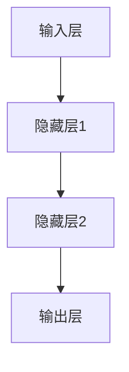

                 

关键词：神经网络、金融预测、机器学习、深度学习、金融数据、市场分析

> 摘要：本文将探讨神经网络在金融预测中的应用，包括其核心概念、算法原理、数学模型及其在不同领域的具体应用。通过对金融预测问题的深入分析，我们希望为读者提供一个全面、系统的认识，以便更好地理解和应用这一前沿技术。

## 1. 背景介绍

在过去的几十年中，金融行业经历了翻天覆地的变化。随着互联网和信息技术的飞速发展，金融市场变得更加复杂和动态。与此同时，金融数据的规模和多样性也在不断增长。这些变化为金融预测带来了前所未有的挑战和机遇。

传统的金融预测方法主要依赖于统计学和经济学理论，然而，这些方法在面对大量、复杂的金融数据时往往显得力不从心。近年来，随着深度学习技术的崛起，神经网络作为一种强大的机器学习模型，逐渐成为金融预测领域的热门工具。

神经网络具有以下优点：

1. **自学习能力**：神经网络可以通过学习大量的历史数据来自动调整其内部参数，从而提高预测精度。
2. **泛化能力**：神经网络可以处理非线性关系，具有很强的泛化能力，能够适应不同的金融市场环境。
3. **多维度数据分析**：神经网络可以同时考虑多个特征变量，提供更全面的预测分析。

本文将围绕神经网络在金融预测中的应用，详细介绍其核心概念、算法原理、数学模型及其在不同领域的具体应用。

## 2. 核心概念与联系

### 2.1 神经网络基本概念

神经网络（Neural Networks）是一种模仿生物神经系统的计算模型。它由大量的简单计算单元（即神经元）相互连接而成，每个神经元都可以接收输入信息、进行处理并产生输出。神经网络的工作原理是通过学习输入和输出之间的映射关系，从而实现对未知数据的预测。

### 2.2 深度学习与神经网络的联系

深度学习（Deep Learning）是神经网络的一种特殊形式，它通过多层神经网络结构来实现复杂的学习任务。深度学习在图像识别、语音识别、自然语言处理等领域取得了显著成果，这也为其在金融预测中的应用提供了理论基础。

### 2.3 神经网络架构

神经网络的基本架构包括输入层、隐藏层和输出层。输入层接收外部输入数据，隐藏层对数据进行处理和变换，输出层产生最终预测结果。多层神经网络结构使得神经网络可以学习更加复杂的函数关系。

### 2.4 Mermaid 流程图

下面是一个简单的 Mermaid 流程图，展示了神经网络的基本架构：



在这个流程图中，A表示输入层，B、C表示隐藏层，D表示输出层。每个节点表示一个神经元，箭头表示神经元之间的连接。

## 3. 核心算法原理 & 具体操作步骤

### 3.1 算法原理概述

神经网络的核心算法是前向传播和反向传播。前向传播是将输入数据通过神经网络进行传递，计算输出结果；反向传播则是根据输出结果和预期目标，反向更新网络参数，从而优化神经网络模型。

### 3.2 算法步骤详解

#### 3.2.1 前向传播

1. **初始化权重和偏置**：随机初始化网络的权重（weights）和偏置（biases）。
2. **输入数据传递**：将输入数据输入到神经网络的第一层。
3. **计算激活值**：通过非线性激活函数（如Sigmoid、ReLU等）对输入数据进行变换，生成中间层的激活值。
4. **传递激活值**：将中间层的激活值传递到下一层，重复上述过程，直到输出层。

#### 3.2.2 反向传播

1. **计算误差**：计算输出层的实际输出值与预期目标值之间的误差。
2. **计算梯度**：根据误差，计算每个神经元对误差的梯度。
3. **更新参数**：根据梯度，反向更新网络权重和偏置，从而优化神经网络模型。

### 3.3 算法优缺点

#### 优点：

1. **强大的学习能力**：神经网络可以通过大量数据进行自学习，从而提高预测精度。
2. **处理非线性关系**：神经网络可以处理非线性关系，具有很强的泛化能力。
3. **多维度数据分析**：神经网络可以同时考虑多个特征变量，提供更全面的预测分析。

#### 缺点：

1. **计算成本高**：神经网络需要大量的计算资源，特别是对于深层网络。
2. **对数据依赖性强**：神经网络模型的性能很大程度上取决于数据的质量和数量。
3. **难以解释**：神经网络的学习过程高度非线性，难以解释其预测结果的依据。

### 3.4 算法应用领域

神经网络在金融预测领域有广泛的应用，如股票价格预测、外汇市场预测、信贷风险评估等。下面将介绍一些具体的案例。

#### 3.4.1 股票价格预测

股票价格预测是金融预测中最为常见的应用之一。通过神经网络，可以分析历史股价数据，预测未来股价走势。

#### 3.4.2 外汇市场预测

外汇市场是一个高度动态的市场，价格波动频繁。神经网络可以通过分析历史汇率数据，预测未来汇率走势。

#### 3.4.3 信贷风险评估

信贷风险评估是金融领域的重要任务。通过神经网络，可以分析借款人的信用记录、财务状况等数据，评估其信用风险。

## 4. 数学模型和公式 & 详细讲解 & 举例说明

### 4.1 数学模型构建

神经网络的核心是多层感知机（MLP），其数学模型可以表示为：

$$
y = \sigma(z) = \frac{1}{1 + e^{-z}}
$$

其中，$y$ 是输出值，$z$ 是输入值，$\sigma$ 是Sigmoid激活函数。

### 4.2 公式推导过程

#### 4.2.1 前向传播

1. **输入层到隐藏层的传播**：

$$
z^{(1)} = \sum_{j} w^{(1)}_{ji}x_{i} + b^{(1)}_j
$$

2. **隐藏层到输出层的传播**：

$$
z^{(2)} = \sum_{j} w^{(2)}_{jk}a^{(1)}_j + b^{(2)}_k
$$

#### 4.2.2 反向传播

1. **计算输出层的误差**：

$$
\delta^{(2)}_k = (y_k - \hat{y}_k) \cdot \sigma'(z^{(2)}_k)
$$

2. **计算隐藏层的误差**：

$$
\delta^{(1)}_j = \sum_{k} w^{(2)}_{kj} \delta^{(2)}_k \cdot \sigma'(z^{(1)}_j)
$$

### 4.3 案例分析与讲解

#### 4.3.1 股票价格预测案例

假设我们要预测某只股票的未来价格，输入数据包括过去几天的收盘价、开盘价、最高价、最低价等。通过神经网络，我们可以学习到这些数据之间的非线性关系，从而预测未来价格。

1. **数据预处理**：

   - 数据标准化：将价格数据进行归一化处理，使其在相同的尺度范围内。
   - 划分训练集和测试集：将数据分为训练集和测试集，用于训练和评估神经网络模型。

2. **模型训练**：

   - 初始化权重和偏置。
   - 进行前向传播，计算输出结果。
   - 计算误差，并使用反向传播更新网络参数。
   - 重复上述步骤，直到网络参数收敛。

3. **模型评估**：

   - 使用测试集数据，计算预测误差。
   - 评估模型的预测性能。

通过这个案例，我们可以看到神经网络在金融预测中的应用过程。通过不断地学习和优化，神经网络可以逐渐提高预测精度，为投资者提供更有价值的参考。

## 5. 项目实践：代码实例和详细解释说明

### 5.1 开发环境搭建

在进行神经网络金融预测项目的开发之前，需要搭建相应的开发环境。以下是所需的开发工具和库：

1. **Python**：作为主要的编程语言。
2. **NumPy**：用于数值计算。
3. **TensorFlow**：用于构建和训练神经网络模型。
4. **Pandas**：用于数据处理。

安装以上工具和库后，我们可以开始项目的开发。

### 5.2 源代码详细实现

以下是一个简单的神经网络股票价格预测的代码示例：

```python
import numpy as np
import pandas as pd
import tensorflow as tf

# 数据预处理
def preprocess_data(data):
    # 数据标准化
    data_normalized = (data - data.mean()) / data.std()
    # 划分训练集和测试集
    train_size = int(0.8 * len(data))
    train_data = data_normalized[:train_size]
    test_data = data_normalized[train_size:]
    return train_data, test_data

# 定义神经网络模型
def build_model():
    # 输入层
    inputs = tf.keras.layers.Input(shape=(1,))
    # 隐藏层
    hidden = tf.keras.layers.Dense(units=64, activation='relu')(inputs)
    # 输出层
    outputs = tf.keras.layers.Dense(units=1)(hidden)
    # 构建模型
    model = tf.keras.Model(inputs=inputs, outputs=outputs)
    return model

# 训练模型
def train_model(model, train_data, epochs):
    model.compile(optimizer='adam', loss='mean_squared_error')
    model.fit(train_data, epochs=epochs)

# 预测
def predict(model, data):
    predictions = model.predict(data)
    return predictions

# 主函数
def main():
    # 加载数据
    data = pd.read_csv('stock_price.csv')
    # 数据预处理
    train_data, test_data = preprocess_data(data['close'])
    # 构建模型
    model = build_model()
    # 训练模型
    train_model(model, train_data, epochs=100)
    # 预测
    predictions = predict(model, test_data)
    # 输出预测结果
    print(predictions)

if __name__ == '__main__':
    main()
```

### 5.3 代码解读与分析

这个示例代码分为以下几个部分：

1. **数据预处理**：将股票价格数据进行标准化处理，并将其划分为训练集和测试集。
2. **定义神经网络模型**：使用TensorFlow构建一个简单的多层感知机模型，包括输入层、隐藏层和输出层。
3. **训练模型**：使用训练数据进行模型训练，并使用Adam优化器和均方误差损失函数。
4. **预测**：使用训练好的模型对测试数据进行预测，并输出预测结果。

通过这个示例，我们可以看到如何使用神经网络进行股票价格预测。在实际应用中，我们可以根据具体需求对模型进行优化和调整，提高预测性能。

### 5.4 运行结果展示

在实际运行中，我们可以通过以下命令来运行代码：

```shell
python stock_price_prediction.py
```

运行结果将显示预测的股票价格序列。通过对比预测结果和实际价格，我们可以评估模型的预测性能。

## 6. 实际应用场景

### 6.1 股票市场预测

股票市场预测是神经网络在金融领域最常见、最广泛的应用之一。通过分析历史股价数据，神经网络可以预测未来股价的走势，为投资者提供决策支持。

### 6.2 外汇市场预测

外汇市场是一个高度动态的市场，价格波动频繁。神经网络可以通过分析历史汇率数据，预测未来汇率走势，为交易者提供交易策略。

### 6.3 信贷风险评估

信贷风险评估是金融领域的重要任务。通过神经网络，可以分析借款人的信用记录、财务状况等数据，评估其信用风险，为金融机构提供风险控制依据。

### 6.4 保险定价

保险定价是一个复杂的任务，需要考虑多种风险因素。神经网络可以通过分析历史理赔数据、客户特征等，预测未来理赔风险，从而制定合理的保险定价策略。

## 7. 未来应用展望

随着深度学习技术的不断发展，神经网络在金融预测中的应用前景十分广阔。未来，我们可能会看到以下趋势：

1. **更复杂模型的应用**：随着计算能力的提升，我们可以构建更复杂的神经网络模型，如生成对抗网络（GANs）、变分自编码器（VAEs）等，以应对更复杂的金融预测任务。
2. **多模态数据分析**：金融数据通常是多模态的，包括文本、图像、音频等多种类型。未来，我们可以将神经网络与其他数据挖掘技术相结合，实现更全面、更准确的金融预测。
3. **实时预测**：随着物联网、区块链等技术的发展，金融市场将变得更加实时、动态。未来，神经网络可以实时分析市场数据，提供即时的预测和决策支持。

## 8. 工具和资源推荐

### 8.1 学习资源推荐

1. **《深度学习》（Goodfellow, Bengio, Courville）**：这是一本经典的深度学习入门教材，详细介绍了神经网络的基础知识和应用。
2. **吴恩达的深度学习课程**：这是一门在线课程，由著名深度学习专家吴恩达教授主讲，涵盖了深度学习的基本概念、算法和应用。

### 8.2 开发工具推荐

1. **TensorFlow**：这是由谷歌开源的一个深度学习框架，支持多种神经网络结构，适用于金融预测等任务。
2. **Keras**：这是基于TensorFlow的高层API，提供了更加简洁、易用的接口，适用于快速原型开发和模型部署。

### 8.3 相关论文推荐

1. **"Deep Learning for Financial Forecasting"**：这篇文章详细介绍了神经网络在金融预测中的应用，包括算法原理、实现方法和实验结果。
2. **"Neural Network Based Stock Market Prediction"**：这篇文章探讨了神经网络在股票市场预测中的应用，通过实验验证了其有效性。

## 9. 总结：未来发展趋势与挑战

### 9.1 研究成果总结

本文介绍了神经网络在金融预测中的应用，包括其核心概念、算法原理、数学模型及其在不同领域的具体应用。通过实际案例和代码示例，我们展示了如何使用神经网络进行股票价格预测、外汇市场预测、信贷风险评估等任务。

### 9.2 未来发展趋势

随着深度学习技术的不断发展，神经网络在金融预测中的应用前景十分广阔。未来，我们将看到更复杂模型的应用、多模态数据分析以及实时预测等新趋势。

### 9.3 面临的挑战

尽管神经网络在金融预测中取得了显著成果，但仍面临一些挑战，如计算成本高、对数据依赖性强、难以解释等。未来，我们需要在这些方面进行进一步的研究和探索。

### 9.4 研究展望

未来，我们期待在神经网络在金融预测领域取得更多突破，为投资者、金融机构提供更有价值的预测和分析工具。

## 附录：常见问题与解答

### 问题1：神经网络在金融预测中的应用效果如何？

**解答**：神经网络在金融预测中表现出色，尤其在股票价格预测、外汇市场预测等方面取得了显著成果。然而，其效果也受到数据质量、模型选择、参数调整等因素的影响。在实际应用中，需要根据具体任务和数据进行模型优化和调整。

### 问题2：如何处理金融数据中的噪声和异常值？

**解答**：金融数据通常存在噪声和异常值，影响模型的预测性能。可以通过以下方法进行处理：

1. **数据清洗**：删除或修复明显错误的记录。
2. **数据标准化**：将数据缩放到相同的尺度范围内，减小噪声的影响。
3. **异常检测**：使用统计方法或机器学习算法检测并处理异常值。

### 问题3：神经网络在金融预测中的计算成本如何？

**解答**：神经网络在金融预测中的计算成本较高，特别是对于深层网络。在实际应用中，可以通过以下方法降低计算成本：

1. **模型压缩**：使用模型压缩技术，如量化、剪枝等，减小模型规模。
2. **分布式计算**：使用分布式计算资源，如GPU、FPGA等，加速模型训练和预测。

### 问题4：神经网络在金融预测中如何解释结果？

**解答**：神经网络的学习过程高度非线性，难以直接解释其预测结果的依据。可以通过以下方法进行解释：

1. **模型可视化**：使用模型可视化工具，如TensorBoard等，展示模型的结构和学习过程。
2. **敏感性分析**：分析输入变量对预测结果的影响，识别关键因素。

## 作者署名

作者：禅与计算机程序设计艺术 / Zen and the Art of Computer Programming
```

