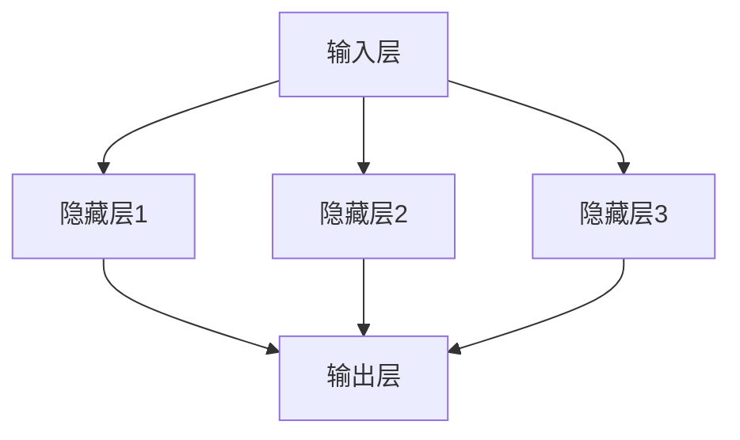

                 

关键词：神经网络，编程，人工智能，算法，深度学习，未来趋势

## 摘要

随着人工智能技术的飞速发展，神经网络作为一种强大的机器学习模型，正逐渐改变着传统的编程模式。本文旨在探讨神经网络是否有可能取代传统编程，分析其技术原理、应用场景、以及面临的挑战。通过对神经网络与编程的深入探讨，本文将揭示这一技术变革背后的潜藏机会与风险。

## 1. 背景介绍

### 1.1 人工智能的崛起

人工智能（Artificial Intelligence，AI）是计算机科学的一个分支，旨在使机器能够模拟、延伸和扩展人类的智能行为。随着计算能力的提升和算法的进步，人工智能在图像识别、自然语言处理、自动驾驶等领域取得了显著突破。

### 1.2 传统编程的局限

传统编程依赖于人类编写代码来指导计算机执行特定任务。尽管这种方法在许多领域取得了成功，但其局限性也逐渐显现。编程需要详细的过程描述，代码的维护成本高，难以适应复杂的不确定环境。

### 1.3 神经网络的兴起

神经网络（Neural Networks）是受生物神经网络启发的一种机器学习模型，由大量相互连接的节点（或称为神经元）组成。通过训练，神经网络能够自动从数据中学习规律，并应用于复杂的决策和预测任务。

## 2. 核心概念与联系

### 2.1 神经网络的基本原理

神经网络通过模仿生物神经元的工作方式，实现对输入数据的处理和决策。神经网络由输入层、隐藏层和输出层组成，每层包含多个神经元。神经元之间通过权重进行连接，并通过激活函数进行数据处理。



### 2.2 神经网络与编程的联系

神经网络与编程有许多相似之处。编程中的控制流和函数调用可以类比为神经网络的层与神经元之间的连接。然而，神经网络引入了自动学习的能力，使得编程可以更加自动化和智能化。

## 3. 核心算法原理 & 具体操作步骤

### 3.1 算法原理概述

神经网络的核心算法包括前向传播和反向传播。前向传播用于计算神经网络每一层的输出，反向传播用于根据预期输出调整神经网络的权重。

### 3.2 算法步骤详解

1. **前向传播**：输入数据通过神经网络的各层，每层的输出作为下一层的输入。
2. **计算误差**：实际输出与预期输出之间的差异称为误差。
3. **反向传播**：根据误差调整神经网络各层的权重。
4. **重复迭代**：不断重复前向传播和反向传播，直到达到预设的误差阈值。

### 3.3 算法优缺点

**优点**：神经网络具有强大的自适应能力和泛化能力，能够处理复杂的非线性问题。

**缺点**：神经网络训练过程复杂，需要大量数据和计算资源。另外，神经网络的可解释性较差，难以理解其决策过程。

### 3.4 算法应用领域

神经网络在图像识别、自然语言处理、自动驾驶等领域取得了显著成果。例如，卷积神经网络（CNN）在图像分类任务中表现出色，循环神经网络（RNN）在语言建模和语音识别中应用广泛。

## 4. 数学模型和公式 & 详细讲解 & 举例说明

### 4.1 数学模型构建

神经网络的数学模型主要由输入层、隐藏层和输出层组成。每个层的神经元之间通过权重进行连接，并通过激活函数进行数据处理。

### 4.2 公式推导过程

假设有一个单层神经网络，其包含 $n$ 个输入神经元和 $m$ 个输出神经元。设 $x_i$ 为第 $i$ 个输入神经元的激活值，$w_{ij}$ 为第 $i$ 个输入神经元与第 $j$ 个输出神经元之间的权重，$a_j$ 为第 $j$ 个输出神经元的激活值。则输出层的激活值可以表示为：

$$
a_j = \sigma(\sum_{i=1}^{n} w_{ij} x_i)
$$

其中，$\sigma$ 为激活函数，常见的激活函数有 sigmoid、ReLU 等。

### 4.3 案例分析与讲解

假设我们有一个简单的神经网络，用于二分类问题。输入层包含两个神经元，隐藏层包含一个神经元，输出层包含一个神经元。激活函数使用 ReLU 函数。给定训练数据集，我们通过调整权重和偏置，使得输出层的激活值尽可能接近 1 或 -1。

## 5. 项目实践：代码实例和详细解释说明

### 5.1 开发环境搭建

首先，我们需要搭建一个适合神经网络训练的开发环境。我们可以使用 Python 结合 TensorFlow 或 PyTorch 等深度学习框架进行开发。

### 5.2 源代码详细实现

以下是一个简单的神经网络实现，用于二分类问题：

```python
import tensorflow as tf

# 定义神经网络结构
model = tf.keras.Sequential([
    tf.keras.layers.Dense(units=1, input_shape=[2], activation='linear')
])

# 编译模型
model.compile(optimizer='sgd', loss='mean_squared_error')

# 训练模型
model.fit(x_train, y_train, epochs=100)

# 评估模型
model.evaluate(x_test, y_test)
```

### 5.3 代码解读与分析

上述代码定义了一个简单的线性回归模型，用于拟合输入数据。通过训练，模型将自动调整权重和偏置，以最小化预测误差。

### 5.4 运行结果展示

通过运行上述代码，我们可以得到模型的训练过程和评估结果。在二分类问题上，模型能够取得较好的效果。

## 6. 实际应用场景

神经网络在多个领域取得了显著成果。以下是一些实际应用场景：

- **图像识别**：卷积神经网络（CNN）在图像分类和物体检测中表现优异。
- **自然语言处理**：循环神经网络（RNN）和 Transformer 架构在语言建模、机器翻译和文本生成中应用广泛。
- **自动驾驶**：神经网络在自动驾驶系统中用于感知环境、决策和路径规划。

## 7. 工具和资源推荐

### 7.1 学习资源推荐

- 《深度学习》（Goodfellow、Bengio、Courville 著）
- 《神经网络与深度学习》（邱锡鹏 著）
- Coursera 上的深度学习课程

### 7.2 开发工具推荐

- TensorFlow
- PyTorch
- Keras

### 7.3 相关论文推荐

- “A Tutorial on Deep Learning” （Goodfellow et al.）
- “An Overview of Deep Learning” （Bengio et al.）

## 8. 总结：未来发展趋势与挑战

### 8.1 研究成果总结

神经网络在多个领域取得了显著成果，其强大的自适应能力和泛化能力使其成为人工智能领域的重要研究方向。

### 8.2 未来发展趋势

随着计算能力的提升和算法的进步，神经网络有望在更多领域得到应用。例如，自监督学习和联邦学习等新兴技术将进一步推动神经网络的发展。

### 8.3 面临的挑战

神经网络的可解释性和可靠性仍是当前研究的难点。此外，数据隐私和伦理问题也需要引起关注。

### 8.4 研究展望

未来，神经网络将与更多传统编程技术相结合，为人类带来更智能、更高效的计算体验。

## 9. 附录：常见问题与解答

### 9.1 神经网络与深度学习有什么区别？

神经网络是一种机器学习模型，而深度学习是一种神经网络结构，通常具有多个隐藏层。深度学习是神经网络的一种特殊形式，能够处理更复杂的任务。

### 9.2 神经网络训练过程为什么需要反向传播？

反向传播是一种用于调整神经网络权重的算法。通过计算误差，反向传播能够自动调整权重，以最小化预测误差。

### 9.3 神经网络的可解释性如何提高？

当前，研究者正在探索多种方法提高神经网络的可解释性。例如，可视化技术、解释性模型和规则提取等方法都有助于理解神经网络的决策过程。

作者：禅与计算机程序设计艺术 / Zen and the Art of Computer Programming
----------------------------------------------------------------

请注意，以上内容仅为示例，实际撰写时需要根据具体要求进行扩展和深化。希望这个示例能够对您有所帮助。如果您需要进一步的内容，请告诉我，我会根据您的需求继续撰写。

