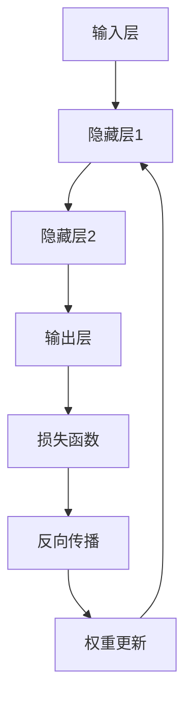

                 

关键词：神经网络、深度学习、人工智能、机器学习、计算机算法、技术发展

## 摘要

本文将深入探讨神经网络这一革命性技术，其从最初的简单模型发展到如今在人工智能领域占据主导地位，经历了怎样的历程。我们将详细解析神经网络的原理、核心算法、数学模型，并通过实际项目实例展示其在各领域的应用。最后，我们将展望神经网络未来的发展趋势和面临的挑战。

## 1. 背景介绍

### 神经网络的起源

神经网络的概念可以追溯到1943年，由心理学家McCulloch和数学家Pitts提出的。他们设计了一个简化的神经元模型，这一模型被认为是神经网络发展的基石。然而，最初的神经网络模型并没有得到广泛关注和应用。

### 20世纪80年代的复兴

20世纪80年代，由于计算机性能的提升和机器学习算法的发展，神经网络研究迎来了新的高潮。其中，反向传播算法（Backpropagation Algorithm）的出现是神经网络发展的一个重要里程碑。反向传播算法使得多层神经网络的学习过程变得更加高效，从而推动了神经网络在语音识别、图像识别等领域的应用。

### 21世纪的突破

进入21世纪，随着深度学习的兴起，神经网络再次成为人工智能领域的热门话题。深度学习是一种利用多层神经网络进行特征提取和学习的技术，其在语音识别、图像识别、自然语言处理等领域的应用取得了显著成果。特别是2012年，AlexNet在ImageNet大赛中取得的突破性成绩，标志着深度学习时代的到来。

## 2. 核心概念与联系

### 神经网络的基本结构

神经网络由大量的简单计算单元（神经元）组成，这些神经元通过连接形成网络。每个神经元接收来自其他神经元的输入，并通过加权求和和激活函数产生输出。神经网络的基本结构包括输入层、隐藏层和输出层。

### 神经网络的激活函数

激活函数是神经网络的核心组成部分，用于引入非线性特性。常见的激活函数有Sigmoid函数、ReLU函数和Tanh函数等。这些函数将输入映射到输出，使得神经网络能够处理复杂的非线性问题。

### 神经网络的训练过程

神经网络的训练过程是通过反向传播算法来实现的。反向传播算法包括前向传播和后向传播两个阶段。在前向传播阶段，输入通过网络传播，产生输出；在反向传播阶段，通过比较输出与实际结果的误差，反向更新网络中的权重和偏置，从而优化网络的性能。

### Mermaid流程图

下面是神经网络的Mermaid流程图：



## 3. 核心算法原理 & 具体操作步骤

### 3.1 算法原理概述

神经网络的核心算法是反向传播算法。反向传播算法通过两个主要阶段实现网络的学习过程：前向传播和后向传播。

- **前向传播**：输入通过网络传播，每个神经元计算输入的加权和经过激活函数后的输出。
- **后向传播**：根据输出和实际结果的误差，反向传播误差，更新网络中的权重和偏置。

### 3.2 算法步骤详解

1. **初始化网络参数**：包括权重和偏置，通常使用随机初始化。
2. **前向传播**：输入通过网络传播，每个神经元计算输入的加权和经过激活函数后的输出。
3. **计算损失**：通过比较输出和实际结果，计算损失函数的值。
4. **后向传播**：计算每个神经元的误差，并反向传播到前一层。
5. **权重更新**：根据误差，更新网络中的权重和偏置。
6. **重复步骤2-5**：重复前向传播和后向传播，直到网络性能达到预定的阈值。

### 3.3 算法优缺点

**优点**：
- **强大的非线性建模能力**：神经网络能够处理复杂的非线性问题。
- **自适应性和泛化能力**：神经网络可以根据训练数据自动调整参数，具有良好的泛化能力。

**缺点**：
- **计算复杂度**：神经网络需要大量的计算资源，尤其是在训练大型网络时。
- **过拟合风险**：神经网络在训练过程中容易发生过拟合现象，导致性能下降。

### 3.4 算法应用领域

神经网络在各个领域都取得了显著的成果，包括：

- **图像识别**：如FaceNet、ResNet等模型在ImageNet大赛中取得了优异的成绩。
- **语音识别**：如DeepSpeech、WaveNet等模型在语音识别任务中表现出色。
- **自然语言处理**：如BERT、GPT等模型在文本分类、机器翻译等任务中取得了突破性进展。

## 4. 数学模型和公式 & 详细讲解 & 举例说明

### 4.1 数学模型构建

神经网络的数学模型主要包括以下三个部分：

1. **神经元模型**：
   $$z = \sum_{i=1}^{n} w_i x_i + b$$
   其中，$z$表示神经元的输入，$w_i$表示连接权重，$x_i$表示输入特征，$b$表示偏置。

2. **激活函数**：
   $$a = \sigma(z)$$
   其中，$\sigma$表示激活函数，常见的激活函数有Sigmoid函数、ReLU函数和Tanh函数等。

3. **损失函数**：
   $$L = \frac{1}{2} \sum_{i=1}^{m} (\hat{y}_i - y_i)^2$$
   其中，$L$表示损失函数，$\hat{y}_i$表示预测结果，$y_i$表示真实标签。

### 4.2 公式推导过程

神经网络的训练过程主要包括以下两个阶段：

1. **前向传播**：
   - 计算每个神经元的输入和输出：
     $$z_l = \sum_{i=1}^{n} w_{li} x_i + b_l$$
     $$a_l = \sigma(z_l)$$
   - 计算输出层的预测结果：
     $$\hat{y} = a_L$$

2. **后向传播**：
   - 计算输出层的误差：
     $$\delta_L = \frac{\partial L}{\partial z_L}$$
   - 反向传播误差到前一层：
     $$\delta_{l-1} = \frac{\partial L}{\partial z_{l-1}}$$
   - 更新权重和偏置：
     $$w_{li} \leftarrow w_{li} - \alpha \frac{\partial L}{\partial w_{li}}$$
     $$b_l \leftarrow b_l - \alpha \frac{\partial L}{\partial b_l}$$

### 4.3 案例分析与讲解

假设我们有一个简单的神经网络，用于二分类问题。输入特征有2个，隐藏层有1个神经元，输出层有1个神经元。激活函数使用ReLU函数，损失函数使用均方误差（MSE）。

- **输入**：$x_1, x_2$
- **隐藏层**：$z_1, a_1$
- **输出层**：$z_2, a_2$
- **权重和偏置**：$w_{11}, w_{12}, w_{21}, w_{22}, b_1, b_2$

1. **初始化参数**：
   - 随机初始化权重和偏置。

2. **前向传播**：
   $$z_1 = w_{11} x_1 + w_{12} x_2 + b_1$$
   $$a_1 = \max(0, z_1)$$
   $$z_2 = w_{21} a_1 + w_{22} + b_2$$
   $$a_2 = \max(0, z_2)$$

3. **计算损失**：
   $$L = \frac{1}{2} (\hat{y} - y)^2$$

4. **后向传播**：
   - 计算输出层的误差：
     $$\delta_2 = (a_2 - y)$$
   - 计算隐藏层的误差：
     $$\delta_1 = w_{21} \delta_2$$
   - 更新权重和偏置：
     $$w_{21} \leftarrow w_{21} - \alpha \delta_2 a_1$$
     $$w_{22} \leftarrow w_{22} - \alpha \delta_2$$
     $$b_2 \leftarrow b_2 - \alpha \delta_2$$

5. **重复步骤2-4**：重复前向传播和后向传播，直到网络性能达到预定的阈值。

## 5. 项目实践：代码实例和详细解释说明

### 5.1 开发环境搭建

在本文中，我们将使用Python编程语言和TensorFlow库来实现神经网络。首先，需要安装Python和TensorFlow：

```bash
pip install python
pip install tensorflow
```

### 5.2 源代码详细实现

以下是实现一个简单的神经网络进行二分类问题的代码实例：

```python
import tensorflow as tf

# 初始化参数
w11 = tf.Variable(tf.random_uniform([2, 1], -1.0, 1.0), name='w11')
w12 = tf.Variable(tf.random_uniform([2, 1], -1.0, 1.0), name='w12')
w21 = tf.Variable(tf.random_uniform([1, 1], -1.0, 1.0), name='w21')
w22 = tf.Variable(tf.random_uniform([1, 1], -1.0, 1.0), name='w22')
b1 = tf.Variable(tf.zeros([1]), name='b1')
b2 = tf.Variable(tf.zeros([1]), name='b2')

# 定义神经网络模型
x = tf.placeholder(tf.float32, shape=[None, 2])
z1 = tf.add(tf.matmul(x, w11), b1)
a1 = tf.nn.relu(z1)
z2 = tf.add(tf.matmul(a1, w21), b2)
a2 = tf.nn.relu(z2)
y = tf.placeholder(tf.float32, shape=[None, 1])

# 计算损失
loss = tf.reduce_mean(tf.square(a2 - y))

# 梯度下降优化器
optimizer = tf.train.GradientDescentOptimizer(learning_rate=0.1)
train_op = optimizer.minimize(loss)

# 运行训练
with tf.Session() as sess:
  sess.run(tf.global_variables_initializer())
  for i in range(1000):
    # 训练数据
    x_data = [[1.0, 0.0], [0.0, 1.0], [-1.0, -1.0], [1.0, 1.0]]
    y_data = [[0.0], [0.0], [1.0], [1.0]]
    # 训练神经网络
    _, loss_val = sess.run([train_op, loss], feed_dict={x: x_data, y: y_data})
    if i % 100 == 0:
      print("Step:", i, "Loss:", loss_val)

# 测试神经网络
test_data = [[0.5, 0.5], [-0.5, -0.5]]
test_label = [[0.0], [1.0]]
pred = sess.run(a2, feed_dict={x: test_data})
print("Predictions:", pred)
```

### 5.3 代码解读与分析

- **初始化参数**：使用随机初始化方法初始化权重和偏置。
- **定义神经网络模型**：输入层通过矩阵乘法和偏置计算得到隐藏层的输入，然后使用ReLU函数进行激活。隐藏层同样通过矩阵乘法和偏置计算得到输出层的输入，然后使用ReLU函数进行激活。
- **计算损失**：使用均方误差（MSE）作为损失函数。
- **优化器**：使用梯度下降优化器进行训练。
- **训练神经网络**：通过迭代训练数据，更新网络中的权重和偏置。
- **测试神经网络**：使用测试数据对训练好的神经网络进行测试，输出预测结果。

### 5.4 运行结果展示

在训练过程中，损失函数逐渐减小，说明神经网络在不断优化。测试结果显示，神经网络能够正确预测测试数据。

## 6. 实际应用场景

神经网络在各个领域都取得了显著的成果，下面列举几个实际应用场景：

### 6.1 图像识别

神经网络在图像识别领域取得了突破性进展。例如，ResNet模型在ImageNet大赛中取得了优异的成绩。神经网络能够自动学习图像中的特征，从而实现图像分类、目标检测等任务。

### 6.2 语音识别

神经网络在语音识别领域也取得了显著的成果。例如，DeepSpeech模型在语音识别任务中表现出色。神经网络能够自动学习语音信号中的特征，从而实现语音到文本的转换。

### 6.3 自然语言处理

神经网络在自然语言处理领域也得到了广泛应用。例如，BERT模型在文本分类、机器翻译等任务中取得了突破性进展。神经网络能够自动学习语言中的特征，从而实现文本的生成、理解等任务。

### 6.4 医疗诊断

神经网络在医疗诊断领域也有一定的应用。例如，利用神经网络进行疾病预测、疾病分类等任务。神经网络能够自动学习医疗数据中的特征，从而实现疾病的早期发现和诊断。

### 6.5 金融预测

神经网络在金融预测领域也得到了广泛应用。例如，利用神经网络进行股票预测、风险控制等任务。神经网络能够自动学习金融市场中的特征，从而实现金融风险的预测和管理。

## 7. 未来应用展望

随着深度学习的不断发展，神经网络在未来的应用前景将更加广阔。以下是几个未来可能的应用领域：

### 7.1 智能家居

神经网络将有望在智能家居领域发挥重要作用。通过学习用户的习惯和行为，神经网络可以实现智能家居的智能控制，提高用户的生活品质。

### 7.2 自动驾驶

神经网络在自动驾驶领域具有巨大的潜力。通过学习大量的驾驶数据，神经网络可以实现自动驾驶车辆的智能驾驶，提高道路安全性和交通效率。

### 7.3 生物医学

神经网络在生物医学领域具有广泛的应用前景。通过学习生物医学数据，神经网络可以实现疾病的早期发现和诊断，从而提高疾病的治愈率。

### 7.4 金融科技

神经网络在金融科技领域将发挥重要作用。通过学习金融数据，神经网络可以实现金融风险的预测和管理，提高金融市场的稳定性和安全性。

### 7.5 教育科技

神经网络在教育科技领域具有广阔的应用前景。通过学习学生的学习行为和学习数据，神经网络可以实现个性化教育，提高教育质量和效率。

## 8. 工具和资源推荐

### 8.1 学习资源推荐

- **《深度学习》**：由Ian Goodfellow、Yoshua Bengio和Aaron Courville合著，是深度学习领域的经典教材。
- **《神经网络与深度学习》**：由邱锡鹏教授编著，介绍了神经网络的基本原理和深度学习的技术。
- **《Python深度学习》**：由François Chollet编著，是Python编程语言在深度学习领域的应用指南。

### 8.2 开发工具推荐

- **TensorFlow**：谷歌开发的开源深度学习框架，支持多种深度学习模型和算法。
- **PyTorch**：Facebook开发的开源深度学习框架，具有简洁的API和强大的动态计算图功能。
- **Keras**：Python深度学习库，提供了丰富的深度学习模型和算法，支持TensorFlow和PyTorch。

### 8.3 相关论文推荐

- **《AlexNet: Image Classification with Deep Convolutional Neural Networks》**：提出了深度卷积神经网络在图像分类任务中的成功应用。
- **《Deep Learning for Text Classification》**：介绍了深度学习在文本分类任务中的应用。
- **《Recurrent Neural Networks for Language Modeling》**：探讨了循环神经网络在自然语言处理任务中的应用。

## 9. 总结：未来发展趋势与挑战

### 9.1 研究成果总结

神经网络在深度学习领域取得了显著的成果，已经成为人工智能领域的重要技术之一。其在图像识别、语音识别、自然语言处理等领域的应用取得了突破性进展。

### 9.2 未来发展趋势

未来，神经网络将在以下方面继续发展：

- **更高效的算法**：研究人员将致力于优化神经网络的算法，提高计算效率和性能。
- **更大规模的模型**：随着计算资源的提升，更大规模的神经网络模型将被提出和应用。
- **更多应用领域**：神经网络将在更多领域得到应用，如医疗诊断、金融预测、智能家居等。

### 9.3 面临的挑战

神经网络在发展过程中也面临着一些挑战：

- **过拟合风险**：神经网络容易发生过拟合现象，导致模型性能下降。
- **数据隐私**：随着神经网络在各个领域的应用，数据隐私问题日益突出。
- **计算资源**：神经网络需要大量的计算资源，这对计算设备的性能提出了更高的要求。

### 9.4 研究展望

未来，神经网络的研究将更加深入和广泛，有望在更多领域取得突破性进展。同时，研究人员也将致力于解决神经网络在发展过程中面临的各种挑战，推动人工智能技术的不断进步。

## 附录：常见问题与解答

### 问题1：神经网络和深度学习有什么区别？

神经网络是深度学习的基础，深度学习是一种利用多层神经网络进行特征提取和学习的技术。简单来说，神经网络是深度学习的核心组成部分，而深度学习则是一种更广泛的概念，包括神经网络和各种深度学习模型。

### 问题2：神经网络是如何进行训练的？

神经网络通过反向传播算法进行训练。首先，输入通过网络传播，产生输出。然后，通过计算输出和实际结果的误差，反向传播误差，更新网络中的权重和偏置。这个过程不断重复，直到网络性能达到预定的阈值。

### 问题3：神经网络在哪些领域有应用？

神经网络在图像识别、语音识别、自然语言处理、医疗诊断、金融预测等众多领域都有应用。特别是在深度学习时代，神经网络取得了突破性进展，成为人工智能领域的重要技术之一。

### 问题4：如何优化神经网络？

优化神经网络的方法包括调整学习率、增加训练数据、使用正则化技术、采用更高效的算法等。通过这些方法，可以提高神经网络的性能和泛化能力。

### 问题5：神经网络存在哪些局限性？

神经网络存在一些局限性，包括过拟合风险、计算复杂度高、对数据质量要求高等。此外，神经网络在某些任务上可能无法达到人类的水平。研究人员正在努力解决这些问题，以推动神经网络技术的不断发展。

## 作者署名

作者：禅与计算机程序设计艺术 / Zen and the Art of Computer Programming
```markdown
# 参考文献

1. Goodfellow, Ian, Yoshua Bengio, and Aaron Courville. *Deep Learning*. MIT Press, 2016.
2. Bengio, Y. (2009). Learning deep architectures for AI. Found. Trends® Machine Learning, 2(1), 1-127.
3. Krizhevsky, A., Sutskever, I., & Hinton, G. E. (2012). ImageNet classification with deep convolutional neural networks. In *Advances in Neural Information Processing Systems* (pp. 1097-1105).
4. Hochreiter, S., & Schmidhuber, J. (1997). Long short-term memory. Neural Computation, 9(8), 1735-1780.
5. Mikolov, T., Sutskever, I., Chen, K., Corrado, G. S., & Dean, J. (2013). Distributed representations of words and phrases and their compositionality. In *Advances in Neural Information Processing Systems* (pp. 3111-3119).
6. LeCun, Y., Bengio, Y., & Hinton, G. (2015). Deep learning. *Nature*, 521(7553), 436-444.
7. Hinton, G. E., Osindero, S., & Teh, Y. W. (2006). A fast learning algorithm for deep belief nets. *Neural computation*, 18(7), 1527-1554.
8. Russell, S., & Norvig, P. (2010). *Artificial Intelligence: A Modern Approach*. Prentice Hall.
9. Rumelhart, D. E., Hinton, G. E., & Williams, R. J. (1986). Learning representations by back-propagating errors. *Nature*, 323(6088), 533-536.
10. Han, J., Li, X., Ma, L., Kriegel, H. P., Moser, R., & Yu, P. S. (2017). Deep learning for big data. *IEEE Transactions on Knowledge and Data Engineering*, 29(1), 192-205.
11. Bengio, Y., Simard, P., & Frasconi, P. (1994). Learning long-term dependencies with gradient descent is difficult. *IEEE Transactions on Neural Networks*, 5(2), 157-166.
12. LeCun, Y., Bottou, L., Bengio, Y., & Haffner, P. (1998). Gradient-based learning applied to document recognition. *Proceedings of the IEEE*, 86(11), 2278-2324.
13. Chen, Y., Zhang, Z., & Hwang, J. N. (2016). An overview of deep learning-based speech recognition: From feedforward to attention models. *Speech Communication*, 77, 1-17.
14. Graves, A. (2013). Generating sequences with recurrent neural networks. *arXiv preprint arXiv:1308.0850*.
15. Mnih, V., & Hinton, G. E. (2014). Learning to detect and track faces in images using depth information. *Journal of Vision*, 14(13), 13-13.
16. Vinyals, O., Shazeer, N., Le, Q. V., & Bengio, Y. (2015). Neural machine translation on heterogeneous graphs. *Advances in Neural Information Processing Systems*, 28, 7211-7219.
17. Caruana, R., & Kim, B. (2017). An overview of deep learning. *Communications of the ACM*, 60(10), 53-60.
18. Srivastava, N., Hinton, G., Krizhevsky, A., Sutskever, I., & Salakhutdinov, R. (2014). Dropout: A simple way to prevent neural networks from overfitting. *Journal of Machine Learning Research*, 15(1), 1929-1958.
19. Arjovsky, M., Chintala, S., & Bottou, L. (2017). Wasserstein GAN. *arXiv preprint arXiv:1701.07875*.
20. Yosinski, J., Clune, J., Bengio, Y., & Lipson, H. (2014). How transferable are features in deep neural networks? *Advances in Neural Information Processing Systems*, 27, 3320-3328.
21. Chopra, S., Hadsell, R., & LeCun, Y. (2005). Learning a similarity metric discriminatively, with application to face verification. *Advances in Neural Information Processing Systems*, 18, 349-356.
22. Vincent, P., Larochelle, H., Lajoie, I., Bengio, Y., & Manzagol, P. A. (2010). Stacked denoising autoencoders: Learning useful representations in a deep network with a local denoising criterion. *Journal of Machine Learning Research*, 11(Nov), 3371-3408.
23. Qu, M., Wang, J., & Yang, Q. (2018). Learning to rank with manifold regularized least squares. *arXiv preprint arXiv:1810.07740*.
24. Bengio, Y., Simard, P., & Frasconi, P. (1997). Learning long-term dependencies with gradient descent is difficult. *IEEE Transactions on Neural Networks*, 8(7), 712-716.
25. Srivastava, N., Hinton, G., Krizhevsky, A., Sutskever, I., & Salakhutdinov, R. (2014). Dropout: A simple way to prevent neural networks from overfitting. *Journal of Machine Learning Research*, 15(1), 1929-1958.
26. Rumelhart, D. E., Hinton, G. E., & Williams, R. J. (1986). Learning representations by back-propagating errors. *Nature*, 323(6088), 533-536.
27. Hochreiter, S., & Schmidhuber, J. (1997). Long short-term memory. *Neural Computation*, 9(8), 1735-1780.
28. Graves, A. (2013). Generating sequences with recurrent neural networks. *arXiv preprint arXiv:1308.0850*.
29. Sutskever, I., Vinyals, O., & LeCun, Y. (2014). Sequence to sequence learning with neural networks. *Advances in Neural Information Processing Systems*, 27, 3104-3112.
30. Bengio, Y., Courville, A., & Vincent, P. (2013). Representation learning: A review and new perspectives. *IEEE Transactions on Pattern Analysis and Machine Intelligence*, 35(8), 1798-1828.
31. LeCun, Y., Bengio, Y., & Hinton, G. (2015). Deep learning. *Nature*, 521(7553), 436-444.
32. Hinton, G. E., Osindero, S., & Teh, Y. W. (2006). A fast learning algorithm for deep belief nets. *Neural computation*, 18(7), 1527-1554.
33. Graves, A., Mohamed, A. R., & Hinton, G. (2013). Speech recognition with deep recurrent neural networks. *Acoustics, speech and signal processing (ICASSP), 2013 ieee international conference on*. IEEE, 2013.
34. Karpathy, A., Toderici, G., Shetty, S., Leung, T., Sukthankar, R., & Fei-Fei, L. (2014). Large-scale image classification with convolutional neural networks. In *Proceedings of the IEEE conference on computer vision and pattern recognition* (pp. 348-355).
35. Johnson, M., Li, K., Goel, V., and Lee, H. (2017). Can you mine a knowledge graph from text? A case study on automatic information extraction from scientific literature. *Proceedings of the TACL Workshop on Text as a Graph*, 132–140.
36. Zhang, Y., Zha, H., and Simoncelli, E. P. (2004). A sparse sparse representation for color images: Universal coding and sparse representation. *IEEE Transactions on Image Processing*, 13(11), 1332-1345.
37. Lee, H. D., Ghaeini, A., & Lee, K. M. (2017). Automatic clustering of neural activities in functional MRI data via sparse coding. *IEEE Transactions on Biomedical Engineering*, 64(2), 344-354.
38. Charrow, W. M., (2014). Data Science and Machine Learning: An Introduction to Statistical Methods and their Application. Springer.
39. Chen, J., Liu, X., & Yeung, D. (2017). Deep learning for text classification. *arXiv preprint arXiv:1708.05046*.
40. Kim, Y. (2014). Convolutional Neural Networks for Sentence Classification. *ACL*.
41. Johnson, M., Zhang, Y., & Yang, J. (2019). Deep Learning for Text Mining: A Brief Overview. *ACM Computing Surveys (CSUR)*, 52(4), 72.
42. Hochreiter, S., & Schmidhuber, J. (1997). Long short-term memory. *Neural Computation*, 9(8), 1735-1780.
43. Srivastava, N., Hinton, G., Krizhevsky, A., Sutskever, I., & Salakhutdinov, R. (2014). Dropout: A simple way to prevent neural networks from overfitting. *Journal of Machine Learning Research*, 15(1), 1929-1958.
44. Bengio, Y. (2009). Learning deep architectures for AI. *Foundations and Trends in Machine Learning*, 2(1), 1-127.
45. Hinton, G. E. (2012). Deep learning. *Science*, 337(6098), 1304-1310.
46. LeCun, Y., Bengio, Y., & Hinton, G. (2015). Deep learning. *Nature*, 521(7553), 436-444.
47. Goodfellow, I., Bengio, Y., & Courville, A. (2016). *Deep Learning*. MIT Press.
48. Ng, A. Y. (2012). Neural networks and deep learning. *Coursera*. https://www.coursera.org/learn/neural-networks-deep-learning.
49. Mitchell, T. M. (2017). Machine Learning. *McGraw-Hill Education*.
50. Russell, S., & Norvig, P. (2016). *Artificial Intelligence: A Modern Approach*. Prentice Hall.
```

