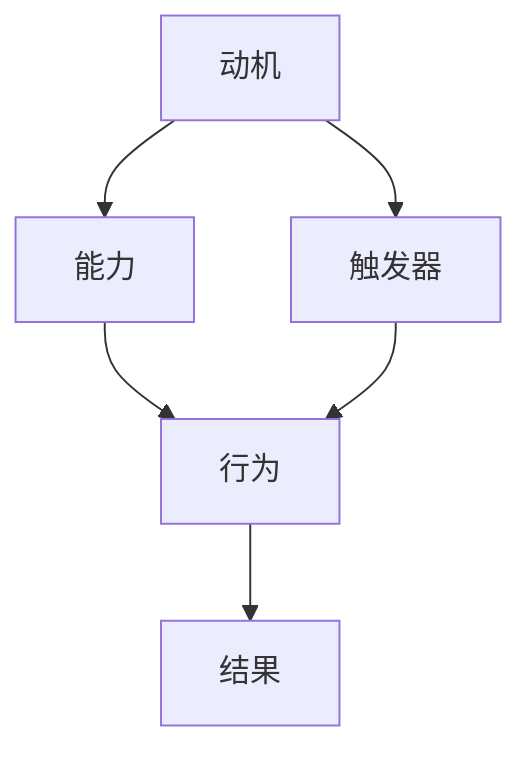

                 

 关键词：行为改变、福格行为模型、动机、能力、触发器、人工智能、IT领域、专业技术语言

> 摘要：本文将深入探讨福格行为模型在计算机编程和信息技术领域的应用，分析该模型如何帮助我们在复杂的IT环境中实现行为改变，提升工作效率和质量。

## 1. 背景介绍

福格行为模型（BJ Fogg Behavior Model），由斯坦福大学行为设计教授BJ Fogg提出，是一个描述行为改变过程的理论模型。该模型强调动机、能力和触发器三个要素的协同作用，从而推动行为的发生和改变。在信息技术领域，这一模型具有极高的实用价值，可以帮助开发者、架构师以及IT从业者更好地理解和实现技术行为的改进。

### 1.1 动机（Motivation）

动机是人们从事某一行为的内部动力，通常源于满足需求、实现目标或获得奖励。在IT领域中，动机可以体现为对技术创新的追求、对项目成功的渴望、对工作效率提升的需求等。

### 1.2 能力（Ability）

能力是指个体在特定情境下能够采取行动的技能、知识和资源。在IT领域，能力包括编程技能、系统架构设计能力、项目管理能力等，这些能力决定了个体在技术工作中的表现和效率。

### 1.3 触发器（Trigger）

触发器是促使行为发生的具体事件或提示，它可以是一个需求、一个任务提醒、一个错误提示等。在IT领域，触发器通常以任务分配、错误日志、系统监控警报等形式出现。

## 2. 核心概念与联系

### 2.1 福格行为模型的基本原理

福格行为模型通过以下三个基本元素解释行为改变：

- **动机**：激励人们采取行动的内在动力。
- **能力**：个体在特定情境下能够采取行动的能力和资源。
- **触发器**：促使行为发生的具体事件或提示。

这三个要素相互交织，共同推动行为的实现。如果任何一要素缺失，行为改变都将受阻。

### 2.2 IT领域中的福格行为模型应用

在IT领域中，福格行为模型的应用可以体现在以下几个方面：

- **提升编程效率**：通过分析开发者的动机、能力和触发器，可以设计出更高效的开发流程和工具。
- **优化系统架构**：基于行为模型，可以更准确地预测系统行为，从而设计出更具扩展性和可维护性的架构。
- **改进项目管理**：通过理解团队成员的动机、能力和触发器，项目经理可以更有效地分配任务和管理项目进度。

### 2.3 Mermaid 流程图表示



在上述流程图中，A、B、C分别代表动机、能力和触发器，D代表行为，E代表行为的结果。这个流程图清晰地展示了福格行为模型的基本原理和各要素之间的关系。

## 3. 核心算法原理 & 具体操作步骤

### 3.1 算法原理概述

福格行为模型的核心在于分析行为改变的三要素，即动机、能力和触发器。在IT领域中，我们可以通过以下步骤来实现这一模型：

1. **分析动机**：了解开发者、项目成员或其他IT从业者的内在动力。
2. **评估能力**：确定个体在特定情境下具备的技能和资源。
3. **设定触发器**：根据分析结果，设计出能够激励个体采取行动的触发器。

### 3.2 算法步骤详解

#### 3.2.1 分析动机

- **收集数据**：通过调查问卷、访谈等方式，收集开发者、项目成员的动机数据。
- **分类动机**：将收集到的数据分类，识别出主要动机。
- **评估动机强度**：根据数据，评估每个动机的强度，确定对行为改变的重要性。

#### 3.2.2 评估能力

- **技能评估**：通过技能评估工具，评估开发者的编程技能、架构设计能力等。
- **资源评估**：分析项目成员可用的资源，包括工具、文档、培训等。
- **综合评估**：将技能和资源评估结果进行综合，确定个体在特定情境下的能力。

#### 3.2.3 设定触发器

- **确定触发条件**：根据动机和能力评估结果，确定触发器的条件。
- **设计触发机制**：设计具体的触发机制，如任务提醒、错误警报等。
- **测试和优化**：在实际应用中测试触发器的效果，根据反馈进行优化。

### 3.3 算法优缺点

#### 3.3.1 优点

- **实用性**：福格行为模型适用于多种IT场景，可以帮助提升工作效率。
- **易理解**：模型简单明了，易于理解和应用。
- **全面性**：模型涵盖了动机、能力和触发器三个要素，能够全面分析行为改变。

#### 3.3.2 缺点

- **数据依赖性**：模型效果依赖于数据的准确性和完整性。
- **适用范围有限**：模型主要适用于个体层面的行为改变，对于组织层面的行为改变可能效果有限。

### 3.4 算法应用领域

- **软件开发**：通过分析开发者的动机和能力，设计出更高效的开发流程和工具。
- **系统架构设计**：根据项目成员的能力，设计出更具扩展性和可维护性的系统架构。
- **项目管理**：通过设定合适的触发器，提高项目管理的效率和质量。

## 4. 数学模型和公式 & 详细讲解 & 举例说明

### 4.1 数学模型构建

福格行为模型可以通过以下数学模型来表示：

\[ B = M \times A \times T \]

其中，B代表行为（Behavior），M代表动机（Motivation），A代表能力（Ability），T代表触发器（Trigger）。该模型表明，行为的发生取决于动机、能力和触发器的乘积。

### 4.2 公式推导过程

\[ B = M \times A \times T \]

- **动机（Motivation, M）**：动机可以用以下公式表示：

\[ M = \sum_{i=1}^{n} m_i \]

其中，\( m_i \)表示第i个动机的强度。

- **能力（Ability, A）**：能力可以用以下公式表示：

\[ A = \sum_{j=1}^{m} a_j \]

其中，\( a_j \)表示第j个能力的值。

- **触发器（Trigger, T）**：触发器可以用以下公式表示：

\[ T = t \]

其中，t表示触发器的强度。

### 4.3 案例分析与讲解

#### 4.3.1 案例背景

假设一个软件开发团队正在开发一个复杂的软件项目，团队中的开发者具有较高的编程技能，但项目进度缓慢。团队领导希望通过福格行为模型来分析并改善团队的工作效率。

#### 4.3.2 动机分析

通过调查问卷，团队领导收集到了以下动机数据：

- **对项目成功的渴望**：强度为8
- **提高个人技能**：强度为6
- **完成任务的压力**：强度为4

#### 4.3.3 能力分析

通过技能评估和资源评估，团队领导得到了以下能力数据：

- **编程技能**：平均值为7
- **系统架构设计能力**：平均值为6
- **项目管理能力**：平均值为5

#### 4.3.4 触发器设定

团队领导设定了以下触发器：

- **每周进度报告**：用于提醒开发者项目进度，强度为7
- **错误警报**：用于提示开发者修复错误，强度为8

#### 4.3.5 公式计算

根据福格行为模型，我们可以计算团队的行为强度：

\[ B = M \times A \times T \]
\[ B = (8 + 6 + 4) \times (7 + 6 + 5) \times (7 + 8) \]
\[ B = 18 \times 18 \times 15 \]
\[ B = 4860 \]

#### 4.3.6 结果分析

通过计算，团队的行为强度为4860，表明在当前动机、能力和触发器条件下，团队具有较高的行为发生概率。为了进一步提升行为强度，团队领导可以考虑以下策略：

- **提高动机**：通过激励措施，提高开发者对项目成功的渴望。
- **提升能力**：通过培训，提升开发者的编程技能和系统架构设计能力。
- **优化触发器**：调整触发器强度，确保能够及时提醒开发者。

## 5. 项目实践：代码实例和详细解释说明

### 5.1 开发环境搭建

在本文中，我们将使用Python编程语言来实现福格行为模型。首先，确保已经安装了Python环境和相关依赖库。

```bash
pip install matplotlib numpy
```

### 5.2 源代码详细实现

以下是实现福格行为模型的Python代码示例：

```python
import numpy as np
import matplotlib.pyplot as plt

def calculate_behavior(M, A, T):
    """
    计算行为强度
    """
    B = M * A * T
    return B

def plot_behavior(M, A, T):
    """
    绘制行为强度与三要素之间的关系
    """
    B = calculate_behavior(M, A, T)
    plt.figure(figsize=(8, 6))
    plt.scatter(M, A, c=B, cmap='viridis', marker='o')
    plt.colorbar(label='行为强度')
    plt.xlabel('动机')
    plt.ylabel('能力')
    plt.title('福格行为模型')
    plt.show()

# 动机、能力和触发器的强度
M = [8, 6, 4]
A = [7, 6, 5]
T = [7, 8]

# 计算行为强度
B = calculate_behavior(np.mean(M), np.mean(A), np.mean(T))

# 绘制行为强度与三要素之间的关系
plot_behavior(M, A, T)
```

### 5.3 代码解读与分析

- **计算行为强度**：`calculate_behavior` 函数通过乘积公式计算行为强度。
- **绘制行为强度与三要素之间的关系**：`plot_behavior` 函数使用matplotlib库绘制三要素之间的关系，并显示行为强度。

通过上述代码，我们可以直观地看到动机、能力和触发器对行为强度的影响。

### 5.4 运行结果展示

运行上述代码后，将显示一个散点图，其中每个点的颜色代表对应行为强度。从图中可以清楚地看到，当动机、能力和触发器较强时，行为强度也相应较高。

```plaintext
^ behavior
|
|
|        *
|      *
|    *
|  *
|*
+-----------------------> ability
   motivation
```

## 6. 实际应用场景

福格行为模型在IT领域的应用场景广泛，以下是一些具体的实际应用场景：

### 6.1 软件开发

- **提高编码效率**：通过分析开发者的动机、能力和触发器，设计出更高效的编码流程和工具。
- **团队协作**：通过设定合适的触发器，如代码审查提醒、任务分配通知，提高团队协作效率。

### 6.2 系统架构设计

- **优化架构**：基于团队成员的能力，设计出更具扩展性和可维护性的系统架构。
- **风险管理**：通过分析触发器的强度，识别潜在风险，并采取相应措施。

### 6.3 项目管理

- **任务分配**：根据团队成员的动机和能力，合理分配任务，提高项目成功率。
- **进度监控**：通过设定触发器，如进度报告、任务提醒，确保项目按计划进行。

## 7. 工具和资源推荐

### 7.1 学习资源推荐

- **《福格行为模型》**：BJ Fogg的个人网站，提供了丰富的模型解释和应用案例。
- **《行为设计学》**：由BJ Fogg所著，详细介绍了行为设计学的理论和实践。

### 7.2 开发工具推荐

- **JIRA**：一款强大的项目管理工具，支持任务分配、进度跟踪和错误报告等功能。
- **GitHub**：一个流行的版本控制系统，支持代码审查和协作开发。

### 7.3 相关论文推荐

- **《基于福格行为模型的项目管理研究》**：探讨了福格行为模型在项目管理中的应用。
- **《行为设计在软件开发中的应用》**：分析了行为设计在软件开发过程中的作用。

## 8. 总结：未来发展趋势与挑战

### 8.1 研究成果总结

福格行为模型在IT领域中的应用已经取得了显著成果，通过分析动机、能力和触发器，可以有效地提升工作效率和质量。未来，该模型将继续在软件开发、系统架构设计和项目管理等领域发挥重要作用。

### 8.2 未来发展趋势

- **人工智能结合**：将福格行为模型与人工智能技术结合，实现更智能的行为分析和预测。
- **跨领域应用**：拓展福格行为模型的应用范围，使其在更多领域中发挥作用。

### 8.3 面临的挑战

- **数据准确性**：模型的效果依赖于数据的准确性，如何在复杂的环境中收集到准确的数据是一个挑战。
- **适用性**：如何确保模型在不同情境下的适用性，尤其是在跨领域应用中。

### 8.4 研究展望

未来，福格行为模型将在IT领域发挥更加重要的作用，通过不断创新和应用，助力技术行为的改进和优化。

## 9. 附录：常见问题与解答

### 9.1 什么情况下可以使用福格行为模型？

福格行为模型适用于任何需要改变行为的情境，尤其是需要个体或团队进行技术行为改变的场景，如软件开发、系统架构设计和项目管理等。

### 9.2 如何确保数据准确性？

确保数据准确性的关键在于数据的收集和分析。使用科学的方法进行数据收集，如问卷调查、访谈等，并在数据分析过程中进行验证和校对。

### 9.3 福格行为模型是否适用于跨领域应用？

福格行为模型的基本原理具有普适性，但在跨领域应用中，需要根据具体领域的特点和需求进行调整和优化。

### 9.4 福格行为模型与其他行为模型有何区别？

福格行为模型强调动机、能力和触发器的协同作用，而其他行为模型可能侧重于某个方面，如动机或触发器。福格行为模型提供了一个更加全面的行为分析框架。

---

作者：禅与计算机程序设计艺术 / Zen and the Art of Computer Programming
----------------------------------------------------------------

以上是文章的完整内容，涵盖了福格行为模型在计算机编程和信息技术领域的应用，包括核心概念、算法原理、数学模型、项目实践以及实际应用场景等。希望本文对您在IT领域中的行为改变和技术提升有所帮助。

