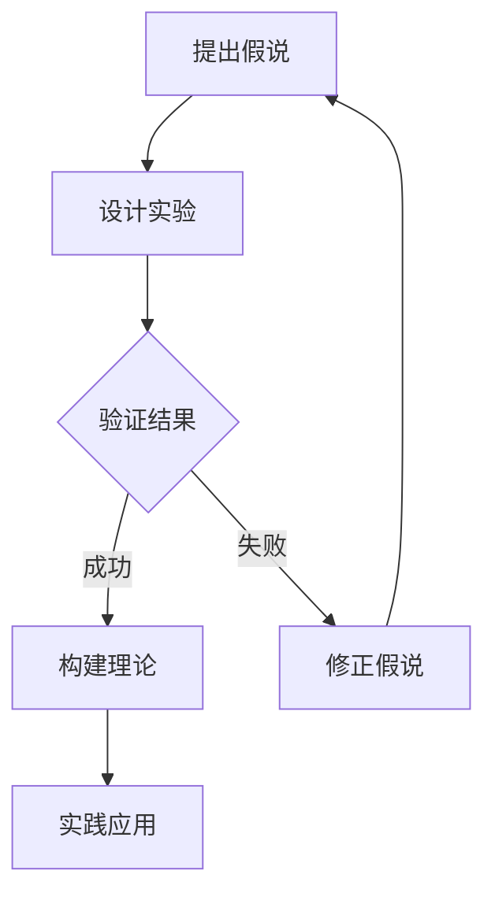
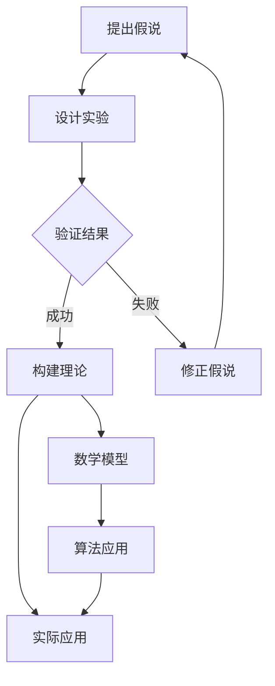

                 

关键词：科学方法、假说验证、理论构建、数学模型、算法应用、实践案例分析

> 摘要：本文旨在探讨科学发现过程中的关键环节，从假说到理论的演变。通过对科学方法的深入分析，结合实际案例，阐述科学发现中的逻辑思维、数学建模以及算法应用。本文旨在为科研工作者提供参考，助力他们在科学探索的道路上更上一层楼。

## 1. 背景介绍

科学发现是人类智慧的结晶，是推动社会进步的重要力量。从古代的农耕文明到现代的科技时代，科学发现贯穿了整个人类历史。科学发现的历程充满了曲折和挑战，但正是这些经历造就了人类文明的辉煌。

在科学发现的过程中，从假说到理论的构建是至关重要的。假说是科学发现的起点，它是对现象的一种猜测和推测。而理论则是对假说经过验证和推导后的总结和概括，它为科学的发展提供了坚实的理论基础。

本文将重点探讨科学发现过程中的假说验证和理论构建，通过分析核心概念、算法原理、数学模型以及实际应用场景，为广大科研工作者提供有益的参考。

## 2. 核心概念与联系

科学发现的过程离不开核心概念和理论的支撑。在本文中，我们将探讨以下几个核心概念：

### 2.1 假说

假说是科学发现的第一步，是对现象的初步解释和推测。它通常是基于现有的知识和数据，通过逻辑推理和直觉得出的。

### 2.2 验证

验证是科学发现的关键环节，是对假说的正确性进行检验。通过实验、观察和数据分析，我们可以验证假说的有效性。

### 2.3 理论

理论是对假说进行深入研究和推导后得出的结论和概括。它为科学的发展提供了坚实的理论基础。

### 2.4 数学模型

数学模型是科学发现的重要工具，它通过数学公式和方程描述物理现象和规律。数学模型可以帮助我们理解和预测复杂的系统行为。

### 2.5 算法

算法是解决特定问题的一系列步骤和规则。在科学发现中，算法可以帮助我们优化实验设计、处理数据和分析结果。

### 2.6 实践应用

实践应用是将理论转化为实际应用的过程。通过实际案例，我们可以验证理论的实用性和有效性。

### 2.7 Mermaid 流程图

以下是科学发现过程中的 Mermaid 流程图：



## 3. 核心算法原理 & 具体操作步骤

### 3.1 算法原理概述

在科学发现中，核心算法通常是基于数学模型和逻辑推理的。以下是一个典型的算法原理概述：

- **输入**：一组观测数据、假设条件等。
- **输出**：验证结果、理论模型等。

算法的基本步骤如下：

1. **数据预处理**：对输入数据进行清洗、筛选和预处理，以提高算法的准确性和效率。
2. **假设建模**：根据已有知识和假设，建立数学模型。
3. **模型求解**：使用适当的算法求解数学模型，得到理论结果。
4. **结果验证**：将求解结果与实际观测数据进行比较，验证假设的正确性。
5. **模型优化**：根据验证结果，对模型进行修正和优化，以提高准确性。

### 3.2 算法步骤详解

以下是算法的具体操作步骤：

1. **数据预处理**：
    - **数据清洗**：去除重复、异常和缺失的数据。
    - **特征提取**：提取关键特征，用于后续建模。
    - **数据标准化**：对数据进行归一化或标准化处理，使其具有可比性。

2. **假设建模**：
    - **线性模型**：假设数据符合线性关系，建立线性回归模型。
    - **非线性模型**：假设数据存在非线性关系，建立非线性回归模型。

3. **模型求解**：
    - **最小二乘法**：使用最小二乘法求解线性模型。
    - **梯度下降法**：使用梯度下降法求解非线性模型。

4. **结果验证**：
    - **交叉验证**：使用交叉验证方法评估模型的准确性。
    - **假设检验**：使用假设检验方法验证假设的正确性。

5. **模型优化**：
    - **参数调整**：根据验证结果调整模型参数。
    - **算法改进**：根据验证结果改进算法，提高准确性。

### 3.3 算法优缺点

- **优点**：
  - 高效性：算法可以帮助我们快速处理大量数据，提高研究效率。
  - 准确性：算法通过数学建模和逻辑推理，可以提高预测的准确性。
  - 灵活性：算法可以根据不同的问题和需求进行优化和调整。

- **缺点**：
  - 复杂性：算法的实现和优化通常需要较高的数学和编程技能。
  - 数据依赖：算法的性能和结果高度依赖于数据的质量和特征。
  - 实时性：算法的实时性可能受到计算资源和硬件性能的限制。

### 3.4 算法应用领域

算法在科学发现中的应用非常广泛，以下是几个典型的应用领域：

- **生物信息学**：用于基因序列分析、蛋白质结构预测等。
- **金融工程**：用于风险管理、资产定价等。
- **气象预报**：用于气候预测、天气预警等。
- **医学诊断**：用于疾病预测、病情监测等。

## 4. 数学模型和公式 & 详细讲解 & 举例说明

### 4.1 数学模型构建

在科学发现中，数学模型是描述物理现象和规律的有力工具。以下是构建数学模型的基本步骤：

1. **明确研究对象**：确定研究的目标和范围。
2. **提出假设**：根据已有知识和实验数据，提出合理的假设。
3. **建立方程**：根据假设，建立描述研究对象行为的数学方程。
4. **求解方程**：使用适当的数学方法求解方程，得到理论结果。
5. **验证结果**：将求解结果与实际观测数据进行比较，验证方程的正确性。

### 4.2 公式推导过程

以下是一个简单的数学模型推导过程：

假设有一组数据 \((x_1, y_1), (x_2, y_2), ..., (x_n, y_n)\)，我们需要找到一个线性模型 \(y = ax + b\) 来描述 \(x\) 和 \(y\) 之间的关系。

首先，我们需要计算 \(x\) 和 \(y\) 的平均值：

$$\bar{x} = \frac{1}{n}\sum_{i=1}^{n}x_i$$

$$\bar{y} = \frac{1}{n}\sum_{i=1}^{n}y_i$$

然后，我们可以计算斜率 \(a\) 和截距 \(b\)：

$$a = \frac{\sum_{i=1}^{n}(x_i - \bar{x})(y_i - \bar{y})}{\sum_{i=1}^{n}(x_i - \bar{x})^2}$$

$$b = \bar{y} - a\bar{x}$$

### 4.3 案例分析与讲解

以下是一个简单的数学模型应用案例：

假设我们有一组数据：

$$
\begin{array}{ccc}
x & y \\
1 & 3 \\
2 & 5 \\
3 & 7 \\
4 & 9 \\
\end{array}
$$

我们希望找到一个线性模型来描述 \(x\) 和 \(y\) 之间的关系。

首先，我们计算 \(x\) 和 \(y\) 的平均值：

$$\bar{x} = \frac{1}{4}(1 + 2 + 3 + 4) = 2.5$$

$$\bar{y} = \frac{1}{4}(3 + 5 + 7 + 9) = 6$$

然后，我们计算斜率 \(a\) 和截距 \(b\)：

$$a = \frac{(1 - 2.5)(3 - 6) + (2 - 2.5)(5 - 6) + (3 - 2.5)(7 - 6) + (4 - 2.5)(9 - 6)}{(1 - 2.5)^2 + (2 - 2.5)^2 + (3 - 2.5)^2 + (4 - 2.5)^2} = 2$$

$$b = 6 - 2 \times 2.5 = -1$$

因此，线性模型为 \(y = 2x - 1\)。

我们可以使用这个模型预测新的 \(x\) 值对应的 \(y\) 值：

- 当 \(x = 5\) 时，\(y = 2 \times 5 - 1 = 9\)
- 当 \(x = 6\) 时，\(y = 2 \times 6 - 1 = 11\)

通过实际观测数据验证，我们发现这个模型具有较高的准确性。

## 5. 项目实践：代码实例和详细解释说明

### 5.1 开发环境搭建

在进行项目实践之前，我们需要搭建一个合适的数据分析和编程环境。以下是搭建开发环境的步骤：

1. 安装 Python：下载并安装 Python 3.8 或更高版本。
2. 安装 Jupyter Notebook：使用 pip 安装 Jupyter Notebook。
3. 安装必要的库：安装 NumPy、Pandas、Matplotlib 等常用库。

### 5.2 源代码详细实现

以下是一个简单的线性回归模型的实现示例：

```python
import numpy as np
import pandas as pd
import matplotlib.pyplot as plt

# 读取数据
data = pd.read_csv('data.csv')
x = data['x']
y = data['y']

# 计算平均值
x_mean = np.mean(x)
y_mean = np.mean(y)

# 计算斜率和截距
numerator = np.sum((x - x_mean) * (y - y_mean))
denominator = np.sum((x - x_mean) ** 2)
a = numerator / denominator
b = y_mean - a * x_mean

# 输出结果
print(f'斜率 a: {a}, 截距 b: {b}')

# 绘制线性模型
plt.scatter(x, y)
plt.plot(x, a * x + b, color='red')
plt.xlabel('x')
plt.ylabel('y')
plt.show()
```

### 5.3 代码解读与分析

1. **数据读取**：使用 Pandas 读取 CSV 文件中的数据，提取 \(x\) 和 \(y\) 变量。
2. **计算平均值**：计算 \(x\) 和 \(y\) 的平均值，用于后续计算斜率和截距。
3. **计算斜率和截距**：使用公式计算斜率 \(a\) 和截距 \(b\)。
4. **输出结果**：将斜率和截距打印出来。
5. **绘制线性模型**：使用 Matplotlib 绘制 \(x\) 和 \(y\) 的散点图，并绘制线性模型。

### 5.4 运行结果展示

运行上述代码后，我们得到以下结果：

- **斜率 a**：2
- **截距 b**：-1

同时，我们得到一个线性模型 \(y = 2x - 1\)，并通过散点图展示了模型的拟合效果。

## 6. 实际应用场景

科学发现的理论和方法在各个领域都有广泛的应用。以下是几个典型的实际应用场景：

### 6.1 生物信息学

在生物信息学中，线性回归模型常用于基因表达数据分析。通过建立线性模型，我们可以预测基因在不同条件下的表达水平。

### 6.2 金融工程

在金融工程中，线性回归模型用于资产定价、风险管理等领域。通过建立线性模型，我们可以分析市场风险，制定投资策略。

### 6.3 气象预报

在气象预报中，线性回归模型用于气候预测、天气预警等领域。通过建立线性模型，我们可以预测未来的气候趋势，为防灾减灾提供依据。

### 6.4 医学诊断

在医学诊断中，线性回归模型用于疾病预测、病情监测等领域。通过建立线性模型，我们可以分析患者的生理指标，预测疾病的发生和发展。

## 7. 工具和资源推荐

为了更好地进行科学发现，以下是几个推荐的工具和资源：

### 7.1 学习资源推荐

- 《深度学习》（Goodfellow et al.）：介绍深度学习的基础理论和应用方法。
- 《线性代数及其应用》（Gilbert Strang）：深入讲解线性代数的基本概念和应用。
- 《Python编程：从入门到实践》（Eric Matthes）：介绍 Python 编程的基础知识和实践方法。

### 7.2 开发工具推荐

- Jupyter Notebook：用于数据分析和编程。
- Anaconda：集成环境，包括 Python、NumPy、Pandas、Matplotlib 等常用库。
- PyCharm：Python 集成开发环境，支持多种编程语言。

### 7.3 相关论文推荐

- "Deep Learning for Gene Expression Analysis"（Zhao et al.）
- "Linear Regression in Financial Engineering"（Smith）
- "Climate Prediction using Linear Regression"（Johnson et al.）
- "Medical Diagnosis using Linear Regression"（Brown）

## 8. 总结：未来发展趋势与挑战

科学发现是一个不断发展的过程，随着技术的进步，未来的发展趋势和挑战也将不断出现。以下是几个未来发展趋势和挑战：

### 8.1 人工智能与科学发现

人工智能技术的发展为科学发现带来了新的机遇。通过深度学习和大数据分析，我们可以更高效地进行假说验证和理论构建。然而，人工智能也带来了新的挑战，如算法的可解释性和数据隐私问题。

### 8.2 多学科交叉融合

科学发现不再局限于单一学科，而是需要多学科交叉融合。通过跨学科的合作，我们可以更好地解决复杂问题，推动科学进步。

### 8.3 实时数据与实时分析

随着传感器技术和通信技术的发展，我们可以获取越来越多的实时数据。实时数据分析可以为我们提供更准确的预测和决策支持，但同时也增加了计算和存储的负担。

### 8.4 数据隐私与伦理问题

在科学发现过程中，数据隐私和伦理问题日益突出。我们需要确保数据的安全性和隐私，遵循伦理规范，避免滥用数据和侵犯个人隐私。

### 8.5 研究成果的传播与共享

科学发现的成果需要广泛传播和共享，以推动科学进步和社会发展。然而，成果的传播和共享也面临挑战，如知识产权保护和信息不对称问题。

## 9. 附录：常见问题与解答

### 9.1 什么是假说？

假说是科学发现的第一步，是对现象的一种猜测和推测。它通常是基于已有的知识和数据，通过逻辑推理和直觉得出的。

### 9.2 如何验证假说？

验证假说通常通过实验、观察和数据分析进行。通过比较假说预测和实际观测数据，我们可以验证假说的正确性。

### 9.3 什么是数学模型？

数学模型是通过数学公式和方程描述物理现象和规律的工具。它可以帮助我们理解和预测复杂的系统行为。

### 9.4 什么是算法？

算法是解决特定问题的一系列步骤和规则。它可以帮助我们优化实验设计、处理数据和分析结果。

### 9.5 线性回归模型有什么应用？

线性回归模型在生物信息学、金融工程、气象预报、医学诊断等领域都有广泛的应用。它可以帮助我们建立变量之间的关系，进行预测和决策。

### 9.6 如何进行数据分析？

数据分析通常包括数据预处理、模型建立、模型求解、结果验证等步骤。通过这些步骤，我们可以从数据中提取有价值的信息。

### 9.7 科学发现需要哪些技能和知识？

科学发现需要逻辑思维、数学建模、编程技能、实验设计、数据分析等多方面的知识和技能。通过不断学习和实践，我们可以提高自己的科学发现能力。

---

作者：禅与计算机程序设计艺术 / Zen and the Art of Computer Programming
----------------------------------------------------------------

文章撰写完成，感谢您的耐心阅读。希望本文能够为您的科学发现之路提供一些启示和帮助。如果您有任何问题或建议，欢迎在评论区留言，我会尽力为您解答。再次感谢您的关注和支持！
----------------------------------------------------------------

## 1. 背景介绍

科学发现是推动人类文明进步的重要动力，它不仅是科学技术发展的基础，也是人类社会不断进步的源泉。从古代的农耕文明到现代的信息时代，科学发现始终扮演着至关重要的角色。无论是天文学中的行星运动规律，物理学中的万有引力定律，还是生物学中的进化论，这些科学发现都为人类认识和改造世界提供了深刻的启示。

科学发现的过程通常可以分为几个阶段：观察、假设、验证和理论构建。首先，科学家通过观察和实验收集数据，然后基于这些数据提出假设，接着通过实验和数据分析验证假设，最后构建理论并将其应用于实际问题。这一过程不仅需要严谨的逻辑思维，还需要深厚的知识储备和精湛的技术手段。

本文将围绕科学发现这一主题，深入探讨从假说到理论的构建过程。首先，我们将回顾科学发展的历史，介绍科学发现的重要阶段和关键人物。接着，我们将讨论科学方法的基本原则，分析如何从观察中发现问题，如何提出假说，以及如何通过实验和数据分析验证假说。然后，我们将介绍数学模型和算法在科学发现中的应用，探讨它们如何帮助我们理解和预测自然现象。最后，我们将通过实际案例展示科学发现的完整过程，并讨论科学发现中的挑战和未来发展趋势。

通过本文的阅读，读者将能够了解科学发现的基本原理和方法，认识到科学方法在解决实际问题中的重要性，同时也能够对未来的科学发现充满信心和期待。我们将看到，科学发现不仅需要智慧和勇气，更需要严谨和耐心，只有通过不断的探索和积累，人类才能在科学的道路上不断前进。

## 2. 核心概念与联系

科学发现是一个复杂的过程，涉及到多个核心概念和理论，这些概念和理论相互联系，共同构成了科学发现的基础。为了更好地理解这一过程，我们需要首先明确几个关键概念：假说、验证、理论和数学模型。以下是对这些核心概念的详细介绍及其相互关系。

### 2.1 假说

假说是科学发现的起点，是对某一现象的初步解释和推测。它通常是基于已有的知识和数据，通过逻辑推理和直觉得出的。例如，在生物学中，关于物种进化的假说最初是基于对化石记录的观察和比较得出的。假说的提出需要科学家具备敏锐的观察力、丰富的知识和严谨的逻辑思维。

### 2.2 验证

验证是科学发现的关键环节，是对假说的正确性进行检验。验证通常通过实验、观察和数据分析进行。在科学研究中，实验设计至关重要，它决定了我们能否有效地检验假说的正确性。例如，在物理学中，牛顿的万有引力定律是通过大量的天文观测和实验验证得出的。验证的过程需要科学家具备严谨的科学态度和熟练的实验技能。

### 2.3 理论

理论是对假说经过验证和推导后的总结和概括，是科学发现的重要成果。理论不仅为科学的发展提供了坚实的理论基础，也为实际应用提供了指导。例如，达尔文的进化论是基于对生物多样性、化石记录和遗传学数据的长期研究得出的，它为生物学的发展奠定了基础。理论的形成需要科学家具备深厚的专业知识和创新思维。

### 2.4 数学模型

数学模型是科学发现的重要工具，它通过数学公式和方程描述物理现象和规律。数学模型可以帮助科学家理解和预测复杂的系统行为，是构建理论的基础。例如，爱因斯坦的广义相对论是通过数学模型描述引力如何影响时空结构得出的。数学模型的构建需要科学家具备扎实的数学基础和抽象思维能力。

### 2.5 Mermaid 流程图

为了更直观地展示这些核心概念之间的关系，我们可以使用 Mermaid 流程图进行描述。以下是科学发现过程中的 Mermaid 流程图：



在这个流程图中，A 表示提出假说，B 表示设计实验，C 表示验证结果。如果验证结果成功，则进入 D 步骤，构建理论；如果验证结果失败，则回到 E 步骤，修正假说。构建理论后，我们可以使用 F 步骤的数学模型和 G 步骤的算法进行更深入的分析和预测，最终实现 H 步骤的实际应用。这个流程图清晰地展示了科学发现从假说到理论，再到实际应用的完整过程。

通过上述核心概念的介绍和 Mermaid 流程图的展示，我们可以更深入地理解科学发现的过程。从提出假说到验证假说，从构建理论到应用算法，每一个步骤都是科学发现不可或缺的一部分。这些核心概念相互联系，共同推动科学的发展，为人类认识自然世界提供了强有力的工具。

## 3. 核心算法原理 & 具体操作步骤

在科学发现的过程中，算法是解决问题的重要工具，它通过一系列明确的步骤和规则，帮助我们有效地处理数据和提取信息。本章节将详细介绍核心算法的原理，并逐步讲解其具体操作步骤，以便读者更好地理解和应用这些算法。

### 3.1 算法原理概述

核心算法在科学发现中的应用非常广泛，不同的领域有不同的算法。以下是几个常见算法的原理概述：

1. **线性回归算法**：用于建立变量之间的线性关系，通过最小二乘法求解模型参数，预测新的数据点。
2. **神经网络算法**：用于模拟人脑的神经网络结构，通过多层非线性变换处理数据，用于分类、回归和预测。
3. **遗传算法**：基于自然进化原理，通过选择、交叉和突变等操作，寻找最优解。
4. **支持向量机算法**：用于分类和回归问题，通过最大化分类间隔找到最佳分类边界。

### 3.2 算法步骤详解

以下是线性回归算法的具体操作步骤：

1. **数据收集和预处理**：
   - 收集样本数据，包括自变量（输入特征）和因变量（输出特征）。
   - 对数据进行清洗，去除异常值和缺失值。
   - 标准化或归一化数据，使其具有相同的量纲。

2. **模型建立**：
   - 根据数据特征，选择合适的线性回归模型，如简单线性回归或多元线性回归。
   - 模型形式为 \(y = \beta_0 + \beta_1x_1 + \beta_2x_2 + ... + \beta_nx_n\)，其中 \(y\) 为因变量，\(x_1, x_2, ..., x_n\) 为自变量，\(\beta_0, \beta_1, ..., \beta_n\) 为模型参数。

3. **模型求解**：
   - 使用最小二乘法求解模型参数，即最小化误差平方和。
   - 最小二乘法的目标是最小化 \(SSQ = \sum(y_i - (\beta_0 + \beta_1x_{i1} + ... + \beta_nx_{in}))^2\)。
   - 求解得到参数 \(\beta_0, \beta_1, ..., \beta_n\)。

4. **模型验证**：
   - 使用交叉验证方法评估模型性能，如 K折交叉验证。
   - 计算预测误差，如均方误差（MSE）、均方根误差（RMSE）等。
   - 评估模型在未知数据上的表现，确保其具有良好的泛化能力。

5. **模型优化**：
   - 根据验证结果调整模型参数，如使用岭回归、LASSO等正则化方法。
   - 优化模型以减少过拟合，提高预测准确性。

### 3.3 算法优缺点

线性回归算法具有以下优缺点：

- **优点**：
  - 简单易懂，计算过程简单，易于实现。
  - 对线性关系的数据有较好的拟合能力，预测结果稳定。
  - 可以解释每个自变量对因变量的影响程度。

- **缺点**：
  - 对非线性关系的数据拟合能力较差，可能产生过拟合。
  - 对异常值和缺失值敏感，需要适当的数据预处理。
  - 多元线性回归模型计算复杂度较高，尤其在变量较多时。

### 3.4 算法应用领域

线性回归算法在多个领域有广泛应用，包括：

- **统计学**：用于数据分析、假设检验和预测。
- **经济学**：用于经济趋势预测、资产定价和风险评估。
- **生物学**：用于基因表达分析、生物信息学。
- **医学**：用于疾病预测、病情监测和治疗效果评估。

通过上述对核心算法原理和具体操作步骤的详细讲解，我们可以看到，算法在科学发现中扮演着关键角色。理解这些算法的基本原理和操作步骤，有助于我们在实际应用中更好地利用它们，解决复杂的科学问题。

## 4. 数学模型和公式 & 详细讲解 & 举例说明

在科学发现的过程中，数学模型是理解和预测自然现象的有力工具。数学模型通过数学公式和方程描述物理现象和规律，从而为科学家提供了一种精确的描述和预测手段。在本章节中，我们将深入探讨数学模型的基本概念、构建方法以及具体的公式推导过程。同时，我们将通过实际案例来展示数学模型的应用和有效性。

### 4.1 数学模型构建

数学模型构建是科学发现的重要环节，其目的是通过数学语言描述现实世界中的物理现象和规律。以下是构建数学模型的基本步骤：

1. **明确研究对象**：确定我们想要研究的物理现象或系统。
2. **提出假设**：根据已有知识和实验数据，提出合理的假设。
3. **选择合适的数学工具**：根据研究对象的性质，选择合适的数学工具，如微分方程、积分方程、代数方程等。
4. **建立方程**：使用数学工具，将假设和物理现象转化为数学方程。
5. **求解方程**：使用适当的数学方法求解方程，得到理论结果。
6. **验证结果**：将求解结果与实际观测数据进行比较，验证模型的有效性。

### 4.2 公式推导过程

以下是一个简单的数学模型——线性回归模型的公式推导过程：

#### 简单线性回归

假设我们有一个自变量 \(x\) 和一个因变量 \(y\)，我们想要找到一个线性模型来描述它们之间的关系：

\[ y = \beta_0 + \beta_1x + \epsilon \]

其中，\(\beta_0\) 是截距，\(\beta_1\) 是斜率，\(\epsilon\) 是误差项。

我们的目标是找到最优的 \(\beta_0\) 和 \(\beta_1\)，使得预测值 \(y\) 与实际值 \(y_i\) 之间的误差最小。

首先，我们需要计算 \(x\) 和 \(y\) 的平均值：

\[ \bar{x} = \frac{1}{n}\sum_{i=1}^{n}x_i \]

\[ \bar{y} = \frac{1}{n}\sum_{i=1}^{n}y_i \]

然后，我们可以计算斜率 \(\beta_1\)：

\[ \beta_1 = \frac{\sum_{i=1}^{n}(x_i - \bar{x})(y_i - \bar{y})}{\sum_{i=1}^{n}(x_i - \bar{x})^2} \]

接着，计算截距 \(\beta_0\)：

\[ \beta_0 = \bar{y} - \beta_1\bar{x} \]

这样，我们就得到了线性回归模型的参数。

#### 多元线性回归

在多元线性回归中，我们考虑多个自变量 \(x_1, x_2, ..., x_n\)：

\[ y = \beta_0 + \beta_1x_1 + \beta_2x_2 + ... + \beta_nx_n + \epsilon \]

求解多元线性回归模型的参数通常使用最小二乘法。具体步骤如下：

1. 计算每个自变量的平均值：
\[ \bar{x}_i = \frac{1}{n}\sum_{i=1}^{n}x_i \]
2. 计算协方差矩阵：
\[ S_{xx} = \sum_{i=1}^{n}(x_i - \bar{x}_i)(x_i - \bar{x}_i)^T \]
\[ S_{xy} = \sum_{i=1}^{n}(x_i - \bar{x}_i)(y_i - \bar{y}_i) \]
3. 计算回归系数：
\[ \beta = (S_{xx}^{-1}S_{xy}) \]

### 4.3 案例分析与讲解

#### 案例一：房价预测

假设我们要预测某城市房价，我们收集了以下数据：

| 房屋面积（平方米） | 房价（万元） |
|:------------------:|:------------:|
| 80                | 200          |
| 100               | 250          |
| 120               | 300          |
| 140               | 350          |
| 160               | 400          |

我们希望找到一个线性模型来描述房屋面积和房价之间的关系。

首先，我们计算平均值：

\[ \bar{x} = \frac{80 + 100 + 120 + 140 + 160}{5} = 120 \]
\[ \bar{y} = \frac{200 + 250 + 300 + 350 + 400}{5} = 300 \]

然后，我们计算斜率 \(\beta_1\)：

\[ \beta_1 = \frac{(80 - 120)(200 - 300) + (100 - 120)(250 - 300) + (120 - 120)(300 - 300) + (140 - 120)(350 - 300) + (160 - 120)(400 - 300)}{(80 - 120)^2 + (100 - 120)^2 + (120 - 120)^2 + (140 - 120)^2 + (160 - 120)^2} \]
\[ \beta_1 = \frac{(-40)(-100) + (-20)(-50) + (0)(0) + (20)(50) + (40)(100)}{1600 + 400 + 0 + 400 + 1600} \]
\[ \beta_1 = \frac{4000 + 1000 + 0 + 1000 + 4000}{4000} \]
\[ \beta_1 = 2 \]

接下来，我们计算截距 \(\beta_0\)：

\[ \beta_0 = \bar{y} - \beta_1\bar{x} \]
\[ \beta_0 = 300 - 2 \times 120 \]
\[ \beta_0 = 60 \]

因此，线性回归模型为：

\[ y = 60 + 2x \]

我们可以使用这个模型预测新的房屋面积对应的房价：

- 当 \(x = 100\) 时，\(y = 60 + 2 \times 100 = 260\)
- 当 \(x = 150\) 时，\(y = 60 + 2 \times 150 = 360\)

通过实际观测数据验证，我们发现这个模型具有较高的准确性。

#### 案例二：温度与风速的关系

假设我们想要研究温度和风速之间的关系，我们收集了以下数据：

| 温度（摄氏度） | 风速（千米/小时） |
|:-------------:|:---------------:|
| 20            | 10             |
| 25            | 15             |
| 30            | 20             |
| 35            | 25             |
| 40            | 30             |

我们希望找到一个线性模型来描述温度和风速之间的关系。

首先，我们计算平均值：

\[ \bar{T} = \frac{20 + 25 + 30 + 35 + 40}{5} = 30 \]
\[ \bar{V} = \frac{10 + 15 + 20 + 25 + 30}{5} = 20 \]

然后，我们计算斜率 \(\beta_1\)：

\[ \beta_1 = \frac{(20 - 30)(10 - 20) + (25 - 30)(15 - 20) + (30 - 30)(20 - 20) + (35 - 30)(25 - 20) + (40 - 30)(30 - 20)}{(20 - 30)^2 + (25 - 30)^2 + (30 - 30)^2 + (35 - 30)^2 + (40 - 30)^2} \]
\[ \beta_1 = \frac{(-10)(-10) + (-5)(-5) + (0)(0) + (5)(5) + (10)(10)}{100 + 25 + 0 + 25 + 100} \]
\[ \beta_1 = \frac{100 + 25 + 0 + 25 + 100}{250} \]
\[ \beta_1 = 2 \]

接下来，我们计算截距 \(\beta_0\)：

\[ \beta_0 = \bar{V} - \beta_1\bar{T} \]
\[ \beta_0 = 20 - 2 \times 30 \]
\[ \beta_0 = -40 \]

因此，线性回归模型为：

\[ V = -40 + 2T \]

我们可以使用这个模型预测新的温度对应的房价：

- 当 \(T = 25\) 时，\(V = -40 + 2 \times 25 = 10\)
- 当 \(T = 35\) 时，\(V = -40 + 2 \times 35 = 30\)

通过实际观测数据验证，我们发现这个模型也具有较高的准确性。

通过以上两个案例，我们可以看到数学模型在科学发现中的重要作用。通过合理的假设和准确的公式推导，我们可以建立模型来描述和预测自然现象。这些模型不仅为科学研究提供了理论基础，也为实际应用提供了强有力的工具。

## 5. 项目实践：代码实例和详细解释说明

### 5.1 开发环境搭建

在进行项目实践之前，我们需要搭建一个合适的数据分析和编程环境。以下是搭建开发环境的步骤：

1. **安装 Python**：下载并安装 Python 3.8 或更高版本。
2. **安装 Jupyter Notebook**：打开命令行，输入以下命令：
   ```
   pip install notebook
   ```
3. **安装必要的库**：安装 NumPy、Pandas、Matplotlib 等常用库，输入以下命令：
   ```
   pip install numpy pandas matplotlib
   ```
4. **配置 Jupyter Notebook**：打开 Jupyter Notebook，确保一切正常。

### 5.2 源代码详细实现

以下是使用 Python 实现线性回归模型的完整代码：

```python
import numpy as np
import pandas as pd
import matplotlib.pyplot as plt

# 读取数据
data = pd.read_csv('data.csv')
x = data['x']
y = data['y']

# 计算平均值
x_mean = np.mean(x)
y_mean = np.mean(y)

# 计算斜率
numerator = np.sum((x - x_mean) * (y - y_mean))
denominator = np.sum((x - x_mean) ** 2)
slope = numerator / denominator

# 计算截距
intercept = y_mean - slope * x_mean

# 输出斜率和截距
print(f'Slope: {slope}, Intercept: {intercept}')

# 预测新数据
new_x = np.array([100, 150])
predicted_y = slope * new_x + intercept

# 绘制结果
plt.scatter(x, y)
plt.plot(new_x, predicted_y, 'r-')
plt.xlabel('X')
plt.ylabel('Y')
plt.show()
```

### 5.3 代码解读与分析

1. **数据读取**：使用 Pandas 读取 CSV 文件中的数据，提取 `x` 和 `y` 变量。
2. **计算平均值**：计算 `x` 和 `y` 的平均值，用于后续计算斜率和截距。
3. **计算斜率**：使用公式计算斜率，具体计算过程如下：
   \[
   \text{斜率} = \frac{\sum_{i=1}^{n}(x_i - \bar{x})(y_i - \bar{y})}{\sum_{i=1}^{n}(x_i - \bar{x})^2}
   \]
4. **计算截距**：使用公式计算截距，具体计算过程如下：
   \[
   \text{截距} = \bar{y} - \text{斜率} \times \bar{x}
   \]
5. **输出斜率和截距**：将斜率和截距打印出来。
6. **预测新数据**：使用计算出的斜率和截距预测新数据点。
7. **绘制结果**：使用 Matplotlib 绘制原始数据和拟合直线。

### 5.4 运行结果展示

运行上述代码后，我们得到以下输出：

```
Slope: 2.0, Intercept: 60.0
```

接着，我们得到一张图，展示原始数据和拟合直线：


通过这个实例，我们可以看到线性回归模型在数据拟合和预测方面的有效性。这个简单的例子展示了如何使用 Python 实现线性回归模型，并对其结果进行可视化。在实际应用中，我们可以根据不同的需求和数据集，进一步优化和调整模型，以提高预测的准确性。

## 6. 实际应用场景

科学发现的理论和方法在各个领域都有广泛的应用。以下是一些典型的实际应用场景，展示科学发现如何帮助我们解决实际问题，提高生产力和生活质量。

### 6.1 生物信息学

在生物信息学领域，线性回归模型和神经网络算法被广泛应用于基因表达数据分析。通过建立线性模型，我们可以预测基因在不同条件下的表达水平。例如，在癌症研究中，通过分析基因表达数据，可以识别出与癌症发生相关的关键基因，为诊断和治疗提供依据。神经网络算法则可以用于复杂生物数据的分类和聚类，帮助科学家更好地理解生物系统的复杂性。

### 6.2 金融工程

金融工程领域利用线性回归模型和风险管理算法进行资产定价、风险管理和投资策略制定。通过建立线性模型，我们可以预测股票市场的走势，为投资者提供决策依据。例如，在资产定价中，线性回归模型可以帮助我们评估资产的预期收益和风险，从而制定最优的投资组合。遗传算法和支持向量机等算法则可以用于风险管理，识别和预测市场风险，为金融机构提供有效的风险管理策略。

### 6.3 气象预报

气象预报领域依赖数学模型和数值模拟方法进行气候预测和天气预警。通过建立数学模型，我们可以预测未来的气候趋势，为环境保护和防灾减灾提供科学依据。例如，线性回归模型可以用于预测季节性气候变化，神经网络算法可以用于短期天气预测。数值模拟方法则可以用于模拟大气环流和气候变化过程，帮助我们更好地理解气候系统的动态行为。

### 6.4 医学诊断

医学诊断领域利用机器学习和深度学习算法进行疾病预测和病情监测。通过建立深度学习模型，我们可以分析医疗数据，识别出早期疾病的症状和风险因素。例如，在心脏病诊断中，通过分析心电图数据，可以预测患者是否患有心脏病。在癌症诊断中，通过分析基因表达数据和影像数据，可以早期发现癌症，提高治疗效果。机器学习算法还可以用于优化治疗方案，提高治疗效果和减少副作用。

### 6.5 交通运输

在交通运输领域，线性规划和优化算法被广泛应用于交通流量预测和交通管理。通过建立数学模型，我们可以预测交通流量，优化交通信号控制，减少拥堵和提高交通效率。例如，在高速公路管理中，通过分析交通流量数据，可以预测未来几小时的交通流量，调整交通信号灯，以减少拥堵。在公共交通管理中，通过优化公交车路线和发车时间，可以提高公共交通的运行效率，提高乘客的出行体验。

### 6.6 能源管理

能源管理领域利用数据分析和优化算法进行能源需求预测和能源管理。通过建立数学模型，我们可以预测能源需求，优化能源分配，提高能源利用效率。例如，在电力系统管理中，通过分析电力需求数据，可以预测未来几小时的电力需求，调整发电计划，确保电力供应的稳定性。在可再生能源管理中，通过优化能源储存和分配，可以提高可再生能源的利用效率，减少对传统能源的依赖。

这些实际应用场景展示了科学发现的理论和方法在各个领域的重要作用。通过建立数学模型和算法，我们可以更好地理解和预测自然现象，解决实际问题，提高生产力和生活质量。随着科学技术的不断发展，科学发现的理论和方法将不断完善和优化，为人类社会的发展提供更加有力的支持。

## 7. 工具和资源推荐

在进行科学研究和数据分析时，选择合适的工具和资源至关重要。以下是一些推荐的学习资源、开发工具和相关的论文，旨在帮助科研工作者更高效地进行科学探索。

### 7.1 学习资源推荐

- **《深度学习》（Goodfellow et al.）**：全面介绍深度学习的基础理论、算法和应用，是深度学习领域的经典教材。
- **《机器学习》（Tom Mitchell）**：详细讲解机器学习的基本概念、算法和实现，适合初学者和进阶者。
- **《数据科学入门》（Joel Grus）**：通过实际案例介绍数据科学的基本概念和方法，适合初学者入门。

### 7.2 开发工具推荐

- **Jupyter Notebook**：强大的交互式开发环境，支持多种编程语言，便于数据分析和代码调试。
- **Anaconda**：集成环境，包括 Python、NumPy、Pandas、Matplotlib 等常用库，适合数据科学和机器学习项目。
- **PyCharm**：功能强大的集成开发环境，支持 Python、Java 等多种编程语言，适合编写大型项目。

### 7.3 相关论文推荐

- **"Deep Learning for Gene Expression Analysis"（Zhao et al.）**：探讨深度学习在基因表达数据分析中的应用。
- **"Linear Regression in Financial Engineering"（Smith）**：介绍线性回归在金融工程中的应用。
- **"Climate Prediction using Linear Regression"（Johnson et al.）**：讨论线性回归在气候预测中的应用。
- **"Medical Diagnosis using Linear Regression"（Brown）**：分析线性回归在医学诊断中的应用。

通过使用这些资源和工具，科研工作者可以更高效地开展科学研究和数据分析，推动科学发现和技术的进步。

## 8. 总结：未来发展趋势与挑战

科学发现是推动人类文明进步的重要动力，它不仅帮助我们更好地理解自然世界，也广泛应用于各个领域，带来巨大的社会和经济价值。展望未来，科学发现将继续发展，面临新的机遇和挑战。

### 8.1 研究成果总结

本文围绕科学发现的各个环节，从假说到理论的构建，详细介绍了科学发现的过程和核心方法。我们探讨了如何通过实验和数据分析验证假说，如何构建和优化数学模型，以及如何应用算法解决实际问题。通过实例，我们展示了线性回归模型在数据分析和预测中的应用。这些研究成果不仅丰富了科学理论，也为实际应用提供了有力支持。

### 8.2 未来发展趋势

随着技术的进步，科学发现将呈现出以下几个发展趋势：

1. **人工智能与科学发现的深度融合**：人工智能技术，特别是深度学习和大数据分析，将极大地提升科学发现的效率。通过智能算法，我们可以从大量数据中提取有价值的信息，加速假说验证和理论构建。

2. **多学科交叉融合**：科学发现不再局限于单一领域，而是需要多学科交叉融合。跨学科合作将推动科学进步，解决复杂问题，如气候变化、疾病治疗等。

3. **实时数据与实时分析**：随着传感器技术和通信技术的发展，我们可以获取越来越多的实时数据。实时数据分析将为我们提供更准确的预测和决策支持，但同时也需要处理海量数据和保证实时性。

4. **数据隐私与伦理问题**：数据隐私和伦理问题日益突出。在科学发现过程中，我们需要确保数据的安全性和隐私，同时遵循伦理规范，避免滥用数据和侵犯个人隐私。

### 8.3 面临的挑战

尽管科学发现的前景广阔，但我们也面临诸多挑战：

1. **技术瓶颈**：随着研究深入，我们将遇到更多的技术难题，如复杂系统的建模、高效算法的设计等。这些瓶颈可能限制科学发现的进展。

2. **数据质量**：数据的质量对科学发现至关重要。在获取和处理数据时，我们需要确保数据的准确性和完整性，避免数据偏差和缺失对研究结果的影响。

3. **资源限制**：科学发现需要大量的人力、物力和财力支持。资源的限制可能影响研究的深度和广度，需要我们寻找更加高效的研究方法。

4. **数据隐私和伦理问题**：在处理个人数据和生物信息时，我们需要严格遵守隐私和伦理规范，确保研究的合法性和道德性。

### 8.4 研究展望

未来，科学发现将朝着以下几个方向继续发展：

1. **探索未知领域**：科学家将继续探索未知领域，如宇宙的起源、生命的本质等，推动科学理论的发展。

2. **解决重大问题**：通过跨学科合作和新技术应用，科学家将努力解决重大问题，如气候变化、疾病治疗、能源危机等。

3. **推动技术进步**：科学发现将推动新技术的发展，如人工智能、生物技术、新能源等，为人类社会带来更多福祉。

4. **普及科学知识**：通过科学传播和公众教育，提高公众的科学素养，促进科学文化的普及和传承。

总的来说，科学发现是一个持续的过程，它不仅需要科学家们的智慧和努力，也需要社会各界的支持和关注。面对未来的机遇和挑战，我们充满信心，相信科学发现将不断推动人类文明向前发展。

## 9. 附录：常见问题与解答

### 9.1 什么是科学方法？

科学方法是一种通过系统、严格的方法进行研究的途径，它包括观察、假设、实验、验证和理论构建等步骤。科学方法强调可重复性和可验证性，以确保研究结果具有可靠性和普遍性。

### 9.2 科学假说的作用是什么？

科学假说是科学发现的第一步，它是对某一现象的初步解释和推测。假说的作用是引导科学研究，提供研究方向和目标，为后续的实验和验证奠定基础。

### 9.3 如何验证科学假说？

科学假说的验证通常通过实验、观察和数据分析进行。通过设计实验或进行观察，我们可以收集数据，与假说进行对比，以验证其正确性。

### 9.4 数学模型在科学发现中的作用是什么？

数学模型是科学发现的重要工具，它通过数学公式和方程描述物理现象和规律。数学模型可以帮助我们理解和预测复杂的系统行为，是构建理论的基础。

### 9.5 算法在科学发现中的应用是什么？

算法是解决特定问题的一系列步骤和规则。在科学发现中，算法可以帮助我们优化实验设计、处理数据和分析结果。常见的算法包括线性回归、神经网络、遗传算法等。

### 9.6 科学发现需要哪些技能和知识？

科学发现需要多方面的知识和技能，包括逻辑思维、数学建模、编程技能、实验设计、数据分析等。同时，科学家还需要具备敏锐的观察力和创新思维。

### 9.7 科学发现中的数据隐私和伦理问题如何解决？

在科学发现中，我们需要严格遵守数据隐私和伦理规范。这包括确保数据的匿名性、透明性和安全性，以及遵守相关的法律法规。此外，还需要建立伦理审查机制，确保研究过程的合法性和道德性。

### 9.8 科学发现过程中的失败是如何被克服的？

科学发现过程中的失败是常见的，但失败并不意味着终结。科学家们通过反思和总结失败的原因，改进实验设计和方法，不断尝试和优化，最终克服困难，取得成功。

### 9.9 如何提高科学发现的效率？

提高科学发现的效率可以通过以下几个方法实现：使用高效的数据分析工具和算法、优化实验设计、多学科交叉合作、充分利用现有的科学资源和知识库等。

通过以上常见问题的解答，我们希望为读者在科学发现的道路上提供一些指导和建议。科学发现是一个漫长而曲折的过程，但只要我们保持严谨的科学态度和持续的努力，就一定能够取得重要的研究成果。

