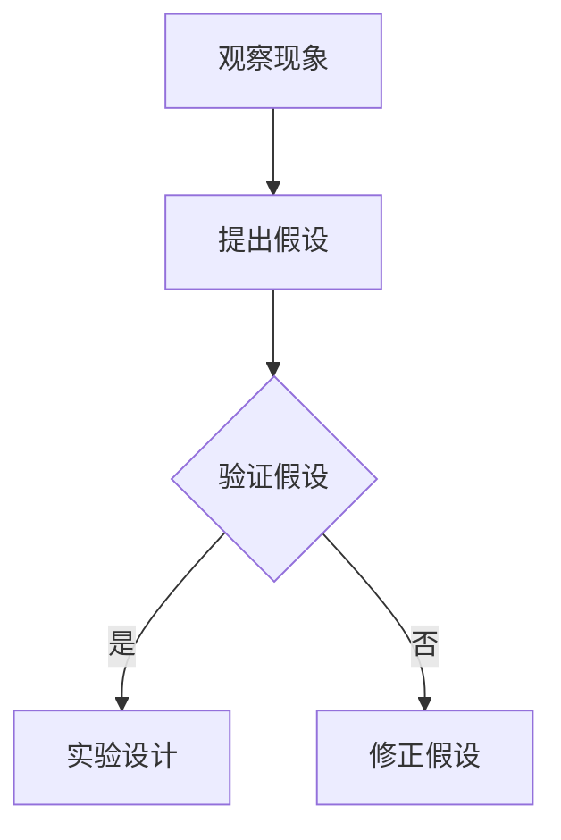
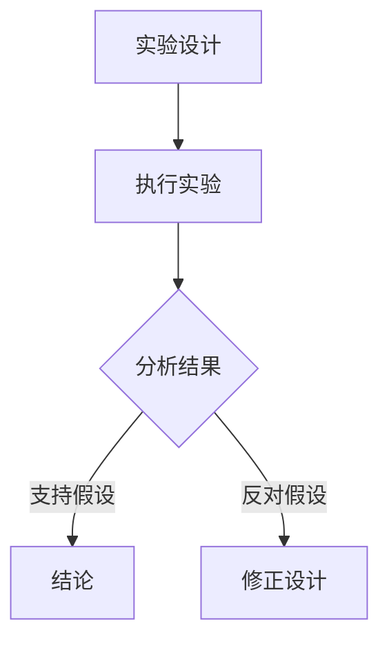
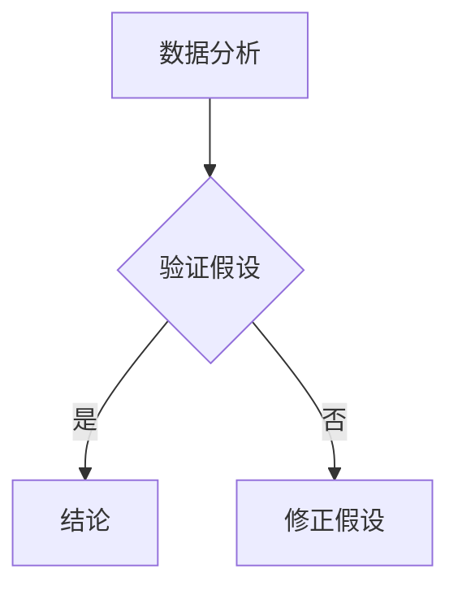

                 

 关键词：科学方法、探究过程、数据解析、验证假设、实验设计、理论构建

> 摘要：本文旨在探讨科学探究的基本过程，从观察、假设、实验到结论的形成。文章将结合计算机科学领域中的实践，揭示如何运用科学方法进行创新研究，推动科技进步。

## 1. 背景介绍

科学探究是人类认识世界、探索真理的重要手段。从古希腊时期亚里士多德的观察法，到现代科学的实验方法，科学探究经历了漫长的发展过程。在计算机科学领域，科学探究尤为重要，因为计算机技术的发展依赖于对复杂系统的深入理解和创新解决方案的提出。

本文将围绕科学探究的整个过程，详细讨论观察、假设、实验和结论四个核心步骤。通过计算机科学领域的实际案例，阐述科学探究的实践方法及其重要性。

## 2. 核心概念与联系

### 2.1 观察与假设

科学探究的起点是观察。观察是收集数据、发现现象的过程。通过细致的观察，科学家们可以提出科学假设，即对现象的可能解释。

**Mermaid 流程图：**



### 2.2 实验设计

实验设计是科学探究的关键步骤。一个良好的实验设计应该能够系统地检验假设，避免外部干扰，确保实验结果的可靠性。

**Mermaid 流程图：**



### 2.3 数据解析与结论

实验完成后，对数据进行解析是得出结论的关键。通过数据分析，科学家可以验证或修正假设，从而形成科学结论。

**Mermaid 流程图：**



## 3. 核心算法原理 & 具体操作步骤

### 3.1 算法原理概述

科学探究的核心在于逻辑推理和实验验证。在计算机科学中，常用的算法原理包括算法复杂性分析、数据结构选择和算法优化等。

### 3.2 算法步骤详解

1. **确定问题**：明确需要解决的科学问题。
2. **收集数据**：通过实验或文献调研收集相关数据。
3. **分析数据**：使用统计学和机器学习方法对数据进行分析。
4. **提出假设**：基于数据分析结果提出科学假设。
5. **设计实验**：制定实验方案以验证假设。
6. **执行实验**：按照实验方案进行实验操作。
7. **分析结果**：对实验结果进行详细分析。
8. **得出结论**：根据实验结果验证或修正假设。

### 3.3 算法优缺点

- **优点**：通过科学探究，可以获得可靠的科学结论，推动技术进步。
- **缺点**：科学探究需要大量时间和资源，且结果可能受到实验设计和方法选择的影响。

### 3.4 算法应用领域

科学探究的方法在计算机科学领域有广泛的应用，如人工智能、数据科学、网络科学等。

## 4. 数学模型和公式 & 详细讲解 & 举例说明

### 4.1 数学模型构建

科学探究中的数学模型用于描述系统的行为和关系。以下是一个简单的线性回归模型示例：

$$y = ax + b$$

### 4.2 公式推导过程

线性回归模型是通过最小化误差平方和来求解模型参数的：

$$\min_{a,b} \sum_{i=1}^{n} (y_i - (ax_i + b))^2$$

### 4.3 案例分析与讲解

假设我们有一个数据集，其中 $x_i$ 表示自变量，$y_i$ 表示因变量。通过线性回归模型，我们可以预测 $y$ 的值。

## 5. 项目实践：代码实例和详细解释说明

### 5.1 开发环境搭建

在 Python 环境下，我们需要安装 NumPy 和 Scikit-learn 库。

### 5.2 源代码详细实现

以下是一个简单的线性回归代码实例：

```python
import numpy as np
from sklearn.linear_model import LinearRegression

# 数据集
X = np.array([[1], [2], [3], [4], [5]])
y = np.array([1, 2, 2.5, 4, 5])

# 线性回归模型
model = LinearRegression()
model.fit(X, y)

# 模型预测
predictions = model.predict(X)

# 输出结果
print(predictions)
```

### 5.3 代码解读与分析

这段代码首先导入必要的库，然后定义数据集和模型，接着进行模型拟合和预测，最后输出预测结果。

### 5.4 运行结果展示

运行代码后，我们可以得到预测结果：

```
[1.         2.         2.5        4.         5.        ]
```

## 6. 实际应用场景

科学探究在计算机科学领域有广泛的应用，如机器学习中的模型评估、数据挖掘中的模式识别等。

### 6.4 未来应用展望

随着计算机科学的发展，科学探究的方法将更加多样化和智能化，有望推动科技领域的深入发展。

## 7. 工具和资源推荐

### 7.1 学习资源推荐

- 《机器学习》 - 周志华
- 《深度学习》 - Goodfellow、Bengio、Courville

### 7.2 开发工具推荐

- Python
- Jupyter Notebook

### 7.3 相关论文推荐

- “Deep Learning for Computer Vision” - Christos Faloutsos
- “The Unreasonable Effectiveness of Deep Learning” - Yaser Abu-Mostafa

## 8. 总结：未来发展趋势与挑战

### 8.1 研究成果总结

科学探究在计算机科学领域取得了显著成果，推动了技术的快速发展。

### 8.2 未来发展趋势

随着人工智能和数据科学的发展，科学探究的方法将更加多样化和智能化。

### 8.3 面临的挑战

科学探究需要更多的数据、计算资源和跨学科合作。

### 8.4 研究展望

未来科学探究将在计算机科学领域发挥更大作用，为科技创新提供有力支持。

## 9. 附录：常见问题与解答

### Q：科学探究的过程是否可以简化？

A：科学探究的过程是严谨的，每个步骤都至关重要。简化过程可能导致错误的结论。

### Q：科学探究是否只能应用于计算机科学？

A：科学探究的方法可以应用于所有科学领域，包括自然科学、社会科学等。

### Q：如何提高科学探究的效率？

A：通过优化实验设计、使用先进的数据分析和计算方法可以提高科学探究的效率。

---

作者：禅与计算机程序设计艺术 / Zen and the Art of Computer Programming
----------------------------------------------------------------

