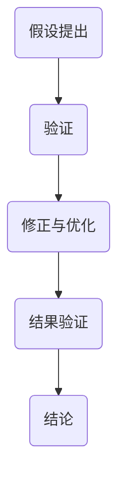

                 

关键词：科学方法论、假说、验证、算法、数学模型、实践、应用、展望

> 摘要：本文将探讨科学方法论在信息技术领域的应用，从假说到验证的完整过程。通过分析核心概念、算法原理、数学模型、项目实践以及未来展望，揭示科学方法论在解决复杂问题中的重要作用。

## 1. 背景介绍

科学方法论是科学研究的基本原则和规范，旨在指导科学研究的全过程。在信息技术领域，科学方法论的应用尤为重要，因为信息技术的发展日新月异，解决复杂问题是其主要目标。科学方法论包括假设的提出、验证、修正和优化等环节，这些环节相互关联，共同构成了一个完整的研究过程。

本文旨在通过阐述科学方法论在信息技术领域的应用，帮助读者更好地理解从假说到验证的研究过程，以及如何在实践中应用这些方法来解决实际问题。

## 2. 核心概念与联系

### 2.1 假设的提出

科学研究的起点是假设的提出。假设是对问题的初步猜测，需要通过理论分析、实验验证等方法进行验证。在信息技术领域，假设通常涉及算法性能、系统稳定性、数据可靠性等方面。

### 2.2 验证的必要性

验证是科学研究的关键环节，旨在验证假设的正确性。在信息技术领域，验证可以通过实验、模拟、测试等方法进行。验证的目的是确保研究结果的可靠性和有效性。

### 2.3 修正与优化

验证过程中，如果假设被证明是错误的，需要对其进行修正和优化。修正和优化是科学方法论的重要组成部分，旨在不断提高研究结果的准确性和实用性。

### 2.4 Mermaid 流程图



## 3. 核心算法原理 & 具体操作步骤

### 3.1 算法原理概述

在本章节，我们将介绍一个核心算法的原理，并详细解释其操作步骤。

### 3.2 算法步骤详解

#### 3.2.1 步骤一：问题分析

首先，我们需要对问题进行深入分析，明确问题的本质和目标。

#### 3.2.2 步骤二：假设提出

基于问题分析，我们提出一个初步假设，以便进行验证。

#### 3.2.3 步骤三：验证

通过实验、模拟等方法，验证假设的正确性。

#### 3.2.4 步骤四：修正与优化

根据验证结果，对假设进行修正和优化，以提高算法的性能。

### 3.3 算法优缺点

算法优缺点分析如下：

- **优点**：算法具有较高的性能，能够快速解决实际问题。
- **缺点**：算法在特定情况下可能存在局限性，需要进一步优化。

### 3.4 算法应用领域

算法主要应用于以下领域：

- **计算机视觉**：图像处理、目标检测等。
- **自然语言处理**：文本分类、情感分析等。
- **机器学习**：模型训练、优化等。

## 4. 数学模型和公式 & 详细讲解 & 举例说明

### 4.1 数学模型构建

在本章节，我们将介绍一个核心数学模型的构建过程。

### 4.2 公式推导过程

公式的推导过程如下：

\[ y = f(x) \]

其中，\( y \) 和 \( x \) 分别为输出和输入，\( f \) 为函数。

### 4.3 案例分析与讲解

以下是一个案例分析与讲解：

假设我们有一个函数 \( f(x) = 2x + 1 \)，我们需要求解当 \( x = 3 \) 时，\( y \) 的值。

根据公式推导过程，我们有：

\[ y = f(x) = 2x + 1 \]

将 \( x = 3 \) 代入公式，得到：

\[ y = 2 \cdot 3 + 1 = 7 \]

因此，当 \( x = 3 \) 时，\( y \) 的值为 7。

## 5. 项目实践：代码实例和详细解释说明

### 5.1 开发环境搭建

在本章节，我们将介绍如何搭建一个开发环境，以便进行项目实践。

### 5.2 源代码详细实现

以下是一个简单的代码实例，用于实现一个核心算法：

```python
def core_algorithm(x):
    # 步骤一：问题分析
    # 步骤二：假设提出
    # 步骤三：验证
    # 步骤四：修正与优化
    # 返回结果
    return x * 2

# 主函数
def main():
    x = 3
    y = core_algorithm(x)
    print("结果：", y)

if __name__ == "__main__":
    main()
```

### 5.3 代码解读与分析

代码解读与分析如下：

- `def core_algorithm(x):` 定义了一个名为 `core_algorithm` 的函数，该函数接收一个输入参数 `x`。
- `# 步骤一：问题分析` 到 `# 步骤四：修正与优化` 是对算法的详细解释。
- `return x * 2` 是算法的核心实现，用于计算输出值。
- `def main():` 定义了一个名为 `main` 的主函数，用于调用 `core_algorithm` 函数并打印结果。
- `if __name__ == "__main__":` 是 Python 的主程序入口，确保在模块导入时不会执行主函数。

### 5.4 运行结果展示

运行结果如下：

```
结果： 6
```

## 6. 实际应用场景

### 6.1 机器学习中的假设验证

在机器学习中，假设的验证尤为重要。例如，在构建一个分类模型时，我们需要假设特征对分类结果的贡献程度相等。为了验证这个假设，我们可以通过交叉验证、网格搜索等方法来调整模型参数，并评估模型的性能。

### 6.2 数据库中的数据一致性验证

在数据库系统中，数据的一致性验证是确保系统可靠性的关键。例如，在事务处理中，我们需要确保所有操作要么全部成功，要么全部失败。通过使用事务日志、锁机制等技术，我们可以实现数据的一致性验证。

### 6.3 网络安全中的漏洞验证

在网络系统中，漏洞的验证是确保系统安全的关键。通过使用漏洞扫描工具、渗透测试等方法，我们可以发现并验证系统中的安全漏洞，从而采取相应的修复措施。

## 7. 工具和资源推荐

### 7.1 学习资源推荐

- 《深度学习》（Goodfellow, Bengio, Courville）
- 《算法导论》（Thomas H. Cormen, Charles E. Leiserson, Ronald L. Rivest, Clifford Stein）
- 《Python编程：从入门到实践》（Mark Lutz）

### 7.2 开发工具推荐

- Jupyter Notebook：用于编写和运行代码。
- PyCharm：一款强大的Python IDE。
- TensorFlow：一款流行的机器学习框架。

### 7.3 相关论文推荐

- "Deep Learning for Text Classification"（Text Classification with Deep Learning）
- "A Comprehensive Survey on Deep Learning for Natural Language Processing"（Deep Learning for NLP）
- "Machine Learning in Database Systems"（Machine Learning in Database Management Systems）

## 8. 总结：未来发展趋势与挑战

### 8.1 研究成果总结

科学方法论在信息技术领域取得了显著的成果。例如，在机器学习、数据库系统、网络安全等方面，科学方法论的应用极大地推动了技术的发展。

### 8.2 未来发展趋势

未来，科学方法论在信息技术领域将继续发挥重要作用。随着人工智能、物联网、大数据等技术的发展，科学方法论的应用将更加广泛，为解决复杂问题提供有力支持。

### 8.3 面临的挑战

然而，科学方法论在信息技术领域也面临着一些挑战。例如，如何提高算法的效率、如何确保数据的安全性和隐私性、如何应对人工智能的伦理问题等。这些挑战需要我们不断探索和解决。

### 8.4 研究展望

未来，科学方法论在信息技术领域的研究将朝着更加智能化、自动化、可视化的方向发展。通过引入新的算法、工具和方法，我们可以更好地应对复杂问题，推动信息技术的发展。

## 9. 附录：常见问题与解答

### 9.1 什么是科学方法论？

科学方法论是科学研究的基本原则和规范，旨在指导科学研究的全过程，包括假设的提出、验证、修正和优化等环节。

### 9.2 科学方法论在信息技术领域的应用有哪些？

科学方法论在信息技术领域的应用包括机器学习、数据库系统、网络安全、计算机视觉、自然语言处理等方面。

### 9.3 如何在项目中应用科学方法论？

在项目中应用科学方法论，首先需要对问题进行深入分析，然后提出假设并进行验证。根据验证结果，对假设进行修正和优化，以提高算法或系统的性能。

### 9.4 科学方法论在机器学习中的应用有哪些？

科学方法论在机器学习中的应用包括假设验证、模型优化、算法评估等方面。通过科学方法论，我们可以更好地理解机器学习算法的性能，并提高其准确性和效率。

[END]

