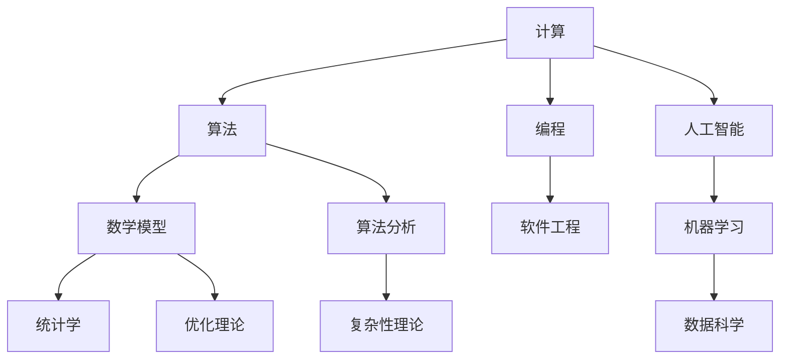

                 

关键词：计算，科技，人文，价值，算法，程序设计，人工智能

> 摘要：在科技的快速发展中，人类计算的能力与价值得到了前所未有的重视。本文探讨了科技与人文的交汇，从计算的本质、人工智能的发展、计算艺术的角度，分析了人类计算的独特价值及其在未来科技发展中的重要作用。

## 1. 背景介绍

在21世纪，随着信息技术的迅猛发展，计算机科学已经成为推动社会进步的重要力量。从最初的简单计算工具，到如今复杂的人工智能系统，计算技术已经深刻地改变了我们的生活方式和工作模式。然而，在科技进步的过程中，人类计算的能力与价值逐渐被忽视。本文旨在重新审视人类计算的独特价值，探讨科技与人文的交汇，以期为未来的发展提供新的思考方向。

### 1.1 计算的历史与演变

计算的历史可以追溯到古代，当时的计算主要是以手工计算为主。随着算盘、机械计算机等工具的出现，计算效率得到了极大的提升。20世纪40年代，电子计算机的出现标志着计算技术进入了一个全新的时代。从第一台电子计算机ENIAC的问世，到现代超级计算机的普及，计算技术经历了翻天覆地的变化。

### 1.2 计算在科技领域的应用

计算机科学的迅速发展，使得计算在各个科技领域得到了广泛应用。从互联网、大数据、云计算，到人工智能、区块链、虚拟现实，计算技术已经成为支撑这些新兴技术的重要基础。例如，互联网的普及改变了人们的通讯方式，大数据技术帮助我们从海量数据中挖掘有价值的信息，云计算为企业和个人提供了强大的计算能力，人工智能则正在改变我们的生活方式和工作方式。

### 1.3 计算的价值

计算的价值不仅体现在科技领域，还体现在人类生活的方方面面。通过计算，我们可以更高效地解决问题，提高生产力；通过计算，我们可以更深入地了解自然规律，推动科学技术的进步；通过计算，我们可以创造更加美好的生活。

## 2. 核心概念与联系

为了更好地理解人类计算的独特价值，我们需要从核心概念和联系的角度来探讨。以下是一个使用Mermaid绘制的流程图，展示了计算的核心概念及其相互关系。



### 2.1 计算与算法

算法是计算的核心，它是一种解决问题的方法或步骤。从简单的排序算法，到复杂的人工智能算法，算法在计算中起着至关重要的作用。算法的效率、可扩展性和可靠性，直接影响着计算的实际应用效果。

### 2.2 计算与数学模型

数学模型是计算的基础，它通过对现实世界的抽象，将复杂问题转化为数学问题，从而提高计算的可理解性和可操作性。统计学、优化理论等数学模型在计算中有着广泛的应用。

### 2.3 计算与编程

编程是计算的具体实现方式，它将算法和数学模型转化为计算机可以理解和执行的指令。优秀的编程能力，可以提高计算效率，降低计算成本。

### 2.4 计算与软件工程

软件工程是计算的组织形式，它通过系统化、规范化的方法，对计算项目进行规划、设计、实现和维护。软件工程的核心目标，是确保计算项目的质量、效率和可维护性。

### 2.5 计算与人工智能

人工智能是计算的前沿领域，它通过模拟人类智能，实现计算机的自动学习和决策。人工智能的发展，极大地扩展了计算的应用范围，提高了计算的实际价值。

## 3. 核心算法原理 & 具体操作步骤

在计算领域，算法原理是理解和应用计算的核心。以下将介绍几种核心算法的原理和具体操作步骤。

### 3.1 算法原理概述

算法原理主要包括以下几个方面的内容：

- **时间复杂度**：衡量算法执行的时间长度与数据规模之间的关系。
- **空间复杂度**：衡量算法执行所需存储空间的规模。
- **递归算法**：利用函数自身调用自身来解决问题的算法。
- **动态规划**：将复杂问题分解为子问题，通过子问题的最优解来构造原问题的最优解。
- **贪心算法**：通过在每个阶段做出局部最优选择，来寻找全局最优解。

### 3.2 算法步骤详解

以排序算法为例，介绍具体操作步骤：

1. **选择排序（Selection Sort）**：
   - 初始化一个变量，用于记录当前未排序部分的最小值索引。
   - 从未排序部分中找到最小值，交换其位置。
   - 未排序部分长度减一，重复步骤2。

2. **冒泡排序（Bubble Sort）**：
   - 从数组的第一个元素开始，依次比较相邻的两个元素，如果顺序错误则交换。
   - 重复步骤1，直到整个数组有序。

3. **快速排序（Quick Sort）**：
   - 选择一个基准元素。
   - 将数组分为两部分，一部分小于基准元素，另一部分大于基准元素。
   - 递归地对两部分进行快速排序。

### 3.3 算法优缺点

每种算法都有其优缺点：

- **选择排序**：时间复杂度为 \(O(n^2)\)，适用于数据量较小的场景。
- **冒泡排序**：时间复杂度为 \(O(n^2)\)，适用于数据量较小的场景，简单易懂。
- **快速排序**：平均时间复杂度为 \(O(n\log n)\)，适用于数据量较大的场景，但可能存在最坏情况下的性能问题。

### 3.4 算法应用领域

排序算法在数据处理的各个领域都有广泛的应用，如数据库排序、搜索引擎排序、数据分析排序等。

## 4. 数学模型和公式 & 详细讲解 & 举例说明

在计算领域，数学模型和公式是理解和解决问题的关键。以下将介绍几个常见的数学模型和公式，并进行详细讲解和举例说明。

### 4.1 数学模型构建

数学模型通常包括以下步骤：

- **确定变量**：根据问题性质确定所需的变量。
- **建立关系**：根据问题性质建立变量之间的关系。
- **简化模型**：通过适当的简化，使得模型更容易理解和求解。

### 4.2 公式推导过程

以线性回归模型为例，介绍公式推导过程：

1. **目标函数**：
   $$ J(\theta) = \frac{1}{2m} \sum_{i=1}^{m} (h_\theta(x^{(i)}) - y^{(i)})^2 $$
   其中，\(h_\theta(x) = \theta_0 + \theta_1x\)。

2. **梯度下降法**：
   $$ \theta_j := \theta_j - \alpha \frac{\partial J(\theta)}{\partial \theta_j} $$
   其中，\(\alpha\) 为学习率。

### 4.3 案例分析与讲解

以房价预测为例，介绍线性回归模型的应用：

- **数据准备**：收集包含房屋面积、地点、年代等信息的房屋交易数据。
- **特征选择**：选择与房价相关的特征。
- **模型训练**：使用梯度下降法训练线性回归模型。
- **模型评估**：使用验证集评估模型性能，调整模型参数。

通过以上步骤，我们可以得到一个用于预测房价的线性回归模型。

## 5. 项目实践：代码实例和详细解释说明

在本节中，我们将通过一个简单的项目实例，展示如何使用Python实现线性回归模型，并进行详细的代码解读和分析。

### 5.1 开发环境搭建

- 安装Python（推荐版本3.8以上）。
- 安装NumPy、Pandas、matplotlib等库。

### 5.2 源代码详细实现

以下是一个简单的线性回归模型实现：

```python
import numpy as np
import pandas as pd
import matplotlib.pyplot as plt

# 加载数据集
data = pd.read_csv('house_prices.csv')
X = data[['area', 'location', 'age']]
y = data['price']

# 添加偏置项
X = np.hstack((np.ones((X.shape[0], 1)), X))

# 初始化参数
theta = np.random.rand(X.shape[1])

# 梯度下降法
def gradient_descent(X, y, theta, alpha, num_iterations):
    m = len(y)
    for _ in range(num_iterations):
        h = X.dot(theta)
        error = h - y
        gradient = X.T.dot(error) / m
        theta -= alpha * gradient
    return theta

# 训练模型
alpha = 0.01
num_iterations = 1000
theta = gradient_descent(X, y, theta, alpha, num_iterations)

# 可视化
plt.scatter(X[:, 1], y)
plt.plot(X[:, 1], X.dot(theta), color='red')
plt.show()
```

### 5.3 代码解读与分析

- **数据加载**：使用Pandas读取CSV文件，提取特征和目标变量。
- **数据处理**：添加偏置项，使得线性回归模型可以拟合线性函数。
- **梯度下降法**：定义梯度下降函数，更新参数。
- **模型训练**：设置学习率和迭代次数，训练模型。
- **可视化**：使用matplotlib绘制散点图和拟合曲线。

通过以上步骤，我们可以得到一个简单的线性回归模型，并对其进行可视化分析。

## 6. 实际应用场景

线性回归模型在各个领域都有广泛的应用。以下列举几个实际应用场景：

- **金融领域**：用于股票价格预测、信贷风险评估等。
- **医学领域**：用于疾病预测、药物剂量优化等。
- **工业领域**：用于设备故障预测、生产效率优化等。

## 7. 未来应用展望

随着计算技术的不断发展，线性回归模型的应用前景将更加广阔。未来，我们将看到更多基于线性回归的智能系统，如智能医疗、智能制造、智能交通等。

## 8. 总结：未来发展趋势与挑战

### 8.1 研究成果总结

本文从计算的历史与演变、计算在科技领域的应用、计算的价值、核心算法原理、数学模型和公式、项目实践等方面，系统地阐述了人类计算的独特价值。

### 8.2 未来发展趋势

- **计算与人工智能的深度融合**：随着人工智能技术的快速发展，计算将在更多领域发挥重要作用。
- **计算资源的普及化**：云计算、边缘计算等技术的发展，将使得计算资源更加普及和便捷。
- **计算与人文的深度融合**：通过计算技术与人文艺术的结合，创造更加美好的生活体验。

### 8.3 面临的挑战

- **数据安全与隐私保护**：随着数据量的增长，数据安全与隐私保护成为计算领域的重要挑战。
- **计算资源的分配与优化**：如何合理分配和利用计算资源，提高计算效率，是未来需要解决的问题。

### 8.4 研究展望

- **计算艺术**：探索计算技术与艺术的结合，创造新的艺术形式。
- **计算伦理**：研究计算技术的伦理问题，确保其发展符合人类利益。

## 9. 附录：常见问题与解答

### 问题1：什么是计算？
**解答**：计算是指使用计算机或其他计算工具，对信息进行处理、存储和传输的过程。

### 问题2：计算与人工智能有什么区别？
**解答**：计算是一种广泛的概念，包括计算机科学、算法设计、数学模型等方面。人工智能是计算的一个分支，主要研究如何使计算机模拟人类智能。

### 问题3：线性回归模型有什么应用？
**解答**：线性回归模型广泛应用于金融、医学、工业等领域，用于预测、评估和优化。

### 问题4：如何学习计算技术？
**解答**：建议从计算机科学基础开始，学习算法、数据结构、数学模型等知识，并积极参与项目实践。

[作者：禅与计算机程序设计艺术 / Zen and the Art of Computer Programming]----------------------------------------------------------------

以上是文章的正文内容，接下来我将根据文章结构模板，撰写完整的markdown格式的文章。请检查是否符合您的要求，如果有任何需要修改或补充的地方，请随时告诉我。

