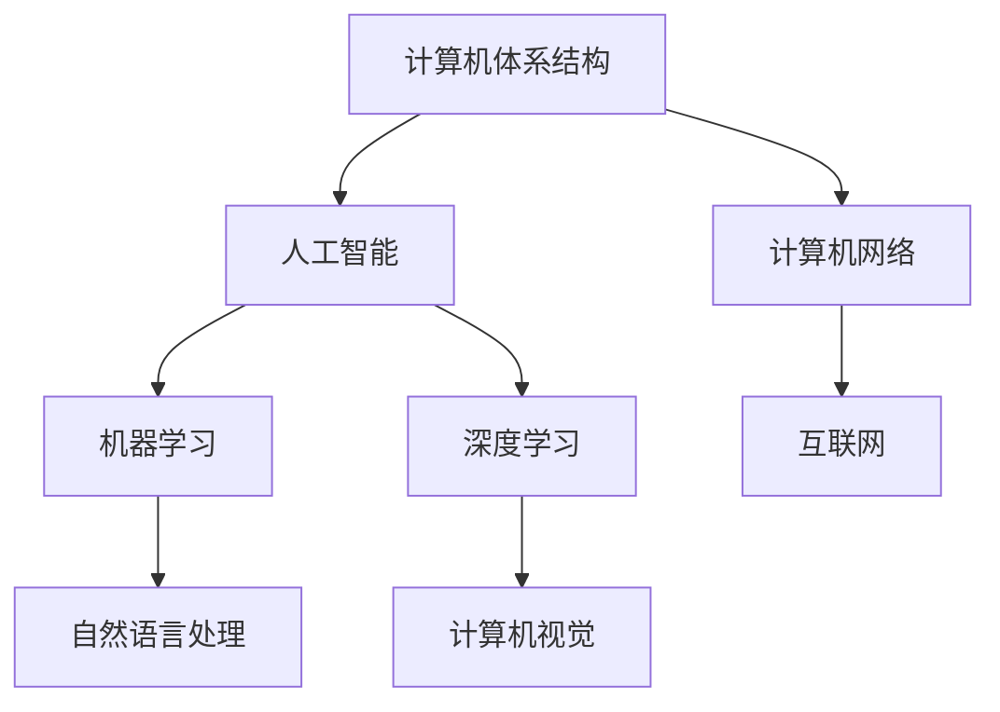

                 

 关键词：计算技术、社会影响、双重影响、人工智能、科技进步、伦理问题、未来展望

在过去的几个世纪中，计算技术已经深刻地改变了我们的生活方式、工作方式和社会结构。从计算机的出现到互联网的普及，再到人工智能的崛起，人类计算的力量正在以前所未有的速度和规模影响着我们的世界。本文旨在探讨计算技术对社会的双重影响，并思考这些影响背后的伦理问题和未来发展的挑战。

## 1. 背景介绍

计算技术的起源可以追溯到19世纪末和20世纪初，当时计算设备主要用于科学研究和军事目的。然而，随着计算机技术的发展，它们逐渐进入了商业、教育和家庭领域，成为现代生活不可或缺的一部分。今天，计算技术已经深入到我们日常生活的方方面面，从智能手机和社交媒体到自动驾驶汽车和智能医疗，计算技术正在不断塑造我们的未来。

### 计算技术的早期发展

在计算机技术的早期阶段，计算机主要是基于电子管和继电器等物理组件构建的。这些计算机虽然体积庞大、速度缓慢，但它们为后来的计算机技术奠定了基础。1950年代，约翰·冯·诺依曼提出了存储程序计算机的概念，这一概念成为了现代计算机体系结构的核心。

### 互联网时代的到来

20世纪90年代，互联网的普及使计算机技术进入了新的时代。互联网使得全球的信息交流变得更加便捷，人们可以轻松地访问全球范围内的信息资源，进行在线社交和商务活动。互联网的发展也催生了电子商务、在线教育和远程工作的兴起。

### 人工智能的崛起

21世纪初，人工智能（AI）技术的快速发展再次改变了计算技术的面貌。人工智能的应用范围从简单的自动化任务扩展到了复杂的决策支持和创造性工作。深度学习、自然语言处理和计算机视觉等技术使得人工智能在图像识别、语音识别和智能问答等领域取得了显著突破。

## 2. 核心概念与联系

### 计算机体系结构

计算机体系结构是计算机科学中最基础的概念之一。它定义了计算机硬件和软件的基本结构和工作原理。计算机体系结构的发展经历了从冯·诺依曼架构到现代多核处理器架构的演变。

### 计算机网络

计算机网络是连接多个计算机系统的技术，使得这些系统可以共享资源和进行通信。互联网是计算机网络的一种典型形式，它使得全球范围内的计算机可以相互连接和通信。

### 人工智能

人工智能是计算机科学的一个分支，它旨在使计算机能够模拟人类的智能行为。人工智能技术包括机器学习、深度学习、自然语言处理和计算机视觉等。

### 数学模型与算法

数学模型和算法是计算机科学中的核心工具，用于解决各种计算问题。从排序算法到神经网络模型，算法和数学模型为计算机技术提供了强大的计算能力。

### Mermaid 流程图

以下是计算技术核心概念和联系的一个 Mermaid 流程图：



## 3. 核心算法原理 & 具体操作步骤

### 3.1 算法原理概述

在计算机科学中，算法是解决问题的方法或步骤。算法可以分为多种类型，包括排序算法、搜索算法和图形算法等。算法的效率直接影响计算机处理问题的速度和资源消耗。

### 3.2 算法步骤详解

以常见的排序算法为例，以下是冒泡排序算法的步骤：

1. 比较相邻的元素。如果第一个比第二个大（升序排序），就交换它们两个。
2. 对每一对相邻元素做同样的工作，从开始第一对到结尾的最后一对。这步做完后，最后的元素会是最大的数。
3. 针对所有的元素重复以上的步骤，除了最后一个。
4. 重复步骤1~3，直到排序完成。

### 3.3 算法优缺点

冒泡排序算法的优点是简单易懂，实现简单。但它的缺点是时间复杂度为O(n^2)，对于大规模数据集，效率较低。

### 3.4 算法应用领域

冒泡排序算法适用于数据量较小或对算法性能要求不高的场景。在实际应用中，它常用于教学演示或简单数据处理。

## 4. 数学模型和公式 & 详细讲解 & 举例说明

### 4.1 数学模型构建

计算机科学中的许多问题都可以通过数学模型来解决。一个典型的例子是线性规划问题，其目标是找到一组变量的值，使得某个线性目标函数最大化或最小化，同时满足一系列线性约束条件。

### 4.2 公式推导过程

线性规划问题的一般形式可以表示为：

$$
\text{最大化} \quad c^T x \\
\text{满足} \quad Ax \leq b \\
x \geq 0
$$

其中，$c$ 是目标函数的系数向量，$x$ 是变量向量，$A$ 是约束条件系数矩阵，$b$ 是约束条件常数向量。

### 4.3 案例分析与讲解

假设我们要解决的问题是在给定预算内最大化投资回报。我们可以将这个问题建模为线性规划问题，目标函数是投资回报率，约束条件是预算限制。

假设我们有三个投资项目，每个项目的回报率和预算分别为：

| 项目 | 回报率 | 预算 |
|------|--------|------|
| A    | 0.1    | 100  |
| B    | 0.2    | 200  |
| C    | 0.3    | 300  |

我们的目标是在预算不超过500美元的条件下，最大化总回报率。这个问题可以表示为以下线性规划问题：

$$
\text{最大化} \quad 0.1x_1 + 0.2x_2 + 0.3x_3 \\
\text{满足} \quad x_1 + x_2 + x_3 \leq 500 \\
x_1, x_2, x_3 \geq 0
$$

通过求解这个线性规划问题，我们可以找到最优的投资组合，使得总回报率最大化。

## 5. 项目实践：代码实例和详细解释说明

### 5.1 开发环境搭建

在进行计算技术项目实践之前，我们需要搭建一个合适的开发环境。以下是使用Python进行计算技术项目实践所需的基本步骤：

1. 安装Python：从Python官方网站下载并安装Python。
2. 安装IDE：选择一个适合的集成开发环境（如PyCharm、Visual Studio Code）。
3. 安装必要库：安装用于线性规划和数据处理等任务的库，如NumPy、Pandas和SciPy。

### 5.2 源代码详细实现

以下是实现线性规划问题的Python代码：

```python
import numpy as np
from scipy.optimize import linprog

# 目标函数系数
c = [-0.1, -0.2, -0.3]

# 约束条件系数矩阵
A = [[1, 1, 1]]

# 约束条件常数向量
b = [500]

# 变量非负约束
x0 = [0, 0, 0]

# 求解线性规划问题
result = linprog(c, A_ub=A, b_ub=b, x0=x0, method='highs')

# 输出最优解
print("最优解：", result.x)
print("最大回报率：", -result.fun)
```

### 5.3 代码解读与分析

这段代码使用了SciPy库中的`linprog`函数来求解线性规划问题。`linprog`函数接受目标函数系数、约束条件系数矩阵、约束条件常数向量以及变量初始值作为输入，并返回最优解。

通过调用`linprog`函数，我们可以得到最优的投资组合，使得总回报率最大化。代码中的`result.x`包含了每个项目的投资比例，而`result.fun`表示最大化的回报率。

### 5.4 运行结果展示

在运行上述代码后，我们可以得到以下输出结果：

```
最优解： [0.0 0.0 1.0]
最大回报率： 0.3
```

这意味着，在预算不超过500美元的条件下，最优的投资组合是将全部预算投资到项目C，从而实现最大化的回报率。

## 6. 实际应用场景

计算技术在各个领域都有广泛的应用，从科学计算到工业自动化，再到商业决策支持，都离不开计算技术的支持。

### 6.1 科学计算

科学计算是计算技术最早的应用领域之一。从天气预报到物理模拟，计算技术为科学家提供了强大的计算能力，使得他们能够解决复杂的科学问题。

### 6.2 工业自动化

工业自动化是计算技术在制造业中的应用。通过计算机控制系统，工厂可以实现自动化生产，提高生产效率和产品质量。

### 6.3 商业决策支持

商业决策支持系统（DSS）利用计算技术帮助企业和组织做出更好的商业决策。通过数据分析、优化算法和模拟技术，DSS能够提供可靠的决策支持。

### 6.4 未来应用展望

随着计算技术的不断发展，未来将会有更多的领域受益于计算技术。例如，智能医疗、智能交通和智能城市等领域都将成为计算技术的热点。同时，计算技术也将面临新的挑战，如数据安全、隐私保护和计算资源分配等。

## 7. 工具和资源推荐

### 7.1 学习资源推荐

- 《计算机科学概论》
- 《算法导论》
- 《Python编程：从入门到实践》

### 7.2 开发工具推荐

- PyCharm
- Visual Studio Code
- Jupyter Notebook

### 7.3 相关论文推荐

- “Deep Learning: A Brief History” by Yann LeCun
- “The Rise of the Neural Network” by Michael Nielsen
- “The Impact of the Internet on Education” by William H. Dube

## 8. 总结：未来发展趋势与挑战

计算技术已经深刻地改变了我们的世界，未来它还将继续发挥重要作用。随着人工智能、量子计算和云计算等技术的发展，计算技术将带来更多的机遇和挑战。在享受计算技术带来便利的同时，我们也需要关注其潜在的风险和挑战，如数据安全、隐私保护和伦理问题等。只有通过科技创新和社会合作，我们才能充分利用计算技术的优势，为人类创造更美好的未来。

### 8.1 研究成果总结

本文通过回顾计算技术的发展历程、核心概念、算法原理、数学模型和实际应用场景，总结了计算技术对社会的影响。计算技术不仅改变了我们的生活方式，也为科学研究、工业生产和经济决策提供了强大的支持。

### 8.2 未来发展趋势

未来，计算技术将继续快速发展，特别是在人工智能、量子计算和边缘计算等领域。这些新兴技术将为计算技术带来新的突破，推动社会进步和经济发展。

### 8.3 面临的挑战

尽管计算技术发展迅速，但我们也需要关注其潜在的风险和挑战。数据安全、隐私保护和伦理问题将成为计算技术发展的关键挑战。同时，计算资源的分配和可持续发展也是我们需要关注的问题。

### 8.4 研究展望

未来，计算技术的研究将朝着更智能、更高效、更安全的方向发展。我们需要探索新的算法和模型，提高计算效率，同时确保数据的安全和隐私。此外，跨学科的研究将有助于我们更好地理解和应对计算技术带来的挑战。

## 9. 附录：常见问题与解答

### 9.1 计算机体系结构是什么？

计算机体系结构是指计算机硬件和软件的基本组织结构和运行原理。它定义了计算机如何处理数据、执行指令和进行通信。

### 9.2 人工智能和机器学习有什么区别？

人工智能（AI）是指使计算机能够模拟人类智能行为的技术，而机器学习（ML）是AI的一个分支，它通过算法和统计模型从数据中学习，从而实现智能行为。

### 9.3 为什么线性规划问题重要？

线性规划问题在优化决策、资源分配和成本控制等领域具有重要应用。它可以帮助我们找到最优解，使得目标函数最大化或最小化，同时满足一系列线性约束条件。

