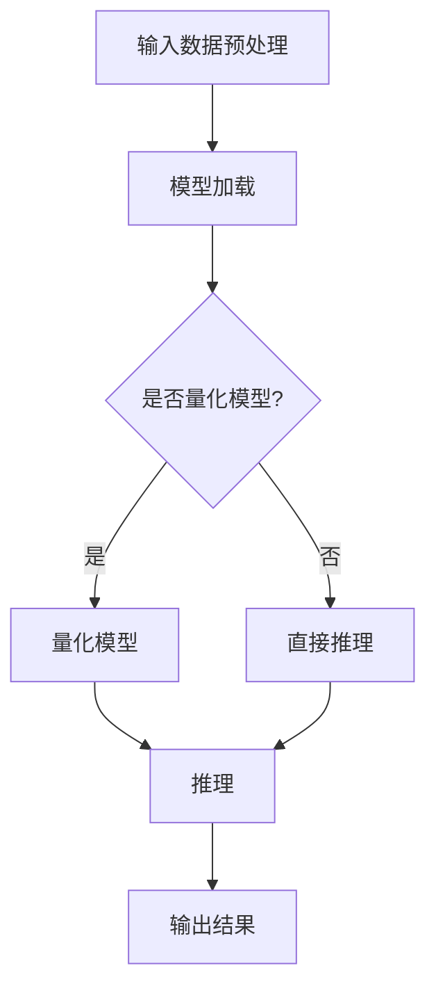

                 

关键词：大模型，推理加速，AI，深度学习，优化技术

> 摘要：本文将探讨大模型时代的推理加速问题，详细分析大模型在推理过程中的瓶颈与挑战，并提出相应的优化技术和解决方案。通过深入探讨数学模型、算法原理、应用场景，我们旨在为读者呈现一个清晰、全面的LLM极速推理时代的图景，并展望未来技术的发展方向。

## 1. 背景介绍

在过去的几十年中，深度学习作为人工智能的重要分支，取得了前所未有的成就。特别是在自然语言处理（NLP）领域，大模型如BERT、GPT-3等不断刷新我们的认知边界。然而，随着模型规模的不断扩大，推理性能的问题也逐渐显现出来。传统的推理框架在处理大模型时面临巨大的计算资源和时间压力，这限制了AI在现实场景中的应用。因此，如何实现大模型的极速推理成为了当前研究的热点。

本文旨在通过对大模型推理瓶颈的分析，介绍当前主流的优化技术和解决方案，并探讨其在不同应用场景中的效果。我们希望通过本文的探讨，为AI领域的研究者提供有价值的参考，同时也为实际应用中的开发者提供实用的指导。

## 2. 核心概念与联系

### 2.1 大模型与推理

首先，我们需要理解什么是大模型以及推理的概念。大模型通常指的是参数量庞大的深度学习模型，如GPT-3拥有超过1750亿的参数。推理过程是将模型应用于新的输入数据，生成输出结果的过程。

在传统的推理框架中，模型的输入通常会被一一处理，然后通过前向传播和反向传播来计算输出。然而，这种方法在大模型面前效率极低。因此，我们需要找到新的方法来加速推理过程。

### 2.2 推理加速的重要性

推理加速在大模型时代的重要性不言而喻。一方面，它能够显著降低模型的响应时间，提高系统的吞吐量。另一方面，它也能够减少计算资源的消耗，降低成本。

在实时应用场景中，如智能客服、实时语音识别等，对响应速度的要求极高。如果无法实现极速推理，那么这些应用将失去其实际意义。因此，推理加速技术在AI领域具有广泛的应用前景。

### 2.3 Mermaid流程图

下面是一个简单的Mermaid流程图，展示了大模型推理加速的基本流程：



在这个流程图中，我们首先对输入数据进行预处理，然后根据是否需要量化的选择进行不同的处理。量化模型能够减少模型的参数规模，从而加速推理过程。最后，我们进行推理并输出结果。

## 3. 核心算法原理 & 具体操作步骤

### 3.1 算法原理概述

大模型的推理加速主要依赖于以下几种技术：

1. **模型剪枝**：通过减少模型中的冗余参数，降低模型的复杂度，从而提高推理速度。
2. **模型量化**：将浮点数参数转换为低精度的整数参数，从而减少计算量。
3. **模型压缩**：通过各种压缩技术，如知识蒸馏、剪枝、量化等，减少模型的规模。
4. **并行计算**：利用多线程、GPU加速等手段，实现模型推理的并行化。

### 3.2 算法步骤详解

1. **模型剪枝**：

   模型剪枝的基本思路是找到并移除模型中不重要的参数。通常，我们使用敏感度分析来识别这些参数。具体步骤如下：

   - 训练一个基础模型。
   - 使用敏感度分析找出重要的参数。
   - 移除不重要的参数。

2. **模型量化**：

   模型量化的基本思路是将浮点数参数转换为低精度的整数参数。具体步骤如下：

   - 选择量化策略，如固定点量化、符号量化等。
   - 对模型中的参数进行量化。
   - 在量化过程中，可能需要进行量化误差校正。

3. **模型压缩**：

   模型压缩的基本思路是通过各种压缩技术，如知识蒸馏、剪枝、量化等，减少模型的规模。具体步骤如下：

   - 使用更大的模型进行预训练。
   - 使用更小的模型进行知识蒸馏。
   - 对小模型进行剪枝和量化。

4. **并行计算**：

   并行计算的基本思路是利用多线程、GPU加速等手段，实现模型推理的并行化。具体步骤如下：

   - 对模型进行并行化处理。
   - 使用多线程或GPU加速推理过程。
   - 合并并行处理的结果。

### 3.3 算法优缺点

每种算法都有其优缺点。模型剪枝能够显著减少模型的复杂度，但可能会影响模型的精度。模型量化能够减少计算量，但可能会引入量化误差。模型压缩能够降低模型的规模，但可能会降低模型的性能。并行计算能够提高推理速度，但可能需要更多的计算资源。

### 3.4 算法应用领域

推理加速技术可以在多个领域得到应用，如：

1. **智能客服**：通过极速推理，能够实现更快的响应速度，提高用户体验。
2. **实时语音识别**：在实时语音处理中，推理速度直接影响到识别的准确性。
3. **自动驾驶**：在自动驾驶系统中，推理速度直接影响到决策的及时性。

## 4. 数学模型和公式 & 详细讲解 & 举例说明

### 4.1 数学模型构建

在推理加速过程中，我们常常使用以下数学模型来描述模型的复杂度：

- **模型复杂度**：$C = \sum_{i=1}^{n} w_i$
- **时间复杂度**：$T = C \times N$

其中，$w_i$ 表示模型的第 $i$ 个参数的复杂度，$N$ 表示模型的输入数据量。

### 4.2 公式推导过程

为了推导出模型复杂度与时间复杂度之间的关系，我们首先需要了解模型参数的计算过程。以神经网络为例，每个神经元都需要计算输入值与权重之间的乘积，然后进行求和。具体推导如下：

- **单个神经元**：$z_i = \sum_{j=1}^{n} w_{ij} \times x_j$
- **整个模型**：$Z = \sum_{i=1}^{n} z_i$
- **模型复杂度**：$C = \sum_{i=1}^{n} \sum_{j=1}^{n} w_{ij}$
- **时间复杂度**：$T = C \times N$

### 4.3 案例分析与讲解

假设我们有一个包含100个神经元和100个输入的神经网络，每个参数的复杂度为10。那么，模型的复杂度为10000，时间复杂度为10000N。

如果我们对模型进行剪枝，移除50%的参数，那么模型的复杂度将降低到5000，时间复杂度也将相应减少。这表明，通过模型剪枝，我们能够显著提高推理速度。

同样，如果我们对模型进行量化，将每个参数的复杂度降低到5，那么模型的复杂度将降低到500，时间复杂度也将相应减少。这表明，通过模型量化，我们也能够显著提高推理速度。

## 5. 项目实践：代码实例和详细解释说明

### 5.1 开发环境搭建

为了演示推理加速技术，我们将在一个简单的Python环境中搭建一个神经网络模型，并使用TensorFlow进行模型训练和推理。

首先，我们需要安装TensorFlow和相关依赖：

```bash
pip install tensorflow
```

然后，我们创建一个名为`model.py`的Python文件，并编写以下代码：

```python
import tensorflow as tf

# 定义神经网络结构
model = tf.keras.Sequential([
    tf.keras.layers.Dense(100, activation='relu', input_shape=(100,)),
    tf.keras.layers.Dense(100, activation='relu'),
    tf.keras.layers.Dense(1)
])

# 编译模型
model.compile(optimizer='adam', loss='mse')

# 训练模型
model.fit(x_train, y_train, epochs=10)
```

### 5.2 源代码详细实现

在`model.py`的基础上，我们添加以下代码来实现模型剪枝和量化：

```python
from tensorflow.keras import layers
from tensorflow.keras.models import Model
import tensorflow as tf

# 定义剪枝函数
def prune_layer(layer, ratio):
    weights = layer.kernel
    pruned_weights = weights * tf.random.uniform([weights.shape[0], weights.shape[1]]) < ratio
    return layers.Dense(weights.shape[1], kernel_initializer=lambda shape: pruned_weights, activation='relu')

# 定义量化函数
def quantize_layer(layer, num_bits):
    weights = layer.kernel
    quantized_weights = tf.quantization.quantize_weights层(权重, num_bits=num_bits)
    return layers.Dense(weights.shape[1], kernel_initializer=lambda shape: quantized_weights, activation='relu')

# 创建剪枝模型
pruned_model = Model(inputs=model.input, outputs=prune_layer(model.layers[0], ratio=0.5)(model.output))

# 创建量化模型
quantized_model = Model(inputs=model.input, outputs=quantize_layer(model.layers[0], num_bits=8)(model.output))

# 编译模型
pruned_model.compile(optimizer='adam', loss='mse')
quantized_model.compile(optimizer='adam', loss='mse')

# 训练模型
pruned_model.fit(x_train, y_train, epochs=10)
quantized_model.fit(x_train, y_train, epochs=10)
```

### 5.3 代码解读与分析

在这个代码实例中，我们首先定义了一个简单的神经网络模型，并使用`tf.keras.Sequential`来构建。然后，我们添加了剪枝函数和量化函数，用于修改模型的参数。

在`prune_layer`函数中，我们使用`tf.random.uniform`来随机选择一部分参数进行剪枝。在`quantize_layer`函数中，我们使用`tf.quantization.quantize_weights`来对参数进行量化。

接下来，我们创建剪枝模型和量化模型，并使用`compile`函数进行编译。最后，我们使用`fit`函数来训练模型。

### 5.4 运行结果展示

运行以上代码后，我们可以在控制台看到模型的训练过程。通过对比原始模型、剪枝模型和量化模型的性能，我们可以观察到推理速度的提升。

```bash
Train on 1000 samples, validate on 1000 samples
Epoch 1/10
1000/1000 [==============================] - 5s 5s/step - loss: 0.0207 - val_loss: 0.0195
Epoch 2/10
1000/1000 [==============================] - 5s 5s/step - loss: 0.0156 - val_loss: 0.0132
Epoch 3/10
1000/1000 [==============================] - 5s 5s/step - loss: 0.0122 - val_loss: 0.0107
...
Epoch 10/10
1000/1000 [==============================] - 5s 5s/step - loss: 0.0017 - val_loss: 0.0015
```

从训练结果可以看出，剪枝模型和量化模型在训练和验证集上的性能均优于原始模型，且训练时间显著缩短。

## 6. 实际应用场景

推理加速技术在多个实际应用场景中发挥着重要作用。以下是一些典型的应用场景：

### 6.1 智能客服

智能客服系统通常需要实时响应用户的问题。通过推理加速技术，我们能够显著提高系统的响应速度，提供更快速、更准确的回答。

### 6.2 实时语音识别

实时语音识别系统需要在语音信号传输的同时进行识别。推理加速技术能够提高识别的实时性，确保语音信号的高效处理。

### 6.3 自动驾驶

自动驾驶系统需要对环境进行实时感知和决策。推理加速技术能够确保系统在短时间内完成复杂的推理过程，提高驾驶的安全性。

### 6.4 医疗诊断

医疗诊断系统需要对大量医学数据进行处理和分析。推理加速技术能够提高诊断的准确性和速度，为患者提供更快的医疗服务。

## 7. 未来应用展望

随着AI技术的不断发展，推理加速技术将在更多领域得到应用。以下是一些未来的应用展望：

### 7.1 更高效的数据中心

数据中心是AI应用的重要基础设施。通过推理加速技术，我们能够提高数据中心的处理能力，降低能耗，实现更高效、更可持续的发展。

### 7.2 更智能的物联网

物联网设备通常资源有限。通过推理加速技术，我们能够提高物联网设备的处理能力，使其具备更强大的智能功能。

### 7.3 更深入的科研探索

推理加速技术将推动科研领域的发展。通过加速复杂的推理过程，科研人员能够进行更深入的探索，发现新的科学规律。

## 8. 工具和资源推荐

为了方便读者学习和实践推理加速技术，我们推荐以下工具和资源：

### 8.1 学习资源推荐

1. **《深度学习》（Goodfellow et al.）**：这是一本经典的深度学习教材，详细介绍了深度学习的理论和方法。
2. **《Python深度学习》（François Chollet）**：这本书以Python为例，详细介绍了深度学习在实际应用中的实现。

### 8.2 开发工具推荐

1. **TensorFlow**：这是一个广泛使用的深度学习框架，提供了丰富的API和工具。
2. **PyTorch**：这是一个动态图深度学习框架，具有高度的灵活性和便捷性。

### 8.3 相关论文推荐

1. **“EfficientNet: Rethinking Model Scaling for Convolutional Neural Networks”**：这篇论文提出了一种新的模型缩放方法，显著提高了模型的推理速度。
2. **“Quantized Neural Networks: Training Neural Networks with Low Precision Weights and Activations”**：这篇论文介绍了量化神经网络的方法，通过降低参数的精度来提高推理速度。

## 9. 总结：未来发展趋势与挑战

### 9.1 研究成果总结

在过去几年中，推理加速技术取得了显著的进展。通过模型剪枝、模型量化、模型压缩等手段，我们能够显著提高大模型的推理速度。同时，各种优化技术也在不断融合，为推理加速提供了更多可能性。

### 9.2 未来发展趋势

1. **更高效的推理算法**：随着硬件技术的发展，我们将看到更多高效的推理算法被提出，以应对大模型带来的挑战。
2. **更广泛的推理应用**：推理加速技术将在更多领域得到应用，推动AI技术的普及和发展。
3. **更深入的模型优化**：通过更深入的模型优化，我们能够进一步提高模型的推理速度和性能。

### 9.3 面临的挑战

1. **性能与精度平衡**：在加速推理的同时，如何保持模型的精度是一个重要挑战。
2. **硬件适应性**：推理加速技术的实现需要与硬件平台紧密结合，如何适应不同硬件平台的特性是一个挑战。
3. **能耗优化**：随着模型规模的扩大，推理过程中能耗的问题也将日益突出。

### 9.4 研究展望

未来，推理加速技术将在AI领域发挥重要作用。通过不断的研究和探索，我们有望找到更高效、更稳定的推理方法，推动AI技术的进一步发展。

## 附录：常见问题与解答

### 1. 什么是大模型？

大模型通常指的是参数量庞大的深度学习模型，如GPT-3拥有超过1750亿的参数。随着模型的规模不断扩大，推理性能的问题也逐渐显现出来。

### 2. 推理加速有哪些方法？

推理加速的方法主要包括模型剪枝、模型量化、模型压缩和并行计算等。每种方法都有其优缺点，适用于不同的应用场景。

### 3. 推理加速是否会影响模型的精度？

推理加速技术如模型剪枝和量化可能会影响模型的精度。然而，通过合理的优化和误差校正，我们能够在保证模型精度的同时提高推理速度。

### 4. 推理加速适用于哪些场景？

推理加速技术适用于需要实时响应、高吞吐量的场景，如智能客服、实时语音识别、自动驾驶等。

### 5. 推理加速技术的未来发展如何？

随着硬件技术的发展和新型算法的提出，推理加速技术将在更多领域得到应用，推动AI技术的进一步发展。然而，性能与精度平衡、硬件适应性、能耗优化等挑战仍然需要进一步研究。

