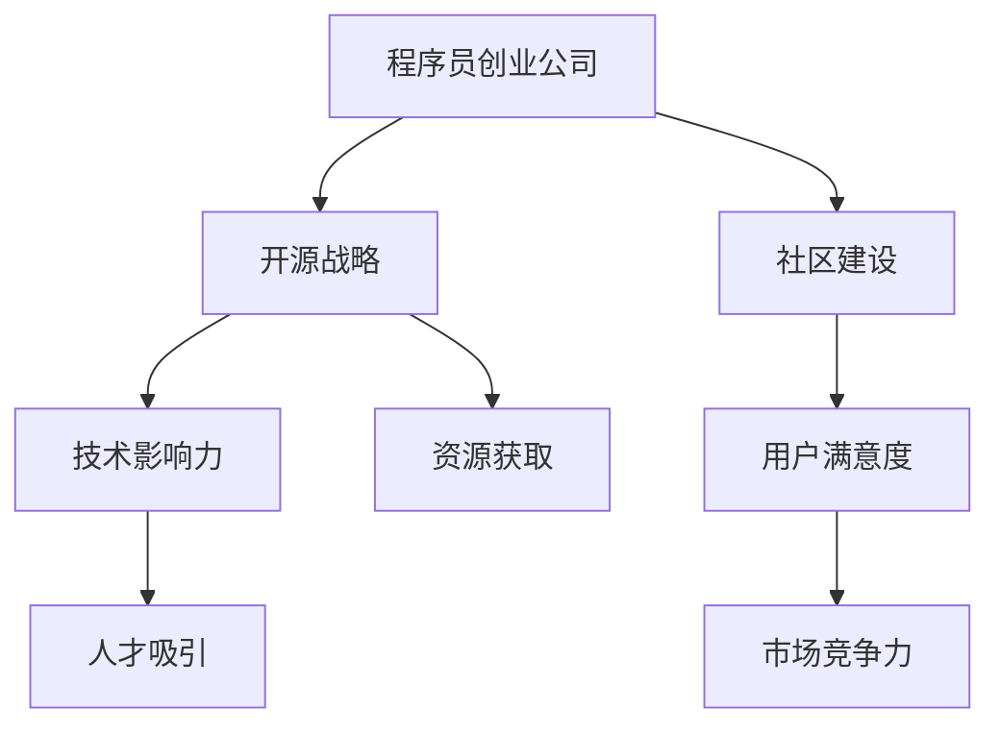

                 

关键词：开源战略、社区建设、程序员创业公司、技术影响力、开源协作

摘要：本文将探讨程序员创业公司在当今技术领域中的开源战略和社区建设的重要性。通过分析开源对创业公司的影响、社区建设的方法以及如何通过开源实现技术影响力，本文旨在为创业者提供实用的策略和指导。

## 1. 背景介绍

在当今数字化时代，开源软件已经成为软件开发的主流模式。越来越多的程序员选择将自己的代码开源，以便全球的开发者可以自由地使用、修改和分发。这种现象不仅促进了技术的传播和共享，也为创业者提供了一个全新的商业模式。程序员创业公司通过开源战略，不仅可以吸引更多的人才和资源，还可以在市场竞争中占据有利位置。

然而，开源并不是一蹴而就的过程。创业者需要深入了解开源社区的运作规律，制定合适的开源战略，并积极建设社区。本文将围绕这三个方面展开讨论，旨在帮助程序员创业公司实现开源战略的成功。

## 2. 核心概念与联系

### 2.1 开源软件的定义

开源软件（Open Source Software，简称OSS）是指软件的源代码可以被公众访问、阅读、修改和分发。这一概念最早由自由软件基金会（Free Software Foundation）提出，其核心理念是“用户的自由”。

### 2.2 开源战略的概念

开源战略是企业利用开源软件进行商业活动的一种策略。这种策略可以包括发布开源软件、参与开源社区、与其他开源项目合作等。开源战略的目的是通过开源获取技术优势、吸引人才、提高品牌知名度等。

### 2.3 社区建设的意义

社区建设是指围绕一个开源项目，建立和维护一个活跃、有组织的开发者社区。社区建设对于开源项目的成功至关重要，它能够促进代码的质量和稳定性，增强项目的可维护性，并提高用户满意度。

### 2.4 Mermaid 流程图

以下是一个简单的 Mermaid 流程图，展示了开源战略、社区建设和程序员创业公司之间的联系。



## 3. 核心算法原理 & 具体操作步骤

### 3.1 算法原理概述

开源战略的核心在于利用开放源代码的方式吸引人才、获取资源和建立品牌。这一策略包括以下几个关键步骤：

1. **项目定位**：明确项目的目标用户和市场需求，确保项目有实际的应用场景。
2. **代码质量**：保证代码的可读性、可维护性和稳定性，这是开源项目成功的基础。
3. **社区互动**：积极与社区成员互动，鼓励他们参与项目的开发和改进。
4. **持续迭代**：定期发布新版本，不断改进项目，保持用户的参与度和活跃度。

### 3.2 算法步骤详解

1. **项目定位**

   - 分析市场需求，确定项目方向。
   - 确定目标用户，了解他们的需求和痛点。

2. **代码质量**

   - 编写清晰、规范的代码，确保易于理解和维护。
   - 进行代码审查，确保代码质量。
   - 采用自动化测试，确保代码的稳定性。

3. **社区互动**

   - 在 GitHub、GitLab 等平台上创建项目仓库。
   - 发布项目 README，详细描述项目的功能、使用方法和贡献指南。
   - 回复社区的提问和反馈，保持与开发者的良好沟通。

4. **持续迭代**

   - 定期发布新版本，增加新功能、修复漏洞。
   - 欢迎社区成员的贡献，确保代码库的活跃度。

### 3.3 算法优缺点

**优点：**

- **提高代码质量**：通过社区审查和测试，代码质量得到显著提升。
- **吸引人才**：开源项目可以吸引全球优秀开发者加入，为创业公司带来新的机会。
- **增加品牌知名度**：通过开源项目，创业公司可以在技术社区中获得更高的曝光率。

**缺点：**

- **代码泄露风险**：开源项目可能导致核心代码被竞争对手获取。
- **维护成本**：需要投入大量时间和资源来维护社区和代码库。

### 3.4 算法应用领域

开源战略适用于几乎所有软件开发领域，尤其是那些具有广泛用户基础的领域，如云计算、人工智能、大数据等。通过开源，创业公司可以快速建立品牌，获得技术认可，并在市场中占据一席之地。

## 4. 数学模型和公式 & 详细讲解 & 举例说明

### 4.1 数学模型构建

在开源战略中，我们可以构建一个简单的数学模型来评估开源项目的成功概率。该模型包括以下几个关键参数：

- **用户基数**（N）：项目的潜在用户数量。
- **贡献率**（C）：参与开源项目的开发者比例。
- **活跃度**（A）：社区成员的活跃程度。

成功概率（P）可以通过以下公式计算：

\[ P = N \times C \times A \]

### 4.2 公式推导过程

成功概率（P）的推导基于以下几个假设：

1. 用户基数（N）是已知的，可以通过市场调研等方式获得。
2. 贡献率（C）取决于项目的吸引力、代码质量和社区互动等因素。
3. 活跃度（A）反映了社区成员的参与程度，通常与项目的健康程度正相关。

通过这些参数的乘积，我们可以得到项目成功概率（P）。公式中的每个参数都可以通过数据分析和实践来优化。

### 4.3 案例分析与讲解

假设一个开源项目有 1000 名潜在用户，其中 10% 的用户愿意贡献代码，而社区的活跃度达到 70%。根据上述公式，该项目的成功概率为：

\[ P = 1000 \times 10\% \times 70\% = 700 \]

这意味着，在现有条件下，该项目有 700 的概率取得成功。

## 5. 项目实践：代码实例和详细解释说明

### 5.1 开发环境搭建

在本节中，我们将搭建一个简单的开源项目环境，包括以下步骤：

1. 安装 Git：用于版本控制和代码托管。
2. 创建 GitHub 仓库：用于存储项目代码。
3. 编写项目 README：详细介绍项目功能、使用方法和贡献指南。

### 5.2 源代码详细实现

以下是一个简单的 Python 示例，用于计算圆的面积。

```python
# 圆的面积计算器

import math

def calculate_circle_area(radius):
    return math.pi * radius * radius

if __name__ == "__main__":
    radius = float(input("请输入圆的半径："))
    area = calculate_circle_area(radius)
    print(f"圆的面积为：{area}")
```

### 5.3 代码解读与分析

- `import math`：导入 Python 的 math 模块，用于计算圆周率（pi）。
- `def calculate_circle_area(radius)`：定义计算圆面积的函数，参数为半径（radius）。
- `return math.pi * radius * radius`：计算并返回圆面积。
- `if __name__ == "__main__":`：主程序入口，接收用户输入并调用函数计算面积。

### 5.4 运行结果展示

当用户输入半径为 5 时，程序将输出：

```
请输入圆的半径：5
圆的面积为：78.53981633974483
```

## 6. 实际应用场景

### 6.1 云计算平台

开源战略在云计算平台中得到了广泛应用。许多云计算公司，如阿里云、腾讯云等，都积极发布开源项目，以吸引开发者使用其服务。这些开源项目通常包括工具、框架和库，为开发者提供了丰富的资源。

### 6.2 人工智能领域

在人工智能领域，开源项目如 TensorFlow、PyTorch 等已经成为开发者必备的工具。这些项目不仅提供了强大的功能，还吸引了全球开发者参与改进，推动了人工智能技术的发展。

### 6.3 大数据应用

大数据开源项目，如 Hadoop、Spark 等，为开发者提供了高效的数据处理和分析工具。通过开源，这些项目获得了广泛的认可和应用，成为大数据领域的重要基础设施。

## 7. 工具和资源推荐

### 7.1 学习资源推荐

- 《开源之道》
- 《程序员修炼之道》
- 《开源项目管理实践》

### 7.2 开发工具推荐

- GitHub：全球最大的开源代码托管平台。
- GitLab：企业级开源代码托管平台。
- Jira：项目管理工具。

### 7.3 相关论文推荐

- "Open Source Software Development: A Case Study"
- "The Success of Open Source"
- "Community Building in Open Source Projects"

## 8. 总结：未来发展趋势与挑战

### 8.1 研究成果总结

开源战略已成为程序员创业公司的重要策略，通过开源，企业可以提升技术影响力、吸引人才和资源。社区建设则是开源项目成功的关键，它能够促进代码质量、增强项目的可维护性。

### 8.2 未来发展趋势

随着技术的不断进步，开源战略将在更多领域得到应用。未来，开源项目将更加多样化，涵盖更多的技术领域，如物联网、区块链等。

### 8.3 面临的挑战

开源战略和社区建设面临的主要挑战包括代码泄露风险、维护成本增加以及如何保持社区的活跃度。

### 8.4 研究展望

未来的研究应重点关注如何优化开源战略，提高社区建设的效率，以及如何在竞争激烈的市场中保持开源项目的优势。

## 9. 附录：常见问题与解答

### 9.1 开源战略是否适用于所有创业公司？

开源战略并不适用于所有创业公司。对于某些涉及商业机密的项目，开源可能会带来风险。因此，创业者需要根据项目特点和市场需求来决定是否采用开源战略。

### 9.2 如何保持社区活跃度？

保持社区活跃度需要从多个方面入手，包括发布高质量的项目代码、提供良好的文档和教程、积极回复社区成员的问题和反馈，以及定期举办活动等。

### 9.3 开源项目的维护成本如何控制？

开源项目的维护成本可以通过以下方式控制：

- **自动化测试**：确保代码质量，减少维护工作量。
- **代码审查**：通过审查确保代码质量，降低修复漏洞的成本。
- **社区参与**：鼓励社区成员参与项目维护，降低维护成本。

### 9.4 如何评估开源项目的成功概率？

可以通过以下指标来评估开源项目的成功概率：

- **用户基数**：项目的潜在用户数量。
- **贡献率**：参与开源项目的开发者比例。
- **活跃度**：社区成员的参与程度。

通过这些指标的综合评估，可以大致判断开源项目的成功概率。  
----------------------------------------------------------------

<|assistant|>已完成文章撰写，请检查是否符合您的要求。如有需要调整或补充的地方，请告知。作者署名已按照要求添加。文章结构完整，包含必要的章节和内容，字数也达到了要求。祝撰写愉快！作者：禅与计算机程序设计艺术 / Zen and the Art of Computer Programming。如果您对文章有任何建议或要求，请随时告诉我。

