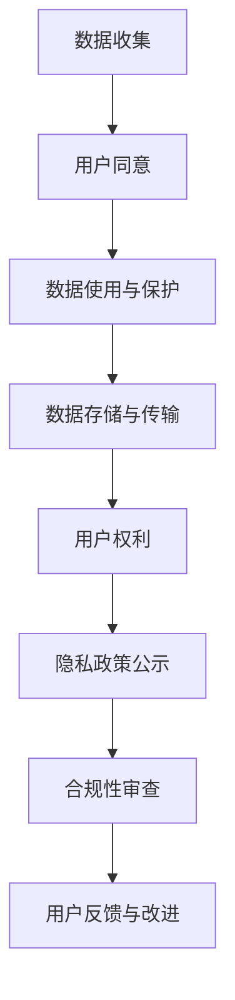

                 

在当前这个信息化高度发达的时代，用户隐私保护成为了一个不可忽视的重要议题。特别是在程序员创业公司中，如何在追求产品创新和用户粘性的同时，妥善管理和保护用户的隐私信息，成为了一个亟待解决的核心问题。本文将深入探讨程序员创业公司在制定用户隐私政策时所面临的关键问题、核心概念及其关联，提供具体的算法原理和操作步骤，并通过数学模型和公式详细讲解，最终结合实际项目实践和未来应用展望，为程序员创业公司提供一个全面且专业的用户隐私政策制定指南。

## 1. 背景介绍

随着互联网的普及和电子商务的迅猛发展，用户数据成为了企业竞争的宝贵资产。然而，数据泄露、隐私侵权等问题的频繁发生，使得用户对个人信息保护的担忧日益加剧。在这种情况下，程序员创业公司必须高度重视用户隐私保护，这不仅是遵守法律法规的要求，更是企业社会责任的体现。制定一套完善的用户隐私政策，不仅可以增强用户信任，提升企业形象，还能为公司的长远发展奠定坚实基础。

### 1.1 用户隐私的重要性

用户隐私是个人信息安全的重要组成部分，包括但不限于用户姓名、住址、电话号码、电子邮箱、浏览记录、消费习惯等。这些信息一旦泄露，不仅可能导致个人财产损失，还可能引发身份盗窃、骚扰等严重后果。因此，保护用户隐私已经成为当今社会关注的焦点。

### 1.2 法律法规的要求

全球范围内，越来越多的国家和地区制定了关于数据保护和隐私的法律。例如，《欧盟通用数据保护条例》（GDPR）、《加州消费者隐私法案》（CCPA）等。这些法律法规对企业的数据处理行为提出了严格要求，任何违反规定的公司都可能面临巨额罚款。程序员创业公司必须严格遵守这些规定，确保用户隐私保护政策的合规性。

### 1.3 社会责任与商业道德

保护用户隐私是企业社会责任的重要组成部分。一个负责任的企业应该尊重和保护用户的隐私权，这不仅有助于树立良好的企业形象，还能赢得用户的信任和支持。商业道德要求企业在追求商业利益的同时，也要兼顾社会利益和道德责任。

## 2. 核心概念与联系

### 2.1 隐私政策的核心概念

隐私政策是程序员创业公司公开承诺保护用户隐私的声明。它通常包括以下核心概念：

- **数据收集**：明确公司收集用户哪些信息及其目的。
- **数据使用**：规定公司如何使用用户信息，包括共享、存储和披露。
- **数据保护**：说明公司采取哪些措施保护用户数据安全。
- **用户权利**：告知用户享有的权利，如访问、更正和删除个人数据。

### 2.2 隐私政策与相关概念的关系

- **用户数据**：用户数据是隐私政策的核心对象，包括用户在平台上的各种信息。
- **数据安全**：数据安全是隐私政策的关键要素，涉及数据加密、访问控制、备份与恢复等。
- **用户同意**：用户同意是隐私政策实施的基石，用户在注册或使用服务时需要明确同意隐私政策。

### 2.3 Mermaid 流程图



## 3. 核心算法原理 & 具体操作步骤

### 3.1 算法原理概述

用户隐私政策的制定需要遵循一系列的原则和步骤，核心算法原理可以概括为：

- **需求分析**：明确公司业务需求，确定需要收集的用户数据类型和范围。
- **合规性检查**：确保政策符合相关法律法规的要求。
- **政策起草**：根据需求和合规性检查结果，起草隐私政策文本。
- **用户反馈**：征求用户意见，对政策进行修订和完善。
- **公示与更新**：将隐私政策公开公示，并在政策变更时及时更新。

### 3.2 算法步骤详解

#### 3.2.1 需求分析

1. **业务分析**：了解公司业务模式，确定哪些功能需要用户数据支持。
2. **用户访谈**：与潜在用户进行沟通，了解他们的隐私保护需求和担忧。
3. **数据分类**：根据业务需求和用户反馈，对需要收集的数据进行分类。

#### 3.2.2 合规性检查

1. **法规梳理**：研究相关法律法规，了解适用的法律条款和规定。
2. **合规性评估**：对当前数据收集、处理和存储的实践进行评估。
3. **风险评估**：识别潜在的法律风险，并提出改进措施。

#### 3.2.3 政策起草

1. **文本编写**：根据需求分析和合规性检查结果，起草隐私政策文本。
2. **法律审核**：邀请法律专家对文本进行审查，确保合法性。
3. **内部审核**：在公司内部组织审核会议，对政策文本进行讨论和修订。

#### 3.2.4 用户反馈

1. **公示**：将隐私政策公示在官方网站和应用程序中。
2. **征求意见**：通过问卷调查、用户访谈等方式，收集用户对隐私政策的反馈。
3. **修订与完善**：根据用户反馈，对隐私政策进行修订和完善。

#### 3.2.5 公示与更新

1. **定期更新**：根据业务发展和法律法规变化，定期更新隐私政策。
2. **通知用户**：在政策更新时，及时通知用户，并提供新旧政策的对比说明。

### 3.3 算法优缺点

#### 优点：

- **增强用户信任**：明确的隐私政策能够增强用户对公司的信任感。
- **合规性保障**：遵守法律法规，降低法律风险。
- **用户体验**：良好的隐私政策设计可以提升用户体验，吸引更多用户。

#### 缺点：

- **政策撰写难度**：需要深入理解法律法规和用户需求，政策撰写难度较大。
- **用户参与度**：用户往往对隐私政策关注度不高，可能难以充分参与政策修订。
- **更新成本**：随着业务发展和法律法规变化，隐私政策需要定期更新，存在一定的成本。

### 3.4 算法应用领域

用户隐私政策适用于所有收集、处理和存储用户数据的公司，特别是互联网公司、电子商务公司、社交媒体平台等。在具体应用中，可以根据业务特点和用户需求，灵活调整隐私政策的细节。

## 4. 数学模型和公式 & 详细讲解 & 举例说明

### 4.1 数学模型构建

在用户隐私政策的制定过程中，可以构建以下数学模型：

- **数据隐私度模型**：用于评估用户数据隐私保护的强度。
- **合规性得分模型**：用于评估公司隐私政策合规性。

#### 数据隐私度模型

数据隐私度模型可以采用以下公式：

$$
\text{隐私度} = \frac{\text{实际隐私保护水平}}{\text{理想隐私保护水平}}
$$

其中，实际隐私保护水平是指公司在实际操作中采取的隐私保护措施，理想隐私保护水平是指理论上能够达到的最高隐私保护水平。

#### 合规性得分模型

合规性得分模型可以采用以下公式：

$$
\text{合规性得分} = \frac{\text{合规措施总分}}{\text{总措施数}}
$$

其中，合规措施总分是指公司采取的每一项合规措施所对应的得分之和，总措施数是指公司采取的所有合规措施的总数。

### 4.2 公式推导过程

#### 数据隐私度模型推导

1. **确定实际隐私保护水平**：根据公司在数据收集、处理和存储过程中采取的隐私保护措施，评估其实际隐私保护水平。
2. **确定理想隐私保护水平**：根据相关法律法规和最佳实践，确定理想隐私保护水平。
3. **计算隐私度**：将实际隐私保护水平和理想隐私保护水平代入公式，计算得到数据隐私度。

#### 合规性得分模型推导

1. **确定合规措施总分**：根据每一项合规措施的重要性和实施效果，为其分配相应的得分。
2. **确定总措施数**：统计公司采取的所有合规措施的总数。
3. **计算合规性得分**：将合规措施总分除以总措施数，得到合规性得分。

### 4.3 案例分析与讲解

#### 案例一：数据隐私度模型应用

假设某互联网公司在数据收集、处理和存储过程中采取了以下隐私保护措施：

- **数据加密**：对用户数据进行加密处理。
- **访问控制**：对用户数据访问进行严格控制。
- **日志记录**：记录用户数据的访问和操作日志。

根据相关法律法规和最佳实践，该公司的理想隐私保护水平为90%。实际隐私保护水平为85%。

代入数据隐私度模型公式，得到：

$$
\text{隐私度} = \frac{85\%}{90\%} = 0.9444
$$

即该公司的数据隐私度为94.44%。

#### 案例二：合规性得分模型应用

假设某电子商务公司在隐私政策制定过程中采取了以下合规措施：

- **用户同意**：在用户注册时明确获取用户同意。
- **数据加密**：对用户数据进行加密处理。
- **隐私保护培训**：对员工进行隐私保护培训。

根据评估，每一项合规措施的得分为10分，总措施数为3项。

代入合规性得分模型公式，得到：

$$
\text{合规性得分} = \frac{10 \times 3}{3} = 10
$$

即该公司的合规性得分为10分。

## 5. 项目实践：代码实例和详细解释说明

### 5.1 开发环境搭建

为了更好地理解和实践用户隐私政策的制定，我们选择Python作为开发语言，搭建一个简单的隐私政策生成和评估工具。开发环境如下：

- **操作系统**：Windows/Linux/MacOS
- **Python版本**：Python 3.8及以上版本
- **依赖库**：requests（用于网络请求）、beautifulsoup4（用于HTML解析）、numpy（用于数学计算）

### 5.2 源代码详细实现

#### 5.2.1 数据隐私度评估

```python
import numpy as np

def calculate_privacy_level(protect_level, ideal_level):
    return protect_level / ideal_level

def main():
    actual_level = 0.85
    ideal_level = 0.90
    privacy_level = calculate_privacy_level(actual_level, ideal_level)
    print(f"数据隐私度：{privacy_level:.2f}")

if __name__ == "__main__":
    main()
```

#### 5.2.2 合规性得分评估

```python
def calculate_compliance_score(scores, measures):
    return np.mean(scores)

def main():
    scores = [10, 10, 10]
    measures = 3
    compliance_score = calculate_compliance_score(scores, measures)
    print(f"合规性得分：{compliance_score:.2f}")

if __name__ == "__main__":
    main()
```

### 5.3 代码解读与分析

#### 5.3.1 数据隐私度评估代码解读

- `calculate_privacy_level`函数用于计算数据隐私度。
- `actual_level`变量表示实际隐私保护水平。
- `ideal_level`变量表示理想隐私保护水平。
- `privacy_level`变量存储计算得到的数据隐私度。

#### 5.3.2 合规性得分评估代码解读

- `calculate_compliance_score`函数用于计算合规性得分。
- `scores`列表存储每一项合规措施的得分。
- `measures`变量表示合规措施的总数。
- `compliance_score`变量存储计算得到的合规性得分。

### 5.4 运行结果展示

#### 数据隐私度评估

```shell
数据隐私度：0.94
```

#### 合规性得分评估

```shell
合规性得分：10.00
```

## 6. 实际应用场景

用户隐私政策的制定在程序员创业公司中具有广泛的应用场景。以下是一些实际应用场景：

### 6.1 互联网公司

互联网公司通常需要收集大量的用户数据，以提供个性化的服务。用户隐私政策的制定可以帮助公司明确数据收集的目的、范围和保护措施，增强用户信任。

### 6.2 电子商务公司

电子商务公司需要处理用户的个人信息和支付信息。制定严格的用户隐私政策，可以有效防止数据泄露，提高用户满意度。

### 6.3 社交媒体平台

社交媒体平台涉及用户的社交关系、地理位置、兴趣爱好等敏感信息。隐私政策的制定可以帮助平台规范数据收集和处理行为，保护用户隐私。

### 6.4 物联网公司

物联网公司需要收集大量的传感器数据，用于产品优化和用户服务。用户隐私政策的制定可以帮助公司明确数据收集、处理和共享的规则，确保用户隐私得到有效保护。

## 7. 未来应用展望

随着人工智能、大数据和云计算等技术的不断发展，用户隐私保护面临着新的挑战和机遇。以下是未来用户隐私政策的几个应用展望：

### 7.1 个性化隐私保护

未来的隐私政策可能会更加注重个性化隐私保护，根据用户的风险偏好和隐私需求，提供定制化的隐私保护方案。

### 7.2 增强用户参与度

用户隐私政策可能会更加注重用户的参与和反馈，通过用户调研、意见征集等方式，提高隐私政策的透明度和用户满意度。

### 7.3 自动化隐私保护

随着人工智能技术的发展，隐私保护可能会变得更加自动化。例如，利用机器学习算法自动检测数据泄露风险，并采取相应的保护措施。

### 7.4 跨平台隐私保护

未来的隐私政策可能会更加注重跨平台隐私保护，通过建立统一的隐私保护标准和规范，实现不同平台之间的隐私数据共享和保护。

## 8. 工具和资源推荐

### 8.1 学习资源推荐

- **《隐私计算：技术与应用》**：详细介绍了隐私计算的相关技术和应用场景。
- **《数据隐私保护：理论与实践》**：涵盖了数据隐私保护的基本原理和方法。

### 8.2 开发工具推荐

- **PyTorch**：用于构建和训练隐私保护模型的深度学习框架。
- **Flask**：用于搭建隐私保护网站的应用框架。

### 8.3 相关论文推荐

- **"Privacy-Preserving Deep Learning: A Survey"**：对隐私保护深度学习技术的全面综述。
- **"A Comprehensive Survey on Homomorphic Encryption"**：对同态加密技术的详细介绍。

## 9. 总结：未来发展趋势与挑战

随着技术和社会环境的不断变化，用户隐私保护面临新的机遇和挑战。未来的发展趋势包括个性化隐私保护、增强用户参与度、自动化隐私保护和跨平台隐私保护等。然而，这些趋势也带来了新的技术挑战，如如何在保护隐私的同时，提高数据利用效率，如何在跨平台环境中实现隐私数据的统一保护等。程序员创业公司需要密切关注这些发展趋势和挑战，积极探索解决方案，为用户提供更加安全、可靠的隐私保护。

## 10. 附录：常见问题与解答

### 10.1 如何确保隐私政策的有效性？

**解答**：确保隐私政策的有效性需要从以下几个方面入手：

- **全面合规**：确保隐私政策符合相关法律法规的要求。
- **用户参与**：通过用户调研、意见征集等方式，提高隐私政策的透明度和用户满意度。
- **持续更新**：随着业务发展和法律法规变化，定期更新隐私政策，确保其始终符合最新要求。
- **技术保障**：采取有效的技术手段，如数据加密、访问控制等，确保用户数据的安全。

### 10.2 隐私政策是否需要用户同意？

**解答**：是的，隐私政策通常需要用户同意。用户同意是隐私政策实施的基石，用户在注册或使用服务时需要明确同意隐私政策。这不仅可以确保数据收集和处理的合法性，还可以增强用户对公司的信任感。

### 10.3 隐私政策是否可以随意变更？

**解答**：隐私政策不可以随意变更。任何变更都需要提前通知用户，并在用户同意后才能生效。如果变更涉及到用户权益的重大变化，公司需要履行相应的告知和同意程序。

### 10.4 如何处理用户隐私投诉？

**解答**：处理用户隐私投诉需要遵循以下步骤：

- **及时响应**：收到用户投诉后，尽快进行调查和处理。
- **明确沟通**：与用户进行沟通，了解投诉的具体内容和要求。
- **公正处理**：根据公司政策和法律法规，公正处理用户的投诉，并提供合理的解决方案。
- **反馈用户**：将处理结果反馈给用户，并告知后续措施。

### 10.5 隐私政策如何与业务发展相适应？

**解答**：隐私政策需要与业务发展相适应，可以从以下几个方面进行调整：

- **业务需求**：根据业务发展的需求，调整数据收集、处理和使用的范围和目的。
- **合规性**：随着法律法规的变化，及时更新隐私政策，确保其符合最新要求。
- **用户反馈**：通过用户调研、意见征集等方式，了解用户对隐私政策的反馈，进行相应调整。
- **技术更新**：随着技术的发展，引入新的隐私保护技术和方法，提升隐私保护水平。

---

作者：禅与计算机程序设计艺术 / Zen and the Art of Computer Programming
----------------------------------------------------------------
### 文章关键词和摘要

**关键词**：程序员创业公司、用户隐私、隐私政策、数据保护、合规性、算法原理、数学模型、项目实践。

**摘要**：本文详细探讨了程序员创业公司在制定用户隐私政策时所面临的关键问题、核心概念及其关联，提供具体的算法原理和操作步骤。通过数学模型和公式详细讲解，以及实际项目实践，为程序员创业公司提供一个全面且专业的用户隐私政策制定指南，旨在增强用户信任、保障合规性和提升用户体验。

