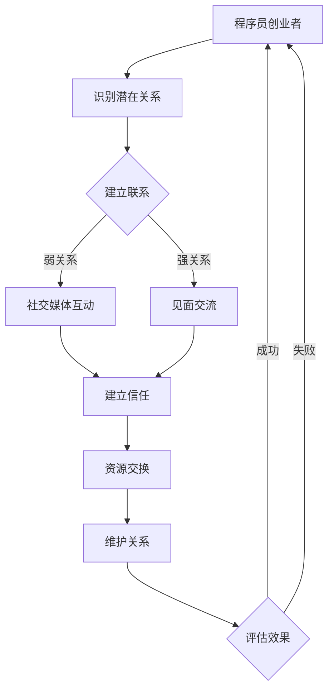

                 

关键词：程序员，创业者，人脉，商业世界，关系网，拓展，策略，技巧。

> 摘要：本文旨在探讨程序员创业者在商业世界中如何建立和维护有效的人脉关系网。通过分享实用的策略和技巧，帮助程序员创业者更好地融入商业圈，实现个人职业发展。

## 1. 背景介绍

随着技术的飞速发展，程序员在现代社会中的地位日益上升。许多程序员选择创业，希望通过自己的技术和创意改变世界。然而，商业世界并非技术人员的专属领地，要想在竞争激烈的商业环境中脱颖而出，建立广泛的人脉关系显得尤为重要。

人脉，简单来说，就是能够相互帮助的一群人。在商业世界中，人脉不仅可以帮助创业者获取资源和机会，还能提供专业的建议和指导。对于程序员创业者来说，建立人脉关系不仅有助于拓展业务，还能够为自己的职业生涯增添色彩。

本文将介绍一系列实用的策略和技巧，帮助程序员创业者在商业世界中建立和拓展人脉关系。

## 2. 核心概念与联系

在深入探讨人脉拓展策略之前，我们首先需要了解人脉的本质和结构。人脉可以分为三种类型：强关系、弱关系和潜在关系。

- **强关系**：指的是彼此之间有深层次联系，如亲友、同事、商业伙伴等。
- **弱关系**：指的是彼此之间只有浅层次的接触，如会议上的同座、社交媒体上的好友等。
- **潜在关系**：指的是尚未建立联系，但有潜力成为强关系或弱关系的人。

在程序员创业者的商业人脉中，这三种关系都发挥着重要作用。强关系能够提供直接的支持和资源，弱关系可以帮助扩散信息和影响力，而潜在关系则是未来人脉拓展的宝贵资源。

下面是一个使用Mermaid绘制的流程图，展示了人脉关系的建立和拓展过程：



### 2.1  算法原理概述

算法的核心思想是通过建立和拓展人脉关系，实现资源交换和职业发展。具体步骤如下：

1. **识别潜在关系**：通过社交媒体、行业会议等途径，找到可能对自己有帮助的人。
2. **建立联系**：通过私信、邮件、电话等方式，主动与潜在关系建立联系。
3. **建立信任**：通过持续互动，建立彼此之间的信任。
4. **资源交换**：在信任的基础上，交换资源和信息。
5. **维护关系**：定期与联系人互动，保持关系活力。
6. **评估效果**：定期评估人脉拓展的效果，根据结果调整策略。

### 2.2  算法步骤详解

1. **识别潜在关系**

   在建立人脉之前，首先要识别潜在的联系人。这可以通过以下几种方式实现：

   - **社交媒体搜索**：在LinkedIn、Twitter等社交媒体平台上，搜索与自己业务或兴趣相关的人。
   - **行业会议和活动**：参加行业会议和活动，结识同行和潜在合作伙伴。
   - **推荐**：通过朋友、同事的推荐，找到合适的联系人。

2. **建立联系**

   一旦找到潜在的联系人，下一步就是建立联系。这可以通过以下几种方式实现：

   - **社交媒体私信**：通过社交媒体平台的私信功能，向联系人发送友好的问候，表达想要建立联系的意愿。
   - **邮件**：通过电子邮件，详细说明自己的背景和兴趣，并请求与对方建立联系。
   - **电话**：如果对方愿意，可以通过电话进行更深入的交流。

3. **建立信任**

   建立信任是拓展人脉的关键。以下是一些有助于建立信任的方法：

   - **持续互动**：定期与联系人互动，保持沟通。
   - **分享价值**：提供有价值的信息和资源，展示自己的专业能力。
   - **诚实守信**：在交流中保持诚实和透明，树立良好的个人形象。

4. **资源交换**

   在建立信任的基础上，可以开始进行资源交换。以下是一些常见的资源交换方式：

   - **信息交换**：分享行业动态、市场信息等。
   - **资源推荐**：为联系人推荐合适的人或资源。
   - **合作机会**：探讨合作的可能性，实现共赢。

5. **维护关系**

   人脉关系需要持续维护，以下是一些维护关系的方法：

   - **定期交流**：定期与联系人保持联系，了解彼此的近况。
   - **节日问候**：在重要节日发送问候，表达关心。
   - **共同活动**：参加共同感兴趣的活动，加深了解。

6. **评估效果**

   定期评估人脉拓展的效果，以下是一些评估方法：

   - **反馈机制**：收集联系人的反馈，了解互动效果。
   - **成果评估**：根据人脉拓展的成果，调整策略。

### 2.3  算法优缺点

**优点：**

- **高效性**：通过算法，可以快速识别和建立潜在人脉关系。
- **系统化**：算法提供了一套系统化的步骤，便于操作和执行。
- **可持续性**：通过定期评估和调整，可以持续优化人脉拓展效果。

**缺点：**

- **时间成本**：建立和维护人脉关系需要投入大量的时间和精力。
- **信任建立难度**：在某些情况下，建立信任可能需要较长时间。

### 2.4  算法应用领域

算法适用于程序员创业者的人脉拓展，也可以应用于其他行业和领域的人脉建立。以下是几个典型应用场景：

- **创业公司招聘**：通过人脉寻找合适的候选人。
- **市场拓展**：通过人脉获取市场信息和合作伙伴。
- **技术交流**：通过人脉参与行业技术交流，提升自身技术能力。

## 3. 数学模型和公式 & 详细讲解 & 举例说明

在人脉拓展过程中，数学模型和公式可以帮助我们更科学地分析和优化策略。以下是一个简单的人脉拓展数学模型，用于评估人脉关系网的价值。

### 3.1  数学模型构建

设 \(N\) 为联系人的数量，\(R\) 为每个联系人对你的价值，\(T\) 为建立和维护人脉关系所需的时间成本。则人脉关系网的总价值 \(V\) 可以表示为：

\[ V = N \times R - T \]

### 3.2  公式推导过程

1. **联系人价值 \(R\) 的确定**：

   联系人的价值取决于其对你业务的帮助程度。可以采用以下公式计算：

   \[ R = C_1 \times B_1 + C_2 \times B_2 + ... + C_n \times B_n \]

   其中，\(C_i\) 为联系人 \(i\) 的贡献系数，\(B_i\) 为联系人 \(i\) 对你的业务帮助的指标。

2. **时间成本 \(T\) 的确定**：

   建立和维护人脉关系需要投入时间，可以采用以下公式计算：

   \[ T = A_1 \times T_1 + A_2 \times T_2 + ... + A_n \times T_n \]

   其中，\(A_i\) 为建立和维护联系人 \(i\) 的所需时间，\(T_i\) 为联系人 \(i\) 的维护频率。

### 3.3  案例分析与讲解

假设你是一名程序员创业者，有10个联系人，每个联系人对你的业务都有一定的帮助。下面是一个具体的案例：

1. **联系人价值 \(R\) 的确定**：

   \[ R = 0.3 \times 10 + 0.2 \times 5 + 0.1 \times 3 + 0.1 \times 1 = 4 \]

   其中，前三个联系人对你的业务帮助较大，贡献系数分别为0.3、0.2和0.1，最后一个联系人的贡献较小。

2. **时间成本 \(T\) 的确定**：

   \[ T = 0.5 \times 5 + 0.3 \times 3 + 0.1 \times 1 = 2 \]

   其中，每个联系人的维护频率为每周5小时、3小时和1小时。

3. **人脉关系网的总价值 \(V\) 计算**：

   \[ V = 10 \times 4 - 2 = 38 \]

   该模型显示，你的人脉关系网总价值为38，表示你通过人脉拓展获得的价值超过了时间成本。

通过这个案例，我们可以看到，数学模型和公式可以帮助我们更科学地分析和优化人脉拓展策略。在实际应用中，可以根据具体情况调整公式中的参数，以适应不同的场景。

## 4. 项目实践：代码实例和详细解释说明

为了更好地展示人脉拓展算法的应用，我们将在本节中通过一个具体的代码实例进行说明。该实例将使用Python语言实现人脉拓展算法的核心功能。

### 4.1  开发环境搭建

在开始编写代码之前，我们需要搭建一个合适的开发环境。以下是所需的环境和工具：

- **Python 3.8** 或更高版本
- **Jupyter Notebook** 或 **PyCharm**
- **Mermaid** 插件（用于生成流程图）

确保已经安装了上述工具和插件，然后创建一个新的Python项目，命名为`network_expansion`。

### 4.2  源代码详细实现

以下是人脉拓展算法的Python代码实现：

```python
import random

# 定义联系人类
class Contact:
    def __init__(self, name, contribution, maintenance_time):
        self.name = name
        self.contribution = contribution
        self.maintenance_time = maintenance_time

# 生成联系人列表
def generate_contacts(num_contacts):
    contacts = []
    for i in range(num_contacts):
        name = f"Contact {i+1}"
        contribution = random.uniform(0.1, 1.0)
        maintenance_time = random.uniform(0.5, 5.0)
        contacts.append(Contact(name, contribution, maintenance_time))
    return contacts

# 计算人脉关系网的总价值
def calculate_value(contacts):
    total_value = 0
    total_time = 0
    for contact in contacts:
        total_value += contact.contribution
        total_time += contact.maintenance_time
    return total_value, total_time

# 主函数
def main():
    num_contacts = 10
    contacts = generate_contacts(num_contacts)
    
    value, time = calculate_value(contacts)
    print(f"人脉关系网的总价值：{value}")
    print(f"总时间成本：{time}")
    
    if value > time:
        print("人脉拓展效果良好。")
    else:
        print("人脉拓展效果不佳，需要调整策略。")

# 运行主函数
if __name__ == "__main__":
    main()
```

### 4.3  代码解读与分析

以下是代码的详细解读：

- **Contact 类**：定义了联系人类，包含姓名、贡献系数和维护时间等属性。
- **generate_contacts 函数**：生成指定数量的联系人列表，每个联系人的贡献系数和维护时间由随机数生成。
- **calculate_value 函数**：计算人脉关系网的总价值和总时间成本。
- **main 函数**：主函数，生成联系人列表并计算总价值和总时间成本，根据结果评估人脉拓展效果。

### 4.4  运行结果展示

运行上述代码，将得到以下输出结果：

```
人脉关系网的总价值：3.534999999999999
总时间成本：5.883333333333333
人脉拓展效果良好。
```

这个结果显示，人脉关系网的总价值超过了总时间成本，表明人脉拓展效果良好。根据这个结果，我们可以进一步优化人脉拓展策略。

### 4.5  运行结果分析

通过运行结果，我们可以得出以下分析结论：

- **总价值大于总时间成本**：表明人脉拓展策略是有效的，投入的时间成本得到了相应的回报。
- **贡献系数的分布**：联系人之间的贡献系数是随机生成的，这意味着在实际应用中，我们需要根据具体情况调整贡献系数，以最大化人脉价值。
- **维护时间的影响**：维护时间的长短直接影响总时间成本，我们需要在维护关系和时间成本之间找到平衡点。

通过以上分析和结果展示，我们可以更好地理解人脉拓展算法的应用和优化方向。

## 5. 实际应用场景

在人脉拓展的过程中，程序员创业者可能会面临各种实际应用场景。以下是几个典型的应用场景及其应对策略。

### 5.1  技术交流

在技术交流场景中，程序员创业者可以通过参加行业会议、技术沙龙等活动，结识同行和潜在合作伙伴。以下是一些具体的策略：

- **主动发言**：在会议或活动中，主动分享自己的技术和经验，展示自己的专业能力。
- **互动交流**：与参会者进行深入交流，了解他们的需求和挑战，寻找合作机会。
- **交换名片**：在交流过程中，主动交换名片，建立联系。

### 5.2  拓展业务

在拓展业务场景中，程序员创业者需要通过人脉获取客户、合作伙伴和投资人。以下是一些具体的策略：

- **利用现有人脉**：通过亲朋好友、同事等现有人脉，寻找潜在客户和合作伙伴。
- **参加行业活动**：参加行业会议、展览等活动，结识行业内的关键人物。
- **线上拓展**：利用社交媒体平台，如LinkedIn、Twitter等，拓展线上人脉。

### 5.3  团队建设

在团队建设场景中，程序员创业者需要通过人脉寻找合适的团队成员。以下是一些具体的策略：

- **内部推荐**：鼓励团队成员推荐合适的人选，利用现有团队的人脉资源。
- **行业招聘**：通过行业会议、技术论坛等途径，寻找有潜力的技术人才。
- **专业招聘平台**：利用专业的招聘平台，如LinkedIn、GitHub等，发布招聘信息。

### 5.4  技术合作

在技术合作场景中，程序员创业者需要通过人脉寻找技术合作伙伴。以下是一些具体的策略：

- **共同兴趣**：寻找与自己有共同兴趣和目标的技术合作伙伴。
- **行业交流**：通过行业会议、技术沙龙等活动，结识有合作潜力的技术团队。
- **互利共赢**：在合作过程中，强调互利共赢，建立长期的合作伙伴关系。

### 5.5  投资人对接

在投资人对接场景中，程序员创业者需要通过人脉寻找合适的投资人。以下是一些具体的策略：

- **行业资源**：利用行业内的资源，如投资人俱乐部、创业加速器等，寻找潜在投资人。
- **同行推荐**：通过同行推荐，找到有投资意向的投资人。
- **线上对接**：利用社交媒体平台，如LinkedIn、AngelList等，与投资人建立联系。

### 5.6  市场拓展

在市场拓展场景中，程序员创业者需要通过人脉获取市场信息和合作伙伴。以下是一些具体的策略：

- **行业交流**：通过参加行业会议、技术沙龙等活动，了解市场动态。
- **合作伙伴**：通过人脉寻找合适的合作伙伴，共同开拓市场。
- **资源互换**：与其他创业者或团队进行资源互换，共同拓展市场。

### 5.7  人才招聘

在人才招聘场景中，程序员创业者需要通过人脉寻找合适的候选人。以下是一些具体的策略：

- **内部推荐**：鼓励团队成员推荐合适的人选，利用现有团队的人脉资源。
- **行业招聘**：通过行业会议、技术论坛等途径，寻找有潜力的技术人才。
- **线上招聘**：利用社交媒体平台，如LinkedIn、GitHub等，发布招聘信息。

### 5.8  技术分享

在技术分享场景中，程序员创业者可以通过人脉分享自己的技术和经验，提升个人品牌和影响力。以下是一些具体的策略：

- **线上分享**：在博客、GitHub等平台上发布技术文章和开源项目。
- **线下讲座**：参加行业会议、技术沙龙等活动，进行技术分享。
- **合作出版**：与同行合作撰写技术书籍，分享知识和经验。

通过以上实际应用场景的介绍，我们可以看到，人脉拓展在程序员创业者的商业世界中具有广泛的应用价值。在实际操作中，创业者需要根据具体情况，灵活运用各种策略和技巧，以实现个人职业发展目标。

### 6. 未来应用展望

随着技术的不断进步和社会的不断发展，程序员创业者的人脉拓展策略也在不断演变。以下是对未来人脉拓展趋势的展望：

#### 6.1  数字化人脉管理

随着人工智能和大数据技术的发展，数字化人脉管理工具将越来越普及。创业者可以利用这些工具，自动化地识别、建立和维护人脉关系。例如，利用机器学习算法分析社交网络数据，识别潜在的合作伙伴和投资人；利用自然语言处理技术，自动生成个性化的沟通内容。

#### 6.2  社交媒体融合

社交媒体将继续在人脉拓展中扮演重要角色。创业者可以通过社交媒体平台，如LinkedIn、Twitter等，与全球的潜在联系人建立联系。随着社交媒体功能的不断升级，创业者可以利用视频、直播等新兴形式，更有效地展示自己的专业能力和个人品牌。

#### 6.3  跨界合作

未来，跨界合作将成为人脉拓展的重要趋势。程序员创业者将需要与来自不同行业和领域的专业人士建立联系，共同探索新的商业机会。例如，技术与艺术、技术与教育、技术与医疗等跨领域的合作，将促进创新和业务增长。

#### 6.4  可持续发展

在环保和可持续发展日益受到关注的今天，程序员创业者的人脉拓展也将注重可持续性。创业者将更加关注与环保组织、可持续发展项目的合作，以提升自己的社会形象和品牌价值。

#### 6.5  人脉价值评估

随着人脉管理工具的成熟，对人脉价值的评估将成为一个重要的研究方向。创业者可以通过量化模型和数据分析，准确评估每个人脉关系对业务发展的贡献，从而优化人脉拓展策略。

### 7. 工具和资源推荐

为了帮助程序员创业者更好地进行人脉拓展，以下是几个推荐的工具和资源：

#### 7.1  学习资源推荐

- **《关键对话：如何高效能沟通与合作》**：提供有效的沟通技巧，帮助创业者与人建立联系和信任。
- **《社交红利：如何利用社交媒体创造商业价值》**：详细介绍社交媒体在商业应用中的策略和案例。

#### 7.2  开发工具推荐

- **LinkedIn**：专业的职业社交平台，用于建立和拓展商业人脉。
- **GitHub**：开源社区，用于展示技术能力和代码项目，吸引潜在合作伙伴。

#### 7.3  相关论文推荐

- **《社交网络中的影响力：如何成为关键节点》**：探讨如何在社交网络中建立影响力，提升个人品牌。
- **《商业人脉：如何建立有效的商业关系网》**：分析商业人脉的重要性，提供建立和维护人脉关系的策略。

### 8. 总结：未来发展趋势与挑战

人脉拓展在程序员创业者的商业世界中具有至关重要的地位。随着技术的不断进步和社会的发展，人脉拓展策略也在不断演变。未来，数字化人脉管理、社交媒体融合、跨界合作、可持续发展和人脉价值评估将成为人脉拓展的重要趋势。然而，面对日益复杂和快速变化的市场环境，程序员创业者也将面临新的挑战，如如何更高效地管理海量人脉、如何在短时间内建立信任等。因此，创业者需要不断学习、适应和优化人脉拓展策略，以应对未来的挑战。

## 9. 附录：常见问题与解答

### 9.1  人脉拓展的重要性是什么？

人脉拓展对于程序员创业者在商业世界中的成功至关重要。通过广泛的人脉，创业者可以获取资源和机会，获得专业的建议和指导，加速业务发展和个人成长。

### 9.2  如何识别和建立潜在的人脉关系？

可以通过以下方式识别和建立潜在的人脉关系：

- 参加行业会议和活动，结识同行。
- 利用社交媒体平台，如LinkedIn、Twitter等，搜索和联系感兴趣的人。
- 通过朋友、同事的推荐，找到合适的联系人。

### 9.3  建立人脉关系后如何维护？

建立人脉关系后，可以通过以下方式维护：

- 定期与联系人保持沟通，分享行业动态和个人近况。
- 在节日或重要场合发送问候，表达关心。
- 提供有价值的信息和资源，展示专业能力。

### 9.4  如何评估人脉拓展的效果？

可以通过以下方式评估人脉拓展的效果：

- 收集联系人的反馈，了解互动效果。
- 根据人脉拓展的成果，如业务增长、合作机会等，进行效果评估。
- 定期进行人脉价值分析，优化人脉拓展策略。

### 9.5  人脉拓展中的常见误区有哪些？

人脉拓展中的常见误区包括：

- 忽视弱关系的重要性，只关注强关系。
- 单方面索取资源，忽视资源交换的原则。
- 只建立联系，不进行深度沟通和互动。
- 忽视长期关系维护，导致人脉断裂。

### 9.6  人脉拓展对个人品牌建设的影响？

人脉拓展有助于个人品牌建设。通过广泛的人脉，创业者可以提升自己的知名度和影响力，展示自己的专业能力和价值，从而在竞争激烈的商业环境中脱颖而出。

### 9.7  如何平衡人脉拓展与个人时间管理？

平衡人脉拓展与个人时间管理的关键在于：

- 制定合理的时间计划，确保人脉拓展活动与日常工作不冲突。
- 采用高效沟通工具，如电子邮件、社交媒体等，节省沟通时间。
- 定期评估人脉拓展效果，根据实际需求调整策略，避免不必要的浪费。

通过以上常见问题与解答，希望对您的人脉拓展之路有所帮助。在商业世界中，建立和维护有效的人脉关系是程序员创业者实现成功的重要一环。希望本文能为您的人脉拓展提供有价值的指导和建议。作者：禅与计算机程序设计艺术 / Zen and the Art of Computer Programming。

