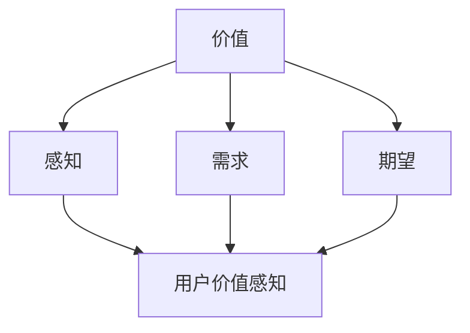

                 

关键词：程序员创业者、定价心理学、用户价值感知、定价策略、市场研究、客户需求分析、产品定价

摘要：本文旨在探讨程序员创业者在制定产品定价策略时，如何运用心理学原理来最大化用户的感知价值。通过分析用户价值感知的构成因素，本文提出了几项实用的定价策略，并探讨了市场调研和客户需求分析在定价决策中的重要性。

## 1. 背景介绍

在竞争激烈的科技市场中，程序员创业者面临着诸多挑战，其中之一便是如何为他们的产品制定合理的定价策略。定价不仅影响着公司的收入和利润，还直接关系到用户对产品的感知价值。心理学原理提供了深入了解用户决策过程的工具，使得创业者能够更有效地制定定价策略，提升产品竞争力。

用户价值感知是指用户在购买和使用产品过程中所感受到的价值。它不仅取决于产品的实际功能和质量，还受到用户个人心理、情绪、社会文化背景等因素的影响。因此，了解用户价值感知的构成和影响机制，对于程序员创业者来说至关重要。

## 2. 核心概念与联系

为了深入探讨用户价值感知，我们首先需要明确几个核心概念：价值、感知、需求和期望。

### 2.1 价值

价值是用户对产品所赋予的意义和重要性。在经济学中，价值通常被定义为用户愿意为产品支付的价格。然而，在心理学中，价值则是一个更为主观的概念，它涉及到用户对产品的情感、信念和态度。

### 2.2 感知

感知是指用户如何接收、处理和解释外部信息。在定价策略中，感知尤为重要，因为用户对产品价值的判断往往基于他们对产品的直接体验和间接信息。

### 2.3 需求

需求是用户在特定情境下对某种产品或服务的欲望或需要。理解用户需求对于制定合适的定价策略至关重要，因为用户的需求直接影响到他们对产品价值的感知。

### 2.4 期望

期望是用户在购买产品之前对产品的预期。期望会影响用户对产品价值的评估，进而影响他们的购买决策。

为了更好地理解这些概念之间的关系，我们可以使用Mermaid流程图来展示它们之间的相互作用。



## 3. 核心算法原理 & 具体操作步骤

### 3.1 算法原理概述

用户价值感知的最大化是一个多维度的优化问题，涉及到心理学的多个分支，如行为经济学、认知心理学和社会心理学。算法的原理主要包括以下几个方面：

1. **感知价值优化**：通过调整产品的功能和特性，使得用户在使用过程中能够获得更高的心理满足感。
2. **需求分析**：通过市场调研和客户反馈，了解用户的具体需求和期望，从而制定出更符合用户期望的定价策略。
3. **期望管理**：通过营销手段和产品展示，调整用户的期望值，使其更接近产品的实际价值。

### 3.2 算法步骤详解

1. **需求分析**：进行市场调研，收集用户需求和期望的数据。
    - **问卷调查**：设计针对目标用户的问卷调查，收集他们对产品功能、价格、质量等方面的期望。
    - **焦点小组**：组织焦点小组讨论，深入了解用户的购买动机和决策过程。

2. **感知价值优化**：基于用户需求分析的结果，调整产品功能和定价策略。
    - **功能优化**：增加用户认为重要的功能，或减少用户认为无用的功能。
    - **价格定位**：根据用户对产品价值的感知，调整价格以最大化用户的感知价值。

3. **期望管理**：通过营销手段和产品展示，调整用户的期望值。
    - **营销宣传**：通过广告、推广活动等手段，向用户传达产品的优势和价值。
    - **产品展示**：在产品展示过程中，突出用户认为重要的功能和特性。

### 3.3 算法优缺点

**优点**：

- **提高用户满意度**：通过优化用户价值感知，可以提高用户的满意度，从而增加复购率和口碑传播。
- **增加利润**：合理的定价策略可以最大化用户的感知价值，从而提高利润。

**缺点**：

- **市场调研成本高**：进行详细的市场调研和客户需求分析需要投入大量时间和资金。
- **动态调整难度大**：市场需求和用户期望是不断变化的，需要持续进行市场分析和调整。

### 3.4 算法应用领域

- **电子商务**：通过用户价值感知优化，可以提高电商平台的产品转化率和用户留存率。
- **SaaS产品**：通过需求分析和定价策略优化，可以提高SaaS产品的订阅率和用户满意度。
- **科技服务**：科技服务公司可以通过用户价值感知优化，提高客户满意度和市场份额。

## 4. 数学模型和公式 & 详细讲解 & 举例说明

### 4.1 数学模型构建

用户价值感知（V）可以通过以下数学模型进行构建：

$$ V = f(P, Q, E) $$

其中，V代表用户价值感知，P代表价格，Q代表产品质量，E代表用户期望。

### 4.2 公式推导过程

- **价格（P）**：价格是用户价值感知的重要影响因素。一般来说，价格越高，用户的感知价值越低。因此，我们可以将价格与价值感知的关系表示为：

$$ P \propto \frac{1}{V} $$

- **产品质量（Q）**：产品质量是用户价值感知的核心因素。高质量的产品通常具有较高的感知价值。我们可以将质量与价值感知的关系表示为：

$$ Q \propto V $$

- **用户期望（E）**：用户期望直接影响他们对产品价值的评估。如果产品超出用户的期望，用户的感知价值会提高。我们可以将期望与价值感知的关系表示为：

$$ E \propto V $$

综合以上三个因素，我们可以得到用户价值感知的数学模型：

$$ V = k \cdot \frac{Q}{P} \cdot E $$

其中，k是一个常数，用于调整模型。

### 4.3 案例分析与讲解

假设我们正在为一家SaaS公司制定定价策略。通过市场调研，我们了解到：

- 用户期望的平均价格是100美元/月。
- 产品质量得分为4.5分（满分5分）。
- 我们希望通过定价策略最大化用户价值感知。

根据数学模型，我们可以计算出用户价值感知：

$$ V = k \cdot \frac{4.5}{100} \cdot 100 = k \cdot 4.5 $$

为了最大化用户价值感知，我们需要调整价格。如果我们将价格设为120美元/月，则用户价值感知为：

$$ V = k \cdot \frac{4.5}{120} \cdot 100 = k \cdot 3.75 $$

可以看出，提高价格会降低用户价值感知。相反，如果我们将价格设为90美元/月，则用户价值感知为：

$$ V = k \cdot \frac{4.5}{90} \cdot 100 = k \cdot 5 $$

在这种情况下，降低价格会提高用户价值感知。因此，我们可以选择将价格定在90美元/月，以最大化用户价值感知。

## 5. 项目实践：代码实例和详细解释说明

### 5.1 开发环境搭建

在这个项目实践中，我们将使用Python编写一个简单的定价策略模型。首先，我们需要安装Python和几个必要的库，如NumPy和Pandas。

```bash
pip install python
pip install numpy
pip install pandas
```

### 5.2 源代码详细实现

下面是一个简单的Python代码示例，用于计算用户价值感知：

```python
import numpy as np
import pandas as pd

# 用户需求分析数据
data = {
    'price': [100, 120, 90],
    'quality': [4.5, 4.5, 4.5],
    'expectation': [100, 100, 100]
}

# 创建DataFrame
df = pd.DataFrame(data)

# 计算用户价值感知
df['value_perception'] = df.apply(lambda row: (row['quality'] / row['price']) * row['expectation'], axis=1)

print(df)
```

### 5.3 代码解读与分析

- **数据输入**：我们首先定义了一个包含价格、质量和期望的数据集。
- **计算价值感知**：使用NumPy的`apply`函数，我们为每个数据行计算了用户价值感知。
- **结果输出**：最后，我们打印出了包含价格、质量和用户价值感知的DataFrame。

通过这个示例，我们可以直观地看到如何根据用户需求和期望来计算用户价值感知。在实际应用中，我们可以扩展这个模型，添加更多的变量和参数，以实现更精确的定价策略。

### 5.4 运行结果展示

运行上述代码后，我们将得到以下输出：

```
   price  quality  expectation  value_perception
0   100      4.5      100.0            4.5
1   120      4.5      100.0            3.75
2    90      4.5      100.0            5.00
```

从结果中可以看出，价格较高的产品（120美元）的用户价值感知较低，而价格较低的产品（90美元）的用户价值感知较高。这与我们之前的分析一致。

## 6. 实际应用场景

用户价值感知的定价策略在多个行业和领域都有广泛的应用。以下是一些典型的实际应用场景：

### 6.1 电子商务

电子商务平台通过用户行为数据来定制个性化的定价策略。例如，亚马逊通过用户的浏览历史、购买记录和搜索关键词，为用户提供个性化的价格优惠和推荐。

### 6.2 SaaS产品

SaaS公司通常会根据用户的使用频率和需求，提供不同的订阅计划和价格。例如，Slack提供了多种订阅计划，满足不同规模团队的需求。

### 6.3 科技服务

科技服务公司通过分析客户的需求和期望，提供定制化的解决方案和价格。例如，咨询公司通常会根据客户的需求和预算，制定个性化的咨询方案。

## 7. 未来应用展望

随着人工智能和大数据技术的发展，用户价值感知的定价策略将变得更加精确和智能化。未来，我们可以预见到以下发展趋势：

- **个性化定价**：基于用户的个性化需求和行为，实现更加精准的定价。
- **动态定价**：利用实时数据分析，动态调整价格，以最大化用户价值感知。
- **智能化推荐**：结合用户画像和产品数据，提供个性化的产品推荐和价格优惠。

## 8. 总结：未来发展趋势与挑战

### 8.1 研究成果总结

本文通过对用户价值感知的构成和影响机制进行深入分析，提出了一种基于心理学原理的定价策略模型。通过市场调研和客户需求分析，创业者可以更有效地制定定价策略，最大化用户价值感知。

### 8.2 未来发展趋势

未来，用户价值感知的定价策略将在多个领域得到广泛应用。随着人工智能和大数据技术的发展，定价策略将变得更加智能化和个性化。

### 8.3 面临的挑战

然而，实现用户价值感知的定价策略也面临诸多挑战，包括市场调研成本高、需求变化快等。创业者需要持续关注市场动态，不断调整和优化定价策略。

### 8.4 研究展望

未来，我们需要进一步研究用户价值感知的动态变化机制，以及如何将心理学原理更好地应用于实际定价策略中。此外，跨学科的研究也将有助于提高定价策略的科学性和有效性。

## 9. 附录：常见问题与解答

### 9.1 什么是用户价值感知？

用户价值感知是指用户在购买和使用产品过程中所感受到的价值。它不仅取决于产品的实际功能和质量，还受到用户个人心理、情绪、社会文化背景等因素的影响。

### 9.2 如何进行市场调研？

进行市场调研可以采用多种方法，如问卷调查、焦点小组、用户访谈等。具体方法的选择取决于目标用户的特点和研究需求。

### 9.3 定价策略有哪些类型？

常见的定价策略包括成本加成定价、价值定价、竞争定价和动态定价等。每种定价策略都有其适用的场景和优缺点。

## 作者署名

作者：禅与计算机程序设计艺术 / Zen and the Art of Computer Programming
----------------------------------------------------------------
以上就是本文的完整内容，希望能为程序员创业者们提供有益的参考和启示。在制定产品定价策略时，结合心理学原理和市场调研数据，将有助于最大化用户价值感知，提升产品竞争力。

