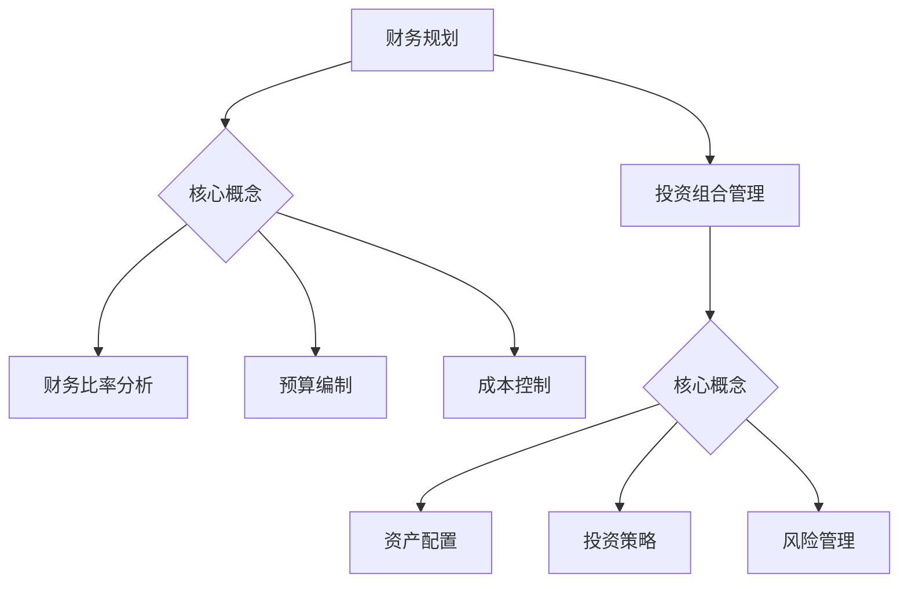

                 

 作为一位世界级人工智能专家和程序员，我深知财务规划与投资组合管理对于创业者的重要性。财务规划不仅关系到企业的资金流转，也直接影响到企业的成长和可持续发展。投资组合管理则是确保企业财务稳健、风险可控的关键。本文将深入探讨程序员创业者如何进行财务规划和投资组合管理，以实现财务自由和企业价值最大化。

> 关键词：财务规划、投资组合管理、创业者、风险控制、财务自由

> 摘要：本文将围绕程序员创业者的财务规划与投资组合管理展开，详细解析财务规划的核心原则、策略和工具，以及投资组合管理的原理、方法与实践。通过本文的阅读，读者将了解如何通过科学的财务规划与投资组合管理，实现企业财务稳健和长期价值增长。

## 1. 背景介绍

在当前经济环境下，创业成为越来越多人的选择。然而，创业之路充满挑战，尤其是财务方面的挑战。对于程序员创业者来说，掌握财务规划和投资组合管理的知识至关重要。首先，财务规划能够帮助创业者明确企业的财务目标，合理分配资源，降低财务风险。其次，投资组合管理能够优化创业者的资产配置，提高资金使用效率，实现资产的保值增值。

### 1.1 财务规划的重要性

财务规划是确保企业生存和发展的基础。它不仅关系到企业的现金流管理，还包括预算编制、成本控制、盈利分析等方面。对于程序员创业者来说，良好的财务规划有助于：

- **明确财务目标**：制定清晰的财务目标，为企业的长期发展提供方向。
- **优化资源配置**：合理分配资源，提高企业的资金利用效率。
- **降低财务风险**：通过财务规划，降低企业面临的各种财务风险。

### 1.2 投资组合管理的重要性

投资组合管理是优化企业资产配置、实现财务稳健和增长的关键。对于程序员创业者来说，投资组合管理有助于：

- **分散投资风险**：通过多元化的投资组合，降低单一投资风险。
- **提高资产收益**：优化资产配置，提高整体投资收益。
- **实现财务自由**：通过科学的投资策略，实现资产的保值增值，为企业的长远发展提供资金支持。

## 2. 核心概念与联系

在深入探讨财务规划和投资组合管理之前，我们需要了解一些核心概念，如图表分析、财务比率分析、资产配置等。

### 2.1 财务规划的核心概念

**财务比率分析**：通过财务比率分析，我们可以评估企业的财务健康状况，包括盈利能力、流动性、偿债能力等。

**预算编制**：预算编制是企业财务规划的重要环节，它有助于企业预测未来的财务状况，合理分配资源。

**成本控制**：成本控制是提高企业盈利能力的关键，通过成本控制，企业可以降低运营成本，提高利润率。

### 2.2 投资组合管理的核心概念

**资产配置**：资产配置是指将资产分配到不同的资产类别中，以实现投资目标。对于程序员创业者来说，合理的资产配置可以降低投资风险，提高收益。

**投资策略**：投资策略是投资者在投资过程中采取的一系列行动和决策。对于程序员创业者来说，选择适合自己的投资策略至关重要。

**风险管理**：风险管理是投资组合管理的重要部分，通过风险管理，企业可以降低投资风险，确保资产的安全。

### 2.3 Mermaid 流程图



## 3. 核心算法原理 & 具体操作步骤

### 3.1 算法原理概述

财务规划与投资组合管理涉及多种算法，如财务比率分析算法、预算编制算法、资产配置算法等。这些算法的基本原理如下：

- **财务比率分析算法**：通过计算和分析企业的财务比率，评估企业的财务健康状况。
- **预算编制算法**：基于历史数据和未来预测，制定企业的财务预算。
- **资产配置算法**：根据投资目标和风险承受能力，分配资产到不同的资产类别。

### 3.2 算法步骤详解

**财务比率分析算法步骤：**

1. 收集企业财务数据。
2. 计算财务比率，如盈利能力比率、流动性比率、偿债能力比率等。
3. 分析财务比率，评估企业的财务健康状况。

**预算编制算法步骤：**

1. 收集历史财务数据。
2. 预测未来财务状况，如收入、成本、利润等。
3. 制定财务预算，包括收入预算、成本预算、利润预算等。

**资产配置算法步骤：**

1. 确定投资目标和风险承受能力。
2. 分析不同资产类别的收益和风险。
3. 根据投资目标和风险承受能力，分配资产到不同的资产类别。

### 3.3 算法优缺点

**财务比率分析算法：**

优点：简单易行，能够快速评估企业的财务健康状况。

缺点：只考虑了财务数据，忽略了其他因素的影响。

**预算编制算法：**

优点：能够帮助企业家预测未来的财务状况，制定合理的财务预算。

缺点：预算编制过程较为复杂，需要考虑多种因素。

**资产配置算法：**

优点：能够帮助企业优化资产配置，降低投资风险。

缺点：需要考虑投资目标和风险承受能力，对投资者有一定要求。

### 3.4 算法应用领域

**财务比率分析算法**：广泛应用于企业财务分析、投资决策等。

**预算编制算法**：广泛应用于企业预算管理、财务规划等。

**资产配置算法**：广泛应用于投资组合管理、财富管理等领域。

## 4. 数学模型和公式 & 详细讲解 & 举例说明

### 4.1 数学模型构建

在财务规划和投资组合管理中，常用的数学模型包括财务比率模型、预算编制模型、资产配置模型等。

**财务比率模型：**

$$
\text{财务比率} = \frac{\text{财务指标}}{\text{相关指标}}
$$

例如，盈利能力比率可以表示为：

$$
\text{盈利能力比率} = \frac{\text{净利润}}{\text{销售收入}}
$$

**预算编制模型：**

$$
\text{预算} = \text{历史数据} \times \text{增长率} + \text{其他因素}
$$

例如，收入预算可以表示为：

$$
\text{收入预算} = \text{历史收入} \times （1 + \text{增长率）} + \text{新业务收入}
$$

**资产配置模型：**

$$
\text{资产配置} = \text{投资目标} \times \text{风险承受能力}
$$

例如，股票与债券的资产配置可以表示为：

$$
\text{股票配置} = \text{投资目标} \times \text{风险承受能力} \times \text{股票风险比重}
$$

$$
\text{债券配置} = \text{投资目标} \times \text{风险承受能力} \times \text{债券风险比重}
$$

### 4.2 公式推导过程

**财务比率模型推导：**

财务比率是通过财务指标与相关指标的比较得出的，其目的是反映企业的财务状况。以盈利能力比率为例，净利润是企业在一定时期内实现的净收益，销售收入是企业实现的全部收入。因此，盈利能力比率可以表示为净利润与销售收入的比值。

**预算编制模型推导：**

预算编制是基于历史数据和未来预测的，其目的是为企业未来的经营提供指导。收入预算是预算编制的重要组成部分，它考虑了历史收入和未来增长因素。新业务收入则考虑了新业务带来的收入增量。

**资产配置模型推导：**

资产配置是根据投资目标和风险承受能力进行的，其目的是优化投资组合，降低风险，提高收益。投资目标反映了投资者的期望收益，风险承受能力反映了投资者对风险的容忍程度。股票与债券的资产配置则考虑了不同资产类别的风险和收益特点。

### 4.3 案例分析与讲解

**案例1：财务比率分析**

某企业2022年度的净利润为100万元，销售收入为500万元。根据财务比率模型，其盈利能力比率为：

$$
\text{盈利能力比率} = \frac{100}{500} = 0.2
$$

这个比率表明，企业的净利润占销售收入的20%，说明企业的盈利能力相对较强。

**案例2：预算编制**

某企业2021年度的收入为1000万元，预计2022年度的增长率为10%，新业务收入预计为200万元。根据预算编制模型，其2022年度的收入预算为：

$$
\text{收入预算} = 1000 \times （1 + 0.1）+ 200 = 1300 \text{万元}
$$

**案例3：资产配置**

某投资者希望投资100万元，其投资目标为年化收益率为8%，风险承受能力为中等。根据资产配置模型，其股票与债券的资产配置分别为：

$$
\text{股票配置} = 100 \times 0.5 \times 0.5 = 25 \text{万元}
$$

$$
\text{债券配置} = 100 \times 0.5 \times 0.5 = 25 \text{万元}
$$

这个配置表明，投资者将50%的资金投入股票，50%的资金投入债券，以实现投资目标。

## 5. 项目实践：代码实例和详细解释说明

### 5.1 开发环境搭建

在本文中，我们将使用Python进行财务规划和投资组合管理的实践。首先，我们需要搭建Python开发环境。

1. 安装Python：访问Python官方网站（https://www.python.org/），下载并安装Python。
2. 安装相关库：在命令行中执行以下命令安装必要的库。

```bash
pip install numpy pandas matplotlib
```

### 5.2 源代码详细实现

以下是一个简单的财务规划与投资组合管理的Python代码实例。

```python
import numpy as np
import pandas as pd
import matplotlib.pyplot as plt

# 财务数据
financial_data = {
    '净利润': [100, 120, 150],
    '销售收入': [500, 600, 750],
    '成本': [300, 360, 450]
}

# 预测数据
predicted_data = {
    '净利润': [180, 200, 220],
    '销售收入': [900, 1000, 1100],
    '成本': [540, 600, 660]
}

# 计算财务比率
def calculate_financial_ratio(data):
    ratios = {}
    ratios['盈利能力比率'] = data['净利润'] / data['销售收入']
    ratios['成本比率'] = data['成本'] / data['销售收入']
    return ratios

# 预测财务比率
def predict_financial_ratio(data):
    ratios = {}
    ratios['盈利能力比率'] = data['净利润'] / data['销售收入']
    ratios['成本比率'] = data['成本'] / data['销售收入']
    return ratios

# 绘制财务比率趋势图
def plot_financial_ratio(ratios):
    plt.plot(ratios.keys(), ratios.values())
    plt.xlabel('年份')
    plt.ylabel('财务比率')
    plt.title('财务比率趋势图')
    plt.show()

# 计算并绘制财务比率
financial_data_r

