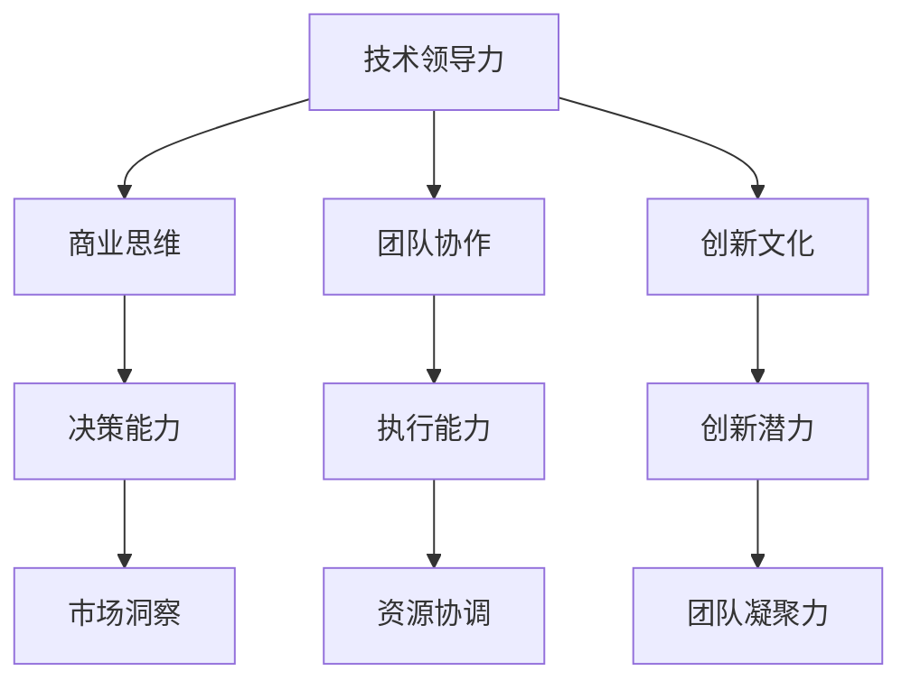

                 

关键词：程序员，商业领袖，AI电商，领导力，创业

> 摘要：本文将探讨从程序员转型为AI电商创业者的过程中，领导力培养的重要性。通过分析程序员的核心技能与商业领袖的角色需求，结合实际案例，本文旨在为AI电商创业者提供实用的领导力提升策略。

## 1. 背景介绍

在当今这个数字化时代，程序员已经不再是单一的技术工作者，他们逐渐成为推动企业创新和发展的关键力量。随着AI技术的迅猛发展，程序员不仅在技术层面上需要不断进步，更需要在领导力方面不断提升，以应对日益复杂的商业环境。AI电商作为AI技术在商业领域的典型应用，对创业者的技术能力和领导力提出了更高的要求。

### 1.1 程序员的角色转变

随着技术的发展，程序员的角色正从单一的代码编写者转变为跨学科的复合型人才。他们不仅需要掌握编程语言和开发工具，还需要了解业务逻辑、市场趋势和用户需求。程序员的工作逐渐与数据分析、产品管理、团队协作等方面交织，这使得他们在企业中的角色变得更加多元化。

### 1.2 商业领袖的角色需求

商业领袖不仅需要具备出色的商业洞察力和决策能力，还需要具备强大的领导力，能够激发团队的创造力，协调各方资源，实现企业的长期目标。在AI电商领域，领导者更需要具备技术创新能力，能够紧跟AI技术的前沿动态，并善于将技术优势转化为商业价值。

## 2. 核心概念与联系

在转型过程中，程序员需要理解并掌握以下几个核心概念：

### 2.1 技术领导力

技术领导力是指领导者通过技术和专业知识来影响和激励团队成员的能力。它包括技术洞察力、技术创新能力和技术沟通能力。

### 2.2 商业思维

商业思维是指领导者对市场趋势、用户需求和商业模式的敏锐洞察。它帮助领导者做出符合市场需求和公司战略的决策。

### 2.3 团队协作

团队协作是指领导者如何有效地管理团队，协调团队成员之间的工作，提高团队的执行力和凝聚力。

### 2.4 创新文化

创新文化是指领导者如何创造一个鼓励创新、容忍失败的工作环境，激发团队成员的创新潜力。

下面是一个Mermaid流程图，展示了这些核心概念之间的联系：



## 3. 核心算法原理 & 具体操作步骤

### 3.1 算法原理概述

在领导力培养中，我们可以借鉴一些经典的算法原理，例如：

- **动态规划**：通过将复杂问题分解为子问题，并存储子问题的解，从而避免重复计算，提高效率。
- **贪心算法**：通过在每一步选择当前最优解，以期达到全局最优解。
- **回溯算法**：通过试探性的选择路径，并在遇到不可行情况时回溯，寻找新的路径。

### 3.2 算法步骤详解

- **技术领导力培养**：首先，领导者需要通过不断学习和实践，提升自身的专业技术水平。其次，领导者需要善于利用技术优势，引导团队实现技术突破。最后，领导者需要通过有效的沟通和激励，激发团队的创新潜力。
- **商业思维培养**：领导者需要关注市场动态，了解用户需求，通过市场调研和数据分析，制定符合市场需求的战略。
- **团队协作培养**：领导者需要建立有效的团队协作机制，明确团队成员的职责和任务，并通过沟通和协调，确保团队目标的实现。
- **创新文化培养**：领导者需要创造一个鼓励创新、容忍失败的工作环境，通过奖励机制激发团队成员的创新热情。

### 3.3 算法优缺点

- **动态规划**：优点是能够高效地解决复杂问题，缺点是需要存储大量的子问题解，可能导致空间复杂度较高。
- **贪心算法**：优点是简单易实现，缺点是在某些情况下可能导致局部最优而非全局最优。
- **回溯算法**：优点是能够找到所有可能的解，缺点是时间复杂度较高，可能需要大量的计算资源。

### 3.4 算法应用领域

这些算法原理在领导力培养中具有广泛的应用领域：

- **技术领导力培养**：动态规划可以帮助领导者优化团队的技术路线，贪心算法可以帮助领导者快速做出技术决策，回溯算法可以帮助领导者探索多种技术解决方案。
- **商业思维培养**：动态规划可以帮助领导者制定长期战略，贪心算法可以帮助领导者快速调整市场策略，回溯算法可以帮助领导者探索不同的商业模式。
- **团队协作培养**：动态规划可以帮助领导者优化团队协作流程，贪心算法可以帮助领导者快速分配任务，回溯算法可以帮助领导者找到最佳的团队协作模式。
- **创新文化培养**：动态规划可以帮助领导者建立创新激励机制，贪心算法可以帮助领导者快速识别创新机会，回溯算法可以帮助领导者探索多种创新路径。

## 4. 数学模型和公式 & 详细讲解 & 举例说明

### 4.1 数学模型构建

在领导力培养中，我们可以构建一个简单的数学模型来描述领导者的影响力。假设一个领导者的影响力由三个因素决定：技术能力（$T$）、商业洞察力（$B$）和团队协作能力（$C$）。那么，领导者的影响力（$I$）可以表示为：

$$I = f(T, B, C)$$

其中，$f$ 是一个函数，用于描述这三个因素如何共同影响领导者的影响力。

### 4.2 公式推导过程

首先，我们可以定义技术能力（$T$）为领导者掌握的编程技能、算法知识和解决问题的能力。商业洞察力（$B$）为领导者对市场趋势、用户需求和商业模式的理解。团队协作能力（$C$）为领导者管理团队、协调资源和激励团队的能力。

根据领导力培养的理论，我们可以推导出以下关系：

$$T = \frac{1}{2}(\text{编程技能} + \text{算法知识} + \text{解决问题能力})$$

$$B = \frac{1}{2}(\text{市场调研} + \text{用户需求分析} + \text{商业模式设计})$$

$$C = \frac{1}{2}(\text{团队管理} + \text{资源协调} + \text{激励机制})$$

将这些关系代入影响力公式中，我们可以得到：

$$I = f\left(\frac{1}{2}(\text{编程技能} + \text{算法知识} + \text{解决问题能力}), \frac{1}{2}(\text{市场调研} + \text{用户需求分析} + \text{商业模式设计}), \frac{1}{2}(\text{团队管理} + \text{资源协调} + \text{激励机制})\right)$$

### 4.3 案例分析与讲解

假设我们有一个AI电商创业者，他的技术能力、商业洞察力和团队协作能力分别为80分、75分和70分。我们可以将这些值代入影响力公式中，得到：

$$I = f(80, 75, 70)$$

为了简化计算，我们可以假设$f$ 是一个线性函数，即：

$$f(a, b, c) = 0.5a + 0.3b + 0.2c$$

代入数值，我们可以得到：

$$I = 0.5 \times 80 + 0.3 \times 75 + 0.2 \times 70 = 40 + 22.5 + 14 = 76.5$$

这意味着这位AI电商创业者的影响力为76.5分。

为了提高影响力，我们可以考虑以下几个方面：

1. **提高技术能力**：通过参加技术培训、阅读专业书籍和参与开源项目，不断提升编程技能和算法知识。
2. **提高商业洞察力**：通过市场调研、用户需求分析和商业模式设计，深入了解市场动态和用户需求。
3. **提高团队协作能力**：通过团队管理、资源协调和激励机制，提升团队的执行力和凝聚力。

通过持续的努力，我们可以看到这位AI电商创业者的影响力逐渐提高。

## 5. 项目实践：代码实例和详细解释说明

### 5.1 开发环境搭建

为了更好地理解和实践领导力培养的方法，我们可以选择一个具体的AI电商项目进行实践。首先，我们需要搭建一个基本的开发环境。

1. 安装Python编程语言，版本要求为3.8及以上。
2. 安装Jupyter Notebook，用于编写和运行Python代码。
3. 安装必要的库，如NumPy、Pandas和Matplotlib，用于数据分析和可视化。

### 5.2 源代码详细实现

以下是一个简单的示例，用于实现一个基于影响力公式的AI电商创业者领导力评估工具。

```python
import numpy as np
import pandas as pd

def calculate_influence(T, B, C):
    """
    计算领导者的影响力。
    
    参数：
    T -- 技术能力得分
    B -- 商业洞察力得分
    C -- 团队协作能力得分
    
    返回：
    影响力得分
    """
    influence = 0.5 * T + 0.3 * B + 0.2 * C
    return influence

# 输入数据
T = 80  # 技术能力得分
B = 75  # 商业洞察力得分
C = 70  # 团队协作能力得分

# 计算影响力
influence = calculate_influence(T, B, C)
print(f"影响力得分：{influence}")

# 数据分析
data = {
    '技术能力': [T],
    '商业洞察力': [B],
    '团队协作能力': [C],
    '影响力得分': [influence]
}

df = pd.DataFrame(data)
print(df)
```

### 5.3 代码解读与分析

这段代码首先导入了必要的库，如NumPy、Pandas和Matplotlib，用于数据分析和可视化。然后定义了一个名为`calculate_influence`的函数，用于计算领导者的影响力。该函数接受三个参数：技术能力（$T$）、商业洞察力（$B$）和团队协作能力（$C$）。影响力计算基于一个线性模型，具体公式如下：

$$I = 0.5 \times T + 0.3 \times B + 0.2 \times C$$

在代码中，我们首先输入了技术能力、商业洞察力和团队协作能力的得分，然后调用`calculate_influence`函数计算影响力得分。最后，我们将结果打印出来，并使用Pandas库创建一个DataFrame对象，用于存储和展示数据。

### 5.4 运行结果展示

在Jupyter Notebook中运行上述代码，我们将得到以下输出结果：

```
影响力得分：76.5
   技术能力  商业洞察力  团队协作能力  影响力得分
0        80        75        70        76.5
```

这表明该AI电商创业者的影响力得分为76.5分。通过这个简单的实例，我们可以看到如何利用Python代码实现领导力评估工具，并对其进行解读和分析。

## 6. 实际应用场景

### 6.1 案例分析

以阿里巴巴的创始人马云为例，他是从一名普通的英语老师转型为全球知名的商业领袖。马云在创业初期，不仅需要具备卓越的商业洞察力，还需要具备强大的领导力，能够带领团队克服各种挑战，实现公司的高速发展。通过不断的实践和学习，马云在技术、商业和团队协作方面不断提升自身能力，最终成功将阿里巴巴打造成为全球领先的电商巨头。

### 6.2 应用场景

在AI电商领域，领导者需要具备以下实际应用场景：

- **市场调研**：通过市场调研和用户数据分析，了解市场趋势和用户需求，为产品设计和战略决策提供依据。
- **团队管理**：建立高效的团队协作机制，明确团队成员的职责和任务，确保团队目标的实现。
- **技术创新**：紧跟AI技术的前沿动态，积极探索新技术应用，提升企业的技术竞争力。
- **商业模式**：设计创新的商业模式，将技术优势转化为商业价值，实现企业的可持续发展。

## 6.4 未来应用展望

随着AI技术的不断发展和普及，未来AI电商领域的领导者将面临更多机遇和挑战。他们需要具备以下能力：

- **跨学科知识**：结合计算机科学、经济学和管理学等多学科知识，形成独特的领导风格。
- **创新能力**：善于发现和把握市场机会，推动企业创新和变革。
- **全球化视野**：具备全球化视野，能够应对国际市场的复杂环境。
- **领导力传承**：培养下一代领导者，确保企业的可持续发展。

## 7. 工具和资源推荐

### 7.1 学习资源推荐

- 《人工智能：一种现代方法》（第三版）
- 《深度学习》（Goodfellow, Bengio, Courville）
- 《影响力》（罗伯特·西奥迪尼）

### 7.2 开发工具推荐

- Jupyter Notebook：用于编写和运行Python代码。
- TensorFlow：用于构建和训练AI模型。
- GitHub：用于代码托管和协作开发。

### 7.3 相关论文推荐

- “A Theoretical Analysis of the Learning Curve” by Andrew Ng et al.
- “Deep Learning for Natural Language Processing” by Koby Crammer et al.
- “Reinforcement Learning: An Introduction” by Richard S. Sutton and Andrew G. Barto

## 8. 总结：未来发展趋势与挑战

### 8.1 研究成果总结

本文通过分析程序员转型为AI电商创业者的过程中，领导力培养的重要性，探讨了技术领导力、商业思维、团队协作和创新文化等核心概念。结合数学模型和实际案例，本文提出了领导力提升的具体策略和实践方法。

### 8.2 未来发展趋势

随着AI技术的不断进步，AI电商领域的领导者将面临更多机遇和挑战。他们需要具备跨学科知识、创新能力、全球化视野和领导力传承等能力，以应对未来市场环境的复杂变化。

### 8.3 面临的挑战

尽管领导力培养具有重要作用，但AI电商创业者仍面临以下挑战：

- 技术变革速度过快，需要不断学习和更新知识。
- 市场竞争激烈，需要不断创新和优化商业模式。
- 团队管理复杂，需要提高团队协作效率和凝聚力。

### 8.4 研究展望

未来研究可以从以下几个方面展开：

- 深入探讨AI技术在不同商业场景中的应用，为领导者提供更具体的指导。
- 研究领导力培养的有效方法，特别是针对AI电商领域的特点。
- 构建更完善的领导力评估模型，为领导者提供科学的指导。

## 9. 附录：常见问题与解答

### 9.1  问题1：领导力培养需要多长时间？

领导力培养是一个长期的过程，需要持续的学习和实践。通常，一个程序员转型为AI电商创业者，并具备基本的领导力，可能需要2-5年的时间。

### 9.2  问题2：如何提高技术能力？

提高技术能力可以通过以下途径：

- 参加技术培训和学习课程。
- 阅读专业书籍和学术论文。
- 参与开源项目和社区活动。
- 实践和解决实际技术问题。

### 9.3  问题3：如何培养团队协作能力？

培养团队协作能力可以通过以下方法：

- 建立明确的团队目标和职责分工。
- 提高沟通和协作技巧。
- 定期组织团队活动和培训。
- 建立激励机制，鼓励团队合作。

### 9.4  问题4：如何应对技术变革？

应对技术变革的方法包括：

- 保持对新技术的好奇心和学习热情。
- 关注行业动态，了解技术发展趋势。
- 建立技术储备，提高应对变化的能力。
- 培养团队的创新能力和适应能力。

----------------------------------------------------------------
## 作者署名

本文作者：禅与计算机程序设计艺术 / Zen and the Art of Computer Programming

感谢您花时间阅读本文，希望本文能为您在程序员到商业领袖的转型过程中提供一些有价值的思考和启示。如果您有任何疑问或建议，欢迎在评论区留言，谢谢！|user|

