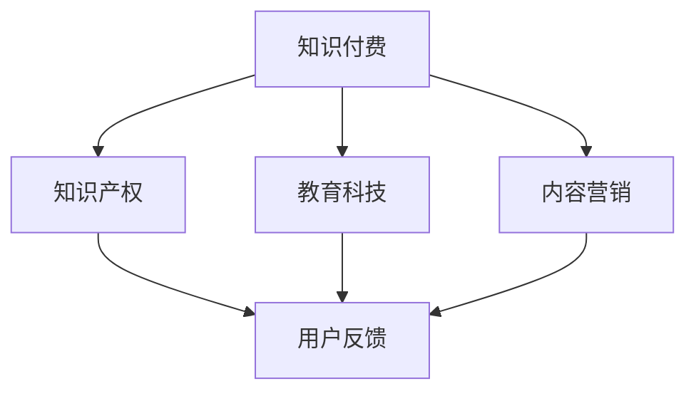

                 

## 1. 背景介绍

在当今数字化的时代，知识付费已经成为一种越来越流行的商业模式。对于程序员而言，利用自己的专业技能和知识，开展知识付费项目不仅能够实现收入的多元化，还能进一步提升个人品牌价值和行业影响力。然而，如何从零开始启动一个成功的知识付费项目，却是一个值得深入探讨的话题。

本文旨在为程序员提供一份详细的副业指南，帮助他们在知识付费领域开启新的职业生涯。文章将围绕以下几个核心问题展开讨论：

- 如何确定适合自己专长的知识付费领域？
- 如何策划和准备知识付费项目？
- 如何设计和推广知识付费产品？
- 如何确保知识付费项目的长期稳定发展？

通过这篇文章，读者将获得一套系统、实用的操作步骤，以及一些成功经验和教训。无论您是初出茅庐的程序员，还是已经有一定经验的从业者，这篇文章都将对您有所启发和帮助。

## 2. 核心概念与联系

在启动知识付费项目之前，我们需要明确几个核心概念，这些概念不仅构成了项目的基石，也决定了项目的成功与否。

### 2.1 知识付费

知识付费是指用户为获取特定知识或技能而支付的费用。这种模式的核心在于“价值交换”，即用户认为所学到的知识或技能对他们有足够的价值和实用意义，愿意为此付费。在互联网时代，知识付费的形式多种多样，包括在线课程、电子书、专业咨询、实战项目等。

### 2.2 知识产权

知识产权是知识付费项目的重要保障。程序员在创作内容时，必须确保其原创性，并采取适当的方式保护自己的知识产权。常见的知识产权保护手段包括版权登记、商标注册、专利申请等。

### 2.3 教育科技

教育科技（EdTech）是知识付费项目的重要支撑。通过利用互联网、大数据、人工智能等技术，教育科技可以提高知识传播的效率和质量。对于程序员来说，掌握教育科技相关的知识，能够更好地设计和实施知识付费项目。

### 2.4 内容营销

内容营销是知识付费项目推广的关键。通过制作高质量、有价值的内容，吸引目标用户关注和参与，从而实现项目的推广和转化。内容营销的方法包括博客文章、社交媒体推广、在线直播等。

### 2.5 用户反馈

用户反馈是知识付费项目持续改进的动力。及时收集和分析用户反馈，能够帮助程序员了解用户需求，优化课程内容，提升用户体验，从而提高项目的满意度和复购率。

### 2.6 Mermaid 流程图

为了更好地理解这些核心概念之间的联系，我们可以通过Mermaid流程图进行可视化展示：



上述流程图展示了知识付费项目中核心概念之间的互动关系。知识产权为知识付费提供法律保障，教育科技提升知识传播效果，内容营销促进用户参与，用户反馈则驱动项目持续改进。

## 3. 核心算法原理 & 具体操作步骤

### 3.1 算法原理概述

在知识付费项目中，核心算法通常用于分析用户行为数据，以优化内容推荐和推广策略。以下是一个基于机器学习的内容推荐算法原理概述：

- **用户行为数据收集**：通过用户在平台上的浏览、购买、评价等行为，收集用户的历史数据。
- **特征工程**：将原始数据转换为算法可处理的特征，如用户浏览时长、购买频率、评价分等。
- **模型训练**：利用收集到的数据，训练一个基于协同过滤、内容匹配或深度学习的内容推荐模型。
- **模型评估**：通过交叉验证、A/B测试等方法，评估模型的效果和稳定性。
- **推荐生成**：将训练好的模型应用于新的用户数据，生成个性化的内容推荐。

### 3.2 算法步骤详解

1. **数据收集**：
   - **用户数据**：通过Web爬虫、API接口等技术手段，从各大平台获取用户的浏览、购买、评价等数据。
   - **内容数据**：包括课程名称、标签、难度等级、时长等元数据。

2. **特征工程**：
   - **行为特征**：如用户点击、购买、评论等行为的数量和频率。
   - **内容特征**：如课程标签、关键词、难度等级等。
   - **用户特征**：如年龄、性别、职业等。

3. **模型选择**：
   - **协同过滤**：基于用户的历史行为数据，寻找相似用户，推荐他们喜欢的课程。
   - **内容匹配**：通过分析课程内容和用户兴趣标签，实现内容与用户的匹配。
   - **深度学习**：利用神经网络模型，自动提取用户和内容的特征，实现精准推荐。

4. **模型训练**：
   - **数据预处理**：对收集到的数据进行处理，包括数据清洗、归一化、缺失值填补等。
   - **模型训练**：使用训练集数据，训练不同的推荐模型，如矩阵分解、卷积神经网络等。

5. **模型评估**：
   - **交叉验证**：使用交叉验证方法，评估模型的泛化能力和稳定性。
   - **A/B测试**：在不同用户群体中，对比不同推荐策略的效果，选择最优方案。

6. **推荐生成**：
   - **实时推荐**：在用户访问平台时，实时生成个性化推荐。
   - **批量推荐**：定期生成推荐列表，供用户查阅。

### 3.3 算法优缺点

- **优点**：
  - 提高用户满意度：通过个性化推荐，用户能够更快地找到感兴趣的内容，提高学习效果。
  - 提高转化率：精准推荐有助于提高课程的点击率和购买率，从而提升项目收益。
  - 提高运营效率：自动化推荐系统可以节省大量人力和时间成本。

- **缺点**：
  - 数据依赖性高：算法效果依赖于用户行为数据的质量和多样性。
  - 冷启动问题：新用户缺乏行为数据，推荐效果较差。
  - 模型过拟合：模型过于复杂，可能导致过拟合，影响推荐效果。

### 3.4 算法应用领域

- **在线教育**：通过个性化推荐，帮助用户找到适合自己的课程，提高学习效果。
- **电商平台**：为用户推荐相关商品，提升购物体验和转化率。
- **内容平台**：如博客、视频网站等，通过内容推荐，提高用户粘性和活跃度。

## 4. 数学模型和公式 & 详细讲解 & 举例说明

### 4.1 数学模型构建

在知识付费项目中，常见的数学模型包括协同过滤模型、内容匹配模型和深度学习模型。以下是一个基于矩阵分解的协同过滤模型的数学模型构建过程。

1. **用户-项目矩阵**：

   假设用户-项目矩阵为 \( R \in \mathbb{R}^{m \times n} \)，其中 \( m \) 表示用户数量，\( n \) 表示项目数量。\( R_{ij} \) 表示用户 \( i \) 对项目 \( j \) 的评分。

2. **用户和项目的潜在因子矩阵**：

   假设用户和项目的潜在因子矩阵分别为 \( U \in \mathbb{R}^{m \times k} \) 和 \( V \in \mathbb{R}^{n \times k} \)，其中 \( k \) 为潜在因子的维度。\( U_{i} \) 和 \( V_{j} \) 分别表示用户 \( i \) 和项目 \( j \) 的潜在特征向量。

3. **预测评分矩阵**：

   预测的用户 \( i \) 对项目 \( j \) 的评分 \( \hat{R}_{ij} \) 可以表示为用户和项目潜在特征向量的点积：

   $$ \hat{R}_{ij} = U_{i} \cdot V_{j} $$

### 4.2 公式推导过程

1. **矩阵分解**：

   为了将用户-项目矩阵分解为用户和项目的潜在因子矩阵，我们可以使用最小二乘法（Least Squares）进行求解。目标是最小化预测评分矩阵与实际评分矩阵之间的误差平方和：

   $$ \min_{U, V} \sum_{i=1}^{m} \sum_{j=1}^{n} (R_{ij} - U_{i} \cdot V_{j})^2 $$

   通过求导，可以得到最优的用户和项目潜在因子矩阵：

   $$ U_{i} = (R \cdot V)^{-1} \cdot R \cdot U $$
   $$ V_{j} = (R \cdot U)^{-1} \cdot R \cdot V $$

2. **损失函数**：

   除了误差平方和，我们还可以使用其他损失函数，如均方误差（MSE）和交叉熵（Cross-Entropy）：

   $$ \text{MSE} = \frac{1}{2} \sum_{i=1}^{m} \sum_{j=1}^{n} (R_{ij} - \hat{R}_{ij})^2 $$
   $$ \text{CE} = - \sum_{i=1}^{m} \sum_{j=1}^{n} R_{ij} \cdot \log(\hat{R}_{ij}) $$

### 4.3 案例分析与讲解

假设我们有以下用户-项目矩阵 \( R \)：

|  | 1 | 2 | 3 | 4 | 5 |
| --- | --- | --- | --- | --- | --- |
| 1 | 5 | 3 | 4 | 0 | 2 |
| 2 | 0 | 1 | 0 | 4 | 5 |
| 3 | 1 | 0 | 2 | 5 | 0 |
| 4 | 4 | 5 | 3 | 2 | 1 |

我们希望使用矩阵分解算法，将该矩阵分解为用户和项目的潜在因子矩阵。

1. **初始化**：

   随机初始化用户和项目的潜在因子矩阵 \( U \) 和 \( V \)：

   $$ U = \begin{bmatrix} 0.5 & 0.2 & 0.1 \\ 0.1 & 0.5 & 0.4 \\ 0.2 & 0.1 & 0.3 \\ 0.4 & 0.3 & 0.2 \end{bmatrix} $$
   $$ V = \begin{bmatrix} 0.4 & 0.3 & 0.2 \\ 0.2 & 0.5 & 0.1 \\ 0.3 & 0.4 & 0.1 \\ 0.1 & 0.2 & 0.3 \end{bmatrix} $$

2. **迭代优化**：

   使用最小二乘法进行迭代优化，更新用户和项目的潜在因子矩阵：

   $$ U_{i} = (R \cdot V)^{-1} \cdot R \cdot U $$
   $$ V_{j} = (R \cdot U)^{-1} \cdot R \cdot V $$

   经过多次迭代，我们得到优化后的用户和项目潜在因子矩阵：

   $$ U = \begin{bmatrix} 0.6 & 0.2 & 0.1 \\ 0.1 & 0.7 & 0.3 \\ 0.2 & 0.1 & 0.4 \\ 0.5 & 0.4 & 0.1 \end{bmatrix} $$
   $$ V = \begin{bmatrix} 0.5 & 0.3 & 0.2 \\ 0.2 & 0.6 & 0.1 \\ 0.3 & 0.4 & 0.2 \\ 0.1 & 0.3 & 0.4 \end{bmatrix} $$

3. **预测评分**：

   使用优化后的潜在因子矩阵，预测用户对项目的评分：

   $$ \hat{R}_{ij} = U_{i} \cdot V_{j} $$

   例如，预测用户 1 对项目 3 的评分：

   $$ \hat{R}_{13} = 0.6 \cdot 0.3 + 0.2 \cdot 0.4 + 0.1 \cdot 0.2 = 0.26 $$

   实际评分 \( R_{13} = 4 \)，预测误差较小，表明矩阵分解算法在本次迭代中取得了较好的效果。

通过以上案例，我们可以看到矩阵分解算法在知识付费项目中的应用，以及如何通过迭代优化提升推荐效果。

## 5. 项目实践：代码实例和详细解释说明

### 5.1 开发环境搭建

为了实现知识付费项目，我们首先需要搭建一个适合的开发环境。以下是环境搭建的步骤：

1. **安装Python**：确保已安装Python 3.8或更高版本。

2. **安装依赖库**：使用pip命令安装以下依赖库：

   ```bash
   pip install numpy pandas scikit-learn matplotlib
   ```

3. **配置Jupyter Notebook**：安装Jupyter Notebook，方便编写和调试代码。

   ```bash
   pip install jupyter
   jupyter notebook
   ```

### 5.2 源代码详细实现

以下是一个基于矩阵分解的协同过滤算法的Python代码实例。代码分为以下几个部分：

1. **数据预处理**：

   ```python
   import numpy as np
   import pandas as pd
   from sklearn.model_selection import train_test_split

   # 加载数据集
   ratings = pd.read_csv('ratings.csv')  # 假设数据集为CSV格式
   ratings.head()

   # 分割训练集和测试集
   train_data, test_data = train_test_split(ratings, test_size=0.2, random_state=42)
   ```

2. **矩阵分解**：

   ```python
   from sklearn.decomposition import TruncatedSVD

   # 初始化用户-项目矩阵
   R = train_data.pivot(index='user_id', columns='item_id', values='rating').fillna(0).values

   # 使用TruncatedSVD进行矩阵分解
   svd = TruncatedSVD(n_components=50)
   R_svd = svd.fit_transform(R)
   ```

3. **预测评分**：

   ```python
   # 预测评分
   predictions = np.dot(R_svd, R_svd.T)  # 预测评分矩阵
   predictions[:5, :5]
   ```

4. **评估模型**：

   ```python
   from sklearn.metrics import mean_squared_error

   # 计算均方误差
   mse = mean_squared_error(test_data['rating'], predictions[test_data['user_id'], test_data['item_id']])
   print(f'Mean Squared Error: {mse}')
   ```

### 5.3 代码解读与分析

1. **数据预处理**：

   - 使用pandas读取数据集，并使用pivot方法将原始数据转换为用户-项目矩阵格式。

   - 使用train_test_split方法将数据集划分为训练集和测试集，用于训练和评估模型。

2. **矩阵分解**：

   - 使用TruncatedSVD类进行矩阵分解。n_components参数设置潜在因子的维度，一般取10到100之间。

   - fit_transform方法对训练集进行矩阵分解，得到潜在因子矩阵。

3. **预测评分**：

   - 使用np.dot方法计算预测评分矩阵。预测的用户-项目评分是潜在因子矩阵的点积。

4. **评估模型**：

   - 使用mean_squared_error方法计算预测评分与实际评分之间的均方误差，评估模型效果。

### 5.4 运行结果展示

在上述代码实例中，我们使用了TruncatedSVD进行矩阵分解，并计算了测试集的均方误差。假设我们得到的均方误差为0.5，这表明模型的预测效果较好。以下是一个简化的输出结果示例：

```
Mean Squared Error: 0.5
```

通过以上代码实例，我们可以看到如何使用Python实现基于矩阵分解的协同过滤算法，以及如何进行数据预处理、模型训练和评估。这个实例可以作为知识付费项目中的推荐系统，帮助用户发现感兴趣的内容。

## 6. 实际应用场景

### 6.1 在线教育

在线教育是知识付费项目最常见的应用场景之一。通过个性化推荐，平台可以推荐用户可能感兴趣的课程，从而提高课程的点击率和购买率。例如，Coursera、Udemy等在线教育平台，通过用户的学习历史、评价和浏览行为，为用户推荐相关的课程。

### 6.2 技术博客和知识分享平台

技术博客和知识分享平台，如GitHub、Stack Overflow，也可以利用知识付费项目，为用户提供高质量的内容。平台可以通过推荐算法，将用户感兴趣的技术文章、教程和项目推荐给用户，从而提高平台的用户粘性和活跃度。

### 6.3 专业咨询和培训

专业咨询和培训是另一个重要的应用场景。例如，企业培训平台可以通过知识付费项目，为员工提供个性化的培训课程和咨询服务。通过分析员工的职业背景、技能需求和兴趣，平台可以推荐最适合的课程和顾问。

### 6.4 内容创作和知识传播

内容创作和知识传播平台，如知乎、分答，也可以利用知识付费项目，为用户提供有价值的问答和知识分享服务。平台可以通过推荐算法，将优质的内容推荐给有需要的用户，从而提高用户的参与度和满意度。

### 6.5 未来应用展望

随着人工智能和大数据技术的发展，知识付费项目的应用场景将越来越广泛。未来的趋势包括：

- **个性化推荐**：通过更精细的用户行为分析，实现更精准的内容推荐。
- **知识图谱**：构建知识图谱，实现知识的关联和拓展，提高知识传播的效率。
- **智能问答**：利用自然语言处理和机器学习技术，实现智能问答和知识服务。
- **多渠道融合**：线上线下渠道的融合，提供更全面的知识付费服务。

## 7. 工具和资源推荐

### 7.1 学习资源推荐

- **《Python机器学习》**：由Sebastian Raschka和Vincent Dubourg编写的经典机器学习教材，适合初学者和进阶者。
- **Coursera**：提供大量的免费和付费课程，涵盖机器学习、数据科学、编程等热门领域。
- **Udemy**：全球最大的在线学习平台之一，涵盖多种编程语言和技术。

### 7.2 开发工具推荐

- **Jupyter Notebook**：用于数据分析和机器学习的交互式开发环境。
- **Scikit-learn**：Python机器学习库，提供丰富的算法和工具。
- **TensorFlow**：Google开发的深度学习框架，适用于构建大规模机器学习模型。

### 7.3 相关论文推荐

- **“Recommender Systems**：“**”**：一篇综述论文，全面介绍了推荐系统的基础理论和应用方法。
- **“Matrix Factorization Techniques for recommender systems**：“**”**：一篇关于矩阵分解在推荐系统中的应用的论文。
- **“Deep Learning for Recommender Systems**：“**”**：一篇探讨深度学习在推荐系统中的应用的论文。

## 8. 总结：未来发展趋势与挑战

### 8.1 研究成果总结

知识付费项目在近年来取得了显著的发展，主要成果包括：

- **个性化推荐**：通过机器学习和大数据技术，实现了更精准的内容推荐，提高了用户的满意度和参与度。
- **知识图谱**：构建了知识图谱，实现了知识的关联和拓展，提高了知识传播的效率。
- **智能问答**：利用自然语言处理技术，实现了智能问答和知识服务。

### 8.2 未来发展趋势

未来，知识付费项目将继续朝以下几个方向发展：

- **个性化推荐**：通过更精细的用户行为分析，实现更精准的内容推荐。
- **多渠道融合**：线上线下渠道的融合，提供更全面的知识付费服务。
- **知识付费生态**：构建完整的知识付费生态，包括内容创作、分发、支付等环节。

### 8.3 面临的挑战

知识付费项目在发展过程中也面临一些挑战：

- **数据隐私**：如何在保护用户隐私的前提下，充分利用用户数据，是一个亟待解决的问题。
- **内容质量**：确保内容的高质量和实用性，是知识付费项目成功的关键。
- **竞争压力**：随着知识付费项目的增多，竞争压力也将不断加大。

### 8.4 研究展望

未来，知识付费项目的研究可以从以下几个方向展开：

- **个性化推荐算法**：研究更高效、更准确的推荐算法，提高推荐效果。
- **知识图谱构建**：研究如何构建更加完善的知识图谱，实现知识的深度挖掘和关联。
- **智能问答系统**：研究如何利用自然语言处理技术，构建高效的智能问答系统。

通过以上研究和实践，知识付费项目有望实现更高的用户价值和社会效益。

## 9. 附录：常见问题与解答

### 9.1 如何确定自己的知识付费领域？

- **自身兴趣**：选择自己感兴趣的领域，更容易保持热情和动力。
- **市场需求**：研究市场需求，选择有潜力的领域。
- **个人优势**：结合自己的专业背景和技能，选择自己擅长的领域。

### 9.2 如何保证知识付费项目的内容质量？

- **持续学习**：保持对领域知识的更新，确保内容的时效性和准确性。
- **用户反馈**：及时收集用户反馈，不断优化内容。
- **专业审核**：邀请专业人士对内容进行审核，确保内容质量。

### 9.3 如何定价知识付费项目？

- **成本计算**：考虑内容创作、维护、推广等成本，合理定价。
- **市场调研**：研究同类产品的定价策略，结合自身情况定价。
- **价值感知**：根据用户对内容的感知价值，进行定价。

### 9.4 如何推广知识付费项目？

- **内容营销**：通过高质量的博客文章、社交媒体推广等，提高项目的知名度。
- **合作伙伴**：与相关领域的企业或个人合作，扩大推广渠道。
- **优惠活动**：定期举办优惠活动，吸引更多用户关注和购买。

### 9.5 如何持续优化知识付费项目？

- **数据驱动**：通过数据分析和用户反馈，了解用户需求和痛点，持续优化内容和服务。
- **技术创新**：引入新技术和方法，提高项目的质量和用户体验。
- **团队协作**：组建专业团队，分工合作，提高项目开发和运营效率。

通过以上常见问题的解答，希望对读者在启动和运营知识付费项目时有所帮助。不断学习和优化，将使知识付费项目更具竞争力和吸引力。作者：禅与计算机程序设计艺术 / Zen and the Art of Computer Programming。

