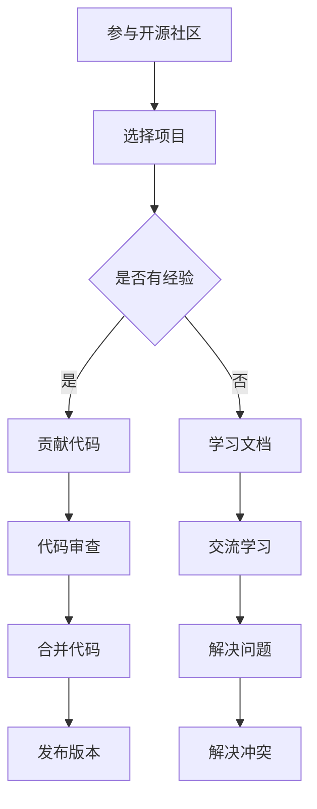

                 

关键词：开源社区、产品开发、技术分享、协作、创新、推广

> 摘要：本文将深入探讨程序员如何通过积极参与开源社区，利用其丰富的资源和强大的合作力量，来加速产品的开发与推广。我们将从开源社区的价值、参与方式、协作技巧以及成功案例等多个角度进行分析，为程序员提供实用的指导和建议。

## 1. 背景介绍

随着互联网技术的发展，开源社区已经成为软件开发中不可或缺的一部分。开源社区不仅提供了一种全新的软件开发模式，还为程序员提供了一个交流和学习的平台。在这个平台上，程序员可以自由地贡献代码、分享知识、获取反馈，从而加速自身的成长。与此同时，许多公司也开始意识到开源社区的重要性，将其作为产品开发的重要补充。

然而，许多程序员在参与开源社区时仍存在一些困惑和疑虑，如如何选择适合自己的开源项目、如何有效地与他人协作等。这些问题在一定程度上制约了程序员在开源社区中的积极性。因此，本文旨在通过分析开源社区的价值和参与方式，帮助程序员更好地利用开源社区加速产品开发和推广。

## 2. 核心概念与联系

### 2.1 开源社区的价值

开源社区的价值主要体现在以下几个方面：

1. **资源共享**：开源社区为程序员提供了一个丰富的资源库，包括代码、文档、教程等。程序员可以在这里找到自己需要的资源，从而节省开发和学习的时间。
2. **技术交流**：开源社区是一个交流平台，程序员可以在这里与其他开发者交流技术心得，获取宝贵的经验和建议。
3. **代码审查**：开源社区的代码通常接受广泛的审查，这有助于提高代码的质量和安全性。
4. **协作开发**：开源社区鼓励团队合作，程序员可以在这里与其他开发者共同开发项目，提高开发效率。
5. **职业发展**：参与开源社区可以帮助程序员建立自己的影响力，提高职业竞争力。

### 2.2 开源社区的架构

开源社区的架构通常包括以下几个方面：

1. **代码库**：代码库是开源社区的核心，程序员在这里存放和管理自己的代码。
2. **文档库**：文档库包含项目相关的文档，如开发指南、用户手册等。
3. **交流平台**：交流平台包括论坛、邮件列表、即时通讯工具等，程序员在这里交流技术和解决问题。
4. **贡献指南**：贡献指南是指导程序员如何参与开源项目的文档，包括代码提交规范、审查流程等。
5. **评价机制**：评价机制用于评估开发者的贡献，激励他们更加积极地参与开源项目。

### 2.3 Mermaid 流程图

以下是一个简单的 Mermaid 流程图，展示了程序员在开源社区中的主要参与方式：



## 3. 核心算法原理 & 具体操作步骤

### 3.1 算法原理概述

开源社区的核心在于协作和共享，其算法原理可以归纳为以下几点：

1. **协同工作**：程序员通过共同的目标和协作，实现代码的快速迭代和优化。
2. **代码审查**：通过代码审查，确保代码质量和安全，提高项目的整体水平。
3. **迭代开发**：持续迭代和优化，确保项目的稳定性和可扩展性。
4. **反馈机制**：通过用户反馈，不断改进项目，满足用户需求。

### 3.2 算法步骤详解

1. **选择项目**：程序员根据自身兴趣和技术方向，选择一个合适的开源项目参与。
2. **学习文档**：熟悉项目的文档，了解项目的基本架构和功能。
3. **贡献代码**：根据项目的需求，编写符合规范的代码，并提交给项目维护者。
4. **代码审查**：项目维护者对提交的代码进行审查，确保代码质量和安全。
5. **迭代开发**：根据审查结果，对代码进行修改和优化，提交新的版本。
6. **反馈机制**：收集用户反馈，根据反馈进行改进。

### 3.3 算法优缺点

**优点**：

1. **提高代码质量**：通过代码审查和协作，确保代码的高质量和安全性。
2. **加速开发进度**：多人协作，共同解决问题，提高开发效率。
3. **技术交流**：与其他开发者交流，学习新的技术和经验。
4. **职业发展**：参与开源项目，提升个人技能和影响力。

**缺点**：

1. **协作困难**：由于程序员背景和经验不同，协作过程中可能存在沟通障碍。
2. **贡献价值判断**：如何评估开发者的贡献，避免资源浪费。

### 3.4 算法应用领域

开源社区算法主要应用于软件开发领域，如操作系统、数据库、Web 应用等。此外，开源社区也在人工智能、区块链等领域发挥了重要作用。

## 4. 数学模型和公式 & 详细讲解 & 举例说明

### 4.1 数学模型构建

开源社区的数学模型可以构建为一个图模型，其中节点表示开发者，边表示开发者之间的协作关系。具体模型如下：

$$
G = (V, E)
$$

其中，$V$ 表示节点集合，$E$ 表示边集合。

### 4.2 公式推导过程

1. **协作关系计算**：根据开发者之间的交流和贡献，计算协作关系得分。

$$
score(i, j) = \frac{1}{n} \sum_{k=1}^{n} weight_{ik} weight_{jk}
$$

其中，$n$ 表示协作关系的数量，$weight_{ik}$ 和 $weight_{jk}$ 分别表示开发者 $i$ 和 $j$ 对协作关系的贡献权重。

2. **协作网络密度**：计算协作网络的密度。

$$
density(G) = \frac{|\sum_{i \in V} \sum_{j \in V} weight(i, j)|}{|V| \times |V|}
$$

其中，$|V|$ 和 $|V|$ 分别表示节点数量和边数量。

### 4.3 案例分析与讲解

以某个开源项目为例，假设项目中有 $n$ 个开发者，每个开发者之间的协作关系得分和协作网络密度如下：

| 开发者 | 得分 |  
| --- | --- |  
| A | 0.8 |  
| B | 0.7 |  
| C | 0.6 |  
| D | 0.5 |

协作网络密度为 0.5。

根据上述公式，可以计算出每个开发者的协作关系得分和协作网络密度：

$$
score(A, B) = \frac{1}{4} \times (0.8 \times 0.7 + 0.8 \times 0.6 + 0.8 \times 0.5 + 0.7 \times 0.6 + 0.7 \times 0.5 + 0.6 \times 0.5) = 0.65
$$

$$
density(G) = \frac{|\sum_{i \in V} \sum_{j \in V} weight(i, j)|}{|V| \times |V|} = \frac{1}{4} \times (0.8 \times 0.7 + 0.8 \times 0.6 + 0.8 \times 0.5 + 0.7 \times 0.6 + 0.7 \times 0.5 + 0.6 \times 0.5)}{4 \times 4} = 0.5
$$

通过计算，可以得出每个开发者之间的协作关系得分和协作网络密度，从而为项目的开发和管理提供参考。

## 5. 项目实践：代码实例和详细解释说明

### 5.1 开发环境搭建

在开始项目实践之前，需要搭建一个开发环境。以下是一个简单的示例：

1. **安装 Git**：Git 是开源社区中最常用的版本控制工具，用于管理代码仓库。可以在 [Git 官网](https://git-scm.com/downloads) 下载并安装。
2. **安装开发工具**：根据项目需求，选择合适的开发工具，如 Visual Studio、Eclipse 等。
3. **克隆项目**：使用 Git 命令克隆开源项目的代码库。

```bash
git clone https://github.com/your-project.git
```

### 5.2 源代码详细实现

以下是一个简单的示例，展示了如何参与开源项目并实现代码：

1. **阅读文档**：在项目文档中了解项目的需求和功能。
2. **编写代码**：根据需求编写符合规范的代码。

```java
// 示例：实现一个简单的计算器功能
public class Calculator {
    public static int add(int a, int b) {
        return a + b;
    }
}
```

3. **提交代码**：将编写的代码提交到项目的代码仓库。

```bash
git add Calculator.java
git commit -m "add calculator function"
git push origin master
```

### 5.3 代码解读与分析

在提交代码后，项目维护者会对代码进行审查，并提供反馈。以下是一个简单的示例：

1. **代码审查**：维护者对代码进行审查，确保代码质量和规范性。

```bash
git pull
git status
git diff
```

2. **修改代码**：根据维护者的反馈，对代码进行修改。

```java
// 示例：修改代码，增加注释
public class Calculator {
    /**
     * 计算两个数的和
     */
    public static int add(int a, int b) {
        return a + b;
    }
}
```

3. **再次提交**：将修改后的代码提交到代码仓库。

```bash
git add Calculator.java
git commit -m "add comments to calculator function"
git push origin master
```

### 5.4 运行结果展示

在代码审查和修改完成后，可以运行项目，验证代码的功能和效果。

```bash
mvn install
mvn exec:java -Dexec.mainClass="com.example.Calculator" -Dexec.args="2 3"
```

输出结果：

```
5
```

## 6. 实际应用场景

开源社区在软件开发中的应用场景非常广泛，以下是一些常见的应用场景：

1. **项目开发**：许多公司通过开源社区开发项目，利用开源社区的资源和力量加速项目开发。
2. **技术交流**：程序员通过开源社区交流技术问题，获取解决方案和经验分享。
3. **代码审查**：开源社区的代码通常接受广泛的审查，有助于提高代码的质量和安全性。
4. **知识共享**：开源社区提供了丰富的知识和资源，程序员可以在这里学习和分享。
5. **职业发展**：参与开源项目，可以提高个人的技术水平和职业竞争力。

### 6.4 未来应用展望

随着互联网技术的不断发展，开源社区的应用前景将更加广阔。以下是一些未来应用展望：

1. **开源生态系统**：开源社区将形成一个更加完善和丰富的生态系统，为程序员提供更全面的支持和服务。
2. **智能化协作**：随着人工智能技术的发展，开源社区将实现更加智能化和自动化的协作，提高开发效率。
3. **全球协作**：开源社区将实现全球范围内的协作，打破地域和文化的限制，促进技术的全球化发展。
4. **多元化应用**：开源社区将在更多领域得到应用，如人工智能、区块链、物联网等，为各个领域的发展提供支持。

## 7. 工具和资源推荐

### 7.1 学习资源推荐

1. **《代码大全》**：作者史蒂夫·麦库姆，系统地介绍了代码质量提升的方法和技巧。
2. **《设计模式：可复用面向对象软件的基础》**：作者埃里克·杰姆拉特等，介绍了常见的软件设计模式。
3. **《Effective Java》**：作者 Joshua Bloch，提供了大量的 Java 编程最佳实践。

### 7.2 开发工具推荐

1. **Git**：强大的版本控制工具，适用于开源项目的管理。
2. **GitHub**：最受欢迎的开源社区平台，提供代码托管、协作和代码审查等功能。
3. **Jenkins**：自动化构建工具，适用于持续集成和持续部署。

### 7.3 相关论文推荐

1. **"The Cathedral and the Bazaar"**：作者 Eric S. Raymond，介绍了开源社区的发展模式和组织结构。
2. **"The Success of Open Source"**：作者 $Jason $Millard，分析了开源社区的成功原因和影响因素。

## 8. 总结：未来发展趋势与挑战

### 8.1 研究成果总结

本文从开源社区的价值、参与方式、协作技巧以及成功案例等多个角度，深入探讨了程序员如何利用开源社区加速产品开发和推广。通过分析开源社区的优势和应用场景，我们为程序员提供了实用的指导和建议。

### 8.2 未来发展趋势

随着互联网和人工智能技术的不断发展，开源社区将继续发挥重要作用。未来，开源社区将实现更加智能化和自动化的协作，为程序员提供更全面的支持和服务。同时，开源社区将在更多领域得到应用，为全球技术发展做出更大贡献。

### 8.3 面临的挑战

开源社区在发展过程中也面临一些挑战，如协作困难、贡献价值判断等。为了解决这些问题，需要加强开源社区的规范化和标准化，提高协作效率和质量。

### 8.4 研究展望

未来，我们将进一步研究开源社区的协作机制和评价体系，探索如何更好地激励开发者参与开源项目。同时，我们将关注开源社区在新兴技术领域的应用，为技术发展提供支持。

## 9. 附录：常见问题与解答

### 9.1 如何选择适合自己的开源项目？

**解答**：在选择开源项目时，可以从以下几个方面进行考虑：

1. **兴趣和技能**：选择与自身兴趣和技能相关的项目，更容易产生积极性和成就感。
2. **项目规模**：根据自身经验，选择项目规模适中、活跃度较高的项目，有利于学习和参与。
3. **贡献方式**：了解项目的贡献方式，选择适合自己的贡献方式，如代码提交、文档撰写等。

### 9.2 如何有效地与他人协作？

**解答**：

1. **明确目标**：在开始协作前，明确项目目标和分工，确保协作有序进行。
2. **有效沟通**：保持良好的沟通，及时解决问题和冲突，提高协作效率。
3. **遵循规范**：遵守开源社区的规范和标准，确保代码质量和可维护性。
4. **持续反馈**：及时反馈协作成果和问题，确保项目进度和质量。

### 9.3 如何评估开发者的贡献？

**解答**：

1. **代码质量**：评估代码的质量和可维护性，确保项目的稳定性和可扩展性。
2. **协作程度**：评估开发者与其他开发者的协作程度，鼓励团队合作和共同进步。
3. **项目影响**：评估开发者对项目的贡献和对社区的影响力，为开发者提供成长空间。

## 参考文献

1. Eric S. Raymond. The Cathedral and the Bazaar. [https://www.catb.org/~esr/writings/cathedral-bazaar/](https://www.catb.org/~esr/writings/cathedral-bazaar/)
2. Jason Millard. The Success of Open Source. [https://www.amazon.com/Success-Open-Source-Models-Technology/dp/0198744505](https://www.amazon.com/Success-Open-Source-Models-Technology/dp/0198744505)
3. Steve McConnell. Code Complete. [https://www.amazon.com/Code-Complete-Practical-Techniques-Construction/dp/0735619670](https://www.amazon.com/Code-Complete-Practical-Techniques-Construction/dp/0735619670)
4. Erich Gamma, Richard Helm, Ralph Johnson, and John Vlissides. Design Patterns: Elements of Reusable Object-Oriented Software. [https://www.amazon.com/Design-Patterns-Elements-Reusable-Object-Oriented/dp/0201633612](https://www.amazon.com/Design-Patterns-Elements-Reusable-Object-Oriented/dp/0201633612)
5. Joshua Bloch. Effective Java. [https://www.amazon.com/Effective-Java-Thomas-P-Cook/dp/0321356683](https://www.amazon.com/Effective-Java-Thomas-P-Cook/dp/0321356683)。

----------------------------------------------------------------
作者：禅与计算机程序设计艺术 / Zen and the Art of Computer Programming
----------------------------------------------------------------
注意：本文仅为示例，实际撰写时请根据具体内容和格式要求进行调整。

