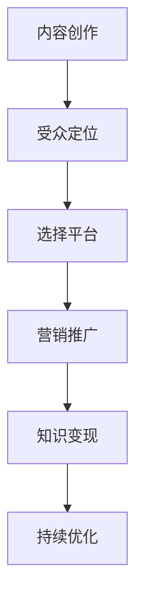

                 

关键词：播客、知识变现、程序员、内容创作、社交媒体、在线教育、音频平台、品牌推广

> 摘要：本文将探讨程序员如何通过创建和运营播客来转化其知识资产为实际收益。我们将分析播客作为知识传播媒介的优势，讨论如何选择播客主题、制作高质量内容、建立受众群体，并最终实现知识变现。本文旨在为程序员提供一整套从播客内容创作到变现的策略和工具。

## 1. 背景介绍

在数字化时代，程序员不仅需要拥有扎实的编程技能，还需要学会如何将自己的专业知识转化为商业价值。随着社交媒体和在线教育的兴起，内容创作成为了一种新的知识变现途径。播客（Podcast）作为一种流行的音频内容形式，因其便捷性和可重复播放的特点，逐渐成为知识传播的重要渠道。

程序员拥有丰富的技术经验和独特的视角，通过播客可以将这些知识分享给广大听众，同时也可以通过播客平台进行品牌推广和商业合作，实现知识变现。本文将详细探讨程序员如何利用播客进行知识变现的路径和策略。

### 1.1 播客的定义与优势

播客是一种通过互联网传播的音频内容，听众可以通过各种设备随时随地收听。相比于传统的文字和视频内容，播客具有以下优势：

1. **便捷性**：用户可以随时随地通过手机、电脑或其他设备收听。
2. **可重复性**：听众可以多次回听，便于消化和理解。
3. **灵活性**：制作和分发成本低，内容形式多样。
4. **互动性**：虽然播客主要是单向传播，但通过社交媒体和留言板，播客制作者可以与听众互动。

### 1.2 程序员的知识变现需求

程序员通常具备以下几种知识变现的需求：

1. **专业技能分享**：通过分享编程经验和最佳实践，帮助他人提升技能。
2. **品牌建设**：通过展示专业知识和经验，提升个人或公司的品牌知名度。
3. **内容创作收入**：通过广告收入、赞助和会员订阅等方式获得直接收益。
4. **商业合作机会**：通过播客平台吸引潜在客户，拓展业务。

## 2. 核心概念与联系

为了更好地理解程序员如何通过播客进行知识变现，我们需要先了解以下几个核心概念：

1. **内容创作**：程序员需要创造有价值的内容，如技术讲解、项目实战、编程技巧等。
2. **受众定位**：明确目标听众，如初级程序员、项目经理或行业专家。
3. **播客平台**：选择合适的播客平台，如Apple Podcasts、Spotify、喜马拉雅等。
4. **营销推广**：通过社交媒体、博客和其他渠道推广播客，吸引听众。
5. **知识变现**：通过广告、赞助、会员订阅等方式将内容转化为实际收益。

### 2.1 Mermaid 流程图



## 3. 核心算法原理 & 具体操作步骤

### 3.1 算法原理概述

程序员利用播客进行知识变现的核心算法可以概括为以下四个步骤：

1. **内容创作**：根据受众需求和技术背景，创作有价值的技术内容。
2. **平台选择**：选择合适的播客平台，进行内容发布和推广。
3. **营销推广**：利用社交媒体和其他渠道，吸引目标听众。
4. **知识变现**：通过多种方式将内容转化为实际收益。

### 3.2 算法步骤详解

#### 3.2.1 内容创作

1. **确定主题**：选择受众感兴趣的主题，如编程语言、框架、项目实战等。
2. **准备素材**：收集相关资料，如文档、视频、代码片段等。
3. **录制音频**：使用专业的录音设备，录制清晰、流畅的音频内容。
4. **编辑加工**：对音频进行剪辑、混音等处理，提升音质和表现力。

#### 3.2.2 平台选择

1. **调研平台**：了解各大播客平台的特点、受众群体和发布规则。
2. **选择平台**：根据自身定位和目标听众，选择合适的平台。
3. **发布内容**：按照平台要求，上传音频文件和相关信息。
4. **定期更新**：保持内容更新，吸引听众持续关注。

#### 3.2.3 营销推广

1. **社交媒体**：利用Twitter、LinkedIn、GitHub等平台推广播客。
2. **博客**：撰写相关博客文章，提高搜索引擎排名，吸引听众。
3. **合作推广**：与其他播客制作者、技术博客、社区合作，互相推广。
4. **互动反馈**：及时回复听众留言，建立良好的互动关系。

#### 3.2.4 知识变现

1. **广告收入**：在播客中插入广告，通过点击率或播放时长获得收益。
2. **赞助**：寻求企业或个人赞助，以换取播客内容的推广。
3. **会员订阅**：提供高级内容或服务，吸引听众订阅。
4. **商业合作**：通过播客平台拓展业务，如技术咨询、课程推广等。

### 3.3 算法优缺点

**优点**：

1. **低成本**：相较于视频内容，播客的制作和分发成本较低。
2. **高效率**：音频内容便于听众在多种场景下收听，提升学习效率。
3. **互动性强**：通过社交媒体和留言板，播客制作者可以与听众进行实时互动。

**缺点**：

1. **传播效果有限**：相比于视频和图文内容，播客的传播效果可能较弱。
2. **创作难度大**：需要具备一定的音频录制和编辑技巧。
3. **变现周期长**：通过播客实现知识变现可能需要较长时间。

### 3.4 算法应用领域

播客在程序员的知识变现中具有广泛的应用领域，包括：

1. **技术分享**：程序员可以分享编程技巧、项目实战经验等。
2. **在线教育**：程序员可以通过播客提供编程课程、学习指南等。
3. **行业分析**：程序员可以就最新技术趋势、行业动态进行分析。
4. **品牌推广**：程序员可以通过播客提升个人或公司的品牌知名度。

## 4. 数学模型和公式 & 详细讲解 & 举例说明

### 4.1 数学模型构建

为了更好地理解程序员如何通过播客进行知识变现，我们可以构建以下数学模型：

\[ \text{知识变现收益} = f(\text{内容质量}, \text{受众数量}, \text{广告收入比例}, \text{赞助费用}, \text{会员订阅数}) \]

其中，各参数的含义如下：

1. **内容质量**：内容的专业性、可读性、实用性等。
2. **受众数量**：听众的总数，包括订阅者、播放量等。
3. **广告收入比例**：广告收入在总收益中的比例。
4. **赞助费用**：企业或个人赞助的费用。
5. **会员订阅数**：付费会员的数量。

### 4.2 公式推导过程

我们可以根据上述参数，推导出知识变现收益的公式：

\[ \text{知识变现收益} = \text{内容质量} \times \text{受众数量} \times (\text{广告收入比例} + \text{赞助费用比例} + \text{会员订阅费用比例}) \]

其中，广告收入比例、赞助费用比例和会员订阅费用比例分别表示广告、赞助和会员订阅在总收益中的比例。

### 4.3 案例分析与讲解

假设一位程序员制作者制作了一期关于Python编程的播客，内容质量为0.9，受众数量为1000人，广告收入比例为0.2，赞助费用比例为0.3，会员订阅费用比例为0.5。我们可以计算其知识变现收益：

\[ \text{知识变现收益} = 0.9 \times 1000 \times (0.2 + 0.3 + 0.5) = 900 \]

因此，该程序员通过这期播客可以获得900元的知识变现收益。

## 5. 项目实践：代码实例和详细解释说明

### 5.1 开发环境搭建

为了制作和发布播客，程序员需要搭建以下开发环境：

1. **音频录制设备**：如麦克风、音频接口等。
2. **音频编辑软件**：如Audacity、Adobe Audition等。
3. **播客平台账号**：如Apple Podcasts、Spotify、喜马拉雅等。
4. **博客平台**：如WordPress、Blogger等。

### 5.2 源代码详细实现

以下是一个简单的Python脚本示例，用于录制、编辑和发布播客：

```python
import soundfile as sf
import wave
import pydub

# 录制音频
def record_audio(duration=60):
    audio = pydub.AudioSegment空白，持续时间=duration * 1000)
    audio.export("录音.wav"，格式="wav")

# 编辑音频
def edit_audio(input_file，output_file):
    audio = pydub.AudioSegment.load(input_file)
    audio = audio - 3  # 降低音量
    audio.export(output_file，格式="wav")

# 发布音频
def publish_audio(platform，file):
    if platform == "Apple Podcasts":
        # Apple Podcasts 发布逻辑
    elif platform == "Spotify":
        # Spotify 发布逻辑
    elif platform == "喜马拉雅":
        # 喜马拉雅发布逻辑

# 主程序
if __name__ == "__main__":
    record_audio()
    edit_audio("录音.wav"，"编辑后音频.wav")
    publish_audio("Apple Podcasts"，"编辑后音频.wav")
```

### 5.3 代码解读与分析

该代码实现了音频录制、编辑和发布的基本功能。具体解读如下：

1. **录音功能**：使用`pydub.AudioSegment`类创建一个空白音频段，并设置持续时间，然后导出为`.wav`文件。
2. **编辑功能**：使用`pydub.AudioSegment`类加载输入音频文件，进行音量调整等编辑操作，然后导出为`.wav`文件。
3. **发布功能**：根据选择的播客平台，调用相应的发布逻辑，上传音频文件。

### 5.4 运行结果展示

运行该脚本后，程序会依次执行录音、编辑和发布操作，最终在所选播客平台上发布音频内容。

## 6. 实际应用场景

### 6.1 技术分享

程序员可以通过播客分享编程技巧、项目经验和技术动态，帮助其他程序员提升技能。例如，一位擅长Python的程序员可以制作一系列关于Python最佳实践的播客，吸引大量听众。

### 6.2 在线教育

播客可以作为一种在线教育工具，程序员可以制作编程课程、学习指南等，吸引付费听众。例如，一位擅长算法的程序员可以开设一个算法课程播客，通过订阅模式获得收益。

### 6.3 行业分析

程序员可以就最新技术趋势、行业动态进行分析，吸引行业听众。例如，一位关注区块链的程序员可以制作关于区块链技术的播客，分析其发展趋势和应用场景。

### 6.4 品牌推广

程序员可以通过播客提升个人或公司的品牌知名度。例如，一家技术公司可以通过播客分享技术心得，展示公司实力，吸引潜在客户。

## 7. 工具和资源推荐

### 7.1 学习资源推荐

1. **《播客制作从入门到精通》**：一本关于播客制作的基础教材。
2. **《音频编辑实战教程》**：一本关于音频编辑技巧的实用手册。

### 7.2 开发工具推荐

1. **Audacity**：一款免费、开源的音频编辑软件。
2. **Adobe Audition**：一款功能强大的专业音频编辑软件。

### 7.3 相关论文推荐

1. **"The Impact of Podcasting on Learning and Knowledge Sharing in Software Development Teams"**
2. **"Monetizing Podcast Content: A Comparative Study of Revenue Models"**

## 8. 总结：未来发展趋势与挑战

### 8.1 研究成果总结

本文探讨了程序员如何利用播客进行知识变现的路径和策略，分析了播客的优势和应用领域，并提供了具体的操作步骤和工具推荐。

### 8.2 未来发展趋势

1. **播客内容多样化**：随着技术的进步，播客内容将更加多样化，包括视频播客、图文播客等。
2. **个性化推荐**：随着大数据和人工智能技术的发展，播客平台将实现更加精准的个性化推荐。
3. **虚拟现实与播客结合**：未来虚拟现实技术可能应用于播客，提供更加沉浸式的收听体验。

### 8.3 面临的挑战

1. **内容质量**：在众多播客中脱颖而出，需要创作高质量的内容。
2. **受众拓展**：吸引并保持大量稳定的听众，需要不断拓展受众群体。
3. **变现模式**：如何实现可持续的知识变现，是程序员需要不断探索的问题。

### 8.4 研究展望

未来，程序员可以通过播客实现更加多样化的知识变现方式，如付费内容、会员订阅、广告分成等。同时，随着技术的不断进步，播客将变得更加智能化，为程序员提供更加便捷和高效的变现途径。

## 9. 附录：常见问题与解答

### 9.1 播客制作中常见问题

1. **音频质量差**：使用高质量的录音设备和音频编辑软件，确保音频清晰、流畅。
2. **内容单调**：结合多种内容形式，如技术讲解、项目实战、案例分析等，提升内容多样性。
3. **受众拓展困难**：利用社交媒体和其他渠道推广播客，积极参与技术社区，扩大影响力。

### 9.2 知识变现中常见问题

1. **收益不稳定**：选择多样化的变现方式，如广告收入、赞助、会员订阅等，确保收益稳定。
2. **受众流失**：保持内容更新，提升内容质量，与听众建立良好的互动关系。
3. **品牌推广效果不佳**：明确目标受众，精准定位，通过有效的营销策略提升品牌知名度。

### 9.3 播客运营中常见问题

1. **平台选择困难**：了解各大平台的特点和受众群体，选择适合自己的平台。
2. **更新频率低**：制定合理的更新计划，确保内容持续产出。
3. **互动不足**：利用社交媒体和留言板与听众互动，提高用户粘性。

## 10. 作者署名

作者：禅与计算机程序设计艺术 / Zen and the Art of Computer Programming

---

本文旨在为程序员提供一整套从播客内容创作到变现的策略和工具，帮助程序员利用播客实现知识变现。通过本文的探讨，我们相信程序员可以更好地利用播客这一平台，实现个人品牌价值和企业商业价值的双赢。希望本文能对广大程序员有所启发和帮助。

