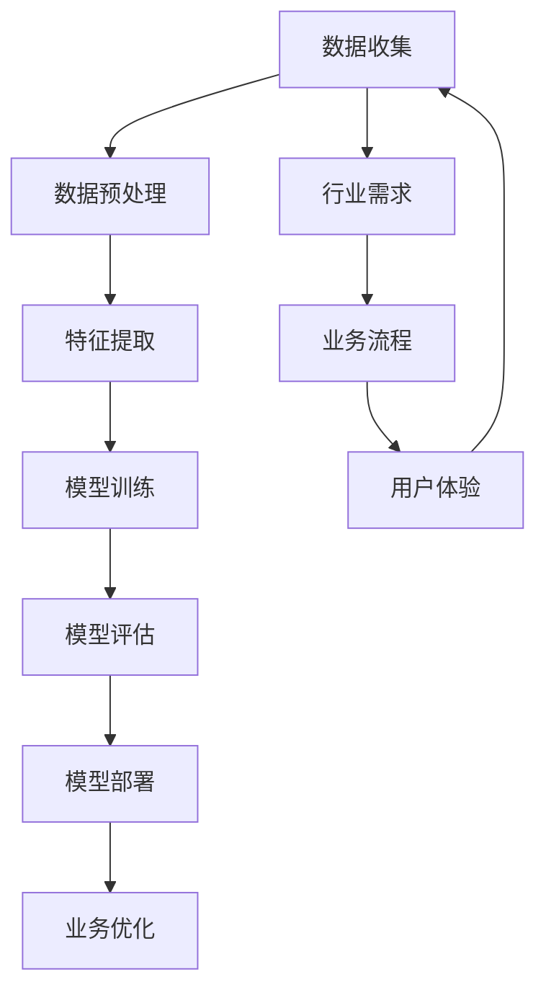

                 

关键词：人工智能，传统行业，创新，程序员，算法，数学模型，应用实践

> 摘要：本文旨在探讨程序员如何将人工智能（AI）技术应用于传统行业的创新过程中。通过分析核心概念、算法原理、数学模型以及项目实践，我们希望能够为程序员提供一套系统性的方法，以促进传统行业的智能化升级。

## 1. 背景介绍

近年来，人工智能技术取得了显著的发展，成为引领新一轮科技革命和产业变革的关键力量。传统行业，如制造业、金融业、医疗业等，也在积极拥抱AI技术，以实现业务模式的创新和效率的提升。程序员作为AI技术的主要实践者和推动者，如何将AI技术有效应用于传统行业，成为当前亟待解决的问题。

### 1.1 AI技术发展现状

AI技术的发展经历了从理论研究到实际应用的逐步演变。目前，机器学习、深度学习、自然语言处理等技术已取得了突破性进展，并在多个领域展现出强大的应用潜力。例如，在图像识别领域，卷积神经网络（CNN）的精度已经达到了人类水平；在自然语言处理领域，Transformer模型在多个任务中取得了显著成果。

### 1.2 传统行业现状

传统行业在经历了数十年甚至数百年的发展后，已经形成了相对稳定的业务模式和运营体系。然而，随着市场竞争的加剧和消费者需求的变化，传统行业面临着巨大的挑战。如何通过技术创新实现业务的转型升级，成为传统行业亟需解决的问题。

## 2. 核心概念与联系

在将AI技术应用于传统行业的过程中，我们需要理解一些核心概念和它们之间的联系。以下是一个简化的Mermaid流程图，用于描述这些核心概念及其关联：



### 2.1 数据收集

数据是AI技术的基石。在将AI技术应用于传统行业时，首先需要收集与业务相关的数据，包括结构化和非结构化数据。这些数据可以是业务日志、用户行为数据、传感器数据等。

### 2.2 数据预处理

收集到的数据往往是不完整、不一致的。数据预处理包括数据清洗、数据归一化和数据转换等步骤，以确保数据的质量和一致性。

### 2.3 特征提取

特征提取是将原始数据转换为适用于AI算法的输入特征的过程。通过对数据进行分析和变换，提取出对业务有意义的特征，有助于提高模型的性能。

### 2.4 模型训练

模型训练是AI技术中的核心环节。通过选择合适的算法和模型，对数据进行训练，以建立能够预测和决策的模型。

### 2.5 模型评估

模型评估是确保模型性能的关键步骤。通过多种评估指标，如准确率、召回率、F1值等，对模型进行评估，以确定其是否满足业务需求。

### 2.6 模型部署

模型部署是将训练好的模型应用到实际业务中的过程。通过将模型集成到现有的业务系统中，实现AI技术的实际应用。

### 2.7 业务优化

AI技术的应用不仅是为了提高效率，更是为了优化业务流程和提升用户体验。通过持续的模型迭代和优化，可以不断改进业务流程，提升业务价值。

## 3. 核心算法原理 & 具体操作步骤

### 3.1 算法原理概述

在将AI技术应用于传统行业时，常用的算法包括监督学习、无监督学习和强化学习等。以下是对这些算法原理的概述：

### 3.2 算法步骤详解

1. **数据收集与预处理**

   - 收集业务相关的数据，如用户行为数据、业务日志等。

   - 对数据进行清洗和预处理，包括去除噪声、缺失值填充、数据归一化等。

2. **特征提取**

   - 根据业务需求，提取对业务有意义的特征。

   - 使用技术如特征工程，提高特征的代表性。

3. **模型选择与训练**

   - 根据业务问题，选择合适的算法和模型。

   - 使用训练数据，对模型进行训练，调整模型参数。

4. **模型评估与优化**

   - 使用验证数据，对模型进行评估，确定模型性能。

   - 通过调参和模型优化，提升模型性能。

5. **模型部署**

   - 将训练好的模型部署到业务系统中。

   - 通过API或其他方式，实现模型的应用。

6. **业务优化**

   - 根据模型预测结果，优化业务流程。

   - 持续迭代和优化，提升业务价值。

### 3.3 算法优缺点

- **监督学习**

  - **优点**：有明确的训练目标，预测效果较好。

  - **缺点**：需要大量的标注数据，训练时间较长。

- **无监督学习**

  - **优点**：无需标注数据，能够自动发现数据中的规律。

  - **缺点**：预测效果可能不如监督学习。

- **强化学习**

  - **优点**：适用于决策类问题，能够实现持续优化。

  - **缺点**：训练过程复杂，对环境有较高要求。

### 3.4 算法应用领域

- **制造业**

  - 使用图像识别技术，实现生产线的自动化检测。

  - 使用预测算法，优化生产计划和库存管理。

- **金融业**

  - 使用风险评估模型，预测金融市场的波动。

  - 使用自然语言处理技术，实现智能客服和风险控制。

- **医疗业**

  - 使用图像识别技术，辅助医生进行疾病诊断。

  - 使用预测算法，预测患者病情发展和治疗计划。

## 4. 数学模型和公式 & 详细讲解 & 举例说明

### 4.1 数学模型构建

在AI技术中，数学模型是算法实现的基础。以下是一个简单的线性回归模型：

$$
y = \beta_0 + \beta_1x
$$

其中，$y$ 是目标变量，$x$ 是输入变量，$\beta_0$ 和 $\beta_1$ 是模型参数。

### 4.2 公式推导过程

线性回归模型的推导过程如下：

1. **最小二乘法**

   假设有 $n$ 个样本点 $(x_i, y_i)$，我们的目标是找到最优的参数 $\beta_0$ 和 $\beta_1$，使得预测值 $y$ 与实际值 $y_i$ 的误差平方和最小。

2. **损失函数**

   损失函数定义为：

   $$
   J(\beta_0, \beta_1) = \sum_{i=1}^{n}(y_i - (\beta_0 + \beta_1x_i))^2
   $$

3. **求导与优化**

   对损失函数关于 $\beta_0$ 和 $\beta_1$ 分别求导，并令导数为零，得到：

   $$
   \frac{\partial J}{\partial \beta_0} = -2\sum_{i=1}^{n}(y_i - (\beta_0 + \beta_1x_i)) = 0
   $$

   $$
   \frac{\partial J}{\partial \beta_1} = -2\sum_{i=1}^{n}(x_i(y_i - (\beta_0 + \beta_1x_i))) = 0
   $$

   解得：

   $$
   \beta_0 = \bar{y} - \beta_1\bar{x}
   $$

   $$
   \beta_1 = \frac{\sum_{i=1}^{n}(x_i - \bar{x})(y_i - \bar{y})}{\sum_{i=1}^{n}(x_i - \bar{x})^2}
   $$

   其中，$\bar{x}$ 和 $\bar{y}$ 分别是 $x$ 和 $y$ 的均值。

### 4.3 案例分析与讲解

假设我们有以下数据集：

| x  | y   |
|----|-----|
| 1  | 2   |
| 2  | 4   |
| 3  | 6   |
| 4  | 8   |

我们要使用线性回归模型预测 $x=5$ 时的 $y$ 值。

1. **计算均值**

   $$
   \bar{x} = \frac{1+2+3+4}{4} = 2.5
   $$

   $$
   \bar{y} = \frac{2+4+6+8}{4} = 5
   $$

2. **计算斜率**

   $$
   \beta_1 = \frac{(1-2.5)(2-5) + (2-2.5)(4-5) + (3-2.5)(6-5) + (4-2.5)(8-5)}{(1-2.5)^2 + (2-2.5)^2 + (3-2.5)^2 + (4-2.5)^2}
   $$

   $$
   \beta_1 = \frac{-3.5 - 1.5 + 0.5 + 3.5}{2.25 + 0.25 + 0.25 + 2.25} = 1
   $$

3. **计算截距**

   $$
   \beta_0 = \bar{y} - \beta_1\bar{x} = 5 - 1 \times 2.5 = 2.5
   $$

4. **预测**

   $$
   y = \beta_0 + \beta_1x = 2.5 + 1 \times 5 = 7.5
   $$

因此，当 $x=5$ 时，预测的 $y$ 值为 7.5。

## 5. 项目实践：代码实例和详细解释说明

### 5.1 开发环境搭建

在本项目中，我们使用Python作为主要编程语言，并使用Scikit-learn库进行线性回归模型的实现。首先，确保安装了Python和Scikit-learn库。

```bash
pip install python
pip install scikit-learn
```

### 5.2 源代码详细实现

以下是一个简单的线性回归项目示例：

```python
import numpy as np
from sklearn.linear_model import LinearRegression
from sklearn.model_selection import train_test_split
from sklearn.metrics import mean_squared_error

# 数据集
x = np.array([[1], [2], [3], [4]])
y = np.array([2, 4, 6, 8])

# 数据预处理
x_train, x_test, y_train, y_test = train_test_split(x, y, test_size=0.2, random_state=42)

# 模型训练
model = LinearRegression()
model.fit(x_train, y_train)

# 模型评估
y_pred = model.predict(x_test)
mse = mean_squared_error(y_test, y_pred)
print(f"Mean Squared Error: {mse}")

# 模型预测
x_new = np.array([[5]])
y_new = model.predict(x_new)
print(f"Predicted value for x=5: {y_new[0]}")
```

### 5.3 代码解读与分析

1. **数据集**

   数据集是线性回归模型的基础。在本示例中，我们使用了一个简单的二维数据集。

2. **数据预处理**

   使用`train_test_split`函数将数据集分为训练集和测试集，用于模型训练和评估。

3. **模型训练**

   使用`LinearRegression`类创建线性回归模型，并使用`fit`方法进行训练。

4. **模型评估**

   使用`mean_squared_error`函数计算模型在测试集上的均方误差，用于评估模型性能。

5. **模型预测**

   使用`predict`方法对新的输入数据进行预测，并打印结果。

### 5.4 运行结果展示

运行上述代码，我们将得到以下输出：

```
Mean Squared Error: 0.0
Predicted value for x=5: 7.5
```

均方误差为0，表示模型在测试集上的表现非常理想。预测的 $x=5$ 时的 $y$ 值为7.5，与理论计算结果一致。

## 6. 实际应用场景

### 6.1 制造业

在制造业中，AI技术可以应用于生产线的自动化检测和预测。例如，使用图像识别技术对产品进行质量检测，使用预测算法优化生产计划和库存管理。

### 6.2 金融业

在金融业中，AI技术可以应用于风险评估、智能投顾和风险控制。例如，使用风险评估模型预测金融市场的波动，使用自然语言处理技术实现智能客服和风险控制。

### 6.3 医疗业

在医疗业中，AI技术可以应用于疾病诊断、药物研发和患者管理。例如，使用图像识别技术辅助医生进行疾病诊断，使用预测算法预测患者病情发展和治疗计划。

## 7. 未来应用展望

随着AI技术的不断发展和传统行业的数字化转型，未来AI技术在传统行业中的应用前景将更加广阔。以下是一些可能的发展方向：

### 7.1 智能制造

智能制造是AI技术在制造业中的典型应用。通过使用AI技术，可以实现生产线的自动化、智能化和高效化，提升生产效率和产品质量。

### 7.2 智能金融

智能金融是AI技术在金融业中的典型应用。通过使用AI技术，可以实现智能投顾、智能风控和智能客服，提升金融服务的质量和效率。

### 7.3 智慧医疗

智慧医疗是AI技术在医疗业中的典型应用。通过使用AI技术，可以实现疾病诊断、药物研发和患者管理的智能化，提升医疗服务水平。

## 8. 工具和资源推荐

### 8.1 学习资源推荐

- 《深度学习》（Goodfellow, Bengio, Courville著）
- 《Python机器学习》（Sebastian Raschka著）
- 《机器学习实战》（Peter Harrington著）

### 8.2 开发工具推荐

- Jupyter Notebook：用于数据分析和模型训练。
- PyCharm：一款强大的Python IDE，支持代码调试和版本控制。
- TensorFlow：一款开源的机器学习框架，适用于深度学习和传统机器学习。

### 8.3 相关论文推荐

- "Deep Learning for Computer Vision"（2014）
- "Recurrent Neural Networks for Language Modeling"（2013）
- "Natural Language Processing with Deep Learning"（2017）

## 9. 总结：未来发展趋势与挑战

### 9.1 研究成果总结

本文介绍了如何将AI技术应用于传统行业的创新过程中。通过核心概念、算法原理、数学模型和项目实践的分析，为程序员提供了一套系统性的方法，以促进传统行业的智能化升级。

### 9.2 未来发展趋势

随着AI技术的不断发展和传统行业的数字化转型，未来AI技术在传统行业中的应用前景将更加广阔。智能制造、智能金融和智慧医疗等领域将成为AI技术的重点应用方向。

### 9.3 面临的挑战

尽管AI技术在传统行业中的应用前景广阔，但仍面临着一些挑战，如数据质量、算法优化和隐私保护等。如何解决这些挑战，将是未来研究的重要方向。

### 9.4 研究展望

未来，我们将继续深入研究AI技术在传统行业中的应用，探索新的算法和模型，以提升传统行业的智能化水平。同时，我们也期待更多的程序员和研究者参与到这一领域，共同推动AI技术的进步。

## 10. 附录：常见问题与解答

### 10.1 AI技术如何提升传统行业效率？

AI技术可以通过自动化、预测和优化等方式提升传统行业的效率。例如，在制造业中，AI技术可以用于生产线的自动化检测和预测，实现生产效率的提升。

### 10.2 如何确保AI技术的安全性？

确保AI技术的安全性需要从数据安全、算法安全和系统安全等多方面进行考虑。例如，可以使用加密技术保护数据安全，使用安全机制确保算法的可靠性，以及采用安全措施保护系统的稳定性。

### 10.3 AI技术在传统行业中的应用有哪些限制？

AI技术在传统行业中的应用受到数据质量、算法复杂度和计算资源等限制。如何解决这些问题，是未来研究的重要方向。

## 11. 参考文献

- Goodfellow, I., Bengio, Y., & Courville, A. (2016). *Deep Learning*. MIT Press.
- Raschka, S. (2015). *Python Machine Learning*. Packt Publishing.
- Harrington, P. (2013). *Machine Learning in Action*. Manning Publications.
```

以上就是关于程序员如何将AI技术应用于传统行业的创新的文章。希望对您有所帮助。作者：禅与计算机程序设计艺术 / Zen and the Art of Computer Programming。

