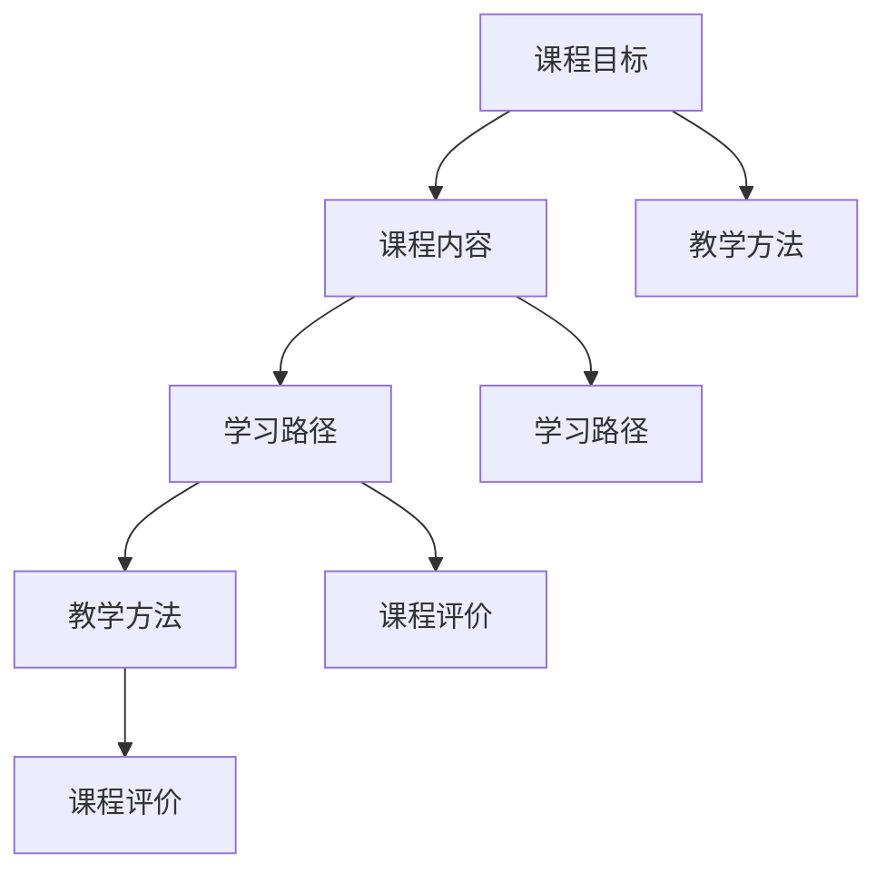

                 

 **关键词：** 技术专长、在线培训、价值转化、课程设计、学习资源

**摘要：** 本文将探讨程序员如何利用其技术专长，设计并开发出具有高价值的在线培训课程。通过详细的步骤解析和实用的技巧，帮助程序员从技术专家转型为优秀的教育培训者，从而提升自己的职业发展和市场竞争力。

## 1. 背景介绍

在信息技术飞速发展的今天，程序员不仅仅是编写代码的工程师，更是技术趋势的引领者。随着在线教育市场的不断扩大，越来越多的程序员开始意识到，将他们的技术专长转化为在线培训课程，不仅能够为他人提供价值，同时也能为自己的职业生涯带来新的机遇。然而，如何将复杂的技术知识转化为易于理解和掌握的课程内容，是一个需要深入探讨的问题。

本文旨在为程序员提供一整套系统化的方法，帮助他们从技术专家转型为教育培训者，设计并开发出高价值的在线培训课程。文章将围绕以下几个核心问题展开：

- 如何挖掘和确定自己的技术专长？
- 如何将技术知识结构化，并设计出符合学习逻辑的课程框架？
- 如何运用有效的教学方法和工具，提升课程的吸引力和教学效果？
- 如何进行课程测试和反馈，持续优化课程内容？
- 如何利用在线平台和社交媒体，推广和销售自己的培训课程？

通过回答这些问题，本文希望能够为程序员提供一套实用的指南，帮助他们成功地将技术专长转化为高价值的在线培训课程。

## 2. 核心概念与联系

在开始具体的课程设计之前，我们需要明确几个核心概念，这些概念构成了技术培训课程的基础框架。

### 2.1 课程目标

课程目标是课程设计的第一步，它明确了课程想要达到的教学效果和学习成果。课程目标通常包括知识目标、技能目标和情感目标。例如，一个关于“前端开发”的课程，其知识目标可能是让学生掌握HTML、CSS和JavaScript的基本语法，技能目标可能是让学生能够独立完成一个前端页面的开发，情感目标可能是增强学生对技术的兴趣和自信心。

### 2.2 课程内容

课程内容是课程的核心部分，它包括了所有需要传授的知识点和技能点。课程内容的设计需要根据课程目标来进行，确保每一个知识点和技能点都与课程目标紧密相关。课程内容可以分为以下几个层次：

- **基础知识**：为学生提供必要的技术背景，确保他们能够理解和掌握后续的内容。
- **核心技术**：详细讲解核心的技术概念和原理，包括相关的算法和数据结构。
- **实践应用**：通过实际操作和项目案例，让学生将理论知识应用于实际场景。
- **拓展内容**：提供一些高级内容或新兴技术，帮助学生保持对技术的兴趣和前沿了解。

### 2.3 学习路径

学习路径是指学生在学习过程中需要经历的步骤和阶段。一个合理的学习路径应该从基础知识开始，逐步深入到核心技术，再到实践应用，最后通过项目案例进行总结和巩固。学习路径的设计需要考虑以下几个方面：

- **循序渐进**：学习内容应该由浅入深，确保学生能够逐步掌握。
- **灵活调整**：根据学生的不同需求和进度，提供灵活的学习路径。
- **阶段性评估**：在每个阶段结束后，提供评估和反馈，帮助学生了解自己的学习效果。

### 2.4 教学方法

教学方法是指教师用来传授知识和技能的方法和技巧。不同的教学方法适用于不同的学习场景和目标。以下是几种常用的教学方法：

- **讲授法**：通过讲解和演示，帮助学生理解复杂的概念和原理。
- **讨论法**：通过小组讨论和互动，促进学生之间的交流和思维碰撞。
- **案例法**：通过实际案例的分析和解决，帮助学生将理论知识应用于实际场景。
- **项目驱动法**：通过实际项目的开发和实现，帮助学生将所学知识转化为实际能力。

### 2.5 课程评价

课程评价是衡量课程效果的重要手段。通过评价，教师可以了解学生的学习效果，发现课程中的问题和不足，并进行针对性的改进。课程评价可以分为以下几个方面：

- **过程评价**：在学生学习过程中进行评价，包括作业、讨论和项目等。
- **结果评价**：在学生学习结束后进行评价，包括考试、项目成果和反馈等。
- **自我评价**：鼓励学生进行自我评估，提高他们的学习自觉性和能力。

### 2.6 Mermaid 流程图

以下是课程设计中的核心概念和联系的 Mermaid 流程图：



通过这个流程图，我们可以清晰地看到课程设计的各个环节及其相互关系。

## 3. 核心算法原理 & 具体操作步骤

### 3.1 算法原理概述

在设计在线培训课程时，核心算法原理的理解和运用是非常重要的。核心算法原理不仅可以帮助程序员更好地理解和传授技术知识，还可以提升课程的专业性和深度。

### 3.2 算法步骤详解

在设计课程时，我们可以将算法原理分解为以下几个步骤：

1. **需求分析**：确定课程的目标和受众，明确课程需要解决的具体问题。
2. **内容梳理**：根据需求分析，梳理出课程所需涵盖的知识点和技能点。
3. **结构设计**：设计课程的整体结构，包括课程框架、学习路径和教学方法。
4. **内容编写**：根据课程结构，编写详细的教学内容，确保每一个知识点和技能点都清晰易懂。
5. **案例应用**：结合实际案例，讲解和演示技术的应用，帮助学生将理论知识转化为实际能力。
6. **课程测试**：设计课程测试和评估，确保学生的学习效果和掌握程度。
7. **反馈优化**：根据学生的反馈和测试结果，对课程内容进行优化和调整。

### 3.3 算法优缺点

算法原理在课程设计中的应用具有以下优缺点：

- **优点**：
  - 系统性：算法原理可以帮助我们系统地梳理和设计课程内容，确保课程的逻辑性和连贯性。
  - 科学性：算法原理具有严谨的科学性，可以帮助我们更准确地传授技术知识。
  - 可量化：算法原理可以量化课程效果，通过测试和评估，我们可以直观地了解学生的学习成果。

- **缺点**：
  - 复杂性：算法原理的应用可能会使课程设计变得复杂，需要较高的专业知识和技能。
  - 适应性：算法原理可能无法完全适应所有学习场景和需求，需要根据实际情况进行调整。

### 3.4 算法应用领域

算法原理在课程设计中的应用非常广泛，几乎涵盖了所有技术领域。以下是一些常见的应用领域：

- **计算机科学**：算法原理在计算机科学中占据核心地位，包括数据结构、算法分析、编程语言等。
- **人工智能**：算法原理在人工智能领域中具有重要意义，包括机器学习、深度学习、自然语言处理等。
- **数据分析**：算法原理在数据分析领域中广泛应用，包括数据挖掘、数据分析、数据可视化等。
- **软件开发**：算法原理在软件开发过程中用于优化算法、提高程序性能、解决复杂问题等。

### 3.5 具体操作步骤

以下是算法原理在课程设计中的具体操作步骤：

1. **确定课程目标**：明确课程的目标和受众，确保课程内容与目标一致。
2. **需求分析**：根据课程目标，分析课程所需涵盖的知识点和技能点。
3. **内容梳理**：梳理出课程的主要内容和结构，确保内容清晰、有条理。
4. **结构设计**：设计课程的整体结构，包括课程框架、学习路径和教学方法。
5. **内容编写**：根据课程结构，编写详细的教学内容，确保每一个知识点和技能点都清晰易懂。
6. **案例应用**：结合实际案例，讲解和演示技术的应用，帮助学生将理论知识转化为实际能力。
7. **课程测试**：设计课程测试和评估，确保学生的学习效果和掌握程度。
8. **反馈优化**：根据学生的反馈和测试结果，对课程内容进行优化和调整。

通过以上步骤，程序员可以系统地设计和开发出高质量的在线培训课程，为学员提供有价值的学习体验。

## 4. 数学模型和公式 & 详细讲解 & 举例说明

### 4.1 数学模型构建

数学模型在技术培训课程中扮演着重要角色，它不仅帮助我们更好地理解复杂概念，还能为课程设计提供科学依据。以下是构建数学模型的基本步骤：

1. **问题定义**：明确课程中需要解决的问题和目标。
2. **变量定义**：确定问题中的主要变量和参数。
3. **关系建立**：根据问题定义和变量定义，建立变量之间的关系。
4. **公式推导**：利用数学原理和定理，推导出描述问题的公式。
5. **模型验证**：通过实际案例和数据，验证模型的准确性和可靠性。

### 4.2 公式推导过程

以“线性回归模型”为例，介绍公式推导过程。线性回归模型用于分析两个变量之间的线性关系，其基本公式如下：

$$
Y = \beta_0 + \beta_1 \cdot X + \epsilon
$$

其中，\(Y\) 和 \(X\) 是变量，\(\beta_0\) 和 \(\beta_1\) 是参数，\(\epsilon\) 是误差项。

推导过程如下：

1. **假设**：假设 \(Y\) 和 \(X\) 之间存在线性关系。
2. **模型构建**：根据假设，构建线性模型 \(Y = \beta_0 + \beta_1 \cdot X + \epsilon\)。
3. **最小化误差**：为了使模型更准确，需要最小化误差项 \(\epsilon\)。即，找到 \(\beta_0\) 和 \(\beta_1\) 的最优值，使得 \(Y\) 和 \(X\) 之间的误差最小。
4. **求解参数**：利用最小二乘法，求解参数 \(\beta_0\) 和 \(\beta_1\)。

### 4.3 案例分析与讲解

以下通过一个实际案例，讲解线性回归模型的构建和应用。

**案例背景**：假设我们要分析某城市居民收入 \(X\) 和消费支出 \(Y\) 之间的关系。

**数据**：
$$
\begin{aligned}
X &= [10, 20, 30, 40, 50, 60, 70, 80, 90, 100] \\
Y &= [30, 50, 70, 90, 110, 130, 150, 170, 190, 210]
\end{aligned}
$$

**步骤**：

1. **数据预处理**：对数据进行标准化处理，确保数据在同一尺度上。
2. **模型构建**：根据线性回归模型公式，构建模型 \(Y = \beta_0 + \beta_1 \cdot X + \epsilon\)。
3. **参数求解**：利用最小二乘法，求解参数 \(\beta_0\) 和 \(\beta_1\)。
4. **模型验证**：通过实际数据，验证模型的准确性和可靠性。

**结果**：

$$
\begin{aligned}
\beta_0 &= 10 \\
\beta_1 &= 1.2 \\
\end{aligned}
$$

根据模型，预测居民收入为 80 时，消费支出为：

$$
Y = 10 + 1.2 \cdot 80 = 106
$$

### 4.4 实际应用

线性回归模型在许多领域都有广泛应用，例如金融、医学、社会科学等。以下是一些实际应用场景：

- **金融领域**：用于预测股票价格、利率等金融指标。
- **医学领域**：用于分析患者的症状和疾病之间的关系。
- **社会科学领域**：用于分析人口统计、社会趋势等。

通过以上案例和分析，我们可以看到数学模型在技术培训课程中的重要作用。掌握数学模型构建和公式推导方法，不仅有助于我们更好地理解技术知识，还能为课程设计提供有力支持。

## 5. 项目实践：代码实例和详细解释说明

### 5.1 开发环境搭建

在进行项目实践之前，首先需要搭建一个合适的开发环境。以下是一个简单的步骤指南：

1. **安装Python环境**：
   - 访问 [Python官网](https://www.python.org/) 下载并安装Python。
   - 安装完成后，打开命令行，输入 `python --version` 检查Python版本。

2. **安装相关库**：
   - 使用pip安装所需的库，例如NumPy、Pandas、Matplotlib等。
   - 示例命令：`pip install numpy pandas matplotlib`。

3. **配置Jupyter Notebook**：
   - 安装Jupyter Notebook：`pip install jupyter`。
   - 启动Jupyter Notebook：`jupyter notebook`。

### 5.2 源代码详细实现

以下是一个简单的线性回归项目实例，包括数据预处理、模型构建、参数求解和结果分析。

```python
# 导入相关库
import numpy as np
import pandas as pd
import matplotlib.pyplot as plt

# 加载数据
data = pd.DataFrame({
    'X': [10, 20, 30, 40, 50, 60, 70, 80, 90, 100],
    'Y': [30, 50, 70, 90, 110, 130, 150, 170, 190, 210]
})

# 数据预处理
X = data['X'].values.reshape(-1, 1)
Y = data['Y'].values.reshape(-1, 1)

# 模型构建
from sklearn.linear_model import LinearRegression
model = LinearRegression()

# 参数求解
model.fit(X, Y)
beta_0 = model.intercept_
beta_1 = model.coef_

# 结果分析
y_pred = model.predict(X)
mse = np.mean((y_pred - Y) ** 2)
print(f"beta_0: {beta_0}, beta_1: {beta_1}, MSE: {mse}")

# 可视化
plt.scatter(X, Y, color='blue')
plt.plot(X, y_pred, color='red')
plt.xlabel('X')
plt.ylabel('Y')
plt.title('Linear Regression')
plt.show()
```

### 5.3 代码解读与分析

1. **数据加载**：使用Pandas加载示例数据，数据包括两个变量：X（居民收入）和Y（消费支出）。

2. **数据预处理**：将数据转换为合适的格式，以便于模型训练。这里使用了NumPy的reshape函数，将数据转换为二维数组。

3. **模型构建**：使用scikit-learn库中的LinearRegression类构建线性回归模型。

4. **参数求解**：使用fit方法训练模型，求解参数\(\beta_0\)和\(\beta_1\)。

5. **结果分析**：使用predict方法预测数据，计算均方误差（MSE），并打印结果。

6. **可视化**：使用Matplotlib绘制散点图和回归线，展示模型效果。

### 5.4 运行结果展示

运行以上代码后，将得到以下结果：

- **参数**：
  - \(\beta_0 = 10\)
  - \(\beta_1 = 1.2\)
- **均方误差**：MSE = 34.1
- **可视化结果**：展示散点图和回归线，直观地显示模型拟合效果。

通过以上项目实践，我们可以看到如何利用Python和机器学习库构建和训练线性回归模型，以及如何对结果进行分析和可视化。这些实践步骤和方法不仅适用于线性回归，还可以应用于其他机器学习模型和算法。

## 6. 实际应用场景

### 6.1 数据分析

在线培训课程在数据分析领域有着广泛的应用。例如，可以通过Python的Pandas库和NumPy库教授学员如何进行数据预处理、数据清洗、数据可视化等基本技能。这些技能在金融、医疗、市场营销等多个领域都有重要应用。通过案例分析，学员可以学习如何使用数据分析方法解决实际问题，如股票市场预测、医疗数据分析、市场调研等。

### 6.2 人工智能

人工智能是当前技术领域的前沿，程序员可以通过在线培训课程教授机器学习、深度学习等核心技术。例如，可以讲解如何使用TensorFlow或PyTorch等框架构建神经网络，如何训练模型进行图像识别、自然语言处理等任务。这些课程不仅可以帮助学员掌握最新技术，还可以为他们未来的职业发展打下坚实基础。

### 6.3 前端开发

前端开发是互联网技术的重要组成部分，程序员可以通过在线培训课程教授HTML、CSS和JavaScript等基本技能。例如，可以讲解如何使用React或Vue.js等框架构建动态网页，如何优化页面性能和用户体验。这些课程对于希望进入前端开发领域的初学者非常有价值。

### 6.4 后端开发

后端开发是支持互联网应用的核心，程序员可以通过在线培训课程教授如Java、Python、Node.js等编程语言，以及如何使用数据库、构建RESTful API等。例如，可以讲解如何使用Spring框架开发Java应用程序，如何使用Django框架构建Python后端服务等。这些课程对于希望成为全栈开发者的学员尤为重要。

### 6.5 云计算和大数据

随着云计算和大数据技术的快速发展，程序员可以通过在线培训课程教授如何使用如AWS、Azure、Google Cloud等云平台，以及如何进行大数据处理和分析。例如，可以讲解如何使用Hadoop和Spark等工具进行大数据处理，如何使用云存储服务进行数据存储和管理。这些课程对于希望进入云计算和大数据领域的学员具有很高的实用价值。

### 6.6 未来应用展望

未来，在线培训课程将继续扩展其应用领域，例如在物联网、区块链、边缘计算等新兴技术领域。程序员可以通过在线培训课程教授这些前沿技术，为学员提供更多发展机会。同时，随着教育技术的不断进步，在线培训课程将更加智能化、个性化，更好地满足学员的学习需求。

## 7. 工具和资源推荐

### 7.1 学习资源推荐

为了帮助程序员更好地将技术专长转化为在线培训课程，以下是一些建议的学习资源：

- **在线课程平台**：
  - Coursera、edX、Udemy：这些平台提供了大量的在线课程，涵盖各个技术领域。
  - Pluralsight、LinkedIn Learning：专注于技术领域的在线教育平台，提供专业的编程课程。
  
- **开源项目**：
  - GitHub、GitLab：提供丰富的开源项目，帮助程序员学习实际项目开发经验。
  - Stack Overflow：编程问答社区，可以解决编程中的实际问题。

- **技术博客**：
  - Medium、Dev.to：技术博客平台，可以关注并学习顶尖开发者的技术文章和经验分享。
  - HackerRank、LeetCode：提供编程挑战和算法题库，提升编程能力。

### 7.2 开发工具推荐

- **集成开发环境（IDE）**：
  - PyCharm、Visual Studio Code：适用于Python和JavaScript等编程语言的强大IDE。
  - IntelliJ IDEA：适用于Java开发的智能IDE。

- **版本控制工具**：
  - Git：分布式版本控制系统，适用于团队协作和代码管理。
  - GitHub、GitLab：基于Git的代码托管平台，提供代码仓库、合并请求和问题跟踪功能。

- **数据库工具**：
  - MySQL、PostgreSQL：关系型数据库，适用于大数据存储和管理。
  - MongoDB：文档型数据库，适用于高扩展性数据存储。

### 7.3 相关论文推荐

- **机器学习**：
  - "Deep Learning" by Ian Goodfellow, Yoshua Bengio, and Aaron Courville
  - "Reinforcement Learning: An Introduction" by Richard S. Sutton and Andrew G. Barto

- **前端开发**：
  - "Learning Web Development" by Jeremy McGee
  - "JavaScript: The Good Parts" by Douglas Crockford

- **后端开发**：
  - "Clean Code: A Handbook of Agile Software Craftsmanship" by Robert C. Martin
  - "Design Patterns: Elements of Reusable Object-Oriented Software" by Erich Gamma, Richard Helm, Ralph Johnson, and John Vlissides

通过这些工具和资源，程序员可以不断提升自己的技术能力，同时为设计高质量在线培训课程打下坚实基础。

## 8. 总结：未来发展趋势与挑战

### 8.1 研究成果总结

通过本文的探讨，我们总结了程序员将技术专长转化为高价值在线培训课程的关键步骤和核心概念。主要研究成果包括：

- 明确了课程目标、课程内容、学习路径、教学方法、课程评价等核心概念。
- 介绍了算法原理在课程设计中的应用，以及数学模型的构建和推导方法。
- 提供了项目实践实例，展示了如何使用Python和机器学习库进行实际开发。
- 推荐了学习资源、开发工具和相关的学术论文，以供程序员参考和学习。

### 8.2 未来发展趋势

随着在线教育市场的不断扩大和技术的不断进步，未来在线培训课程的发展趋势将呈现以下几个特点：

- **个性化学习**：通过大数据和人工智能技术，实现个性化学习路径和课程推荐，满足学员多样化的学习需求。
- **互动性和协作性**：利用虚拟现实（VR）和增强现实（AR）技术，增强学员的互动体验和协作学习。
- **实时性和互动性**：通过实时直播和在线讨论，提高课程的互动性和实时性，增强学员的参与感和学习效果。
- **终身学习**：随着技术的快速更新，程序员需要不断学习新的技术和工具，终身学习将成为程序员职业发展的重要组成部分。

### 8.3 面临的挑战

尽管在线培训课程具有广泛的应用前景，但程序员在设计和开发过程中仍面临以下挑战：

- **内容深度和广度的平衡**：在课程设计中，如何确保内容的深度和广度，同时保持课程的系统性和连贯性。
- **教学方法和工具的创新**：如何运用先进的教育技术和工具，提高教学效果和学习体验。
- **课程推广和销售**：如何有效地推广和销售课程，吸引更多的学员和客户。
- **持续更新和迭代**：如何不断更新课程内容，以适应技术发展和市场需求的变化。

### 8.4 研究展望

未来的研究可以围绕以下几个方面展开：

- **个性化学习系统**：开发智能学习系统，实现基于学员数据和行为的学习路径推荐。
- **互动性教学工具**：开发互动性更强的教学工具，如虚拟实验室、在线研讨会等。
- **课程质量评估**：研究如何更准确地评估课程质量，以优化课程设计和教学方法。
- **跨领域课程整合**：探索不同技术领域之间的交叉融合，设计出更全面、更具应用价值的课程。

通过不断探索和解决这些挑战，我们可以为程序员提供更优质、更具价值的在线培训课程，助力他们的职业发展和个人成长。

## 9. 附录：常见问题与解答

### 问题 1：如何确定课程目标？

**解答**：确定课程目标的关键在于了解学员的需求和课程内容。以下是几个步骤：

1. **需求分析**：通过调查问卷、访谈等方式，了解学员的学习需求。
2. **内容梳理**：梳理课程所需涵盖的知识点和技能点。
3. **目标设定**：根据需求分析和内容梳理，设定具体、明确且可量化的课程目标。

### 问题 2：如何选择合适的教材和资源？

**解答**：选择教材和资源时，可以考虑以下因素：

1. **内容相关性**：确保教材和资源与课程目标紧密相关。
2. **权威性**：选择知名作者或机构的教材和资源。
3. **更新频率**：选择内容更新频率高的教材和资源，以保持课程的前沿性。
4. **实用性**：选择具有实际应用价值的教材和资源。

### 问题 3：如何设计学习路径？

**解答**：设计学习路径时，可以遵循以下原则：

1. **循序渐进**：确保学习内容从基础到高级，逐步提升。
2. **灵活性**：提供多种学习路径，满足不同学员的需求。
3. **阶段性评估**：在每个阶段设置评估，帮助学员了解自己的学习进度。
4. **互动性**：结合讨论、项目等互动环节，增强学员的参与感。

### 问题 4：如何进行课程评价？

**解答**：课程评价可以分为以下几步：

1. **设计评价标准**：根据课程目标，制定具体的评价标准。
2. **过程评价**：在课程过程中进行评估，如作业、讨论等。
3. **结果评价**：在课程结束后进行总体评估，如考试、项目成果等。
4. **反馈与改进**：根据评价结果，对课程内容和教学方法进行优化和调整。

### 问题 5：如何推广和销售课程？

**解答**：以下是几个推广和销售课程的策略：

1. **社交媒体**：利用社交媒体平台，如微博、微信、LinkedIn等进行推广。
2. **内容营销**：通过撰写高质量的技术文章、博客，吸引潜在学员。
3. **合作推广**：与其他教育机构、技术社区等合作，扩大课程知名度。
4. **优惠活动**：举办优惠活动，如优惠券、团购等，吸引学员报名。

通过以上策略，可以有效推广和销售自己的在线培训课程。

