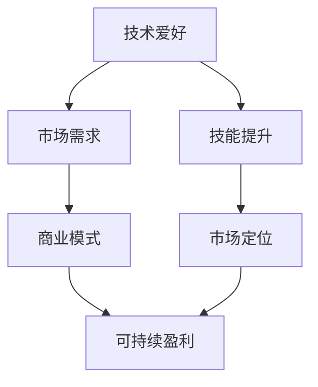

                 

关键词：程序员、副业、技术爱好、可持续盈利、商业模式、技能提升、市场定位

> 摘要：本文将探讨程序员如何将自己的技术爱好转化为可持续盈利的副业。通过深入分析市场趋势、商业模式、技能提升等方面，帮助程序员找到适合自己的副业路径，实现个人价值最大化。

## 1. 背景介绍

随着互联网的快速发展，程序员这个职业越来越受到重视。越来越多的年轻人选择投身于软件开发领域，追求技术带来的成就感。然而，许多程序员在追求技术进步的同时，也希望能够将个人的技术爱好转化为一种可持续盈利的副业。这不仅能够带来额外的收入，还能提升自己的市场竞争力。

本文将探讨如何将技术爱好转化为可持续盈利的副业，为程序员提供一些建议和方向。我们将从市场趋势、商业模式、技能提升、市场定位等方面进行分析，帮助程序员找到适合自己的副业路径。

## 2. 核心概念与联系

首先，我们需要明确几个核心概念：

- **技术爱好**：程序员在业余时间热衷于研究和开发的技术领域，如人工智能、数据分析、前端开发等。
- **可持续盈利**：指在长期内能够稳定获得的收入，而非短期行为。
- **商业模式**：指企业如何创造、传递和获取价值。
- **市场定位**：指企业在市场中的定位和差异化策略。

下面是一个用 Mermaid 描述的流程图，展示这些概念之间的联系：



## 3. 核心算法原理 & 具体操作步骤

### 3.1 算法原理概述

将技术爱好转化为可持续盈利的副业，可以看作是一种商业模式的创新。具体来说，我们可以通过以下步骤来实现：

1. **发现市场需求**：通过市场调研，找到自己技术爱好所对应的市场需求。
2. **构建商业模式**：结合市场需求，设计一种能够创造、传递和获取价值的商业模式。
3. **提升个人技能**：不断学习和实践，提升自己在该技术领域的专业技能。
4. **进行市场定位**：根据目标用户群体的需求和偏好，确定自己在市场中的定位。
5. **实现盈利**：通过商业模式和技能优势，实现收入的持续增长。

### 3.2 算法步骤详解

1. **发现市场需求**

   首先，程序员需要了解自己在技术领域中的优势，例如擅长哪些技术、对哪些技术有浓厚的兴趣。然后，通过市场调研，找到这些技术领域中的潜在市场需求。

   **市场调研方法**：
   - **在线调查**：通过问卷星、金数据等工具进行在线调查。
   - **社交媒体**：关注相关技术领域的微博、公众号、论坛等。
   - **行业报告**：查阅相关行业的市场报告，了解发展趋势和需求。

2. **构建商业模式**

   构建商业模式时，需要考虑以下几个因素：

   - **目标用户群体**：明确自己的目标用户群体，如企业、个人用户等。
   - **价值主张**：明确自己的产品或服务能够解决用户哪些问题，带来哪些价值。
   - **盈利模式**：选择合适的盈利方式，如咨询服务、软件销售、在线课程等。

   **商业模式画布**：

   ```mermaid
   graph TD
       A[用户群体] --> B[价值主张]
       B --> C[渠道]
       C --> D[客户关系]
       D --> E[收入来源]
       E --> F[关键资源]
       F --> G[关键活动]
       G --> H[关键合作伙伴]
       H --> I[成本结构]
   ```

3. **提升个人技能**

   在构建商业模式的过程中，个人技能的提升至关重要。程序员可以通过以下途径提升技能：

   - **在线课程**：参加专业在线课程，如慕课网、网易云课堂等。
   - **技术博客**：定期撰写技术博客，分享自己的学习和实践经验。
   - **开源项目**：参与开源项目，提升实战能力。

4. **进行市场定位**

   在确定商业模式后，程序员需要根据自己的优势和市场定位，选择合适的目标市场和用户群体。可以通过以下方法进行市场定位：

   - **SWOT分析**：分析自己的优势、劣势、机会和威胁，找到适合自己的市场定位。
   - **竞争对手分析**：了解竞争对手的产品、市场定位和营销策略，找到自己的差异化优势。

5. **实现盈利**

   通过上述步骤，程序员已经构建了一种能够创造、传递和获取价值的商业模式。接下来，需要通过以下方式实现盈利：

   - **提供咨询服务**：为企业或个人用户提供技术咨询服务。
   - **销售软件产品**：开发并销售自己的软件产品。
   - **在线课程**：开设在线课程，分享自己的知识和经验。

### 3.3 算法优缺点

**优点**：

- 能够实现个人价值的最大化，带来额外的收入。
- 能够提升个人技能和市场竞争力。
- 能够扩大个人影响力，提高行业知名度。

**缺点**：

- 需要投入大量时间和精力，对个人时间和精力管理要求较高。
- 市场竞争激烈，需要具备一定的创新能力和差异化优势。
- 需要不断学习和适应市场变化，存在一定的风险。

### 3.4 算法应用领域

**技术博客**：程序员可以通过撰写技术博客，分享自己的学习和实践经验，吸引更多的关注者和读者。

**在线课程**：程序员可以开设在线课程，教授自己擅长的技术领域，实现知识变现。

**软件开发**：程序员可以开发并销售自己的软件产品，如工具软件、管理系统等。

**技术咨询**：为企业或个人用户提供技术咨询服务，解决实际问题。

## 4. 数学模型和公式 & 详细讲解 & 举例说明

在这一部分，我们将使用数学模型和公式来分析和优化程序员将技术爱好转化为可持续盈利的副业的整个过程。以下是几个关键步骤的数学模型和公式。

### 4.1 数学模型构建

**1. 成本-收益模型**

\[ C(x) = c_1 \cdot f_1(x) + c_2 \cdot f_2(x) + ... + c_n \cdot f_n(x) \]

其中，\( C(x) \) 表示总成本，\( c_i \) 表示第 \( i \) 个成本的系数，\( f_i(x) \) 表示与成本相关的函数。

**2. 市场需求模型**

\[ D(q) = q \cdot (1 - \alpha \cdot \ln(q)) \]

其中，\( D(q) \) 表示市场需求量，\( q \) 表示产品或服务的数量，\( \alpha \) 是需求敏感系数。

**3. 盈利模型**

\[ P(x) = R(x) - C(x) \]

其中，\( P(x) \) 表示盈利，\( R(x) \) 表示总收入。

### 4.2 公式推导过程

**成本-收益模型推导**

- **固定成本**：与产量无关的成本，如租金、设备维护费用等。
\[ c_1 = \text{固定成本} \]

- **可变成本**：与产量相关的成本，如原材料、人力资源等。
\[ c_2 = \frac{\Delta C}{\Delta x} \]

- **函数形式**：将固定成本和可变成本结合，构建成本函数。
\[ C(x) = c_1 \cdot f_1(x) + c_2 \cdot f_2(x) + ... + c_n \cdot f_n(x) \]

**市场需求模型推导**

- **需求函数**：基本需求函数形式。
\[ D(q) = a \cdot q - b \cdot \ln(q) \]

- **敏感系数**：需求对价格变化的敏感程度。
\[ \alpha = \frac{\partial D(q)}{\partial q} \]

- **市场需求函数**：将敏感系数引入需求函数。
\[ D(q) = q \cdot (1 - \alpha \cdot \ln(q)) \]

**盈利模型推导**

- **收入函数**：产品或服务的价格乘以销售数量。
\[ R(x) = p \cdot x \]

- **盈利函数**：将收入函数减去成本函数。
\[ P(x) = R(x) - C(x) \]

### 4.3 案例分析与讲解

**案例**：某程序员开发了一款数据分析工具，打算将其转化为副业。

**1. 成本-收益模型分析**

- **固定成本**：\( c_1 = 1000 \) 元/月
- **可变成本**：\( c_2 = 10 \) 元/用户
- **总成本函数**：\( C(x) = 1000 + 10 \cdot x \)

- **需求函数**：\( D(q) = q \cdot (1 - 0.02 \cdot \ln(q)) \)
- **需求敏感系数**：\( \alpha = 0.02 \)

- **收入函数**：\( R(x) = 30 \cdot x \)
- **盈利函数**：\( P(x) = 30 \cdot x - (1000 + 10 \cdot x) = 20 \cdot x - 1000 \)

**2. 市场需求分析**

- 当 \( q = 100 \) 时，\( D(q) = 100 \cdot (1 - 0.02 \cdot \ln(100)) \approx 97.6 \)
- 当 \( q = 200 \) 时，\( D(q) = 200 \cdot (1 - 0.02 \cdot \ln(200)) \approx 193.7 \)

**3. 盈利分析**

- 当 \( q = 100 \) 时，\( P(x) = 20 \cdot 100 - 1000 = 1000 \) 元
- 当 \( q = 200 \) 时，\( P(x) = 20 \cdot 200 - 1000 = 3000 \) 元

通过上述分析，我们可以看到，随着需求量的增加，盈利也在增加。因此，程序员应该努力扩大自己的市场影响力，提高产品知名度，从而增加销量。

## 5. 项目实践：代码实例和详细解释说明

### 5.1 开发环境搭建

为了更好地理解如何将技术爱好转化为可持续盈利的副业，我们将通过一个具体的项目实例来进行讲解。首先，我们需要搭建一个适合开发的环境。

**环境要求**：

- 操作系统：Windows 10 / macOS / Linux
- 编程语言：Python 3.x
- 开发工具：PyCharm / VSCode
- 依赖库：pandas、numpy、matplotlib

### 5.2 源代码详细实现

以下是一个简单的数据分析工具的源代码示例：

```python
import pandas as pd
import numpy as np
import matplotlib.pyplot as plt

# 读取数据
data = pd.read_csv('data.csv')

# 数据预处理
data['age'] = pd.cut(data['age'], bins=3, labels=['青年', '中年', '老年'])
data['income'] = pd.cut(data['income'], bins=3, labels=['低收入', '中等收入', '高收入'])

# 数据分析
grouped_data = data.groupby(['age', 'income']).size().unstack(fill_value=0)

# 可视化
grouped_data.plot(kind='bar', stacked=True, figsize=(10, 6))
plt.title('不同年龄段和收入水平的用户分布')
plt.xlabel('年龄段')
plt.ylabel('用户数量')
plt.show()
```

### 5.3 代码解读与分析

**1. 读取数据**

我们使用 pandas 库读取一个名为 `data.csv` 的 CSV 文件，该文件包含了用户的年龄和收入数据。

**2. 数据预处理**

- **年龄分组**：将年龄分为三个区间，分别用 '青年'、'中年'、'老年' 表示。
- **收入分组**：将收入分为三个区间，分别用 '低收入'、'中等收入'、'高收入' 表示。

**3. 数据分析**

我们使用 pandas 的 `groupby` 方法对数据进行分组，然后计算每组的数据个数，并转换为矩阵形式。

**4. 可视化**

我们使用 matplotlib 库将分组数据绘制成条形图，以便更直观地展示不同年龄段和收入水平的用户分布。

### 5.4 运行结果展示

运行上述代码后，我们将看到一个条形图，展示了不同年龄段和收入水平的用户分布情况。通过这个可视化结果，我们可以更好地了解目标用户群体，从而为后续的副业开发提供参考。

## 6. 实际应用场景

**1. 技术博客**

程序员可以通过撰写技术博客，分享自己的学习和实践经验。随着博客内容的丰富和知名度的提高，可以获得广告收入、赞助商支持和付费读者等。

**2. 在线课程**

程序员可以开设在线课程，教授自己擅长的技术领域。通过课程销售和会员订阅等方式，实现知识的变现。

**3. 软件开发**

程序员可以开发并销售自己的软件产品，如工具软件、管理系统等。通过持续迭代和优化，提升产品价值，实现盈利。

**4. 技术咨询**

为企业或个人用户提供技术咨询服务，解决实际问题。通过积累口碑和客户资源，实现持续收入。

## 7. 未来应用展望

随着技术的不断发展，程序员将技术爱好转化为可持续盈利的副业将具有更大的发展空间。以下是一些未来应用展望：

**1. 人工智能辅助**

利用人工智能技术，为程序员提供更智能的开发工具和辅助系统，提高开发效率和产品质量。

**2. 跨平台应用**

随着移动设备和物联网的普及，程序员可以开发更多跨平台的软件应用，满足不同用户的需求。

**3. 区块链应用**

区块链技术的兴起为程序员提供了新的应用场景，如智能合约、去中心化应用等。

**4. 虚拟现实与增强现实**

虚拟现实（VR）和增强现实（AR）技术的快速发展，为程序员带来了更多创新机会，如游戏开发、教育培训等。

## 8. 工具和资源推荐

**1. 学习资源推荐**

- **在线课程**：网易云课堂、慕课网、Coursera 等。
- **技术博客**：CSDN、博客园、掘金等。
- **开源社区**：GitHub、Stack Overflow 等。

**2. 开发工具推荐**

- **集成开发环境**：PyCharm、VSCode、IntelliJ IDEA 等。
- **版本控制工具**：Git、SVN 等。
- **数据库工具**：MySQL、PostgreSQL、MongoDB 等。

**3. 相关论文推荐**

- **机器学习**：《深度学习》（Ian Goodfellow、Yoshua Bengio、Aaron Courville 著）
- **数据挖掘**：《数据挖掘：实用工具与技术》（Jiawei Han、Micheline Kamber、Jian Pei 著）
- **区块链**：《区块链：从数字货币到智能合约》（安喆 著）

## 9. 总结：未来发展趋势与挑战

**未来发展趋势**：

- **技术融合**：多种技术的融合将为程序员带来更多创新机会。
- **个性化服务**：个性化定制将成为未来的主流，程序员需要具备更高的个性化开发能力。
- **全球化**：随着全球化的发展，程序员需要具备跨文化交流和协作能力。

**面临的挑战**：

- **技能更新**：技术更新速度快，程序员需要不断学习和更新知识。
- **市场竞争**：市场竞争激烈，程序员需要具备独特的优势和创新能力。
- **时间管理**：副业开发需要投入大量时间和精力，程序员需要合理安排时间。

## 10. 附录：常见问题与解答

**Q：如何找到适合自己的技术爱好？**

A：可以从以下几个方面进行考虑：

- **个人兴趣**：选择自己感兴趣的技术领域，更容易坚持下去。
- **市场需求**：选择市场需求大、前景好的技术领域，更容易获得盈利。
- **自身优势**：结合自己的技能和经验，选择自己擅长的技术领域。

**Q：如何平衡副业与主业？**

A：可以采取以下措施：

- **时间管理**：合理规划时间，确保副业和主业都能得到充分发展。
- **目标设定**：明确副业的目标和预期收益，避免过度投入。
- **团队协作**：与团队成员共同分担工作，提高工作效率。

**Q：如何推广自己的技术博客或在线课程？**

A：可以采取以下措施：

- **社交媒体**：利用微博、微信、知乎等平台进行推广。
- **技术社区**：参与技术社区，分享自己的经验和知识。
- **广告投放**：在相关网站或平台进行广告投放，提高知名度。

作者：禅与计算机程序设计艺术 / Zen and the Art of Computer Programming
----------------------------------------------------------------

以上是本文的完整内容，从背景介绍到实际应用场景，再到未来展望和工具推荐，全面探讨了程序员如何将技术爱好转化为可持续盈利的副业。希望本文对您有所启发和帮助。如果您有任何疑问或建议，欢迎在评论区留言。祝您在技术领域取得更大的成就！

