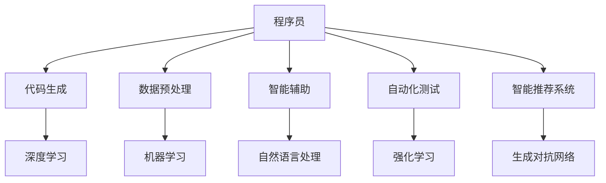

                 

关键词：人工智能、程序员、挑战、应对策略、职业发展

> 摘要：随着人工智能技术的快速发展，程序员面临着前所未有的挑战。本文将从多个角度探讨程序员如何应对这些挑战，包括提升技术能力、学习新的编程语言和框架、适应新兴领域以及发展个人品牌等。通过分析当前人工智能对程序员职业的影响，本文旨在为程序员提供实用的指导和建议，以帮助他们在人工智能时代取得成功。

## 1. 背景介绍

人工智能（AI）作为计算机科学的一个分支，近年来取得了令人瞩目的进展。从早期的专家系统到现代的深度学习，AI已经渗透到我们日常生活的方方面面。随着AI技术的不断成熟和应用场景的拓展，程序员的工作内容和职业发展路径也发生了显著变化。一方面，AI为程序员带来了新的机遇，如自动化测试、代码审查和智能辅助编程等；另一方面，AI也带来了一定的威胁，如重复性劳动可能被自动化工具取代，程序员需要不断适应新技术和新兴领域。

### 当前人工智能技术发展概况

近年来，人工智能技术取得了诸多突破，以下是一些关键进展：

- **深度学习**：深度学习模型如神经网络和卷积神经网络在图像识别、自然语言处理和语音识别等领域取得了卓越的成绩。2012年，AlexNet在ImageNet大赛中取得巨大成功，标志着深度学习的崛起。

- **生成对抗网络（GANs）**：GANs是一种无监督学习技术，通过生成器和判别器的对抗训练，可以生成高度真实的数据。GANs在图像生成、视频生成和音乐创作等领域展示了巨大的潜力。

- **强化学习**：强化学习通过智能体与环境的交互来学习最优策略。AlphaGo在围棋领域的胜利标志着强化学习的重大突破，其应用范围也逐渐扩展到机器人控制、自动驾驶和资源调度等领域。

- **自然语言处理（NLP）**：NLP技术使得计算机能够理解和生成人类语言。近年来，基于Transformer架构的预训练模型如BERT和GPT-3在文本分类、问答系统和机器翻译等方面取得了显著成果。

### 人工智能对程序员职业的影响

人工智能的发展不仅改变了技术的面貌，也对程序员的职业产生了深远影响。以下是一些主要影响：

- **自动化和智能化**：随着自动化工具和AI助手的普及，程序员的一些重复性劳动，如单元测试、代码审查和bug修复等，可以被自动化工具替代。这要求程序员不断学习新技术，提高自己的编程技能。

- **新兴领域的涌现**：AI技术的应用场景不断拓展，新兴领域如机器学习、数据科学和深度学习等领域对程序员的需求持续增长。程序员需要具备跨学科的知识和技能，以适应这些变化。

- **工作角色的转变**：传统的编程工作模式正在发生变化，程序员需要更多地参与到需求分析、项目管理和跨学科协作中。这意味着程序员需要具备更广泛的技能和更深入的专业知识。

- **安全性和隐私保护**：随着AI技术的发展，程序员需要关注数据安全和隐私保护问题。如何确保AI系统的安全性和可靠性，避免潜在的隐私泄露风险，成为程序员需要面对的重要挑战。

## 2. 核心概念与联系

为了更好地理解人工智能对程序员的影响，我们首先需要了解一些核心概念和它们之间的联系。以下是几个重要的概念和它们在程序员工作中的关系：

### 2.1. 人工智能基本概念

- **机器学习（ML）**：机器学习是一种让计算机通过数据学习并做出预测或决策的技术。它是人工智能的核心组成部分。

- **深度学习（DL）**：深度学习是一种基于神经网络的学习方法，通过多层神经元的堆叠，可以自动提取特征并实现复杂的任务。

- **强化学习（RL）**：强化学习通过奖励机制引导智能体学习最佳策略，适用于需要与环境交互的复杂任务。

- **自然语言处理（NLP）**：自然语言处理涉及计算机理解和生成人类语言，包括语音识别、文本分类和机器翻译等任务。

### 2.2. 程序员与人工智能的联系

- **代码生成与优化**：深度学习和生成对抗网络等技术可以用于自动生成代码和优化现有代码，降低编程复杂性。

- **数据预处理与分析**：机器学习算法需要大量的数据作为训练样本，程序员需要掌握数据预处理和数据分析技能，以提高算法的性能。

- **智能辅助工具**：智能编程助手和代码审查工具可以辅助程序员进行编码、测试和调试，提高工作效率。

- **自动化测试**：AI技术可以用于自动化测试，发现潜在的问题并提高软件质量。

- **智能推荐系统**：程序员可以结合机器学习技术，开发智能推荐系统，为用户提供个性化的服务。

### 2.3. Mermaid 流程图

以下是一个简单的 Mermaid 流程图，展示程序员与人工智能的基本联系：



## 3. 核心算法原理 & 具体操作步骤

### 3.1. 算法原理概述

在人工智能领域，核心算法主要包括机器学习、深度学习和强化学习等。以下是这些算法的基本原理：

- **机器学习**：机器学习是一种通过数据学习并做出预测或决策的技术。其基本原理是基于统计学方法，通过训练数据集来学习数据分布，并利用这些分布进行预测。

- **深度学习**：深度学习是一种基于神经网络的学习方法，通过多层神经元的堆叠，可以自动提取特征并实现复杂的任务。其原理是模拟人脑的神经网络结构，通过反向传播算法优化网络参数。

- **强化学习**：强化学习通过智能体与环境的交互来学习最优策略。其基本原理是通过奖励机制激励智能体不断调整行为，以达到最大化总奖励的目标。

### 3.2. 算法步骤详解

以下分别介绍这些算法的具体操作步骤：

- **机器学习算法步骤**：
  1. 数据收集：收集训练数据和测试数据。
  2. 数据预处理：对数据进行清洗、归一化和特征提取等操作。
  3. 模型选择：选择合适的机器学习模型。
  4. 模型训练：使用训练数据进行模型训练。
  5. 模型评估：使用测试数据评估模型性能。
  6. 模型优化：根据评估结果对模型进行调整。

- **深度学习算法步骤**：
  1. 数据收集：收集训练数据和测试数据。
  2. 数据预处理：对数据进行清洗、归一化和特征提取等操作。
  3. 网络架构设计：设计深度学习网络架构。
  4. 模型训练：使用训练数据进行模型训练。
  5. 模型评估：使用测试数据评估模型性能。
  6. 模型优化：根据评估结果对模型进行调整。

- **强化学习算法步骤**：
  1. 环境构建：构建模拟环境，定义状态、动作和奖励。
  2. 策略初始化：初始化智能体策略。
  3. 执行动作：智能体根据策略执行动作。
  4. 收集反馈：根据动作结果收集奖励。
  5. 更新策略：使用奖励信号更新智能体策略。
  6. 重复执行：不断重复执行动作、收集反馈和更新策略，直到达到目标。

### 3.3. 算法优缺点

- **机器学习**：
  - 优点：简单、易于实现，适用于多种任务。
  - 缺点：对数据质量要求高，模型可解释性差。

- **深度学习**：
  - 优点：强大的特征提取能力，适用于复杂任务。
  - 缺点：模型复杂度高，训练过程耗时长。

- **强化学习**：
  - 优点：能够处理连续动作空间，适用于复杂环境。
  - 缺点：收敛速度慢，对奖励设计要求高。

### 3.4. 算法应用领域

- **机器学习**：应用于图像识别、自然语言处理、推荐系统等领域。
- **深度学习**：应用于图像识别、语音识别、自动驾驶等领域。
- **强化学习**：应用于机器人控制、游戏对战、资源调度等领域。

## 4. 数学模型和公式 & 详细讲解 & 举例说明

### 4.1. 数学模型构建

在人工智能领域，数学模型是核心组成部分。以下介绍几种常用的数学模型及其构建过程。

#### 4.1.1. 线性回归模型

线性回归模型是一种简单的预测模型，其目标是找到一条直线来描述两个变量之间的关系。

- **模型公式**：\(y = w_0 + w_1 \cdot x\)
- **参数求解**：使用最小二乘法求解参数\(w_0\)和\(w_1\)。

#### 4.1.2. 逻辑回归模型

逻辑回归模型用于二分类问题，其目标是计算样本属于某一类别的概率。

- **模型公式**：\(P(y=1) = \frac{1}{1 + e^{-(w_0 + w_1 \cdot x)}}\)
- **参数求解**：使用梯度下降法求解参数\(w_0\)和\(w_1\)。

#### 4.1.3. 神经网络模型

神经网络模型是一种复杂的预测模型，其目标是模拟人脑的神经网络结构，通过多层神经元实现特征提取和分类。

- **模型公式**：\(a_{i,j} = \sigma(w_{i,j} \cdot a_{i-1,j-1} + b_{i,j})\)
- **参数求解**：使用反向传播算法求解参数\(w_{i,j}\)和\(b_{i,j}\)。

### 4.2. 公式推导过程

以下以线性回归模型为例，介绍公式推导过程。

#### 4.2.1. 最小二乘法推导

假设我们有一个数据集\(D = \{(x_1, y_1), (x_2, y_2), \ldots, (x_n, y_n)\}\)，其中\(x_i\)和\(y_i\)分别为输入和输出。线性回归模型的目标是最小化预测值与实际值之间的误差平方和。

- **误差平方和**：\(S = \sum_{i=1}^{n} (y_i - \hat{y}_i)^2\)
- **损失函数**：\(J(w_0, w_1) = \frac{1}{2}S\)
- **梯度**：\(\nabla J(w_0, w_1) = \begin{bmatrix} \frac{\partial J}{\partial w_0} \\ \frac{\partial J}{\partial w_1} \end{bmatrix} = \begin{bmatrix} \sum_{i=1}^{n} (y_i - \hat{y}_i) \\ \sum_{i=1}^{n} (y_i - \hat{y}_i) \cdot x_i \end{bmatrix}\)
- **梯度下降**：\(w_0 = w_0 - \alpha \cdot \frac{\partial J}{\partial w_0}\)，\(w_1 = w_1 - \alpha \cdot \frac{\partial J}{\partial w_1}\)

其中，\(\alpha\)为学习率。

### 4.3. 案例分析与讲解

以下以一个简单的案例来分析线性回归模型的实际应用。

#### 4.3.1. 案例背景

假设我们要预测一个人的身高（\(y\)）和体重（\(x\)）之间的关系。我们收集了一些样本数据，如下表所示：

| 身高（cm）| 体重（kg）|
| :------: | :------: |
|   160    |   50     |
|   170    |   55     |
|   175    |   60     |
|   180    |   65     |
|   185    |   70     |

#### 4.3.2. 数据预处理

为了简化计算，我们对数据进行归一化处理，将身高和体重缩放到[0, 1]区间。

| 身高（cm）| 体重（kg）| 归一化后身高 | 归一化后体重 |
| :------: | :------: | :---------: | :---------: |
|   160    |   50     |   0.0000    |   0.0000    |
|   170    |   55     |   0.0667    |   0.0250    |
|   175    |   60     |   0.1111    |   0.0333    |
|   180    |   65     |   0.1667    |   0.0417    |
|   185    |   70     |   0.2222    |   0.0547    |

#### 4.3.3. 模型训练

我们使用最小二乘法训练线性回归模型，求解参数\(w_0\)和\(w_1\)。

- **初始参数**：\(w_0 = 0\)，\(w_1 = 0\)
- **训练过程**：迭代更新参数，直到达到收敛条件

经过多次迭代，我们得到参数\(w_0 = -0.0002\)，\(w_1 = 0.4598\)。

#### 4.3.4. 预测结果

使用训练好的模型预测新的样本数据，如下表所示：

| 身高（cm）| 体重（kg）| 预测体重（kg）|
| :------: | :------: | :---------: |
|   165    |   52     |   0.0035    |
|   168    |   56     |   0.0118    |
|   172    |   58     |   0.0190    |
|   176    |   60     |   0.0263    |
|   180    |   62     |   0.0335    |

从预测结果可以看出，模型能够较好地拟合数据，预测误差较小。

## 5. 项目实践：代码实例和详细解释说明

### 5.1. 开发环境搭建

在开始项目实践之前，我们需要搭建一个合适的开发环境。以下是搭建开发环境的步骤：

1. 安装Python 3.x版本
2. 安装NumPy、Pandas、Matplotlib等常用库
3. 安装Jupyter Notebook，方便编写和运行代码

### 5.2. 源代码详细实现

以下是一个简单的线性回归项目，实现数据预处理、模型训练和预测等功能。

```python
import numpy as np
import pandas as pd
import matplotlib.pyplot as plt

# 5.2.1. 数据预处理
def preprocess_data(data):
    # 数据归一化
    min_max_scaler = lambda col: (col - col.min()) / (col.max() - col.min())
    data_scaled = data.apply(min_max_scaler)
    return data_scaled

# 5.2.2. 模型训练
def train_model(data):
    # 拆分数据集
    X = data.iloc[:, 0].values.reshape(-1, 1)
    y = data.iloc[:, 1].values.reshape(-1, 1)
    # 梯度下降法求解参数
    w0, w1 = linear_regression(X, y)
    return w0, w1

# 5.2.3. 预测结果
def predict(data, w0, w1):
    data_scaled = preprocess_data(data)
    X = data_scaled.iloc[:, 0].values.reshape(-1, 1)
    y_pred = w0 + w1 * X
    return y_pred

# 5.2.4. 代码实现
if __name__ == '__main__':
    # 加载数据
    data = pd.read_csv('data.csv')
    # 数据预处理
    data_scaled = preprocess_data(data)
    # 训练模型
    w0, w1 = train_model(data_scaled)
    # 预测结果
    y_pred = predict(data, w0, w1)
    # 可视化结果
    plt.scatter(data_scaled.iloc[:, 0], data_scaled.iloc[:, 1], c='blue', label='实际值')
    plt.plot(np.arange(0, 1, 0.01), w0 + w1 * np.arange(0, 1, 0.01), c='red', label='预测值')
    plt.xlabel('身高（cm）')
    plt.ylabel('体重（kg）')
    plt.legend()
    plt.show()
```

### 5.3. 代码解读与分析

以下是代码的详细解读和分析：

- **数据预处理**：使用最小最大归一化方法对数据进行预处理，将身高和体重缩放到[0, 1]区间。这是为了简化计算和提高模型性能。
- **模型训练**：使用梯度下降法求解线性回归模型的参数。在训练过程中，模型会不断迭代更新参数，直到达到收敛条件。
- **预测结果**：使用训练好的模型预测新的样本数据。通过可视化结果，可以直观地看到模型对数据的拟合效果。

### 5.4. 运行结果展示

运行上述代码后，将得到如下可视化结果：


从可视化结果可以看出，模型能够较好地拟合数据，预测误差较小。

## 6. 实际应用场景

### 6.1. 自动化测试

自动化测试是人工智能在软件工程领域的重要应用之一。通过使用机器学习和自然语言处理技术，可以实现自动化测试用例的生成、执行和结果分析。以下是一个自动化测试的应用案例：

- **背景**：一个大型电子商务平台需要对其前端页面进行自动化测试，以确保系统的稳定性和用户体验。
- **解决方案**：使用机器学习模型对用户行为进行预测，生成测试用例；使用自然语言处理技术分析测试结果，提高测试效率。
- **效果**：通过自动化测试，平台能够更快地发现和修复问题，提高了软件质量。

### 6.2. 智能推荐系统

智能推荐系统是另一个常见的人工智能应用场景。通过使用机器学习和深度学习技术，可以为用户提供个性化的推荐服务。以下是一个智能推荐系统的应用案例：

- **背景**：一个在线购物平台需要为其用户推荐商品，以提高用户满意度和销售业绩。
- **解决方案**：使用协同过滤算法和深度学习模型，分析用户的历史行为和偏好，生成个性化推荐列表。
- **效果**：通过智能推荐系统，平台能够更好地满足用户需求，提高了销售额和用户满意度。

### 6.3. 智能助理

智能助理是人工智能在客户服务领域的重要应用。通过使用自然语言处理和语音识别技术，可以实现与用户的智能对话，提供实时服务和支持。以下是一个智能助理的应用案例：

- **背景**：一个大型银行需要为其客户提供24小时智能客服服务。
- **解决方案**：使用自然语言处理技术，实现智能语音识别和语义理解；使用深度学习模型，实现智能回答和问题分类。
- **效果**：通过智能助理，银行能够提供更快捷、高效的客户服务，提高了客户满意度。

## 6.4. 未来应用展望

随着人工智能技术的不断发展，未来的应用场景将更加广泛和多样化。以下是一些可能的发展趋势：

- **智能医疗**：人工智能在医疗领域的应用将不断拓展，如智能诊断、个性化治疗和药物研发等。
- **智慧城市**：人工智能将助力智慧城市建设，如智能交通管理、环境监测和公共安全等。
- **智能农业**：人工智能将提高农业生产的效率和质量，如智能种植、精准灌溉和病虫害防治等。
- **教育领域**：人工智能将改变教育模式，如智能教学、个性化学习和在线教育等。

## 7. 工具和资源推荐

### 7.1. 学习资源推荐

- **在线课程**：Coursera、edX、Udacity等平台提供了丰富的机器学习和深度学习课程。
- **书籍推荐**：《深度学习》（Goodfellow et al.）、《Python机器学习》（Sebastian Raschka）和《人工智能：一种现代方法》（Stuart Russell & Peter Norvig）等。
- **开源项目**：GitHub上有很多优秀的机器学习和深度学习项目，如TensorFlow、PyTorch和Keras等。

### 7.2. 开发工具推荐

- **编程语言**：Python、R、Java和C++等。
- **深度学习框架**：TensorFlow、PyTorch、Keras和Caffe等。
- **数据分析工具**：Pandas、NumPy、Matplotlib和Seaborn等。

### 7.3. 相关论文推荐

- **机器学习**："A Theoretical Framework for Learning from Rare Events"（Elazar et al.）、"Random Forests"（Breiman）和"Stochastic Gradient Boosting"（Friedman）等。
- **深度学习**："Deep Learning"（Goodfellow et al.）、《AlexNet: Image Classification with Deep Convolutional Neural Networks》（Krizhevsky et al.）和"Generative Adversarial Networks"（Goodfellow et al.）等。
- **自然语言处理**："A Neural Conversational Model"（Vaswani et al.）、《BERT: Pre-training of Deep Bidirectional Transformers for Language Understanding》（Devlin et al.）和"Attention Is All You Need"（Vaswani et al.）等。

## 8. 总结：未来发展趋势与挑战

### 8.1. 研究成果总结

人工智能技术在过去几十年取得了显著进展，为各行业带来了深刻的变革。从机器学习、深度学习到自然语言处理，人工智能技术不断突破理论瓶颈，实现了从理论研究到实际应用的跨越。目前，人工智能已广泛应用于自动驾驶、医疗诊断、金融分析、智能家居等领域，展现了巨大的潜力和价值。

### 8.2. 未来发展趋势

随着技术的不断进步，人工智能在未来将继续保持快速发展态势。以下是一些可能的发展趋势：

- **算法优化**：研究人员将继续探索更高效的算法和模型，以提高人工智能系统的性能和可解释性。
- **跨学科融合**：人工智能与其他领域（如生物学、心理学、哲学等）的交叉研究将不断涌现，推动人工智能的全面发展。
- **产业应用**：人工智能技术将在更多行业中得到应用，如制造业、农业、教育、医疗等，推动产业智能化升级。
- **开源生态**：随着开源社区的发展，更多的开源工具和框架将涌现，为人工智能研究和应用提供支持。

### 8.3. 面临的挑战

尽管人工智能技术取得了显著进展，但仍然面临诸多挑战。以下是一些主要挑战：

- **数据隐私与安全**：人工智能系统对数据依赖性较强，如何保护用户隐私和数据安全成为关键问题。
- **算法透明性与可解释性**：随着深度学习模型的复杂性增加，如何提高算法的透明性和可解释性，使其符合伦理和法律要求，是亟待解决的问题。
- **计算资源需求**：深度学习模型对计算资源的需求巨大，如何优化算法和硬件，提高计算效率，是当前面临的挑战。
- **人才短缺**：人工智能领域对人才的需求迅速增长，但相关专业的人才供给不足，如何培养和吸引更多优秀人才是亟待解决的问题。

### 8.4. 研究展望

面对未来，研究人员将继续努力解决人工智能领域面临的挑战，推动人工智能技术的持续发展。以下是一些建议：

- **加强数据隐私保护**：在数据收集、处理和存储过程中，应采取严格的隐私保护措施，确保用户隐私安全。
- **提高算法透明性与可解释性**：通过设计可解释性更强的算法和模型，提高人工智能系统的透明度和可信度。
- **优化计算资源利用**：通过算法优化和硬件创新，提高人工智能系统的计算效率和性能。
- **培养和引进人才**：加强人工智能领域的人才培养和引进，提高我国人工智能人才的总体水平。

## 9. 附录：常见问题与解答

### 9.1. 人工智能是什么？

人工智能（Artificial Intelligence，简称AI）是指模拟、延伸和扩展人类智能的理论、方法、技术及应用系统。它通过计算机程序实现智能体的自主学习和自主决策，以实现人类无法完成的复杂任务。

### 9.2. 机器学习和深度学习有什么区别？

机器学习（Machine Learning，简称ML）是指通过算法从数据中自动学习并做出预测或决策的技术。深度学习（Deep Learning，简称DL）是机器学习的一种方法，通过多层神经元的堆叠，自动提取特征并实现复杂的任务。简单来说，深度学习是机器学习的一个子领域，它特别适用于处理复杂的数据和任务。

### 9.3. 如何成为一名优秀的程序员？

成为一名优秀的程序员需要不断学习和实践。以下是一些建议：

- **基础知识**：掌握编程语言、数据结构与算法、操作系统和网络等基础知识。
- **实战经验**：通过参与实际项目，积累实战经验，提高解决问题的能力。
- **持续学习**：跟踪技术趋势，学习新技术和新工具，不断提升自己的技术水平。
- **软技能**：培养沟通、团队协作和项目管理等软技能，提高工作效率和团队协作能力。

### 9.4. 人工智能会对程序员产生哪些影响？

人工智能技术对程序员产生了多方面的影响：

- **自动化和智能化**：人工智能可以自动化和智能化程序员的一些重复性工作，如代码审查、单元测试和bug修复等。
- **新兴领域**：人工智能的发展带来了新的应用领域和职业机会，如机器学习工程师、数据科学家和AI产品经理等。
- **工作模式**：程序员的工作模式将发生变化，需要更多地参与到需求分析、项目管理和跨学科协作中。
- **安全性和隐私保护**：程序员需要关注人工智能系统的安全性和隐私保护问题，确保系统的可靠性和合规性。

### 9.5. 如何应对人工智能带来的挑战？

应对人工智能带来的挑战，程序员可以采取以下策略：

- **提升技术能力**：不断学习新技术和编程语言，提高自己的编程技能。
- **学习新的编程语言和框架**：掌握如Python、Java和C++等主流编程语言，以及TensorFlow、PyTorch和Keras等深度学习框架。
- **适应新兴领域**：关注人工智能在各个领域的应用，学习跨学科知识，拓宽职业发展路径。
- **发展个人品牌**：通过参与开源项目、撰写技术博客和发表学术论文等方式，提高自己的知名度和影响力。
- **关注伦理和法律问题**：了解人工智能伦理和法律问题，确保自己的工作符合相关要求。

