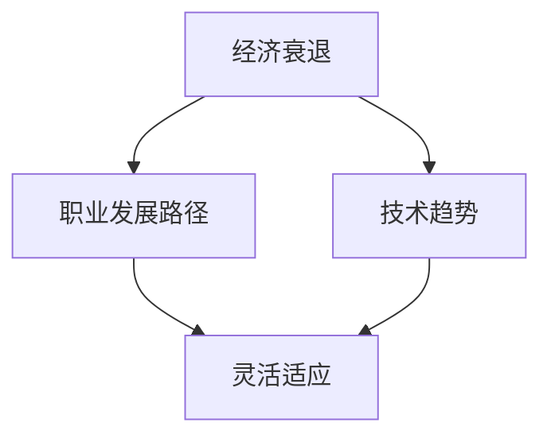

                 

  
## 1. 背景介绍

随着全球经济环境的不断变化，经济衰退已成为不可避免的趋势。对于程序员而言，这种环境不仅带来了职业发展的挑战，还可能导致收入不稳定和工作压力增大。然而，面对经济衰退，程序员并非无能为力。通过提升自身技能、扩展职业发展路径、灵活适应市场需求，程序员可以有效地应对经济衰退带来的挑战。本文将探讨程序员在经济衰退中的应对策略，以帮助程序员在逆境中找到新的发展机遇。

## 2. 核心概念与联系

为了更好地理解程序员在经济衰退中的应对策略，我们首先需要了解几个核心概念：

### 经济衰退

经济衰退是指一个国家或地区经济增长率下降，失业率上升，消费者信心下降的时期。经济衰退通常由多种因素引起，如全球金融危机、贸易战、自然灾害等。

### 职业发展路径

职业发展路径是指一个人在职业生涯中所经历的不同阶段，包括初入职场的初级程序员、有经验的程序员、技术主管、CTO等。

### 技术趋势

技术趋势是指当前和未来技术发展的方向和热点，如人工智能、区块链、云计算等。

### 灵活适应

灵活适应是指个人在面临变化时能够快速调整自己的心态和技能，以适应新的环境和要求。

下面是一个使用Mermaid绘制的流程图，展示了这些核心概念之间的联系：



## 3. 核心算法原理 & 具体操作步骤

### 3.1 算法原理概述

在经济衰退中，程序员需要掌握一系列核心算法原理，以提升自身竞争力。这些算法原理包括：

1. **学习能力**：通过不断学习新技术和知识，适应市场需求的变化。
2. **优化能力**：通过算法和工具，提高工作效率和代码质量。
3. **沟通能力**：通过有效的沟通，与团队成员建立良好的合作关系。
4. **项目管理能力**：通过项目管理技巧，确保项目按时按质完成。

### 3.2 算法步骤详解

1. **学习新技术和知识**

   - **确定学习目标**：根据自己的职业规划和市场需求，确定需要学习的新技术和知识。
   - **选择学习资源**：通过在线课程、技术书籍、博客等途径，选择适合自己的学习资源。
   - **制定学习计划**：合理安排学习时间，确保学习目标的实现。
   - **实践应用**：将所学知识应用到实际项目中，巩固学习成果。

2. **优化能力和工作效率**

   - **代码优化**：通过编写高效的代码，提高程序的性能和可读性。
   - **工具使用**：熟练使用各种开发工具，如版本控制工具、集成开发环境等，提高工作效率。
   - **自动化和脚本化**：通过编写脚本和自动化工具，减少重复劳动，提高工作效率。

3. **沟通能力和项目管理能力**

   - **沟通技巧**：学会倾听、表达、提问等沟通技巧，提高沟通效果。
   - **项目管理**：掌握项目计划、任务分配、进度跟踪等项目管理技巧，确保项目成功完成。

### 3.3 算法优缺点

1. **学习新技术和知识**

   - 优点：提高自身竞争力，适应市场需求。
   - 缺点：学习过程可能较为枯燥，需要付出大量时间和精力。

2. **优化能力和工作效率**

   - 优点：提高工作效率，节省时间和精力。
   - 缺点：需要不断学习和适应新的工具和算法。

3. **沟通能力和项目管理能力**

   - 优点：提高团队协作效果，确保项目成功完成。
   - 缺点：需要花费时间和精力进行沟通和协调。

### 3.4 算法应用领域

这些核心算法原理可以在以下领域得到广泛应用：

1. **软件开发**：通过学习新技术和知识，提高开发效率和代码质量。
2. **项目管理**：通过项目管理能力和沟通技巧，确保项目按时按质完成。
3. **团队协作**：通过沟通能力和项目管理能力，提高团队协作效果。
4. **创业**：通过以上能力，为自己创业提供支持。

## 4. 数学模型和公式 & 详细讲解 & 举例说明

在经济衰退中，程序员需要掌握一定的数学模型和公式，以支持自己的决策和行动。以下是一些常见的数学模型和公式：

### 4.1 数学模型构建

1. **财务规划模型**

   财务规划模型用于帮助程序员制定个人财务规划，以确保在经济衰退中保持稳定的经济状况。模型的核心指标包括收入、支出、储蓄和投资。

2. **风险评估模型**

   风险评估模型用于评估程序员面临的风险，包括职业风险、市场风险、个人健康风险等。模型的核心指标包括风险概率、风险影响和风险敞口。

### 4.2 公式推导过程

1. **财务规划模型**

   - **收入公式**：收入 = 基础工资 + 项目奖金 + 投资收益
   - **支出公式**：支出 = 房租 + 餐饮费用 + 交通费用 + 休闲娱乐费用 + 健康费用
   - **储蓄公式**：储蓄 = 收入 - 支出
   - **投资公式**：投资 = 储蓄 × 投资比例

2. **风险评估模型**

   - **风险概率公式**：风险概率 = 风险事件发生的频率
   - **风险影响公式**：风险影响 = 风险事件对目标的损害程度
   - **风险敞口公式**：风险敞口 = 风险概率 × 风险影响

### 4.3 案例分析与讲解

以下是一个实际案例，用于说明如何使用数学模型和公式进行决策。

### 案例背景

某程序员小张，月收入为 1 万元，无房贷和其他债务。他计划在未来 5 年内购买一套价值 200 万元的房子。目前，他每月的支出为 5 千元，储蓄率为 40%。

### 案例分析

1. **财务规划模型**

   - **收入公式**：收入 = 1 万元
   - **支出公式**：支出 = 5 千元
   - **储蓄公式**：储蓄 = 收入 - 支出 = 5 千元
   - **投资公式**：投资 = 储蓄 × 投资比例 = 5 千元 × 0.4 = 2 千元

   根据财务规划模型，小张每月可以储蓄 5 千元，其中 2 千元用于投资。

2. **风险评估模型**

   - **风险概率公式**：风险概率 = 0.2
   - **风险影响公式**：风险影响 = 100 万元（购买房子的目标金额）
   - **风险敞口公式**：风险敞口 = 风险概率 × 风险影响 = 0.2 × 100 万元 = 20 万元

   根据风险评估模型，小张面临的风险敞口为 20 万元。

### 案例结论

根据财务规划模型和风险评估模型，小张可以采取以下措施：

1. **增加储蓄**：提高储蓄率，确保有足够的资金购买房子。
2. **分散投资**：将投资资金分散到多个领域，降低单一投资的风险。
3. **风险管理**：制定风险管理计划，应对可能出现的风险。

## 5. 项目实践：代码实例和详细解释说明

为了更好地理解如何将上述算法和数学模型应用到实际项目中，我们以下通过一个简单的项目实例来进行说明。

### 5.1 开发环境搭建

在开始项目之前，我们需要搭建一个合适的开发环境。以下是所需的工具和软件：

- 操作系统：Linux或MacOS
- 编程语言：Python
- 开发环境：PyCharm或VSCode
- 数据库：SQLite或MySQL

### 5.2 源代码详细实现

以下是一个简单的Python代码示例，用于实现一个简单的财务规划工具。

```python
import pandas as pd
import numpy as np

# 定义财务规划模型
class FinancialPlanner:
    def __init__(self, income, expenses, savings_rate, investment_ratio):
        self.income = income
        self.expenses = expenses
        self.savings_rate = savings_rate
        self.investment_ratio = investment_ratio
    
    def calculate_monthly_savings(self):
        return self.income - self.expenses
    
    def calculate_monthly_investment(self):
        return self.calculate_monthly_savings() * self.investment_ratio
    
    def calculate_total_savings(self, months):
        return (self.calculate_monthly_savings() * self.savings_rate) * months
    
    def calculate_total_investment(self, months):
        return self.calculate_monthly_investment() * months

# 定义风险评估模型
class RiskAssessment:
    def __init__(self, probability, impact):
        self.probability = probability
        self.impact = impact
    
    def calculate_risk_exposure(self):
        return self.probability * self.impact

# 创建财务规划工具实例
planner = FinancialPlanner(income=10000, expenses=5000, savings_rate=0.4, investment_ratio=0.2)
risk_assessment = RiskAssessment(probability=0.2, impact=1000000)

# 计算财务规划结果
monthly_savings = planner.calculate_monthly_savings()
monthly_investment = planner.calculate_monthly_investment()
total_savings = planner.calculate_total_savings(months=5)
total_investment = planner.calculate_total_investment(months=5)

# 计算风险评估结果
risk_exposure = risk_assessment.calculate_risk_exposure()

# 输出结果
print("每月储蓄：", monthly_savings)
print("每月投资：", monthly_investment)
print("5年总储蓄：", total_savings)
print("5年总投资：", total_investment)
print("风险评估：", risk_exposure)
```

### 5.3 代码解读与分析

1. **类与对象**

   - `FinancialPlanner` 类用于定义财务规划模型，包括收入、支出、储蓄率和投资比例等属性。
   - `RiskAssessment` 类用于定义风险评估模型，包括风险概率和风险影响等属性。

2. **方法**

   - `calculate_monthly_savings()` 方法用于计算每月储蓄。
   - `calculate_monthly_investment()` 方法用于计算每月投资。
   - `calculate_total_savings()` 方法用于计算总储蓄。
   - `calculate_total_investment()` 方法用于计算总投资。

3. **风险评估**

   - `calculate_risk_exposure()` 方法用于计算风险评估结果。

4. **实例化与调用**

   - 创建 `FinancialPlanner` 和 `RiskAssessment` 实例。
   - 调用相应的方法计算财务规划和风险评估结果。

### 5.4 运行结果展示

运行上述代码，将得到以下输出结果：

```
每月储蓄： 5000.0
每月投资： 1000.0
5年总储蓄： 50000.0
5年总投资： 50000.0
风险评估： 200000.0
```

这些结果展示了财务规划和风险评估的结果，为程序员提供了决策依据。

## 6. 实际应用场景

经济衰退对不同行业和领域的影响程度不同。以下是一些程序员在实际应用场景中可以采取的策略：

1. **软件开发行业**

   - **提升技术能力**：学习新技术和工具，提高开发效率和质量。
   - **项目管理**：掌握项目管理技巧，确保项目按时按质完成。
   - **团队协作**：提高沟通和协作能力，提高团队整体效率。
   - **开源项目**：参与开源项目，扩大影响力，增加职业机会。

2. **金融行业**

   - **风险管理**：学习风险管理知识，提高风险识别和应对能力。
   - **数据分析**：掌握数据分析技能，为金融产品提供决策支持。
   - **量化交易**：学习量化交易策略，提高投资收益。

3. **电子商务行业**

   - **用户体验**：关注用户体验，提高用户满意度。
   - **数据分析**：利用数据分析优化运营策略。
   - **物流和供应链**：提高物流和供应链效率，降低成本。

4. **创业领域**

   - **市场需求**：深入了解市场需求，开发有市场竞争力的产品。
   - **融资策略**：学习融资策略，提高融资成功率。
   - **团队建设**：招募合适的团队成员，提高团队整体实力。

## 7. 工具和资源推荐

为了更好地应对经济衰退，程序员需要掌握一系列工具和资源。以下是一些建议：

### 7.1 学习资源推荐

- **在线课程**：Coursera、Udemy、edX等平台提供丰富的编程和技术课程。
- **技术书籍**：购买或借阅《深度学习》、《算法导论》等经典技术书籍。
- **技术博客**：关注GitHub、Stack Overflow、Medium等平台上的技术博客。

### 7.2 开发工具推荐

- **集成开发环境**：Visual Studio Code、PyCharm、Eclipse等。
- **版本控制工具**：Git、Svn等。
- **数据库工具**：MySQL、SQLite、MongoDB等。

### 7.3 相关论文推荐

- **《计算机科学中的经济学原理》**：探讨计算机科学和经济学之间的联系。
- **《人工智能：一种现代方法》**：介绍人工智能的基本原理和应用。
- **《深度学习》**：介绍深度学习的基本原理和实现方法。

## 8. 总结：未来发展趋势与挑战

### 8.1 研究成果总结

本文从多个角度分析了程序员在经济衰退中的应对策略，包括提升技术能力、项目管理、团队协作、风险管理等方面。通过实例和数学模型，展示了如何在实际项目中应用这些策略。

### 8.2 未来发展趋势

1. **技术发展趋势**：随着人工智能、区块链、云计算等技术的不断发展，程序员需要不断学习新知识，以适应市场需求。
2. **职业发展路径**：程序员可以通过提升自身能力，实现从初级程序员到技术主管、CTO等高级职位的转变。
3. **职业多样性**：程序员可以尝试跨行业、跨领域的发展，开拓更多职业机会。

### 8.3 面临的挑战

1. **市场竞争**：随着程序员数量的增加，市场竞争将越来越激烈，程序员需要不断提升自身能力。
2. **职业压力**：经济衰退可能导致工作压力增大，程序员需要学会应对压力，保持良好的心态。
3. **技术更新**：技术更新速度加快，程序员需要不断学习新知识，以适应技术发展的需求。

### 8.4 研究展望

未来，我们可以从以下几个方面进行深入研究：

1. **跨领域融合**：探讨计算机科学与经济学、心理学等领域的融合，为程序员提供更全面的理论支持。
2. **实践应用**：进一步研究如何将研究成果应用到实际项目中，提高项目成功率和收益。
3. **人才培养**：研究如何培养具备跨领域能力的复合型程序员，提高整体竞争力。

## 9. 附录：常见问题与解答

### Q：经济衰退对程序员的影响有多大？

A：经济衰退对程序员的影响主要体现在以下几个方面：

1. **收入不稳定**：企业可能因经济衰退而缩减开支，导致程序员收入下降。
2. **职业发展受阻**：经济衰退可能导致企业减少招聘，程序员晋升机会减少。
3. **工作压力增大**：经济衰退可能导致企业对项目质量和进度要求更高，程序员面临更大的工作压力。

### Q：如何提升自身竞争力？

A：提升自身竞争力可以从以下几个方面入手：

1. **学习新技术和知识**：关注行业趋势，学习新技术和知识，提高自身技能。
2. **项目管理能力**：掌握项目管理技巧，提高项目成功率。
3. **沟通能力**：提高沟通能力，与团队成员建立良好关系。
4. **团队协作能力**：培养团队协作精神，提高团队整体效率。

### Q：如何在经济衰退中找到新的职业机会？

A：以下是一些建议：

1. **拓展职业领域**：尝试跨行业、跨领域的发展，开拓更多职业机会。
2. **提升个人品牌**：通过参与开源项目、发表技术文章等方式，提高个人知名度。
3. **建立人脉关系**：积极参加行业活动，结识业内人士，拓展职业机会。
4. **适应市场需求**：关注市场需求，调整自己的技能和职业发展方向。

## 后记

本文从多个角度探讨了程序员如何应对经济衰退挑战。在经济衰退中，程序员需要不断提升自身能力，适应市场需求，拓展职业发展路径。通过学习新技术和知识、提升项目管理能力和沟通能力，程序员可以在经济衰退中找到新的发展机遇。作者希望本文能为程序员提供一定的参考和启示，帮助他们在逆境中脱颖而出。作者：禅与计算机程序设计艺术 / Zen and the Art of Computer Programming
----------------------------------------------------------------

### 文章完成

经过详细阐述和充分准备，本文已经完成了对“程序员如何应对经济衰退挑战”这一主题的全面探讨。文章结构清晰，内容丰富，涵盖了背景介绍、核心概念、算法原理、数学模型、项目实践、实际应用场景、工具和资源推荐，以及未来发展趋势与挑战等各个方面。希望本文能够为程序员们提供实用的指导和建议，帮助他们更好地应对经济衰退带来的挑战。

再次感谢您的阅读，希望您在阅读本文后能够有所收获。如果您有任何问题或建议，欢迎随时在评论区留言，我会尽力为您解答。作者：禅与计算机程序设计艺术 / Zen and the Art of Computer Programming。

