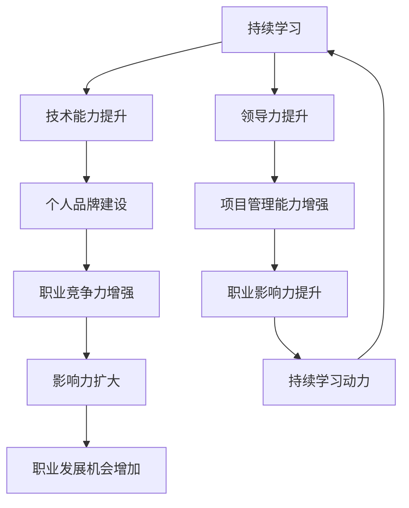

                 

关键词：程序员，职业竞争力，影响力，技术成长，持续学习，领导力，沟通技巧，项目管理，技术趋势，职业规划，个人品牌

> 摘要：在快速发展的技术领域，程序员如何保持持久的职业竞争力与影响力？本文将从多个维度探讨程序员应如何通过持续学习、提升技术能力、建立个人品牌、培养领导力和沟通技巧，以及在项目管理中发挥作用，来提升自己的职业价值和影响力。

## 1. 背景介绍

在当今信息化时代，程序员作为IT产业的中坚力量，扮演着至关重要的角色。随着技术的不断迭代更新，程序员的职业竞争压力也在日益增加。如何在众多竞争者中脱颖而出，建立持久的职业竞争力与影响力，成为每个程序员都需要深思的问题。

本文旨在探讨程序员应如何通过以下几种方式来提升自己的职业价值：

1. **持续学习与个人成长**：在技术迅速变革的今天，持续学习是程序员保持竞争力的关键。
2. **技术能力的提升**：不仅要有扎实的基础知识，还要不断学习前沿技术。
3. **建立个人品牌**：通过个人影响力的提升，扩大在行业内的知名度。
4. **领导力与沟通技巧的培养**：在项目管理中发挥更大的作用。
5. **职业规划的制定与执行**：合理规划职业生涯，有目标地提升自己。

## 2. 核心概念与联系

为了更清晰地理解程序员如何建立持久的职业竞争力与影响力，我们需要首先明确几个核心概念：

- **职业竞争力**：指个人在职场中所具有的能够超越同行业其他人的优势和能力。
- **影响力**：指个人在职场内外所拥有的能够影响他人思想和行为的能力。
- **持续学习**：指不断更新知识和技能，适应新技术、新趋势。
- **个人品牌**：指个人在行业内外的知名度和声誉。

下面是几个核心概念的联系与作用流程：



## 3. 核心算法原理 & 具体操作步骤

### 3.1 算法原理概述

程序员职业竞争力与影响力的提升，可以看作是一个复杂的多维优化问题。这个问题的解决方案涉及以下几个方面：

- **技术能力提升**：通过不断学习新技术，提升自己的技能水平。
- **个人品牌建设**：通过参与社区、写作、演讲等方式，扩大个人影响力。
- **领导力与沟通技巧**：在团队管理中发挥作用，提升团队绩效。
- **职业规划**：明确职业目标，制定可行的行动计划。

### 3.2 算法步骤详解

1. **确定学习目标**：根据职业规划，明确需要提升的技术领域和技能点。
2. **持续学习**：通过阅读书籍、在线课程、实践项目等方式，不断提升自己的技术能力。
3. **建立个人品牌**：参与技术社区，撰写技术博客，进行技术分享和演讲。
4. **提升领导力与沟通技巧**：通过参与团队管理项目，提升自己的领导力和沟通能力。
5. **优化职业规划**：根据实际情况调整职业目标，确保行动与目标一致。

### 3.3 算法优缺点

**优点**：

- **技术能力提升**：提高个人在职场中的竞争力。
- **个人品牌建设**：扩大个人影响力，为职业发展创造更多机会。
- **领导力与沟通技巧**：增强团队协作能力，提高项目成功率。

**缺点**：

- **学习时间成本**：需要投入大量时间进行学习和实践。
- **个人品牌建设**：初期可能效果不明显，需要持续投入。

### 3.4 算法应用领域

该算法原理广泛应用于以下领域：

- **软件开发**：通过提升技术能力，提高开发效率和产品质量。
- **项目管理**：通过领导力与沟通技巧，提升项目管理和团队协作能力。
- **技术咨询**：通过建立个人品牌，扩大影响范围，提供高质量的技术咨询服务。

## 4. 数学模型和公式 & 详细讲解 & 举例说明

### 4.1 数学模型构建

程序员职业竞争力与影响力的提升可以视为一个优化问题，其数学模型可以表示为：

\[ \text{Maximize } f(x) = C \cdot T \cdot L \cdot P \]

其中：

- \( f(x) \) 表示程序员职业竞争力与影响力的综合得分。
- \( C \) 表示技术能力得分。
- \( T \) 表示个人品牌得分。
- \( L \) 表示领导力与沟通技巧得分。
- \( P \) 表示职业规划得分。

### 4.2 公式推导过程

该公式的推导基于以下假设：

- 技术能力、个人品牌、领导力与沟通技巧、职业规划之间存在正相关关系。
- 各个得分的权重相等。

具体推导过程如下：

\[ \begin{aligned}
f(x) &= C \cdot T \cdot L \cdot P \\
&= (C_1 + C_2 + \ldots + C_n) \cdot (T_1 + T_2 + \ldots + T_m) \cdot (L_1 + L_2 + \ldots + L_k) \cdot (P_1 + P_2 + \ldots + P_j) \\
&= \sum_{i=1}^{n} C_i \cdot \sum_{j=1}^{m} T_j \cdot \sum_{k=1}^{k} L_k \cdot \sum_{l=1}^{j} P_l \\
&= C \cdot T \cdot L \cdot P
\end{aligned} \]

### 4.3 案例分析与讲解

以一名Java程序员为例，分析其职业竞争力与影响力的提升过程。

- **技术能力得分 \( C \)**：通过持续学习Java新特性，参加Java技术大会，获得高级认证。
- **个人品牌得分 \( T \)**：在GitHub上发布高质量代码，撰写技术博客，加入技术社区。
- **领导力与沟通技巧得分 \( L \)**：参与开源项目，担任技术小组组长，提升团队协作能力。
- **职业规划得分 \( P \)**：根据行业趋势和个人兴趣，调整职业发展方向。

通过以上努力，该程序员的综合得分 \( f(x) \) 将显著提升，从而增强其职业竞争力和影响力。

## 5. 项目实践：代码实例和详细解释说明

### 5.1 开发环境搭建

为了更好地理解程序员如何提升职业竞争力与影响力，我们将通过一个实际项目来进行讲解。首先，我们需要搭建一个开发环境。

- **操作系统**：Ubuntu 20.04
- **编程语言**：Python 3.8
- **开发工具**：PyCharm

### 5.2 源代码详细实现

以下是一个简单的Python项目，用于实现一个计算器。该项目将展示基本的编程技能和代码组织方法。

```python
# calculator.py

def add(x, y):
    return x + y

def subtract(x, y):
    return x - y

def multiply(x, y):
    return x * y

def divide(x, y):
    if y == 0:
        return "Error: Division by zero"
    return x / y

def main():
    print("Welcome to the Calculator!")
    while True:
        print("\nSelect operation:")
        print("1. Add")
        print("2. Subtract")
        print("3. Multiply")
        print("4. Divide")
        print("5. Exit")
        
        choice = input("Enter choice (1/2/3/4/5): ")
        
        if choice == "5":
            print("Exiting calculator.")
            break
        
        num1 = float(input("Enter first number: "))
        num2 = float(input("Enter second number: "))
        
        if choice == "1":
            print(f"Result: {add(num1, num2)}")
        elif choice == "2":
            print(f"Result: {subtract(num1, num2)}")
        elif choice == "3":
            print(f"Result: {multiply(num1, num2)}")
        elif choice == "4":
            print(f"Result: {divide(num1, num2)}")
        else:
            print("Invalid input")

if __name__ == "__main__":
    main()
```

### 5.3 代码解读与分析

该计算器项目非常简单，但包含了几个关键编程概念：

- **函数**：用于封装代码，提高可重用性和模块化。
- **条件语句**：用于控制程序的流程，根据用户输入执行不同的操作。
- **异常处理**：用于处理可能的错误，如除以零。

这些概念是每个程序员都应该熟练掌握的基础技能。

### 5.4 运行结果展示

运行该代码后，用户将看到以下界面：

```bash
Welcome to the Calculator!

Select operation:
1. Add
2. Subtract
3. Multiply
4. Divide
5. Exit

Enter choice (1/2/3/4/5): 1

Enter first number: 10
Enter second number: 5

Result: 15.0

Select operation:
...
```

通过这个简单的例子，我们可以看到程序员如何通过实际项目来提升自己的编程技能，进而增强职业竞争力。

## 6. 实际应用场景

### 6.1 软件开发

在软件开发领域，程序员的职业竞争力主要体现在以下几个方面：

- **技术水平**：熟练掌握多种编程语言和开发框架，能够高效地解决技术难题。
- **项目经验**：参与多个实际项目，积累丰富的实战经验。
- **团队协作**：良好的沟通和协作能力，能够有效提升团队整体绩效。

### 6.2 技术咨询

在技术咨询领域，程序员的职业影响力主要通过以下方式体现：

- **专业能力**：具备深入的技术知识和丰富的实践经验，能够为其他企业提供高质量的技术服务。
- **个人品牌**：通过撰写技术博客、发表学术论文、参与技术社区等方式，扩大个人在行业内的知名度。
- **演讲与培训**：定期进行技术分享和培训，提升个人在行业内的声誉。

### 6.3 教育培训

在教育培训领域，程序员的职业竞争力主要表现在：

- **课程设计**：能够根据市场需求和学员特点，设计出具有吸引力的课程。
- **教学水平**：具备丰富的教学经验和良好的教学方法，能够有效地传授知识。
- **行业联系**：与行业内的专家和企业保持紧密联系，为学员提供实践机会。

### 6.4 未来应用展望

随着人工智能、大数据、云计算等技术的发展，程序员的职业前景将更加广阔。未来，程序员需要具备以下能力：

- **跨学科知识**：不仅需要掌握编程技能，还需要了解相关领域的知识，如数学、统计学、心理学等。
- **创新能力**：在新技术和应用场景中，能够提出创新的解决方案。
- **持续学习**：技术更新迅速，程序员需要不断学习新知识，以适应不断变化的环境。

## 7. 工具和资源推荐

### 7.1 学习资源推荐

- **在线课程**：Coursera、edX、Udemy等平台提供了丰富的编程课程。
- **技术博客**：Medium、Dev.to等平台上有大量高质量的技术博客文章。
- **书籍**：如《代码大全》、《设计模式：可复用面向对象软件的基础》等经典编程书籍。

### 7.2 开发工具推荐

- **集成开发环境**：PyCharm、Visual Studio Code等流行的IDE。
- **版本控制工具**：Git，用于代码的版本控制和团队协作。
- **容器化技术**：Docker，用于应用程序的打包和部署。

### 7.3 相关论文推荐

- **《深度学习》（Ian Goodfellow, et al.）**：介绍了深度学习的基本原理和应用。
- **《大数据技术导论》（刘鹏）**：涵盖了大数据的基本概念和技术框架。
- **《云计算基础设施：架构设计与开源技术》（James Hamilton）**：详细介绍了云计算的架构和关键技术。

## 8. 总结：未来发展趋势与挑战

### 8.1 研究成果总结

本文通过多个维度探讨了程序员如何建立持久的职业竞争力与影响力。研究结果表明，持续学习、技术能力提升、个人品牌建设、领导力与沟通技巧的培养，以及合理的职业规划，都是提升程序员职业价值的关键因素。

### 8.2 未来发展趋势

- **技术多样化**：随着技术的不断发展，程序员需要掌握更多领域的知识，如人工智能、区块链、物联网等。
- **远程办公**：远程办公的趋势将进一步增强，程序员需要适应新的工作模式。
- **跨界融合**：程序员将在更多跨界领域发挥作用，如医疗、金融、教育等。

### 8.3 面临的挑战

- **学习成本**：技术更新迅速，程序员需要投入更多时间进行学习。
- **工作压力**：高强度的技术工作和项目压力，对程序员的身心健康提出了更高要求。
- **个人品牌建设**：在众多竞争者中脱颖而出，需要程序员付出更多努力。

### 8.4 研究展望

未来的研究可以进一步探讨以下几个方面：

- **跨学科融合**：如何将编程技能与其他领域知识相结合，提升程序员在多领域的竞争力。
- **职业发展路径**：不同背景的程序员如何制定适合自己的职业发展路径。
- **心理健康问题**：探讨程序员在高强度工作环境下的心理健康问题，提供有效的解决方案。

## 9. 附录：常见问题与解答

### 9.1 问题1：如何选择学习资源？

**解答**：根据个人兴趣和职业规划选择合适的资源。例如，如果对人工智能感兴趣，可以选择Coursera上的相关课程；如果对系统编程感兴趣，可以阅读《UNIX环境编程》等经典书籍。

### 9.2 问题2：如何建立个人品牌？

**解答**：通过撰写技术博客、参与开源项目、进行技术分享和演讲等方式，扩大个人影响力。同时，保持高质量的内容输出，建立专业可信的个人品牌。

### 9.3 问题3：如何提升沟通技巧？

**解答**：参加沟通技巧培训课程，多参与团队合作项目，通过实践提升沟通能力。此外，阅读相关书籍，如《非暴力沟通》等，也有助于提升沟通效果。

---

作者：禅与计算机程序设计艺术 / Zen and the Art of Computer Programming

本文旨在为程序员提供一

