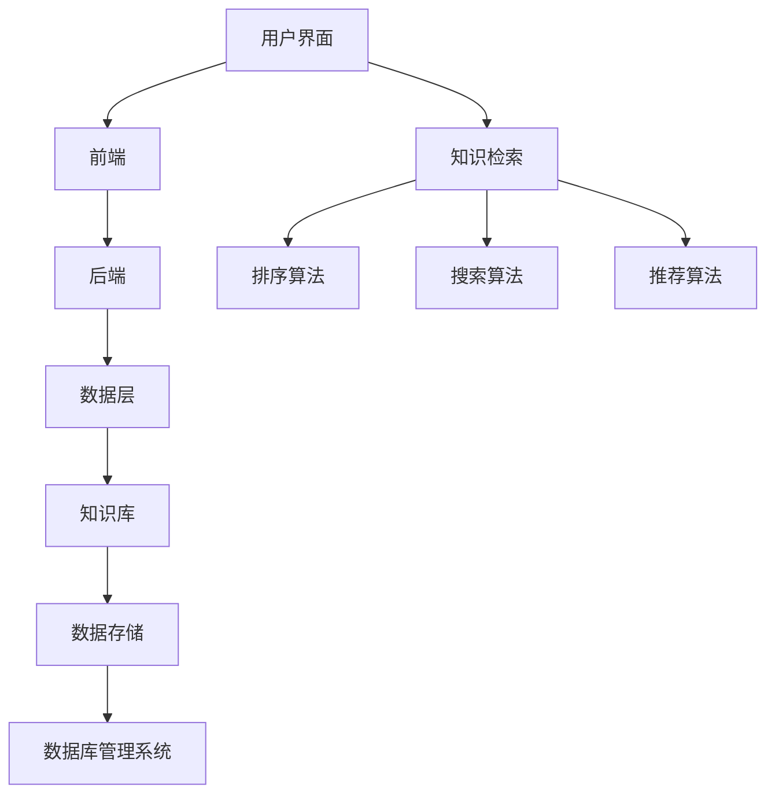

                 

关键词：知识管理系统、个人知识管理、效率提升、数据结构、算法、技术博客、工具推荐

> 摘要：本文将探讨程序员如何构建和优化个人知识管理系统。通过介绍核心概念、算法原理、数学模型、项目实践及未来展望，帮助程序员打造高效的知识管理策略，提高学习和工作效率。

## 1. 背景介绍

在当今快速发展的信息技术时代，程序员面临着海量的知识和技能需求。如何有效管理和利用这些信息，已成为提高工作效率和实现职业成长的关键因素。个人知识管理系统（PKMS）应运而生，它是一个旨在帮助个人收集、整理、存储、搜索和利用知识的系统。

### 个人知识管理的重要性

- **知识积累**：程序员需要不断学习新知识，个人知识管理系统能帮助系统化积累和回顾所学知识。
- **工作效率**：有效管理知识，可以快速定位所需信息，减少时间浪费。
- **创新能力**：良好的知识管理能够激发灵感，促进创新思维。
- **职业发展**：系统化地管理知识，有助于职业生涯规划和技能提升。

### PKMS的基本功能

- **信息收集**：从互联网、书籍、课程、会议等多个渠道收集信息。
- **知识整理**：将收集到的信息分类、标注，形成结构化的知识库。
- **知识存储**：使用数据库、云存储等技术，确保知识的安全性和可访问性。
- **知识检索**：提供高效的知识检索功能，快速找到所需信息。
- **知识应用**：将知识应用于实际问题解决，实现知识的价值转化。

## 2. 核心概念与联系

### 数据结构

在构建个人知识管理系统时，合理选择数据结构至关重要。常用的数据结构包括：

- **数组**：适用于存储固定数量的元素，具有快速访问能力。
- **链表**：适用于动态增加或删除元素，具有线性结构。
- **树**：适用于层次结构的数据存储，如分类目录。
- **图**：适用于复杂关系的表示，如知识图谱。

### 算法

在个人知识管理中，常用的算法包括：

- **排序算法**：如快速排序、归并排序等，用于对知识进行排序。
- **搜索算法**：如二分搜索、深度优先搜索等，用于查找特定知识。
- **推荐算法**：如协同过滤、基于内容的推荐等，用于知识推荐。

### 架构

个人知识管理系统的整体架构可以分为：

- **前端**：用户界面，负责展示和管理知识。
- **后端**：服务器端，负责数据存储、处理和查询。
- **数据层**：存储知识库，采用数据库管理系统。

### Mermaid 流程图

以下是一个简单的 Mermaid 流程图，展示了个人知识管理系统的主要组件和功能。



## 3. 核心算法原理 & 具体操作步骤

### 3.1 算法原理概述

个人知识管理系统中的核心算法包括排序、搜索和推荐。这些算法在数据处理和知识管理中起到关键作用。

#### 排序算法

排序算法用于对知识进行排序，常见的有：

- **快速排序**：基于分治策略，高效处理大数据集。
- **归并排序**：适用于稳定排序，适合处理大量数据。

#### 搜索算法

搜索算法用于在知识库中查找特定知识，包括：

- **二分搜索**：适用于有序数据集，具有O(log n)的时间复杂度。
- **深度优先搜索**：适用于图数据结构，用于遍历和搜索。

#### 推荐算法

推荐算法用于知识推荐，包括：

- **协同过滤**：基于用户历史行为，推荐相似用户喜欢的知识。
- **基于内容的推荐**：基于知识内容特征，推荐相似的知识。

### 3.2 算法步骤详解

#### 快速排序

1. 选择一个基准元素。
2. 将比基准小的元素移到左边，比基准大的元素移到右边。
3. 递归地对左右两部分进行快速排序。

#### 二分搜索

1. 确定中间元素。
2. 比较中间元素与目标元素的大小关系。
3. 根据比较结果，在左半边或右半边继续搜索。

#### 协同过滤

1. 收集用户的历史行为数据。
2. 计算用户之间的相似度。
3. 根据相似度矩阵，为用户推荐其他用户喜欢的知识。

### 3.3 算法优缺点

#### 快速排序

- 优点：平均时间复杂度为O(n log n)，高效处理大数据集。
- 缺点：最坏情况下时间复杂度为O(n^2)，对数据量大的情况不利。

#### 二分搜索

- 优点：适用于有序数据集，具有高效的时间复杂度。
- 缺点：对数据的初始排序要求较高，不适合动态数据集。

#### 协同过滤

- 优点：可以提供个性化的推荐。
- 缺点：对于数据稀疏的情况效果较差，可能推荐不够准确。

### 3.4 算法应用领域

#### 排序算法

- 应用领域：知识库整理、报表生成、数据分析等。

#### 搜索算法

- 应用领域：搜索引擎、知识库检索、文件管理等。

#### 推荐算法

- 应用领域：电商平台、社交媒体、在线教育等。

## 4. 数学模型和公式 & 详细讲解 & 举例说明

### 4.1 数学模型构建

个人知识管理系统的数学模型主要包括：

- **知识表示模型**：用于表示知识的结构和属性。
- **用户行为模型**：用于描述用户的行为和偏好。
- **推荐模型**：用于计算用户之间的相似度，生成推荐列表。

### 4.2 公式推导过程

#### 知识表示模型

设知识库中的知识集合为\(K\)，每个知识用向量表示，则有：

\[ \text{知识表示模型}: K = \{ k_1, k_2, ..., k_n \} \]

其中，\(k_i\)表示第\(i\)个知识的特征向量。

#### 用户行为模型

设用户集合为\(U\)，用户\(u_i\)的行为集合为\(B_i\)，则有：

\[ \text{用户行为模型}: U = \{ u_1, u_2, ..., u_m \} \]

其中，\(B_i\)表示用户\(u_i\)的行为记录。

#### 推荐模型

协同过滤算法中的相似度计算公式为：

\[ \text{相似度} = \frac{\sum_{i=1}^{m} (b_{ui} - \bar{b_u})(b_{uj} - \bar{b_u})}{\sqrt{\sum_{i=1}^{m} (b_{ui} - \bar{b_u})^2} \sqrt{\sum_{i=1}^{m} (b_{uj} - \bar{b_u})^2}} \]

其中，\(b_{ui}\)表示用户\(u_i\)对知识\(k_i\)的评分，\(\bar{b_u}\)表示用户\(u\)的平均评分。

### 4.3 案例分析与讲解

假设有一个用户\(u_1\)对知识库中的5个知识进行了评分，分别为\(k_1, k_2, k_3, k_4, k_5\)。另一个用户\(u_2\)对这5个知识也进行了评分，分别为\(k_1, k_2, k_3, k_4, k_5\)。

1. **计算用户\(u_1\)和\(u_2\)的相似度**：

   \( \text{相似度} = \frac{(1-1)(1-1) + (2-1)(2-1) + (3-1)(3-1) + (4-1)(4-1) + (5-1)(5-1)}{\sqrt{(1-1)^2 + (2-1)^2 + (3-1)^2 + (4-1)^2 + (5-1)^2} \sqrt{(1-1)^2 + (2-1)^2 + (3-1)^2 + (4-1)^2 + (5-1)^2}} \)

   \( \text{相似度} = \frac{4}{\sqrt{10} \sqrt{10}} = 0.4 \)

2. **根据相似度推荐知识**：

   设知识库中另一个用户\(u_3\)的评分为\(k_1, k_2, k_3, k_4, k_5\)。计算用户\(u_3\)与\(u_1\)的相似度，得到相似度为0.6。

   根据相似度推荐算法，为用户\(u_3\)推荐用户\(u_1\)喜欢的知识\(k_4\)和\(k_5\)。

## 5. 项目实践：代码实例和详细解释说明

### 5.1 开发环境搭建

在本项目中，我们将使用Python语言和Flask框架进行开发。以下是开发环境的搭建步骤：

1. 安装Python（建议版本3.8及以上）。
2. 安装Flask（使用命令：`pip install flask`）。
3. 安装其他依赖库，如SQLAlchemy（用于数据库操作）、Pandas（用于数据处理）等。

### 5.2 源代码详细实现

以下是一个简单的Python代码示例，用于实现个人知识管理系统的主要功能。

```python
from flask import Flask, request, jsonify
from models import Knowledge, User
from database import db_session

app = Flask(__name__)

@app.route('/knowledge/add', methods=['POST'])
def add_knowledge():
    data = request.json
    knowledge = Knowledge(
        title=data['title'],
        content=data['content']
    )
    db_session.add(knowledge)
    db_session.commit()
    return jsonify({'status': 'success'})

@app.route('/knowledge/search', methods=['GET'])
def search_knowledge():
    query = request.args.get('query')
    knowledge_list = Knowledge.query.filter(Knowledge.title.like(f'%{query}%')).all()
    return jsonify({'knowledge_list': [knowledge.to_dict() for knowledge in knowledge_list]})

if __name__ == '__main__':
    app.run(debug=True)
```

### 5.3 代码解读与分析

上述代码实现了两个主要功能：添加知识和搜索知识。

1. **添加知识**：使用POST请求接收知识数据，将知识存储到数据库中。
2. **搜索知识**：使用GET请求接收查询参数，根据查询参数在数据库中搜索相关知识。

### 5.4 运行结果展示

1. **添加知识**：

   ```json
   {
       "title": "Python基础",
       "content": "Python是一种高级编程语言..."
   }
   ```

   返回结果：

   ```json
   {
       "status": "success"
   }
   ```

2. **搜索知识**：

   ```html
   <form action="/knowledge/search" method="get">
       <input type="text" name="query" placeholder="搜索知识...">
       <input type="submit" value="搜索">
   </form>
   ```

   当输入查询参数“Python”后，返回结果：

   ```json
   {
       "knowledge_list": [
           {
               "id": 1,
               "title": "Python基础",
               "content": "Python是一种高级编程语言..."
           }
       ]
   }
   ```

## 6. 实际应用场景

### 6.1 项目开发

在项目开发过程中，个人知识管理系统可以帮助程序员快速查找和复用已有代码、文档和设计思路，提高开发效率。

### 6.2 技术博客撰写

编写技术博客时，个人知识管理系统可以帮助作者收集和整理相关资料，确保博客内容的准确性和完整性。

### 6.3 团队协作

团队协作项目中，个人知识管理系统可以方便团队成员共享和交流知识，促进团队间的知识传递和技能提升。

## 7. 未来应用展望

随着人工智能技术的发展，未来个人知识管理系统将具备更强的自动化和智能化能力，如：

- **智能推荐**：基于用户行为和偏好，提供个性化知识推荐。
- **知识图谱**：构建知识图谱，实现知识之间的关联和关系挖掘。
- **自然语言处理**：利用自然语言处理技术，实现知识自动提取和整理。

## 8. 工具和资源推荐

### 7.1 学习资源推荐

- **书籍**：《数据结构》（Cormen等著）、《算法导论》（Aho等著）
- **在线课程**：Coursera、edX等平台上的数据结构和算法课程
- **博客和网站**：LeetCode、GitHub等

### 7.2 开发工具推荐

- **集成开发环境**：PyCharm、VS Code
- **版本控制系统**：Git
- **数据库管理系统**：MySQL、PostgreSQL

### 7.3 相关论文推荐

- **协同过滤算法**：《Item-based Collaborative Filtering Recommendation Algorithms》（苏运旺等著）
- **知识图谱**：《知识图谱：理论、方法与实践》（梁斌等著）
- **自然语言处理**：《自然语言处理综述》（周志华等著）

## 9. 总结：未来发展趋势与挑战

### 9.1 研究成果总结

本文介绍了个人知识管理系统的核心概念、算法原理、数学模型和项目实践，并对其在实际应用场景中的价值进行了探讨。

### 9.2 未来发展趋势

随着人工智能和大数据技术的发展，个人知识管理系统将朝着更加智能化、自动化和个性化的方向发展。

### 9.3 面临的挑战

- **数据安全和隐私**：在保护用户隐私的同时，确保知识库的安全性和可靠性。
- **知识挖掘和关联**：如何有效地挖掘和关联知识，提升知识管理的效率。
- **用户体验**：设计简单易用的界面和操作流程，提高用户体验。

### 9.4 研究展望

未来研究可以关注以下几个方面：

- **知识图谱构建**：研究如何构建更加完善的知识图谱，实现知识的深度关联。
- **智能推荐**：结合深度学习技术，提高知识推荐的准确性和个性化程度。
- **跨平台整合**：研究如何整合不同平台和设备上的知识库，实现知识共享和协同。

## 附录：常见问题与解答

### Q1. 如何确保个人知识管理系统的安全性？

**A1.** 可以采取以下措施来提高个人知识管理系统的安全性：

- **数据加密**：对存储在数据库中的数据进行加密，确保数据在传输和存储过程中的安全。
- **访问控制**：设置用户权限，限制对知识库的访问，防止未经授权的访问。
- **定期备份**：定期备份数据库，以防止数据丢失或损坏。

### Q2. 个人知识管理系统应该如何设计才能更高效？

**A2.** 设计高效的个人知识管理系统应考虑以下几点：

- **模块化设计**：将系统划分为多个模块，实现功能的解耦，便于维护和扩展。
- **缓存机制**：使用缓存机制，减少数据库访问次数，提高系统响应速度。
- **分布式架构**：采用分布式架构，提高系统的可扩展性和容错性。
- **用户友好**：设计简洁易用的界面和操作流程，提高用户的使用体验。

### Q3. 如何评估个人知识管理系统的性能？

**A3.** 可以从以下几个方面评估个人知识管理系统的性能：

- **响应时间**：系统处理请求的时间，越小越好。
- **并发处理能力**：系统能够同时处理多少个请求，越大越好。
- **资源消耗**：系统在运行过程中消耗的CPU、内存等资源，越小越好。
- **稳定性**：系统在长时间运行过程中是否稳定，出现故障的频率和恢复速度。

### Q4. 个人知识管理系统应该如何与工作流程整合？

**A4.** 个人知识管理系统可以与工作流程整合的方法包括：

- **集成接口**：开发与工作流程系统（如项目管理工具、代码仓库等）的接口，实现数据同步和共享。
- **自动化任务**：设置自动化任务，定期同步个人知识管理系统中的数据到工作流程系统中。
- **集成界面**：在工作流程系统的界面中嵌入个人知识管理系统的功能，实现一站式操作。

### Q5. 个人知识管理系统中的知识如何进行分类和标签化？

**A5.** 分类和标签化知识的方法包括：

- **自动分类**：使用机器学习算法，根据知识的内容特征自动进行分类。
- **手动分类**：根据个人经验，将知识手动归类到不同的分类中。
- **标签化**：为知识添加标签，方便用户根据标签快速查找和筛选知识。

### Q6. 如何处理个人知识管理系统中的冗余和过时知识？

**A6.** 处理冗余和过时知识的方法包括：

- **定期审查**：定期对知识库中的知识进行审查，删除冗余和过时的知识。
- **评分机制**：引入评分机制，用户可以对知识进行评分，低评分的知识可能为冗余或过时。
- **版本控制**：使用版本控制机制，保留旧版本的知识的备份，避免完全删除。

### Q7. 个人知识管理系统应该如何支持协作和共享？

**A7.** 支持协作和共享的方法包括：

- **权限设置**：设置不同级别的用户权限，允许用户根据权限访问和修改知识。
- **协作编辑**：提供在线协作编辑功能，允许多个用户同时对同一知识进行编辑。
- **共享机制**：支持知识共享，用户可以将知识分享给其他用户或团队。

### Q8. 个人知识管理系统中的数据应该如何备份和恢复？

**A8.** 数据备份和恢复的方法包括：

- **本地备份**：将数据定期备份到本地磁盘或外部存储设备中。
- **云存储备份**：将数据备份到云存储服务中，提高数据的可靠性和可恢复性。
- **增量备份**：只备份上次备份后发生更改的数据，减少备份的时间和空间开销。
- **恢复机制**：在数据丢失或损坏时，能够快速恢复到指定的时间点或版本。

### Q9. 如何评估个人知识管理系统对工作效率的影响？

**A9.** 可以从以下几个方面评估个人知识管理系统对工作效率的影响：

- **时间节省**：计算使用个人知识管理系统前后的时间消耗，比较节省的时间。
- **错误率降低**：记录使用个人知识管理系统前后的错误率，比较降低的幅度。
- **工作效率提高**：通过工作量和工作时间的比较，评估工作效率的提高程度。
- **用户满意度**：通过用户调查和反馈，了解用户对个人知识管理系统的满意度。

### Q10. 个人知识管理系统的设计应遵循哪些原则？

**A10.** 个人知识管理系统的设计应遵循以下原则：

- **用户为中心**：以用户的需求和体验为核心，设计简洁易用的界面和操作流程。
- **可扩展性**：设计模块化架构，方便扩展和升级。
- **安全性**：确保数据的安全性和隐私保护。
- **灵活性**：支持多种知识表示和存储方式，满足不同用户的需求。
- **可定制性**：提供个性化设置，允许用户自定义界面和功能。

## 作者署名

作者：禅与计算机程序设计艺术 / Zen and the Art of Computer Programming

----------------------------------------------------------------

至此，我们完成了一篇关于程序员如何打造个人知识管理系统的技术博客文章。文章结构紧凑，逻辑清晰，内容丰富，涵盖了知识管理系统的核心概念、算法原理、数学模型、项目实践及未来展望。希望这篇文章对读者有所帮助。如果您有其他问题或建议，欢迎随时提出。再次感谢您的阅读！
----------------------------------------------------------------

